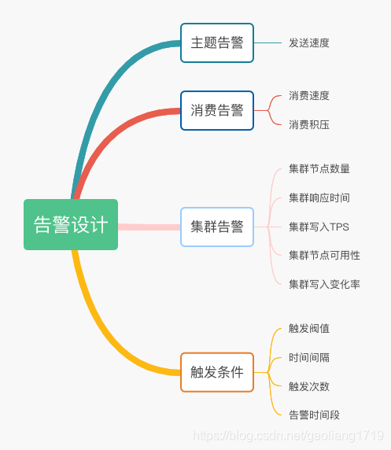
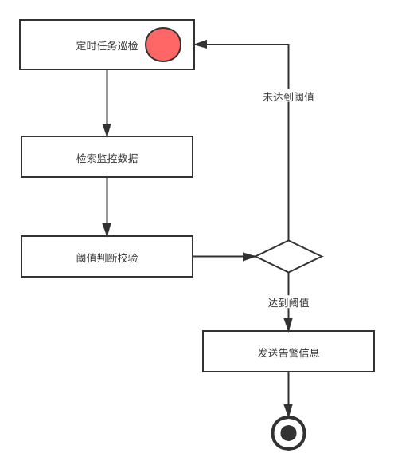
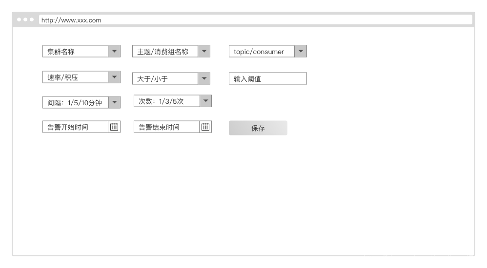

# 21 RocketMQ 集群告警

### 前言

对集群健康状况、使用主题、消费组资源的巡检，发现达到阈值则发送告警信息给管理员或者资源申请者。监控是告警的基础，告警的巡检基于前面两篇文章中监控采集到的数据。

告警的重要性不必过多地赘述，RocketMQ 集群往往承载着公司核心业务流转。如果集群不可用往往影响是全公司的业务，事故责任是公司最高级别的。

本文从告警项的设计、告警流程、告警实战给出指导建议，在实践中以此为思路扩展完善，实现自己公司的定制化告警。

### 告警项设计

下图分别从主题、消费组、集群维度罗列了比较重要的告警项以及触发条件包括哪些方面。



#### **触发条件**

- 触发阈值：超过某个特定的数值，例如：消费积压超过 10 万。
- 时间间隔：间隔多久检测，例如：5 分钟内消费积压超过 10 万。
- 触发次数：在时间间隔内满足阈值的次数，例如：5 分钟内消费积压超过 10 万，触发了 3 次。
- 告警时间段：收到告警通知的时间范围，例如：在 9:00-22:00 之间收到告警信息。

#### **主题告警**发送速度：当发送速度满足触发条件设定的阈值时发送告警信息

例如：5 分钟内当发送速度小于阈值 10，触发 1 次，在 00:00-23:59 触发告警信息。

#### **消费告警**消费速度：当消费速度满足触发条件设定的阈值时发送告警信息

例如：5 分钟内当消费速度小于阈值 5000，触发 1 次，在 00:00-23:59 触发告警信息。

消费积压：当消费积压值满足触发条件设定的阈值时发送告警信息。

例如：5 分钟内当消费积压大于阈值 100000，触发 1 次，在 00:00-23:59 触发告警信息。

#### **集群告警**集群节点数量：当集群节点数量满足触发条件设定的阈值时触发告警

例如：5 分钟内当集群节点数量小于阈值 4，触发 1 次，在 00:00-23:59 触发告警信息。

集群响应时间：当集群节点发送的 RT 满足触发条件的阈值时触发告警。

例如：5 分钟内当节点发送的响应时间大于 1 秒，触发 1 次，在 00:00-23:59 触发告警信息。

集群写入 TPS：当集群写入 TPS 满足触发条件设定的阈值时触发告警。

例如：5 分钟内当集群写入 TPS 大于 40000，触发 1 次，在 00:00-23:59 触发告警信息。

集群节点可用性：当集群节点心跳检测结果满足触发条件设定的阈值时触发告警。

例如：5 分钟内当节点心跳检测结果大于 0（表示失败），触发 1 次，在 00:00-23:59 触发告警信息。

集群写入变化率：当集群写入 TPS 变化率满足触发条件设定的阈值时触发告警。

例如：5 分钟内当集群写入变化率大于 100%，触发 1 次，在 00:00-23:59 触发告警信息。

#### 告警开发实战

#### **告警流程**定时任务巡检：可以使用公司的调度平台或者自己写调度线程 ScheduledExecutorService，调度的频率可以根据不同的指标分成不同的调度任务，例如：集群告警可以采取秒级探测、对于主题和消费组的告警可以采用分钟级探测

检索监控数据：数据来自于前面两节中存储的监控数据，例如：存储到了时序数据库 InfluxDB 中。

发送告警信息：此处可以发送到公司的统一告警系统，也可以发送到钉钉、邮箱、短信等。



#### **主题/消费动态 SQL**

我们可以通过在界面上配置不同的告警规则生成不同的检索语句，在定时调度时使用生成的语句。



通过类似上面图示中对主题和消费组的选择，动态生成 SQL 语句，例如：当选择以下动态规则参数时，集群名称 demo_cluster、消费组名称 demo_consumer、类型 consumer、指标积压、大于、阈值 1000000、间隔 5 分钟、次数 1 次、告警开始时间 00:00、告警结束时间 23:59 时生成以下语句。

```
select Count(value)  FROM "consumer_monitor_info" WHERE "clusterName" = 
```
