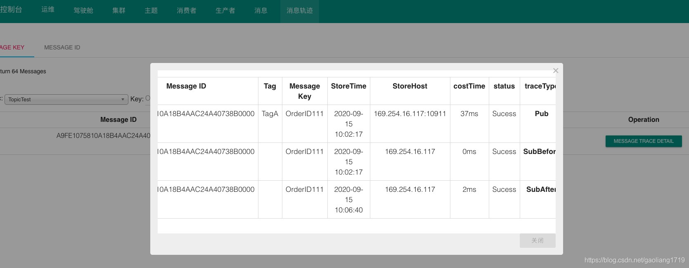
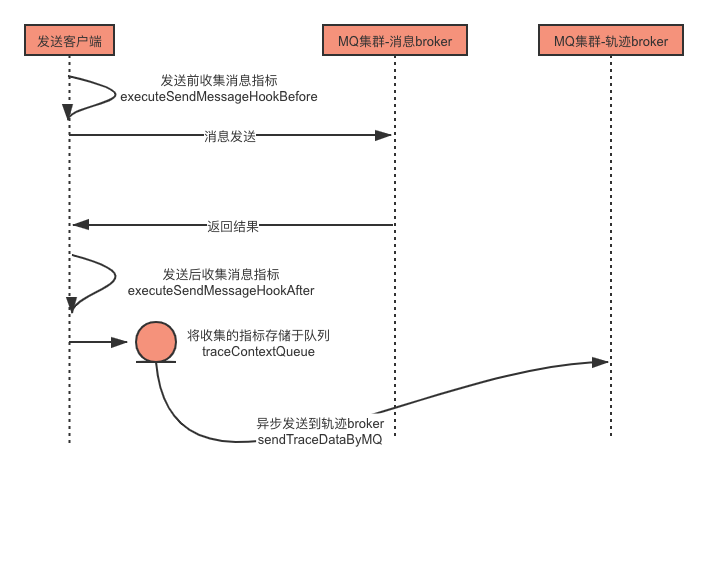
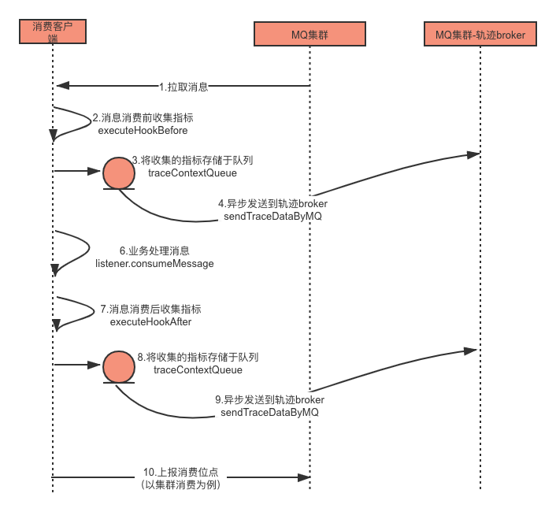
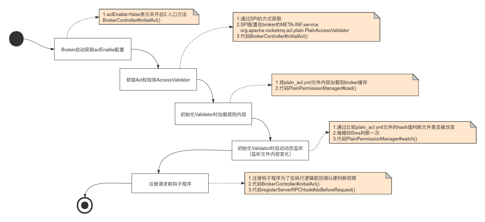
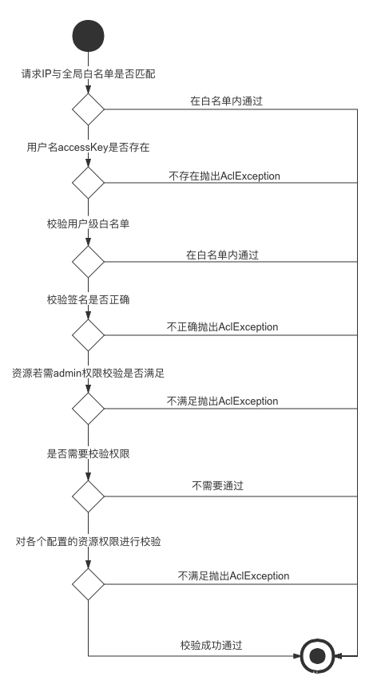
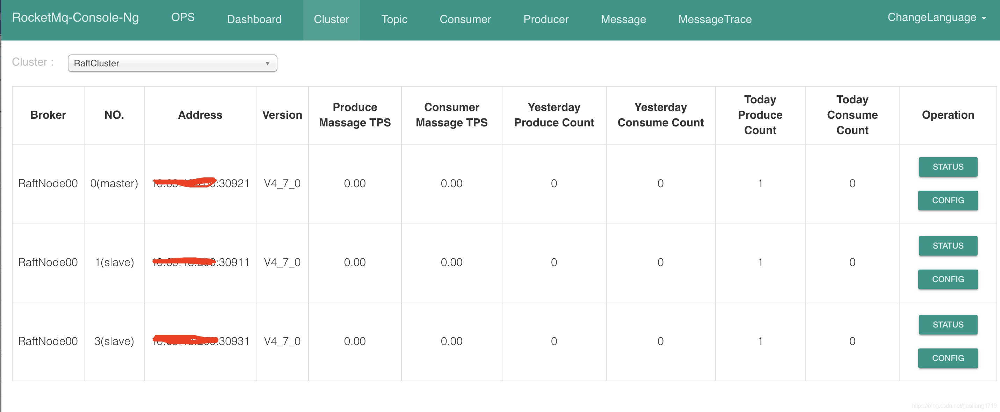
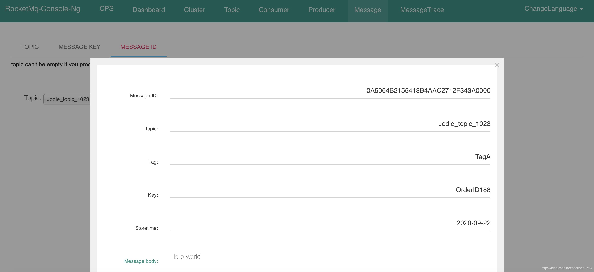

23 消息轨迹、ACL 与多副本搭建
==================

### 消息轨迹

#### **消息轨迹含义**一条消息什么时候由哪台机器产生的、发送的耗时、消息大小、发送状态、存储在哪个 Broker 上、什么时候存储的以及存储在哪台 Broker 上、什么时候消费的、消费状态等信息，这些信息即消息轨迹，用于追踪消息从诞生到被消费的整个生命周期

这些信息对于业务同学排查定位有着重要的意义，发送和消费往往在不同的业务部门。有了消息轨迹后一条消息有没有发送，发送成功了没，有没有消费一目了然，降低了彼此的沟通成本。

#### **消息轨迹使用 **** 1\. Broker 设置**RocketMQ 的默认消息轨迹功能默认是关闭的，可以将 Broker 属性 traceTopicEnable 设置为 true 开启。消息轨迹默认存储在 RMQ\_SYS\_TRACE\_TOPIC 的主题中，可以通过 msgTraceTopicName 修改

属性

默认参数

traceTopicEnable

false

msgTraceTopicName

RMQ\_SYS\_TRACE\_TOPIC**2\. 发送端使用 **** 发送轨迹 API**```
public DefaultMQProducer(final String producerGroup, boolean enableMsgTrace, final String customizedTraceTopic){

   this(null, producerGroup, null, enableMsgTrace, customizedTraceTopic);

}

```

说明：enableMsgTrace 是否开启发送轨迹，默认 false；customizedTraceTopic 设置收集消息轨迹的自定义主题，默认为 RMQ\_SYS\_TRACE\_TOPIC。** 发送代码示例 **```
public static void main(String[] args) throws MQClientException, InterruptedException {

        DefaultMQProducer producer = new DefaultMQProducer("ProducerGroupName",true);

        producer.setNamesrvAddr("127.0.0.1:9876");

        producer.start();


        for (int i = 0; i < 1; i++)

            try {

                Message msg = new Message("TopicTest",

                    "TagA",

                    "OrderID111",

                    "Hello world".getBytes(RemotingHelper.DEFAULT_CHARSET));

                SendResult sendResult = producer.send(msg);

                System.out.printf("%s%n", sendResult);


            } catch (Exception e) {

                e.printStackTrace();

            }


        producer.shutdown();

    }


```

说明：创建 DefaultMQProducer 时将 enableMsgTrace 设置为 true 开启发送消息轨迹。**3\. 消费端使用 **** 消费轨迹 API**```
public DefaultMQPushConsumer(final String consumerGroup, boolean enableMsgTrace, final String customizedTraceTopic) {

        this(null, consumerGroup, null, new AllocateMessageQueueAveragely(), enableMsgTrace, customizedTraceTopic);

}

```

说明：enableMsgTrace 是否开启消费轨迹，默认 false；customizedTraceTopic 设置收集消息轨迹的自定义主题，默认为 RMQ\_SYS\_TRACE\_TOPIC。** 消费代码示例**

```

public static void main(String[] args) throws InterruptedException, MQClientException {

        DefaultMQPushConsumer consumer = new DefaultMQPushConsumer("CID_JODIE_1",true);

        consumer.setNamesrvAddr("127.0.0.1:9876");

        consumer.subscribe("TopicTest", "*");

        consumer.setConsumeFromWhere(ConsumeFromWhere.CONSUME_FROM_FIRST_OFFSET);

        consumer.setConsumeTimestamp("20181109221800");

        consumer.registerMessageListener(new MessageListenerConcurrently() {


            @Override

            public ConsumeConcurrentlyStatus consumeMessage(List<MessageExt> msgs, ConsumeConcurrentlyContext context) {

                System.out.printf("%s Receive New Messages: %s %n", Thread.currentThread().getName(), msgs);

                return ConsumeConcurrentlyStatus.CONSUME_SUCCESS;

            }

        });

        consumer.start();

        System.out.printf("Consumer Started.%n");

}

```

说明：创建 DefaultMQPushConsumer 将 enableMsgTrace 设置为 true 开启消费消息轨迹。

**4\. 消息轨迹效果 **通过发送和消费一条消息，在 RocketMQ-Console 中看下消息轨迹的效果截图。** 发送消息内容 **```
SendResult [sendStatus=SEND_OK, msgId=A9FE1075810A18B4AAC24A40738B0000, offsetMsgId=A9FE107500002A9F0000000000002147, messageQueue=MessageQueue [topic=TopicTest, brokerName=liangyong, queueId=1], queueOffset=2]


```** 消费消息内容 **```
Receive New Messages: [MessageExt [brokerName=liangyong, queueId=1, storeSize=189, queueOffset=2, sysFlag=0, bornTimestamp=1600135337872, bornHost=/169.254.16.117:65532, storeTimestamp=1600135337883, storeHost=/169.254.16.117:10911, msgId=A9FE107500002A9F0000000000002147, commitLogOffset=8519, bodyCRC=198614610, reconsumeTimes=0, preparedTransactionOffset=0, toString()=Message{topic='TopicTest', flag=0, properties={MIN_OFFSET=0, MAX_OFFSET=3, KEYS=OrderID111, CONSUME_START_TIME=1600135337915, UNIQ_KEY=A9FE1075810A18B4AAC24A40738B0000, WAIT=true, TAGS=TagA}, body=[72, 101, 108, 108, 111, 32, 119, 111, 114, 108, 100], transactionId='null'}]] 


```** 消息轨迹展现 **在 RocketMQ 控制台，可以通过 message key 或者 message id 检索消息内容，如下图：


点击 MESSAGE TRACE DETAIL 可以查看消息轨迹，如下图：



####** 消息轨迹原理 **** 发送轨迹原理 **：在消息发送前与发送后收集指标信息，并将指标信息异步发送到轨迹主题。

** 消费轨迹原理 **：消费的消息轨迹有两部分，一部分在拉取消息后处理消息前收集指标异步发送都轨迹主题；另一部分处理消息后收集消息指标异步发送到轨迹主题。



####** 轨迹格式说明 **消息轨迹类型有三种，Pub 指发送轨迹，SubBefore 指消费前轨迹，SubAfter 指消费后轨迹。** 发送轨迹 Pub **名称

说明

TraceType

Pub 表示发送轨迹

timeStamp

存储时间

regionId

机房可用区，默认为 DefaultRegion（目前没有使用）

groupName

生产者组 producerGroup

topic

主题名称

msgId

消息 ID，由客户端生成

tags

消息 tag

keys

消息 key

storeHost

消息存储 Broker IP

bodyLength

消息体大小

costTime

发送消息耗时

msgType

消息类型：普通消息（Normal\_Msg）、事物半消息（Trans\_Msg\_Half）、 事物提交消息（Trans\_msg\_Commit）、延迟消息（Delay\_Msg）

offsetMsgId

消息 Id，由 Broker 生成

isSuccess

发送是否成功，true 表示成功、false 表示失败** 消费前轨迹 SubBefore **名称

说明

traceType

SubBefore 表示消费前轨迹

timeStamp

消息存储时间

regionId

机房可用区（目前未使用）

groupName

消费组名称

requestId

请求标识

msgId

消息 Id

retryTimes

重试次数

keys

消息 key** 消费前轨迹 SubAfter **名称

说明

traceType

SubAfter 表示消费后轨迹

requestId

请求标识

msgId

消息 Id

costTime

消费耗时

isSuccess

消费结果，true 消费成功、false 消费失败

keys

消息 key

contextCode

Broker 返回的消费状态，0:SUCCESS，1:TIME\_OUT，2:EXCEPTION，3:RETURNNULL，4:FAILED

####** 消息轨迹结语**

*   在生产环境中使用消息轨迹，可以将 MQ 集群的一台 Broker 用于收集消息轨迹，避免轨迹消息对集群性能造成影响。
*   开源版本的消息轨迹中缺少消费的 IP 信息，即：我们不能查询到消息被哪个机器消费掉了。
*   开源版本中的消息轨迹组织格式用 char 字符拼接，解析使用数组，扩展性和兼容性不太友好。
*   基于此两位作者负责的 RocketMQ 集群中均未开启轨迹功能。

### ACL

#### **ACL 含义 **访问控制表（Access Control List，ACL）描述用户或角色对资源的访问控制权限，RocketMQ 中的 ACL 见下表说明。** RocketMQ 中的 ACL 含义说明： **含义

说明

用户

在 plain\_acl.yml 配置文件用 accessKey 表示

角色

admin 和其他角色

资源

包括主题和消费组

权限

DENY 表示无权限 ANY 表示拥有 PUB 或者 SUB 权限 PUB 表示拥有主题发送权限 SUB 表示拥有消费组订阅权限

####** ACL 使用示例 **将 `aclEnable = true` 添加到 Broker 配置文件中，另外添加 `{ROCKETMQ_HOME}/conf/plain_acl.yml` 文件，用于 ACL 控制。** 1\. Broker 配置 **```
brokerClusterName = DefaultCluster

brokerName = broker-a

brokerId = 0

deleteWhen = 04

fileReservedTime = 48

brokerRole = ASYNC_MASTER

flushDiskType = ASYNC_FLUSH

traceTopicEnable = true

aclEnable = true


```** 说明 **参数

含义

aclEnable

默认 false，开启 ACL 需要设置为 true

ROCKETMQ\_HOME

可以通过 -Drocketmq.home.dir 指定 MQ 根目录

ACL fileName

默认 /conf/plain\_acl.yml，可以通过 -Drocketmq.acl.plain.file 指定 ACL 文件名称** 2\. plain\_acl.yml 配置**

ACL 配置文件由全局白名单配置（globalWhiteRemoteAddresses）和账户配置（accounts）两部分构成。

```

globalWhiteRemoteAddresses:

accounts:

- accessKey: RocketMQ

  secretKey: 12345678

  whiteRemoteAddress:

  admin: false

  defaultTopicPerm: DENY

  defaultGroupPerm: SUB

  topicPerms:

  - TopicTes1=DENY

  - TopicTest2=PUB|SUB

  groupPerms:

  - consumerTest=DENY

- accessKey: rocketmq2

  secretKey: 12345678

  whiteRemoteAddress: 192.168.1.*

  admin: true

```

**说明**

参数

含义

globalWhiteRemoteAddresses

全局白名单配置，策略如下： 空：忽略白名单，继续执行下面校验 全匹配模式：全部放行不会执行后面校验 例如：\* 或 _._._._ 或 _:_:_:_:_:_:_:_ 多 IP 模式：表示白名单 IP 在设置区间段的放行 例如：192.168.0.{1,2} 或 192.168.1.1,192.168.1.2 或 192.168.\*. 或 _192.168.1-10.5-50_

accessKey

唯一用户标识

secretKey

访问密码

whiteRemoteAddress

用户级白名单，格式同 globalWhiteRemoteAddresses

admin

是否为管理员，管理员拥有所有资源访问权限

defaultTopicPerm

默认主题权限，默认值 DENY

defaultGroupPerm

默认消费组权限，默认值 DENY

topicPerms

详细的主题权限

groupPerms

详细的消费组权限

**3\. ACL 发送示例 **在上面的配置文件中，将 TopicTes1 设置了 DENY 权限，即禁止发送和消费；将 TopicTest2 设置成了 PUB|SUB 权限，即允许发送和订阅权限。下面例子尝试向主题 TopicTes1 发送消息，观察其是否可以成功。** 禁止发送示例 **```
public class AclSendTest {

    private static final String ACL_ACCESS_KEY = "RocketMQ";

    private static final String ACL_SECRET_KEY = "12345678";


    public static void main(String[] args) throws MQClientException, InterruptedException {

        producer();

    }

    public static void producer() throws MQClientException {

        DefaultMQProducer producer = new DefaultMQProducer("ProducerGroupName", getAclRPCHook());

        producer.setNamesrvAddr("127.0.0.1:9876");

        producer.start();

        for (int i = 0; i < 1; i++)

            try {

                {

                    Message msg = new Message("TopicTest1",

                            "TagA",

                            "OrderID188",

                            "Hello world".getBytes(RemotingHelper.DEFAULT_CHARSET));

                    SendResult sendResult = producer.send(msg);

                    System.out.printf("%s%n", sendResult);

                }


            } catch (Exception e) {

                e.printStackTrace();

            }


        producer.shutdown();

    }


    static RPCHook getAclRPCHook() {

        return new AclClientRPCHook(new SessionCredentials(ACL_ACCESS_KEY,ACL_SECRET_KEY));

    }

}


```** 禁止发送截图 **** 禁止发送说明 **用户 RocketMQ 向主题 TopicTes1 发送消息时抛出 AclException，拒绝访问，如果将代码中主题换成 TopicTes2，则可以发送成功，接着看下文。** 4\. ACL 消费示例 **在上面的配置文件中，将 consumerTest 设置了 DENY 权限，即禁止消费消息。由于 TopicTes2 设置为允许发送，我们下面尝试向 TopicTes2 发送一条消息，consumerTest 订阅了 TopicTes2 观察其是否可以消费。** 允许发送示例 **```
public class AclSendTest {

    private static final String ACL_ACCESS_KEY = "RocketMQ";

    private static final String ACL_SECRET_KEY = "12345678";


    public static void main(String[] args) throws MQClientException, InterruptedException {

        producer();

    }

    public static void producer() throws MQClientException {

        DefaultMQProducer producer = new DefaultMQProducer("ProducerGroupName", getAclRPCHook());

        producer.setNamesrvAddr("127.0.0.1:9876");

        producer.start();

        for (int i = 0; i < 1; i++)

            try {

                {

                    Message msg = new Message("TopicTest2",

                            "TagA",

                            "OrderID188",

                            "Hello world".getBytes(RemotingHelper.DEFAULT_CHARSET));

                    SendResult sendResult = producer.send(msg);

                    System.out.printf("%s%n", sendResult);

                }


            } catch (Exception e) {

                e.printStackTrace();

            }


        producer.shutdown();

    }


    static RPCHook getAclRPCHook() {

        return new AclClientRPCHook(new SessionCredentials(ACL_ACCESS_KEY,ACL_SECRET_KEY));

    }

}


```** 允许发送结果 **```
SendResult [sendStatus=SEND_OK, msgId=C0A800667FB218B4AAC2663AB66F0000, offsetMsgId=C0A8006600002A9F00000000000085EA, messageQueue=MessageQueue [topic=TopicTest2, brokerName=broker-a, queueId=0], queueOffset=2]


```** 禁止消费示例**

```

public class AclConsumeTest {

    private static final String ACL_ACCESS_KEY = "RocketMQ";

    private static final String ACL_SECRET_KEY = "12345678";


    public static void main(String[] args) throws MQClientException, InterruptedException {

        pushConsumer();

    }


    public static void pushConsumer() throws MQClientException {


        DefaultMQPushConsumer consumer = new DefaultMQPushConsumer("consumerTest", getAclRPCHook(), new AllocateMessageQueueAveragely());

        consumer.setNamesrvAddr("127.0.0.1:9876");

        consumer.subscribe("TopicTest2", "*");

        consumer.setConsumeFromWhere(ConsumeFromWhere.CONSUME_FROM_FIRST_OFFSET);

        consumer.setConsumeTimestamp("20180422221800");

        consumer.registerMessageListener(new MessageListenerConcurrently() {


            @Override

            public ConsumeConcurrentlyStatus consumeMessage(List<MessageExt> msgs, ConsumeConcurrentlyContext context) {

                System.out.printf("%s Receive New Messages: %s %n", Thread.currentThread().getName(), msgs);

                printBody(msgs);

                return ConsumeConcurrentlyStatus.CONSUME_SUCCESS;

            }

        });

        consumer.start();

        System.out.printf("Consumer Started.%n");

    }


    static RPCHook getAclRPCHook() {

        return new AclClientRPCHook(new SessionCredentials(ACL_ACCESS_KEY,ACL_SECRET_KEY));

    }


    private static void printBody(List<MessageExt> msg) {

        if (msg == null || msg.size() == 0)

            return;

        for (MessageExt m : msg) {

            if (m != null) {

                System.out.printf("msgId : %s  body : %s  \n\r", m.getMsgId(), new String(m.getBody()));

            }

        }

    }

}

```

**禁止消费截图 **** 禁止消费说明 **我们向 TopicTest2 成功发送了一条消息，但由于消费组 consumerTest 被设置成禁止消费，所有未能收到该消息。

####** ACL 命令汇总 **RocketMQ 提供了一系列命令动态更新 Acl 配置文件，使设置的权限及时生效。** 1\. 获取 ACL 配置版本 **使用 clusterAclConfigVersion 命令查看版本信息。** 参数说明 **参数

说明

\-b

Broker 地址，更新特定的 Broker

\-c

集群名称，更新集群中的所有 Broker

\-n

namesrv 地址** 命令示例 **```
 bin/mqadmin clusterAclConfigVersion -n x.x.x.x:9876 -c DefaultCluster

RocketMQLog:WARN No appenders could be found for logger (io.netty.util.internal.PlatformDependent0).

RocketMQLog:WARN Please initialize the logger system properly.

#Cluster Name     #Broker Name            #Broker Addr            #AclConfigVersionNum  #AclLastUpdateTime

DefaultCluster    broker-a                x.x.x.x:10911      0                     2020-09-20 22:42:59

get cluster's plain access config version success.


```** 2\. 获取 Acl 权限配置 **使用 getAccessConfigSubCommand 获取 ACL 的配置信息。** 参数说明 **参数

说明

\-b

Broker 地址，更新特定的 Broker

\-c

集群名称，更新集群中的所有 Broker

\-n

namesrv 地址** 命令示例**

```

$ bin/mqadmin getAccessConfigSubCommand -n x.x.x.x:9876 -c DefaultCluster

RocketMQLog:WARN No appenders could be found for logger (io.netty.util.internal.PlatformDependent0).

RocketMQLog:WARN Please initialize the logger system properly.

globalWhiteRemoteAddresses: [10.10.103.*, 192.168.0.*]

accounts:

  accessKey         : RocketMQ

  secretKey         : 12345678

  whiteRemoteAddress:

  admin             : false

  defaultTopicPerm  : DENY

  defaultGroupPerm  : SUB

  topicPerms        : [topicA=DENY, topicB=PUB|SUB, topicC=SUB]

  groupPerms        : [groupA=DENY, groupB=PUB|SUB, groupC=SUB]

  accessKey         : rocketmq2

  secretKey         : 12345678

  whiteRemoteAddress: 192.168.1.*

  admin             : true

  defaultTopicPerm  :

  defaultGroupPerm  :

  topicPerms        :

  groupPerms        :

```

**3\. 更新全局白名单 **使用 updateGlobalWhiteAddr 对 ACL 的全局白名单 globalWhiteRemoteAddresses 进行变更。** 参数说明 **参数

说明

\-b

Broker 地址，更新特定的 Broker

\-c

集群名称，更新集群中的所有 Broker

\-n

namesrv 地址

\-g

全局白名单值，例如：10.10.103._,192.168.0._** 命令示例**

```

$ bin/mqadmin updateGlobalWhiteAddr -n x.x.x.x:9876 -c DefaultCluster -g 10.10.113.*,192.168.20.*

RocketMQLog:WARN No appenders could be found for logger (io.netty.util.internal.PlatformDependent0).

RocketMQLog:WARN Please initialize the logger system properly.

update global white remote addresses to x.x.x.x:10911 success.

```

**查看生效**

```

$ bin/mqadmin getAccessConfigSubCommand -n x.x.x.x:9876 -c DefaultCluster

RocketMQLog:WARN No appenders could be found for logger (io.netty.util.internal.PlatformDependent0).

RocketMQLog:WARN Please initialize the logger system properly.

globalWhiteRemoteAddresses: [10.10.113.*, 192.168.20.*]

accounts:

  accessKey         : RocketMQ

  secretKey         : 12345678

  whiteRemoteAddress:

  admin             : false

  defaultTopicPerm  : DENY

  defaultGroupPerm  : SUB

  topicPerms        : [topicA=DENY, topicB=PUB|SUB, topicC=SUB]

  groupPerms        : [groupA=DENY, groupB=PUB|SUB, groupC=SUB]

  accessKey         : rocketmq2

  secretKey         : 12345678

  whiteRemoteAddress: 192.168.1.*

  admin             : true

  defaultTopicPerm  :

  defaultGroupPerm  :

  topicPerms        :

  groupPerms        :

```

说明：全局白名单已经被更新。

**4\. 更新用户配置 **对于用户账户的配置的变更通过 updateAclConfig 来实现。** 参数说明 **参数

说明

\-a

指定 accessKey，变更哪个用户的配置

\-b

Broker 地址，更新特定的 Broker

\-c

集群名称，更新集群中的所有 Broker

\-n

namesrv 地址

\-g

设置 groupPerms 消费组权限，格式为：`groupD=DENY,groupD=SUB`

\-i

设置 Acl 文件中 defaultTopicPerm 权限

\-m

设置 Acl 文件中 admin 权限

\-s

设置 Acl 文件中 secretKey 密钥值

\-t

设置 topicPerms 主题权限，格式为：topicA=DENY,topicD=SUB

\-u

设置 Acl 文件中的默认消费组 defaultGroupPerm 权限

\-w

设置 Acl 文件中该用户下的白名单权限 whiteRemoteAddress** 命令示例 **```
 bin/mqadmin updateAclConfig -n x.x.x.x:9876 -c DefaultCluster -a RocketMQ -s 87654321 -t testTopicA=DENY,testTopicb=SUB

RocketMQLog:WARN No appenders could be found for logger (io.netty.util.internal.PlatformDependent0).

RocketMQLog:WARN Please initialize the logger system properly.

create or update plain access config to x.x.x.x:10911 success.


```** 查看生效**

```

$ bin/mqadmin getAccessConfigSubCommand -n uat-mq2.ttbike.com.cn:9876 -c DefaultCluster

RocketMQLog:WARN No appenders could be found for logger (io.netty.util.internal.PlatformDependent0).

RocketMQLog:WARN Please initialize the logger system properly.

globalWhiteRemoteAddresses: [10.10.113.*, 192.168.20.*]

accounts:

  accessKey         : rocketmq2

  secretKey         : 12345678

  whiteRemoteAddress: 192.168.1.*

  admin             : true

  defaultTopicPerm  :

  defaultGroupPerm  :

  topicPerms        :

  groupPerms        :

  accessKey         : RocketMQ

  secretKey         : 87654321

  whiteRemoteAddress:

  admin             : false

  defaultTopicPerm  : DENY

  defaultGroupPerm  : SUB

  topicPerms        : [testTopicA=DENY, testTopicb=SUB]

  groupPerms        : [groupA=DENY, groupB=PUB|SUB, groupC=SUB]

```

说明：用户 RocketMQ 的密钥 secretKey 和主题权限 topicPerms 已变更生效。

**5\. 删除用户配置 **通过 deleteAccessConfig 删除指定用户的 ACL 配置信息。** 参数说明 **参数

说明

\-b

Broker 地址，更新特定的 Broker

\-c

集群名称，更新集群中的所有 Broker

\-n

namesrv 地址

\-a

指定特定用户 accessKey** 命令示例 **```
 bin/mqadmin deleteAccessConfig -n x.x.x.x:9876 -c DefaultCluster -a RocketMQ

RocketMQLog:WARN No appenders could be found for logger (io.netty.util.internal.PlatformDependent0).

RocketMQLog:WARN Please initialize the logger system properly.

delete plain access config account to x.x.x.x:10911 success.


```** 查看生效**

```

$ bin/mqadmin getAccessConfigSubCommand -n x.x.x.x:9876 -c DefaultCluster

RocketMQLog:WARN No appenders could be found for logger (io.netty.util.internal.PlatformDependent0).

RocketMQLog:WARN Please initialize the logger system properly.

globalWhiteRemoteAddresses: [10.10.113.*, 192.168.20.*]

accounts:

  accessKey         : rocketmq2

  secretKey         : 12345678

  whiteRemoteAddress: 192.168.1.*

  admin             : true

  defaultTopicPerm  :

  defaultGroupPerm  :

  topicPerms        :

  groupPerms        :

```

说明：用户 RocketMQ 的相关 Acl 配置已被全部删除。

#### **ACL 原理简述 **** 1\. 规则加载 **规则配置在 plain\_acl.yml 文件中，需要加载到 Broker 缓存中使其生效。启动时会加载 acl 文件的内容，当其变更了也需要动态加载规则内容，详见如下流程。

** 2\. 权限校验 **注册的钩子程序通过 NettyServerHandler 实现，在 Broker 当前的 channel 接收到客户端消息时执行校验逻辑，入口为 NettyServerHandler#channelRead0() 以及 processRequestCommand#doBeforeRpcHooks。规则校验的入口位于 PlainAccessValidator#validate 方法，下面是校验简图。



####** ACL 结语**

*   评估是否需要 ACL 通常大部分场景是不需要的，如果对数据敏感可以通过对内容加密实现。
*   如果几千个资源（主题和消费组）都配置了 ACL 那么配置文件是庞大的。
*   如果要用建议局部使用，比如：资金往来的主题、消费组等。
*   基于此两位作者负责的 RocketMQ 集群均未开启 ACL 功能。

### 多副本搭建

#### **多副本意义**

RocketMQ 开源版本在 4.5.0 版本开始支持多副本（DLedger），在以前的版本中只支持主从模式。

主从模式存在的问题：

*   如果主节点挂掉了不能动态切换到从节点，这一组 Broker 节点不能提供写入服务；
*   设置主从异步复制模式时，如果主节点意外挂掉，数据可能没有全部复制到从节点，存在数据丢失风险。

多副本使用 Raft 协议在节点意外掉线后能够完成自动选主，提高集群的高可用和保证数据的一致性。

#### **多副本搭建 **由于 DLedger 基于 Raft 协议开发的功能，需要过半数选举，最少 3 个节点组成一个 Raft 组。** broker-n0.conf **```
brokerClusterName = RaftCluster

brokerName=RaftNode00

listenPort=30911

namesrvAddr=127.0.0.1:9876

storePathRootDir=/tmp/rmqstore/node00

storePathCommitLog=/tmp/rmqstore/node00/commitlog

enableDLegerCommitLog=true

dLegerGroup=RaftNode00

dLegerPeers=n0-127.0.0.1:40911;n1-127.0.0.1:40912;n2-127.0.0.1:40913

### must be unique

dLegerSelfId=n0

sendMessageThreadPoolNums=16


```** broker-n1.conf **```
brokerClusterName = RaftCluster

brokerName=RaftNode00

listenPort=30921

namesrvAddr=127.0.0.1:9876

storePathRootDir=/tmp/rmqstore/node01

storePathCommitLog=/tmp/rmqstore/node01/commitlog

enableDLegerCommitLog=true

dLegerGroup=RaftNode00

dLegerPeers=n0-127.0.0.1:40911;n1-127.0.0.1:40912;n2-127.0.0.1:40913

### must be unique

dLegerSelfId=n1

sendMessageThreadPoolNums=16


```** broker-n2.conf **```
brokerClusterName = RaftCluster

brokerName=RaftNode00

listenPort=30931

namesrvAddr=127.0.0.1:9876

storePathRootDir=/tmp/rmqstore/node02

storePathCommitLog=/tmp/rmqstore/node02/commitlog

enableDLegerCommitLog=true

dLegerGroup=RaftNode00

dLegerPeers=n0-127.0.0.1:40911;n1-127.0.0.1:40912;n2-127.0.0.1:40913

### must be unique

dLegerSelfId=n2

sendMessageThreadPoolNums=16


```** 启动三个节点： **```
nohup bin/mqbroker -c conf/dledger/broker-n0.conf &

nohup bin/mqbroker -c conf/dledger/broker-n1.conf &

nohup bin/mqbroker -c conf/dledger/broker-n2.conf &


```** 查看是否启动成功： **```
 bin/mqadmin clusterList -n localhost:9876

RocketMQLog:WARN No appenders could be found for logger (io.netty.util.internal.PlatformDependent0).

RocketMQLog:WARN Please initialize the logger system properly.

#Cluster Name     #Broker Name            #BID  #Addr                  #Version                #InTPS(LOAD)       #OutTPS(LOAD) #PCWait(ms) #Hour #SPACE

RaftCluster       RaftNode00              0     x.x.x.x:30921     V4_7_0                   0.00(0,0ms)         0.00(0,0ms)          0 444663.49 -1.0000

RaftCluster       RaftNode00              1     x.x.x.x:30911     V4_7_0                   0.00(0,0ms)         0.00(0,0ms)          0 444663.49 -1.0000

RaftCluster       RaftNode00              3     x.x.x.x:30931     V4_7_0                   0.00(0,0ms)         0.00(0,0ms)          0 444663.49 -1.0000


```

说明：BID 为 0 表示表示 Master，其他两个均为 Follower。**控制台截图： **** 查看发送消息：**

说明：通过以上步骤，我们完成多副本的搭建过程。

#### **重新选主**我们通过 kill 掉 Master 的方式来验证 DLedger 选主情况，上面的 clusterList 截图中我们看到 Master 为 x.x.x.x:30921，将该进程 kill 掉后观察一下

```
 bin/mqadmin clusterList -n localhost:9876

RocketMQLog:WARN No appenders could be found for logger (io.netty.util.internal.PlatformDependent0).

RocketMQLog:WARN Please initialize the logger system properly.

#Cluster Name     #Broker Name            #BID  #Addr                  #Version                #InTPS(LOAD)       #OutTPS(LOAD) #PCWait(ms) #Hour #SPACE

RaftCluster       RaftNode00              0     x.x.x.x:30931     V4_7_0                   0.00(0,0ms)         0.00(0,0ms)          0 444664.03 -1.0000

RaftCluster       RaftNode00              1     x.x.x.x:30911     V4_7_0                   0.00(0,0ms)         0.00(0,0ms)          0 444664.03 -1.0000


```

说明：kill 掉原 Master 后，完成自动选主，新的 Master 为 x.x.x.x:30931。

#### **参数说明**配置文件中多副本的参数说明见下面表格

参数

说明

enableDLegerCommitLog

是否启用 DLedger，默认 false

dLegerGroup

节点所属的 Raft 组，建议与 broker 一致

dLegerPeers

集群节点信息，示例：n0-127.0.0.1:40911;n1-127.0.0.1:40912;n2-127.0.0.1:40913

dLegerSelfId

当前节点 id。取自 legerPeers 中条目的开头，即上述示例中的 n0，并且特别需要强调，只能第一个字符为英文，其他字符需要配置成数字

#### **参考资料**

Raft 的学习资料见下面链接，供学习使用。DLedger 的源码解读，见《RocketMQ 技术内幕》第二版。

- [Raft 论文译文](https://github.com/brandonwang001/raft_translation/blob/master/raft_translation.pdf)
- [Raft 论文原文](https://ramcloud.atlassian.net/wiki/download/attachments/6586375/raft.pdf)
- [Raft 动画](http://thesecretlivesofdata.com/raft/)
- [Raft 可视化操作](https://raft.github.io/)

#### **多副本结语**

使用多副本时，请做好压测，压测的 TPS 是否满足业务的需求，作者曾做过多副本压测与主从异步的 TPS 有相当大的差距。

在 TPS 满足的情况下，建议使用多副本架构，尤其是支付类可以优先使用。

如果线上已经存在了主从默认的架构如何升级到 DLedger 模式呢？

1. 可以参考前面平滑扩所容的方式，将多副本组成的 Raft 组加入到原集群中
2. 关闭原主从架构节点的写入权限
3. 在过了日志存储时间后，将主从架构节点下线
