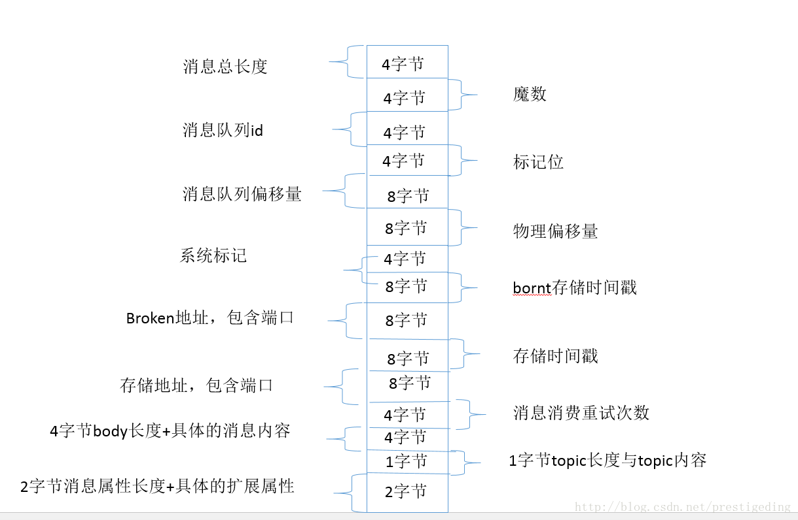
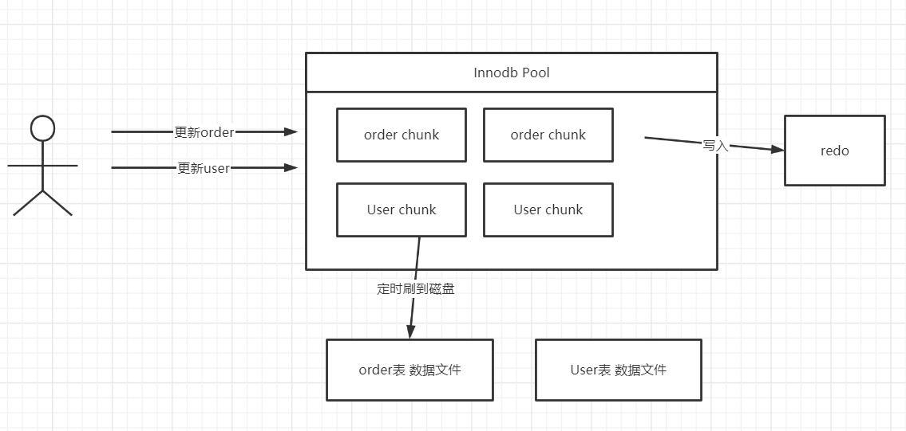
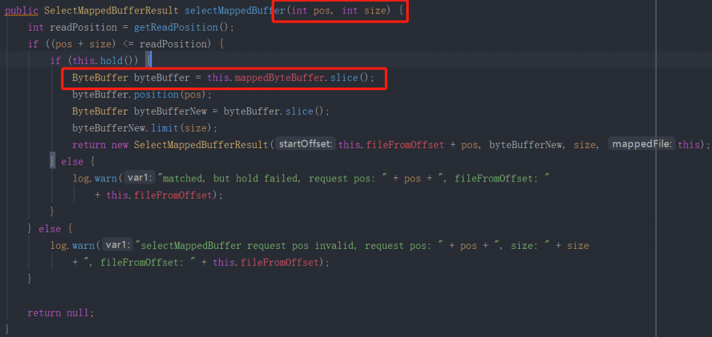

# 27 从 RocketMQ 学基于文件的编程模式（一）

### 消息存储格式看文件编程

#### **从 commitlog 文件的设计来学文件编程**我们知道 RocketMQ 的全量消息存储在 commitlog 文件中，每条消息的大小不一致，那如何对消息进行组织呢？当消息写入到文件中后，如果判别一条消息的开始与结束呢？

首先基于文件的编程模型，首先需要定义一套消息存储格式，用来表示一条完整的消息，例如 RocketMQ 的消息存储格式如下图所示：



从这里我们可以得到一种通用的数据存储格式定义实践：**通常存储协议遵循 Header + Body **，并且** Header 部分是定长**的，存放一些基本信息，body 存储数据，在 RocketMQ 的消息存储协议，我们可以将消息体的大小这 4 个字节看成是 Header，后面所有的字段认为是与消息相关的业务属性，按照指定格式进行组装即可。

针对 Header + Body 这种协议，我们通常的提取一条消息会分成两个步骤，先将 Header 读取到 ByteBuffer 中，在 RocketMQ 中的消息体，会读出一条消息的长度，然后就可以从**消息的开头**处读取该条消息长度的字节，然后就按照预先定义的格式解析各个部分即可。

那问题又来了，如果确定一条消息的开头呢?难不成从文件的开始处开始遍历？

正如关系型数据那样会为每一条数据引入一个 ID 字段，在基于文件编程的模型中，也会为一条消息引入一个**身份标志 **：** 消息物理偏移量，即消息存储在文件的起始位置**。

物理偏移量的设计如下图所示：


有了文件的起始偏移量 + SIZE，从一个文件中提取一条完整的消息就显得轻而易举了。

从 commitlog 文件的组织来看，通常基于文件的编程，每一个文件前都会填充一个魔数，在文件末尾还会设计一个用于填充的数用 PAD 表示，例如如果一个文件无法容纳一条完整的消息，并不会将一条消息分开存储，而是用 PAD 进行填充。

#### **从 consumequeue 来看文件存储设计**commitog 文件的存储如果是根据偏移量定位消息会非常方便，但如果要基于 Topic 去查询消息，就没那么方便了，故为了方便根据 topic 查询消息，引入了 consumequeue 文件


consumequeue 设计极具技巧性，其每个条目使用固定长度（8 字节 commitlog 物理偏移量、4 字节消息长度、8 字节 tag hashcode），这里不是存储 tag 的原始字符串，而是存储 hashcode，目的就是确保每个条目的长度固定，可以使用访问类似数组下标的方式来快速定位条目，极大的提高了 ConsumeQueue 文件的读取性能。**故基于文件的存储设计，需要针对性的设计一些索引，索引文件的设计，要确保条目的固定长度，使之可以使用类似访问数组的方式快速定位数据。**

### 内存映射与页缓存

解决了数据的存储格式与唯一标识，接下来就要考虑如何提高写入数据的性能。在基于文件编程的模型中，为了方便数据的删除，通常采取小文件，并且使用固定长度的文件，例如 RocketMQ 中 commitlog 文件夹会生成很多大小相等的文件。


\*\*使用定长的文件，其主要目的是方便进行内存映射。\*\*通过内存映射机制，将磁盘文件映射到内存，以一种访问内存的方式访问磁盘，极大的提高了文件的操作性能。

在 Java 中使用内存映射的示例代码如下：

```java
FileChannel fileChannel = new RandomAccessFile(this.file, "rw").getChannel();
MappedByteBuffer mappedByteBuffer = this.fileChannel.map(MapMode.READ_WRITE, 0, fileSize);
```

实现要点如下：

- 首先需要通过 RandomAccessFile 构建一个文件写入通道 FileChannel，提供基于块写入的通道。
- 通过 FileChannel 的 map 方法创建内存映射。

\*\*在 Linux 操作系统中，MappedByteBuffer 基本可以看成是页缓存（PageCache）。\*\*在 Linux 操作系统中的内存使用策略时，会最大可能的利用机器的物理内存，并常驻内存中，就是所谓的页缓存，只有当操作系统的内存不够的情况下，会采用缓存置换算法例如 LRU，将不常用的页缓存回收，即操作系统会自动管理这部分内存，无需使用者关心。如果从页缓存中查询数据时未命中，会产生缺页中断，由操作系统自动将文件中的内容加载到页缓存。

内存映射，将磁盘数据映射到磁盘，通过向内存映射中写入数据，这些数据并不会立即同步到磁盘，需用定时刷盘或由操作系统决定何时将数据持久化到磁盘。故存储的在页缓存的中的数据，如果 RocketMQ Broker 进程异常退出，存储在页缓存中的数据并不会丢失，操作系统会定时页缓存中的数据持久化到磁盘，做到安全可靠。**不过如果是机器断电等异常情况，存储在页缓存中的数据就有可能丢失。**### 顺序写

基于磁盘的读写，提高其写入性能的另外一个设计原理是**磁盘顺序写**。磁盘顺序写广泛用在基于文件的存储模型中，大家不妨思考一下 MySQL Redo 日志的引入目的，我们知道在 MySQL InnoDB 的存储引擎中，会有一个内存 Pool，用来缓存磁盘的文件块，当更新语句将数据修改后，会首先在内存中进行修改，然后将变更写入到 redo 文件（关键是会执行一次 force，同步刷盘，确保数据被持久化到磁盘中），但此时并不会同步数据文件，其操作流程如下图所示：



如果不引入 redo，更新 order，更新 user，首先会更新 InnoDB Pool（更新内存），然后定时刷写到磁盘，由于不同的表对应的数据文件不一致，故如果每更新内存中的数据就刷盘，那就是大量的随机写磁盘，性能低下，故为了避免这个问题，首先引入一个顺序写 redo 日志，然后定时同步内存中的数据到数据文件，虽然引入了多余的 redo 顺序写，但整体上获得的性能更好，从这里也可以看出顺序写的性能比随机写要高不少。**故基于文件的编程模型中，设计时一定要设计成顺序写，顺序写一个非常的特点是只追究，不更新。**### 引用计数器

在面向文件基于 NIO 的编程中，基本都是面向 ByteBuffer 进行编程，并且对 ByteBuffer 进行读操作，通常会使用其 slince 方法，两个 ByteBuffer 对象的内存地址相同，但指针不一样，通常使用示例如下：



上面的方法的作用就是从一个映射文件，例如 commitlog、ConsumeQueue 文件中的某一个位置读取指定长度的数据，这里就是从内存映射 MappedBytebuffer slice 一个对象，共享其内部的存储，但维护独立的指针，这样做的好处就是避免了内存的拷贝，但与之带来的弊端就是较难管理，主要是 ByteBuffer 对象的释放会变得复杂起来。**需要跟踪该 MappedByteBuffer 会 slice 多少次 **，在这些对象的声明周期没有结束后，不能随意的关闭 MappedByteBuffer，否则其他对象的内存无法访问，造成不可控制的错误，那 RocketMQ 是如何解决这个问题的呢？** 其解决方案是引入了引用计数器**，即每次 slice 后 引用计数器增加一，释放后引用计数器减一，只有当前的引用计数器为 0，才可以真正释放。在 RocketMQ 中关于引用计数的实现如下：


在结合上图 MappedFile selectMappedBuffer 方法，我们来阐述其实现要点：

1. 对 MappedByteBuffer slice 是通过调用 hold 增加一次引用，即引用该 ByteBuffer 的引用计数器加一。
1. 对返回后的 ByteBuffer，被封装在 SelectMappedBufferResult 中，该 ByteBuffer 的使用者在使用完毕后，会释放它，这个时候 ReferenceResource 的 release 方法会被调用，引用计数器会减一。
