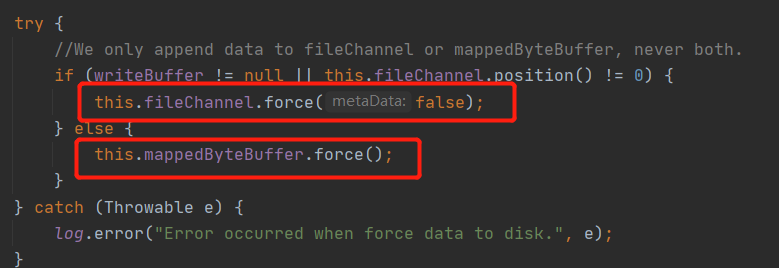
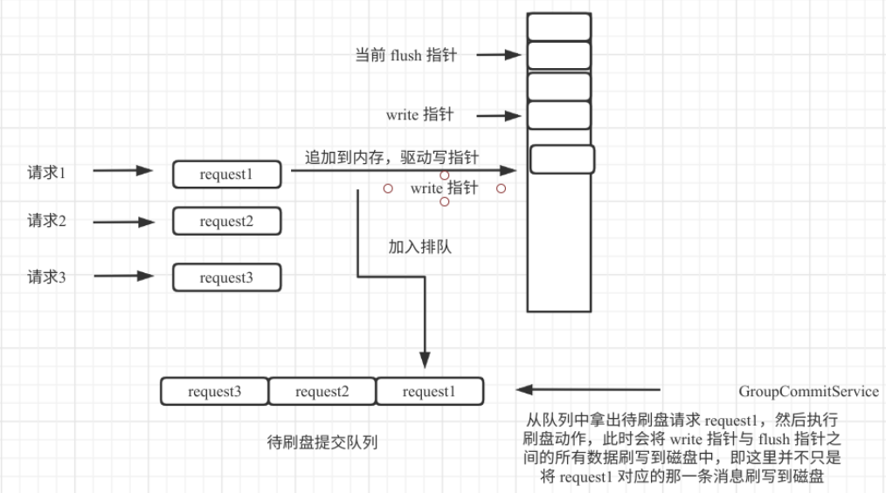
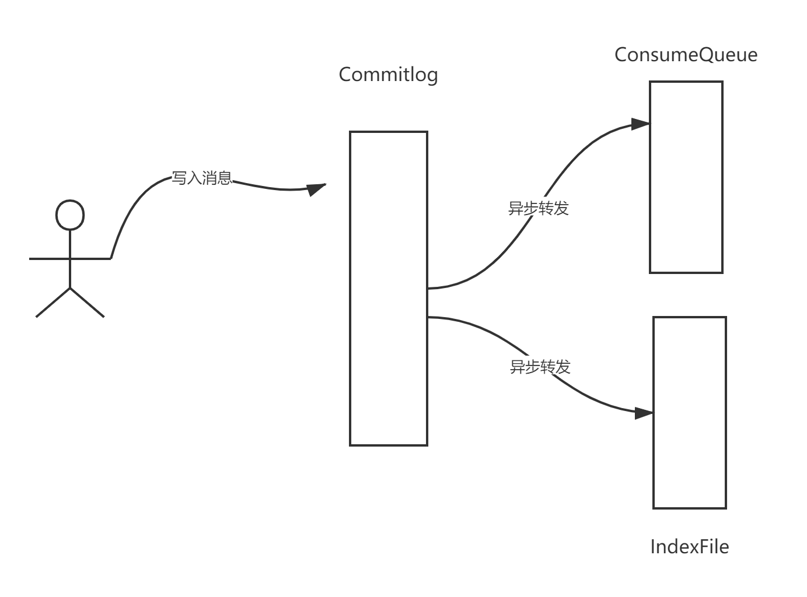
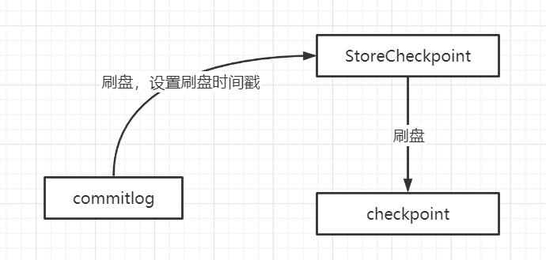
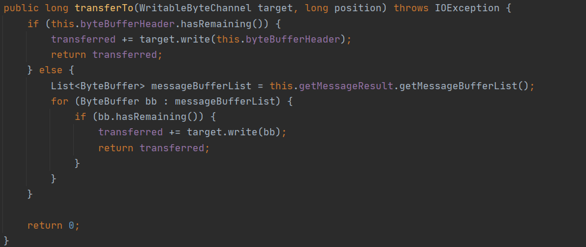

# 28 从 RocketMQ 学基于文件的编程模式（二）

### 同步刷盘、异步刷盘

基于文件的编程模型中为了提高文件的写入性能，通常会引入内存映射机制，但凡事都有利弊，引入了内存映射、页缓存等机制，数据首先写入到页缓存，此时并没有真正的持久化到磁盘，那 Broker 收到客户端的消息发送请求时是存储到页缓存中就直接返回成功，还是要持久化到磁盘中才返回成功呢？

这里又是一个抉择，是在性能与消息可靠性方面进行的权衡，为此 RocketMQ 提供了多种持久化策略：**同步刷盘、异步刷盘。 \*\*\*\* “刷盘” **这个名词是不是听起来很高大上，其实这并不是一个什么神秘高深的词语，所谓的** 刷盘就是将内存中的数据同步到磁盘 **，在代码层面其实是调用了** FileChannel 或 MappedBytebuffer 的 force 方法**，其截图如下：

接下来分别介绍同步刷盘与异步刷盘的实现技巧。

#### **同步刷盘 **同步刷盘指的 Broker 端收到消息发送者的消息后，先写入内存，然后同时将内容持久化到磁盘后才向客户端返回消息发送成功。** 提出思考：那在 RocketMQ 的同步刷盘是一次消息写入就只将一条消息刷写到磁盘？答案是否定的。**

在 RocketMQ 中同步刷盘的入口为 commitlog 的 handleDiskFlush，同步刷盘的截图如下：

这里有两个核心关键点：

- 用来处理同步刷盘服务的类为：GroupCommitService，大家有没有关注到为啥名字中会有 Group 的字眼，组提交，这也能说明一次刷盘并不只刷写一条消息，而是一组消息。
- 这里使用了一种编程技巧，使用 CountDownLatch 的编程设计模式，发一起一个异步请求，然后调用带过期时间的 await 方法等待异步处理结果，即同步转异步编程模型，实现业务逻辑的解耦。

接下来继续探讨组提交的设计理念。

判断一条刷盘请求成功的条件：当前已刷盘指针大于该条消息对应的物理偏移量，这里使用了刷盘重试机制。然后唤醒主线程并返回刷盘结果。

所谓的组提交，其核心理念理念是调用刷盘时使用的是 MappedFileQueue.flush 方法，该方法并不是只将一条消息写入磁盘，而是会将当期未刷盘的数据一次性刷写到磁盘，既组提交，故即使在同步刷盘情况下，也并不是每一条消息都会被执行 flush 方法，为了更直观的展现组提交的设计理念，给出如下流程图：

#### **异步刷盘**

同步刷盘的优点是能保证消息不丢失，即向客户断返回成功就代表这条消息已被持久化到磁盘，即消息非常可靠，但是以牺牲写入性能为前提条件的，但由于 RocketMQ 的消息是先写入 PageCache，故消息丢失的可能性较小，如果能容 忍一定几率的消息丢失，但能提高性能，可以考虑使用异步刷盘。

异步刷盘指的是 Broker 将消息存储到 PageCache 后就立即返回成功，然后开启一个异步线程定时执行 FileChannel 的 forece 方法将内存中的数据定时刷写到磁盘，默认间隔为 500ms。在 RocketMQ 的异步刷盘实现类为 FlushRealTimeService。看到这个默认间隔为 500ms，大家是不是会猜测 FlushRealTimeService 是使用了定时任务？

其实不然。这里引入了带超时时间的 CountDown await 方法，这样做的好处时如果没有新的消息写入，会休眠 500ms，但收到了新的消息后，可以被唤醒，做到消息及时被刷盘，而不是一定要等 500 ms。

### 文件恢复机制

我们首先来看一下 RocketMQ 的文件转发机制：

在 RocketMQ 中数据会首先写入到 commitlog 文件，而 consumequeue、indexFile 等文件都是基于 commitlog 文件异步进行转发的，既然是异步的，就有可能出现 commitlog 文件、consumequeue 文件中的数据不一致，例如在关闭 RocketMQ 中部分数据并没有转发给 consumequeue，那在重启时如何恢复，确保数据一致呢？

在讲解 RocketMQ 文件恢复机制之前，先抛出几个异常场景：

- 在写入 commitlog 文件后并且是采用同步刷盘，即消息已经写入 commitlog 文件，但准备转发给 consumequeue 文件由于断电等异常，导致 consumequeue 中并未成功存储。
- 在刷盘的时候，如果积累了 100m 的消息，准备将这 100M 消息刷写到磁盘，但由于机器突然断电，只刷写了 50m 到 commitlog 文件，这个时候可能一条消息只部分写入到磁盘，那又怎么处理呢？
- 细心的朋友应该能看到在 RocketMQ 的存储目录下有一个叫 checkpoint 的文件，显而易见就是记录 commitlog 等文件的刷盘点，但将数据刷写到 commitlog 文件，然后才会将刷盘点记录到 checkpoint 文件，那如果此时的刷盘点未写入到 checkpoint 就丢失了，那又如何处理呢？

温馨提示：各位读者朋友们，建议大家在这里稍微停留片刻，对上述问题进行一个简单的思考，再继续本文的后续内容。

**在 RocketMQ 中 Broker 异常停止恢复和正常停止恢复两种场景**。

这两种场景主要是定位到从哪个文件开始恢复的逻辑不一样，一旦定位到从哪个文件，文件的恢复思路如下：

- 首先尝试恢复 consumeque 文件，根据 consumequeue 的存储格式（8 字节物理偏移量、4 字节长度、8 字节 tag hashcode），找到最后一条完整的消息格式所对应的物理偏移量，用 maxPhysicalOfConsumeque 表示。
- 然后尝试恢复 commitlog，首先通过文件的魔数来判断该文件是否是一个 comitlog 文件，然后按照消息的存储格式去寻找最后一条合格的消息，拿到其 physicalOffset，如果在 commitlog 文件中的有效偏移量小于 consumequeue 中 存储的最大物理偏移量，将会删除 consumequeue 中多余的内容，如果大于 consumequeue 中的最大物理偏移量，说明 consuemqueue 中的内容少于 commitlog 文件中存储的内容，则会重推，即 RocketMQ 会将 commitlog 文件中的多余消息重新进行转发，从而实现 comitlog 与 consumequeue 文件最终保持一致。

在实际生产环境下，如何高效的定位大概率需要恢复的文件呢？例如现在 commitlog 文件有 500 多个文件，从第一个文件开始判断？当然不是。会按照是否是正常退出还是异常退出。

#### **正常退出定位文件**

在 RocketMQ 启动时候会创建一个名为 abort 的文件，然后在正常退出时会删除该文件，故判断 RocketMQ 进程是否是异常退出只需要查看 abort 文件是否存在，如果存在表示异常退出。

正常退出文件的定位策略：

- 恢复 ConsumeQueue 时是按照 topic 进行恢复的，从第一文件开始恢复。
- 恢复 commitlog 时从倒数第 3 个文件，向后开始尝试开始恢复。

#### **异常退出定位文件**

RocketMQ 正常退出时可以从倒数第三个文件开始恢复，这个看似存在风险，但其实不然，因为通常情况一个文件写完，就会被刷写到磁盘中，但异常退出时就不能就不知道是什么原因退出的，这个时候就不能这么“随意”，必须严谨，那如何在严谨的情况下提高定位的效率呢？

不知大家有留意到上图中的 checkpoint 文件，相信大家对这个文件的含义不会陌生，在 RocketMQ 中会存储 commitlog、index、consumequeue 等文件的最后一次刷盘时间戳。其文件结构如下图所示：

- physicMsgTimestamp commitlog 文件最后的刷盘的时间点
- logicsMsgTimestamp consumequeue 文件最后的刷盘时间点
- indexMsgTimestamp indexfile 文件最后的刷盘时间点

该文件的刷盘机制如下：

从这里可以看出，commitlog 刷盘成功后，才会执行 checkpoint 文件的刷盘，commitlog 文件与 checkpoint 会存在不一致的情况，即 checkpoint 中存储的刷盘点以前的数据一定被写入到磁盘中，但并不能说只有 checkpoint 中的存储的刷盘点代表的数据并不能表示已刷盘的所有数据。

基于 checkpoint 文件的特点，异常退出时定位文件恢复的策略如下：

- 恢复 ConsumeQueue 时是按照 topic 进行恢复的，从第一文件开始恢复。
- 从最后一个 commitlog 文件逐步向前寻找，在寻找时读取该文件中的 **第一条消息的存储时间** ，如果这个存储时间小于 checkpoint 文件中的刷盘时间，就可以从这个文件开始恢复，如果这个文件中第一条消息的存储时间大于刷盘点，说明不能从这个文件开始恢复，需要找上一个文件，因为 checkpoint 的文件中的刷盘点代表的是百分之百可靠的消息。

文件恢复的具体代码我这里就不做过多阐述了，根据上面的设计理念，自己顺藤摸瓜，效果应该会事半功倍。文件恢复的入口：DefaultMessageStore#recover。

### Java 如何使用零拷贝

在面向文件文件、面向网络的编程模型中，“零拷贝”这个词出现的频率我想是非常高的，在这里我并不打算普及 Java 零拷贝的具体含义，如果对其不太了解，建议百度之，这里我们看一下 RocketMQ 在消息消费时是如何基于 Netty 使用零拷贝的。

零拷贝的关键实现要点：

- 消息读取场景，首先基于内存映射获取一个 ByteBuf，该 ByteBuf 中的数据并不需要先加载到堆内存中。
- 然后将要发送的 ByteBuf 封装在 Netty 的 FileRegion，实现其 transferTo 方法即可，其底层实现为 FileChannel 的 transferTo 方法。

ManyMessageTransfer 的 transforeTo 方法实现如下图所示：

本文基于文件编程的模型就介绍到这里了，本文的设计思路是向优秀的人学习优秀的编程技巧。
