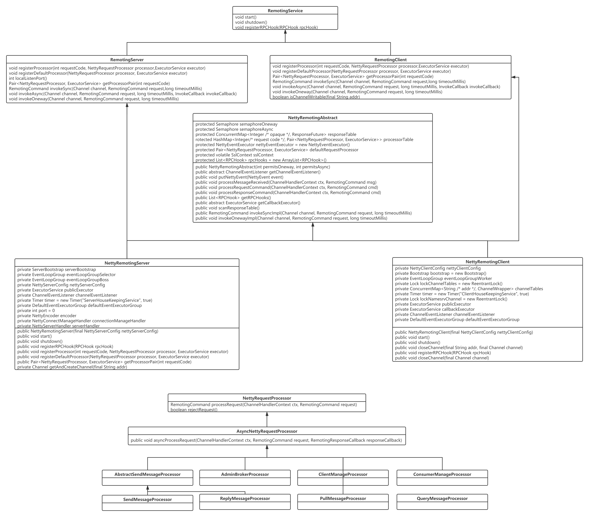
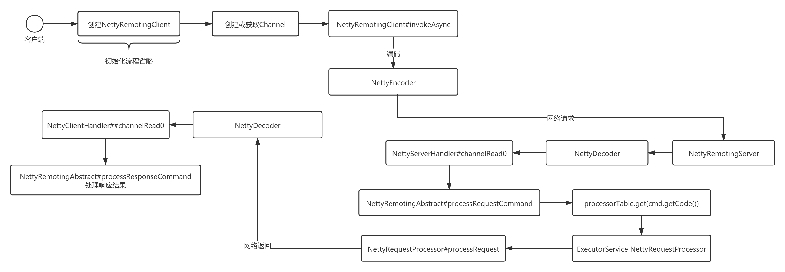
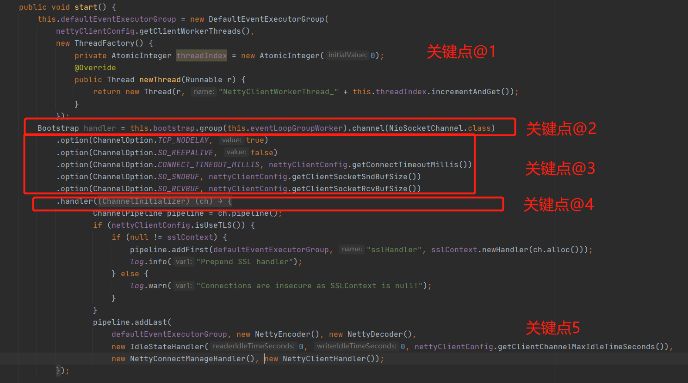
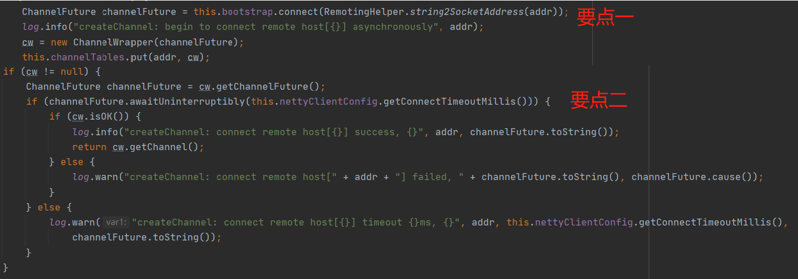
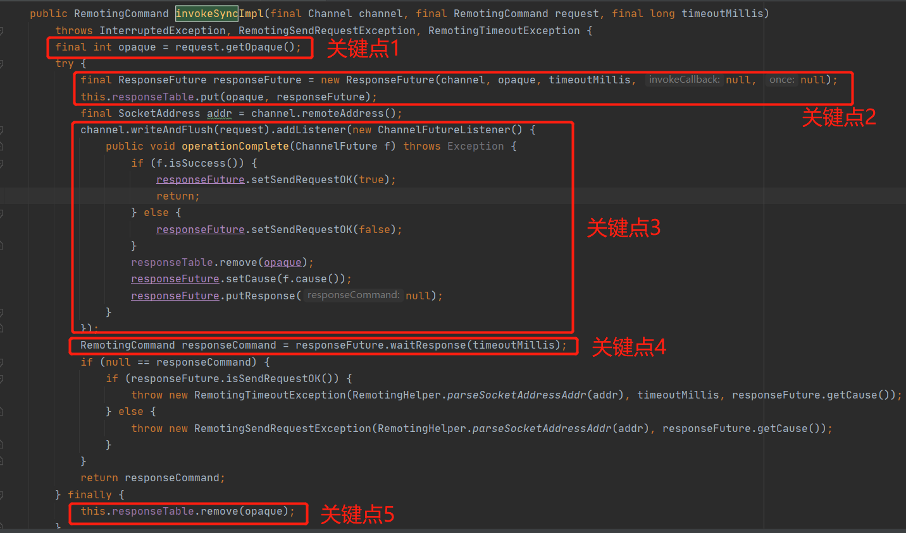
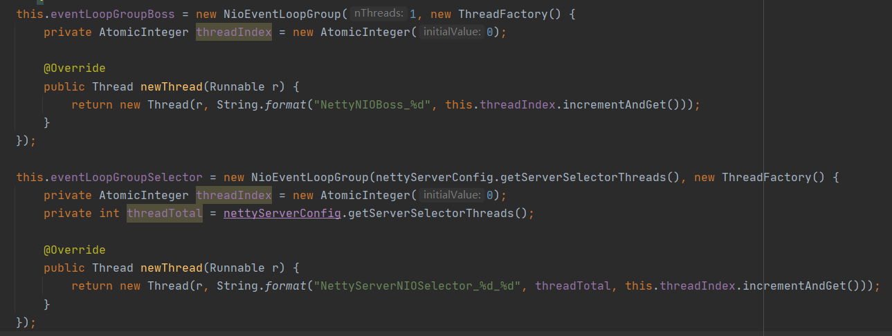
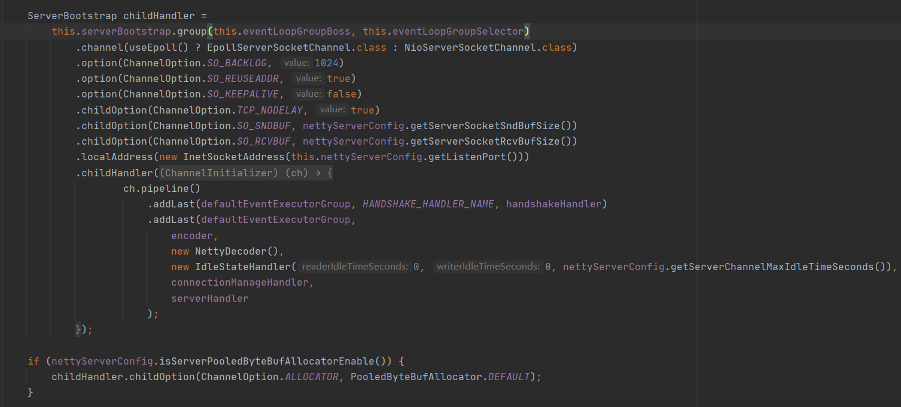
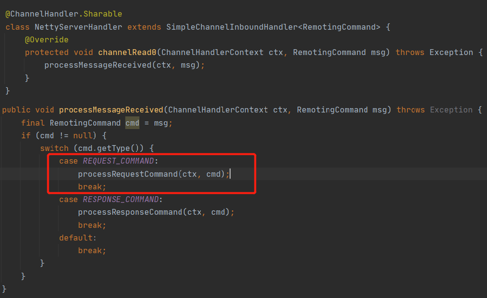
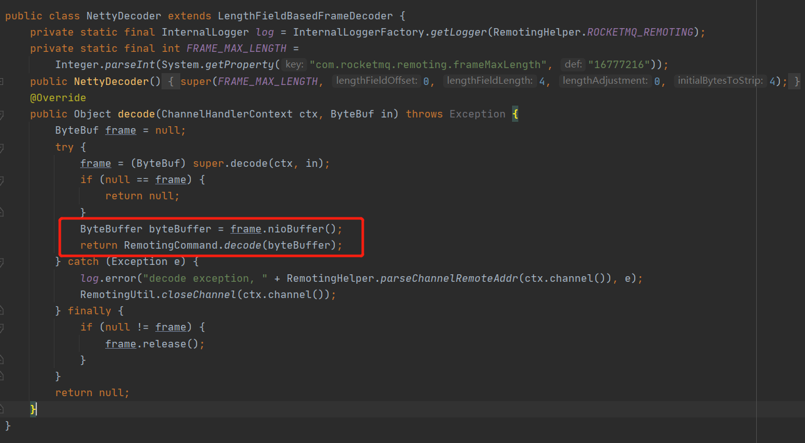

# 29 从 RocketMQ 学 Netty 网络编程技巧

### 从整个类体系看网络设计

RocketMQ 关于网络方面核心类图如下所示：



接下来先一一介绍各个类的主要职责。

#### **RemotingService**

RPC 远程服务基础类。主要定义所有的远程服务类的基础方法：

- `void start()`：启动远程服务。
- `void shutdown()`：关闭。
- `void registerRPCHook(RPCHook rpcHook)`：注册 RPC 钩子函数，有利于在执行网络操作的前后执行定制化逻辑。

#### **RemotingServer/RemotingClient**

远程服务器/客户端基础接口，两者中的方法基本类似，故这里重点介绍一下 RemotingServer，定位 RPC 远程操作的相关“业务方法”。

```
void registerProcessor(int requestCode, NettyRequestProcessor processor,ExecutorService executor)
```

注册命令处理器，这里是 RocketMQ Netty 网络设计的核心亮点，RocketMQ 会按照业务逻辑进行拆分，例如消息发送、消息拉取等每一个网络操作会定义一个请求编码（requestCode），然后每一个类型对应一个业务处理器 NettyRequestProcessor，并可以按照不同的 requestCode 定义不同的线程池，实现不同请求的线程池隔离。其参数说明如下。

```
int requestCode
```

命令编码，rocketmq 中所有的请求命令在 RequestCode 中定义。

```
NettyRequestProcessor processor
```

RocketMQ 请求业务处理器，例如消息发送的处理器为 SendMessageProcessor，PullMessageProcessor 为消息拉取的业务处理器。

```
ExecutorService executor
```

线程池，NettyRequestProcessor 具体业务逻辑在该线程池中执行。

```
Pair<NettyRequestProcessor, ExecutorService> getProcessorPair(int requestCode)
```

根据请求编码获取对应的请求业务处理器与线程池。

```
RemotingCommand invokeSync(Channel channel, RemotingCommand request,long timeoutMillis)
```

同步请求调用，参数说如下：

- Channel channel：Netty 网络通道。
- RemotingCommand request：RPC 请求消息体，即每一个请求都会封装成该对象。
- long timeoutMillis：超时时间。

```
void invokeAsync(Channel channel, RemotingCommand request, long timeoutMillis, InvokeCallback invokeCallback)
```

异步请求调用。

```
void invokeOneway(Channel channel, RemotingCommand request, long timeoutMillis)
```

Oneway 请求调用。

#### **NettyRemotingAbstract** Netty 远程服务抽象实现类，定义网络远程调用、请求，响应等处理逻辑，其核心方法与核心方法的设计理念如下。 **NettyRemotingAbstract 核心属性：**

- Semaphore semaphoreOneway：控制 oneway 发送方式的并发度的信号量，默认为 65535 个许可。

- Semaphore semaphoreAsync：控制异步发送方式的并发度的信号量，默认为 65535 个许可。

- `ConcurrentMap<Integer /* opaque */, ResponseFuture> responseTable`：当前正在等待对端返回的请求处理表，其中 opaque 表示请求的编号，全局唯一，通常采用原子递增，通常套路是客户端向对端发送网络请求时，通常会采取单一长连接，故发送请求后会向调用端立即返回 ResponseFuture，同时会将请求放入到该映射表中，然后收到客户端响应时（客户端响应会包含请求 code），然后从该映射表中获取对应的 ResponseFutre，然后通知调用端的返回结果，这里是 **Future 模式在网络编程中的经典运用** 。

- ```
    HashMap<Integer/* request code */, Pair<NettyRequestProcessor, ExecutorService>> processorTable

```

  ：注册的请求处理命令。RocketMQ 的设计中采用了不同请求命令支持不同的线程池，即实现业务线程池的隔离。

  - `Pair<NettyRequestProcessor, ExecutorService> defaultRequestProcessor`：默认命令处理线程池。
  - `List<RPCHook> rpcHooks`：注册的 RPC 钩子函数列表。

#### **NettyRemotingClient**

基于 Netty 网络编程客户端，实现 RemotingClient 接口并继承 NettyRemotingAbstract。

其核心属性说明如下：

- NettyClientConfig nettyClientConfig：与网络相关的配置项。
- Bootstrap bootstrap：Netty 客户端启动帮助类。
- EventLoopGroup eventLoopGroupWorker：Netty 客户端 Work 线程组，俗称 IO 线程。
- `ConcurrentMap<String /* addr */, ChannelWrapper> channelTables`：当前客户端已创建的连接（网络通道、Netty Cannel），每一个地址一条长连接。
- ExecutorService publicExecutor：默认任务线程池。
- ExecutorService callbackExecutor：回掉类请求执行线程池。
- DefaultEventExecutorGroup defaultEventExecutorGroup：Netty ChannelHandler 线程执行组，即 Netty ChannelHandler 在这些线程中执行。

#### **NettyRemotingServer**

基于 Netty 网络编程服务端。

其核心属性如下所示：

- ServerBootstrap serverBootstrap：Netty Server 端启动帮助类。
- EventLoopGroup eventLoopGroupSelector：Netty Server Work 线程组，即主从多 Reactor 中的从 Reactor，主要负责 **读写事件** 的处理。
- EventLoopGroup eventLoopGroupBoss：Netty Boss 线程组,即主从 Reactor 线程模型中的主 Reactor，主要负责 OP_ACCEPT 事件（创建连接）。
- NettyServerConfig nettyServerConfig：Netty 服务端配置。
- `Timer timer = new Timer("ServerHouseKeepingService", true)`：定时扫描器，对 NettyRemotingAbstract 中的 responseTable 进行扫描，将超时的请求移除。
- DefaultEventExecutorGroup defaultEventExecutorGroup：Netty ChannelHandler 线程执行组。
- int port：服务端绑定端口。
- NettyEncoder encoder：RocketMQ 通信协议（编码器）。
- NettyDecoder decoder：RocketMQ 通信协议（解码器）。
- NettyConnectManageHandler connectionManageHandler：Netty 连接管路器 Handler，主要实现对连接的状态跟踪。
- NettyServerHandler serverHandler：NettyServer 端核心业务处理器。

#### **NettyRequestProcessor**

基于 Netty 实现的请求命令处理器，即在服务端各个业务处理逻辑，例如处理消息发送的 SendMessageProcessor。

关于 NettyRemotingServer、NettyRemotingClient 将在下文继续深入探讨，通过类图的方式对了解 Netty 网络设计的精髓还不太直观，下面再给出一张流图，进一步阐释 RocketMQ 网络设计的精髓。



其核心关键点说明如下：

> 上述流程图将省略 NettyRemotingClient、NettyRemotingServer 的初始化流程，因为这些将在下文详细阐述。

- NettyRemotingClient 会在需要连接到指定地址先通过 Netty 相关 API 创建 Channel，并进行缓存，下一次请求如果还是发送到该地址时可重复利用。
- 然后调用 NettyRemotingClient 的 invokeAsync 等方法进行网络发送，在发送时在 Netty 中会进行一个 **非常重要的步骤：对请求编码** ，主要是将需要发送的请求，例如 RemotingCommand，将该对象按照 **特定的格式（协议）** 转换成二进制流。
- NettyRemotingServer 端接收到二进制后，网络读请求就绪，进行读请求事件处理流程。首先需要从 **二进制流中识别一个完整的请求包，这就是所谓的解码** ，即将二进制流转换为请求对象，解码成 RemotingCommand，然后读事件会传播到 NettyServerHandler，最终执行 NettyRemotingAbstract 的 processRequestCommand，主要是根据 requestCode 获取指定的命令执行线程池与 NettyRequestProcessor，并执行对应的逻辑，然后通过网络将执行结果返回给客户端。
- 客户端收到服务端的响应后，读事件触发，执行解码（NettyDecoder），然后读事件会传播到 NettyClientHandler，并处理响应结果。

### Netty 网络编程要点

对网络编程基本的流程掌握后，我们接下来学习 NettyRemotingServer、NettyRemotingClient 的具体实现代码，来掌握 Netty 服务端、客户端的编写技巧。

基于网络编程模型，通常需要解决的问题：

- 网络连接的建立
- 通信协议的设计
- 线程模型

基于网络的编程，其实是面向二进制流，我们以大家最熟悉的的 Dubbo RPC 访问请求为例进行更直观的讲解，Dubbo 的通讯过程如下所示：


例如一个订单服务 order-serevice-app，用户会发起多个下单服务，在 order-service-app 中就会对应多个线程，订单服务需要调用优惠券相关的微服务，多个线程通过 dubbo client 向优惠券发起 RPC 调用，这个过程至少需要做哪些操作呢？

1. 创建 TCP 连接，默认情况下 Dubbo 客户端和 Dubbo 服务端会保持一条长连接，用一条连接发送该客户端到服务端的所有网络请求。
1. 将请求转换为二进制流，试想一下，多个请求依次通过一条连接发送消息，那服务端如何从二级制流中解析出一个完整的请求呢，例如 Dubbo 请求的请求体中至少需要封装需要调用的远程服务名、请求参数等。这里其实就是涉及所谓的 **自定义协议** ，即需要制定一套 **通信规范** 。
1. 客户端根据通信协议对将请求转换为二进制的过程称之为 **编码** ，服务端根据通信协议从二级制流中识别出一个个请求，称之为 **解码** 。
1. 服务端解码请求后，需要按照请求执行对应的业务逻辑处理，这里在网络通信中通常涉及到两类线程：IO 线程和业务线程池，通常 IO 线程负责请求解析，而业务线程池执行业务逻辑，最大可能的解耦 IO 读写与业务的处理逻辑。

接下来我们将从 RocketMQ 中是如何使用的，从而来探究 Netty 的学习与使用。

#### **Netty 客户端编程实践**  **1. 客户端创建示例与要点**

在 RocketMQ 中客户端的实现类：NettyRemotingClient。其创建核心代码被封装在 start 方法中，其代码截图如下图所示：



上述代码基本就是使用 Netty 编程创建客户端的标准模板，其关键点说明如下。

创建 DefaultEventExecutorGroup，默认事件执行线程组，后续事件处理器即（ChannelPipeline 中 addLast 中事件处理器）在该线程组中执行，故其本质就是一个线程池。

通过 Netty 提供的工具类 Bootstrap 来创建 Netty 客户端，其 group 方法指定一个事件循环组（EventLoopGroup），即 Work 线程组，主要是封装事件选择器（java.nio.Selector），默认情况下读写事件在该线程组中执行，俗称 IO 线程，但可以改变默认行为，下面会对这个加以详细解释；同时通过 chanel 方法指定通道的类型，基于 NIO 的客户端，通常使用 NioSocketChannel。

通过 Bootstrap 的 option 设置网络通信相关的参数，通常情况下会指定如下参数：

- TCP_NODELAY：是否禁用 Nagle，如果设置为 true 表示立即发送，如果设置为 false，如果一个数据包比较小，会尝试等待更多的包在一起发送。
- SO_KEEPALIVE：由于笔者对网络掌握深度不够，这里建议大家百度去查看与网络相关的知识，我们通常可以参考主流的做法，设置该值为 false。
- CONNECT_TIMEOUT_MILLIS：连接超时时间，客户端在建立连接时如果在该时间内无法建立连接，则抛出超时异常，建立连接失败。
- SO_SNDBUF、SO_RCVBUF：套接字发送缓存区与套接字接收缓存区大小，在 RocketMQ 该值设置为 65535，及默认为 64kb。

通过 Bootstrap 的 hanle 方法构建事件处理链条，通常通过使用 `new ChannelInitializer<SocketChannel>()`。

通过 ChannelPipeline 的 addLast 方法构建事件处理链，这里是基于 Netty 的核心扩展点，应用程序的业务逻辑就是通过该事件处理器进行切入的。RocketMQ 中事件处理链说明如下：

- NettyEncoder：RocketMQ 请求编码器，即协议编码器。
- NettyDecoder：RocketMQ 请求解码器，即协议解码器。
- IdleStateHandler：空闲检测。
- NettyConnectManageHandler：连接管理器。
- NettyClientHandler：Netty 客户端业务处理器，即处理“业务逻辑”。

即基于 Netty 的编程，主要包括 **制定通信协议（编码解码）、业务处理** 。下文会一一介绍。

ChannelPipeline 的 addLast 方法重点介绍：


如果调用在添加事件处理器时没有传入 EventExecutorGroup，那事件的执行默认在 Work 线程组，如果指定了，事件的执行将在传入的线程池中执行。

**2. 创建连接及要点**

上面的初始化并没有创建连接，在 RocketMQ 中在使用时才会创建连接，当然连接创建后就可以复用、缓存，即我们常说的长连接。基于 Netty 创建连接的示例代码如下：



这个基本上也是基于 Netty 的客户端创建连接的模板，其实现要点如下：

- 通过使用 Bootstrap 的 connect 创建一个连接，该方法会立即返回并不会阻塞，然后将该连接加入到 channelTables 中进行缓存。
- 由于 Bootstrap 的 connect 方法创建连接时只是返回一个 Future，在使用时通常需要同步等待连接成功建立，故通常需要调用 ChannelFuture 的 awaitUniteruptibly(连接建立允许的超时时间)，等待连接成功建立，该方法返回后还需要通过如下代码判断连接是否真的成功建立：
```

public boolean isOK() {
      return this.channelFuture.channel() != null && this.channelFuture.channel().isActive();
  }

```

**3. 请求发送示例**

以同步消息发送为例我们来看一下消息发送的使用示例，其示例代码如下：



使用关键点如下：

- 首先会为每一个请求进行编号，即所谓的 requestId，在这里使用便利 opaque 来表示，在单机内唯一即可。
- 然后基于 Future 模式，创建 ResponseFuture，并将其放入到`ConcurrentMap<Integer /* opaque */, ResponseFuture> responseTable`，当客户端收到服务端的响应后，需要根据 opaque 查找到对应的 ResponseFuture，从而唤醒客户端。
- 通过使用 CHannel 的 writeAndFlush 方法，将请求 Request 通过网络发送到服务端，内部会使用编码器 NettyEncoder 将 RemotingCommand request 编码二级制流，并使用 addListener 添加回调函数，在回调函数中进行处理，唤醒处理结果。
- 同步调用的实现方式，通过调用 Future 的 waitResponse 方法，收到响应结果该方法被唤醒。

#### **Netty 服务端编程实践**  **1. Netty 服务端创建示例**  **Step1** ：创建 Boss、Work 事件线程组。Netty 的服务端线程模型采用的是主从多 Reactor 模型，会创建两个线程组，分别为 Boss Group 与 Work Group，其创建示例如下图所示



通常 Boos Group 默认使用一个线程，而 Work 线程组通常为 CPU 的合数，Work 线程组通常为 IO 线程池，处理读写事件。 **Step2** ：创建默认事件执行线程组。


关于该线程池的作用与客户端类似，故不重复介绍。 **Step3** ：使用 Netty ServerBootstrap 服务端启动类构建服务端。（模板）



通过 ServerBootstrap 构建的关键点如下：

- 通过 ServerBootstrap 的 group 的指定 boss、work 两个线程组。
- 通过 ServerBootstrap 的 chanel 方法指定通道的类型，通常有 NioServerSocketChannel、EpollServerSocketChannel。
- 通过 option 方法设置 EpollServerSocketChannel 相关的网络参数，即监听客户端请求的网络通道相关的参数。
- 通过 childOption 方法设置 NioSocketChannel 的相关网络参数，即读写 Socket 相关的网络参数。
- 通过 localAddress 方法绑定到服务端指定的 IP、端口。
- 通过 childHanlder 方法设置实际处理监听器，是应用程序通过 Netty 编程主要的业务切入点，与客户端类似，其中 ServerHandler 为服务端的业务处理 Handler，编码解码与客户端无异。

**Step4** ：调用 ServerBootstrap 的 bind 方法绑定到指定端口。


ServerBootstrap 的 bind 的方法是一个非阻塞方法，调用 sync() 方法会变成阻塞方法，即等待服务端启动完成。 **2. Netty ServerHandler 编写示例** 服务端在网络通信方面无非就是接受请求并处理，然后将响应发送到客户端，处理请求的入口通常通过定义 ChannelHandler，我们来看一下 RocketMQ 中编写的 Handler。



服务端的业务处理 Handler 主要是接受客户端的请求，故通常关注的是读事件，可以通常继承 SimpleChannelInboundHandler，并实现 channelRead0，由于已经经过了解码器（NettyDecoder），已经将请求解码成具体的请求对象了，在 RocketMQ 中使用 RemotingCommand 对象，只需面向该对象进行编程，processMessageReceived 该方法是 NettyRemotingClient、NettyRemotingServer 的父类，故对于服务端来会调用 processReqeustCommand 方法。 **在基于 Netty4 的编程，在 ChannelHandler 加上@ChannelHandler.Sharable 可实现线程安全。** > 温馨提示：在 ChannelHandler 中通常不会执行具体的业务逻辑，通常是只负责请求的分发，其背后会引入线程池进行异步解耦，在 RocketMQ 的实现中更加如此，在 RocketMQ 提供了基于“业务”的线程池隔离，例如会为消息发送、消息拉取分别创建不同的线程池。这部分内容将在下文详细介绍。

#### **协议编码解码器**

基于网络编程，通信协议的制定是最最重要的工作，通常关于通信协议的设计套路如下：


通常采用的是 Header + Body 这种结构，通常 Header 部分是固定长度，并且在 Header 部分会有一个字段来标识整条消息的长度，至于头结点中是否会放置其他字段。这种结构非常经典，实现简单，特别适合在接收端从二进制流中解码请求，其关键点如下：

- 接收端首先会尝试从二级制流中读取 Header 长度个字节，如果当前可读取字节不足 Header 长度个字节，先累计，等待更多数据到达。
- 如果能读取到 Header 长度个字段，按照 Header 的格式读取该消息的总长度，然后尝试读取总长度的消息，如果不足，说明还未收到条完整的消息，等待更多数据的到达；如果缓存区中能读取到一条完整的消息，就按照消息格式进行解码，按照特定的格式，将二级制转换为请求对象，例如 RocketMQ 的 RemotingCommand 对象。

由于这种模式非常通用，故 Netty 提供了该解码的通用实现类：LengthFieldBasedFrameDecoder，即能够从二级制流中读取一个完整的消息自己缓存区，应用程序自己实现将 ByteBuf 转换为特定的请求对象即可，NettyDecoder 的示例如下：



而 NettyEncoder 的职责就是将请求对象转换成 ByteBuf，即转换成二级制流，这个对象转换为上图中协议格式（Header + Body）这种格式即可。

### 线程隔离机制

通常服务端接收请求，经过解码器解码后转换成请求对象，服务端需要根据请求对象进行对应的业务处理，避免业务处理阻塞 IO 读取线程，通常业务的处理会采用额外的线程池，即 **业务线程池** ，RocketMQ 在这块采用的方式值得我们借鉴，提供了不同业务采用不同的线程池，实现线程隔离机制。

RocketMQ 为每一个请求进行编码，然后每一类请求会对应一个 Proccess（业务处理逻辑），并且将 Process 注册到指定线程池，实现线程隔离机制。

**Step1** ：首先在服务端启动时会先进行静态注册，将请求处理器与执行的线程池进行对应，其代码示例如下：

 **Step2** ：服务端接受到请求对象后，根据请求命令获取对应的 Processor 与线程池，然后将任务提交到线程池中执行，其代码示例如下所示（NettyRemotingAbstract#processRequestCommand）。


本篇就介绍到这里了，以 RocketMQ 中使用 Netty 编程为切入点，梳理出基于 Netty 进行网络编程的套路。
