# 14 Serverless Kubernetes 容器服务介绍

**导读：**Serverless Kubernetes 是以容器和 kubernetes 为基础的 Serverless 服务，它提供了一种简单易用、极致弹性、最优成本和按需付费的 Kubernetes 容器服务，其无需节点管理和运维，无需容量规划，让用户更关注应用而非基础设施的管理。我们可以把 Serverless Kubernetes 简称为 ASK。

### Serverless 容器

首先从 Serverless 开始讲起，相信我们已经熟知 Serverless 理念的核心价值，其中包括无需管理底层基础设施，无需关心底层 OS 的升级和维护，因为 Serverless 可以让我们更加关注应用开发本身，所以应用的上线时间更短。同时 Serverless 架构是天然可扩展的，当业务用户数或者资源消耗增多时，我们只需要创建更多的应用资源即可，其背后的扩展性是用户自己购买机器所无法比拟的。Serverless 应用一般是按需创建，用户无需为闲置的资源付费，可以降低整体的计算成本。

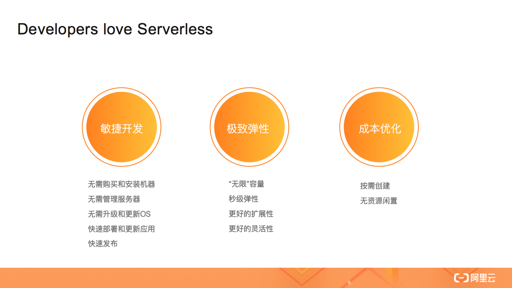

以上所讲的几种都是 Serverless 理念的核心价值，也是 Serverless 容器与其他 Sererless 形态的相同之处。然而，Serverless 容器和其他 Serverless 形态的差异，在于它是基于容器的交付形态。

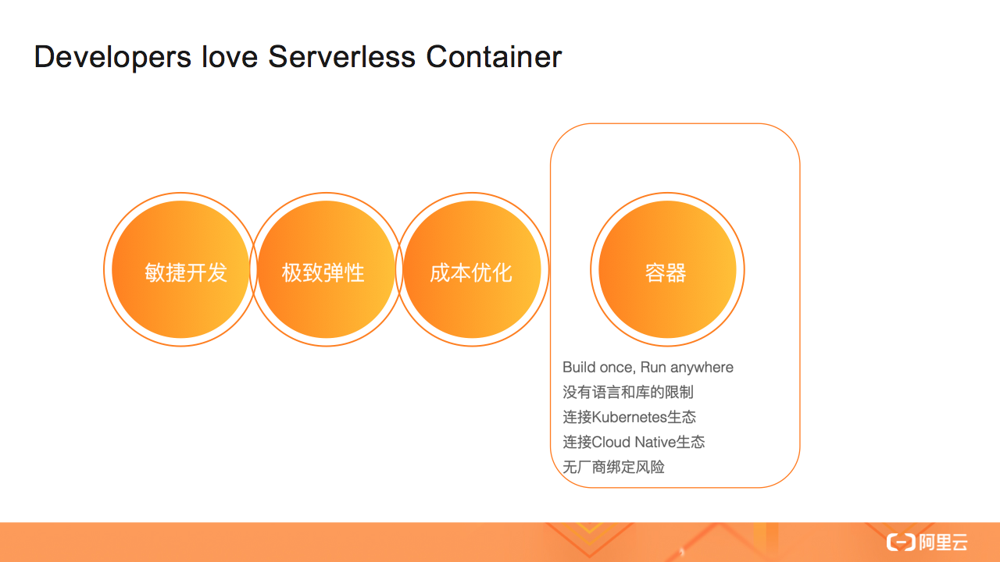

基于容器意味着通用性和标准性，我们可以 Build once and Run anywhere，容器不受语言和库的限制，无论任何应用都可以制作成容器镜像，然后以容器的部署方式启动。基于容器的标准化，开源社区以 Kubernetes 为中心构建了丰富的云原生 Cloud Native 生态，极大地丰富了 Serverless 容器的周边应用框架和工具，比如可以非常方便地部署 Helm Chart 包。基于容器和 Kubernetes 标准化，我们可以轻松地在不同环境中（线上线下环境），甚至在不同云厂商之间进行应用迁移，而不用担心厂商锁定。这些都是 Serverless 容器的核心价值。

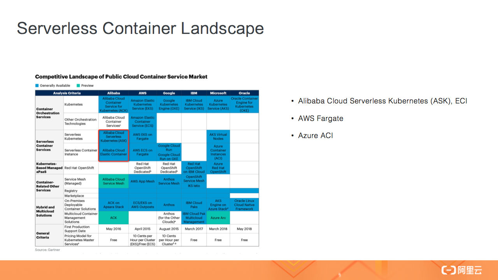 （Serverless 容器产品 Landscape）

当下各大云厂商都推出了自己的 Serverless 容器服务，上图为 Gartner 评估机构整理的 Serverless 容器产品 Landscape，其中阿里云有 Serverless Kubernetes ASK 和 ECI；AWS 有 Fargate，基于 Fargate 有 EKS on Fargate 和 ECS on Fargate 两种形态；Azure 有 ACI。另外 Gartner 也预测，到 2023 年，将有 70% 的 AI 应用以容器和 Serverless 方式运行。

### ASK/ACK on ECI 容器服务

下面介绍阿里云 Serverless 容器产品家族：ECI、 ACK on ECI 和 Serverless Kubernetes。

#### 1. ECI

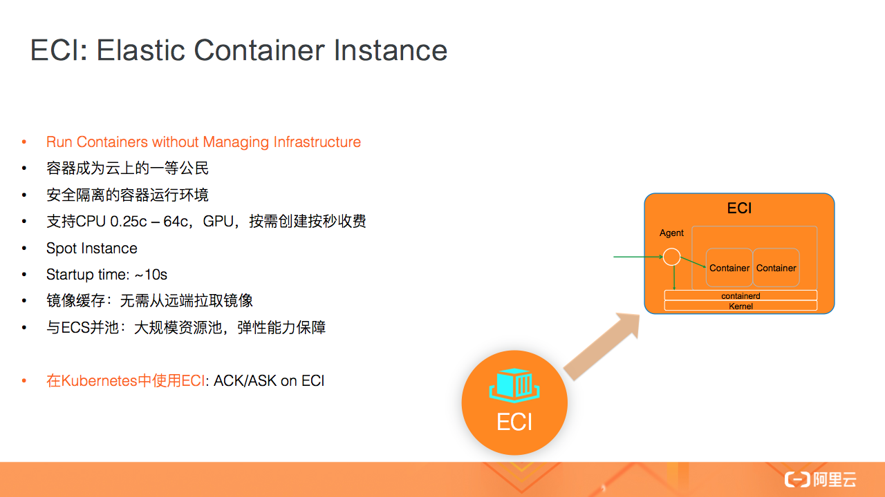

ECI 全称是“Elastic Container Instance 弹性容器实例”，是 Serverless 容器的底层基础设施，实现了容器镜像的启动。ECI 让容器成为和 ECS 一样的云上一等公民。ECI 底层运行环境基于安全容器技术进行强隔离，每个 ECI 拥有一个独立的 OS 运行环境，保证运行时的安全性。ECI 支持 0.25c 到 64c 的 CPU 规格，也支持 GPU，按需创建按秒收费。和 ECS 一样，ECI 也支持 Spot 可抢占式实例，在一些场景中可以节省 90% 的成本。ECI 实例的启动时间目前约是 10s 左右，然后开始拉取容器镜像。我们也提供了镜像快照功能，每次容器启动时从快照中读取镜像，省去远端拉取的时间。值得强调的是，ECI 和 ECS 共用一个弹性计算资源池，这意味着 ECI 的弹性供给能力可以得到最大程度的充分保障，让 ECI 用户享受弹性计算资源池的规模化红利。

ECI 只可以做到单个容器实例的创建，而没有编排的能力，比如让应用多副本扩容，让 SLB 和 Ingress 接入 Pod 流量，所以我们需要在编排系统 Kubernetes 中使用 ECI，我们提供了两种在 Kubernetes 中使用 ECI 的方式。一个是 ACK on ECI，另外一个是 ASK。

在与 Kubernetes 编排系统的集成中，我们以 Pod 的形式管理每个 ECI 容器实例，每个 Pod 对应一个 ECI 实例， ECI Pod 之间相互隔离，一个 ECI Pod 的启动时间约是 10s。因为是在 Kubernetes 集群中管理 ECI Pod，所以完全连接了 Kubernetes 生态，有以下几点体现：

- 很方便地用 Kubectl 管理 ECI Pod，可以使用标准的 Kubernetes 的 API 操作资源；
- 通过 Service 和 Ingress 连接 SLB 和 ECI Pod；
- 使用 Deployment / Statefulset 进行容器编排，使用 HPA 进行动态扩容；
- 可以使用 Proms 来监控 ECI Pod；
- 运行 Istio 进行流量管理，Spark / Presto 做数据计算，使用 Kubeflow 进行机器学习；
- 部署各种 Helm Chart。

这些都是使用 Kubernetes 管理容器实例的价值所在。

需要留意的是 Kubernetes 中的 ECI Pod 是 Serverless 容器，所以与普通的 Pod 相比，不支持一些功能（比如 Daemonset），不支持 Prividge 权限，不支持 HostPort 等。除此之外，ECI Pod 与普通 Pod 能力一样，比如支持挂载云盘、NAS 和 OSS 数据卷等。

#### 2. ACK on ECI

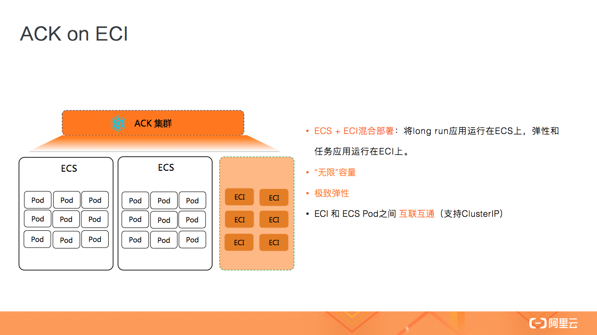

接下来我们看下在 ACK Kubernetes 集群中使用 ECI 的方式。这种方式适合于用户已经有了一个 ACK 集群，集群中已经有了很多 ECS 节点，此时可以基于 ECI 的弹性能力来运行一些短时间 Short-Run 的应用，以解决元集群资源不足的问题，或者使用 ECI 来支撑应用的快速扩容，因为使用 ECI 进行扩容的效率要高于 ECS 节点扩容。

在 ACK on ECI 中，ECS 和 ECI Pod 可以互联互通，ECI Pod 可以访问集群中的 Coredns，也可以访问 ClusterIP Service。

#### 3. Serverless Kubernetes

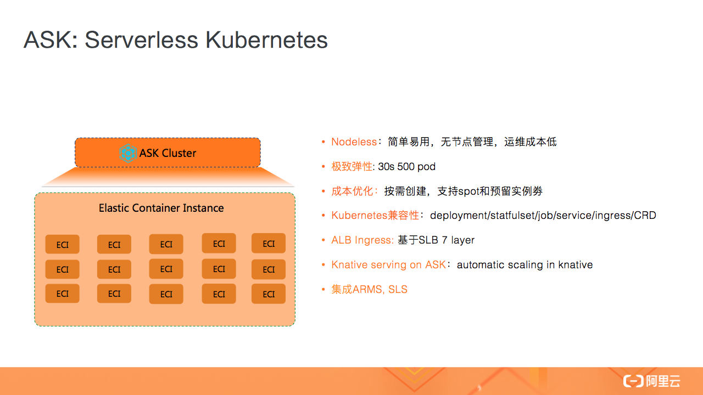

与 ACK on ECI 不同的是，ASK Serverless Kubernetes 集群中没有 ECS 节点，这是和传统 Kubernetes 集群最主要的差异，所以在 ASK 集群中无需管理任何节点，实现了彻底的免节点运维环境，是一个纯粹的 Serverless 环境，它让 Kubernetes 的使用门槛大大降低，也丢弃了繁琐的底层节点运维工作，更不会遇到节点 Notready 等问题。在 ASK 集群中，用户只需关注应用本身，而无需关注底层基础设施管理。

ASK 的弹性能力会优于普通 Kubernetes 集群，目前是 30s 创建 500 个 Pod 到 Running 状态。集群中 ECI Pod 默认是按量收费，但也支持 Spot 和预留实例劵来降低成本。在兼容性方面，ASK 中没有真实节点存在，所以不支持 Daemonset 等与节点相关的功能，像 Deployment / Statefulset / Job / Service / Ingress / CRD 等都是无缝支持的。

ASK 中默认的 Ingress 是基于 SLB 7 层转发实现，用户无需部署 Nginx Ingress，维护更加简单。

同时基于 SLB 7 层我们实现了 Knative Serving 能力，其中 Knative Controller 被 ASK 托管，用户无需负担 Controller 的成本。

与 ACK 一样，ASK 和 Arms / SLS 等云产品实现了很好的集成，可以很方便地对 Pod 进行监控，把 Pod 日志收集到 SLS 中。

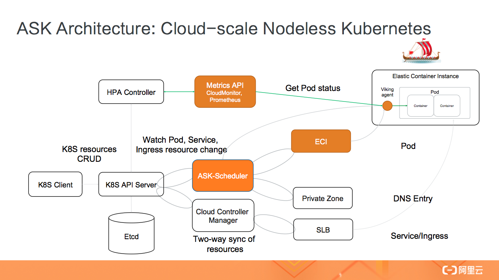

这是 ASK 的整体架构，核心部分是 ASK-Schduler，它负责 Watch Pod 的变化，然后创建对应的 ECI 实例，同时把 ECI 实例状态同步到 Pod。集群中没有真实 ECS 节点注册到 Apiserver。这个 Nodeless 架构解耦了 Kubernetes 编排层和 ECI 资源层，让 Kubernetes 彻底摆脱底层节点规模导致的弹性和容量限制，成为面向云的 Nodeless Kubernetes 弹性架构。

### ASK 典型功能

下面介绍 ASK 的几个典型功能：

#### 1. GPU 实例

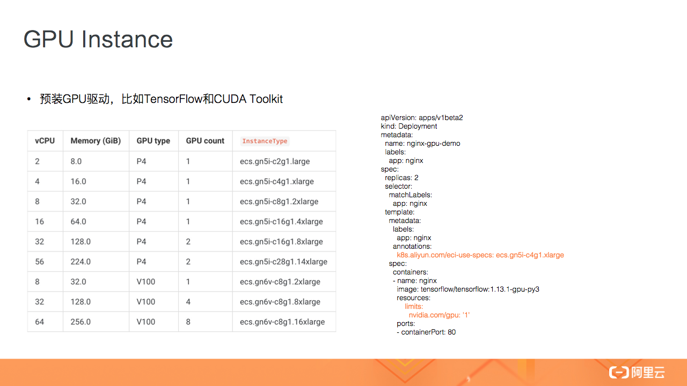

第一个是 GPU 实例，在 Serverless 集群中使用 GPU 容器实例是一件非常简单的事情，不需要安装 GPU 驱动，只需要指定 GPU Pod 规格，以及容器需要的 GPU 卡数，然后就可以一键部署，这对于机器学习场景可以极大提高开发和测试的效率。

#### 2. Spot 抢占式实例

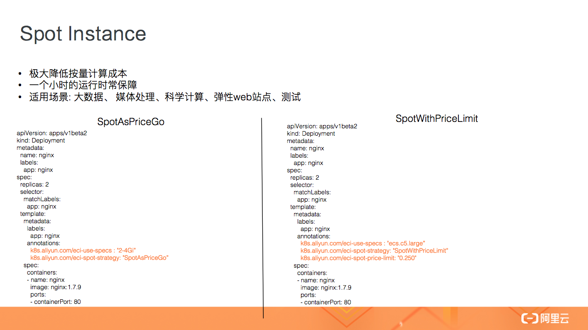

第二个是 Spot 抢占式实例。抢占式实例是一种按需实例，可以在数据计算等场景中降低计算成本。抢占式实例创建成功后拥有一小时的保护周期。抢占式实例的市场价格会随供需变化而浮动，我们支持两种 Spot 策略，一种是完全根据市场出价，一种是指定价格上限，我们只需要给 Pod 加上对应的 Annotation 即可，使用方法非常简单。

#### 3. 弹性负载 Elastic Workload

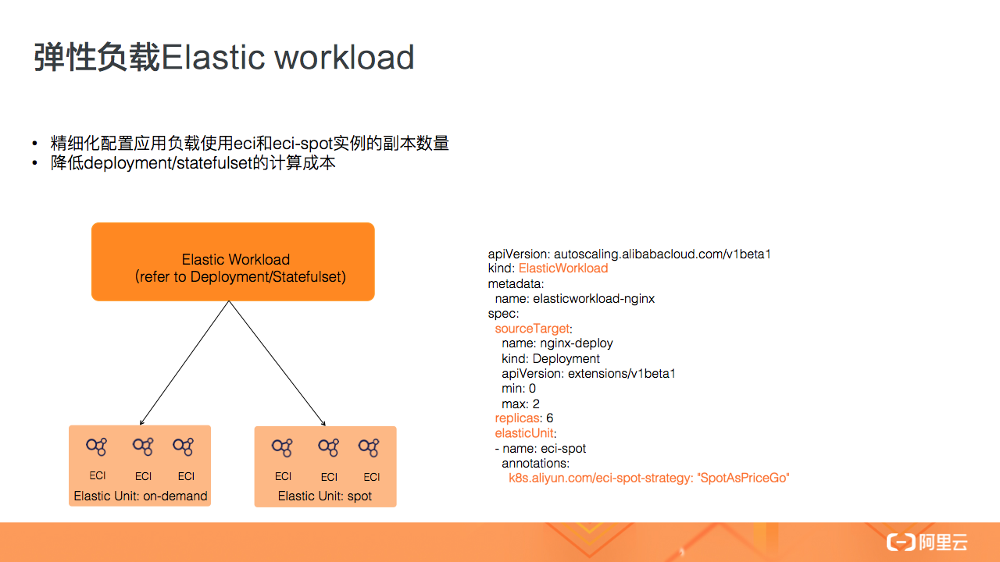

第三个重要功能是弹性负载 Elastic Workload，弹性负载实现了 Deployment 多个副本调度在不同的单元上，比如 ECS、ECI 和 ECI-Spot 上，通过这种混合调度的模式，可以降低负载的计算成本。在这个示例中，Deployment 是 6 个副本，其中 2 个为正常的 ECI Pod，其他副本为 ECI-Spot 实例。

### ASK 使用场景

上面我们已经对 Serverless Kubernetes 做了基本的产品和功能介绍，那么 ASK 适合在哪些场景中使用呢？**

#### 1. 免运维应用托管

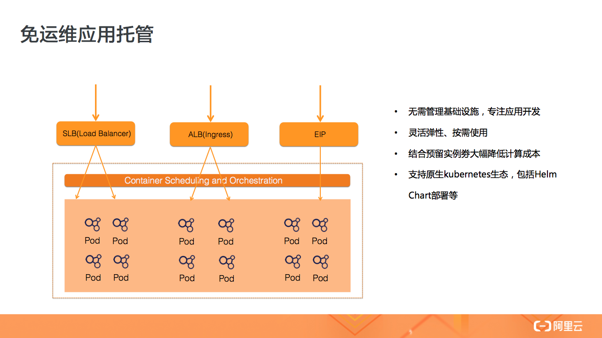

Serverless 集群最大的特点是解决了底层节点资源的运维问题，所以其非常适合对应用的免运维托管，让用户关注在应用开发本身。在传统 K8s 集群中的应用可以无缝部署在 Serverless 集群中，包括各种 Helm Chart。同时结合预留实例劵可以降低 Pod 的长计算成本。

#### 2. ECI 弹性资源池

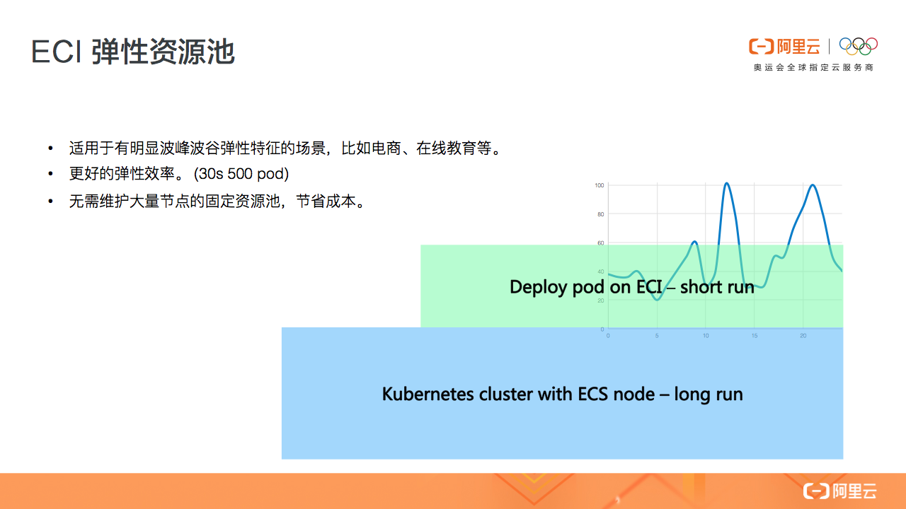

第二个场景是 ACK on ECI 的优势，我们可以选择把 ECI 作为弹性资源池，加到已有的 Kubernetes 集群中，当应用业务高峰来临时，通过 ECI 动态灵活地扩容，相比 ECS 节点扩容更有效率，这种比较适合电商或者在线教育这类有着明显波峰波谷的业务场景，用户无需管理一个很大的节点资源池，通过 ECI 弹性能力来降低整体计算成本。

#### 3. 大数据计算

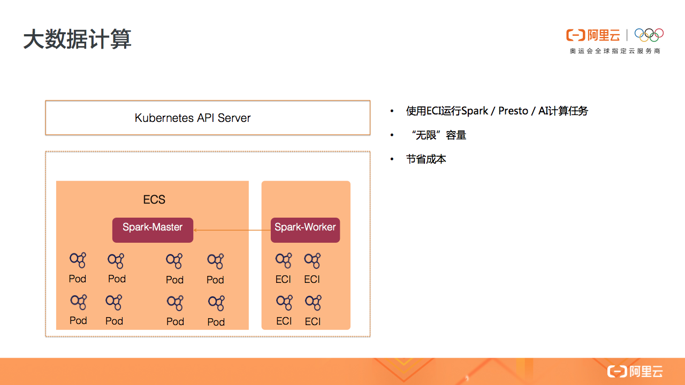

第三个场景是大数据计算，很多用户使用 Serverless 集群或者 ACK on ECI 来进行 Spark / Presto / AI 等数据计算或者机器学习，利用 ECI 可以轻松解决资源规划和不足的问题。

#### 4. CI/CD 持续集成

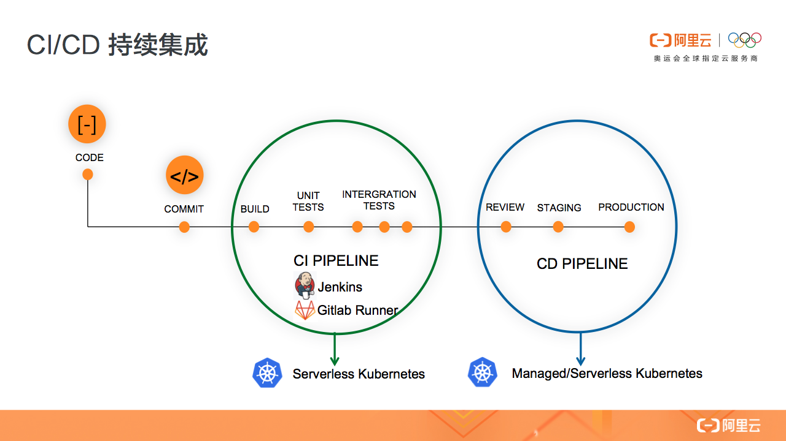

第四个场景是 CI/CD 持续集成，将 Jenkins 和 Gitlab-Runner 对接 ASK 集群，按需创建 CI/CD 构建任务，构建完成后直接部署到 ASK 测试环境进行验证，这样我们无需为 Job 类任务维护一个固定资源池，按需创建极大降低成本，另外如果结合 Spot 实例还能进一步降低成本。

以上就是 Serverless Kubernetes 集群的典型场景，另有快速使用链接、产品文档以及使用示例，供大家学习交流：

- 控制台：[https://cs.console.aliyun.com/ask](https://cs.console.aliyun.com/ask)
- 产品文档：[https://www.alibabacloud.com/help/doc-detail/86366.htm](https://www.alibabacloud.com/help/doc-detail/86366.htm)
- 示例：[https://github.com/AliyunContainerService/serverless-k8s-examples](https://github.com/AliyunContainerService/serverless-k8s-examples)
