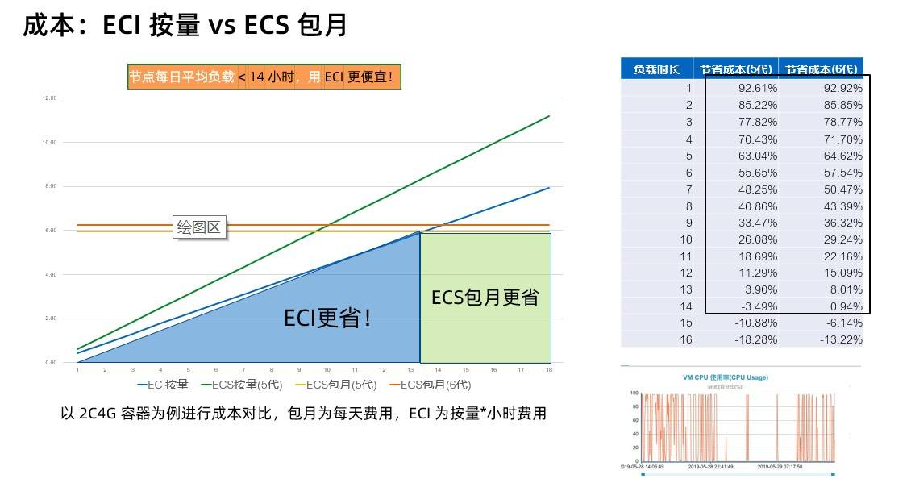
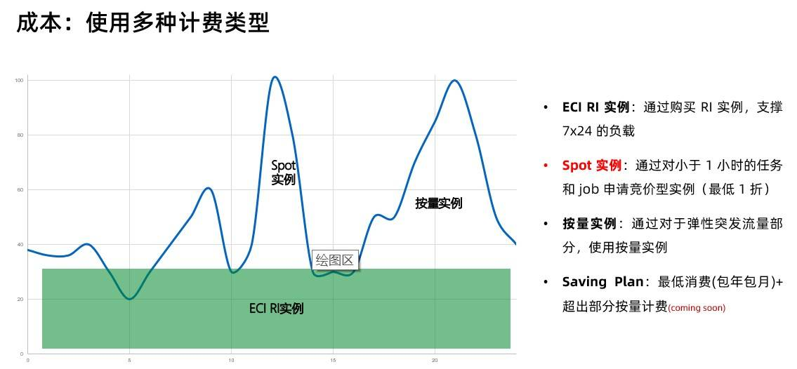
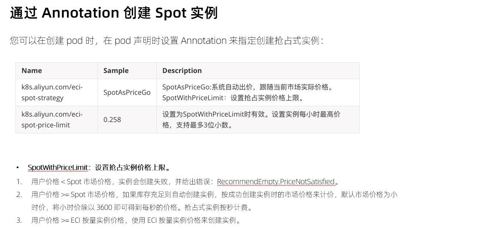
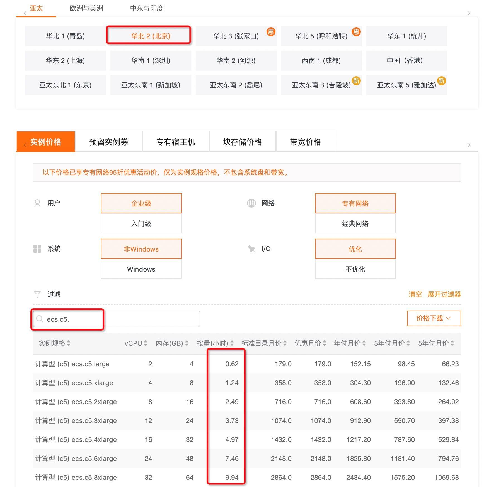
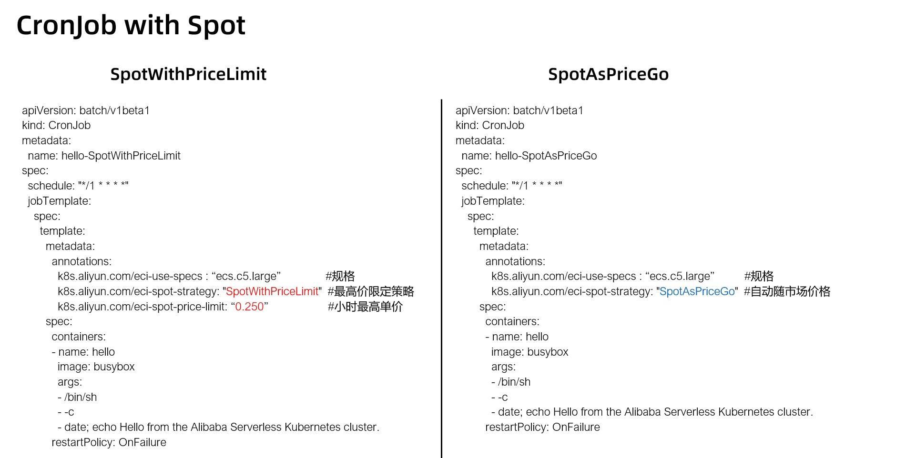
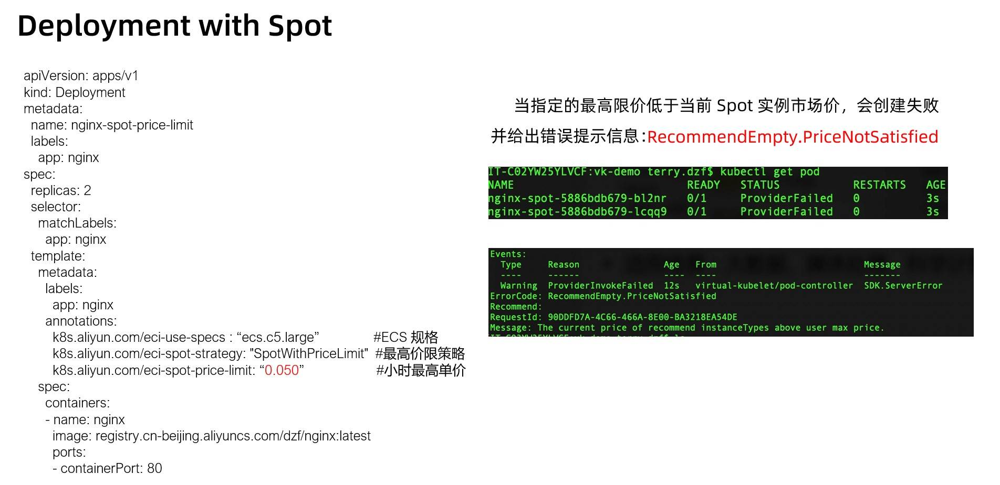
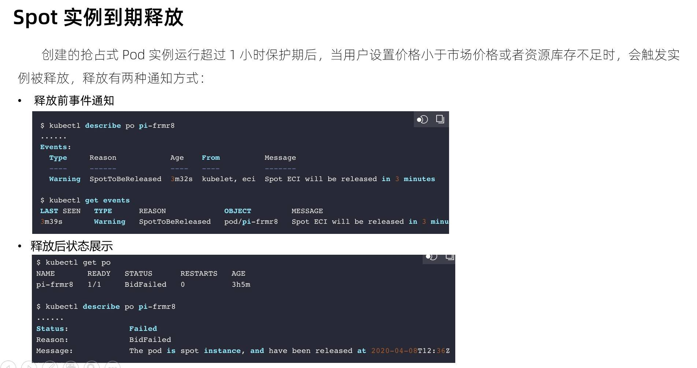

16 使用 Spot 低成本运行 Job 任务
=======================

### 成本优化

ECI 除了有秒级弹性、无限容量的优势之外，在一些特定场景下对成本的优化也是非常明显的，通过上图我们可以看到，相同规格的实例，在日运行时间少于 14 小时的时候，使用 ECI 会更加便宜。

除了日运行时长小于 14 小时的情形，ECI 实例还支持多种计费类型，客户可以根据自身业务选择相应的计费模式：long run 类型的可以采用 RI 实例券；运行时长低于 1 小时可以选用 Spot 竞价实例；针对突发流量部分，采用按量实例。

### Spot 实例概述

抢占式实例是一种按需实例，可以在数据计算等场景中降低计算成本。抢占式实例创建成功后拥有一小时的保护周期。抢占式实例的市场价格会随供需变化而浮动，我们支持两种 spot 策略，一种是完全根据市场出价，一种是指定价格上限，我们只需要给 pod 加上对应的 annotation 即可，使用方法非常简单。

* SpotAsPriceGo：系统自动出价，跟随当前市场实际价格（通常以折扣的形式体现）
* SpotWithPriceLimit：设置抢占实例价格上限
* 用户价格 < Spot 市场价格，实例会处于 pending 状态，并每 5 分钟自动进行一次出价，当价格等于或高于市场价格时，开始自动创建实例。运行一小时后，市场价格如果高于用户价格，则实例随时可能会被释放；
* 用户价格 >= Spot 市场价格，如果库存充足则自动创建实例，按成功创建实例时的市场价格来计价，默认市场价格为小时价，将小时价除以 3600 即可得到每秒的价格。抢占式实例按秒计费；
* 用户价格 >= ECI 按量实例价格，使用 ECI 按量实例价格来创建实例。

### 创建 Spot 实例

* 根据规格查看实例按量价格，[点击查询](https://www.aliyun.com/price/product#/ecs/detail)

首先我们查询出【华北 2（北京）地域 ecs.c5.large 按量（小时）价格：0.62】，然后我们以此规格来创建 Spot 竞价实例。

采用 Spot 实例来运行 CronJob，分别采用“指定最高限价”、“系统自动出价”的方式。随市场价的场景目前还没有办法直接看到真实的价格，只能根据实例 ID 查询账单信息。

采用 Spot 实例运行 Deployment，在本次实验中我们采用指定最高限价的策略，并设置一个极低的小时价格，可以看到 2 个 Pod 都创建失败了，使用 kubectl describe 命令可以看到失败的详细原因为价格不匹配：The current price of recommend instanceTypes above user max price。

如上图所示，当 Spot 实例运行超过 1 小时保护期后，有可能会因为库存不足，或者设置的价格小于市场价而触发实例释放，实例释放前 3 分钟会有事件通知。

### 应用场景

您可以在抢占式实例上部署以下业务：

* 实时分析业务
* 大数据计算业务
* 可弹性伸缩的业务站点
* 图像和媒体编码业务
* 科学计算业务
* 地理空间勘测分析业务
* 网络爬虫业务
* 测试业务

抢占式实例适用于无状态的应用场景，例如可弹性伸缩的 Web 站点服务、图像渲染、大数据分析和大规模并行计算等。应用程序的分布度、可扩展性和容错能力越高，越适合使用抢占式实例节省成本和提升吞吐量。

### 注意事项

* **如何避免出价过低导致实例抢占失败？**

需要结合自身业务特征，并充分考虑到市场价格波动的情况下选择合理的出价。

* **系统自动出价，1 小时到期后是否会被释放？**

1 小时到期时，系统会尝试再次出价，如库存充足则不会被释放。

* **系统自动出价上限是多少？**

不超过相同规格按量最高价（原价）。

* **是否仅支持 ECS InstanceType 形式？**

抢占式 ECI 实例依然支持 ECS InstanceType、CPU / 内存形式两种创建方式。

* **是否支持 GPU 实例？**

支持，跟非 GPU 方式一样。
