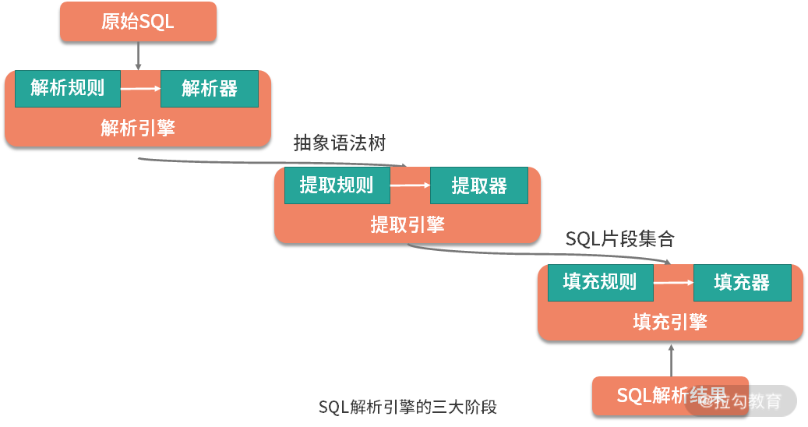
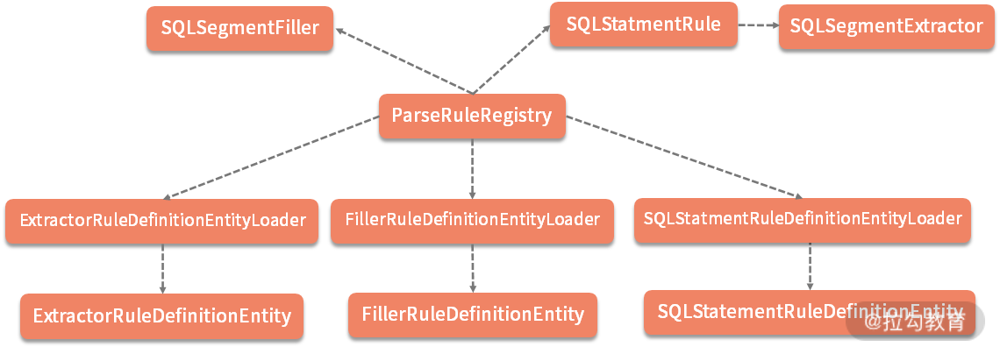
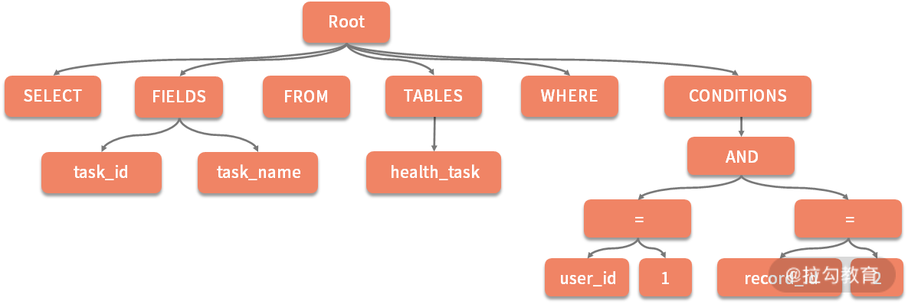
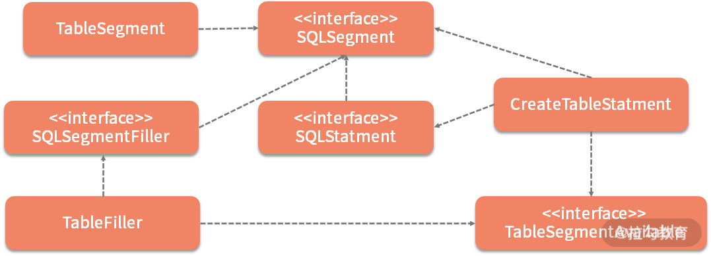

# 16 解析引擎：SQL 解析流程应该包括哪些核心阶段？（下）

我们知道整个 SQL 解析引擎可以分成三个阶段（如下图所示），上一课时我们主要介绍了 ShardingSphere 中 SQL 解析引擎的第一个阶段，那么今天我将承接上一课时，继续讲解 ShardingSphere 中 SQL 解析流程中剩余的两个阶段。



### SQL 解析引擎的三大阶段

在 SQL 解析引擎的第一阶段中，我们详细介绍了 ShardingSphere 生成 SQL 抽象语法树的过程，并引出了 SQLStatementRule 规则类。今天我们将基于这个规则类来分析如何提取 SQLSegment 以及如何填充 SQL 语句的实现机制。

#### 1.第二阶段：提取 SQL 片段

要理解 SQLStatementRule，就需要先介绍 ParseRuleRegistry 类。从命名上看，该类就是一个规则注册表，保存着各种解析规则信息。ParseRuleRegistry 类中的核心变量包括如下所示的三个 Loader 类：

```
 private final ExtractorRuleDefinitionEntityLoader extractorRuleLoader = new ExtractorRuleDefinitionEntityLoader(); 

     

    private final FillerRuleDefinitionEntityLoader fillerRuleLoader = new FillerRuleDefinitionEntityLoader(); 

     

    private final SQLStatementRuleDefinitionEntityLoader statementRuleLoader = new SQLStatementRuleDefinitionEntityLoader(); 

```

从命名上可以看到这三个 Loader 类分别处理对 SQLStatementRule、ExtractorRule 和 FillerRule 这三种规则定义的加载。

我们先来看 SQLStatementRule，它们的定义位于 sql-statement-rule-definition.xml 配置文件中。我们以 Mysql 为例，这个配置文件位于 shardingsphere-sql-parser-mysql 工程中的 META-INF/parsing-rule-definition/mysql 目录下。我们截取该配置文件中的部分配置信息作为演示，如下所示：

```
<sql-statement-rule-definition> 

    <sql-statement-rule context="select" sql-statement-class="org.apache.shardingsphere.sql.parser.sql.statement.dml.SelectStatement" extractor-rule-refs="tableReferences, columns, selectItems, where, predicate, groupBy, orderBy, limit, subqueryPredicate, lock" /> 

    <sql-statement-rule context="insert" sql-statement-class="org.apache.shardingsphere.sql.parser.sql.statement.dml.InsertStatement" extractor-rule-refs="table, columns, insertColumns, insertValues, setAssignments, onDuplicateKeyColumns" /> 

    <sql-statement-rule context="update" sql-statement-class="org.apache.shardingsphere.sql.parser.sql.statement.dml.UpdateStatement" extractor-rule-refs="tableReferences, columns, setAssignments, where, predicate" /> 

    <sql-statement-rule context="delete" sql-statement-class="org.apache.shardingsphere.sql.parser.sql.statement.dml.DeleteStatement" extractor-rule-refs="tables, columns, where, predicate" /> 

… 

</sql-statement-rule-definition> 

```

基于 ParseRuleRegistry 类进行规则获取和处理过程，涉及一大批实体对象以及用于解析 XML 配置文件的 JAXB 工具类的定义，内容虽多但并不复杂。核心类之间的关系如下图所示：



ParseRuleRegistry 类层结构图

当获取规则之后，对于具体某种数据库类型的每条 SQL 而言，都会有一个 SQLStatementRule 对象。我们注意到每个 SQLStatementRule 都定义了一个“context”以及一个“sql-statement-class”。

这里的 context 实际上就是通过 SQL 解析所生成的抽象语法树 SQLAST 中的 ParserRuleContext，包括 CreateTableContext、SelectContext 等各种 StatementContext。而针对每一种 context，都有专门的一个 SQLStatement 对象与之对应，那么这个 SQLStatement 究竟长什么样呢？我们来看一下。

```
public interface SQLStatement { 

     

    //获取参数个数 

    int getParametersCount(); 

     

    //获取所有SQLSegment 

    Collection<SQLSegment> getAllSQLSegments(); 

     

    //根据类型获取一个SQLSegment 

    <T extends SQLSegment> Optional<T> findSQLSegment(Class<T> sqlSegmentType); 

     

    //根据类型获取一组SQLSegment 

    <T extends SQLSegment> Collection<T> findSQLSegments(Class<T> sqlSegmentType); 

} 

```

你可以看到，作为解析引擎最终产物的 SQLStatement ，实际上封装的是对 SQL 片段对象 SQLSegment 的获取操作。显然，对于每一个 ParserRuleContext 而言，我们最终就是构建了一个包含一组 SQLSegment 的 SQLStatement 对象，而这些 SQLSegment 的构建过程就是所谓的提取 SQLSegment 的过程。我们在配置文件中也明确看到了 SQLStatementRule 中对各种提取规则对象 ExtractorRule 的引用。

在 ShardingSphere 中内置了一大批通用的 SQLSegment，包括查询选择项（SelectItems）、表信息（Table）、排序信息（OrderBy）、分组信息（GroupBy）以及分页信息（Limit）等。这些通用 SQLSegment 都有对应的 SQLSegmentExtractor，我们可以直接在 SQLStatementRule 中进行使用。

另一方面，考虑到 SQL 方言的差异性，ShardingSphere 同样提供了针对各种数据库的 SQLSegment 的提取器定义。以 Mysql 为例，在其代码工程的 META-INF/parsing-rule-definition/mysql 目录下，存在一个 extractor-rule-definition.xml 配置文件，专门用来定义针对 Mysql 的各种 SQLSegmentExtractor，部分定义如下所示，作为一款适用于多数据库的中间件，这也是 ShardingSphere 应对 SQL 方言的实现机制之一。

```
<extractor-rule-definition> 

    <extractor-rule id="addColumnDefinition" extractor-class="org.apache.shardingsphere.sql.parser.core.extractor.ddl.MySQLAddColumnDefinitionExtractor" /> 

    <extractor-rule id="modifyColumnDefinition" extractor-class="org.apache.shardingsphere.sql.parser.core.extractor.ddl.MySQLModifyColumnDefinitionExtractor" /> 

    … 

</extractor-rule-definition> 

```

现在，假设有这样一句 SQL：

```
SELECT task_id, task_name FROM health_task WHERE user_id = 'user1' AND record_id = 2  

```

通过解析，我们获取了如下所示的抽象语法树：



抽象语法树示意图

我们发现，对于上述抽象语法树中的某些节点（如 SELECT、FROM 和 WHERE）没有子节点，而对于如 FIELDS、TABLES 和 CONDITIONS 节点而言，本身也是一个树状结构。显然，这两种节点的提取规则应该是不一样的。

因此，ShardingSphere 提供了两种 SQLSegmentExtractor，一种是针对单节点的 OptionalSQLSegmentExtractor；另一种是针对树状节点的 CollectionSQLSegmentExtractor。由于篇幅因素，这里以 TableExtractor 为例，展示如何提取 TableSegment 的过程，TableExtractor 的实现方法如下所示：

```
public final class TableExtractor implements OptionalSQLSegmentExtractor { 

     

    @Override 

    public Optional<TableSegment> extract(final ParserRuleContext ancestorNode, final Map<ParserRuleContext, Integer> parameterMarkerIndexes) { 

        //从Context中获取TableName节点 

     Optional<ParserRuleContext> tableNameNode = ExtractorUtils.findFirstChildNode(ancestorNode, RuleName.TABLE_NAME); 

        if (!tableNameNode.isPresent()) { 

            return Optional.absent(); 

        }         

        //根据TableName节点构建TableSegment 

        TableSegment result = getTableSegment(tableNameNode.get()); 

        //设置表的别名 

        setAlias(tableNameNode.get(), result); 

        return Optional.of(result); 

    } 

     

    private TableSegment getTableSegment(final ParserRuleContext tableNode) { 

     //从Context中获取Name节点       

        ParserRuleContext nameNode = ExtractorUtils.getFirstChildNode(tableNode, RuleName.NAME); 

        //根据Name节点获取节点的起止位置以及节点内容 

        TableSegment result = new TableSegment(nameNode.getStart().getStartIndex(), nameNode.getStop().getStopIndex(), nameNode.getText()); 

        //从Context中获取表的Owner节点，如果有的话就设置Owner 

        Optional<ParserRuleContext> ownerNode = ExtractorUtils.findFirstChildNodeNoneRecursive(tableNode, RuleName.OWNER); 

        if (ownerNode.isPresent()) { 

            result.setOwner(new SchemaSegment(ownerNode.get().getStart().getStartIndex(), ownerNode.get().getStop().getStopIndex(), ownerNode.get().getText())); 

        } 

        return result; 

    } 

     

    private void setAlias(final ParserRuleContext tableNameNode, final TableSegment tableSegment) { 

     //从Context中获取Alias节点，如果有的话就设置别名 

     Optional<ParserRuleContext> aliasNode = ExtractorUtils.findFirstChildNode(tableNameNode.getParent(), RuleName.ALIAS); 

        if (aliasNode.isPresent()) { 

            tableSegment.setAlias(aliasNode.get().getText()); 

        } 

    } 

} 

```

显然，语法树中的 Table 是一种单节点，所以 TableExtractor 继承自 OptionalSQLSegmentExtractor。对于 TableExtractor 而言，整个解析过程就是从 ParserRuleContext 中获取与表定义相关的各种节点，然后通过节点的起止位置以及节点内容来构建 TableSegment 对象。TableSegment 实现了 SQLSegment，其核心变量的定义也比较明确，如下所示：

```
public final class TableSegment implements SQLSegment, TableAvailable, OwnerAvailable<SchemaSegment>, AliasAvailable { 

     

    private final int startIndex;     

    private final int stopIndex;   

    private final String name;  

    private final QuoteCharacter quoteCharacter; 

    private SchemaSegment owner;  

 private String alias; 

       … 

} 

```

现在，基于以上关于提取器以及提取操作的相关概念的理解，我们来看一下 SQLSegment 提取引擎 SQLSegmentsExtractorEngine 的实现，如下所示：

```
public final class SQLSegmentsExtractorEngine { 

     

    //用来提取SQLAST语法树中的SQL片段 

    public Collection<SQLSegment> extract(final SQLAST ast) { 

        Collection<SQLSegment> result = new LinkedList<>(); 

         

        //遍历提取器，从Context中提取对应类型的SQLSegment，比如TableSegment         

        for (SQLSegmentExtractor each : ast.getSqlStatementRule().getExtractors()) {            

            //单节点的场景，直接提取单一节点下的内容 

            if (each instanceof OptionalSQLSegmentExtractor) { 

                Optional<? extends SQLSegment> sqlSegment = ((OptionalSQLSegmentExtractor) each).extract(ast.getParserRuleContext(), ast.getParameterMarkerIndexes()); 

                if (sqlSegment.isPresent()) { 

                    result.add(sqlSegment.get()); 

                } 

                 

            树状节点的场景，遍历提取节点下的所有子节点// 

            } else if (each instanceof CollectionSQLSegmentExtractor) { 

                result.addAll(((CollectionSQLSegmentExtractor) each).extract(ast.getParserRuleContext(), ast.getParameterMarkerIndexes())); 

            } 

        } 

        return result; 

    } 

} 

```

显然，SQLSegmentsExtractorEngine 的作用就是针对某一条 SQL，遍历 SQLStatementRule 中所配置的提取器，然后从 Context 中提取对应类型的 SQLSegment，并最终存放在一个集合对象中进行返回。

#### 2.第三阶段：填充 SQL 语句

完成所有 SQLSegment 的提取之后，我们就来到了解析引擎的最后一个阶段，即填充 SQLStatement。所谓的 **填充过程** ，就是通过填充器 SQLSegmentFiller 为 SQLStatement 注入具体 SQLSegment 的过程。这点从 SQLSegmentFiller 接口定义中的各个参数就可以得到明确，如下所示：

```
public interface SQLSegmentFiller<T extends SQLSegment> { 

     

    void fill(T sqlSegment, SQLStatement sqlStatement); 

} 

```

那么问题就来了，我们如何正确把握 SQLSegmentFiller、SQLSegment 和 SQLStatement 这三者之间的处理关系呢？我们先根据某个 SQLSegment 找到对应的 SQLSegmentFiller，这部分关系在 ShardingSphere 中同样是维护在一个 filler-rule-definition.xml 配置文件中，截取部分配置项如下所示：

```
<filler-rule-definition> 

    <filler-rule sql-segment-class="org.apache.shardingsphere.sql.parser.sql.segment.generic.TableSegment" filler-class="org.apache.shardingsphere.sql.parser.core.filler.impl.TableFiller" /> 

    <filler-rule sql-segment-class="org.apache.shardingsphere.sql.parser.sql.segment.generic.SchemaSegment" filler-class="org.apache.shardingsphere.sql.parser.core.filler.impl.dal.SchemaFiller" /> 

 … 

</filler-rule-definition> 

```

显然，这里保存着 SQLSegment 与 SQLSegmentFiller 之间的对应关系。当然，对于不同的 SQL 方言，也同样可以维护自身的 filler-rule-definition.xml 文件。

我们还是以与 TableSegment 对应的 TableFiller 为例，来分析一个 SQLSegmentFiller 的具体实现方法，TableFiller 类如下所示：

```
public final class TableFiller implements SQLSegmentFiller<TableSegment> { 

     

    @Override 

    public void fill(final TableSegment sqlSegment, final SQLStatement sqlStatement) { 

        if (sqlStatement instanceof TableSegmentAvailable) { 

            ((TableSegmentAvailable) sqlStatement).setTable(sqlSegment); 

        } else if (sqlStatement instanceof TableSegmentsAvailable) { 

            ((TableSegmentsAvailable) sqlStatement).getTables().add(sqlSegment); 

        } 

    } 

} 

```

这段代码在实现上采用了回调机制来完成对象的注入。在 ShardingSphere 中，基于回调的处理方式也非常普遍。本质上，回调解决了因为类与类之间的相互调用而造成的循环依赖问题，回调的实现策略通常采用了如下所示的类层结构：


回调机制示意图

TableFiller 中所依赖的 TableSegmentAvailable 和 TableSegmentsAvailable 接口就类似于上图中的 Callback 接口，具体的 SQLStatement 就是 Callback 的实现类，而 TableFiller 则是 Callback 的调用者。以 TableFiller 为例，我们注意到，如果对应的 SQLStatement 实现了这两个接口中的任意一个，那么就可以通过 TableFiller 注入对应的 TableSegment，从而完成 SQLSegment 的填充。

这里以 TableSegmentAvailable 接口为例，它有一组实现类，如下所示：


TableSegmentAvailable实现类

以上图中的 CreateTableStatement 为例，该类同时实现了 TableSegmentAvailable 和 IndexSegmentsAvailable 这两个回调接口，所以就可以同时操作 TableSegment 和 IndexSegment 这两个 SQLSegment。CreateTableStatement 类的实现如下所示：

```
public final class CreateTableStatement extends DDLStatement implements TableSegmentAvailable, IndexSegmentsAvailable { 

     

    private TableSegment table; 

     

    private final Collection<ColumnDefinitionSegment> columnDefinitions = new LinkedList<>(); 

     

    private final Collection<IndexSegment> indexes = new LinkedList<>(); 

} 

```

至此，我们通过一个示例解释了与填充操作相关的各个类之间的协作关系，如下所示的类图展示了这种协作关系的整体结构。



SQLStatement类层结构图

有了上图的基础，我们理解填充引擎 SQLStatementFillerEngine 就显得比较简单了，SQLStatementFillerEngine 类的实现如下所示：

```
public final class SQLStatementFillerEngine { 

     

    private final ParseRuleRegistry parseRuleRegistry;     

    private final String databaseTypeName; 

    

    @SuppressWarnings("unchecked") 

    @SneakyThrows 

    public SQLStatement fill(final Collection<SQLSegment> sqlSegments, final int parameterMarkerCount, final SQLStatementRule rule) { 

     //从SQLStatementRule中获取SQLStatement实例，如CreateTableStatement 

     SQLStatement result = rule.getSqlStatementClass().newInstance(); 

        //通过断言对SQLStatement的合法性进行校验 

     Preconditions.checkArgument(result instanceof AbstractSQLStatement, "%s must extends AbstractSQLStatement", result.getClass().getName()); 

         

        //设置参数个数 

        ((AbstractSQLStatement) result).setParametersCount(parameterMarkerCount); 

       

        //添加所有的SQLSegment到SQLStatement中 

        result.getAllSQLSegments().addAll(sqlSegments); 

         

        //遍历填充对应类型的SQLSegment 

        for (SQLSegment each : sqlSegments) { 

         //根据数据库类型和SQLSegment找到对应的SQLSegmentFiller，并为SQLStatement填充SQLSegment 

            //如通过TableSegment找到获取TableFiller，然后通过TableFiller为CreateTableStatement填充TableSegment 

         Optional<SQLSegmentFiller> filler = parseRuleRegistry.findSQLSegmentFiller(databaseTypeName, each.getClass()); 

            if (filler.isPresent()) {                

              //利用SQLSegmentFiller来填充SQLStatement中的SQLSegment 

                filler.get().fill(each, result); 

            } 

        } 

        return result; 

 }  

} 

```

我们对 SQLStatementFillerEngine 中的核心代码都添加了注释，注意到这里通过数据库类型以及 SQLSegment 的类型，从规则注册表 ParseRuleRegistry 中获取了对应的 SQLSegmentFiller 并完成对 SQLStatement 的填充操作。

至此，ShardingSphere 中 SQL 解析引擎的三大阶段介绍完毕。我们已经获取了目标 SQLStatement，为进行后续的路由等操作提供了基础。

### 从源码解析到日常开发

通过对框架源代码的学习，一方面可以帮忙我们更好地理解该框架核心功能背后的实现原理；另一方面，我们也可以吸收这些优秀框架的设计思想和实现方法，从而更好地指导日常开发工作。在本文中，我们同样总结了一组设计和实现上的技巧。

#### 1.设计模式的应用方式

在本文中，我们主要涉及了两种设计模式的应用场景，一种是工厂模式，另一种是外观模式。

**工厂模式**的应用比较简单，作用也比较直接。例如，SQLParseEngineFactory 工厂类用于创建 SQLParseEngine，而 SQLParserFactory 工厂类用于创建 SQLParser。

相比工厂模式，**外观类**通常比较难识别和把握，因此，我们也花了一定篇幅介绍了 SQL 解析引擎中的外观类 SQLParseKernel，以及与 SQLParseEngine 之间的委托关系。

#### 2.缓存的实现方式

缓存在 ShardingSphere 中应用非常广泛，其实现方式也比较多样，在本文中，我们就接触到了两种缓存的实现方式。

第一种是通过 ConcurrentHashMap 类来保存 SQLParseEngine 的实例，使用上比较简单。

另一种则基于 Guava 框架中的 Cache 类构建了一个 SQLParseResultCache 来保存 SQLStatement 对象。Guava 中的 Cache 类初始化方法如下所示，我们可以通过 put 和 getIfPresent 等方法对缓存进行操作：

```
Cache<String, SQLStatement> cache = CacheBuilder.newBuilder().softValues().initialCapacity(2000).maximumSize(65535).build();     

```

#### 3.配置信息的两级管理机制

在 ShardingSphere 中，关于各种提取规则和填充规则的定义都放在了 XML 配置文件中，并采用了配置信息的两级管理机制。这种**两级管理机制**的设计思想在于，系统在提供了对各种通用规则默认实现的同时，也能够集成来自各种 SQL 方言的定制化规则，从而形成一套具有较高灵活性以及可扩展性的规则管理体系。

#### 4.回调机制

所谓**回调 **，本质上就是一种** 双向调用模式**，也就是说，被调用方在被调用的同时也会调用对方。在实现上，我们可以提取一个用于业务接口作为一种 Callback 接口，然后让具体的业务对象去实现这个接口。这样，当外部对象依赖于这个业务场景时，只需要依赖这个 Callback 接口，而不需要关心这个接口的具体实现类。

这在软件设计和实现过程中是一种常见的消除业务对象和外部对象之间循环依赖的处理方式。ShardingSphere 中大量采用了这种实现方式来确保代码的可维护性，这非常值得我们学习。

### 小结

作为 ShardingSphere 分片引擎的第一个核心组件，解析引擎的目的在于生成 SQLStatement 目标对象。而整个解析引擎分成三大阶段，即生成 SQL 抽象语法树、提取 SQL 片段以及使用这些片段来填充 SQL 语句。本文对解析引擎的整体结构以及这三个阶段进行了详细的讨论。

最后给你留一道思考题：简要介绍 ShardingSphere 中 SQL 解析的各个阶段的输入和产出？欢迎你在留言区与大家讨论，我将一一点评解答。

现在，我们已经获取了 SQLStatement，接下来就可以用来执行 SQL 路由操作，这就是下一课时内容。
