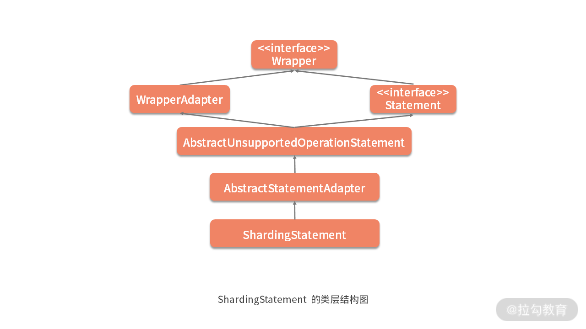

# 23 执行引擎：如何把握 ShardingSphere 中的 Executor 执行模型？（下）

在上一课时，我们已经对 ShardingSphere 执行引擎中关于底层的 SQLExecuteTemplate，以及上层的 StatementExecutor 和 PreparedStatementExecutor 对象进行了全面介绍。

今天，我们在此基础上更上一层，重点关注 ShardingStatement 和 ShardingPreparedStatement 对象，这两个对象分别是 StatementExecutor 和 PreparedStatementExecutor 的使用者。

### ShardingStatement

我们先来看 ShardingStatement 类，该类中的变量在前面的内容中都已经有过介绍：

```
private final ShardingConnection connection;

private final StatementExecutor statementExecutor;

private boolean returnGeneratedKeys;

private SQLRouteResult sqlRouteResult;

private ResultSet currentResultSet;

```

ShardingStatement 类的构造函数同样不是很复杂，我们发现 StatementExecutor 就是在这个构造函数中完成了其创建过程：

```
public ShardingStatement(final ShardingConnection connection, final int resultSetType, final int resultSetConcurrency, final int resultSetHoldability) {

    super(Statement.class);

    this.connection = connection;

    //创建 StatementExecutor

    statementExecutor = new StatementExecutor(resultSetType, resultSetConcurrency, resultSetHoldability, connection);

}

```

在继续介绍 ShardingStatement 之前，我们先梳理一下与它相关的类层结构。我们在 \*\*“06 | 规范兼容：JDBC 规范与 ShardingSphere 是什么关系？”\*\*中的 ShardingConnection 提到，ShardingSphere 通过适配器模式包装了自己的实现类，除了已经介绍的 ShardingConnection 类之外，还包含今天要介绍的 ShardingStatement 和 ShardingPreparedStament。

根据这一点，我们可以想象 ShardingStatement 应该具备与 ShardingConnection 类似的类层结构：



然后我们来到上图中 AbstractStatementAdapter 类，这里的很多方法的风格都与 ShardingConnection 的父类 AbstractConnectionAdapter 一致，例如如下所示的 setPoolable 方法：

```
public final void setPoolable(final boolean poolable) throws SQLException {

    this.poolable = poolable;

    recordMethodInvocation(targetClass, "setPoolable", new Class[] {boolean.class}, new Object[] {poolable});

    forceExecuteTemplate.execute((Collection) getRoutedStatements(), new ForceExecuteCallback<Statement>() {


        @Override

        public void execute(final Statement statement) throws SQLException {

            statement.setPoolable(poolable);

        }

    });

```

> 这里涉及的 recordMethodInvocation 方法、ForceExecuteTemplate，以及 ForceExecuteCallback 我们都已经在“03 | 规范兼容：JDBC 规范与 ShardingSphere 是什么关系？”中进行了介绍，这里不再展开。

同样，AbstractStatementAdapter 的父类 AbstractUnsupportedOperationStatement 的作用也与 AbstractUnsupportedOperationConnection 的作用完全一致。

了解了 ShardingStatement 的类层结构之后，我们来看它的核心方法，首当其冲的还是它的 executeQuery 方法：

```
@Override

public ResultSet executeQuery(final String sql) throws SQLException {

    if (Strings.isNullOrEmpty(sql)) {

        throw new SQLException(SQLExceptionConstant.SQL_STRING_NULL_OR_EMPTY);

    }

    ResultSet result;

    try {

         //清除 StatementExecutor 中的相关变量

        clearPrevious();

        //执行路由引擎，获取路由结果

        shard(sql);

        //初始化 StatementExecutor

        initStatementExecutor();

        //调用归并引擎

        MergeEngine mergeEngine = MergeEngineFactory.newInstance(connection.getRuntimeContext().getDatabaseType(), connection.getRuntimeContext().getRule(), sqlRouteResult, connection.getRuntimeContext().getMetaData().getRelationMetas(), statementExecutor.executeQuery());

        //获取归并结果

        result = getResultSet(mergeEngine);

    } finally {

        currentResultSet = null;

    }

    currentResultSet = result;

    return result;

}

```

这个方法中有几个子方法值得具体展开一下，首先是 shard 方法：

```
private void shard(final String sql) {

    //从 Connection 中获取 ShardingRuntimeContext 上下文

    ShardingRuntimeContext runtimeContext = connection.getRuntimeContext();

    //创建 SimpleQueryShardingEngine

    SimpleQueryShardingEngine shardingEngine = new SimpleQueryShardingEngine(runtimeContext.getRule(), runtimeContext.getProps(), runtimeContext.getMetaData(), runtimeContext.getParseEngine());

    //执行分片路由并获取路由结果

    sqlRouteResult = shardingEngine.shard(sql, Collections.emptyList());

}

```

这段代码就是路由引擎的入口，我们创建了 SimpleQueryShardingEngine，并调用它的 shard 方法获取路由结果对象 SQLRouteResult。

然后我们来看 initStatementExecutor 方法，如下所示：

```
private void initStatementExecutor() throws SQLException {

    statementExecutor.init(sqlRouteResult);

    replayMethodForStatements();

}

```

这里通过路由结果对象 SQLRouteResult 对 statementExecutor 进行了初始化，然后执行了一个 replayMethodForStatements 方法：

```
private void replayMethodForStatements() {

    for (Statement each : statementExecutor.getStatements()) {

        replayMethodsInvocation(each);

    }

}

```

该方法实际上就是调用了基于反射的 replayMethodsInvocation 方法，然后这个replayMethodsInvocation 方法会针对 statementExecutor 中所有 Statement的 SQL 操作执行目标方法。

最后，我们通过执行 statementExecutor.executeQuery() 方法获取 SQL 执行的结果，并用这个结果来创建**归并引擎 MergeEngine**，并通过归并引擎 MergeEngine 获取最终的执行结果。

> **归并引擎**是 ShardingSphere 中与 SQL 解析引擎、路由引擎以及执行引擎并列的一个引擎，我们在下一课时中就会开始介绍这块内容，这里先不做具体展开。

以 ShardingStatement 中的其中一个 executeUpdate 方法为例，可以看到它的执行流程也与前面的 executeQuery 方法非常类似：

```
@Override

public int executeUpdate(final String sql) throws SQLException {

    try {

         //清除 StatementExecutor 中的相关变量

        clearPrevious();

        //执行路由引擎，获取路由结果

        shard(sql);

        //初始化 StatementExecutor

        initStatementExecutor();

        return statementExecutor.executeUpdate();

    } finally {

        currentResultSet = null;

    }

}

```

当然，对于 Update 操作而言，不需要通过归并引擎做结果的归并。

### ShardingPreparedStatement

我们接着来看 ShardingPreparedStatement 类，这个类的变量也基本都是前面介绍过的对象：

```
private final ShardingConnection connection;

private final String sql;

private final PreparedQueryShardingEngine shardingEngine;

private final PreparedStatementExecutor preparedStatementExecutor;

private final BatchPreparedStatementExecutor batchPreparedStatementExecutor;

private SQLRouteResult sqlRouteResult;

private ResultSet currentResultSet;

```

这里的 ShardingEngine、PreparedStatementExecutor 和 BatchPreparedStatementExecutor 对象的创建过程都发生在 ShardingPreparedStatement 的构造函数中。

然后我们来看它的代表性方法 ExecuteQuery，如下所示：

```
@Override

public ResultSet executeQuery() throws SQLException {

    ResultSet result;

    try {

        clearPrevious();

        shard();

        initPreparedStatementExecutor();

        MergeEngine mergeEngine = MergeEngineFactory.newInstance(connection.getRuntimeContext().getDatabaseType(), connection.getRuntimeContext().getRule(), sqlRouteResult, connection.getRuntimeContext().getMetaData().getRelationMetas(), preparedStatementExecutor.executeQuery());

        result = getResultSet(mergeEngine);

    } finally {

        clearBatch();

    }

    currentResultSet = result;

    return result;

}

```

这里我们没加注释，但也应该理解这一方法的执行流程，因为该方法的风格与 ShardingStatement 中的同名方法非常一致。

关于 ShardingPreparedStatement 就没有太多可以介绍的内容了，我们接着来看它的父类**AbstractShardingPreparedStatementAdapter 类**，看到该类持有一个 SetParameterMethodInvocation 的列表，以及一个参数列表：

```
private final List<SetParameterMethodInvocation> setParameterMethodInvocations = new LinkedList<>();

private final List<Object> parameters = new ArrayList<>();

```

这里的 SetParameterMethodInvocation 类直接集成了介绍 ShardingConnection 时提到的 JdbcMethodInvocation 类：

```
public final class SetParameterMethodInvocation extends JdbcMethodInvocation {


    @Getter

    private final int index;


    @Getter

    private final Object value;


    public SetParameterMethodInvocation(final Method method, final Object[] arguments, final Object value) {

        super(method, arguments);

        this.index = (int) arguments[0];

        this.value = value;

    }


    public void changeValueArgument(final Object value) {

        getArguments()[1] = value;

    }

}

```

对于 ShardingPreparedStatement 而言，这个类的作用是在 JdbcMethodInvocation 中所保存的方法和参数的基础上，添加了 SQL 执行过程中所需要的参数信息。

所以它的 replaySetParameter 方法就变成了如下的风格：

```
protected final void replaySetParameter(final PreparedStatement preparedStatement, final List<Object> parameters) {

    setParameterMethodInvocations.clear();

   //添加参数信息

    addParameters(parameters);

    for (SetParameterMethodInvocation each : setParameterMethodInvocations) {

        each.invoke(preparedStatement);

    }

}

```

关于 AbstractShardingPreparedStatementAdapter 还需要注意的是它的**类层结构**，如下图所示，可以看到 AbstractShardingPreparedStatementAdapter 继承了 AbstractUnsupportedOperationPreparedStatement 类；而 AbstractUnsupportedOperationPreparedStatement 却又继承了 AbstractStatementAdapter 类并实现了 PreparedStatement：


形成这种类层结构的原因在于，PreparedStatement 本来就是在 Statement 的基础上添加了各种参数设置功能，换句话说，Statement 的功能 PreparedStatement 都应该有。

所以一方面 AbstractStatementAdapter 提供了所有 Statement 的功能；另一方面，AbstractShardingPreparedStatementAdapter 首先把 AbstractStatementAdapter 所有的功能继承过来，但它自身可能有一些无法实现的关于 PreparedStatement 的功能，所以同样提供了 AbstractUnsupportedOperationPreparedStatement 类，并被最终的 AbstractShardingPreparedStatementAdapter 适配器类所继承。

这样就形成了如上图所示的复杂类层结构。

### ShardingConnection

介绍完 ShardingStatement 和 ShardingPreparedStatement 之后，我们来关注使用它们的具体应用场景，这也是 ShardingSphere 执行引擎的最后一部分内容。

通过查看调用关系，我们发现创建这两个类的入口都在 ShardingConnection 类中，该类包含了用于创建 ShardingStatement 的 createStatement 方法和用于创建 ShardingPreparedStatement 的 prepareStatement 方法，以及它们的各种重载方法：

```
@Override

public Statement createStatement(final int resultSetType, final int resultSetConcurrency, final int resultSetHoldability) {

    return new ShardingStatement(this, resultSetType, resultSetConcurrency, resultSetHoldability);

 }

  

@Override

public PreparedStatement prepareStatement(final String sql, final int resultSetType, final int resultSetConcurrency, final int resultSetHoldability) throws SQLException {

    return new ShardingPreparedStatement(this, sql, resultSetType, resultSetConcurrency, resultSetHoldability);

}

```

同时，ShardingConnection 中包含了用于管理分布式事务的 ShardingTransactionManager。关于分布式事务的讨论不是今天的重点，我们后面会有专题来做详细展开。

但我们可以先看一下 commit 和 rollback 方法：

```
@Override

public void commit() throws SQLException {

    if (TransactionType.LOCAL == transactionType) {

        super.commit();

    } else {

        shardingTransactionManager.commit();

    }

}


@Override

public void rollback() throws SQLException {

    if (TransactionType.LOCAL == transactionType) {

        super.rollback();

    } else {

        shardingTransactionManager.rollback();

    }

}

```

可以看到这两个方法的逻辑还是比较清晰的，即当事务类型为本地事务时直接调用 ShardingConnection 父类 AbstractConnectionAdapter 中的 commit 和 rollback 方法，这两个方法会调用真正的 connection 的相关方法。

以 commit 方法为例，我们可以看到 AbstractConnectionAdapter 中基于这一设计思想的实现过程：

```
@Override

public void commit() throws SQLException {

    forceExecuteTemplate.execute(cachedConnections.values(), new ForceExecuteCallback<Connection>() {


        @Override

        public void execute(final Connection connection) throws SQLException {

            connection.commit();

        }

    });

}

```

### ShardingDataSource

我们知道在 JDBC 规范中，可以通过 DataSource 获取 Connection 对象。ShardingSphere 完全兼容 JDBC 规范，所以 ShardingConnection 的创建过程应该也是在对应的 DataSource 中，这个 DataSource 就是**ShardingDataSource**。

ShardingDataSource 类比较简单，其构造函数如下所示：

```
public ShardingDataSource(final Map<String, DataSource> dataSourceMap, final ShardingRule shardingRule, final Properties props) throws SQLException {

    super(dataSourceMap);

    checkDataSourceType(dataSourceMap);

    runtimeContext = new ShardingRuntimeContext(dataSourceMap, shardingRule, props, getDatabaseType());

}

```

可以看到，ShardingRuntimeContext 这个上下文对象是在 ShardingDataSource 的构造函数中被创建的，而创建 ShardingConnection 的过程也很直接：

```
@Override

public final ShardingConnection getConnection() {

    return new ShardingConnection(getDataSourceMap(), runtimeContext, TransactionTypeHolder.get());

}

```

在 ShardingDataSource 的实现上，也同样采用的是装饰器模式，所以它的类层结构也与 ShardingConnection 的类似。在 ShardingDataSource 的父类 AbstractDataSourceAdapter 中，主要的工作是完成 DatabaseType 的创建，核心方法 createDatabaseType 如下所示：

```
private DatabaseType createDatabaseType(final DataSource dataSource) throws SQLException {

    if (dataSource instanceof AbstractDataSourceAdapter) {

        return ((AbstractDataSourceAdapter) dataSource).databaseType;

    }

    try (Connection connection = dataSource.getConnection()) {

        return DatabaseTypes.getDatabaseTypeByURL(connection.getMetaData().getURL());

    }

}

```

可以看到这里使用到了 DatabaseTypes 类，该类负责 DatabaseType 实例的动态管理。而在 ShardingSphere 中，DatabaseType 接口代表数据库类型：

```
public interface DatabaseType {

    //获取数据库名称

 String getName();

 //获取 JDBC URL 的前缀

 Collection<String> getJdbcUrlPrefixAlias();

 //获取数据源元数据

    DataSourceMetaData getDataSourceMetaData(String url, String username);

}

```

可以想象 ShardingSphere 中针对各种数据库提供了 DatabaseType 接口的实现类，其中以 MySQLDatabaseType 为例：

```
public final class MySQLDatabaseType implements DatabaseType {


    @Override

    public String getName() {

        return "MySQL";

    }


    @Override

    public Collection<String> getJdbcUrlPrefixAlias() {

        return Collections.singletonList("jdbc:mysqlx:");

    }


    @Override

    public MySQLDataSourceMetaData getDataSourceMetaData(final String url, final String username) {

        return new MySQLDataSourceMetaData(url);

    }

}

```

上述代码中的 MySQLDataSourceMetaData 实现了 DataSourceMetaData 接口，并提供如下所示的对输入 url 的解析过程：

```
public MySQLDataSourceMetaData(final String url) {

    Matcher matcher = pattern.matcher(url);

    if (!matcher.find()) {

        throw new UnrecognizedDatabaseURLException(url, pattern.pattern());

    }

    hostName = matcher.group(4);

    port = Strings.isNullOrEmpty(matcher.group(5)) ? DEFAULT_PORT : Integer.valueOf(matcher.group(5));

    catalog = matcher.group(6);

    schema = null;

}

```

显然，DatabaseType 用于保存与特定数据库元数据相关的信息，ShardingSphere 还基于 SPI 机制实现对各种 DatabaseType 实例的动态管理。

最后，我们来到 ShardingDataSourceFactory 工厂类，该类负责 ShardingDataSource 的创建：

```
public final class ShardingDataSourceFactory {


    public static DataSource createDataSource(

            final Map<String, DataSource> dataSourceMap, final ShardingRuleConfiguration shardingRuleConfig, final Properties props) throws SQLException {

        return new ShardingDataSource(dataSourceMap, new ShardingRule(shardingRuleConfig, dataSourceMap.keySet()), props);

    }

}

```

我们在这里创建了 ShardingDataSource，同时发现 ShardingRule 的创建过程实际上也是在这里，通过传入的 ShardingRuleConfiguration 来构建一个新的 ShardingRule 对象。

一旦创建了 DataSource，我们就可以使用与 JDBC 规范完全兼容的 API，通过该 DataSource 完成各种 SQL 的执行。我们可以回顾 ShardingDataSourceFactory 的使用过程来加深对他的理解：

```
public DataSource dataSource() throws SQLException {

     //创建分片规则配置类

    ShardingRuleConfiguration shardingRuleConfig = new ShardingRuleConfiguration();


    //创建分表规则配置类

    TableRuleConfiguration tableRuleConfig = new TableRuleConfiguration("user", "ds{0..1}.user{0..1}");


    //创建分布式主键生成配置类

    Properties properties = new Properties();

    result.setProperty("worker.id", "33");

    KeyGeneratorConfiguration keyGeneratorConfig = new KeyGeneratorConfiguration("SNOWFLAKE", "id", properties);

    result.setKeyGeneratorConfig(keyGeneratorConfig);

    shardingRuleConfig.getTableRuleConfigs().add(tableRuleConfig);


    //根据年龄分库，一共分为 2 个库

   shardingRuleConfig.setDefaultDatabaseShardingStrategyConfig(new InlineShardingStrategyConfiguration("sex", "ds{sex % 2}"));


    //根据用户 id 分表，一共分为 2 张表

    shardingRuleConfig.setDefaultTableShardingStrategyConfig(new StandardShardingStrategyConfiguration("id", "user{id % 2}"));


    //通过工厂类创建具体的 DataSource

    return ShardingDataSourceFactory.createDataSource(createDataSourceMap(), shardingRuleConfig, new Properties());

}

```

一旦获取了目标 DataSource 之后，我们就可以使用 JDBC 中的核心接口来执行传入的 SQL 语句：

```
List<User> getUsers(final String sql) throws SQLException {

    List<User> result = new LinkedList<>();

    try (Connection connection = dataSource.getConnection();

         PreparedStatement preparedStatement = connection.prepareStatement(sql);

         ResultSet resultSet = preparedStatement.executeQuery()) {

        while (resultSet.next()) {

            User user= new User();

            //省略设置 User 对象的赋值语句

            result.add(user);

        }

    }

    return result;

}

```

ShardingSphere 通过在准备阶段获取的连接模式，在执行阶段生成**内存归并结果集 **或** 流式归并结果集 **，并将其传递至** 结果归并引擎**，以进行下一步工作。

### 从源码解析到日常开发

基于**适配器模式**完成对 JDBC 规范的重写，是我们学习 ShardingSphere 框架非常重要的一个切入点，同样也是我们将这种模式应用到日常开发工作中的一个切入点。

适配器模式是作为两个不兼容的接口之间的桥梁。在业务系统中，我们经常会碰到需要与外部系统进行对接和集成的场景，这个时候为了保证内部系统的功能演进，能够独立于外部系统进行发展，一般都需要采用适配器模式完成两者之间的隔离。

当我们设计这种系统时，可以参考 JDBC 规范中的接口定义方式，以及 ShardingSphere 中基于这种接口定义方式，而完成适配的具体做法。

### 小结与预告

这是 ShardingSphere 执行引擎的最后一个课时，我们围绕执行引擎的上层组件，给出了以“ Sharding”作为前缀的各种 JDBC 规范中的核心接口实现类。

其中 ShardingStatement 和 ShardingPreparedStatement 直接依赖于上一课时介绍的 StatementExecutor 和 PreparedStatementExecutor；而 ShardingConnection 和 ShardingDataSource 则为我们使用执行引擎提供了入口。

这里给你留一道思考题：ShardingSphere 中，AbstractShardingPreparedStatementAdapter 的类层结构为什么会比 AbstractStatementAdapter 复杂很多？欢迎你在留言区与大家讨论，我将逐一点评解答。

现在，我们已经通过执行引擎获取了来自不同数据源的结果数据，对于查询语句而言，我们通常都需要对这些结果数据进行归并才能返回给客户端。在接下来的内容中，就让我们来分析一下 ShardingSphere 的归并引擎。
