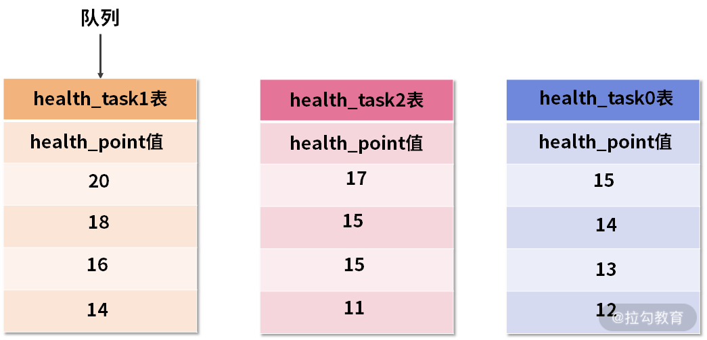
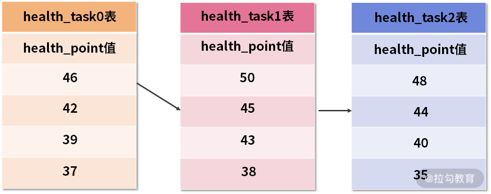

24 归并引擎：如何理解数据归并的类型以及简单归并策略的实现过程？
=================================

在上一课时，我们提到在 ShardingStatement 和 ShardingPreparedStatement 中，执行 executeQuery 或 executeUpdate 方法时会使用到归并引擎 MergeEngine：

```
//调用归并引擎

MergeEngine mergeEngine = MergeEngineFactory.newInstance(connection.getRuntimeContext().getDatabaseType(), connection.getRuntimeContext().getRule(), sqlRouteResult, connection.getRuntimeContext().getMetaData().getRelationMetas(), statementExecutor.executeQuery());

//获取归并结果

result = getResultSet(mergeEngine);

```

在 ShardingSphere 整个分片机制的结构中，归并引擎是执行引擎后的下一环，也是整个数据分片引擎的最后一环。

在今天以及下一课时中，我将带领大家对 ShardingSphere 中的归并引擎做详细的展开，让我们先从归并这一基本概念说起。

### 归并与归并引擎

我们知道，在分库分表环境下，一句逻辑 SQL 会最终解析成多条真正的 SQL，并被路由到不同的数据库中进行执行，每个数据库都可能返回最终结果中的一部分数据。

这样我们就会碰到一个问题，即如何把这些来自不同数据库的部分数据组合成最终结果呢？这就需要引入归并的概念。

#### 1.归并的分类及其实现方案

所谓 **归并** ，就是将从各个数据节点获取的多数据结果集，通过一定的策略组合成为一个结果集并正确的返回给请求客户端的过程。

**按照不同的 SQL 类型以及应用场景划分**，归并的类型可以分为遍历、排序、分组、分页和聚合 5 种类型，这 5 种类型是组合而非互斥的关系。

其中遍历归并是最简单的归并，而排序归并是最常用地归并，在下文我会对两者分别详细介绍。


归并的五大类型**按照归并实现的结构划分**，ShardingSphere 中又存在流式归并、内存归并和装饰者归并这三种归并方案。

* 所谓的 **流式归并** ，类似于 JDBC 中从 ResultSet 获取结果的处理方式，也就是说通过逐条获取的方式返回正确的单条数据；
* **内存归并**的思路则不同，是将结果集的所有数据先存储在内存中，通过统一的计算之后，再将其封装成为逐条访问的数据结果集进行返回。
* 最后的 **装饰者归并** 是指，通过装饰器模式对所有的结果集进行归并，并进行统一的功能增强，类似于改写引擎中 SQLRewriteContextDecorator 对 SQLRewriteContext 进行装饰的过程。

显然，流式归并和内存归并是互斥的，装饰者归并可以在流式归并和内存归并之上做进一步的处理。

**归并方案**与归并类型之间同样存在一定的关联关系，其中遍历、排序以及流式分组都属于流式归并的一种，内存归并可以作用于统一的分组、排序以及聚合，而装饰者归并有分页归并和聚合归并这 2 种类型，它们之间的对应关系如下图所示：


归并类型与归并方案之间的对应关系图

#### 2.归并引擎

讲完概念回到代码，我们首先来到 shardingsphere-merge 代码工程中的 MergeEngine 接口：

```
public interface MergeEngine {

    //执行归并

    MergedResult merge() throws SQLException;

}

```

可以看到 MergeEngine 接口非常简单，只有一个 merge 方法。在 ShardingSphere 中，该接口存在五个实现类，其类层结构如下所示：


MergeEngine 类层结构图

从命名上看，可以看到名称中带有“Encrypt”的两个 MergeEngine 与数据脱敏相关，放在后续专题中再做讲解，其余的三个我们会先做一些分析。

在此之前，我们还要来关注一下代表归并结果的 MergedResult 接口：

```
public interface MergedResult {

    boolean next() throws SQLException;

    Object getValue(int columnIndex, Class<?> type) throws SQLException;

    Object getCalendarValue(int columnIndex, Class<?> type, Calendar calendar) throws SQLException;

    InputStream getInputStream(int columnIndex, String type) throws SQLException;

    boolean wasNull() throws SQLException;

}

```

可以看到 MergedResult 与执行引擎中的 QueryResult 非常相似，只是少了几个方法。理解了归并引擎的定义以及归并结果的表现形式之后，我们来分析创建 MergeEngine 的过程，前面已经看到这实际上是依赖于工厂类 MergeEngineFactory，其实现过程如下所示：

```
public static MergeEngine newInstance(final DatabaseType databaseType, final ShardingRule shardingRule,

                                          final SQLRouteResult routeResult, final RelationMetas relationMetas, final List<QueryResult> queryResults) {


     //如果是查询语句，就创建一个 DQLMergeEngine

     if (routeResult.getSqlStatementContext() instanceof SelectSQLStatementContext) {

            return new DQLMergeEngine(databaseType, (SelectSQLStatementContext) routeResult.getSqlStatementContext(), queryResults);

        } 

     //如果是数据库管理语句，就创建一个 DALMergeEngine

        if (routeResult.getSqlStatementContext().getSqlStatement() instanceof DALStatement) {

            return new DALMergeEngine(shardingRule, queryResults, routeResult.getSqlStatementContext(), relationMetas);

        }

        return new TransparentMergeEngine(queryResults);

}

```

这个 newInstance 方法的参数值得关注一下，这些参数我们都很眼熟，包括数据库类型 DatabaseType、分片规则 ShardingRule、路由结果 SQLRouteResult、执行结果列表 List 等。

然后，我们看到代码逻辑会根据 SQLRouteResult 中 SqlStatementContext 的不同类型返回不同类型的 MergeEngine，即如果是 SelectSQLStatementContext 则返回用于查询的 DQLMergeEngine；而如果 SQLStatement 是一种执行数据库管理语句的 DALStatement，则返回 DALMergeEngine；如果都不是，则直接返回 TransparentMergeEngine。

对于归并而言，显然 DQLMergeEngine 是最重要的一种引擎类型，我们重点对它进行展开，

它的 merge 方法如下所示：

```
public MergedResult merge() throws SQLException {

         //如果结果集数量为 1

        if (1 == queryResults.size()) {

            return new IteratorStreamMergedResult(queryResults);

        }

        Map<String, Integer> columnLabelIndexMap = getColumnLabelIndexMap(queryResults.get(0));

        selectSQLStatementContext.setIndexes(columnLabelIndexMap);

        //如果结果集数量大于 1，则构建不同的归并方案

        return decorate(build(columnLabelIndexMap));

}

```

这里先出现了一个判断，即当查询结果集数量为 1 时，我们只需调用遍历结果集进行归并即可，这种类型就属于遍历归并。遍历归并是我们将要介绍的第一种归并类型，也是所有归并类型中最为简单的一种。

如果结果集不是只有一个，那就意味了需要进行合并，我们会通过如下所示的 build 方法根据不同的条件构建不同的 MergedResult 并返回：

```
private MergedResult build(final Map<String, Integer> columnLabelIndexMap) throws SQLException {

         //查询语句中分组语句或者聚合函数不为空，则执行分组归并

         if (isNeedProcessGroupBy()) {

            return getGroupByMergedResult(columnLabelIndexMap);

        } 

         //如果聚合中存在 Distinct 列，设置分组 Context 并执行分组归并

        if (isNeedProcessDistinctRow()) {

            setGroupByForDistinctRow();

            return getGroupByMergedResult(columnLabelIndexMap);

        } 

        //排序语句不为空，则执行排序结果集归并

        if (isNeedProcessOrderBy()) {

            return new OrderByStreamMergedResult(queryResults, selectSQLStatementContext.getOrderByContext().getItems());

        } 

        //如果都不满足归并提交，则执行遍历结果集归并

        return new IteratorStreamMergedResult(queryResults);

}

```

可以看到，这里涉及了分组归并和排序归并这两大类归并策略。然后，我们还看到有一个构建在上述 build 方法之上的 decorate 方法。这个 decorate 方法体现的就是一种装饰者归并，用于针对不同的数据库方言完成分页归并操作，我们会在下一课时中对这个方法做详细展开。

这样，我们把 ShardingSphere 中的各种归并类型通过归并引擎 MergeEngine 串联了起来，接下来的时间就来讨论各种归并类型的具体实现机制。

让我们先来看遍历归并。

### 最简单的归并：遍历归并**遍历归并**是最为简单的归并方式，我们只需将多个数据结果集合并为一个单向链表就可以了。遍历数据的操作，就相当于是在遍历一个单向列表。而在实现上，这个遍历结果集的表现形式就是一个 IteratorStreamMergedResult 类，该类又继承自 StreamMergedResult，代表的是一种流式合并结果

IteratorStreamMergedResult 的 next 方法如下所示：

```
@Override

public boolean next() throws SQLException {

        if (getCurrentQueryResult().next()) {

            return true;

        }

        if (!queryResults.hasNext()) {

            return false;

        }

        //流式获取结果并设置为当前的 QueryResult

        setCurrentQueryResult(queryResults.next());

        boolean hasNext = getCurrentQueryResult().next();

        if (hasNext) {

            return true;

        }

        while (!hasNext && queryResults.hasNext()) {

            setCurrentQueryResult(queryResults.next());

            hasNext = getCurrentQueryResult().next();

        }

        return hasNext;

}

```

它的 getValue 方法在父类 StreamMergedResult，如下所示：

```
@Override

public Object getValue(final int columnIndex, final Class<?> type) throws SQLException {

        Object result = getCurrentQueryResult().getValue(columnIndex, type);

        wasNull = getCurrentQueryResult().wasNull();

        return result;

}

```

这里同样也是通过 getCurrentQueryResult 方法流式获取当前的数据项，进而获取具体的值。

### 最常用的归并：排序归并

我们将要介绍的第二个归并类型是排序归并，它的返回结果是一个 OrderByStreamMergedResult，该类同样继承了用于流式归并的 StreamMergedResult 类。

在介绍 OrderByStreamMergedResult 前，我们可以先想象一下排序归并的场景。

当在多个数据库中执行某一条 SQL 语句时，我们可以做到在每个库的内部完成排序功能。也就是说，我们的执行结果中保存着内部排好序的多个 QueryResult，然后要做的就是把它们放在一个地方然后进行全局的排序。因为每个 QueryResult 内容已经是有序的，因此只需要将 QueryResult 中当前游标指向的数据值进行排序即可，相当于对多个有序的数组进行排序。

这个过程有点抽象，我们通过如下的示意图进行进一步说明。假设，在我们的健康任务 health\_task 表中，存在一个健康点数字段 health\_point，用于表示完成这个健康任务能够获取的健康分数。

然后，我们需要根据这个 health\_point 进行排序归并，初始的数据效果如下图所示：


三张 health\_task 表中的初始数据

上图中展示了 3 张表返回的数据结果集，每个数据结果集都已经根据 health\_point 字段进行了排序，但是 3 个数据结果集之间是无序的。排序归并的做法就是将 3 个数据结果集的当前游标指向的数据值进行排序，并放入到一个排序好的队列中。

在上图中可以看到 health\_task0 的第一个 health\_point 最小，health\_task1 的第一个 health\_point 最大，health\_task2 的第一个 health\_point 次之，因此队列中应该按照 health\_task1，health\_task2 和 health\_task0 的方式排序队列，效果如下：

 队列中已排序的三张 health\_task 表

在 OrderByStreamMergedResult 中，我们可以看到如下所示的队列定义，用到了 JDK 中的 Queue 接口：

```
private final Queue<OrderByValue> orderByValuesQueue;

```

而在 OrderByStreamMergedResult 的构造函数中，我们进一步看到 orderByValuesQueue 实际上是一个 PriorityQueue：

```
public OrderByStreamMergedResult(final List<QueryResult> queryResults, final Collection<OrderByItem> orderByItems) throws SQLException {

        this.orderByItems = orderByItems;

        //构建 PriorityQueue

        this.orderByValuesQueue = new PriorityQueue<>(queryResults.size());

        //初始化 PriorityQueue

        orderResultSetsToQueue(queryResults);

        isFirstNext = true;

}

```

讲到这里，有必要对 JDK 中的 PriorityQueue 做一下简单介绍。对于 PriorityQueue 而言，它的特性是可以对其中所包含的元素进行自动排序，既可以存放基本数据类型的包装类，也可以支持自定义类。对于基本数据类型的包装器类，优先级队列中元素默认排列顺序是升序排列，而对于自己定义的类来说，需要定义定制化的比较器。

PriorityQueue 的常用方法如下所示：

* peek()：返回队首元素
* poll()：返回队首元素，并且将队首元素弹出队列
* offer()：添加元素
* size()：返回队列元素个数
* isEmpty()：判断队列是否为空

了解了 PriorityQueue 的功能特性之后，我们来看一下如何基于一个 QueryResult 列表对队列进行初始化，orderResultSetsToQueue 方法如下所示：

```
private void orderResultSetsToQueue(final List<QueryResult> queryResults) throws SQLException {

        for (QueryResult each : queryResults) {

             //构建 OrderByValue

            OrderByValue orderByValue = new OrderByValue(each, orderByItems);

            if (orderByValue.next()) {

                //添加 OrderByValue 到队列中

                orderByValuesQueue.offer(orderByValue);

            }

        }

        setCurrentQueryResult(orderByValuesQueue.isEmpty() ? queryResults.get(0) : orderByValuesQueue.peek().getQueryResult());

}

```

这里基于 QueryResult 构建了 OrderByValue 对象，并通过该对象的 next 方法判断是否需要将其添加到 PriorityQueue 中。

我们看到这里调用了 PriorityQueue 的 offer 方法将特定元素插入到优先级队列中。

当将所有的 OrderByValue 添加到 PriorityQueue 之后，OrderByStreamMergedResult 通过父类 StreamMergedResult 的 setCurrentQueryResult 方法将 PriorityQueue 中的第一个元素作为当前的查询结果，这时候 PriorityQueue 指向的就是全局排序好的第一个元素，也就是上图中的 50。

显然，对于 PriorityQueue 而言，这里新创建的 OrderByValue 就是自定义类，所以需要实现自定义的比较器。我们在 OrderByValue 类中看到它实现了 Java 的 Comparable 接口，compareTo 方法实现如下，针对每个排序项 OrderByItem 进行值的比对：

```
@Override

public int compareTo(final OrderByValue o) {

        int i = 0;

        for (OrderByItem each : orderByItems) {

            int result = CompareUtil.compareTo(orderValues.get(i), o.orderValues.get(i), each.getSegment().getOrderDirection(),

                each.getSegment().getNullOrderDirection(), orderValuesCaseSensitive.get(i));

            if (0 != result) {

                return result;

            }

            i++;

        }

        return 0;

}

```

根据前面示意图中的结果，当使用 PriorityQueue 每次获取下一条数据时，我们只需将队列顶端结果集的游标下移，并根据新游标重新进入优先级队列并找到自己的位置即可。

这个步骤体现在如下所示的 next 方法中：

```
@Override

public boolean next() throws SQLException {

        if (orderByValuesQueue.isEmpty()) {

            return false;

        }

        if (isFirstNext) {

            isFirstNext = false;

            return true;

        }


        //获取 PriorityQueue 中的第一个元素，并弹出该元素

        OrderByValue firstOrderByValue = orderByValuesQueue.poll();


        //将游标指向 firstOrderByValue 的下一个元素，并重新插入到 PriorityQueue 中，这会促使 PriorityQueue 进行自动的重排序

        if (firstOrderByValue.next()) {

            orderByValuesQueue.offer(firstOrderByValue);

        }

        if (orderByValuesQueue.isEmpty()) {

            return false;

        }


        //将当前结果集指向 PriorityQueue 的第一个元素

      setCurrentQueryResult(orderByValuesQueue.peek().getQueryResult());

        return true;

}

```

这个过程同样需要用一系列图来进行解释。当进行第一次 next 调用时，排在队列首位的 health\_task1 将会被弹出队列，并且将当前游标指向的数据值 50 返回。同时，我们还会将游标下移一位之后，重新把 health\_task1 放入优先级队列。而优先级队列也会根据 health\_task1 的当前数据结果集指向游标的数据值 45 进行排序，根据当前数值，health\_task1 将会被排列在队列的第三位。如下所示：


第一次 next 之后的优先级队列中的三张 health\_task 表

之前队列中排名第二的 health\_task2 的数据结果集则自动排在了队列首位。而在进行第二次 next 时，只需要将目前排列在队列首位的 health\_task2 弹出队列，并且将其数据结果集游标指向的值返回。当然，对于 health\_task2 而言，我们同样下移游标，并继续将它加入优先级队列中，以此类推。



第二次 next 之后的优先级队列中的三张 health\_task 表

可以看到，基于上述的设计和实现方法，对于每个数据结果集内部数据有序、而多数据结果集整体无序的情况下，我们无需将所有的数据都加载至内存即可进行排序。

因此，ShardingSphere 在这里使用的是流式归并的方式，充分提高了归并效率。

### 从源码解析到日常开发

队列是我们常用的一种数据结构，而对于需要进行数据比对和排序的场景下，今天介绍的优先级队列非常有用。基于自身所具备的排序特性，处理类似 ShardingSphere 中全局性的排序场景，优先级队列的实现方案优雅而高效，可以根据需要应用到在日常开发过程中。

### 小结与预告

今天的内容关注于 ShardingSphere 中的归并引擎，归并是分库分表环境下处理 SQL 执行结果的最终环节。我们抽象了 ShardingSphere 的几种常见的归并类型以及实现方案。同时，给出了其中最简单的遍历归并和最常用的排序归并的设计思想和实现细节。

这里给你留一道思考题：ShardingSphere 中，分片数据基于 JDK 中的哪种数据结构完成排序的？

在下一课时中，我们将继续介绍 ShardingSphere 归并引擎中剩余的几种归并类型，包括分组归并、聚合归并以及分页归并。
