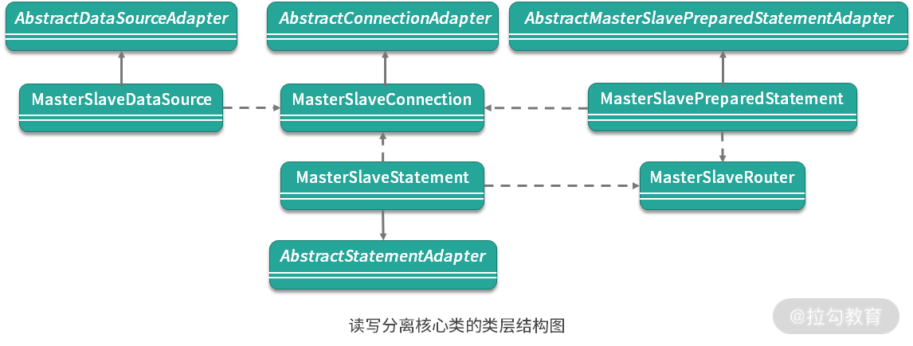

# 26 读写分离：普通主从架构和分片主从架构分别是如何实现的？

在 **“17 | 路由引擎：如何理解分片路由核心类 ShardingRouter 的运作机制？”** 课时中介绍 ShardingSphere 的路由引擎时，我们提到了 ShardingMasterSlaveRouter 类，该类用于进行对分片信息进行读写分离。

今天我们就将关注这个话题，看看 ShardingSphere 是如何实现主从架构下的读写分离路由的？

### ShardingMasterSlaveRouter

我们来到 ShardingMasterSlaveRouter 类。从效果上讲，读写分离实际上也是一种路由策略，所以该类同样位于 sharding-core-route 工程下。

ShardingMasterSlaveRouter 的入口函数 route 如下所示：

```
public SQLRouteResult route(final SQLRouteResult sqlRouteResult) {
    for (MasterSlaveRule each : masterSlaveRules) {
     //根据每条 MasterSlaveRule 执行路由方法
        route(each, sqlRouteResult);
    }
    return sqlRouteResult;
}
```

这里引入了一个规则类 MasterSlaveRule，根据每条 MasterSlaveRule 会执行独立的 route 方法，并最终返回组合的 SQLRouteResult。

这个 route 方法如下所示：

```
private void route(final MasterSlaveRule masterSlaveRule, final SQLRouteResult sqlRouteResult) {
        Collection<RoutingUnit> toBeRemoved = new LinkedList<>();
        Collection<RoutingUnit> toBeAdded = new LinkedList<>();
        for (RoutingUnit each : sqlRouteResult.getRoutingResult().getRoutingUnits()) {
            if (!masterSlaveRule.getName().equalsIgnoreCase(each.getDataSourceName())) {
                continue;
            }
            toBeRemoved.add(each);
            String actualDataSourceName;
            // 判断是否走主库
            if (isMasterRoute(sqlRouteResult.getSqlStatementContext().getSqlStatement())) {
                MasterVisitedManager.setMasterVisited();
                actualDataSourceName = masterSlaveRule.getMasterDataSourceName();
            } else { //如果从库有多个，默认采用轮询策略，也可以选择随机访问策略
                actualDataSourceName = masterSlaveRule.getLoadBalanceAlgorithm().getDataSource(
                        masterSlaveRule.getName(), masterSlaveRule.getMasterDataSourceName(), new ArrayList<>(masterSlaveRule.getSlaveDataSourceNames()));
            }
            toBeAdded.add(createNewRoutingUnit(actualDataSourceName, each));
        }
        sqlRouteResult.getRoutingResult().getRoutingUnits().removeAll(toBeRemoved);
        sqlRouteResult.getRoutingResult().getRoutingUnits().addAll(toBeAdded);
}
```

在读写分离场景下，因为涉及路由信息的调整，所以这段代码中构建了两个临时变量 toBeRemoved 和 toBeAdded，它们分别用于保存需要移除和需要新增的 RoutingUnit。

然后，我们来计算真正需要访问的数据库名 actualDataSourceName，这里就需要判断是否走主库。请注意，在当前的 4.X 版本中，ShardingSphere 只支持单主库的应用场景，而从库可以有很多个。

判断是否为主库的 isMasterRoute 方法如下所示：

```
private boolean isMasterRoute(final SQLStatement sqlStatement) {
    return containsLockSegment(sqlStatement) || !(sqlStatement instanceof SelectStatement) || MasterVisitedManager.isMasterVisited() || HintManager.isMasterRouteOnly();
}
```

可以看到这里有四个条件，满足任何一个都将确定走主库路由。前面两个比较好理解，后面的 MasterVisitedManager 实际上是一个线程安全的容器，包含了该线程访问是否涉及主库的信息。

而基于我们在 **“08 | 读写分离：如何集成分库分表+数据库主从架构？”** 课时中对 Hint 概念和强制路由机制的理解，HintManager 是 ShardingSphere 中对数据库 Hint 访问机制的实现类，可以设置强制走主库或者非查询操作走主库。

如果不走主库路由，那么流程就会走到从库路由；而如果从库有多个，就需要采用一定的策略来确定具体的某一个从库。ShardingSphere 在这方面提供了一个 MasterSlaveLoadBalanceAlgorithm 接口完成从库的选择，请注意该接口位于 sharding-core-api 工程中，定义如下：

```
public interface MasterSlaveLoadBalanceAlgorithm extends TypeBasedSPI {
     // 在从库列表中选择一个从库进行路由
    String getDataSource(String name, String masterDataSourceName, List<String> slaveDataSourceNames);
}
```

可以看到 MasterSlaveLoadBalanceAlgorithm 接口继承了 TypeBasedSPI 接口，表明它是一个 SPI。然后它的参数中包含了一个 MasterDataSourceName 和一批 SlaveDataSourceName，最终返回一个 SlaveDataSourceName。

ShardingSphere 提供了两个 MasterSlaveLoadBalanceAlgorithm 的实现类，一个是支持随机算法的 RandomMasterSlaveLoadBalanceAlgorithm，另一个则是支持轮询算法的 RoundRobinMasterSlaveLoadBalanceAlgorithm。

我们在 sharding-core-common 工程中发现了对应的 ServiceLoader 类 MasterSlaveLoadBalanceAlgorithmServiceLoader，而具体 MasterSlaveLoadBalanceAlgorithm 实现类的获取是在 MasterSlaveRule 中。

请注意，在日常开发过程中，我们实际上不通过配置体系设置这个负载均衡算法，也能正常运行负载均衡策略。

MasterSlaveRule 中的 createMasterSlaveLoadBalanceAlgorithm 方法给出了答案：

```
private MasterSlaveLoadBalanceAlgorithm createMasterSlaveLoadBalanceAlgorithm(final LoadBalanceStrategyConfiguration loadBalanceStrategyConfiguration) {
    //获取 MasterSlaveLoadBalanceAlgorithmServiceLoader
    MasterSlaveLoadBalanceAlgorithmServiceLoader serviceLoader = new MasterSlaveLoadBalanceAlgorithmServiceLoader(); 
    //根据配置来动态加载负载均衡算法实现类
    return null == loadBalanceStrategyConfiguration
                ? serviceLoader.newService() : serviceLoader.newService(loadBalanceStrategyConfiguration.getType(), loadBalanceStrategyConfiguration.getProperties());
}
```

可以看到，当 loadBalanceStrategyConfiguration 配置不存在时，会直接使用 serviceLoader.newService() 方法完成 SPI 实例的创建。我们回顾 **“13 | 微内核架构：ShardingSphere 如何实现系统的扩展性？”** 中的介绍，就会知道该方法会获取系统中第一个可用的 SPI 实例。

我们同样在 sharding-core-common 工程中找到了 SPI 的配置信息，如下所示：


针对 MasterSlaveLoadBalanceAlgorithm 的 SPI 配置

按照这里的配置信息，第一个获取的 SPI 实例应该是 RoundRobinMasterSlaveLoadBalanceAlgorithm，即 **轮询策略** ，它的 getDataSource 方法实现如下：

```
@Override
public String getDataSource(final String name, final String masterDataSourceName, final List<String> slaveDataSourceNames) {
        AtomicInteger count = COUNTS.containsKey(name) ? COUNTS.get(name) : new AtomicInteger(0);
        COUNTS.putIfAbsent(name, count);
        count.compareAndSet(slaveDataSourceNames.size(), 0);
        return slaveDataSourceNames.get(Math.abs(count.getAndIncrement()) % slaveDataSourceNames.size());
}
```

当然，我们也可以通过配置选择随机访问策略，RandomMasterSlaveLoadBalanceAlgorithm 的 getDataSource 更加简单，如下所示：

```
@Override
public String getDataSource(final String name, final String masterDataSourceName, final List<String> slaveDataSourceNames) {
        return slaveDataSourceNames.get(ThreadLocalRandom.current().nextInt(slaveDataSourceNames.size()));
}
```

至此，关于 ShardingMasterSlaveRouter 的介绍就结束了，通过该类我们可以完成分片信息的主从路由，从而实现读写分离。

在 ShardingSphere 中，还存在一个不含分片信息的主从路由类 MasterSlaveRouter，其实现过程与 ShardingMasterSlaveRouter 非常类似，让我们一起来看一下。

### MasterSlaveRouter

从命名上看，ShardingMasterSlaveRouter 类的作用是完成分片条件下的主从路由。通过前面内容的介绍，我们知道该类主要用于路由引擎中，即在普通 ShardingRouter 上再添加一层读写分离路由机制。可以想象这是一种比较偏底层的读写分离机制，我们只是在路由环节对目标数据库做了调整。

接下来，我们将从另一个维度出发讨论读写分离，我们的思路是从更高的层次控制整个读写分离过程。让我们来到 sharding-jdbc-core 工程中，在这里我们曾经讨论过 ShardingDataSourceFactory 类，而这次我们的目标是 MasterSlaveDataSourceFactory，该工厂类的作用是创建一个 MasterSlaveDataSource，如下所示：

```
public final class MasterSlaveDataSourceFactory {
    public static DataSource createDataSource(final Map<String, DataSource> dataSourceMap, final MasterSlaveRuleConfiguration masterSlaveRuleConfig, final Properties props) throws SQLException {
        return new MasterSlaveDataSource(dataSourceMap, new MasterSlaveRule(masterSlaveRuleConfig), props);
    }
}
```

MasterSlaveDataSource 的定义如下所示，可以看到该类同样扩展了 AbstractDataSourceAdapter 类。关于 AbstractDataSourceAdapter 以及针对 Connection 和 Statement 的各种适配器类我们已经在 **“03 | 规范兼容：JDBC 规范与 ShardingSphere 是什么关系？”** 中进行了详细讨论，这里不再展开。

```
public class MasterSlaveDataSource extends AbstractDataSourceAdapter {
    private final MasterSlaveRuntimeContext runtimeContext;
    public MasterSlaveDataSource(final Map<String, DataSource> dataSourceMap, final MasterSlaveRule masterSlaveRule, final Properties props) throws SQLException {
        super(dataSourceMap);
        runtimeContext = new MasterSlaveRuntimeContext(dataSourceMap, masterSlaveRule, props, getDatabaseType());
    }
    @Override
    public final MasterSlaveConnection getConnection() {
        return new MasterSlaveConnection(getDataSourceMap(), runtimeContext);
    }
}
```

与其他 DataSource 一样，MasterSlaveDataSource 同样负责创建 RuntimeContext 上下文对象和 Connection 对象。先来看这里的 MasterSlaveRuntimeContext，我们发现与 ShardingRuntimeContext 相比，这个类要简单一点，只是构建了所需的 DatabaseMetaData 并进行缓存。

然后，我们再来看 MasterSlaveConnection。与其他 Connection 类一样，这里也有一组 createStatement 和 prepareStatement 方法用来获取 Statement 和 PreparedStatement，分别对应 MasterSlaveStatement 和 MasterSlavePreparedStatement。

我们来看 MasterSlaveStatement 中的实现，首先还是关注于它的查询方法 executeQuery：

```
@Override
public ResultSet executeQuery(final String sql) throws SQLException {
        if (Strings.isNullOrEmpty(sql)) {
            throw new SQLException(SQLExceptionConstant.SQL_STRING_NULL_OR_EMPTY);
        }
        //清除 StatementExecutor 中的相关变量
        clearPrevious();
        //通过 MasterSlaveRouter 获取目标 DataSource
        Collection<String> dataSourceNames = masterSlaveRouter.route(sql, false);
        Preconditions.checkState(1 == dataSourceNames.size(), "Cannot support executeQuery for DML or DDL");
        //从 Connection 中获取 Statement
        Statement statement = connection.getConnection(dataSourceNames.iterator().next()).createStatement(resultSetType, resultSetConcurrency, resultSetHoldability);
        routedStatements.add(statement);
        //执行查询并返回结果
        return statement.executeQuery(sql);
}
```

与 ShardingStatement 不同，上述方法并没有通过分片路由获取目标 dataSourceNames，而是直接通过 MasterSlaveRouter 来实现这一目标。同时，我们注意到这里也没有通过 ShardingSphere 的执行引擎和归并引擎来执行 SQL 并归并结果，而是直接调用了 statement 的 executeQuery 完成 SQL 的执行。显然，这个核心步骤是通过 MasterSlaveRouter 实现的路由机制。

MasterSlaveRouter 的 route 方法如下所示：

```
private Collection<String> route(final SQLStatement sqlStatement) {
         //如果是强制主库路由
        if (isMasterRoute(sqlStatement)) {
            MasterVisitedManager.setMasterVisited();
            return Collections.singletonList(masterSlaveRule.getMasterDataSourceName());
        }
        //通过负载均衡执行从库路由
        return Collections.singletonList(masterSlaveRule.getLoadBalanceAlgorithm().getDataSource(
                masterSlaveRule.getName(), masterSlaveRule.getMasterDataSourceName(), new ArrayList<>(masterSlaveRule.getSlaveDataSourceNames())));
}
```

上述代码似曾相识，相关的处理流程，以及背后的 LoadBalanceAlgorithm 我们在介绍 ShardingMasterSlaveRouter 类时已经做了全面展开。通过 dataSourceNames 中的任何一个目标数据库名，我们就可以构建 Connection 并创建用于执行查询的 Statement。

然后，我们来看 MasterSlaveStatement 的 executeUpdate 方法，如下所示：

```
@Override
public int executeUpdate(final String sql) throws SQLException {
         //清除 StatementExecutor 中的相关变量
        clearPrevious();
        int result = 0;
        for (String each : masterSlaveRouter.route(sql, false)) {
         //从 Connection 中获取 Statement
            Statement statement = connection.getConnection(each).createStatement(resultSetType, resultSetConcurrency, resultSetHoldability);
            routedStatements.add(statement);
            //执行更新
            result += statement.executeUpdate(sql);
        }
        return result;
}
```

这里的流程是直接通过 masterSlaveRouter 获取各个目标数据库，然后分别构建 Statement 进行执行。

同样，我们来到 MasterSlavePreparedStatement 类，先来看它的其中一个构造函数（其余的也类似），如下所示：

```
public MasterSlavePreparedStatement(final MasterSlaveConnection connection, final String sql, final int resultSetType, final int resultSetConcurrency, final int resultSetHoldability) throws SQLException {
        if (Strings.isNullOrEmpty(sql)) {
            throw new SQLException(SQLExceptionConstant.SQL_STRING_NULL_OR_EMPTY);
        }
        this.connection = connection;
        //创建 MasterSlaveRouter
        masterSlaveRouter = new MasterSlaveRouter(connection.getRuntimeContext().getRule(), connection.getRuntimeContext().getParseEngine(), 
                connection.getRuntimeContext().getProps().<Boolean>getValue(ShardingPropertiesConstant.SQL_SHOW));
        for (String each : masterSlaveRouter.route(sql, true)) {
             //对每个目标 DataSource 从 Connection 中获取 PreparedStatement
            PreparedStatement preparedStatement = connection.getConnection(each).prepareStatement(sql, resultSetType, resultSetConcurrency, resultSetHoldability);
            routedStatements.add(preparedStatement);
        }
}
```

可以看到这里构建了 MasterSlaveRouter，然后对于通过 MasterSlaveRouter 路由获取的每个数据库，分别创建一个 PreparedStatement 并保存到 routedStatements 列表中。

然后，我们来看 MasterSlavePreparedStatement 的 executeQuery 方法，如下所示：

```
@Override
public ResultSet executeQuery() throws SQLException {
        Preconditions.checkArgument(1 == routedStatements.size(), "Cannot support executeQuery for DDL");
        return routedStatements.iterator().next().executeQuery();
}
```

对于上述 executeQuery 方法而言，我们只需要获取 routedStatements 中的任何一个 PreparedStatement 进行执行即可。而对于 Update 操作，MasterSlavePreparedStatement 的执行流程也与 MasterSlaveStatement 的一致，如下所示：

```
@Override
public int executeUpdate() throws SQLException {
        int result = 0;
        for (PreparedStatement each : routedStatements) {
            result += each.executeUpdate();
        }
        return result;
}
```

至此，ShardingSphere 中与读写分离相关的核心类以及主要流程介绍完毕。总体而言，这部分的内容因为不涉及分片操作，所以整体结构还是比较直接和明确的。尤其是我们在了解了分片相关的 ShardingDataSource、ShardingConnection、ShardingStatement 和 ShardingPreparedStatement 之后再来理解今天的内容就显得特别简单，很多底层的适配器模式等内容前面都介绍过。

作为总结，我们还是简单梳理一下读写分离相关的类层结构，如下所示：



### 从源码解析到日常开发

在今天的内容中，我们接触到了分布式系统开发过程中非常常见的一个话题，即 **负载均衡** 。负载均衡的场景就类似于在多个从库中选择一个目标库进行路由一样，通常需要依赖于一定的负载均衡算法，ShardingSphere 中就提供了 **随机** 和 **轮询** 这两种常见的实现，我们可以在日常开发过程中参考它的实现方法。

当然，因为 MasterSlaveLoadBalanceAlgorithm 接口是一个 SPI，所以我们也可以定制化新的负载均衡算法并动态加载到 ShardingSphere。

### 小结与预告

读写分离是 ShardingSphere 分片引擎中的最后一部分内容，在实际应用过程中，我们可以在分片引擎下嵌入读写分离机制，也可以单独使用这个功能。

所以在实现上，ShardingSphere 也提供了两种不同的实现类：一种是分片环境下的 ShardingMasterSlaveRouter，一种是用于单独使用的 MasterSlaveRouter，我们对这两个实现类的原理进行了详细的分析和展开。

最后这里给你留一道思考题：ShardingSphere 中，读写分离引擎与负载均衡算法的集成过程是怎么样的？

从下一课时开始，我们将进入 ShardingSphere 中另一个核心模块的源码解析，这就是分布式事务。
