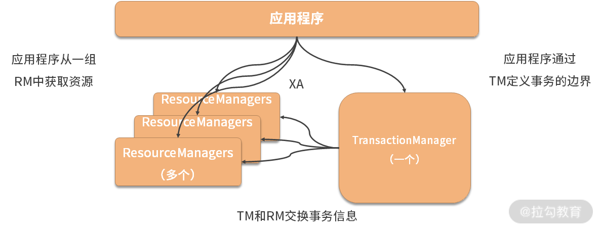
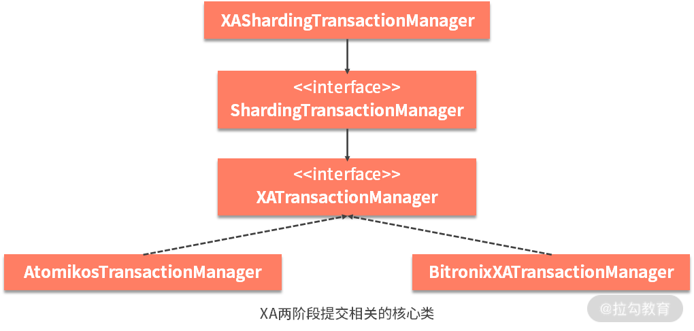
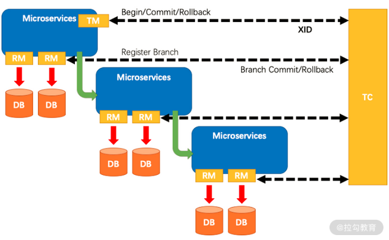
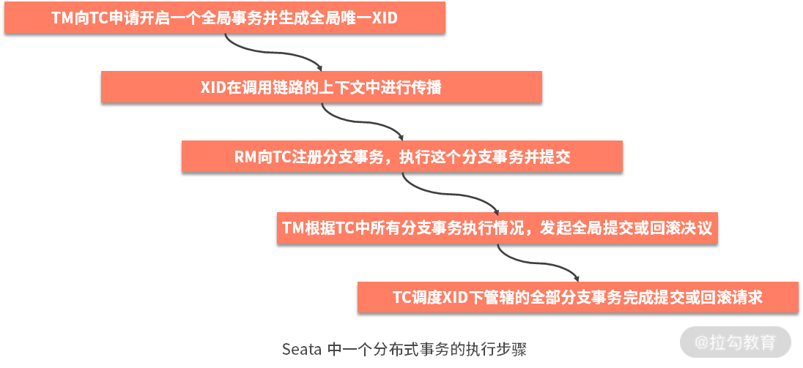

# 27 分布式事务：如何理解 ShardingSphere 中对分布式事务的抽象过程？

从今天开始，我们将进入一个全新模块，即 **ShardingSphere 分布式事务** 。这是一个非常重要的主题，我们将通过三个课时来全面介绍 ShardingSphere 的事务实现机制。

### ShardingTransactionManagerEngine

在第 18 课时和第 19 课时的“分布式事务：如何使用强一致事务与柔性事务？”中，我们已经对分布式事务的基本概念做了介绍。

在了解完一些基本概念之后，我们来看 ShardingSphere 中分布式事务模块的代码工程组织结构，我们发现存在三个底层的工程，即 sharding-transaction-core、sharding-transaction-2pc 和 sharding-transaction-base。

从命名上，我们不难看出 sharding-transaction-core 应该包含了分布式事务相关的一些基础核心类，而 sharding-transaction-2pc 和 sharding-transaction-base 分别基于强一致性和最终一致性的两种实现。

这些包结构的命名实际上可以体现在事务类型 TransactionType 的定义上，它是一个枚举，分别代表了本地事务、XA 二阶段提交事务和 BASE 柔性事务，如下所示：

```
public enum TransactionType {

    LOCAL, XA, BASE

}

```

TransactionType 类位于 sharding-transaction-core 工程中，让我们先来看一下这个工程中的其他内容，首先其冲的就是 ShardingTransactionManagerEngine 接口。

在前面的课程中，我们在 ShardingRuntimeContext 这个上下文对象中第一次看到这个分布式事务管理器的入口，如下所示：

```
public final class ShardingRuntimeContext extends AbstractRuntimeContext<ShardingRule> {

 …

    private final ShardingTransactionManagerEngine shardingTransactionManagerEngine;


 public ShardingRuntimeContext(final Map<String, DataSource> dataSourceMap, final ShardingRule rule, final Properties props, final DatabaseType databaseType) throws SQLException {

       …

        //创建分布式事务管理器引擎并初始化

        shardingTransactionManagerEngine = new ShardingTransactionManagerEngine();

        shardingTransactionManagerEngine.init(databaseType, dataSourceMap);

 }

 …

}

```

在 ShardingTransactionManagerEngine 的构造函数中，调用了如下所示的 loadShardingTransactionManager 方法：

```
private final Map<TransactionType, ShardingTransactionManager> transactionManagerMap = new EnumMap<>(TransactionType.class);

 

    private void loadShardingTransactionManager() {

         //通过 ServiceLoader 加载 ShardingTransactionManager 实现类

        for (ShardingTransactionManager each : ServiceLoader.load(ShardingTransactionManager.class)) {

            if (transactionManagerMap.containsKey(each.getTransactionType())) {

                log.warn("Find more than one {} transaction manager implementation class, use `{}` now",

                    each.getTransactionType(), transactionManagerMap.get(each.getTransactionType()).getClass().getName());

                continue;

            }

            transactionManagerMap.put(each.getTransactionType(), each);

        }

}

```

可以看到，这里直接使用了 JDK 中 ServiceLoader 工具类的 load 方法来加载 ShardingTransactionManager 的实现类，这是使用 SPI 实现微内核架构的最直接的方式，上述方法的作用就是加载类路径上的 ShardingTransactionManager 并缓存在内存中。在 ShardingSphere 中，ShardingTransactionManager 是对分布式事务管理器的一种抽象。我们在后续内容中会具体展开。

然后，我们看到在 ShardingRuntimeContext 中，当构建完 ShardingTransactionManagerEngine 对象之后，会调用它的 init 方法进行初始化，如下所示：

```
public void init(final DatabaseType databaseType, final Map<String, DataSource> dataSourceMap) {

        for (Entry<TransactionType, ShardingTransactionManager> entry : transactionManagerMap.entrySet()) {

            entry.getValue().init(databaseType, getResourceDataSources(dataSourceMap));

        }

}


private Collection<ResourceDataSource> getResourceDataSources(final Map<String, DataSource> dataSourceMap) {

        List<ResourceDataSource> result = new LinkedList<>();

        for (Map.Entry<String, DataSource> entry : dataSourceMap.entrySet()) {

           //创建 ResourceDataSource 对象

            result.add(new ResourceDataSource(entry.getKey(), entry.getValue()));

        }

        return result;

}

```

这部分的代码相当于是执行所获取 ShardingTransactionManager 的 init 方法对其进行初始化。在初始化过程中，我们在这里还看到了一个新的数据源对象 ResourceDataSource，如下所示：

```
public final class ResourceDataSource {

    private final String originalName;

    private String uniqueResourceName;

    private final DataSource dataSource;


    public ResourceDataSource(final String originalName, final DataSource dataSource) {

        this.originalName = originalName;

        this.dataSource = dataSource;

        this.uniqueResourceName = ResourceIDGenerator.getInstance().nextId() + originalName;

    }

}

```

ResourceDataSource 的作用就是保存数据库名和 DataSource 的信息，并为这个 ResourceDataSource 构建一个唯一的资源名称，构建过程使用了 ResourceIDGenerator 工具类。

我们可以学习一下它的实现方法，如下所示，可以看到这里用到了单例模式和原子类 AtomicInteger：

```
public final class ResourceIDGenerator {


    private static final ResourceIDGenerator INSTANCE = new ResourceIDGenerator();

 private final AtomicInteger count = new AtomicInteger();

 

 //创建单例

    public static ResourceIDGenerator getInstance() {

        return INSTANCE;

    }


    String nextId() {

        return String.format("resource-%d-", count.incrementAndGet());

    }

}

```

让我们再回到 ShardingTransactionManagerEngine，来看它的 getTransactionManager 方法，如下所示：

```
public ShardingTransactionManager getTransactionManager(final TransactionType transactionType) {

        ShardingTransactionManager result = transactionManagerMap.get(transactionType);

        if (TransactionType.LOCAL != transactionType) {

            Preconditions.checkNotNull(result, "Cannot find transaction manager of [%s]", transactionType);

        }

        return result;

}

```

这里只是根据事务类型获取了对应的 ShardingTransactionManager。最后，ShardingTransactionManagerEngine 中还有一个 close 方法，如下所示：

```
public void close() throws Exception {

        for (Entry<TransactionType, ShardingTransactionManager> entry : transactionManagerMap.entrySet()) {

            entry.getValue().close();

        }

}

```

通过上述分析，我们可以认为，ShardingTransactionManagerEngine 作为分布式事务的入口，更多的起到对 ShardingTransactionManager 的管理和维护作用，相当于是一个容器。

那么 ShardingTransactionManager 是如何运作的呢？让我们一起来看一下。

### ShardingTransactionManager

ShardingTransactionManager 接口位于 sharding-transaction-core 工程的 org.apache.shardingsphere.transaction.spi 包中，定义如下：

```
public interface ShardingTransactionManager extends AutoCloseable {


    //根据数据库类型和 ResourceDataSource 进行初始化

    void init(DatabaseType databaseType, Collection<ResourceDataSource> resourceDataSources);


    //获取 TransactionType

    TransactionType getTransactionType();


    //判断是否在事务中

    boolean isInTransaction();


    //获取支持事务的 Connection

    Connection getConnection(String dataSourceName) throws SQLException;


    //开始事务

    void begin();


    //提交事务

    void commit();


    //回滚事务

    void rollback();

}

```

我们看到从该接口中可以根据 DataSource 名获取 Connection。同时，对比后面要介绍的 JTA 中的 TransactionManager 接口，我们同样找到了作为一个事务管理器而言所必需的 begin、commit 和 rollback 这三个基本操作。ShardingSphere 还为这些基本操作专门提供了一个枚举 TransactionOperationType。

我们通过查看 ShardingSphere 中 ShardingTransactionManager 的类层结构，发现存在两个实现类，即 XAShardingTransactionManager 和 SeataATShardingTransactionManager 类。

#### 1.XAShardingTransactionManager

要理解基于 XA 协议的 ShardingTransactionManager，我们同样需要具备一定的理论知识。XA 是由 X/Open 组织提出的两阶段提交协议，是一种分布式事务的规范，XA 规范主要定义了面向全局的事务管理器 TransactionManager（TM）和面向局部的资源管理器 ResourceManager（RM）之间的接口。

XA 接口是双向的系统接口，在 TransactionManager，以及一个或多个 ResourceManager 之间形成通信桥梁。通过这样的设计，TransactionManager 控制着全局事务，管理事务生命周期，并协调资源，而 ResourceManager 负责控制和管理包括数据库相关的各种实际资源。

XA 的整体结构以及 TransactionManager 和 ResourceManager 之间的交互过程参考下图：



XA 协议组成结构图

所有关于分布式事务的介绍中都必然会讲到两阶段提交，因为它是实现 XA 分布式事务的关键。我们知道在两阶段提交过程中，存在协调者和参与者两种角色。在上图中，XA 引入的 TransactionManager 充当着全局事务中的“协调者”角色，而图中的 ResourceManager 相当于“参与者”角色，对自身内部的资源进行统一管理。

理解了这些概念之后，我们再来看 Java 中的实现。作为 Java 平台中的事务规范，JTA（Java Transaction API）也定义了对 XA 事务的支持。实际上，JTA 是基于 XA 架构进行建模的，在 JTA 中，事务管理器抽象为 javax.transaction.TransactionManager 接口，并通过底层事务服务进行实现。

和很多其他的 Java 规范一样，JTA 仅仅定义了接口，具体的实现则是由供应商负责提供。目前JTA 的实现分成两大类，其中一类是直接集成在应用服务器中，例如 JBoss；另一类则是独立的实现，例如 ShardingSphere 中所采用的 Atomikos 和 Bitronix，这些实现可以应用在那些不使用 J2EE 应用服务器的环境里（例如普通的 Java 应用）用以提供分布式事务保证。另一方面，JTA 接口里的 ResourceManager 同样需要数据库厂商提供 XA 的驱动实现。

接下来，让我们对 JTA 中的相关核心类做进一步分析，这些内容是后续理解 ShardingSphere 中分布式事务实现机制的基础。

在 JTA 中，提供了以下几个核心接口：

- **UserTransaction**

该接口是面向开发人员的接口，能够编程控制事务处理。

- **TransactionManager**

通过该接口允许应用程序服务器来控制分布式事务。

- **Transaction**

代表正在管理应用程序的事务。

- **XAResource**这是一个面向提供商的实现接口，是一个基于 XA 协议的 Java 映射，各个数据库提供商在提供访问自己资源的驱动时，必须实现这样的接口。

另外，在 javax.sql 包中还存在几个与 XA 相关的核心类，即代表连接的 XAConnection、代表数据源的 XADataSource，以及代表事务编号的 Xid。

我们采用上述核心类来简单模拟一下基于 XA 的分布式事务的常见实现过程的伪代码。对于一个跨库操作而言，一般我们可以基于 UserTransaction 接口实现如下的操作流程：

```
UserTransaction userTransaction = null; 

Connection connA = null; 

Connection connB = null; 

try{

    userTransaction.begin(); 

    //实现跨库操作

     connA.execute("sql1")

     connB.execute("sql2") 

    userTransaction.commit();

}catch(){

    userTransaction.rollback();

}

```

要想上述代码发挥作用，这里的连接对象 Connection 就得支持 XAResource 接口，也就涉及一系列关于 XADataSource 和 XAConnection 的处理过程。

让我们回到 ShardingSphere，来看 XAShardingTransactionManager 类，该类是分布式事务的 XA 实现类，它主要负责对实际的 DataSource 进行管理和适配，并且将接入端事务的 begin/commit/rollback 操作委托给具体的 XA 事务管理器，例如 XAShardingTransactionManager 就会使用 XATransactionManager 中的 TransactionManager 完成 commit 操作：

```
@Override

public void commit() {

    xaTransactionManager.getTransactionManager().commit();

}

```

这里的 XATransactionManager 就是对各种第三方 XA 事务管理器的一种抽象，封装了对

Atomikos、Bitronix 等第三方工具的实现方式。我们会在下一课时中对这个 XATransactionManager 以及 XAShardingTransactionManager 进行具体展开。

作为总结，我们梳理在 ShardingSphere 中与 XA 两阶段提交相关的核心类之间的关系，如下图所示：



#### 2.SeataATShardingTransactionManager

介绍完 XAShardingTransactionManager 之后，我们来看上图中 ShardingTransactionManager 接口的另一个实现类 SeataATShardingTransactionManager。因为基于不同技术体系和工作原理，所以 SeataATShardingTransactionManager 中的实现方法也完全不同，让我们来看一下。

在介绍 SeataATShardingTransactionManager 之前，我们同样有必要对 Seata 本身做一些展开。与 XA 不同，**Seata 框架**中一个分布式事务包含三种角色，除了 XA 中同样具备的 TransactionManager（TM）和 ResourceManager（RM） 之外，还存在一个事务协调器 TransactionCoordinator (TC)，维护全局事务的运行状态，负责协调并驱动全局事务的提交或回滚。

其中，TM 是一个分布式事务的发起者和终结者，TC 负责维护分布式事务的运行状态，而 RM 则负责本地事务的运行。

Seata 的整体架构图如下所示：



Seata 分布式事务组成结构图（来自 Seata 官网）

基于Seata 框架，一个分布式事务的执行流程包含如下五个步骤：



我们同样会在下一课时中对这些步骤，以及其中涉及的核心类进行具体展开。

### 从源码解析到日常开发

今天的内容我们主要关注于 ShardingSphere 中对分布式事务的抽象过程，本身没有涉及过多的源码分析。我们学习的关注点在于掌握 XA 协议的特点和核心类，以及基于 Seata 框架完成一次分布式事务执行的过程。

### 小结与预告

这是介绍 ShardingSphere 分布式事务实现原理的第一个课时，我们重点讲解了 ShardingSphere 是如何基于同一套体系来完成对 XA 和 Seata 这两种不同分布式事务实现方式的统一抽象和封装。

这里给你留一道思考题：ShardingSphere 对不同的分布式事务实现技术做了哪些抽象？欢迎你在留言区与大家讨论，我将逐一点评解答。

在接下来的两个课时中，我们就将基于今天讲到的很多概念和步骤，从源码角度出发深入剖析分布式事务的实现原理和过程。
