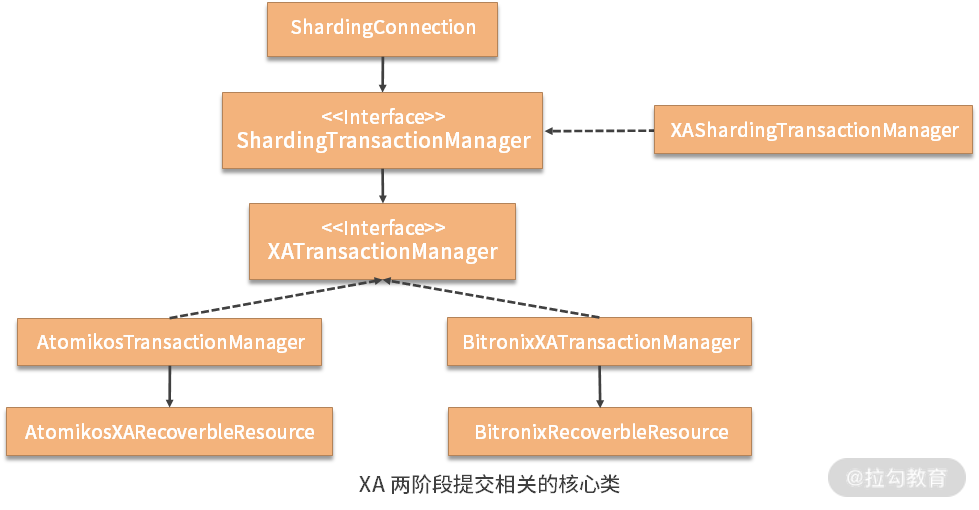
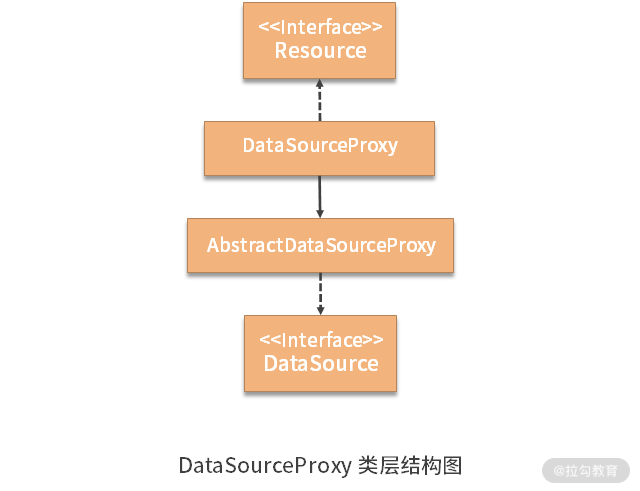

29 分布式事务：ShardingSphere 中如何集成强一致性事务和柔性事务支持？（下）
==============================================

在上一课时中，我们针对 ShardingSphere 中支持强一致性事务的 XAShardingTransactionManager 的部分内容进行了详细的展开，今天我们继续讲解该类的剩余内容，同时也会介绍支持柔性事务的 SeataATShardingTransactionManager。

### XAShardingTransactionManager

关于 XAShardingTransactionManager，上一讲中我们介绍了 XADataSource、XAConnection 和 XATransactionDataSource 等核心类。

接下来，我们在上一讲的基础上给出 XATransactionManager 和 ShardingConnection 类的实现过程。

#### 1.XATransactionManager

让我们先回到 XAShardingTransactionManager。我们已经在前面介绍了 XAShardingTransactionManager 中的变量，接下来看一下它所实现的方法，首先是如下所示的 init 方法：

```
public void init(final DatabaseType databaseType, final Collection<ResourceDataSource> resourceDataSources) {

        for (ResourceDataSource each : resourceDataSources) {

           //创建XATransactionDataSource并进行缓存

            cachedDataSources.put(each.getOriginalName(), new XATransactionDataSource(databaseType, each.getUniqueResourceName(), each.getDataSource(), xaTransactionManager));

        }

       //初始化XATransactionManager

        xaTransactionManager.init();

}

```

上述方法根据传入的 ResourceDataSource 构建了 XATransactionDataSource 并放入缓存中，同时对通过 SPI 机制创建的 XATransactionManager 也执行了它的 init 方法进行初始化。

XAShardingTransactionManager 的 getTransactionType、isInTransaction 和 getConnection 方法都比较简单，如下所示：

```
@Override

public TransactionType getTransactionType() {

        return TransactionType.XA;

}


@Override

public boolean isInTransaction() {

        return Status.STATUS_NO_TRANSACTION != xaTransactionManager.getTransactionManager().getStatus();

}

  

@Override

public Connection getConnection(final String dataSourceName) throws SQLException {

        try {

            return cachedDataSources.get(dataSourceName).getConnection();

        } catch (final SystemException | RollbackException ex) {

            throw new SQLException(ex);

        }

}

```

而与事务操作相关的 begin、commit 和 rollback 方法的实现同样比较简单，都是直接委托保存在 XATransactionManager 中的 TransactionManager 进行完成，如下所示：

```
@Override

public void begin() {

        xaTransactionManager.getTransactionManager().begin();

}


@Override

public void commit() {

        xaTransactionManager.getTransactionManager().commit();

}


@Override

public void rollback() {

        xaTransactionManager.getTransactionManager().rollback();

}

```

至此，sharding-transaction-xa-core 工程中的所有内容都已经介绍完毕。让我们转到 sharding-transaction-xa-atomikos-manager 工程，看看 AtomikosTransactionManager 的实现，这也是 ShardingSphere 中关于 TransactionManager 的默认实现。

而在此之前，让我们先来看一下代表资源的 AtomikosXARecoverableResource 的实现，如下所示：

```
public final class AtomikosXARecoverableResource extends JdbcTransactionalResource {


    private final String resourceName;


    AtomikosXARecoverableResource(final String serverName, final XADataSource xaDataSource) {

        super(serverName, xaDataSource);

        resourceName = serverName;

    }


    @Override

    public boolean usesXAResource(final XAResource xaResource) {

        return resourceName.equals(((SingleXAResource) xaResource).getResourceName());

    }

}

```

可以看到，这里的 usesXAResource 方法实际上就是通过基于对 SingleXAResource 的 ResourceName 进行比对来确定是否在使用资源，这也是为什么要设计包装了 XAResource 的 SingleXAResource 类的原因。

AtomikosTransactionManager 中使用了 AtomikosXARecoverableResource，其实现过程如下所示：

```
public final class AtomikosTransactionManager implements XATransactionManager {


    private final UserTransactionManager transactionManager = new UserTransactionManager();


    private final UserTransactionService userTransactionService = new UserTransactionServiceImp();


    @Override

    public void init() {

        userTransactionService.init();

    }


    @Override

    public void registerRecoveryResource(final String dataSourceName, final XADataSource xaDataSource) {

        userTransactionService.registerResource(new AtomikosXARecoverableResource(dataSourceName, xaDataSource));

    }


    @Override

    public void removeRecoveryResource(final String dataSourceName, final XADataSource xaDataSource) {

        userTransactionService.removeResource(new AtomikosXARecoverableResource(dataSourceName, xaDataSource));

    }


    @Override

    @SneakyThrows

    public void enlistResource(final SingleXAResource xaResource) {

        transactionManager.getTransaction().enlistResource(xaResource);

    }


    @Override

    public TransactionManager getTransactionManager() {

        return transactionManager;

    }


    @Override

    public void close() {

        userTransactionService.shutdown(true);

    }

}

```

上述方法本质上都是对 Atomikos 的 UserTransactionManager 和 UserTransactionService 的简单调用，注意到 Atomikos 的 UserTransactionManager 实现了 TransactionManager 接口，封装了所有 TransactionManager 需要完成的工作。

看完 sharding-transaction-xa-atomikos-manager 工程之后，我们来到另一个 sharding-transaction-xa-bitronix-manager 工程，该工程提供了基于 bitronix 的 XATransactionManager 实现方案，即 BitronixXATransactionManager 类：

```
public final class BitronixXATransactionManager implements XATransactionManager {


    private final BitronixTransactionManager bitronixTransactionManager = TransactionManagerServices.getTransactionManager();


    @Override

    public void init() {

    }


    @SneakyThrows

    @Override

    public void registerRecoveryResource(final String dataSourceName, final XADataSource xaDataSource) {

        ResourceRegistrar.register(new BitronixRecoveryResource(dataSourceName, xaDataSource));

    }


    @SneakyThrows

    @Override

    public void removeRecoveryResource(final String dataSourceName, final XADataSource xaDataSource) {

        ResourceRegistrar.unregister(new BitronixRecoveryResource(dataSourceName, xaDataSource));

    }


    @SneakyThrows

    @Override

    public void enlistResource(final SingleXAResource singleXAResource) {

        bitronixTransactionManager.getTransaction().enlistResource(singleXAResource);

    }


    @Override

    public TransactionManager getTransactionManager() {

        return bitronixTransactionManager;

    }


    @Override

    public void close() {

        bitronixTransactionManager.shutdown();

    }

}

```

对上述代码的理解也依赖与对 bitronix 框架的熟悉程度，整个封装过程简单明了。我们无意对 bitronix 框架做过多展开，而是更多关注于 ShardingSphere 中对 XATransactionManager 的抽象过程。

作为总结，我们在上一课时的基础上，进一步梳理了 XA 两阶段提交相关的核心类之间的关系，如下图所示：



#### 2.ShardingConnection

上图展示了整个流程的源头是在 ShardingConnection 类。我们在 ShardingConnection 的构造函数中发现了创建 ShardingTransactionManager 的过程，如下所示：

```
shardingTransactionManager = runtimeContext.getShardingTransactionManagerEngine().getTransactionManager(transactionType);

```

在 ShardingConnection 的多处代码中都用到了上面所创建的 shardingTransactionManager 对象。例如，用于获取连接的 createConnection 方法：

```
@Override

protected Connection createConnection(final String dataSourceName, final DataSource dataSource) throws SQLException {

        return isInShardingTransaction() ? shardingTransactionManager.getConnection(dataSourceName) : dataSource.getConnection();

}

```

用于判断是否是在同一个事务中的 isInShardingTransaction 方法：

```
private boolean isInShardingTransaction() {

        return null != shardingTransactionManager && shardingTransactionManager.isInTransaction();

}

```

以及如下所示的 setAutoCommit 方法完成了对 autoCommit 的处理：

```
@Override

public void setAutoCommit(final boolean autoCommit) throws SQLException {

        if (TransactionType.LOCAL == transactionType) {

            super.setAutoCommit(autoCommit);

            return;

        }

        if (autoCommit && !shardingTransactionManager.isInTransaction() || !autoCommit && shardingTransactionManager.isInTransaction()) {

            return;

        }

        if (autoCommit && shardingTransactionManager.isInTransaction()) {

            shardingTransactionManager.commit();

            return;

        }

        if (!autoCommit && !shardingTransactionManager.isInTransaction()) {

            closeCachedConnections();

            shardingTransactionManager.begin();

        }

}

```

在上述方法中，可以看到当事务类型为本地事务时，直接调用 ShardingConnection 的父类 AbstractConnectionAdapter 中的 setAutoCommit 方法完成本地事务的自动提交处理。

而当 autoCommit 为 true 且运行在事务中时，会调用 shardingTransactionManager.commit() 方法完成提交；而当 autoCommit 为 false 且当前不在事务中时，会调用 shardingTransactionManager.begin() 方法启动事务。

最后的 commit 和 rollback 的处理方式与 setAutoCommit 类似，都是根据事务类型来决定是否要进行分布式提交和回滚，如下所示：

```
@Override

public void commit() throws SQLException {

        if (TransactionType.LOCAL == transactionType) {

            super.commit();

        } else {

            shardingTransactionManager.commit();

        }

}


@Override

public void rollback() throws SQLException {

        if (TransactionType.LOCAL == transactionType) {

            super.rollback();

        } else {

            shardingTransactionManager.rollback();

        }

}

```

我们在上一课时中提到，ShardingSphere 在提供了两阶段提交的 XA 协议实现方案的同时，也实现了柔性事务。

在介绍完 XAShardingTransactionManager 之后，我们继续来看基于 Seata 框架的柔性事务 TransactionManager 实现类 SeataATShardingTransactionManager。

### SeataATShardingTransactionManager

因为 SeataATShardingTransactionManager 完全采用阿里巴巴的 Seata 框架来提供分布式事务特性，而不是遵循类似 XA 这样的开发规范，所以在代码实现上比 XAShardingTransactionManager 的类层结构要简单很多，把复杂性都屏蔽在了框架的内部。

要想集成 Seata，我们首先需要初始化 TMClient 和 RMClient 这两个客户端对象，在 Seata 内部，这两个客户端之间会基于 RPC 的方式进行通信。

所以，ShardingSphere 在 XAShardingTransactionManager 中的 init 方法中实现了一个 initSeataRPCClient 方法来初始化这两个客户端对象，如下所示：

```
//根据 seata.conf 配置文件创建配置对象

private final FileConfiguration configuration = new FileConfiguration("seata.conf"); 

private void initSeataRPCClient() {

        String applicationId = configuration.getConfig("client.application.id");

        Preconditions.checkNotNull(applicationId, "please config application id within seata.conf file");

        String transactionServiceGroup = configuration.getConfig("client.transaction.service.group", "default");

        TMClient.init(applicationId, transactionServiceGroup);

        RMClient.init(applicationId, transactionServiceGroup);

}

```

回想我们在“09 | 分布式事务：如何使用强一致事务与柔性事务？”中关于 Seata 使用方式的介绍，不难理解这里通过 seata.conf 配置文件中所配置的 application.id 和 transaction.service.group 这两个配置项来执行初始化操作。

同时，对于 Seata 而言，它也提供了一套构建在 JDBC 规范之上的实现策略，这点和“03 | 规范兼容：JDBC 规范与 ShardingSphere 是什么关系？”中介绍的 ShardingSphere 与 JDBC 规范之间的兼容性类似。

而在命名上，Seata 更为直接明了，使用 DataSourceProxy 和 ConnectionProxy 这种代理对象。以 DataSourceProxy 为例，我们可以梳理它的类层结构如下：



可以看到 DataSourceProxy 实现了自己定义的 Resource 接口，然后继承了抽象类 AbstractDataSourceProxy，而后者则实现了 JDBC 中的 DataSource 接口。

所以，在我们初始化 Seata 框架时，同样需要根据输入的 DataSource 对象来构建 DataSourceProxy，并通过 DataSourceProxy 获取 ConnectionProxy。SeataATShardingTransactionManager 类中的相关代码如下所示：

```
@Override

public void init(final DatabaseType databaseType, final Collection<ResourceDataSource> resourceDataSources) {

     //初始化 Seata 客户端

     initSeataRPCClient();

     //创建 DataSourceProxy 并放入到 Map 中

     for (ResourceDataSource each : resourceDataSources) {

            dataSourceMap.put(each.getOriginalName(), new DataSourceProxy(each.getDataSource()));

     }

}


@Override

public Connection getConnection(final String dataSourceName) throws SQLException {

         //根据 DataSourceProxy 获取 ConnectionProxy

     return dataSourceMap.get(dataSourceName).getConnection();

}

```

介绍完初始化工作之后，我们来看 SeataATShardingTransactionManager 中提供了事务开启和提交相关的入口。在 Seata 中，GlobalTransaction 是一个核心接口，封装了面向用户操作层的分布式事务访问入口，该接口的定义如下所示，可以从方法命名上直接看出对应的操作含义：

```
public interface GlobalTransaction {

    void begin() throws TransactionException;

    void begin(int timeout) throws TransactionException;

    void begin(int timeout, String name) throws TransactionException;

    void commit() throws TransactionException;

    void rollback() throws TransactionException;

    GlobalStatus getStatus() throws TransactionException;

    String getXid();

}

```

ShardingSphere 作为 GlobalTransaction 的用户层，同样基于 GlobalTransaction 接口来完成分布式事务操作。但 ShardingSphere 并没有直接使用这一层，而是设计了一个 SeataTransactionHolder 类，保存着线程安全的 GlobalTransaction 对象。

SeataTransactionHolder 类位于 sharding-transaction-base-seata-at 工程中，定义如下：

```
final class SeataTransactionHolder {


    private static final ThreadLocal<GlobalTransaction> CONTEXT = new ThreadLocal<>();


    static void set(final GlobalTransaction transaction) {

        CONTEXT.set(transaction);

    } 

    static GlobalTransaction get() {

        return CONTEXT.get();

    }


    static void clear() {

        CONTEXT.remove();

    }

}

```

可以看到这里使用了 ThreadLocal 工具类来确保对 GlobalTransaction 访问的线程安全性。

接下来的问题是，如何判断当前操作是否处于一个全局事务中呢？

在 Seata 中，存在一个上下文对象 RootContex，该类就是用来保存参与者和发起者之间传播的 Xid。当事务发起者开启全局事务后，会将 Xid 填充到 RootContext 里；然后 Xid 将沿着服务调用链一直传播，进而填充到每个事务参与者进程的 RootContext 里；事务参与者发现 RootContext 中存在 Xid 时，就可以知道自己处于全局事务中。

基于这层原理，我们只需要采用如下所示的判断方法就能得出是否处于全局事务中的结论：

```
@Override

public boolean isInTransaction() {

        return null != RootContext.getXID();

}

```

同时，Seata 也提供了一个针对全局事务的上下文类 GlobalTransactionContext，通过这个上下文类，我们可以使用 getCurrent 方法来获取一个 GlobalTransaction对象，或者通过 getCurrentOrCreate 方法在无法获取 GlobalTransaction 对象时新建一个。

讲到这里，我们就不难理解 SeataATShardingTransactionManager 中 begin 方法的实现过程了，如下所示：

```
@Override

@SneakyThrows

public void begin() {

        SeataTransactionHolder.set(GlobalTransactionContext.getCurrentOrCreate());

        SeataTransactionHolder.get().begin();

        SeataTransactionBroadcaster.collectGlobalTxId();

}

```

这里通过 GlobalTransactionContext.getCurrentOrCreate() 方法创建了一个 GlobalTransaction，然后将其保存到了 SeataTransactionHolder 中。接着从 SeataTransactionHolder 中获取一个 GlobalTransaction，并调用 begin 方法启动事务。

注意到这里还有一个 SeataTransactionBroadcaster 类，该类就是用来保存 Seata 全局 Xid 的一个容器类。我们会在事务启动时收集全局 Xid 并进行保存，而在事务提交或回滚时清空这些 Xid。

所以，如下所示的 commit、rollback 和 close 方法的实现过程就都变得容易理解了：

```
@Override

public void commit() {

        try {

            SeataTransactionHolder.get().commit();

        } finally {

            SeataTransactionBroadcaster.clear();

            SeataTransactionHolder.clear();

        }

}


@Override

public void rollback() {

        try {

            SeataTransactionHolder.get().rollback();

        } finally {

            SeataTransactionBroadcaster.clear();

            SeataTransactionHolder.clear();

        }

}


@Override

public void close() {

        dataSourceMap.clear();

        SeataTransactionHolder.clear();

        TmRpcClient.getInstance().destroy();

        RmRpcClient.getInstance().destroy();

}

```

sharding-transaction-base-seata-at 工程中的代码实际上就只有这些内容，这些内容也构成了在 ShardingSphere中 集成 Seata 框架的实现过程。

### 从源码解析到日常开发

今天的内容给出了在应用程序中如何集成 Seata 分布式事务框架的详细过程，ShardingSphere 为我们提供了一种模版实现。在日常开发过程中，如果我们想要在业务代码中集成 Seata，就可以参考 SeataTransactionHolder、SeataATShardingTransactionManager 等核心类中的代码，而不需要做太多的修改。

### 小结与预告

本课时是 ShardingSphere 分布式事务的最后一讲，我们介绍完了 XAShardingTransactionManager 的剩余部分内容，以及 SeataATShardingTransactionManager 的完整实现。

回顾上一课时内容，我们发现理解 XAShardingTransactionManager 的难点在于，从 ShardingConnection 到底层 JDBC 规范的整个集成和兼容过程。而对于 XAShardingTransactionManager 而言，我们需要对 Seata 框架本身有一定的了解，才能更好地理解今天的内容。

这里给你留一道思考题：如果让你实现对 Seata 框架的集成，你需要做哪些核心步骤？欢迎你在留言区与大家讨论，我将逐一点评解答。

介绍完分布式事务之后，我们将进入“ShardingSphere 中编排治理方面的源码解析”模块，从下一课时开始，我将要介绍数据脱敏模块的实现原理。
