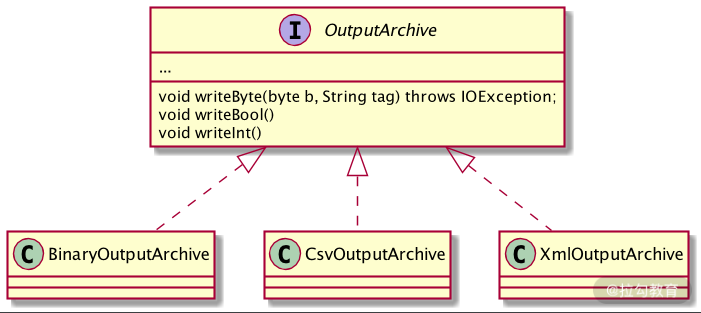
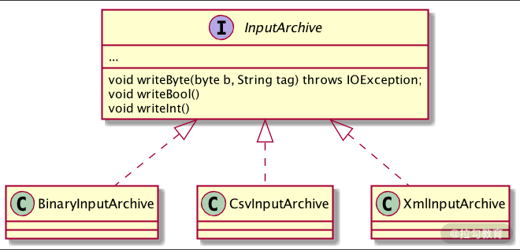

# 04 ZooKeeper 如何进行序列化？

通过前几课时的学习，我们大概清楚了使用 ZooKeeper 实现一些功能的主要方式，也就是通过客户端与服务端之间的相互通信。那么首先要解决的问题就是通过网络传输数据，而要想通过网络传输我们定义好的 Java 对象数据，必须要先对其进行序列化。例如，我们通过 ZooKeeper 客户端发送 ACL 权限控制请求时，需要把请求信息封装成 packet 类型，经过序列化后才能通过网络将 ACL 信息发送给 ZooKeeper 服务端进行处理。

#### 什么是序列化，为什么要进行序列化操作

序列化是指将我们定义好的 Java 类型转化成数据流的形式。之所以这么做是因为在网络传输过程中，TCP 协议采用“流通信”的方式，提供了可以读写的字节流。而这种设计的好处在于避免了在网络传输过程中经常出现的问题：比如消息丢失、消息重复和排序等问题。那么什么时候需要序列化呢？如果我们需要通过网络传递对象或将对象信息进行持久化的时候，就需要将该对象进行序列化。

我们较为熟悉的序列化操作是在 Java中，当我们要序列化一个对象的时候，首先要实现一个 Serializable 接口。

```java
public class User implements Serializable{


  private static final long serialVersionUID = 1L;


  private Long ids;


  private String name;


  ...


}

```

实现了 Serializable 接口后其实没有做什么实际的工作，它是一个没有任何内容的空接口，起到的作用就是标识该类是需要进行序列化的，这个就与我们后边要重点讲解的 ZooKeeper 序列化实现方法有很大的不同，这里请你先记住当前的写法，后边我们会展开讲解。

```java
public interface Serializable {


}

```

定义好序列化接口后，我们再看一下如何进行序列化和反序列化的操作。Java 中进行序列化和反序列化的过程中，主要用到了 ObjectInputStream 和 ObjectOutputStream 两个 IO 类。

ObjectOutputStream 负责将对象进行序列化并存储到本地。而 ObjectInputStream 从本地存储中读取对象信息反序列化对象。

```java
//序列化


ObjectOutputStream oo = new ObjectOutputStream()


oo.writeObject(user);


//反序列化


ObjectInputStream ois = new ObjectInputStream();


User user = (User) ois.readObject();

```

到目前为止我们了解了什么是序列化，以及为什么要进行序列化，并通过我们熟悉的 Java 编程语言中的序列化实现，进一步对序列化操作有更加具体的了解。我们知道，当我们要把对象进行本地存储或网络传输时是需要进行序列化操作的，而在 ZooKeeper 中需要频繁的网络传输工作，那么在 ZooKeeper 中是如何进行序列化的呢，我们带着这个问题继续下面的学习。

#### ZooKeeper 中的序列化方案

在 ZooKeeper 中并没有采用和 Java 一样的序列化方式，而是采用了一个 Jute 的序列解决方案作为 ZooKeeper 框架自身的序列化方式，说到 Jute 框架，它最早作为 Hadoop 中的序列化组件。之后 Jute 从 Hadoop 中独立出来，成为一个独立的序列化解决方案。ZooKeeper 从最开始就采用 Jute 作为其序列化解决方案，直到其最新的版本依然没有更改。

虽然 ZooKeeper 一直将 Jute 框架作为序列化解决方案，但这并不意味着 Jute 相对其他框架性能更好，反倒是 Apache Avro、Thrift 等框架在性能上优于前者。之所以 ZooKeeper 一直采用 Jute 作为序列化解决方案，主要是新老版本的兼容等问题，这里也请你注意，也许在之后的版本中，ZooKeeper 会选择更加高效的序列化解决方案。

#### 使用 Jute 实现序列化

简单介绍了 Jute 框架的发展过程，下面我们来看一下如何使用 Jute 在 ZooKeeper 中实现序列化。如果我们要想将某个定义的类进行序列化，首先需要该类实现 Record 接口的 serilize 和 deserialize 方法，这两个方法分别是序列化和反序列化方法。下边这段代码给出了我们一般在 ZooKeeper 中进行序列化的具体实现：首先，我们定义了一个 test_jute 类，为了能够对它进行序列化，需要该 test_jute 类实现 Record 接口，并在对应的 serialize 序列化方法和 deserialize 反序列化方法中编辑具体的实现逻辑。

```java
class test_jute implements Record{


  private long ids；


  private String name;


  ...


  public void serialize(OutpurArchive a_,String tag){


    ...


  }


  public void deserialize(INputArchive a_,String tag){


    ...


  }


}

```

而在序列化方法 serialize 中，我们要实现的逻辑是，首先通过字符类型参数 tag 传递标记序列化标识符，之后使用 writeLong 和 writeString 等方法分别将对象属性字段进行序列化。

```java
public void serialize(OutpurArchive a_,String tag) throws ...{


  a_.startRecord(this.tag);


  a_.writeLong(ids,"ids");


  a_.writeString(type,"name");


  a_.endRecord(this,tag);


}

```

而调用 derseralize 在实现反序列化的过程则与我们上边说的序列化过程正好相反。

```java
public void deserialize(INputArchive a_,String tag) throws {


  a_.startRecord(tag);


  ids = a_.readLong("ids");


  name = a_.readString("name");


  a_.endRecord(tag);


}

```

到这里我们就介绍完了如何在 ZooKeeper 中使用 Jute 实现序列化，需要注意的是， **在实现了Record 接口后，具体的序列化和反序列化逻辑要我们自己在 serialize 和 deserialize 函数中完成** 。

序列化和反序列化的实现逻辑编码方式相对固定，首先通过 startRecord 开启一段序列化操作，之后通过 writeLong、writeString 或 readLong、 readString 等方法执行序列化或反序列化。本例中只是实现了长整型和字符型的序列化和反序列化操作，除此之外 ZooKeeper 中的 Jute 框架还支持 整数类型（Int）、布尔类型（Bool）、双精度类型（Double）以及 Byte/Buffer 类型。

#### Jute 在 ZooKeeper 中的底层实现

正因为 ZooKeeper 的设计目的是将复杂的底层操作封装成简单易用的接口，从而方便用户调用，也使得我们在使用 ZooKeeper 实现序列化的时候能够更加容易。

学会了利用 Jute 实现序列化和反序列化后，我们深入底层，看一下 ZooKeeper 框架具体是如何实现序列化操作的。正如上边我们提到的，通过简单的实现 Record 接口就可以实现序列化，那么我们接下来就以这个接口作为入口，详细分析其底层原理。

Record 接口可以理解为 ZooKeeper 中专门用来进行网络传输或本地存储时使用的数据类型。因此所有我们实现的类要想传输或者存储到本地都要实现该 Record 接口。

```java
public interface Record{


  public void serialize(OutputArchive archive, String tag)


    throws IOException;


public void deserialize(InputArchive archive, String tag)


    throws IOException;


}

```

Record 接口的内部实现逻辑非常简单，只是定义了一个 序列化方法 serialize 和一个反序列化方法 deserialize 。而在 Record 起到关键作用的则是两个重要的类：OutputArchive 和 InputArchive ，其实这两个类才是真正的序列化和反序列化工具类。

在 OutputArchive 中定义了可进行序列化的参数类型，根据不同的序列化方式调用不同的实现类进行序列化操作。如下图所示，Jute 可以通过 Binary 、 Csv 、Xml 等方式进行序列化操作。



而对应于序列化操作，在反序列化时也会相应调用不同的实现类，来进行反序列化操作。 如下图所示：



注意：无论是序列化还是反序列化，都可以对多个对象进行操作，所以当我们在定义序列化和反序列化方法时，需要字符类型参数 tag 表示要序列化或反序列化哪个对象。

#### 总结

本课时介绍了什么是序列化以及为什么要进行序列化，简单来说，就是将对象编译成字节码的形式，方便将对象信息存储到本地或通过网络传输。

之后我们复习了 Java 中的序列化方式，与 ZooKeeper 中的序列化使用不同的是，在 Java 中，Serializable 接口是一个空接口，只是起到标识作用，实现了该接口的对象是需要进行序列化的。而在 ZooKeeper 的实现中，序列化对象需要实现的 Record 接口里边存在两个重要的方法，分别是 serialize 和 deserialize 方法。需要序列化的对象在继承 Record 接口的同时，还需要实现这两个方法。而具体的实现过程就是我们要序列化和反序列化的实现逻辑。

到现在我们已经对 ZooKeeper 中的序列化知识有了一个全面的掌握，请你思考一个问题：如果说序列化就是将对象转化成字节流的格式，那么为什么 ZooKeeper 的 Jute 序列化框架还提供了对 Byte/Buffer 这两种类型的序列化操作呢？

其实这其中最关键的作用就是在不同操作系统中存在大端和小端的问题，为了避免不同操作系统环境的差异，在传输字节类型时也要进行序列化和反序列化。这里你需要在日常使用中多注意。
