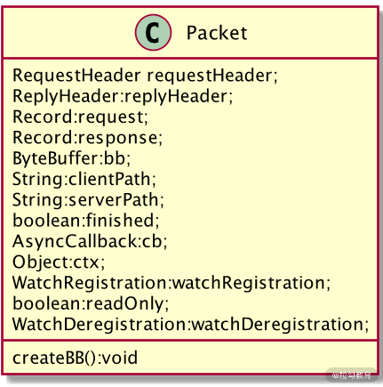

10 ClientCnxn：客户端核心工作类工作原理解析
============================

今天我们开始学习客户端核心工作类的工作原理。

上个课时我们学习了会话的底层实现过程，我们知道会话是在 ZooKeeper 的客户端发起的，而在会话超异常等事件发生时，服务端也会通知给客户端。而我们之所以能够接收到服务端的通知，并向服务端发送请求等操作，是通过 ZooKeeper 客户端实现的。下面我们就深入学习一下客户端核心工作类的实现过程和底层原理。

### 客户端核心类

在 ZooKeeper 客户端的底层实现中，ClientCnxn 类是其核心类，所有的客户端操作都是围绕这个类进行的。ClientCnxn 类主要负责维护客户端与服务端的网络连接和信息交互。

在前面的课程中介绍过，向服务端发送创建数据节点或者添加 Watch 监控等操作时，都会先将请求信息封装成 Packet 对象。那么 Packet 是什么呢？其实\*\* Packet 可以看作是一个 ZooKeeper 定义的，用来进行网络通信的数据结构\*\*，其主要作用是封装了网络通信协议层的数据。而 Packet 内部的数据结构如下图所示：



在 Packet 类中具有一些请求协议的相关属性字段，这些请求字段中分别包括：

* 请求头信息（RequestHeader）
* 响应头信息 （ReplyHeader）
* 请求信息体（Request）
* 响应信息体（Response）
* 节点路径（clientPath ServerPath）
* Watch 监控信息等

而在 Packet 类中有一个 createBB 方法函数，该函数的作用主要是将 Packet 对象的数据进行序列化，以便之后用于网络传输。具体过程如下面这段代码所示：

```java
public void createBB() {


 ByteArrayOutputStream baos = new ByteArrayOutputStream();


 BinaryOutputArchive boa = BinaryOutputArchive.getArchive(baos);


...


 if (requestHeader != null) {


     requestHeader.serialize(boa, "header");


 }


 if (request instanceof ConnectRequest) {


    request.serialize(boa, "connect");


    // append "am-I-allowed-to-be-readonly" flag


    boa.writeBool(readOnly, "readOnly");


 } else if (request != null) {


    request.serialize(boa, "request");


 }


 baos.close();


}

```

从代码中我们可以知道，在 createBB 进行序列化的时候，并不是将 Packet 类中的所有属性字段进行序列化。而是只对请求头信息（requestHeader）、请求体信息（request）、只读（readOnly）这三个属性字段进行序列化。而其余的属性字段则只是存储在客户端，用于之后的相关操作。

### 请求队列

在我们对请求信息进行封装和序列化后，ZooKeeper 不会立刻就将一个请求信息通过网络直接发送给服务端。而是通过将请求信息添加到队列中，之后通过 sendThread 线程类来处理相关的请求发送等操作。这种方式很像生产者和消费者模式，我们将请求信息准备好，并添加到队列中的操作相当于生成者，而 sendThread 线程从队列中取出要发送的请求信息，并发送给服务端相当于消费者操作。

而在 ZooKeeper 中，作为消费者的队列有两种，一种是客户端发送给服务端的发送队列 outgoingQueue 以及服务端响应客户端操作的响应队列 pendingQueue。如下面这段代码：

```java
 List<Packet> pendingQueue;//响应队列


 LinkedBlockingDeque<Packet> outgoingQueue;//发送队列

```

### SendThread

下面我们再看一下 SendThread 的底层实现，SendThread 类是一个线程类，其本质是一个 I/O 调度线程，它的作用就是用来管理操作客户端和服务端的网络 I/O 等。在 ZooKeeper 服务的运行过程中，SendThread 类的作用除了上面提到的负责将客户端的请求发送给服务端外，另一个作用是发送客户端是否存活的心跳检查，SendThread 类负责定期向服务端发送 PING 包来实现心跳检查。

```java
private void sendPing() {


    lastPingSentNs = System.nanoTime();


    RequestHeader h = new RequestHeader(-2, OpCode.ping);


    queuePacket(h, null, null, null, null, null, null, null, null);


}

```

如上面的代码所示，SendThread 类中通过 sendPing 函数向 ZooKeeper 服务端发送心跳检查。而在 sendPing 函数的内部，首先以纳秒为单位获取系统当前时间 lastPingSentNs，之后设置请求头的操作类型为心跳检查操作 OpCode.ping，最后将请求信息封装成 Packet 对象发送给 ZooKeeper 服务端。

### EventThread

SendThread 类的主要工作可以简单地理解为负责客户端向服务端发送请求等操作。而像我们之前学到的 Watch 监控机制，在事件触发后 ZooKeeper 服务端会发送通知给相关的客户端，那么在这个过程中，客户端是如何接收服务端的请求的呢？

ZooKeeper 是通过 EventThread 类来实现的，EventThread 类也是一个线程类，主要负责客户端的事件处理，比如在客户端接收 Watch 通知时，触发客户端的相关方法。在 EventThread 类中，如下面的代码所示，通过将要触发的事件对象存放在 waitingEvents 队列中，之后在接收到相应的事件通知时，会从该队列中取出对应的事件信息，之后调用 process 函数进行处理。

```java
class EventThread extends ZooKeeperThread {


  private final LinkedBlockingQueue<Object> waitingEvents


  ...


  process();


  ...


}

```

### 结束

通过本节课的学习，我们掌握了客户端核心类的工作原理，在客户端的底层实现中，ClientCnxn 类作为其最核心的实现类，当客户端要向服务端发送请求操作的时候，首先会将请求信息封装成 Packet 对象并加入请求队列中，之后通过 SendThread 网络 I/O 线将请求发送给服务端。

而在接收服务端响应时，客户端使用 EventThread 类处理接收响应事件以及触发客户端的回调方法。

这里留给你一道思考题：我们知道为了向服务端证明客户端是存活的，需要 ZooKeeper 客户端周期性的发送 Ping 操作给 ZooKeeper 服务端。而在 ZooKeeper 服务端收到 Ping 操作后，又做了什么操作呢？

答案是在 ZooKeeper 服务端收到 Ping 操作的请求时，会根据服务端的当前时间重置与客户端的 Session 时间，更新该会话的请求延迟时间等。进而保持客户端与服务端连接状态。
