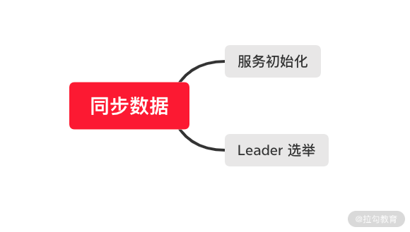
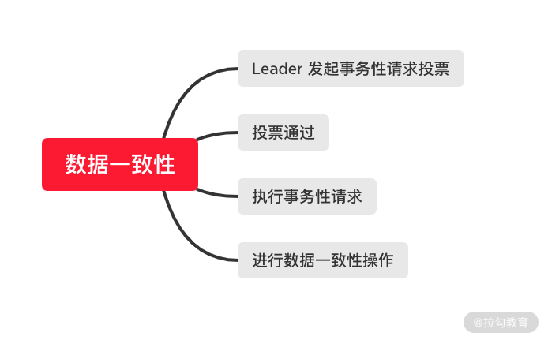

14 Leader 选举：如何保证分布式数据的一致性？
===========================

在前面的课程中，我们介绍了 ZooKeeper 集群服务的相关知识，我们知道在 ZooKeeper 集群中，服务器分为 Leader 服务器、 Follower 服务器以及 Observer 服务器。

可以这样认为，Leader 选举是一个过程，在这个过程中 ZooKeeper 主要做了两个重要工作，一个是数据同步，另一个是选举出新的 Leader 服务器。今天我们主要先介绍第一个工作，ZooKeeper 集群中的数据同步问题。

### Leader 的协调过程

在分布式系统中有一个著名的 CAP 定理，是说一个分布式系统不能同时满足一致性、可用性，以及分区容错性。今天我们要讲的就是一致性。其实 ZooKeeper 中实现的一致性也不是强一致性，即集群中各个服务器上的数据每时每刻都是保持一致的特性。在 ZooKeeper 中，采用的是最终一致的特性， **即经过一段时间后，ZooKeeper 集群服务器上的数据最终保持一致的特性** 。

在 ZooKeeper 集群中，Leader 服务器主要负责处理事物性的请求，而在接收到一个客户端的事务性请求操作时，Leader 服务器会先向集群中的各个机器针对该条会话发起投票询问。

要想实现 ZooKeeper 集群中的最终一致性，我们先要确定什么情况下会对 ZooKeeper 集群服务产生不一致的情况。如下图所示：



在集群初始化启动的时候，首先要同步集群中各个服务器上的数据。而在集群中 Leader 服务器崩溃时，需要选举出新的 Leader 而在这一过程中会导致各个服务器上数据的不一致，所以当选举出新的 Leader 服务器后需要进行数据的同步操作。

### 底层实现

与上面介绍的一样，我们的底层实现讲解主要围绕 ZooKeeper 集群中数据一致性的底层实现。ZooKeeper 在集群中采用的是多数原则方式，即**当一个事务性的请求导致服务器上的数据发生改变时，ZooKeeper 只要保证集群上的多数机器的数据都正确变更了，就可以保证系统数据的一致性。** 这是因为在一个 ZooKeeper 集群中，每一个 Follower 服务器都可以看作是 Leader 服务器的数据副本，需要保证集群中大多数机器数据是一致的，这样在集群中出现个别机器故障的时候，ZooKeeper 集群依然能够保证稳定运行。

在 ZooKeeper 集群服务的运行过程中，数据同步的过程如下图所示。当执行完数据变更的会话请求时，需要对集群中的服务器进行数据同步。



### 广播模式

ZooKeeper 在代码层的实现中定义了一个 HashSet 类型的变量，用来管理在集群中的 Follower 服务器，之后调用

getForwardingFollowers 函数获取在集群中的 Follower 服务器，如下面这段代码所示：

```
public class Leader(){


 HashSet<LearnerHandler> forwardingFollowers;


 public List<LearnerHandler> getForwardingFollowers() {


   synchronized (forwardingFollowers) {


       return new ArrayList<LearnerHandler>(forwardingFollowers);


 }


}

```

在 ZooKeeper 集群服务器对一个事物性的请求操作进行投票并通过后，Leader 服务器执行 isQuorumSynced 方法判断该 ZooKeeper 集群中的 Follower 节点的连接状态，由于 isQuorumSynced 方法可以被多个线程进行调用，所以在进行操作的时候要通过forwardingFollowers 字段进行加锁操作。之后遍历集群中的 Follower 服务器，根据服务器 zxid、以及数据同步状态等条件判断服务器的执行逻辑是否成功。之后统计 Follower 服务器的 sid 并返回。

```
public boolean isQuorumSynced(QuorumVerifier qv) {


  synchronized (forwardingFollowers) {


   for (LearnerHandler learnerHandler: forwardingFollowers){


       if(learnerHandler.synced()){


         ids.add(learnerHandler.getSid());


       }


   }


  }


}

```

通过上面的介绍，Leader 服务器在集群中已经完成确定 Follower 服务器状态等同步数据前的准备工作，接下来 Leader 服务器会通过 request.setTxn 方法向集群中的 Follower 服务器发送数据变更的会话请求。这个过程中，我们可以把 Leader 服务器看作是 ZooKeeper 服务中的客户端，而其向集群中 Follower 服务器发送数据更新请求，集群中的 Follower 服务器收到请求后会处理该会话，之后进行数据变更操作。如下面的代码所示，在底层实现中，通过调用 request 请求对象的 setTxn 方法向 Follower 服务器发送请求，在 setTxn 函数中我们传入的参数有操作类型字段 CONFIG\_NODE，表明该操作是数据同步操作。

```
request.setTxn(new SetDataTxn(ZooDefs.CONFIG_NODE, request.qv.toString().getBytes(), -1));    

```

### 恢复模式

介绍完 Leader 节点如何管理 Follower 服务器进行数据同步后，接下来我们看一下当 Leader 服务器崩溃后 ZooKeeper 集群又是如何进行数据的恢复和同步的。

在前面的课程中我们介绍过，当 ZooKeeper 集群中一个 Leader 服务器失效时，会重新在 Follower 服务器中选举出一个新的服务器作为 Leader 服务器。而 ZooKeeper 服务往往处在高并发的使用场景中，如果在这个过程中有新的事务性请求操作，应该如何处理呢？ 由于此时集群中不存在 Leader 服务器了，理论上 ZooKeeper 会直接丢失该条请求，会话不进行处理，但是这样做在实际的生产中显然是不行的，那么 ZooKeeper 具体是怎么做的呢？

在 ZooKeeper 中，重新选举 Leader 服务器会经历一段时间，因此理论上在 ZooKeeper 集群中会短暂的没有 Leader 服务器，在这种情况下接收到事务性请求操作的时候，ZooKeeper 服务会先将这个会话进行挂起操作，挂起的会话不会计算会话的超时时间，之后在 Leader 服务器产生后系统会同步执行这些会话操作。

到这里我们就对 ZooKeeper 中数据一致性的解决原理和底层实现都做了较为详细的介绍。我们总结一下，ZooKeeper 集群在处理一致性问题的时候基本采用了两种方式来协调集群中的服务器工作，分别是恢复模式和广播模式。

* **恢复模式**：当 ZooKeeper 集群中的 Leader 服务器崩溃后，ZooKeeper 集群就采用恢复模式的方式进行工作，在这个工程中，ZooKeeper 集群会首先进行 Leader 节点服务器的重新选择，之后在选举出 Leader 服务器后对系统中所有的服务器进行数据同步进而保证集群中服务器上的数据的一致性。
* **广播模式**：当 ZooKeeper 集群中具有 Leader 服务器，并且可以正常工作时，集群中又有新的 Follower 服务器加入 ZooKeeper 中参与工作，这种情况常常发生在系统性能到达瓶颈，进而对系统进行动态扩容的使用场景。在这种情况下，如果不做任何操作，那么新加入的服务器作为 Follower 服务器，其上的数据与 ZooKeeper 集群中其他服务器上的数据不一致。当有新的查询会话请求发送到 ZooKeeper 集群进行处理，而恰巧该请求实际被分发给这台新加入的 Follower 机器进行处理，就会导致明明在集群中存在的数据，在这台服务器上却查询不到，导致数据查询不一致的情况。因此，在当有新的 Follower 服务器加入 ZooKeeper 集群中的时候，该台服务器会在恢复模式下启动，并找到集群中的 Leader 节点服务器，并同该 Leader 服务器进行数据同步。

### LearnerHandler

介绍完 ZooKeeper 集群中数据同步的理论方法，我们再来分析一下在代码层面是如何实现的。记得在前面的课程中，我们提到过一个 LearnerHandler 类， 当时我们只是简单地从服务器之间的通信和协同工作的角度去分析了该类的作用。而 LearnerHandler 类其实可以看作是所有 Learner 服务器内部工作的处理者，它所负责的工作有：进行 Follower、Observer 服务器与 Leader 服务器的数据同步、事务性会话请求的转发以及 Proposal 提议投票等功能。

LearnerHandler 是一个多线程的类，在 ZooKeeper 集群服务运行过程中，一个 Follower 或 Observer 服务器就对应一个 LearnerHandler 。在集群服务器彼此协调工作的过程中，Leader 服务器会与每一个 Learner 服务器维持一个长连接，并启动一个单独的 LearnerHandler 线程进行处理。

如下面的代码所示，在 LearnerHandler 线程类中，最核心的方法就是 run 方法，处理数据同步等功能都在该方法中进行调用。首先通过 syncFollower 函数判断数据同步的方式是否是快照方式。如果是快照方式，就将 Leader 服务器上的数据操作日志 dump 出来发送给 Follower 等服务器，在 Follower 等服务器接收到数据操作日志后，在本地执行该日志，最终完成数据的同步操作。

```
public void run() {


  boolean needSnap = syncFollower(peerLastZxid, leader.zk.getZKDatabase(), leader);


  if(needSnap){


    leader.zk.getZKDatabase().serializeSnapshot(oa);


    oa.writeString("BenWasHere", "signature");


    bufferedOutput.flush();


  }


}

```

通过操作日志的方式进行数据同步或备份的操作已经是行业中普遍采用的方式，比如我们都熟悉的 MySQL 、Redis 等数据库也是采用操作日志的方式。

### 结束

本课时我们学习了 ZooKeeper 集群是如何保证数据的一致性的，并且知道了 Leader 服务器在集群中起到协调和管理 ZooKeeper 集群中其他角色服务器的作用。

请你注意，在本课时的介绍中，为了更好地讲解 Leader 服务器在管理集群服务器中数据一致性的作用，我介绍了当集群中 Leader 服务器崩溃时，如何处理事务性会话请求的过程。现在我们知道了在这种情况下，ZooKeeper 会把事务性请求会话挂起，暂时不进行操作。可能有些同学会产生这样的问题：如果会话挂起过多，会不会对系统产生压力，当 Leader 服务器产生后，一下子要处理大量的会话请求，这样不会造成服务器高负荷吗？

这里请你放心，Leader 选举的过程非常快速，在这期间不会造成大量事务性请求的会话操作积压，并不会对集群性能产生大的影响。
