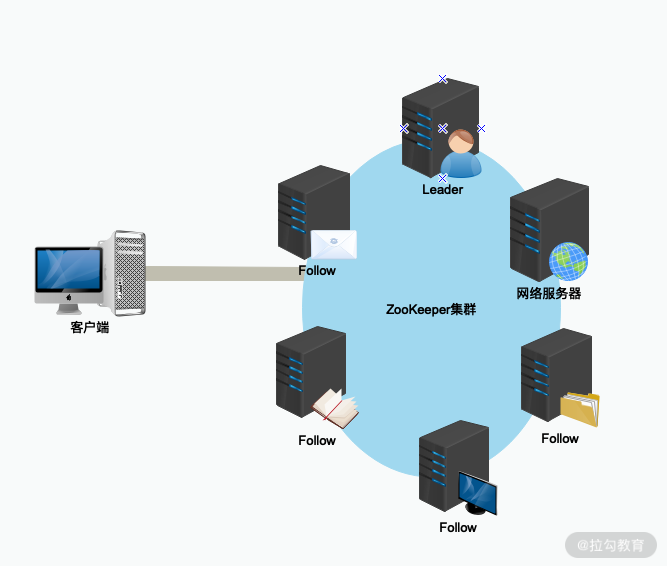

19 Observer 的作用与 Follow 有哪些不同？
==============================

在上个课时中，我们学习了 ZooKeeper 集群中 Follow 服务器的作用。在 ZooKeeper 集群服务运行的过程中，Follow 服务器主要负责处理来自客户端的非事务性请求，其中大部分是处理客户端发起的查询会话等请求。而在 ZooKeeper 集群中，Leader 服务器失效时，会在 Follow 集群服务器之间发起投票，最终选举出一个 Follow 服务器作为新的 Leader 服务器。

除了 Leader 和 Follow 服务器，ZooKeeper 集群中还有一个 Observer 服务器。在 ZooKeeper 集群中，Observer 服务器对于提升整个 ZooKeeper 集群运行的性能具有至关重要的作用。而本课时，我们就开始学习什么是 Observer 服务器，以及它在 ZooKeeper 集群中都做了哪些工作。

### Observer 介绍

在 ZooKeeper 集群服务运行的过程中，Observer 服务器与 Follow 服务器具有一个相同的功能，那就是负责处理来自客户端的诸如查询数据节点等非事务性的会话请求操作。但与 Follow 服务器不同的是， **Observer 不参与 Leader 服务器的选举工作，也不会被选举为 Leader 服务器** 。

在前面的课程中，我们或多或少有涉及 Observer 服务器，当时我们把 Follow 服务器和 Observer 服务器统称为 Learner 服务器。你可能会觉得疑惑，Observer 服务器做的事情几乎和 Follow 服务器一样，那么为什么 ZooKeeper 还要创建一个 Observer 角色服务器呢？

要想解释这个问题，就要从 ZooKeeper 技术的发展过程说起，最早的 ZooKeeper 框架如下图所示，可以看到，其中是不存在 Observer 服务器的。



在早期的 ZooKeeper 集群服务运行过程中，只有 Leader 服务器和 Follow 服务器。不过随着 ZooKeeper 在分布式环境下的广泛应用，早期模式的设计缺点也随之产生，主要带来的问题有如下几点：

1. 随着集群规模的变大，集群处理写入的性能反而下降。
2. ZooKeeper 集群无法做到跨域部署

其中最主要的问题在于，当 ZooKeeper 集群的规模变大，集群中 Follow 服务器数量逐渐增多的时候，ZooKeeper 处理创建数据节点等事务性请求操作的性能就会逐渐下降。这是因为 ZooKeeper 集群在处理事务性请求操作时，要在 ZooKeeper 集群中对该事务性的请求发起投票，只有超过半数的 Follow 服务器投票一致，才会执行该条写入操作。

正因如此，随着集群中 Follow 服务器的数量越来越多，一次写入等相关操作的投票也就变得越来越复杂，并且 Follow 服务器之间彼此的网络通信也变得越来越耗时，导致随着 Follow 服务器数量的逐步增加，事务性的处理性能反而变得越来越低。

为了解决这一问题，在 ZooKeeper 3.6 版本后，ZooKeeper 集群中创建了一种新的服务器角色，即 Observer——观察者角色服务器。Observer 可以处理 ZooKeeper 集群中的非事务性请求，并且不参与 Leader 节点等投票相关的操作。这样既保证了 ZooKeeper 集群性能的扩展性，又避免了因为过多的服务器参与投票相关的操作而影响 ZooKeeper 集群处理事务性会话请求的能力。

在引入 Observer 角色服务器后，一个 ZooKeeper 集群服务在部署的拓扑结构，如下图所示：


在实际部署的时候，因为 Observer 不参与 Leader 节点等操作，并不会像 Follow 服务器那样频繁的与 Leader 服务器进行通信。因此，可以将 Observer 服务器部署在不同的网络区间中，这样也不会影响整个 ZooKeeper 集群的性能，也就是所谓的跨域部署。

### 底层实现

介绍完 Observer 的作用和原理后，接下来我们再从底层代码的角度去分析一下 ZooKeeper 是如何实现一个 Observer 服务器的。

首先，在我们平时开发 ZooKeeper 服务的时候，如果想让某个服务器以 Observer 角色运行，需要在该服务器的运行配置文件 zoo.cfg 文件中添加 peerType 属性。如下面的代码所示，将该服务器的 peerType 属性设置为 observer 。

```
peerType=observer 

```

而当 ZooKeeper 集群服务开始运行的时候，首先调用 ObserverZooKeeperServer 类，来实例化 ZooKeeper 集群中每个 Observer 服务器，并初始化调用链等相关操作。如下面的代码所示：

```
ObserverZooKeeperServer(FileTxnSnapLog logFactory, QuorumPeer self, ZKDatabase zkDb) throws IOException {


    super(logFactory, self.tickTime, self.minSessionTimeout, self.maxSessionTimeout, zkDb, self);


    LOG.info("syncEnabled =" + syncRequestProcessorEnabled);

```

而在 ObserverZooKeeperServer 类的 commitRequest 函数中，就设置了与 Follow 角色不同的实现方式。如下面的代码所示，Observer 不会接收网络中的 Proposal 请求，不会像 Follow 一样，在 Proposal 阶段就获得 Leader 服务器发送的变更数据。Observer 服务器是从 INFORM 数据包中获得变更的数据，在 commitRequest 函数的内部实现中，提交执行来自 INFORM 数据包中的事务操作。

```
public void commitRequest(Request request) {     


    if (syncRequestProcessorEnabled) {


        // Write to txnlog and take periodic snapshot


        syncProcessor.processRequest(request);


    }


    commitProcessor.commit(request);        

```

### INFORM 消息

了解 Observer 服务器的底层实现过程后，我们再来介绍一下 INFORM 消息。Observer 不会接收来自 Leader 服务器提交的投票请求，且不会接收网络中的 Proposal 请求信息，只会从网络中接收 INFORM 类型的信息包。

而 INFORM 信息的内部只包含已经被 Cmmit 操作过的投票信息，因为 Observer 服务器只接收已经被提交处理的 Proposal 请求，不会接收未被提交的会话请求。这样就从底层信息的角度隔离了 Observer 参与投票操作，进而使 Observer 只负责查询等相关非事务性操作，保证扩展多个 Observer 服务器时不会对 ZooKeeper 集群写入操作的性能产生影响。

### Observer 处理链

接下来，我们再来看一下 Observer 服务器处理一次会话请求的底层实现过程。与 Leader 和 Follow 服务器一样，在处理一条来自客户单的会话请求时， Observer 同样采用的是处理链的设计方式。在这个 Observer 处理链上，主要定义了三个处理器，处理器的执行顺序分别是 ObserverRequestProcessor 处理器、CommitProcessor 处理器以及 FinalRequestProcessor 处理器。

在 ObserverRequestProcessor 处理器中，首先判断客户端请求的会话类型，将所有事务性的会话请求交给 Leader 服务器处理，如下面的代码所示。

```
public void run() {


        try {


            while (!finished) {


                Request request = queuedRequests.take();


                ...


                switch (request.type) {


                case OpCode.sync:


                    zks.pendingSyncs.add(request);


                    zks.getObserver().request(request);


                    break;


                case OpCode.create:


                case OpCode.create2:


                case OpCode.createTTL:


                case OpCode.createContainer:


                case OpCode.delete:


                case OpCode.deleteContainer:


                case OpCode.setData:


                case OpCode.reconfig:


                case OpCode.setACL:


                case OpCode.multi:


                case OpCode.check:


                    zks.getObserver().request(request);


                    break;


                ...


            }


        } 


        ...


    }


}

```

之后调用 CommitProcessor 处理器，将该条会话放入到 queuedRequests 请求等待队列中。并唤醒相关线程进行会话处理。queuedRequests 队列实现了 BlockingQueue 阻塞队列：**当 queuedRequests 队列容器已满，生产者线程会被阻塞，直到队列未满；当队列容器为空时，消费者线程会被阻塞，直至队列非空时为止。** 这就形成了一个消费者—生产者模式的处理方式。

```
public void processRequest(Request request) {


    if (stopped) {


        return;


    }


    if (LOG.isDebugEnabled()) {


        LOG.debug("Processing request:: " + request);


    }


    queuedRequests.add(request);


    wakeup();


}

```

在将会话请求放入到等待处理队列后，CommitProcessor 处理器的 run 方法从该队列中取出要处理的会话请求，然后解析会话请求中的请求服务器 zxid、请求事务信息 txn、请求头信息 hdr 等，并封装成 requeset 对象，然后传递给下一个处理器 FinalRequestProcessor。FinalRequestProcessor 处理器中会根据请求的类型，最终执行相关的操作。

### 结束

本课时我们学习了在 ZooKeeper 集群服务运行过程中 Observer 服务器的作用和功能。

与 Follow 服务器一样，他们都可以处理 ZooKeeper 集群中的非事务性会话请求，不同之处在于，Observer 不参与 ZooKeeper 集群中 Leader 服务器的选举以及事务性会话处理的投票工作。

这里给你留一个思考题：利用 Observer 服务器的这一特性，在平时的生产环境中，我们可以采用什么样的方式，来提高 ZooKeeper 集群服务的性能呢？所谓的跨域部署最常见的就是将 ZooKeeper 集群中的物理机器部署在不同的地域或机房中。
