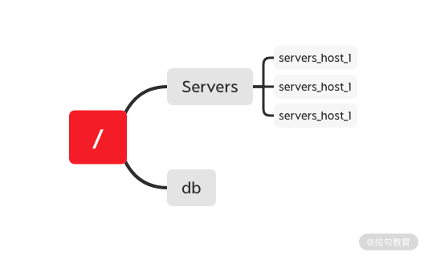
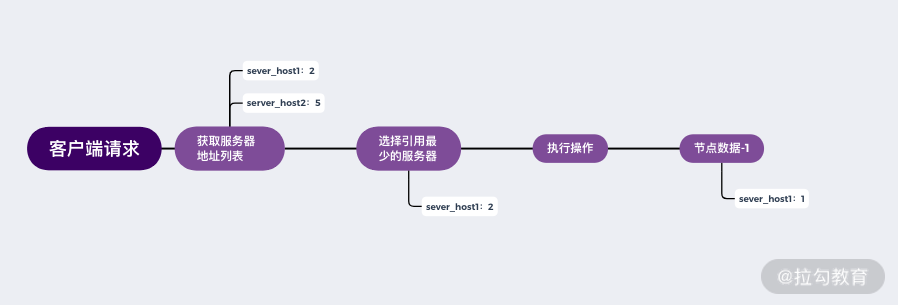

# 23 使用 ZooKeeper 实现负载均衡服务器功能

今天我们利用 ZooKeeper 的相关知识，学习如何解决分布式环境下常见的业务场景与需求。这个课时主要通过 ZooKeeper 的相关特性，实现一个负载均衡服务器。在分布式架构和集群服务器架构下，负载均衡可以提高网络的性能和可靠性。

### 什么是负载均衡

负载均衡可以理解为运行在网络中的服务器或软件，其主要作用是 **扩展网络服务器的带宽、提高服务器处理数据的吞吐量，提高网络的可用性** 。比如我们经常用到的网络服务器、邮件服务器以及很多商业系统的服务器，都采用负载均衡的方式来协调工作。

这些系统一般会采用集群的方式进行部署，由于这些服务器彼此所处的网络环境各不相同，在某一段时间内所接收并处理的数据有多有少，如果整个集群没有一个专门进行管理和协调的角色，随着网络请求越来越多，就会出现某一台服务器比较忙，而网络中其他服务器没有什么任务要处理的情况。

负载均衡通过监控网络中各个服务器的运行情况，对整个集群的计算资源进行合理地分配和调整，避免由于请求处理的无序性导致的短板，从而限制整个集群性能。

了解了负载均衡服务器在集群服务中的作用后，接下来再来介绍一下实现负载均衡的常用算法。

### 负载均衡算法

在我们平时的工作和面试中，也常被问及一些负载均衡的算法问题。常用的有轮询法、随机法、原地址哈希法、加权轮询法、加权随机法、最小连接数法，下面我来分别为你进行讲解。

#### 轮询法

轮询法是最为简单的负载均衡算法，当接收到来自网络中的客户端请求后，负载均衡服务器会按顺序逐个分配给后端服务。比如集群中有 3 台服务器，分别是 server1、server2、server3，轮询法会按照 sever1、server2、server3 这个顺序依次分发会话请求给每个服务器。当第一次轮询结束后，会重新开始下一轮的循环。

#### 随机法

随机算法是指负载均衡服务器在接收到来自客户端的请求后，会根据一定的随机算法选中后台集群中的一台服务器来处理这次会话请求。不过，当集群中备选机器变的越来越多时，通过统计学我们可以知道每台机器被抽中的概率基本相等，因此随机算法的实际效果越来越趋近轮询算法。

#### 原地址哈希法

原地址哈希算法的核心思想是根据客户端的 IP 地址进行哈希计算，用计算结果进行取模后，根据最终结果选择服务器地址列表中的一台机器，处理该条会话请求。采用这种算法后，当同一 IP 的客户端再次访问服务端后，负载均衡服务器最终选举的还是上次处理该台机器会话请求的服务器， **也就是每次都会分配同一台服务器给客户端** 。

#### 加权轮询法

在实际的生成环境中，一个分布式或集群系统中的机器可能部署在不同的网络环境中，每台机器的配置性能也有优劣之分。因此，它们处理和响应客户端请求的能力也各不相同。采用上面几种负载均衡算法，都不太合适，这会造成能力强的服务器在处理完业务后过早进入限制状态，而性能差或网络环境不好的服务器，一直忙于处理请求，造成任务积压。

为了解决这个问题，我们可以采用加权轮询法，加权轮询的方式与轮询算法的方式很相似，唯一的不同在于选择机器的时候，不只是单纯按照顺序的方式选择， **还根据机器的配置和性能高低有所侧重** ，配置性能好的机器往往首先分配。

#### 加权随机法

加权随机法和我们上面提到的随机算法一样，在采用随机算法选举服务器的时候，会考虑系统性能作为权值条件。

#### 最小连接数法

最小连接数算法是指，根据后台处理客户端的连接会话条数，计算应该把新会话分配给哪一台服务器。一般认为，连接数越少的机器，在网络带宽和计算性能上都有很大优势，会作为最优先分配的对象。

### 利用 ZooKeeper 实现

介绍完负载均衡的常用算法后，接下来我们利用 ZooKeeper 来实现一个分布式系统下的负载均衡服务器。从上面介绍的几种负载均衡算法中不难看出。一个负载均衡服务器的底层实现， **关键在于找到网络集群中最适合处理该条会话请求的机器，并将该条会话请求分配给该台机器** 。因此探测和发现后台服务器的运行状态变得最为关键。

#### 状态收集

首先我们来实现网络中服务器运行状态的收集功能，利用 ZooKeeper 中的临时节点作为标记网络中服务器的状态点位。在网络中服务器上线运行的时候，通过在 ZooKeeper 服务器中创建临时节点，向 ZooKeeper 的服务列表进行注册，表示本台服务器已经上线可以正常工作。通过删除临时节点或者在与 ZooKeeper 服务器断开连接后，删除该临时节点。

最后，通过统计临时节点的数量，来了解网络中服务器的运行情况。 **如下图所示，建立的 ZooKeeper 数据模型中 Severs 节点可以作为存储服务器列表的父节点** 。用于之后通过负载均衡算法在该列表中选择服务器。在它下面创建 servers_host1、servers_host2、servers_host3等临时节点来存储集群中的服务器运行状态信息。



在代码层面的实现中，我们首先定义一个 BlanceSever 接口类。该类规定在 ZooKeeper 服务器启动后，向服务器地址列表中，注册或注销信息以及根据接收到的会话请求，动态更新负载均衡情况等功能。如下面的代码所示：

```
public class BlanceSever{


  public void register()


  public void unregister()


  public void addBlanceCount()


  public void takeBlanceCount()


  


}

```

之后我们创建 BlanceSever 接口的实现类 BlanceSeverImpl，在 BlanceSeverImpl 类中首先定义服务器运行的 Session 超时时间、会话连接超时时间、ZooKeeper 客户端地址、服务器地址列表节点 ‘/Severs’ 等基本参数。并通过构造函数，在类被引用时进行初始化 ZooKeeper 客户端对象实例。

```
public class BlanceSeverImpl implements BlanceSever{


  private static final Integer SESSION_TIME_OUT


  private static final Integer CONNECTION_TIME_OUT


  private final ZkClient zkclient


  private static final SERVER_PATH="/Severs"


  public BlanceSeverImpl(){


    init...


  }


  


}

```

接下来，在定义当服务器启动时，向服务器地址列表注册信息的 register 函数。在函数的内部，通过在 SERVER_PATH 路径下创建临时子节点的方式来注册服务器信息。如下面的代码所示，首先获取服务器的 ip 地址，利用 ip 地址作为临时节点的 path 来创建临时节点。

```
public register() throws Exception{


  InetAddress address = InetAddress.getLocalHost();


  String serverIp=address.getHostAddress()


  zkclient.createEphemeral(SERVER_PATH+serverIp)


}

```

register 函数在服务器启动并注册服务器信息后，我们再来定义 unregister 方法，该方法是当服务器关机或由于其他原因不再对外提供服务时，通过调用 unregister 方法，注销该台服务器在服务器列表中的信息。

注销后的机器不会被负载均衡服务器分发处理会话。如下面的代码所示，在 unregister 函数的内部，我们主要通过删除 SERVER_PATH 路径下临时节点的方式注销服务器。

```
public unregister() throws Exception{


  zkclient.delete(SERVER_PATH+serverIp)


}

```

#### 负载算法

实现服务器列表后，接下来我们就进入负载均衡最核心的内容：如何选择服务器。这里我们通过采用“最小连接数”算法，来确定究竟如何均衡地分配网络会话请求给后台客户端。

整个实现的过程如下图所示。首先，在接收到客户端的请求后，通过 getData 方法获取服务端 Severs 节点下的服务器列表，其中每个节点信息都存储有当前服务器的连接数。通过判断选择最少的连接数作为当前会话的处理服务器，并通过 setData 方法将该节点连接数加 1。最后，当客户端执行完毕，再调用 setData 方法将该节点信息减 1。



首先，我们定义当服务器接收到会话请求后。在 ZooKeeper 服务端增加连接数的 addBlance 方法。如下面的代码所示，首先我们通过 readData 方法获取服务器最新的连接数，之后将该连接数加 1，再通过 writeData 方法将新的连接数信息写入到服务端对应节点信息中。

```
public void addBlance() throws Exception{


  InetAddress address = InetAddress.getLocalHost();


  String serverIp=address.getHostAddress()


  Integer con_count=zkClient.readData(SERVER_PATH+serverIp)


  ++con_count


  zkClient.writeData(SERVER_PATH+serverIp,con_count)


}

```

当服务器处理完该会话请求后，需要更新服务端相关节点的连接数。具体的操作与 addBlance 方法基本一样，只是对获取的连接信息进行减一操作，这里不再赘述。

### 结束

本课时我们介绍了如何利用 ZooKeeper 实现一个负载均衡服务器，了解了随机、轮询、哈希等常用的负载均衡算法，并在本课的结尾利用 ZooKeeper 来创建一个负载均衡服务器的具体实现过程。

这里请你注意：我们日常用到的负载均衡器主要是选择后台处理的服务器，并给其分发请求。而通过 ZooKeeper 实现的服务器，只提供了服务器的筛选工作。在请求分发的过程中，还是通过负载算法计算出要访问的服务器，之后客户端自己连接该服务器，完成请求操作。
