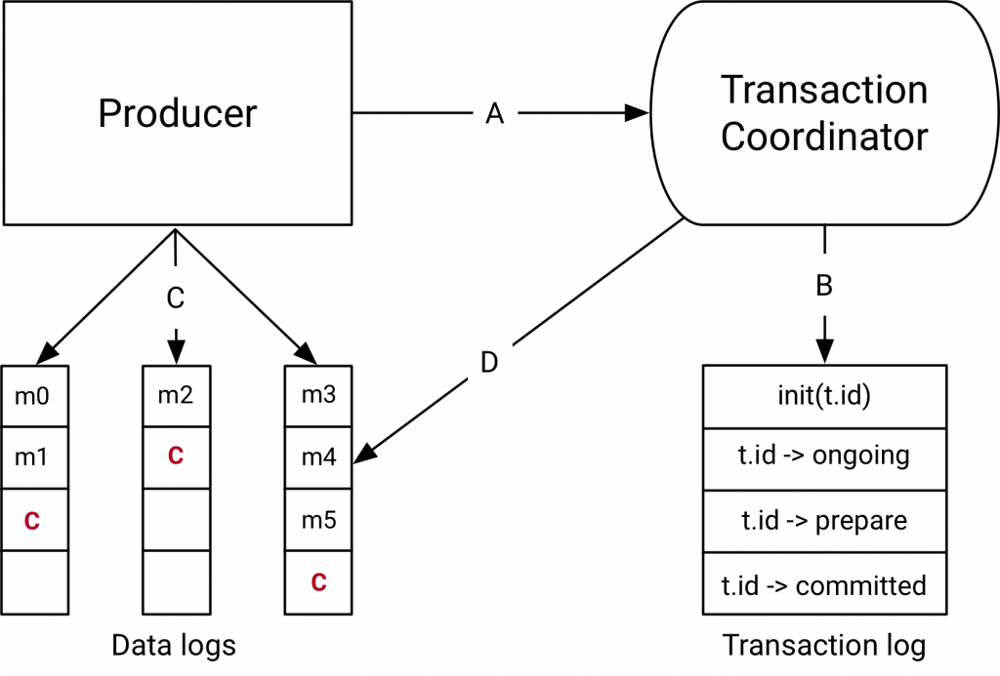
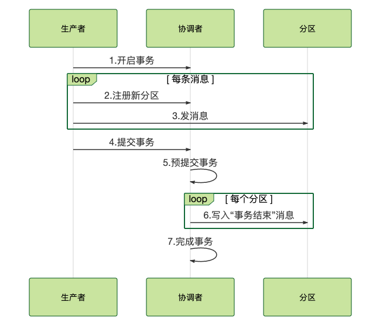

25 RocketMQ与Kafka中如何实现事务？
=========================

你好，我是李玥。

在之前《\[04 | 如何利用事务消息实现分布式事务？\]》这节课中，我通过一个小例子来和大家讲解了如何来使用事务消息。在这节课的评论区，很多同学都提出来，非常想了解一下事务消息到底是怎么实现的。不仅要会使用，还要掌握实现原理，这种学习态度，一直是我们非常提倡的，这节课，我们就一起来学习一下，在 RocketMQ 和 Kafka 中，事务消息分别是如何来实现的？

RocketMQ 的事务是如何实现的？
-------------------

首先我们来看 RocketMQ 的事务。我在之前的课程中，已经给大家讲解过 RocketMQ 事务的大致流程，这里我们再一起通过代码，重温一下这个流程。

```
public class CreateOrderService {

 

  @Inject

  private OrderDao orderDao; // 注入订单表的 DAO

  @Inject

  private ExecutorService executorService; // 注入一个 ExecutorService

 

  private TransactionMQProducer producer;

 

  // 初始化 transactionListener 和 producer

  @Init

  public void init() throws MQClientException {

    TransactionListener transactionListener = createTransactionListener();

    producer = new TransactionMQProducer("myGroup");

    producer.setExecutorService(executorService);

    producer.setTransactionListener(transactionListener);

    producer.start();

  }

 

  // 创建订单服务的请求入口

  @PUT

  @RequestMapping(...)

  public boolean createOrder(@RequestBody CreateOrderRequest request) {

    // 根据创建订单请求创建一条消息

    Message msg = createMessage(request);

    // 发送事务消息

    SendResult sendResult = producer.sendMessageInTransaction(msg, request);

    // 返回：事务是否成功

    return sendResult.getSendStatus() == SendStatus.SEND_OK;

  }

 

  private TransactionListener createTransactionListener() {

    return new TransactionListener() {

      @Override

      public LocalTransactionState executeLocalTransaction(Message msg, Object arg) {

        CreateOrderRequest request = (CreateOrderRequest ) arg;

        try {

          // 执行本地事务创建订单

          orderDao.createOrderInDB(request);

          // 如果没抛异常说明执行成功，提交事务消息

          return LocalTransactionState.COMMIT_MESSAGE;

        } catch (Throwable t) {

          // 失败则直接回滚事务消息

          return LocalTransactionState.ROLLBACK_MESSAGE;

        }

      }

      // 反查本地事务

      @Override

      public LocalTransactionState checkLocalTransaction(MessageExt msg) {、

        // 从消息中获得订单 ID

        String orderId = msg.getUserProperty("orderId");

 

        // 去数据库中查询订单号是否存在，如果存在则提交事务；

        // 如果不存在，可能是本地事务失败了，也可能是本地事务还在执行，所以返回 UNKNOW

        //（PS：这里 RocketMQ 有个拼写错误：UNKNOW）

        return orderDao.isOrderIdExistsInDB(orderId)?

                LocalTransactionState.COMMIT_MESSAGE: LocalTransactionState.UNKNOW;

      }

    };

  }

 

    //....

}

```

在这个流程中，我们提供一个创建订单的服务，功能就是在数据库中插入一条订单记录，并发送一条创建订单的消息，要求写数据库和发消息这两个操作在一个事务内执行，要么都成功，要么都失败。在这段代码中，我们首先在 init() 方法中初始化了 transactionListener 和发生 RocketMQ 事务消息的变量 producer。真正提供创建订单服务的方法是 createOrder()，在这个方法里面，我们根据请求的参数创建一条消息，然后调用 RocketMQ producer 发送事务消息，并返回事务执行结果。

之后的 createTransactionListener() 方法是在 init() 方法中调用的，这里面直接构造一个匿名类，来实现 RocketMQ 的 TransactionListener 接口，这个接口需要实现两个方法：

* executeLocalTransaction：执行本地事务，在这里我们直接把订单数据插入到数据库中，并返回本地事务的执行结果。
* checkLocalTransaction：反查本地事务，在这里我们的处理是，在数据库中查询订单号是否存在，如果存在则提交事务，如果不存在，可能是本地事务失败了，也可能是本地事务还在执行，所以返回 UNKNOW。

这样，就使用 RocketMQ 的事务消息功能实现了一个创建订单的分布式事务。接下来我们一起通过 RocketMQ 的源代码来看一下，它的事务消息是如何实现的。

首先看一下在 producer 中，是如何来发送事务消息的：

```
public TransactionSendResult sendMessageInTransaction(final Message msg,

                                                      final LocalTransactionExecuter localTransactionExecuter, final Object arg)

    throws MQClientException {

    TransactionListener transactionListener = getCheckListener();

    if (null == localTransactionExecuter && null == transactionListener) {

        throw new MQClientException("tranExecutor is null", null);

    }

    Validators.checkMessage(msg, this.defaultMQProducer);

 

    SendResult sendResult = null;

 

    // 这里给消息添加了属性，标明这是一个事务消息，也就是半消息

    MessageAccessor.putProperty(msg, MessageConst.PROPERTY_TRANSACTION_PREPARED, "true");

    MessageAccessor.putProperty(msg, MessageConst.PROPERTY_PRODUCER_GROUP, this.defaultMQProducer.getProducerGroup());

 

    // 调用发送普通消息的方法，发送这条半消息

    try {

        sendResult = this.send(msg);

    } catch (Exception e) {

        throw new MQClientException("send message Exception", e);

    }

 

    LocalTransactionState localTransactionState = LocalTransactionState.UNKNOW;

    Throwable localException = null;

    switch (sendResult.getSendStatus()) {

        case SEND_OK: {

            try {

                if (sendResult.getTransactionId() != null) {

                    msg.putUserProperty("__transactionId__", sendResult.getTransactionId());

                }

                String transactionId = msg.getProperty(MessageConst.PROPERTY_UNIQ_CLIENT_MESSAGE_ID_KEYIDX);

                if (null != transactionId && !"".equals(transactionId)) {

                    msg.setTransactionId(transactionId);

                }

 

                // 执行本地事务

                if (null != localTransactionExecuter) {

                    localTransactionState = localTransactionExecuter.executeLocalTransactionBranch(msg, arg);

                } else if (transactionListener != null) {

                    log.debug("Used new transaction API");

                    localTransactionState = transactionListener.executeLocalTransaction(msg, arg);

                }

                if (null == localTransactionState) {

                    localTransactionState = LocalTransactionState.UNKNOW;

                }

 

                if (localTransactionState != LocalTransactionState.COMMIT_MESSAGE) {

                    log.info("executeLocalTransactionBranch return {}", localTransactionState);

                    log.info(msg.toString());

                }

            } catch (Throwable e) {

                log.info("executeLocalTransactionBranch exception", e);

                log.info(msg.toString());

                localException = e;

            }

        }

        break;

        case FLUSH_DISK_TIMEOUT:

        case FLUSH_SLAVE_TIMEOUT:

        case SLAVE_NOT_AVAILABLE:

            localTransactionState = LocalTransactionState.ROLLBACK_MESSAGE;

            break;

        default:

            break;

    }

 

    // 根据事务消息和本地事务的执行结果 localTransactionState，决定提交或回滚事务消息

    // 这里给 Broker 发送提交或回滚事务的 RPC 请求。

    try {

        this.endTransaction(sendResult, localTransactionState, localException);

    } catch (Exception e) {

        log.warn("local transaction execute " + localTransactionState + ", but end broker transaction failed", e);

    }

 

    TransactionSendResult transactionSendResult = new TransactionSendResult();

    transactionSendResult.setSendStatus(sendResult.getSendStatus());

    transactionSendResult.setMessageQueue(sendResult.getMessageQueue());

    transactionSendResult.setMsgId(sendResult.getMsgId());

    transactionSendResult.setQueueOffset(sendResult.getQueueOffset());

    transactionSendResult.setTransactionId(sendResult.getTransactionId());

    transactionSendResult.setLocalTransactionState(localTransactionState);

    return transactionSendResult;

}

```

这段代码的实现逻辑是这样的：首先给待发送消息添加了一个属性 PROPERTY\_TRANSACTION\_PREPARED，标明这是一个事务消息，也就是半消息，然后会像发送普通消息一样去把这条消息发送到 Broker 上。如果发送成功了，就开始调用我们之前提供的接口 TransactionListener 的实现类中，执行本地事务的方法 executeLocalTransaction() 来执行本地事务，在我们的例子中就是在数据库中插入一条订单记录。

最后，根据半消息发送的结果和本地事务执行的结果，来决定提交或者回滚事务。在实现方法 endTransaction() 中，producer 就是给 Broker 发送了一个单向的 RPC 请求，告知 Broker 完成事务的提交或者回滚。由于有事务反查的机制来兜底，这个 RPC 请求即使失败或者丢失，也都不会影响事务最终的结果。最后构建事务消息的发送结果，并返回。

以上，就是 RocketMQ 在 Producer 这一端事务消息的实现，然后我们再看一下 Broker 这一端，它是怎么来处理事务消息和进行事务反查的。

Broker 在处理 Producer 发送消息的请求时，会根据消息中的属性判断一下，这条消息是普通消息还是半消息：

```
// ...

if (traFlag != null && Boolean.parseBoolean(traFlag)) {

    // ...

    putMessageResult = this.brokerController.getTransactionalMessageService().prepareMessage(msgInner);

} else {

    putMessageResult = this.brokerController.getMessageStore().putMessage(msgInner);

}

// ...

```

这段代码在 org.apache.rocketmq.broker.processor.SendMessageProcessor#sendMessage 方法中，然后我们跟进去看看真正处理半消息的业务逻辑，这段处理逻辑在类 org.apache.rocketmq.broker.transaction.queue.TransactionalMessageBridge 中：

```
public PutMessageResult putHalfMessage(MessageExtBrokerInner messageInner) {

    return store.putMessage(parseHalfMessageInner(messageInner));

}

 

private MessageExtBrokerInner parseHalfMessageInner(MessageExtBrokerInner msgInner) {

 

    // 记录消息的主题和队列，到新的属性中

    MessageAccessor.putProperty(msgInner, MessageConst.PROPERTY_REAL_TOPIC, msgInner.getTopic());

    MessageAccessor.putProperty(msgInner, MessageConst.PROPERTY_REAL_QUEUE_ID,

        String.valueOf(msgInner.getQueueId()));

    msgInner.setSysFlag(

        MessageSysFlag.resetTransactionValue(msgInner.getSysFlag(), MessageSysFlag.TRANSACTION_NOT_TYPE));

    // 替换消息的主题和队列为：RMQ_SYS_TRANS_HALF_TOPIC，0

    msgInner.setTopic(TransactionalMessageUtil.buildHalfTopic());

    msgInner.setQueueId(0);

    msgInner.setPropertiesString(MessageDecoder.messageProperties2String(msgInner.getProperties()));

    return msgInner;

}

```

我们可以看到，在这段代码中，RocketMQ 并没有把半消息保存到消息中客户端指定的那个队列中，而是记录了原始的主题队列后，把这个半消息保存在了一个特殊的内部主题 RMQ\_SYS\_TRANS\_HALF\_TOPIC 中，使用的队列号固定为 0。这个主题和队列对消费者是不可见的，所以里面的消息永远不会被消费。这样，就保证了在事务提交成功之前，这个半消息对消费者来说是消费不到的。

然后我们再看一下，RocketMQ 是如何进行事务反查的：在 Broker 的 TransactionalMessageCheckService 服务中启动了一个定时器，定时从半消息队列中读出所有待反查的半消息，针对每个需要反查的半消息，Broker 会给对应的 Producer 发一个要求执行事务状态反查的 RPC 请求，这部分的逻辑在方法 org.apache.rocketmq.broker.transaction.AbstractTransactionalMessageCheckListener#sendCheckMessage 中，根据 RPC 返回响应中的反查结果，来决定这个半消息是需要提交还是回滚，或者后续继续来反查。

最后，提交或者回滚事务实现的逻辑是差不多的，首先把半消息标记为已处理，如果是提交事务，那就把半消息从半消息队列中复制到这个消息真正的主题和队列中去，如果要回滚事务，这一步什么都不需要做，最后结束这个事务。这部分逻辑的实现在 org.apache.rocketmq.broker.processor.EndTransactionProcessor 这个类中。

Kafka 的事务和 Exactly Once 可以解决什么问题？
---------------------------------

接下来我们再说一下 Kafka 的事务。之前我们讲事务的时候说过，Kafka 的事务解决的问题和 RocketMQ 是不太一样的。RocketMQ 中的事务，它解决的问题是，确保执行本地事务和发消息这两个操作，要么都成功，要么都失败。并且，RocketMQ 增加了一个事务反查的机制，来尽量提高事务执行的成功率和数据一致性。

而 Kafka 中的事务，它解决的问题是，确保在一个事务中发送的多条消息，要么都成功，要么都失败。注意，这里面的多条消息不一定要在同一个主题和分区中，可以是发往多个主题和分区的消息。当然，你可以在 Kafka 的事务执行过程中，加入本地事务，来实现和 RocketMQ 中事务类似的效果，但是 Kafka 是没有事务反查机制的。

Kafka 的这种事务机制，单独来使用的场景不多。更多的情况下被用来配合 Kafka 的幂等机制来实现 Kafka 的 Exactly Once 语义。我在之前的课程中也强调过，这里面的 Exactly Once，和我们通常理解的消息队列的服务水平中的 Exactly Once 是不一样的。

我们通常理解消息队列的服务水平中的 Exactly Once，它指的是，消息从生产者发送到 Broker，然后消费者再从 Broker 拉取消息，然后进行消费。这个过程中，确保每一条消息恰好传输一次，不重不丢。我们之前说过，包括 Kafka 在内的几个常见的开源消息队列，都只能做到 At Least Once，也就是至少一次，保证消息不丢，但有可能会重复。做不到 Exactly Once。


那 Kafka 中的 Exactly Once 又是解决的什么问题呢？它解决的是，在流计算中，用 Kafka 作为数据源，并且将计算结果保存到 Kafka 这种场景下，数据从 Kafka 的某个主题中消费，在计算集群中计算，再把计算结果保存在 Kafka 的其他主题中。这样的过程中，保证每条消息都被恰好计算一次，确保计算结果正确。


举个例子，比如，我们把所有订单消息保存在一个 Kafka 的主题 Order 中，在 Flink 集群中运行一个计算任务，统计每分钟的订单收入，然后把结果保存在另一个 Kafka 的主题 Income 里面。要保证计算结果准确，就要确保，无论是 Kafka 集群还是 Flink 集群中任何节点发生故障，每条消息都只能被计算一次，不能重复计算，否则计算结果就错了。这里面有一个很重要的限制条件，就是数据必须来自 Kafka 并且计算结果都必须保存到 Kafka 中，才可以享受到 Kafka 的 Excactly Once 机制。

可以看到，Kafka 的 Exactly Once 机制，是为了解决在“读数据 - 计算 - 保存结果”这样的计算过程中数据不重不丢，而不是我们通常理解的使用消息队列进行消息生产消费过程中的 Exactly Once。

Kafka 的事务是如何实现的？
----------------

那 Kafka 的事务又是怎么实现的呢？它的实现原理和 RocketMQ 的事务是差不多的，都是基于两阶段提交来实现的，但是实现的过程更加复杂。

首先说一下，参与 Kafka 事务的几个角色，或者说是模块。为了解决分布式事务问题，Kafka 引入了事务协调者这个角色，负责在服务端协调整个事务。这个协调者并不是一个独立的进程，而是 Broker 进程的一部分，协调者和分区一样通过选举来保证自身的可用性。

和 RocketMQ 类似，Kafka 集群中也有一个特殊的用于记录事务日志的主题，这个事务日志主题的实现和普通的主题是一样的，里面记录的数据就是类似于“开启事务”“提交事务”这样的事务日志。日志主题同样也包含了很多的分区。在 Kafka 集群中，可以存在多个协调者，每个协调者负责管理和使用事务日志中的几个分区。这样设计，其实就是为了能并行执行多个事务，提升性能。

 （图片来源：[Kafka 官方](https://www.confluent.io/blog/transactions-apache-kafka/)）

下面说一下 Kafka 事务的实现流程。

首先，当我们开启事务的时候，生产者会给协调者发一个请求来开启事务，协调者在事务日志中记录下事务 ID。

然后，生产者在发送消息之前，还要给协调者发送请求，告知发送的消息属于哪个主题和分区，这个信息也会被协调者记录在事务日志中。接下来，生产者就可以像发送普通消息一样来发送事务消息，这里和 RocketMQ 不同的是，RocketMQ 选择把未提交的事务消息保存在特殊的队列中，而 Kafka 在处理未提交的事务消息时，和普通消息是一样的，直接发给 Broker，保存在这些消息对应的分区中，Kafka 会在客户端的消费者中，暂时过滤未提交的事务消息。

消息发送完成后，生产者给协调者发送提交或回滚事务的请求，由协调者来开始两阶段提交，完成事务。第一阶段，协调者把事务的状态设置为“预提交”，并写入事务日志。到这里，实际上事务已经成功了，无论接下来发生什么情况，事务最终都会被提交。

之后便开始第二阶段，协调者在事务相关的所有分区中，都会写一条“事务结束”的特殊消息，当 Kafka 的消费者，也就是客户端，读到这个事务结束的特殊消息之后，它就可以把之前暂时过滤的那些未提交的事务消息，放行给业务代码进行消费了。最后，协调者记录最后一条事务日志，标识这个事务已经结束了。

我把整个事务的实现流程，绘制成一个简单的时序图放在这里，便于你理解。



总结一下 Kafka 这个两阶段的流程，准备阶段，生产者发消息给协调者开启事务，然后消息发送到每个分区上。提交阶段，生产者发消息给协调者提交事务，协调者给每个分区发一条“事务结束”的消息，完成分布式事务提交。

小结
--

这节课我分别讲解了 Kafka 和 RocketMQ 是如何来实现事务的。你可以看到，它们在实现事务过程中的一些共同的地方，它们都是基于两阶段提交来实现的事务，都利用了特殊的主题中的队列和分区来记录事务日志。

不同之处在于对处于事务中的消息的处理方式，RocketMQ 是把这些消息暂存在一个特殊的队列中，待事务提交后再移动到业务队列中；而 Kafka 直接把消息放到对应的业务分区中，配合客户端过滤来暂时屏蔽进行中的事务消息。

同时你需要了解，RocketMQ 和 Kafka 的事务，它们的适用场景是不一样的，RocketMQ 的事务适用于解决本地事务和发消息的数据一致性问题，而 Kafka 的事务则是用于实现它的 Exactly Once 机制，应用于实时计算的场景中。
