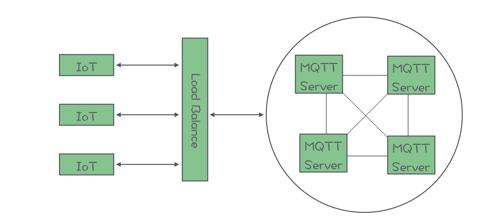

26 MQTT协议：如何支持海量的在线IoT设备
========================

你好，我是李玥。

IoT，也就是物联网，一直是最近几年技术圈非常火的一个概念，并且，随着 5G 大规模商用，IoT 还将持续火下去。

那到底什么是物联网呢？物联网这个词儿，它的含义还不那么直观，但你看它的英文：IoT，也就是 Internet of Things 的缩写，Things 这个单词，我们知道，它在英语里面几乎可以指代一切。翻译成中文，我个人觉得，“东西”这个词儿比较贴切。那物联网，就可以理解为把所有东西都用互联网给连接起来。

这里面不仅仅包括像电脑、手机这样的智能设备，还包括一些已经智能化的传统设备，比如汽车、冰箱、路边的摄像头等等，将来还将包括更多的、各种各样的物品：比如水杯、衣服、工业用的各种设备和工具等等，也就是所谓的万物互联。所以，IoT 它的未来绝对是大有可期的。

那这些物联网设备，它要实现互相通信，也必须有一套标准的通信协议，MQTT 就是专门为物联网设备设计的一套标准的消息队列通信协议。使用 MQTT 协议的 IoT 设备，可以连接到任何支持 MQTT 协议的消息队列上，进行通信。

这节课，我们就一起来聊一聊 MQTT 协议，以及如何把 MQTT 应用到生产系统中去。

MQTT 和其他消息队列的传输协议有什么不同？
-----------------------

从宏观上来说，MQTT 和其他消息队列采用的传输协议是差不多的。它采用的也是“发布 - 订阅”的消息模型。网络结构上，也是 C/S 架构，IoT 设备是客户端，Broker 是服务端，客户端与 Broker 通信进行收发消息。

虽然 MQTT 和普通的消息队列相比，在消息模型、功能和网络结构上都是差不多的，但由于他们面对的使用场景是不一样的，所以，MQTT 和普通的消息队列相比，还是有很多区别的。我们看一下 MQTT 的使用场景有什么样的特点？

首先，它的客户端都是运行在 IoT 设备上。IoT 设备它有什么特点？最大的特点就是便宜，一个水杯才卖几十块钱，它上面的智能模块的成本十块钱最多了，再贵就卖不出去了。十块钱的智能设备内存都是按照 KB 来计算的，可能都没有 CPU，也不一定有操作系统，整个设备就一个 SoC。这样的设备就需要通信协议不能太复杂，功能不能太多。另外，IoT 设备一般都采用无线连接，很多设备都是经常移动的，这就导致，IoT 设备的网络连接不稳定，并且这种不稳定的网络是一个常态。

MQTT 协议在设计上，充分考虑了上面的这些特点。在协议的报文设计上极其的精简，可以说是惜字如金。协议的功能也非常简单，基本上就只有发布订阅主题和收发消息这两个最核心的功能。另外，为了应对网络连接不稳定的问题，MQTT 增加了心跳和会话的机制。加入心跳机制可以让客户端和服务端双方都能随时掌握当前连接状态，一旦发现连接中断，可以尽快地重连。MQTT 还加入了会话的机制，在服务端来保存会话状态，客户端重连之后就可以恢复之前的会话，继续来收发消息。这样，把复杂度转移到了服务端，客户端的实现就会更简单。

MQTT 面临的使用场景中，另外一个很重要的特点就是，服务端需要支撑海量的 IoT 设备同时在线。对于普通的消息队列集群，服务的客户端都运行在性能强大的服务器上，所以客户端的数量不会特别多。比如京东的 JMQ 集群，日常在线的客户端数量大概是十万左右这样的规模，就足够支撑全国人民在京东上买买买。这个规模已经是这个地球上少有的，几个超大规模的消息队列集群之一了。

而 MQTT 的使用场景中，需要支撑的客户端数量，远不止几万几十万。比如，北京交通委如果要把全市的车辆都接入进来，这是就一个几百万客户端的规模。路边随处可见的摄像头，每家每户都有的电视、冰箱，每个人随身携带的各种穿戴设备，这些设备的规模都是百万、千万级甚至是上亿的级别。

另外，MQTT 它是不支持点对点通信的，一般的做法都是，每个客户端都创建一个以自己 ID 为名字的主题，然后客户端来订阅自己的专属主题，用于接收专门发给这个客户端的消息。这就意味着，在 MQTT 的集群中，主题的数量是和客户端的数量基本是同一个量级的。

如何选择 MQTT 产品？
-------------

如何能支持海量在线的 IoT 设备和海量的主题，是每一个支持 MQTT 协议的消息队列面临的最大挑战。也是你在做 MQTT 服务端技术选型时，需要重点考察的技术点。

目前开源的 MQTT 产品中，有些是传统的消息队列，通过官方或者非官方的扩展，实现了 MQTT 协议的支持。也有一些专门的 MQTT Server 产品，这些 MQTT Server 在协议支持层面，大多数是没有问题的，性能和稳定性方面也都可以满足要求。但是，我还没有发现能很好支撑海量客户端和主题的开源产品。为什么呢？

传统的消息队列，虽然它可以通过扩展来支持 MQTT 协议，但是它的整体架构在设计之初，并没有考虑能支撑海量客户端和主题。比如，之前我们讲过，RocketMQ 它的元数据是保存在 NameServer 的内存中，Kafka 是保存在 ZooKeeper 中，这些存储都不擅长保存大量数据，所以也支撑不了太多的客户端和主题。

另外一些开源的 MQTT Server，很多根本就没有集群功能，或者集群功能做的不太完善。集群功能做的好的产品，它们的开发者大多都把集群功能放到企业版中拿去卖钱了。

所以在做 MQTT Server 技术选型的时，如果你接入 IoT 设备数量在十万以内，是可以选择开源产品的，选型的原则和选择普通消息队列是一样的，我在《\[02 | 该如何选择消息队列？\]》这节课中讲过的选型原则都是适用的，优先选择一个流行的、你熟悉的开源产品就可以了。

如果说客户端的规模超过十万的量级，需要支撑这么大规模的客户端数量，服务端只有单个节点肯定是不够的，必须用一个集群来支持，并且这个集群是要能支持水平扩容的，这些都是最基本的要求。这个时候就几乎没什么可供选择的开源产品了。这种情况建议选择一些云平台厂商提供的 MQTT 云服务，价格相对比较低，当然你可以选择价格更高的商业版 MQTT Server。

另外一个选择就是，基于已有的开源 MQTT Server，通过一些集成和开发，来自行构建 MQTT 集群。接下来，我跟你说一下，构建一个支持海量客户端的 MQTT 集群，应该如何来设计。

MQTT 集群如何支持海量在线的 IoT 设备？
------------------------

一般来说，一个 MQTT 集群它的架构应该是这样的：

这个图从左向右看，首先接入的地址最好是一个域名，这样域名的后面可以配置多个 IP 地址做负载均衡，当然这个域名不是必需的。也可以直接连接负载均衡器。负载均衡可以选择像 F5 这种专用的负载均衡硬件，也可以使用 Nginx 这样的软件，只要是四层或者支持 MQTT 协议的七层负载均衡设备，都可以选择。

负载均衡器的后面，需要部署一个 Proxy 集群，这个 Proxy 集群承担了三个重要的作用：第一个作用是来承接海量 IoT 设备的连接，第二个作用是来维护与客户端的会话，第三个作用是作为代理，在客户端和 Broker 之间进行消息转发。

在 Proxy 集群的后面是 Broker 集群，负责保存和收发消息。

有的 MQTT Server 它的集群架构是这样的：

它的架构中没有 Proxy。实际上，它只是把 Proxy 和 Broker 的功能集成到了一个进程中，这两种架构它本质上没有太大的区别。所以这两种架构我们可以认为是同一种架构，一起来分析。

前置 Proxy 的方式很容易解决海量连接的问题，由于 Proxy 是可以水平扩展的，只要用足够多数量的 Proxy 节点，就可以抗住海量客户端同时连接。每个 Proxy 和每个 Broker 只用一个连接通信就可以了，这样对于每个 Broker 来说，它的连接数量最多不会超过 Proxy 节点的数量。

Proxy 对于会话的处理方式，可以借鉴 Tomcat 处理会话的方式。一种方式是，将会话保存在 Proxy 本地，每个 Proxy 节点都只维护连接到自己的这些客户端的会话。但是，这种方式需要配合负载均衡来使用，负载均衡设备需要支持 sticky session，保证将相同会话的连接总是转发到同一个 Proxy 节点上。另一种方式是，将会话保存在一个外置的存储集群中，比如一个 Redis 集群或者 MySQL 集群。这样 Proxy 就可以设计成完全无状态的，对于负载均衡设备也没有特殊的要求。但这种方式要求外置存储集群具备存储千万级数据的能力，同时具有很好的性能。

对于如何支持海量的主题，比较可行的解决方案是，在 Proxy 集群的后端，部署多组 Broker 小集群，比如说，可以是多组 Kafka 小集群，每个小集群只负责存储一部分主题。这样对于每个 Broker 小集群，主题的数量就可以控制在可接受的范围内。由于消息是通过 Proxy 来进行转发的，我们可以在 Proxy 中采用一些像一致性哈希等分片算法，根据主题名称找到对应的 Broker 小集群。这样就解决了支持海量主题的问题。

总结
--

MQTT 是专门为物联网设备设计的一套标准的通信协议。这套协议在消息模型和功能上与普通的消息队列协议是差不多的，最大的区别在于应用场景不同。在物联网应用场景中，IoT 设备性能差，网络连接不稳定。服务端面临的挑战主要是，需要支撑海量的客户端和主题。

已有的开源的 MQTT 产品，对于协议的支持都不错，在客户端数量小于十万级别的情况下，可以选择。对于海量客户端的场景，服务端必须使用集群来支撑，可以选择收费的云服务和企业版产品。也可以选择自行来构建 MQTT 集群。

自行构建集群，最关键的技术点就是，通过前置的 Proxy 集群来解决海量连接、会话管理和海量主题这三个问题。前置 Proxy 负责在 Broker 和客户端之间转发消息，通过这种方式，将海量客户端连接收敛为少量的 Proxy 与 Broker 之间的连接，解决了海量客户端连接数的问题。维护会话的实现原理，和 Tomcat 维护 HTTP 会话是一样的。对于海量主题，可以在后端部署多组 Broker 小集群，每个小集群分担一部分主题这样的方式来解决。
