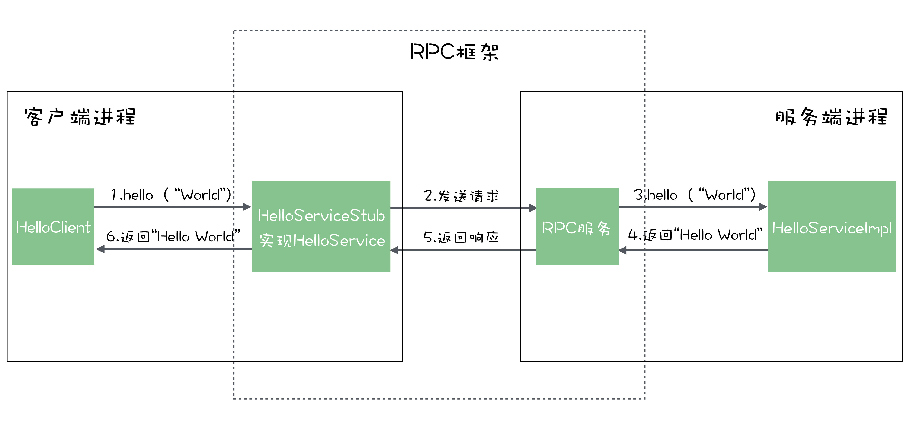

# 31 动手实现一个简单的RPC框架（一）：原理和程序的结构

你好，我是李玥。

接下来的四节课，我们会一起实现一个 RPC 框架。你可能会问，为什么不实现一个消息队列，而要实现一个 RPC 框架呢？原因很简单，我们课程的目的是希望你能够学以致用举一反三，而不只是照猫画虎。在之前的课程中，我们一直在讲解消息队列的原理和实现消息队列的各种技术，那我们在实践篇如果再实现一个消息队列，不过是把之前课程中的内容重复实现一遍，意义不大。

消息队列和 RPC 框架是我们最常用的两种通信方式，虽然这两种中间系统的功能不一样，但是， **实现这两种中间件系统的过程中，有很多相似之处** ，比如，它们都是分布式系统，都需要解决应用间通信的问题，都需要解决序列化的问题等等。

实现 RPC 框架用到的大部分底层技术，是和消息队列一样的，也都是我们在之前的课程中讲过的。所以，我们花四节课的时间来实现一个 RPC 框架，既可以检验你对进阶篇中学习到的底层技术掌握的是不是扎实，又可以学到 RPC 框架的实现原理，买一送一，很超值。

接下来的四节课，我们是这样安排的。本节课，我们先来学习 RPC 框架的实现原理，然后我们一起看一下如何来使用这个 RPC 框架，顺便给出整个项目的总体结构。第二节课中，一起来实现 RPC 框架的通信与序列化部分，最后的两节课，分别来实现客户端与服务端这两部分。

下面我们先来一起了解一下，RPC 框架的实现原理。

首先需要明确一下 RPC 框架的范围。我们这里所说的 RPC 框架，是指类似于 Dubbo、gRPC 这种框架，使用这些框架，应用程序可以“在客户端直接调用服务端方法，就像调用本地方法一样。”而一些基于 REST 的远程调用框架，虽然同样可以实现远程调用，但它对使用者并不透明，无论是服务端还是客户端，都需要和 HTTP 协议打交道，解析和封装 HTTP 请求和响应。这类框架并不能算是“RPC 框架”。

## RPC 框架是怎么调用远程服务的？

所有的 RPC 框架，它们的总体结构和实现原理都是一样的。接下来，我们以最常使用的 Spring 和 Dubbo 配合的微服务体系为例，一起来看一下，RPC 框架到底是如何实现调用远程服务的。

一般来说，我们的客户端和服务端分别是这样的：

```
@Component

public class HelloClient {

 

    @Reference // dubbo 注解

    private HelloService helloService;

 

    public String hello() {

      return helloService.hello("World");

    }

}

 

@Service // dubbo 注解

@Component

public class HelloServiceImpl implements HelloService {

 

    @Override

    public String hello(String name) {

        return "Hello " + name;

    }

}

```

在客户端，我们可以通过 @Reference 注解，获得一个实现了 HelloServicer 这个接口的对象，我们的业务代码只要调用这个对象的方法，就可以获得结果。对于客户端代码来说，调用就是 helloService 这个本地对象，但实际上，真正的服务是在远程的服务端进程中实现的。

再来看服务端，在服务端我们的实现类 HelloServiceImpl，实现了 HelloService 这个接口。然后，我们通过 @Service 这个注解（注意，这个 @Service 是 Dubbo 提供的注解，不是 Spring 提供的同名注解），在 Dubbo 框架中注册了这个实现类 HelloServiceImpl。在服务端，我们只是提供了接口 HelloService 的实现，并没有任何远程调用的实现代码。

对于业务代码来说，无论是客户端还是服务端，除了增加了两个注解以外，和实现一个进程内调用没有任何区别。Dubbo 看起来就像把服务端进程中的实现类“映射”到了客户端进程中一样。接下来我们一起来看一下，Dubbo 这类 RPC 框架是如何来实现调用远程服务的。

注意，Dubbo 的实现原理，或者说是 RPC 框架的实现原理，是各大厂面试中最容易问到的问题之一，所以，接下来的这一段非常重要。

在客户端，业务代码得到的 HelloService 这个接口的实例，并不是我们在服务端提供的真正的实现类 HelloServiceImpl 的一个实例。它实际上是由 RPC 框架提供的一个代理类的实例。这个代理类有一个专属的名称，叫“桩（Stub）”。

在不同的 RPC 框架中，这个桩的生成方式并不一样，有些是在编译阶段生成的，有些是在运行时动态生成的，这个和编程语言的语言特性是密切相关的，所以在不同的编程语言中有不同的实现，这部分很复杂，可以先不用过多关注。我们只需要知道这个桩它做了哪些事儿就可以了。

我们知道，HelloService 的桩，同样要实现 HelloServer 接口，客户端在调用 HelloService 的 hello 方法时，实际上调用的是桩的 hello 方法，在这个桩的 hello 方法里面，它会构造一个请求，这个请求就是一段数据结构，请求中包含两个重要的信息：

1. 请求的服务名，在我们这个例子中，就是 HelloService#hello(String)，也就是说，客户端调用的是 HelloService 的 hello 方法；
1. 请求的所有参数，在我们这个例子中，就只有一个参数 name， 它的值是“World”。

然后，它会把这个请求发送给服务端，等待服务的响应。这个时候，请求到达了服务端，然后我们来看服务端是怎么处理这个请求的。

服务端的 RPC 框架收到这个请求之后，先把请求中的服务名解析出来，然后，根据这个服务名找一下，在服务端进程中，有没有这个服务名对应的服务提供者。

在这个例子的服务端中，由于我们已经通过 @Service 注解向 RPC 框架注册过 HelloService 的实现类，所以，RPC 框架在收到请求后，可以通过请求中的服务名找到 HelloService 真正的实现类 HelloServiceImpl。找到实现类之后，RPC 框架会调用这个实现类的 hello 方法，使用的参数值就是客户端发送过来的参数值。服务端的 RPC 框架在获得返回结果之后，再将结果封装成响应，返回给客户端。

客户端 RPC 框架的桩收到服务端的响应之后，从响应中解析出返回值，返回给客户端的调用方。这样就完成了一次远程调用。我把这个调用过程画成一张图放在下面，你可以对着这张图再消化一下上面的流程。



在上面的这个调用流程中，我们忽略了一个问题，那就是客户端是如何找到服务端地址的呢？在 RPC 框架中， **这部分的实现原理其实和消息队列的实现是完全一样的** ，都是通过一个 NamingService 来解决的。

在 RPC 框架中，这个 NamingService 一般称为注册中心。服务端的业务代码在向 RPC 框架中注册服务之后，RPC 框架就会把这个服务的名称和地址发布到注册中心上。客户端的桩在调用服务端之前，会向注册中心请求服务端的地址，请求的参数就是服务名称，也就是我们上面例子中的方法签名 HelloService#hello，注册中心会返回提供这个服务的地址，然后客户端再去请求服务端。

有些 RPC 框架，比如 gRPC，是可以支持跨语言调用的。它的服务提供方和服务调用方是可以用不同的编程语言来实现的。比如，我们可以用 Python 编写客户端，用 Go 语言来编写服务端，这两种语言开发的服务端和客户端仍然可以正常通信。这种支持跨语言调用的 RPC 框架的实现原理和普通的单语言的 RPC 框架并没有什么本质的不同。

我们可以再回顾一下上面那张调用的流程图，如果需要实现跨语言的调用，也就是说，图中的客户端进程和服务端进程是由两种不同的编程语言开发的。其实，只要客户端发出去的请求能被服务端正确解析，同样，服务端返回的响应，客户端也能正确解析，其他的步骤完全不用做任何改变，不就可以实现跨语言调用了吗？

在客户端和服务端，收发请求响应的工作都是 RPC 框架来实现的，所以，\*\*只要 RPC 框架保证在不同的编程语言中，使用相同的序列化协议，就可以实现跨语言的通信。\*\*另外，为了在不同的语言中能描述相同的服务定义，也就是我们上面例子中的 HelloService 接口，跨语言的 RPC 框架还需要提供一套描述服务的语言，称为 IDL（Interface description language）。所有的服务都需要用 IDL 定义，再由 RPC 框架转换为特定编程语言的接口或者抽象类。这样，就可以实现跨语言调用了。

讲到这里，RPC 框架的基本实现原理就很清楚了，可以看到，实现一个简单的 RPC 框架并不是很难，这里面用到的绝大部分技术，包括：高性能网络传输、序列化和反序列化、服务路由的发现方法等，都是我们在学习消息队列实现原理过程中讲过的知识。

下面我就一起来实现一个“麻雀虽小但五脏俱全”的 RPC 框架。

## RPC 框架的总体结构是什么样的？

虽然我们这个 RPC 框架只是一个原型系统，但它仍然有近 50 个源代码文件，2000 多行源代码。学习这样一个复杂的项目，最好的方式还是先学习它的总体结构，然后再深入到每一部分的实现细节中去，所以我们一起先来看一下这个项目的总体结构。

我们采用 Java 语言来实现这个 RPC 框架。我们把 RPC 框架对外提供的所有服务定义在一个接口 RpcAccessPoint 中：

```
/**

 * RPC 框架对外提供的服务接口

 */

public interface RpcAccessPoint extends Closeable{

    /**

     * 客户端获取远程服务的引用

     * @param uri 远程服务地址

     * @param serviceClass 服务的接口类的 Class

     * @param <T> 服务接口的类型

     * @return 远程服务引用

     */

    <T> T getRemoteService(URI uri, Class<T> serviceClass);

 

    /**

     * 服务端注册服务的实现实例

     * @param service 实现实例

     * @param serviceClass 服务的接口类的 Class

     * @param <T> 服务接口的类型

     * @return 服务地址

     */

    <T> URI addServiceProvider(T service, Class<T> serviceClass);

 

    /**

     * 服务端启动 RPC 框架，监听接口，开始提供远程服务。

     * @return 服务实例，用于程序停止的时候安全关闭服务。

     */

    Closeable startServer() throws Exception;

}

```

这个接口主要的方法就只有两个，第一个方法 getRemoteService 供客户端来使用，这个方法的作用和我们上面例子中 Dubbo 的 @Reference 注解是一样的，客户端调用这个方法可以获得远程服务的实例。第二个方法 addServiceProvider 供服务端来使用，这个方法的作用和 Dubbo 的 @Service 注解是一样的，服务端通过调用这个方法来注册服务的实现。方法 startServer 和 close（在父接口 Closeable 中定义）用于服务端启动和停止服务。

另外，我们还需要定一个注册中心的接口 NameService：

```
/**

 * 注册中心

 */

public interface NameService {

    /**

     * 注册服务

     * @param serviceName 服务名称

     * @param uri 服务地址

     */

    void registerService(String serviceName, URI uri) throws IOException;

 

    /**

     * 查询服务地址

     * @param serviceName 服务名称

     * @return 服务地址

     */

    URI lookupService(String serviceName) throws IOException;

}

```

这个注册中心只有两个方法，分别是注册服务地址 registerService 和查询服务地址 lookupService。

以上，就是我们要实现的这个 RPC 框架的全部功能了。然后，我们通过一个例子看一下这个 RPC 框架如何来使用。同样，需要先定义一个服务接口：

```
public interface HelloService {

    String hello(String name);

}

```

接口定义和本节课开始的例子是一样的。然后我们分别看一下服务端和客户端是如何使用这个 RPC 框架的。

客户端：

```
URI uri = nameService.lookupService(serviceName);

HelloService helloService = rpcAccessPoint.getRemoteService(uri, HelloService.class);

String response = helloService.hello(name);

logger.info(" 收到响应: {}.", response);

```

客户端首先调用注册中心 NameService 的 lookupService 方法，查询服务地址，然后调用 rpcAccessPoint 的 getRemoteService 方法，获得远程服务的本地实例，也就是我们刚刚讲的“桩”helloService。最后，调用 helloService 的 hello 方法，获得返回值并打印出来。

然后来看服务端，首先我们需要有一个 HelloService 的实现：

```
public class HelloServiceImpl implements HelloService {

    @Override

    public String hello(String name) {

        String ret = "Hello, " + name;

        return ret;

    }

}

```

然后，我们将这个实现注册到 RPC 框架上，并启动 RPC 服务：

```
rpcAccessPoint.startServer();

URI uri = rpcAccessPoint.addServiceProvider(helloService, HelloService.class);

nameService.registerService(serviceName, uri);

```

首先启动 RPC 框架的服务，然后调用 rpcAccessPoint.addServiceProvider 方法注册 helloService 服务，然后我们再调用 nameServer.registerService 方法，在注册中心注册服务的地址。

可以看到，我们将要实现的这个 RPC 框架的使用方式，总体上和上面使用 Dubbo 和 Spring 的例子是一样的，唯一的一点区别是，由于我们没有使用 Spring 和注解，所以需要用代码的方式实现同样的功能。

我把这个 RPC 框架的实现代码以及上面如何使用这个 RPC 框架的例子，放在了 GitHub 的[simple-rpc-framework](https://github.com/liyue2008/simple-rpc-framework)项目中。整个项目分为如下 5 个 Module：


其中，RPC 框架提供的服务 RpcAccessPoint 和注册中心服务 NameService，这两个接口的定义在 Module rpc-api 中。使用框架的例子，HelloService 接口定义在 Module hello-service-api 中，例子中的客户端和服务端分别在 client 和 server 这两个 Module 中。

后面的三节课，我们将一起来实现这个 RPC 框架，也就是 Module rpc-netty。

## 小结

从这节课开始，我们要用四节课，利用之前学习的、实现消息队列用到的知识来实现一个 RPC 框架。

我们在实现 RPC 框架之前，需要先掌握 RPC 框架的实现原理。在 RPC 框架中，最关键的就是理解“桩”的实现原理，桩是 RPC 框架在客户端的服务代理，它和远程服务具有相同的方法签名，或者说是实现了相同的接口。客户端在调用 RPC 框架提供的服务时，实际调用的就是“桩”提供的方法，在桩的实现方法中，它会发请求的服务名和参数到服务端，服务端的 RPC 框架收到请求后，解析出服务名和参数后，调用在 RPC 框架中注册的“真正的服务提供者”，然后将结果返回给客户端。
