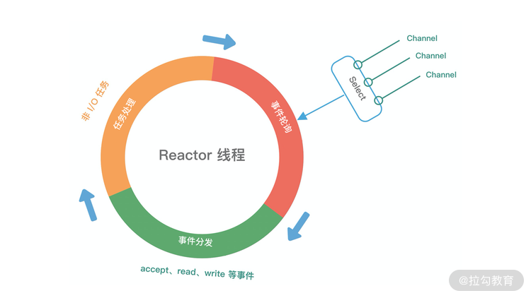
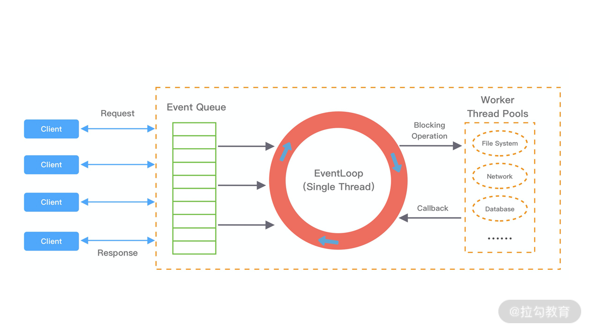

# 04 事件调度层：为什么 EventLoop 是 Netty 的精髓？

你好，我是若地。通过前面课程的学习，我们已经知道 Netty 高性能的奥秘在于其 **Reactor 线程模型。**EventLoop 是 Netty Reactor 线程模型的核心处理引擎，那么它是如何高效地实现事件循环和任务处理机制的呢？本节课我们就一起学习 EventLoop 的实现原理和最佳实践。

### 再谈 Reactor 线程模型

网络框架的设计离不开 I/O 线程模型，线程模型的优劣直接决定了系统的吞吐量、可扩展性、安全性等。目前主流的网络框架几乎都采用了 I/O 多路复用的方案。Reactor 模式作为其中的事件分发器，负责将读写事件分发给对应的读写事件处理者。大名鼎鼎的 Java 并发包作者 Doug Lea，在 _Scalable I/O in Java_ 一文中阐述了服务端开发中 I/O 模型的演进过程。Netty 中**三种 Reactor 线程模型**也来源于这篇经典文章。下面我们对这三种 Reactor 线程模型做一个详细的分析。

#### 单线程模型

 （[摘自 Lea D. Scalable IO in Java](http://gee.cs.oswego.edu/dl/cpjslides/nio.pdf%5D)）

上图描述了 Reactor 的单线程模型结构，在 Reactor 单线程模型中，所有 I/O 操作（包括连接建立、数据读写、事件分发等），都是由一个线程完成的。单线程模型逻辑简单，缺陷也十分明显：

- 一个线程支持处理的连接数非常有限，CPU 很容易打满，性能方面有明显瓶颈；
- 当多个事件被同时触发时，只要有一个事件没有处理完，其他后面的事件就无法执行，这就会造成消息积压及请求超时；
- 线程在处理 I/O 事件时，Select 无法同时处理连接建立、事件分发等操作；
- 如果 I/O 线程一直处于满负荷状态，很可能造成服务端节点不可用。

#### 多线程模型

 （[摘自 Lea D. Scalable IO in Java](http://gee.cs.oswego.edu/dl/cpjslides/nio.pdf%5D)）

由于单线程模型有性能方面的瓶颈，多线程模型作为解决方案就应运而生了。Reactor 多线程模型将业务逻辑交给多个线程进行处理。除此之外，多线程模型其他的操作与单线程模型是类似的，例如读取数据依然保留了串行化的设计。当客户端有数据发送至服务端时，Select 会监听到可读事件，数据读取完毕后提交到业务线程池中并发处理。

#### 主从多线程模型

 （[摘自 Lea D. Scalable IO in Java](http://gee.cs.oswego.edu/dl/cpjslides/nio.pdf%5D)）

主从多线程模型由多个 Reactor 线程组成，每个 Reactor 线程都有独立的 Selector 对象。MainReactor 仅负责处理客户端连接的 Accept 事件，连接建立成功后将新创建的连接对象注册至 SubReactor。再由 SubReactor 分配线程池中的 I/O 线程与其连接绑定，它将负责连接生命周期内所有的 I/O 事件。

Netty 推荐使用主从多线程模型，这样就可以轻松达到成千上万规模的客户端连接。在海量客户端并发请求的场景下，主从多线程模式甚至可以适当增加 SubReactor 线程的数量，从而利用多核能力提升系统的吞吐量。

介绍了上述三种 Reactor 线程模型，再结合它们各自的架构图，我们能大致总结出 Reactor 线程模型运行机制的四个步骤，分别为 **连接注册** 、**事件轮询 **、** 事件分发 **、** 任务处理**，如下图所示。



- 连接注册：Channel 建立后，注册至 Reactor 线程中的 Selector 选择器。
- 事件轮询：轮询 Selector 选择器中已注册的所有 Channel 的 I/O 事件。
- 事件分发：为准备就绪的 I/O 事件分配相应的处理线程。
- 任务处理：Reactor 线程还负责任务队列中的非 I/O 任务，每个 Worker 线程从各自维护的任务队列中取出任务异步执行。

以上介绍了 Reactor 线程模型的演进过程和基本原理，Netty 也同样遵循 Reactor 线程模型的运行机制，下面我们来了解一下 Netty 是如何实现 Reactor 线程模型的。

### Netty EventLoop 实现原理

#### EventLoop 是什么

EventLoop 这个概念其实并不是 Netty 独有的，它是一种 **事件等待和处理的程序模型** ，可以解决多线程资源消耗高的问题。例如 Node.js 就采用了 EventLoop 的运行机制，不仅占用资源低，而且能够支撑了大规模的流量访问。

下图展示了 EventLoop 通用的运行模式。每当事件发生时，应用程序都会将产生的事件放入事件队列当中，然后 EventLoop 会轮询从队列中取出事件执行或者将事件分发给相应的事件监听者执行。事件执行的方式通常分为 **立即执行、延后执行、定期执行** 几种。



### Netty 如何实现 EventLoop

在 Netty 中 EventLoop 可以理解为 Reactor 线程模型的事件处理引擎，每个 EventLoop 线程都维护一个 Selector 选择器和任务队列 taskQueue。它主要负责处理 I/O 事件、普通任务和定时任务。

Netty 中推荐使用 NioEventLoop 作为实现类，那么 Netty 是如何实现 NioEventLoop 的呢？首先我们来看 NioEventLoop 最核心的 run() 方法源码，本节课我们不会对源码做深入的分析，只是先了解 NioEventLoop 的实现结构。

```
protected void run() {
    for (;;) {
        try {
            try {
                switch (selectStrategy.calculateStrategy(selectNowSupplier, hasTasks())) {
                case SelectStrategy.CONTINUE:
                    continue;
                case SelectStrategy.BUSY_WAIT:
                case SelectStrategy.SELECT:
                    select(wakenUp.getAndSet(false)); // 轮询 I/O 事件
                    if (wakenUp.get()) {
                        selector.wakeup();
                    }
                default:
                }
            } catch (IOException e) {
                rebuildSelector0();
                handleLoopException(e);
                continue;
            }
            cancelledKeys = 0;
            needsToSelectAgain = false;
            final int ioRatio = this.ioRatio;
            if (ioRatio == 100) {
                try {
                    processSelectedKeys(); // 处理 I/O 事件
                } finally {
                    runAllTasks(); // 处理所有任务
                }
            } else {
                final long ioStartTime = System.nanoTime();
                try {
                    processSelectedKeys(); // 处理 I/O 事件
                } finally {
                    final long ioTime = System.nanoTime() - ioStartTime;
                    runAllTasks(ioTime * (100 - ioRatio) / ioRatio); // 处理完 I/O 事件，再处理异步任务队列
                }
            }
        } catch (Throwable t) {
            handleLoopException(t);
        }
        try {
            if (isShuttingDown()) {
                closeAll();
                if (confirmShutdown()) {
                    return;
                }
            }
        } catch (Throwable t) {
            handleLoopException(t);
        }
    }
}
```

上述源码的结构比较清晰，NioEventLoop 每次循环的处理流程都包含事件轮询 select、事件处理 processSelectedKeys、任务处理 runAllTasks 几个步骤，是典型的 Reactor 线程模型的运行机制。而且 Netty 提供了一个参数 ioRatio，可以调整 I/O 事件处理和任务处理的时间比例。下面我们将着重从 **事件处理** 和**任务处理**两个核心部分出发，详细介绍 Netty EventLoop 的实现原理。

#### 事件处理机制


结合 Netty 的整体架构，我们一起看下 EventLoop 的事件流转图，以便更好地理解 Netty EventLoop 的设计原理。NioEventLoop 的事件处理机制采用的是**无锁串行化的设计思路**。

- **BossEventLoopGroup **和** WorkerEventLoopGroup **包含一个或者多个 NioEventLoop。BossEventLoopGroup 负责监听客户端的 Accept 事件，当事件触发时，将事件注册至 WorkerEventLoopGroup 中的一个 NioEventLoop 上。每新建一个 Channel， 只选择一个 NioEventLoop 与其绑定。所以说 Channel 生命周期的所有事件处理都是** 线程独立**的，不同的 NioEventLoop 线程之间不会发生任何交集。
- NioEventLoop 完成数据读取后，会调用绑定的 ChannelPipeline 进行事件传播，ChannelPipeline 也是 **线程安全** 的，数据会被传递到 ChannelPipeline 的第一个 ChannelHandler 中。数据处理完成后，将加工完成的数据再传递给下一个 ChannelHandler，整个过程是 **串行化** 执行，不会发生线程上下文切换的问题。

NioEventLoop 无锁串行化的设计不仅使系统吞吐量达到最大化，而且降低了用户开发业务逻辑的难度，不需要花太多精力关心线程安全问题。虽然单线程执行避免了线程切换，但是它的缺陷就是不能执行时间过长的 I/O 操作，一旦某个 I/O 事件发生阻塞，那么后续的所有 I/O 事件都无法执行，甚至造成事件积压。在使用 Netty 进行程序开发时，我们一定要对 ChannelHandler 的实现逻辑有充分的风险意识。

NioEventLoop 线程的可靠性至关重要，一旦 NioEventLoop 发生阻塞或者陷入空轮询，就会导致整个系统不可用。在 JDK 中， Epoll 的实现是存在漏洞的，即使 Selector 轮询的事件列表为空，NIO 线程一样可以被唤醒，导致 CPU 100% 占用。这就是臭名昭著的 JDK epoll 空轮询的 Bug。Netty 作为一个高性能、高可靠的网络框架，需要保证 I/O 线程的安全性。那么它是如何解决 JDK epoll 空轮询的 Bug 呢？实际上 Netty 并没有从根源上解决该问题，而是巧妙地规避了这个问题。

我们抛开其他细枝末节，直接定位到事件轮询 select() 方法中的最后一部分代码，一起看下 Netty 是如何解决 epoll 空轮询的 Bug。

```
long time = System.nanoTime();
if (time - TimeUnit.MILLISECONDS.toNanos(timeoutMillis) >= currentTimeNanos) {
    selectCnt = 1;
} else if (SELECTOR_AUTO_REBUILD_THRESHOLD > 0 &&
        selectCnt >= SELECTOR_AUTO_REBUILD_THRESHOLD) {
    selector = selectRebuildSelector(selectCnt);
    selectCnt = 1;
    break;
}
```

Netty 提供了一种检测机制判断线程是否可能陷入空轮询，具体的实现方式如下：

1. 每次执行 Select 操作之前记录当前时间 currentTimeNanos。
1. time - TimeUnit.MILLISECONDS.toNanos(timeoutMillis) >= currentTimeNanos，如果事件轮询的持续时间大于等于 timeoutMillis，那么说明是正常的，否则表明阻塞时间并未达到预期，可能触发了空轮询的 Bug。
1. Netty 引入了计数变量 selectCnt。在正常情况下，selectCnt 会重置，否则会对 selectCnt 自增计数。当 selectCnt 达到 SELECTOR_AUTO_REBUILD_THRESHOLD（默认512） 阈值时，会触发重建 Selector 对象。

Netty 采用这种方法巧妙地规避了 JDK Bug。异常的 Selector 中所有的 SelectionKey 会重新注册到新建的 Selector 上，重建完成之后异常的 Selector 就可以废弃了。

#### 任务处理机制

NioEventLoop 不仅负责处理 I/O 事件，还要兼顾执行任务队列中的任务。任务队列遵循 FIFO 规则，可以保证任务执行的公平性。NioEventLoop 处理的任务类型基本可以分为三类。

1. **普通任务 **：通过 NioEventLoop 的 execute() 方法向任务队列 taskQueue 中添加任务。例如 Netty 在写数据时会封装 WriteAndFlushTask 提交给 taskQueue。taskQueue 的实现类是多生产者单消费者队列 MpscChunkedArrayQueue，在多线程并发添加任务时，可以保证线程安全。
   2.** 定时任务 **：通过调用 NioEventLoop 的 schedule() 方法向定时任务队列 scheduledTaskQueue 添加一个定时任务，用于周期性执行该任务。例如，心跳消息发送等。定时任务队列 scheduledTaskQueue 采用优先队列 PriorityQueue 实现。
   3.** 尾部队列**：tailTasks 相比于普通任务队列优先级较低，在每次执行完 taskQueue 中任务后会去获取尾部队列中任务执行。尾部任务并不常用，主要用于做一些收尾工作，例如统计事件循环的执行时间、监控信息上报等。

下面结合任务处理 runAllTasks 的源码结构，分析下 NioEventLoop 处理任务的逻辑，源码实现如下：

```
protected boolean runAllTasks(long timeoutNanos) {
    // 1. 合并定时任务到普通任务队列
    fetchFromScheduledTaskQueue();
    // 2. 从普通任务队列中取出任务
    Runnable task = pollTask();
    if (task == null) {
        afterRunningAllTasks();
        return false;
    }
    // 3. 计算任务处理的超时时间
    final long deadline = ScheduledFutureTask.nanoTime() + timeoutNanos;
    long runTasks = 0;
    long lastExecutionTime;
    for (;;) {
        // 4. 安全执行任务
        safeExecute(task);
        runTasks ++;
        // 5. 每执行 64 个任务检查一下是否超时
        if ((runTasks & 0x3F) == 0) {
            lastExecutionTime = ScheduledFutureTask.nanoTime();
            if (lastExecutionTime >= deadline) {
                break;
            }
        }
        task = pollTask();
        if (task == null) {
            lastExecutionTime = ScheduledFutureTask.nanoTime();
            break;
        }
    }
    // 6. 收尾工作
    afterRunningAllTasks();
    this.lastExecutionTime = lastExecutionTime;
    return true;
}
```

我在代码中以注释的方式标注了具体的实现步骤，可以分为 6 个步骤。

1. fetchFromScheduledTaskQueue 函数：将定时任务从 scheduledTaskQueue 中取出，聚合放入普通任务队列 taskQueue 中，只有定时任务的截止时间小于当前时间才可以被合并。
1. 从普通任务队列 taskQueue 中取出任务。
1. 计算任务执行的最大超时时间。
1. safeExecute 函数：安全执行任务，实际直接调用的 Runnable 的 run() 方法。
1. 每执行 64 个任务进行超时时间的检查，如果执行时间大于最大超时时间，则立即停止执行任务，避免影响下一轮的 I/O 事件的处理。
1. 最后获取尾部队列中的任务执行。

### EventLoop 最佳实践

在日常开发中用好 EventLoop 至关重要，这里结合实际工作中的经验给出一些 EventLoop 的最佳实践方案。

1. 网络连接建立过程中三次握手、安全认证的过程会消耗不少时间。这里建议采用 Boss 和 Worker 两个 EventLoopGroup，有助于分担 Reactor 线程的压力。
1. 由于 Reactor 线程模式适合处理耗时短的任务场景，对于耗时较长的 ChannelHandler 可以考虑维护一个业务线程池，将编解码后的数据封装成 Task 进行异步处理，避免 ChannelHandler 阻塞而造成 EventLoop 不可用。
1. 如果业务逻辑执行时间较短，建议直接在 ChannelHandler 中执行。例如编解码操作，这样可以避免过度设计而造成架构的复杂性。
1. 不宜设计过多的 ChannelHandler。对于系统性能和可维护性都会存在问题，在设计业务架构的时候，需要明确业务分层和 Netty 分层之间的界限。不要一味地将业务逻辑都添加到 ChannelHandler 中。

### 总结

本节课我们一起学习了 Netty Reactor 线程模型的核心处理引擎 EventLoop，熟悉了 EventLoop 的来龙去脉。结合 Reactor 主从多线程模型，我们对 Netty EventLoop 的功能用处做一个简单的归纳总结。

- MainReactor 线程：处理客户端请求接入。
- SubReactor 线程：数据读取、I/O 事件的分发与执行。
- 任务处理线程：用于执行普通任务或者定时任务，如空闲连接检测、心跳上报等。

EventLoop 的设计思想被运用于较多的高性能框架中，如 Redis、Nginx、Node.js 等，它的设计原理是否对你有所启发呢？在后续源码篇的章节中我们将进一步介绍 EventLoop 的源码实现，吃透 EventLoop 这个死循环，可以说你就是一个 Netty 专家了。
