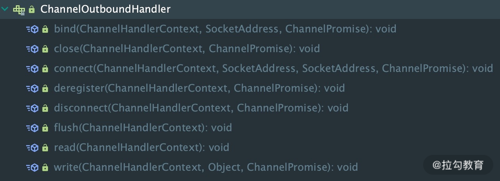
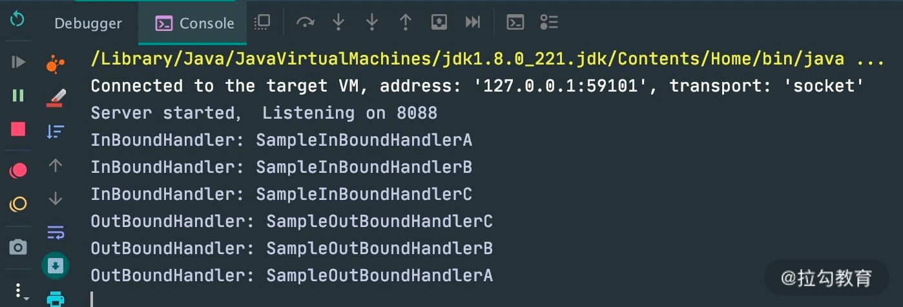
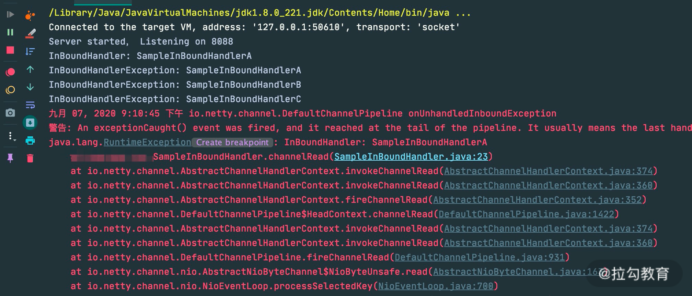

# 05 服务编排层：Pipeline 如何协调各类 Handler ？

通过上节课的学习，我们知道 EventLoop 可以说是 Netty 的调度中心，负责监听多种事件类型：I/O 事件、信号事件、定时事件等，然而实际的业务处理逻辑则是由 ChannelPipeline 中所定义的 ChannelHandler 完成的，ChannelPipeline 和 ChannelHandler 也是我们在平时应用开发的过程中打交道最多的组件。Netty 服务编排层的核心组件 ChannelPipeline 和 ChannelHandler 为用户提供了 I/O 事件的全部控制权。今天这节课我们便一起深入学习 Netty 是如何利用这两个组件，将数据玩转起来。

在学习这节课之前，我先抛出几个问题。

- ChannelPipeline 与 ChannelHandler 的关系是什么？它们之间是如何协同工作的？
- ChannelHandler 的类型有哪些？有什么区别？
- Netty 中 I/O 事件是如何传播的？

希望你在学习完本课时后，可以找到问题的答案。

### ChannelPipeline 概述

Pipeline 的字面意思是管道、流水线。它在 Netty 中起到的作用，和一个工厂的流水线类似。原始的网络字节流经过 Pipeline ，被一步步加工包装，最后得到加工后的成品。经过前面课程核心组件的初步学习，我们已经对 ChannelPipeline 有了初步的印象：它是 Netty 的核心处理链，用以实现网络事件的动态编排和有序传播。

今天我们将从以下几个方面一起探讨 ChannelPipeline 的实现原理：

- ChannelPipeline 内部结构；
- ChannelHandler 接口设计；
- ChannelPipeline 事件传播机制；
- ChannelPipeline 异常传播机制。

### ChannelPipeline 内部结构

首先我们要理清楚 ChannelPipeline 的内部结构是什么样子，这样才能理解 ChannelPipeline 的处理流程。ChannelPipeline 作为 Netty 的核心编排组件，负责调度各种类型的 ChannelHandler，实际数据的加工处理操作则是由 ChannelHandler 完成的。

ChannelPipeline 可以看作是 ChannelHandler 的容器载体，它是由一组 ChannelHandler 实例组成的，内部通过双向链表将不同的 ChannelHandler 链接在一起，如下图所示。当有 I/O 读写事件触发时，ChannelPipeline 会依次调用 ChannelHandler 列表对 Channel 的数据进行拦截和处理。


由上图可知，每个 Channel 会绑定一个 ChannelPipeline，每一个 ChannelPipeline 都包含多个 ChannelHandlerContext，所有 ChannelHandlerContext 之间组成了双向链表。又因为每个 ChannelHandler 都对应一个 ChannelHandlerContext，所以实际上 ChannelPipeline 维护的是它与 ChannelHandlerContext 的关系。那么你可能会有疑问，为什么这里会多一层 ChannelHandlerContext 的封装呢？

其实这是一种比较常用的编程思想。ChannelHandlerContext 用于保存 ChannelHandler 上下文；ChannelHandlerContext 则包含了 ChannelHandler 生命周期的所有事件，如 connect、bind、read、flush、write、close 等。可以试想一下，如果没有 ChannelHandlerContext 的这层封装，那么我们在做 ChannelHandler 之间传递的时候，前置后置的通用逻辑就要在每个 ChannelHandler 里都实现一份。这样虽然能解决问题，但是代码结构的耦合，会非常不优雅。

根据网络数据的流向，ChannelPipeline 分为入站 ChannelInboundHandler 和出站 ChannelOutboundHandler 两种处理器。在客户端与服务端通信的过程中，数据从客户端发向服务端的过程叫出站，反之称为入站。数据先由一系列 InboundHandler 处理后入站，然后再由相反方向的 OutboundHandler 处理完成后出站，如下图所示。我们经常使用的解码器 Decoder 就是入站操作，编码器 Encoder 就是出站操作。服务端接收到客户端数据需要先经过 Decoder 入站处理后，再通过 Encoder 出站通知客户端。


接下来我们详细分析下 ChannelPipeline 双向链表的构造，ChannelPipeline 的双向链表分别维护了 HeadContext 和 TailContext 的头尾节点。我们自定义的 ChannelHandler 会插入到 Head 和 Tail 之间，这两个节点在 Netty 中已经默认实现了，它们在 ChannelPipeline 中起到了至关重要的作用。首先我们看下 HeadContext 和 TailContext 的继承关系，如下图所示。


HeadContext 既是 Inbound 处理器，也是 Outbound 处理器。它分别实现了 ChannelInboundHandler 和 ChannelOutboundHandler。网络数据写入操作的入口就是由 HeadContext 节点完成的。HeadContext 作为 Pipeline 的头结点负责读取数据并开始传递 InBound 事件，当数据处理完成后，数据会反方向经过 Outbound 处理器，最终传递到 HeadContext，所以 HeadContext 又是处理 Outbound 事件的最后一站。此外 HeadContext 在传递事件之前，还会执行一些前置操作。

TailContext 只实现了 ChannelInboundHandler 接口。它会在 ChannelInboundHandler 调用链路的最后一步执行，主要用于终止 Inbound 事件传播，例如释放 Message 数据资源等。TailContext 节点作为 OutBound 事件传播的第一站，仅仅是将 OutBound 事件传递给上一个节点。

从整个 ChannelPipeline 调用链路来看，如果由 Channel 直接触发事件传播，那么调用链路将贯穿整个 ChannelPipeline。然而也可以在其中某一个 ChannelHandlerContext 触发同样的方法，这样只会从当前的 ChannelHandler 开始执行事件传播，该过程不会从头贯穿到尾，在一定场景下，可以提高程序性能。

### ChannelHandler 接口设计

在学习 ChannelPipeline 事件传播机制之前，我们需要了解 I/O 事件的生命周期。整个 ChannelHandler 是围绕 I/O 事件的生命周期所设计的，例如建立连接、读数据、写数据、连接销毁等。ChannelHandler 有两个重要的 **子接口** ：\*\*ChannelInboundHandler **和** ChannelOutboundHandler **，分别拦截** 入站和出站的各种 I/O 事件 **。** 1. ChannelInboundHandler 的事件回调方法与触发时机。\*\*事件回调方法

触发时机

channelRegistered

Channel 被注册到 EventLoop

channelUnregistered

Channel 从 EventLoop 中取消注册

channelActive

Channel 处于就绪状态，可以被读写

channelInactive

Channel 处于非就绪状态Channel 可以从远端读取到数据

channelRead

Channel 可以从远端读取到数据

channelReadComplete

Channel 读取数据完成

userEventTriggered

用户事件触发时

channelWritabilityChanged

Channel 的写状态发生变化\*\*2. ChannelOutboundHandler 的事件回调方法与触发时机。\*\*ChannelOutboundHandler 的事件回调方法非常清晰，直接通过 ChannelOutboundHandler 的接口列表可以看到每种操作所对应的回调方法，如下图所示。这里每个回调方法都是在相应操作执行之前触发，在此就不多做赘述了。此外 ChannelOutboundHandler 中绝大部分接口都包含ChannelPromise 参数，以便于在操作完成时能够及时获得通知。



### 事件传播机制

在上文中我们介绍了 ChannelPipeline 可分为入站 ChannelInboundHandler 和出站 ChannelOutboundHandler 两种处理器，与此对应传输的事件类型可以分为**Inbound 事件 **和** Outbound 事件**。

我们通过一个代码示例，一起体验下 ChannelPipeline 的事件传播机制。

```
serverBootstrap.childHandler(new ChannelInitializer<SocketChannel>() {
    @Override
    public void initChannel(SocketChannel ch) {
        ch.pipeline()
                .addLast(new SampleInBoundHandler("SampleInBoundHandlerA", false))
                .addLast(new SampleInBoundHandler("SampleInBoundHandlerB", false))
                .addLast(new SampleInBoundHandler("SampleInBoundHandlerC", true));
        ch.pipeline()
                .addLast(new SampleOutBoundHandler("SampleOutBoundHandlerA"))
                .addLast(new SampleOutBoundHandler("SampleOutBoundHandlerB"))
                .addLast(new SampleOutBoundHandler("SampleOutBoundHandlerC"));
    }
}
public class SampleInBoundHandler extends ChannelInboundHandlerAdapter {
    private final String name;
    private final boolean flush;
    public SampleInBoundHandler(String name, boolean flush) {
        this.name = name;
        this.flush = flush;
    }
    @Override
    public void channelRead(ChannelHandlerContext ctx, Object msg) throws Exception {
        System.out.println("InBoundHandler: " + name);
        if (flush) {
            ctx.channel().writeAndFlush(msg);
        } else {
            super.channelRead(ctx, msg);
        }
    }
}
public class SampleOutBoundHandler extends ChannelOutboundHandlerAdapter {
    private final String name;
    public SampleOutBoundHandler(String name) {
        this.name = name;
    }
    @Override
    public void write(ChannelHandlerContext ctx, Object msg, ChannelPromise promise) throws Exception {
        System.out.println("OutBoundHandler: " + name);
        super.write(ctx, msg, promise);
    }
}
```

通过 Pipeline 的 addLast 方法分别添加了三个 InboundHandler 和 OutboundHandler，添加顺序都是 A -> B -> C，下图可以表示初始化后 ChannelPipeline 的内部结构。


当客户端向服务端发送请求时，会触发 SampleInBoundHandler 调用链的 channelRead 事件。经过 SampleInBoundHandler 调用链处理完成后，在 SampleInBoundHandlerC 中会调用 writeAndFlush 方法向客户端写回数据，此时会触发 SampleOutBoundHandler 调用链的 write 事件。最后我们看下代码示例的控制台输出：



由此可见，Inbound 事件和 Outbound 事件的传播方向是不一样的。Inbound 事件的传播方向为 Head -> Tail，而 Outbound 事件传播方向是 Tail -> Head，两者恰恰相反。在 Netty 应用编程中一定要理清楚事件传播的顺序。推荐你在系统设计时模拟客户端和服务端的场景画出 ChannelPipeline 的内部结构图，以避免搞混调用关系。

### 异常传播机制

ChannelPipeline 事件传播的实现采用了经典的责任链模式，调用链路环环相扣。那么如果有一个节点处理逻辑异常会出现什么现象呢？我们通过修改 SampleInBoundHandler 的实现来模拟业务逻辑异常：

```
public class SampleInBoundHandler extends ChannelInboundHandlerAdapter {
    private final String name;
    private final boolean flush;
    public SampleInBoundHandler(String name, boolean flush) {
        this.name = name;
        this.flush = flush;
    }
    @Override
    public void channelRead(ChannelHandlerContext ctx, Object msg) {
        System.out.println("InBoundHandler: " + name);
        if (flush) {
            ctx.channel().writeAndFlush(msg);
        } else {
            throw new RuntimeException("InBoundHandler: " + name);
        }
    }
    @Override
    public void exceptionCaught(ChannelHandlerContext ctx, Throwable cause) {
        System.out.println("InBoundHandlerException: " + name);
        ctx.fireExceptionCaught(cause);
    }
}
```

在 channelRead 事件处理中，第一个 A 节点就会抛出 RuntimeException。同时我们重写了 ChannelInboundHandlerAdapter 中的 exceptionCaught 方法，只是在开头加上了控制台输出，方便观察异常传播的行为。下面看一下代码运行的控制台输出结果：



由输出结果可以看出 ctx.fireExceptionCaugh 会将异常按顺序从 Head 节点传播到 Tail 节点。如果用户没有对异常进行拦截处理，最后将由 Tail 节点统一处理，在 TailContext 源码中可以找到具体实现：

```
protected void onUnhandledInboundException(Throwable cause) {
    try {
        logger.warn(
                "An exceptionCaught() event was fired, and it reached at the tail of the pipeline. " +
                        "It usually means the last handler in the pipeline did not handle the exception.",
                cause);
    } finally {
        ReferenceCountUtil.release(cause);
    }
}
```

虽然 Netty 中 TailContext 提供了兜底的异常处理逻辑，但是在很多场景下，并不能满足我们的需求。假如你需要拦截指定的异常类型，并做出相应的异常处理，应该如何实现呢？我们接着往下看。

### 异常处理的最佳实践

在 Netty 应用开发的过程中，良好的异常处理机制会让排查问题的过程事半功倍。所以推荐用户对异常进行统一拦截，然后根据实际业务场景实现更加完善的异常处理机制。通过异常传播机制的学习，我们应该可以想到最好的方法是在 ChannelPipeline 自定义处理器的末端添加统一的异常处理器，此时 ChannelPipeline 的内部结构如下图所示。


用户自定义的异常处理器代码示例如下：

```
public class ExceptionHandler extends ChannelDuplexHandler {
    @Override
    public void exceptionCaught(ChannelHandlerContext ctx, Throwable cause) {
        if (cause instanceof RuntimeException) {
            System.out.println("Handle Business Exception Success.");
        }
    }
}
```

加入统一的异常处理器后，可以看到异常已经被优雅地拦截并处理掉了。这也是 Netty 推荐的最佳异常处理实践。


### 总结

本节课我们深入分析了 Pipeline 的设计原理与事件传播机制。那么课程最初我提出的几个问题你是否已经都找到答案了？我来做个简单的总结：

- ChannelPipeline 是双向链表结构，包含 ChannelInboundHandler 和 ChannelOutboundHandler 两种处理器。
- ChannelHandlerContext 是对 ChannelHandler 的封装，每个 ChannelHandler 都对应一个 ChannelHandlerContext，实际上 ChannelPipeline 维护的是与 ChannelHandlerContext 的关系。
- Inbound 事件和 Outbound 事件的传播方向相反，Inbound 事件的传播方向为 Head -> Tail，而 Outbound 事件传播方向是 Tail -> Head。
- 异常事件的处理顺序与 ChannelHandler 的添加顺序相同，会依次向后传播，与 Inbound 事件和 Outbound 事件无关。

ChannelPipeline 精妙的设计思想值得我们学以致用，建议有兴趣的同学可以深入学习下这个组件的核心源码。在未来源码篇的课程中我们将会继续深入了解 ChannelPipeline 这个组件。
