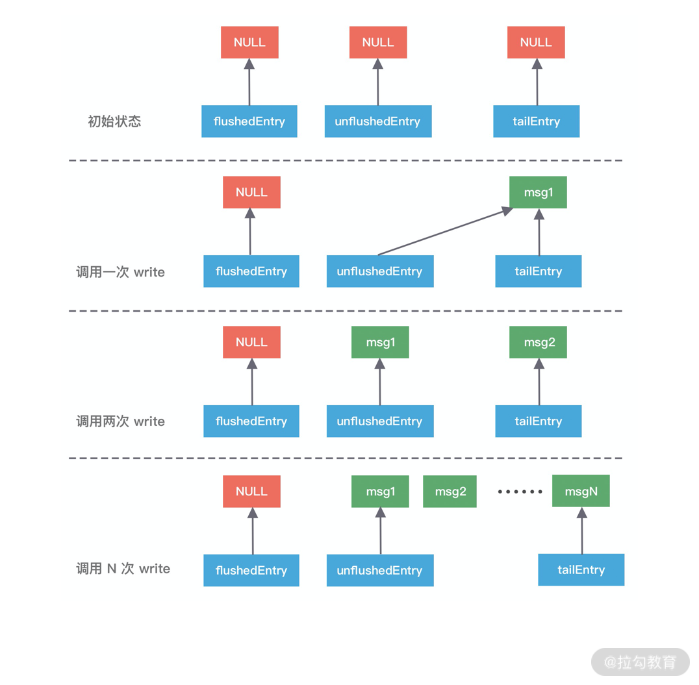
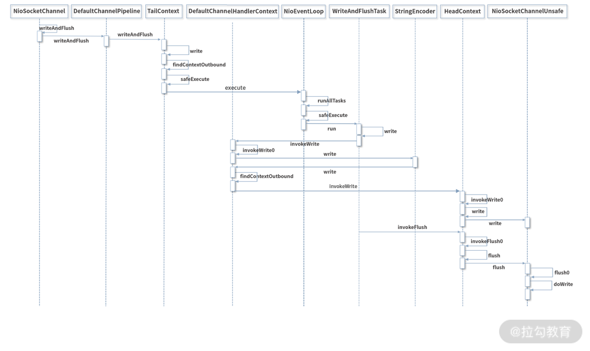

# 09 数据传输：writeAndFlush 处理流程剖析

在前面几节课我们介绍了 Netty 编解码的基础知识，想必你已经掌握了 Netty 实现编解码逻辑的技巧。那么接下来我们如何将编解码后的结果发送出去呢？在 Netty 中实现数据发送非常简单，只需要调用 writeAndFlush 方法即可，这么简单的一行代码究竟 Netty 帮我们完成了哪些事情呢？一起进入我们今天这节课要探讨的主题吧！

### Pipeline 事件传播回顾

在介绍 writeAndFlush 的工作原理之前，我们首先回顾下 Pipeline 的事件传播机制，因为他们是息息相关的。根据网络数据的流向，ChannelPipeline 分为入站 ChannelInboundHandler 和出站 ChannelOutboundHandler 两种处理器，如下图所示。


当我们从客户端向服务端发送请求，或者服务端向客户端响应请求结果都属于出站处理器 ChannelOutboundHandler 的行为，所以当我们调用 writeAndFlush 时，数据一定会在 Pipeline 中进行传播。

在这里我首先抛出几个问题，学完本节课后可以用于检验下自己是否真的理解了 writeAndFlush 的原理。

- writeAndFlush 是如何触发事件传播的？数据是怎样写到 Socket 底层的？
- 为什么会有 write 和 flush 两个动作？执行 flush 之前数据是如何存储的？
- writeAndFlush 是同步还是异步？它是线程安全的吗？

### writeAndFlush 事件传播分析

为了便于我们分析 writeAndFlush 的事件传播流程，首先我们通过代码模拟一个最简单的数据出站场景，服务端在接收到客户端的请求后，将响应结果编码后写回客户端。

以下是服务端的启动类，分别注册了三个 ChannelHandler： **固定长度解码器 FixedLengthFrameDecoder** 、**响应结果编码器 ResponseSampleEncoder **、** 业务逻辑处理器 RequestSampleHandler**。

```
public class EchoServer {
    public void startEchoServer(int port) throws Exception {
        EventLoopGroup bossGroup = new NioEventLoopGroup();
        EventLoopGroup workerGroup = new NioEventLoopGroup();
        try {
            ServerBootstrap b = new ServerBootstrap();
            b.group(bossGroup, workerGroup)
                    .channel(NioServerSocketChannel.class)
                    .childHandler(new ChannelInitializer<SocketChannel>() {
                        @Override
                        public void initChannel(SocketChannel ch) {
                            ch.pipeline().addLast(new FixedLengthFrameDecoder(10));
                            ch.pipeline().addLast(new ResponseSampleEncoder());
                            ch.pipeline().addLast(new RequestSampleHandler());
                        }
                    });
            ChannelFuture f = b.bind(port).sync();
            f.channel().closeFuture().sync();
        } finally {
            bossGroup.shutdownGracefully();
            workerGroup.shutdownGracefully();
        }
    }
    public static void main(String[] args) throws Exception {
        new EchoServer().startEchoServer(8088);
    }
}
```

其中固定长度解码器 FixedLengthFrameDecoder 是 Netty 自带的解码器，在这里就不做赘述了。下面我们分别看下另外两个 ChannelHandler 的具体实现。

响应结果编码器 ResponseSampleEncoder 用于将服务端的处理结果进行编码，具体的实现逻辑如下：

```
public class ResponseSampleEncoder extends MessageToByteEncoder<ResponseSample> {
    @Override
    protected void encode(ChannelHandlerContext ctx, ResponseSample msg, ByteBuf out) {
        if (msg != null) {
            out.writeBytes(msg.getCode().getBytes());
            out.writeBytes(msg.getData().getBytes());
            out.writeLong(msg.getTimestamp());
        }
    }
}
```

RequestSampleHandler 主要负责客户端的数据处理，并通过调用 ctx.channel().writeAndFlush 向客户端返回 ResponseSample 对象，其中包含返回码、响应数据以及时间戳。

```
public class RequestSampleHandler extends ChannelInboundHandlerAdapter {
    @Override
    public void channelRead(ChannelHandlerContext ctx, Object msg) {
        String data = ((ByteBuf) msg).toString(CharsetUtil.UTF_8);
        ResponseSample response = new ResponseSample("OK", data, System.currentTimeMillis());
        ctx.channel().writeAndFlush(response);
    }
}
```

通过以上的代码示例我们可以描绘出 Pipeline 的链表结构，如下图所示。


那么当 RequestSampleHandler 调用 writeAndFlush 时，数据是如何在 Pipeline 中传播、处理并向客户端发送的呢？下面我们结合该场景对 writeAndFlush 的处理流程做深入的分析。

既然 writeAndFlush 是特有的出站操作，那么我们猜测它是从 Pipeline 的 Tail 节点开始传播的，然后一直向前传播到 Head 节点。我们跟进去 ctx.channel().writeAndFlush 的源码，如下所示，发现 DefaultChannelPipeline 类中果然是调用的 Tail 节点 writeAndFlush 方法。

```
@Override
public final ChannelFuture writeAndFlush(Object msg) {
    return tail.writeAndFlush(msg);
}
```

继续跟进 tail.writeAndFlush 的源码，最终会定位到 AbstractChannelHandlerContext 中的 write 方法。该方法是 writeAndFlush 的**核心逻辑**，具体见以下源码。

```
private void write(Object msg, boolean flush, ChannelPromise promise) {
    // ...... 省略部分非核心代码 ......
    // 找到 Pipeline 链表中下一个 Outbound 类型的 ChannelHandler 节点
    final AbstractChannelHandlerContext next = findContextOutbound(flush ?
            (MASK_WRITE | MASK_FLUSH) : MASK_WRITE);
    final Object m = pipeline.touch(msg, next);
    EventExecutor executor = next.executor();
    // 判断当前线程是否是 NioEventLoop 中的线程
    if (executor.inEventLoop()) {
        if (flush) {
            // 因为 flush == true，所以流程走到这里
            next.invokeWriteAndFlush(m, promise);
        } else {
            next.invokeWrite(m, promise);
        }
    } else {
        final AbstractWriteTask task;
        if (flush) {
            task = WriteAndFlushTask.newInstance(next, m, promise);
        }  else {
            task = WriteTask.newInstance(next, m, promise);
        }
        if (!safeExecute(executor, task, promise, m)) {
            task.cancel();
        }
    }
}
```

首先我们确认下方法的入参，因为我们需要执行 flush 动作，所以 flush == true；write 方法还需要 ChannelPromise 参数，可见写操作是个异步的过程。AbstractChannelHandlerContext 会默认初始化一个 ChannelPromise 完成该异步操作，ChannelPromise 内部持有当前的 Channel 和 EventLoop，此外你可以向 ChannelPromise 中注册回调监听 listener 来获得异步操作的结果。

write 方法的核心逻辑主要分为三个重要步骤，我已经以注释的形式在源码中标注出来。下面我们将结合上文中的 EchoServer 代码示例详细分析 write 方法的执行机制。

第一步，调用 findContextOutbound 方法找到 Pipeline 链表中下一个 Outbound 类型的 ChannelHandler。在我们模拟的场景中下一个 Outbound 节点是 ResponseSampleEncoder。

第二步，通过 inEventLoop 方法判断当前线程的身份标识，如果当前线程和 EventLoop 分配给当前 Channel 的线程是同一个线程的话，那么所提交的任务将被立即执行。否则当前的操作将被封装成一个 Task 放入到 EventLoop 的任务队列，稍后执行。所以 writeAndFlush 是否是线程安全的呢，你心里有答案了吗？

第三步，因为 flush== true，将会直接执行 next.invokeWriteAndFlush(m, promise) 这行代码，我们跟进去源码。发现最终会它会执行下一个 ChannelHandler 节点的 write 方法，那么流程又回到了 到 AbstractChannelHandlerContext 中重复执行 write 方法，继续寻找下一个 Outbound 节点。

```
private void invokeWriteAndFlush(Object msg, ChannelPromise promise) {
    if (invokeHandler()) {
        invokeWrite0(msg, promise);
        invokeFlush0();
    } else {
        writeAndFlush(msg, promise);
    }
}
private void invokeWrite0(Object msg, ChannelPromise promise) {
    try {
        ((ChannelOutboundHandler) handler()).write(this, msg, promise);
    } catch (Throwable t) {
        notifyOutboundHandlerException(t, promise);
    }
}
```

为什么 ResponseSampleEncoder 中重写的是 encode 方法，而不是 write 方法？encode 方法又是什么时机被执行的呢？这就回到了《Netty 如何实现自定义通信协议》课程中所介绍的 MessageToByteEncoder 源码。因为我们在实现编码器的时候都会继承 MessageToByteEncoder 抽象类，MessageToByteEncoder 重写了 ChanneOutboundHandler 的 write 方法，其中会调用子类实现的 encode 方法完成数据编码，在这里我们不再赘述。

到目前为止，writeAndFlush 的事件传播流程已经分析完毕，可以看出 Netty 的 Pipeline 设计非常精妙，调用 writeAndFlush 时数据是在 Outbound 类型的 ChannelHandler 节点之间进行传播，那么最终数据是如何写到 Socket 底层的呢？我们一起继续向下分析吧。

### 写 Buffer 队列

通过上述场景示例分析，我们知道数据将会在 Pipeline 中一直寻找 Outbound 节点并向前传播，直到 Head 节点结束，由 Head 节点完成最后的数据发送。所以 Pipeline 中的 Head 节点在完成 writeAndFlush 过程中扮演着重要的角色。我们直接看下 Head 节点的 write 方法源码：

```
// HeadContext # write
@Override
public void write(ChannelHandlerContext ctx, Object msg, ChannelPromise promise) {
    unsafe.write(msg, promise);
}
// AbstractChannel # AbstractUnsafe # write
@Override
public final void write(Object msg, ChannelPromise promise) {
    assertEventLoop();
    ChannelOutboundBuffer outboundBuffer = this.outboundBuffer;
    if (outboundBuffer == null) {
        safeSetFailure(promise, newClosedChannelException(initialCloseCause));
        ReferenceCountUtil.release(msg);
        return;
    }
    int size;
    try {
        msg = filterOutboundMessage(msg); // 过滤消息
        size = pipeline.estimatorHandle().size(msg);
        if (size < 0) {
            size = 0;
        }
    } catch (Throwable t) {
        safeSetFailure(promise, t);
        ReferenceCountUtil.release(msg);
        return;
    }
    outboundBuffer.addMessage(msg, size, promise); // 向 Buffer 中添加数据
}
```

可以看出 Head 节点是通过调用 unsafe 对象完成数据写入的，unsafe 对应的是 NioSocketChannelUnsafe 对象实例，最终调用到 AbstractChannel 中的 write 方法，该方法有两个重要的点需要指出：

1. filterOutboundMessage 方法会对待写入的 msg 进行过滤，如果 msg 使用的不是 DirectByteBuf，那么它会将 msg 转换成 DirectByteBuf。
1. ChannelOutboundBuffer 可以理解为一个缓存结构，从源码最后一行 outboundBuffer.addMessage 可以看出是在向这个缓存中添加数据，所以 ChannelOutboundBuffer 才是理解数据发送的关键。

writeAndFlush 主要分为两个步骤，write 和 flush。通过上面的分析可以看出只调用 write 方法，数据并不会被真正发送出去，而是存储在 ChannelOutboundBuffer 的缓存内。下面我们重点分析一下 ChannelOutboundBuffer 的内部构造，跟进一下 addMessage 的源码：

```
public void addMessage(Object msg, int size, ChannelPromise promise) {
    Entry entry = Entry.newInstance(msg, size, total(msg), promise);
    if (tailEntry == null) {
        flushedEntry = null;
    } else {
        Entry tail = tailEntry;
        tail.next = entry;
    }
    tailEntry = entry;
    if (unflushedEntry == null) {
        unflushedEntry = entry;
    }
    incrementPendingOutboundBytes(entry.pendingSize, false);
}
```

ChannelOutboundBuffer 缓存是一个链表结构，每次传入的数据都会被封装成一个 Entry 对象添加到链表中。ChannelOutboundBuffer 包含**三个非常重要的指针 **：第一个被写到缓冲区的** 节点 flushedEntry **、第一个未被写到缓冲区的** 节点 unflushedEntry **和最后一个** 节点 tailEntry。**

在初始状态下这三个指针都指向 NULL，当我们每次调用 write 方法是，都会调用 addMessage 方法改变这三个指针的指向，可以参考下图理解指针的移动过程会更加形象。



第一次调用 write，因为链表里只有一个数据，所以 unflushedEntry 和 tailEntry 指针都指向第一个添加的数据 msg1。flushedEntry 指针在没有触发 flush 动作时会一直指向 NULL。

第二次调用 write，tailEntry 指针会指向新加入的 msg2，unflushedEntry 保持不变。

第 N 次调用 write，tailEntry 指针会不断指向新加入的 msgN，unflushedEntry 依然保持不变，unflushedEntry 和 tailEntry 指针之间的数据都是未写入 Socket 缓冲区的。

以上便是写 Buffer 队列写入数据的实现原理，但是我们不可能一直向缓存中写入数据，所以 addMessage 方法中每次写入数据后都会调用 incrementPendingOutboundBytes 方法判断缓存的水位线，具体源码如下。

```
private static final int DEFAULT_LOW_WATER_MARK = 32 * 1024;
private static final int DEFAULT_HIGH_WATER_MARK = 64 * 1024;
private void incrementPendingOutboundBytes(long size, boolean invokeLater) {
    if (size == 0) {
        return;
    }
    long newWriteBufferSize = TOTAL_PENDING_SIZE_UPDATER.addAndGet(this, size);
    // 判断缓存大小是否超过高水位线
    if (newWriteBufferSize > channel.config().getWriteBufferHighWaterMark()) {
        setUnwritable(invokeLater);
    }
}
```

incrementPendingOutboundBytes 的逻辑非常简单，每次添加数据时都会累加数据的字节数，然后判断缓存大小是否超过所设置的高水位线 64KB，如果超过了高水位，那么 Channel 会被设置为不可写状态。直到缓存的数据大小低于低水位线 32KB 以后，Channel 才恢复成可写状态。

有关写数据的逻辑已经分析完了，那么执行 flush 动作缓存又会是什么变化呢？我们接下来一起看下 flush 的工作原理吧。

### 刷新 Buffer 队列

当执行完 write 写操作之后，invokeFlush0 会触发 flush 动作，与 write 方法类似，flush 方法同样会从 Tail 节点开始传播到 Head 节点，同样我们跟进下 HeadContext 的 flush 源码：

```
// HeadContext # flush
@Override
public void flush(ChannelHandlerContext ctx) {
    unsafe.flush();
}
// AbstractChannel # flush
@Override
public final void flush() {
    assertEventLoop();
    ChannelOutboundBuffer outboundBuffer = this.outboundBuffer;
    if (outboundBuffer == null) {
        return;
    }
    outboundBuffer.addFlush();
    flush0();
}
```

可以看出 flush 的核心逻辑主要分为两个步骤：addFlush 和 flush0，下面我们逐一对它们进行分析。

首先看下 addFlush 方法的源码：

```
// ChannelOutboundBuffer # addFlush
public void addFlush() {
    Entry entry = unflushedEntry;
    if (entry != null) {
        if (flushedEntry == null) {
            flushedEntry = entry;
        }
        do {
            flushed ++;
            if (!entry.promise.setUncancellable()) {
                int pending = entry.cancel();
                // 减去待发送的数据，如果总字节数低于低水位，那么 Channel 将变为可写状态
                decrementPendingOutboundBytes(pending, false, true);
            }
            entry = entry.next;
        } while (entry != null);
        unflushedEntry = null;
    }
}
```

addFlush 方法同样也会操作 ChannelOutboundBuffer 缓存数据。在执行 addFlush 方法时，缓存中的指针变化又是如何呢？如下图所示，我们在写入流程的基础上继续进行分析。


此时 flushedEntry 指针有所改变，变更为 unflushedEntry 指针所指向的数据，然后 unflushedEntry 指针指向 NULL，flushedEntry 指针指向的数据才会被真正发送到 Socket 缓冲区。

在 addFlush 源码中 decrementPendingOutboundBytes 与之前 addMessage 源码中的 incrementPendingOutboundBytes 是相对应的。decrementPendingOutboundBytes 主要作用是减去待发送的数据字节，如果缓存的大小已经小于低水位，那么 Channel 会恢复为可写状态。

addFlush 的大体流程我们已经介绍完毕，接下来便是第二步负责发送数据的 flush0 方法。同样我们跟进 flush0 的源码，定位出 flush0 的核心调用链路：

```
// AbstractNioUnsafe # flush0
@Override
protected final void flush0() {
    if (!isFlushPending()) {
        super.flush0();
    }
}
// AbstractNioByteChannel # doWrite
@Override
protected void doWrite(ChannelOutboundBuffer in) throws Exception {
    int writeSpinCount = config().getWriteSpinCount();
    do {
        Object msg = in.current();
        if (msg == null) {
            clearOpWrite();
            return;
        }
        writeSpinCount -= doWriteInternal(in, msg);
    } while (writeSpinCount > 0);
    incompleteWrite(writeSpinCount < 0);
}
```

实际 flush0 的调用层次很深，但其实核心的逻辑在于 AbstractNioByteChannel 的 doWrite 方法，该方法负责将数据真正写入到 Socket 缓冲区。doWrite 方法的处理流程主要分为三步：

第一，根据配置获取自旋锁的次数 writeSpinCount。那么你的疑问就来了，这个自旋锁的次数主要是用来干什么的呢？当我们向 Socket 底层写数据的时候，如果每次要写入的数据量很大，是不可能一次将数据写完的，所以只能分批写入。Netty 在不断调用执行写入逻辑的时候，EventLoop 线程可能一直在等待，这样有可能会阻塞其他事件处理。所以这里自旋锁的次数相当于控制一次写入数据的最大的循环执行次数，如果超过所设置的自旋锁次数，那么写操作将会被暂时中断。

第二，根据自旋锁次数重复调用 doWriteInternal 方法发送数据，每成功发送一次数据，自旋锁的次数 writeSpinCount 减 1，当 writeSpinCount 耗尽，那么 doWrite 操作将会被暂时中断。doWriteInternal 的源码涉及 JDK NIO 底层，在这里我们不再深入展开，它的主要作用在于删除缓存中的链表节点以及调用底层 API 发送数据，有兴趣的同学可以自行研究。

第三，调用 incompleteWrite 方法确保数据能够全部发送出去，因为自旋锁次数的限制，可能数据并没有写完，所以需要继续 OP_WRITE 事件；如果数据已经写完，清除 OP_WRITE 事件即可。

至此，整个 writeAndFlush 的工作原理已经全部分析完了，整个过程的调用层次比较深，我整理了 writeAndFlush 的时序图，如下所示，帮助大家梳理 writeAndFlush 的调用流程，加深对上述知识点的理解。



### 总结

本节课我们深入分析了 writeAndFlush 的处理流程，可以总结以下三点：

- writeAndFlush 属于出站操作，它是从 Pipeline 的 Tail 节点开始进行事件传播，一直向前传播到 Head 节点。不管在 write 还是 flush 过程，Head 节点都中扮演着重要的角色。
- write 方法并没有将数据写入 Socket 缓冲区，只是将数据写入到 ChannelOutboundBuffer 缓存中，ChannelOutboundBuffer 缓存内部是由单向链表实现的。
- flush 方法才最终将数据写入到 Socket 缓冲区。

最后，留一个小的思考题，Channel 和 ChannelHandlerContext 都有 writeAndFlush 方法，它们之间有什么区别呢？
