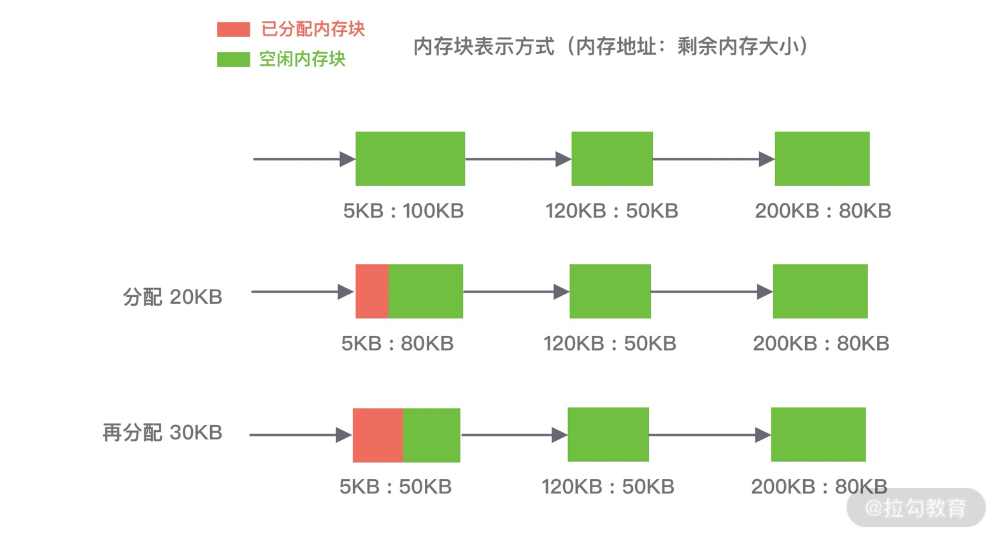
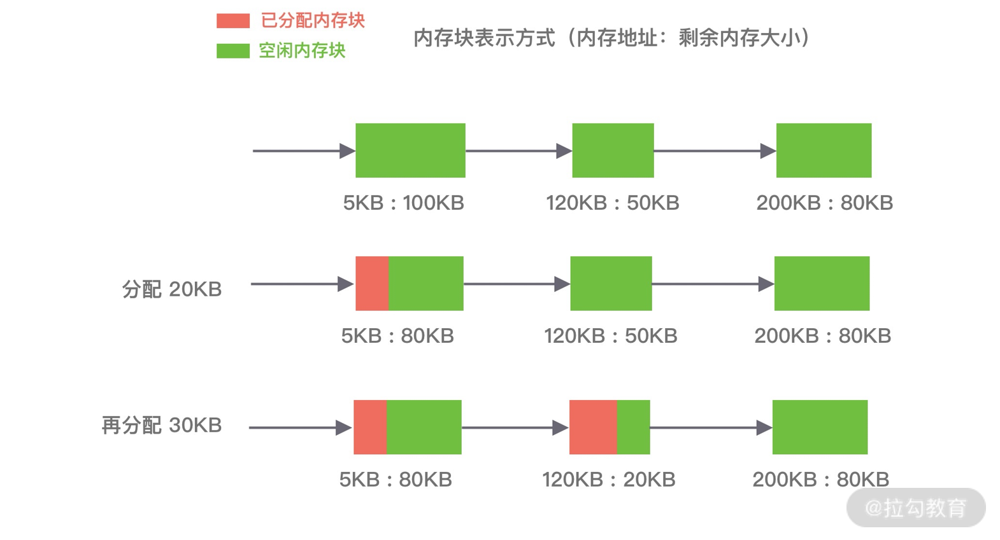
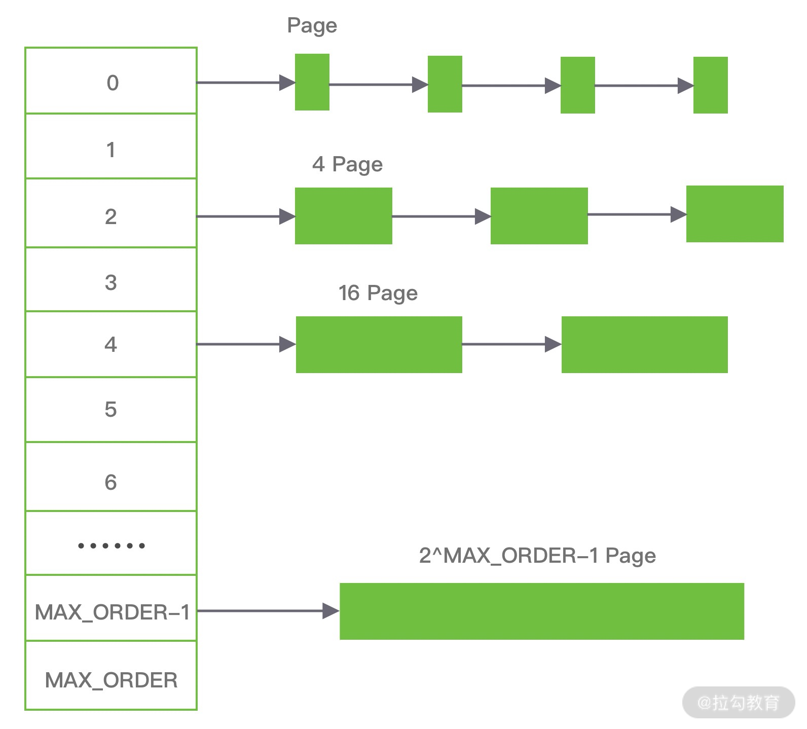
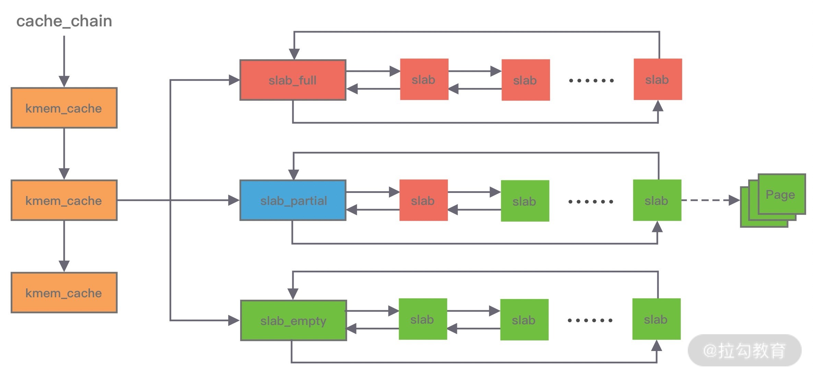

# 12 他山之石：高性能内存分配器 jemalloc 基本原理

在上节课，我们介绍了强大的 ByteBuf 工具类，ByteBuf 在 Netty 中随处可见，那么这些 ByteBuf 在 Netty 中是如何被分配和管理的呢？接下来的我们会对 Netty 高性能内存管理进行剖析，这些知识相比前面的章节有些晦涩难懂，你不必过于担心，Netty 内存管理的实现并不是一蹴而就的，它也是参考了 jemalloc 内存分配器。今天我们就先介绍 jemalloc 内存分配器的基本原理，为我们后面的课程打好基础。

### 背景知识

jemalloc 是由 Jason Evans 在 FreeBSD 项目中引入的新一代内存分配器。它是一个通用的 malloc 实现，侧重于减少内存碎片和提升高并发场景下内存的分配效率，其目标是能够替代 malloc。jemalloc 应用十分广泛，在 Firefox、Redis、Rust、Netty 等出名的产品或者编程语言中都有大量使用。具体细节可以参考 Jason Evans 发表的论文 《A Scalable Concurrent malloc Implementation for FreeBSD》

除了 jemalloc 之外，业界还有一些著名的内存分配器实现，例如 ptmalloc 和 tcmalloc。我们对这三种内存分配器做一个简单的对比：

ptmalloc 是基于 glibc 实现的内存分配器，它是一个标准实现，所以兼容性较好。pt 表示 per thread 的意思。当然 ptmalloc 确实在多线程的性能优化上下了很多功夫。由于过于考虑性能问题，多线程之间内存无法实现共享，只能每个线程都独立使用各自的内存，所以在内存开销上是有很大浪费的。

tcmalloc 出身于 Google，全称是 thread-caching malloc，所以 tcmalloc 最大的特点是带有线程缓存，tcmalloc 非常出名，目前在 Chrome、Safari 等知名产品中都有所应有。tcmalloc 为每个线程分配了一个局部缓存，对于小对象的分配，可以直接由线程局部缓存来完成，对于大对象的分配场景，tcmalloc 尝试采用自旋锁来减少多线程的锁竞争问题。

jemalloc 借鉴了 tcmalloc 优秀的设计思路，所以在架构设计方面两者有很多相似之处，同样都包含 thread cache 的特性。但是 jemalloc 在设计上比 ptmalloc 和 tcmalloc 都要复杂，jemalloc 将内存分配粒度划分为 Small、Large、Huge 三个分类，并记录了很多 meta 数据，所以在空间占用上要略多于 tcmalloc，不过在大内存分配的场景，jemalloc 的内存碎片要少于 tcmalloc。tcmalloc 内部采用红黑树管理内存块和分页，Huge 对象通过红黑树查找索引数据可以控制在指数级时间。

由此可见，虽然几个内存分配器的侧重点不同，但是它们的核心目标是一致的：

- 高效的内存分配和回收，提升单线程或者多线程场景下的性能。
- 减少内存碎片，包括内部碎片和外部碎片，提高内存的有效利用率。

那么这里又涉及一个概念，什么是内存碎片呢？Linux 中物理内存会被划分成若干个 4K 大小的内存页 Page，物理内存的分配和回收都是基于 Page 完成的，Page 内产生的内存碎片称为内部碎片，Page 之间产生的内存碎片称为外部碎片。

首先讲下内部碎片，因为内存是按 Page 进行分配的，即便我们只需要很小的内存，操作系统至少也会分配 4K 大小的 Page，单个 Page 内只有一部分字节都被使用，剩余的字节形成了内部碎片，如下图所示。

外部碎片与内部碎片相反，是在分配较大内存块时产生的。我们试想一下，当需要分配大内存块的时候，操作系统只能通过分配连续的 Page 才能满足要求，在程序不断运行的过程中，这些 Page 被频繁的回收并重新分配，Page 之间就会出现小的空闲内存块，这样就形成了外部碎片，如下图所示。

上述我们介绍了内存分配器的一些背景知识，它们是操作系统以及高性能组件的必备神器，如果你对内存管理有兴趣，jemalloc 和 tcmalloc 都是非常推荐学习的。

### 常用内存分配器算法

在学习 jemalloc 的实现原理之前，我们先了解下最常用的内存分配器算法： **动态内存分配** 、**伙伴算法 **和** Slab 算法**，这将对于我们理解 jemalloc 大有裨益。

#### 动态内存分配

动态内存分配（Dynamic memory allocation）又称为堆内存分配，后面简称 DMA，操作系统根据程序运行过程中的需求即时分配内存，且分配的内存大小就是程序需求的大小。在大部分场景下，只有在程序运行的时候才知道所需要分配的内存大小，如果提前分配可能会分配的大小无法把控，分配太大会浪费空间，分配太小会无法使用。

DMA 是从一整块内存中按需分配，对于分配出的内存会记录元数据，同时还会使用空闲分区链维护空闲内存，便于在内存分配时查找可用的空闲分区，常用的有三种查找策略：**第一种是⾸次适应算法（first fit）**，空闲分区链以地址递增的顺序将空闲分区以双向链表的形式连接在一起，从空闲分区链中找到第一个满足分配条件的空闲分区，然后从空闲分区中划分出一块可用内存给请求进程，剩余的空闲分区仍然保留在空闲分区链中。如下图所示，P1 和 P2 的请求可以在内存块 A 中完成分配。该算法每次都从低地址开始查找，造成低地址部分会不断被分配，同时也会产生很多小的空闲分区。

**第二种是循环首次适应算法（next fit）**，该算法是由首次适应算法的变种，循环首次适应算法不再是每次从链表的开始进行查找，而是从上次找到的空闲分区的下⼀个空闲分区开始查找。如下图所示，P1 请求在内存块 A 完成分配，然后再为 P2 分配内存时，是直接继续向下寻找可用分区，最终在 B 内存块中完成分配。该算法相比⾸次适应算法空闲分区的分布更加均匀，而且查找的效率有所提升，但是正因为如此会造成空闲分区链中大的空闲分区会越来越少。

**第三种是最佳适应算法（best fit）**，空闲分区链以空闲分区大小递增的顺序将空闲分区以双向链表的形式连接在一起，每次从空闲分区链的开头进行查找，这样第一个满足分配条件的空间分区就是最优解。如下图所示，在 A 内存块分配完 P1 请求后，空闲分区链重新按分区大小进行排序，再为 P2 请求查找满足条件的空闲分区。该算法的空间利用率更高，但同样也会留下很多较难利用的小空闲分区，由于每次分配完需要重新排序，所以会有造成性能损耗。

#### 伙伴算法

伙伴算法是一种非常经典的内存分配算法，它采用了分离适配的设计思想，将物理内存按照 2 的次幂进行划分，内存分配时也是按照 2 的次幂大小进行按需分配，例如 4KB、 8KB、16KB 等。假设我们请求分配的内存大小为 10KB，那么会按照 16KB 分配。

伙伴算法相对比较复杂，我们结合下面这张图来讲解它的分配原理。

伙伴算法把内存划分为 11 组不同的 2 次幂大小的内存块集合，每组内存块集合都用双向链表连接。链表中每个节点的内存块大小分别为 1、2、4、8、16、32、64、128、256、512 和 1024 个连续的 Page，例如第一组链表的节点为 20 个连续 Page，第二组链表的节点为 21 个连续 Page，以此类推。

假设我们需要分配 10K 大小的内存块，看下伙伴算法的具体分配过程：

1. 首先需要找到存储 24 连续 Page 所对应的链表，即数组下标为 4；
1. 查找 24 链表中是否有空闲的内存块，如果有则分配成功；
1. 如果 24 链表不存在空闲的内存块，则继续沿数组向上查找，即定位到数组下标为 5 的链表，链表中每个节点存储 25 的连续 Page；
1. 如果 25 链表中存在空闲的内存块，则取出该内存块并将它分割为 2 个 24 大小的内存块，其中一块分配给进程使用，剩余的一块链接到 24 链表中。

以上是伙伴算法的分配过程，那么释放内存时候伙伴算法又会发生什么行为呢？当进程使用完内存归还时，需要检查其伙伴块的内存是否释放，所谓伙伴块是不仅大小相同，而且两个块的地址是连续的，其中低地址的内存块起始地址必须为 2 的整数次幂。如果伙伴块是空闲的，那么就会将两个内存块合并成更大的块，然后重复执行上述伙伴块的检查机制。直至伙伴块是非空闲状态，那么就会将该内存块按照实际大小归还到对应的链表中。频繁的合并会造成 CPU 浪费，所以并不是每次释放都会触发合并操作，当链表中的内存块个数小于某个阈值时，并不会触发合并操作。

由此可见，伙伴算法有效地减少了外部碎片，但是有可能会造成非常严重的内部碎片，最严重的情况会带来 50% 的内存碎片。

#### Slab 算法

因为伙伴算法都是以 Page 为最小管理单位，在小内存的分配场景，伙伴算法并不适用，如果每次都分配一个 Page 岂不是非常浪费内存，因此 Slab 算法应运而生了。Slab 算法在伙伴算法的基础上，对小内存的场景专门做了优化，采用了内存池的方案，解决内部碎片问题。

Linux 内核使用的就是 Slab 算法，因为内核需要频繁地分配小内存，所以 Slab 算法提供了一种高速缓存机制，使用缓存存储内核对象，当内核需要分配内存时，基本上可以通过缓存中获取。此外 Slab 算法还可以支持通用对象的初始化操作，避免对象重复初始化的开销。下图是 Slab 算法的结构图，Slab 算法实现起来非常复杂，本文只做一个简单的了解。

在 Slab 算法中维护着大小不同的 Slab 集合，在最顶层是 cache_chain，cache_chain 中维护着一组 kmem_cache 引用，kmem_cache 负责管理一块固定大小的对象池。通常会提前分配一块内存，然后将这块内存划分为大小相同的 slot，不会对内存块再进行合并，同时使用位图 bitmap 记录每个 slot 的使用情况。

kmem_cache 中包含三个 Slab 链表：**完全分配使用 slab_full **、** 部分分配使用 slab_partial **和** 完全空闲 slabs_empty**，这三个链表负责内存的分配和释放。每个链表中维护的 Slab 都是一个或多个连续 Page，每个 Slab 被分配多个对象进行存储。Slab 算法是基于对象进行内存管理的，它把相同类型的对象分为一类。当分配内存时，从 Slab 链表中划分相应的内存单元；当释放内存时，Slab 算法并不会丢弃已经分配的对象，而是将它保存在缓存中，当下次再为对象分配内存时，直接会使用最近释放的内存块。

单个 Slab 可以在不同的链表之间移动，例如当一个 Slab 被分配完，就会从 slab_partial 移动到 slabs_full，当一个 Slab 中有对象被释放后，就会从 slab_full 再次回到 slab_partial，所有对象都被释放完的话，就会从 slab_partial 移动到 slab_empty。

至此，三种最常用的内存分配算法已经介绍完了，优秀的内存分配算法都是在性能和内存利用率之间寻找平衡点，我们今天的主角 jemalloc 就是非常典型的例子。

### jemalloc 架构设计

在了解了常用的内存分配算法之后，再理解 jemalloc 的架构设计会相对轻松一些。下图是 jemalloc 的架构图，我们一起学习下它的核心设计理念。

上图中涉及 jemalloc 的几个核心概念，例如 arena、bin、chunk、run、region、tcache 等，我们下面逐一进行介绍。**arena 是 jemalloc 最重要的部分 **，内存由一定数量的 arenas 负责管理。每个用户线程都会被绑定到一个 arena 上，线程采用 round-robin 轮询的方式选择可用的 arena 进行内存分配，为了减少线程之间的锁竞争，默认每个 CPU 会分配 4 个 arena。** bin 用于管理不同档位的内存单元 **，每个 bin 管理的内存大小是按分类依次递增。因为 jemalloc 中小内存的分配是基于 Slab 算法完成的，所以会产生不同类别的内存块。** chunk 是负责管理用户内存块的数据结构 **，chunk 以 Page 为单位管理内存，默认大小是 4M，即 1024 个连续 Page。每个 chunk 可被用于多次小内存的申请，但是在大内存分配的场景下只能分配一次。** run 实际上是 chunk 中的一块内存区域 **，每个 bin 管理相同类型的 run，最终通过操作 run 完成内存分配。run 结构具体的大小由不同的 bin 决定，例如 8 字节的 bin 对应的 run 只有一个 Page，可以从中选取 8 字节的块进行分配。** region 是每个 run 中的对应的若干个小内存块 **，每个 run 会将划分为若干个等长的 region，每次内存分配也是按照 region 进行分发。** tcache 是每个线程私有的缓存**，用于 small 和 large 场景下的内存分配，每个 tcahe 会对应一个 arena，tcache 本身也会有一个 bin 数组，称为tbin。与 arena 中 bin 不同的是，它不会有 run 的概念。tcache 每次从 arena 申请一批内存，在分配内存时首先在 tcache 查找，从而避免锁竞争，如果分配失败才会通过 run 执行内存分配。

jemalloc 的几个核心的概念介绍完了，我们再重新梳理下它们之间的关系：

- 内存是由一定数量的 arenas 负责管理，线程均匀分布在 arenas 当中；
- 每个 arena 都包含一个 bin 数组，每个 bin 管理不同档位的内存块；
- 每个 arena 被划分为若干个 chunks，每个 chunk 又包含若干个 runs，每个 run 由连续的 Page 组成，run 才是实际分配内存的操作对象；
- 每个 run 会被划分为一定数量的 regions，在小内存的分配场景，region 相当于用户内存；
- 每个 tcache 对应 一个 arena，tcache 中包含多种类型的 bin。

接下来我们分析下 jemalloc 的整体内存分配和释放流程，主要分为 **Samll **、** Large **和** Huge** 三种场景。

首先讲下 Samll 场景，如果请求分配内存的大小小于 arena 中的最小的 bin，那么优先从线程中对应的 tcache 中进行分配。首先确定查找对应的 tbin 中是否存在缓存的内存块，如果存在则分配成功，否则找到 tbin 对应的 arena，从 arena 中对应的 bin 中分配 region 保存在 tbin 的 avail 数组中，最终从 availl 数组中选取一个地址进行内存分配，当内存释放时也会将被回收的内存块进行缓存。

Large 场景的内存分配与 Samll 类似，如果请求分配内存的大小大于 arena 中的最小的 bin，但是不大于 tcache 中能够缓存的最大块，依然会通过 tcache 进行分配，但是不同的是此时会分配 chunk 以及所对应的 run，从 chunk 中找到相应的内存空间进行分配。内存释放时也跟 samll 场景类似，会把释放的内存块缓存在 tacache 的 tbin 中。此外还有一种情况，当请求分配内存的大小大于tcache 中能够缓存的最大块，但是不大于 chunk 的大小，那么将不会采用 tcache 机制，直接在 chunk 中进行内存分配。

Huge 场景，如果请求分配内存的大小大于 chunk 的大小，那么直接通过 mmap 进行分配，调用 munmap 进行回收。

到底为止，jemalloc 的基础知识介绍完毕，你需要花点时间消化它，这对于后面学习 Netty 的内存管理很有帮助。

### 总结

内存管理是每个高阶程序员的必备知识，万变不离其宗，jemalloc 的思想在很多场景都非常适用，在 Redis、Netty 等知名的高性能组件中都有它的原型，你会发现它们的实现思路都是类似的，申请大块内存，避免“细水长流”。趁热打铁吧，下节课我们将继续学习 Netty 是如何设计高性能的内存管理的。
