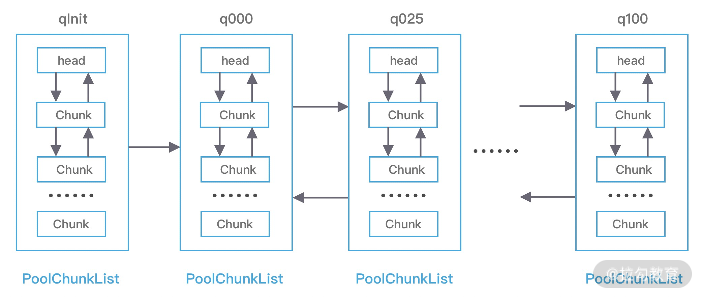
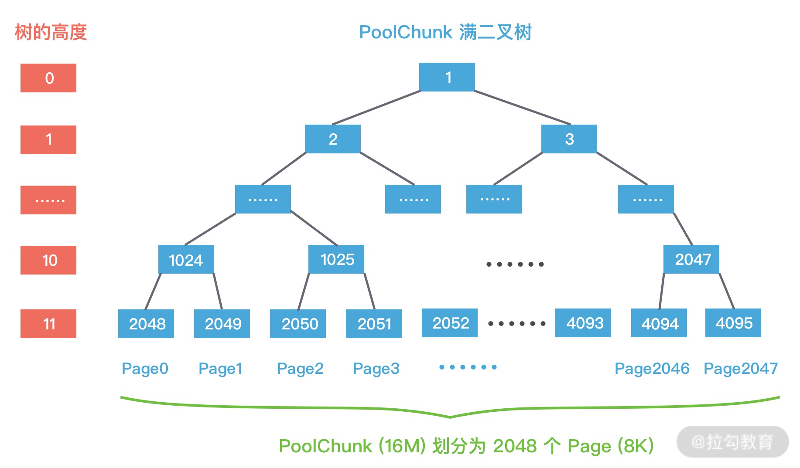
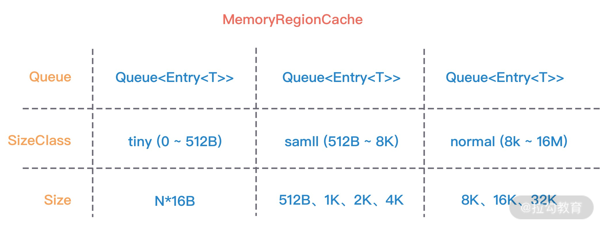
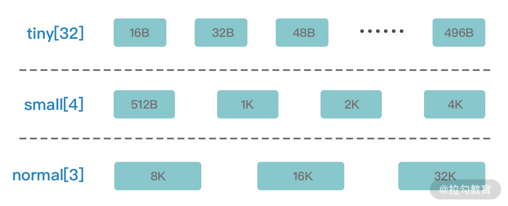

# 13 举一反三：Netty 高性能内存管理设计（上）

Netty 作为一款高性能的网络框架，需要处理海量的字节数据，而且 Netty 默认提供了池化对象的内存分配，使用完后归还到内存池，所以一套高性能的内存管理机制是 Netty 必不可少的。在上节课中我们介绍了原生 jemalloc 的基本原理，而 Netty 高性能的内存管理也是借鉴 jemalloc 实现的，它同样需要解决两个经典的核心问题：

- 在单线程或者多线程的场景下，如何高效地进行内存分配和回收？
- 如何减少内存碎片，提高内存的有效利用率？

我们同样带着这两个经典问题开始 Netty 内存管理的课程学习。

### 内存规格介绍

Netty 保留了内存规格分类的设计理念，不同大小的内存块采用的分配策略是不同的，具体内存规格的分类情况如下图所示。


上图中 Tiny 代表 0 ~ 512B 之间的内存块，Samll 代表 512B ~ 8K 之间的内存块，Normal 代表 8K ~ 16M 的内存块，Huge 代表大于 16M 的内存块。在 Netty 中定义了一个 SizeClass 类型的枚举，用于描述上图中的内存规格类型，分别为 Tiny、Small 和 Normal。但是图中 Huge 并未在代码中定义，当分配大于 16M 时，可以归类为 Huge 场景，Netty 会直接使用非池化的方式进行内存分配。

Netty 在每个区域内又定义了更细粒度的内存分配单位，分别为 Chunk、Page、Subpage，我们将逐一对其进行介绍。

Chunk 是 Netty 向操作系统申请内存的单位，所有的内存分配操作也是基于 Chunk 完成的，Chunk 可以理解为 Page 的集合，每个 Chunk 默认大小为 16M。

Page 是 Chunk 用于管理内存的单位，Netty 中的 Page 的大小为 8K，不要与 Linux 中的内存页 Page 相混淆了。假如我们需要分配 64K 的内存，需要在 Chunk 中选取 8 个 Page 进行分配。

Subpage 负责 Page 内的内存分配，假如我们分配的内存大小远小于 Page，直接分配一个 Page 会造成严重的内存浪费，所以需要将 Page 划分为多个相同的子块进行分配，这里的子块就相当于 Subpage。按照 Tiny 和 Small 两种内存规格，SubPage 的大小也会分为两种情况。在 Tiny 场景下，最小的划分单位为 16B，按 16B 依次递增，16B、32B、48B ...... 496B；在 Small 场景下，总共可以划分为 512B、1024B、2048B、4096B 四种情况。Subpage 没有固定的大小，需要根据用户分配的缓冲区大小决定，例如分配 1K 的内存时，Netty 会把一个 Page 等分为 8 个 1K 的 Subpage。

了解了 Netty 不同粒度的内存的分配单位后，我们接下来看看 Netty 中的 jemalloc 是如何实现的。

### Netty 内存池架构设计

Netty 中的内存池可以看作一个 Java 版本的 jemalloc 实现，并结合 JVM 的诸多特性做了部分优化。如下图所示，我们首先从全局视角看下 Netty 内存池的整体布局，对它有一个宏观的认识。


基于上图的内存池模型，Netty 抽象出一些核心组件，如 PoolArena、PoolChunk、PoolChunkList、PoolSubpage、PoolThreadCache、MemoryRegionCache 等，可以看出与 jemalloc 中的核心概念有些是类似的，接下来我们逐一进行介绍。

#### PoolArena

Netty 借鉴了 jemalloc 中 Arena 的设计思想，采用固定数量的多个 Arena 进行内存分配，Arena 的默认数量与 CPU 核数有关，通过创建多个 Arena 来缓解资源竞争问题，从而提高内存分配效率。线程在首次申请分配内存时，会通过 round-robin 的方式轮询 Arena 数组，选择一个固定的 Arena，在线程的生命周期内只与该 Arena 打交道，所以每个线程都保存了 Arena 信息，从而提高访问效率。

根据分配内存的类型，ByteBuf 可以分为 Heap 和 Direct，同样 PoolArena 抽象类提供了 HeapArena 和 DirectArena 两个子类。首先看下 PoolArena 的数据结构，如下图所示。


PoolArena 的数据结构包含两个 PoolSubpage 数组和六个 PoolChunkList，两个 PoolSubpage 数组分别存放 Tiny 和 Small 类型的内存块，六个 PoolChunkList 分别存储不同利用率的 Chunk，构成一个双向循环链表。

之前我们介绍了 Netty 内存规格的分类，PoolArena 对应实现了 Subpage 和 Chunk 中的内存分配，其 中 PoolSubpage 用于分配小于 8K 的内存，PoolChunkList 用于分配大于 8K 的内存。

PoolSubpage 也是按照 Tiny 和 Small 两种内存规格，设计了tinySubpagePools 和 smallSubpagePools 两个数组，根据关于 Subpage 的介绍，我们知道 Tiny 场景下，内存单位最小为 16B，按 16B 依次递增，共 32 种情况，Small 场景下共分为 512B、1024B、2048B、4096B 四种情况，分别对应两个数组的长度大小，每种粒度的内存单位都由一个 PoolSubpage 进行管理。假如我们分配 20B 大小的内存空间，也会向上取整找到 32B 的 PoolSubpage 节点进行分配。

PoolChunkList 用于 Chunk 场景下的内存分配，PoolArena 中初始化了六个 PoolChunkList，分别为 qInit、q000、q025、q050、q075、q100，这与 jemalloc 中 run 队列思路是一致的，它们分别代表不同的内存使用率，如下所示：

- qInit，内存使用率为 0 ~ 25% 的 Chunk。
- q000，内存使用率为 1 ~ 50% 的 Chunk。
- q025，内存使用率为 25% ~ 75% 的 Chunk。
- q050，内存使用率为 50% ~ 100% 的 Chunk。
- q075，内存使用率为 75% ~ 100% 的 Chunk。
- q100，内存使用率为 100% 的 Chunk。

六种类型的 PoolChunkList 除了 qInit，它们之间都形成了双向链表，如下图所示。


随着 Chunk 内存使用率的变化，Netty 会重新检查内存的使用率并放入对应的 PoolChunkList，所以 PoolChunk 会在不同的 PoolChunkList 移动。

我在刚开始学习 PoolChunkList 的时候的一个疑问就是，qInit 和 q000 为什么需要设计成两个，是否可以合并成一个？其实它们各有用处。

qInit 用于存储初始分配的 PoolChunk，因为在第一次内存分配时，PoolChunkList 中并没有可用的 PoolChunk，所以需要新创建一个 PoolChunk 并添加到 qInit 列表中。qInit 中的 PoolChunk 即使内存被完全释放也不会被回收，避免 PoolChunk 的重复初始化工作。

q000 则用于存放内存使用率为 1 ~ 50% 的 PoolChunk，q000 中的 PoolChunk 内存被完全释放后，PoolChunk 从链表中移除，对应分配的内存也会被回收。

还有一点需要注意的是，在分配大于 8K 的内存时，其链表的访问顺序是 q050->q025->q000->qInit->q075，遍历检查 PoolChunkList 中是否有 PoolChunk 可以用于内存分配，源码如下：

```
private void allocateNormal(PooledByteBuf<T> buf, int reqCapacity, int normCapacity) {
    if (q050.allocate(buf, reqCapacity, normCapacity) || q025.allocate(buf, reqCapacity, normCapacity) ||
        q000.allocate(buf, reqCapacity, normCapacity) || qInit.allocate(buf, reqCapacity, normCapacity) ||
        q075.allocate(buf, reqCapacity, normCapacity)) {
        return;
    }
    PoolChunk<T> c = newChunk(pageSize, maxOrder, pageShifts, chunkSize);
    boolean success = c.allocate(buf, reqCapacity, normCapacity);
    assert success;
    qInit.add(c);
}
```

这里你或许有了疑问，为什么会优先选择 q050，而不是从 q000 开始呢？

可以说这是一个折中的选择，在频繁分配内存的场景下，如果从 q000 开始，会有大部分的 PoolChunk 面临频繁的创建和销毁，造成内存分配的性能降低。如果从 q050 开始，会使 PoolChunk 的使用率范围保持在中间水平，降低了 PoolChunk 被回收的概率，从而兼顾了性能。

PoolArena 是 Netty 内存分配中非常重要的部分，我们花了较多篇幅进行讲解，对之后理解内存分配的实现原理会有所帮助。

#### PoolChunkList

PoolChunkList 负责管理多个 PoolChunk 的生命周期，同一个 PoolChunkList 中存放内存使用率相近的 PoolChunk，这些 PoolChunk 同样以双向链表的形式连接在一起，PoolChunkList 的结构如下图所示。因为 PoolChunk 经常要从 PoolChunkList 中删除，并且需要在不同的 PoolChunkList 中移动，所以双向链表是管理 PoolChunk 时间复杂度较低的数据结构。



每个 PoolChunkList 都有内存使用率的上下限：minUsage 和 maxUsage，当 PoolChunk 进行内存分配后，如果使用率超过 maxUsage，那么 PoolChunk 会从当前 PoolChunkList 移除，并移动到下一个 PoolChunkList。同理，PoolChunk 中的内存发生释放后，如果使用率小于 minUsage，那么 PoolChunk 会从当前 PoolChunkList 移除，并移动到前一个 PoolChunkList。

回过头再看下 Netty 初始化的六个 PoolChunkList，每个 PoolChunkList 的上下限都有交叉重叠的部分，如下图所示。因为 PoolChunk 需要在 PoolChunkList 不断移动，如果每个 PoolChunkList 的内存使用率的临界值都是恰好衔接的，例如 1 ~ 50%、50% ~ 75%，那么如果 PoolChunk 的使用率一直处于 50% 的临界值，会导致 PoolChunk 在两个 PoolChunkList 不断移动，造成性能损耗。


#### PoolChunk

Netty 内存的分配和回收都是基于 PoolChunk 完成的，PoolChunk 是真正存储内存数据的地方，每个 PoolChunk 的默认大小为 16M，首先我们看下 PoolChunk 数据结构的定义：

```
final class PoolChunk<T> implements PoolChunkMetric {
    final PoolArena<T> arena;
    final T memory; // 存储的数据
    private final byte[] memoryMap; // 满二叉树中的节点是否被分配，数组大小为 4096
    private final byte[] depthMap; // 满二叉树中的节点高度，数组大小为 4096
    private final PoolSubpage<T>[] subpages; // PoolChunk 中管理的 2048 个 8K 内存块
    private int freeBytes; // 剩余的内存大小
    PoolChunkList<T> parent;
    PoolChunk<T> prev;
    PoolChunk<T> next;
    // 省略其他代码
}
```

PoolChunk 可以理解为 Page 的集合，Page 只是一种抽象的概念，实际在 Netty 中 Page 所指的是 PoolChunk 所管理的子内存块，每个子内存块采用 PoolSubpage 表示。Netty 会使用伙伴算法将 PoolChunk 分配成 2048 个 Page，最终形成一颗满二叉树，二叉树中所有子节点的内存都属于其父节点管理，如下图所示。



结合 PoolChunk 的结构图，我们介绍一下 PoolChunk 中几个重要的属性：

depthMap 用于存放节点所对应的高度。例如第 2048 个节点 depthMap\[1025\] = 10。

memoryMap 用于记录二叉树节点的分配信息，memoryMap 初始值与 depthMap 是一样的，随着节点被分配，不仅节点的值会改变，而且会递归遍历更新其父节点的值，父节点的值取两个子节点中最小的值。

subpages 对应上图中 PoolChunk 内部的 Page0、Page1、Page2 ...... Page2047，Netty 中并没有 Page 的定义，直接使用 PoolSubpage 表示。当分配的内存小于 8K 时，PoolChunk 中的每个 Page 节点会被划分成为更小粒度的内存块进行管理，小内存块同样以 PoolSubpage 管理。从图中可以看出，小内存的分配场景下，会首先找到对应的 PoolArena ，然后根据计算出对应的 tinySubpagePools 或者 smallSubpagePools 数组对应的下标，如果对应数组元素所包含的 PoolSubpage 链表不存在任何节点，那么将创建新的 PoolSubpage 加入链表中。

#### PoolSubpage

目前大家对 PoolSubpage 应该有了一些认识，在小内存分配的场景下，即分配的内存大小小于一个 Page 8K，会使用 PoolSubpage 进行管理。首先看下 PoolSubpage 的定义：

```
final class PoolSubpage<T> implements PoolSubpageMetric {
    final PoolChunk<T> chunk;
    private final int memoryMapIdx; // 对应满二叉树节点的下标
    private final int runOffset; // PoolSubpage 在 PoolChunk 中 memory 的偏移量
    private final long[] bitmap; // 记录每个小内存块的状态
    // 与 PoolArena 中 tinySubpagePools 或 smallSubpagePools 中元素连接成双向链表
    PoolSubpage<T> prev;
    PoolSubpage<T> next;
    int elemSize; // 每个小内存块的大小
    private int maxNumElems; // 最多可以存放多少小内存块：8K/elemSize
    private int numAvail; // 可用于分配的内存块个数
    // 省略其他代码
}
```

PoolSubpage 中每个属性的含义都比较清晰易懂，我都以注释的形式标出，在这里就不一一赘述了，只指出其中比较重点的两个知识点：

第一个就是 PoolSubpage 是如何记录内存块的使用状态的呢？PoolSubpage 通过位图 bitmap 记录子内存是否已经被使用，bit 的取值为 0 或者 1，如下图所示。


第二个就是 PoolSubpage 和 PoolArena 之间是如何联系起来的？

通过之前的介绍，我们知道 PoolArena 在创建是会初始化 tinySubpagePools 和 smallSubpagePools 两个 PoolSubpage 数组，数组的大小分别为 32 和 4。

假如我们现在需要分配 20B 大小的内存，会向上取整为 32B，从满二叉树的第 11 层找到一个 PoolSubpage 节点，并把它等分为 8KB/32B = 256B 个小内存块，然后找到这个 PoolSubpage 节点对应的 PoolArena，将 PoolSubpage 节点与 tinySubpagePools\[1\] 对应的 head 节点连接成双向链表，形成下图所示的结构。


下次再有 32B 规格的内存分配时，会直接查找 PoolArena 中 tinySubpagePools\[1\] 元素的 next 节点是否存在可用的 PoolSubpage，如果存在将直接使用该 PoolSubpage 执行内存分配，从而提高了内存分配效率，其他内存规格的分配原理类似。

#### PoolThreadCache & MemoryRegionCache

PoolThreadCache 顾名思义，对应的是 jemalloc 中本地线程缓存的意思。那么 PoolThreadCache 是如何被使用的呢？它可以缓存哪些类型的数据呢？

当内存释放时，与 jemalloc 一样，Netty 并没有将缓存归还给 PoolChunk，而是使用 PoolThreadCache 缓存起来，当下次有同样规格的内存分配时，直接从 PoolThreadCache 取出使用即可。PoolThreadCache 缓存 Tiny、Small、Normal 三种类型的数据，而且根据堆内和堆外内存的类型进行了区分，如 PoolThreadCache 的源码定义所示：

```
final class PoolThreadCache {
    final PoolArena<byte[]> heapArena;
    final PoolArena<ByteBuffer> directArena;
    private final MemoryRegionCache<byte[]>[] tinySubPageHeapCaches;
    private final MemoryRegionCache<byte[]>[] smallSubPageHeapCaches;
    private final MemoryRegionCache<ByteBuffer>[] tinySubPageDirectCaches;
    private final MemoryRegionCache<ByteBuffer>[] smallSubPageDirectCaches;
    private final MemoryRegionCache<byte[]>[] normalHeapCaches;
    private final MemoryRegionCache<ByteBuffer>[] normalDirectCaches;
    // 省略其他代码
}
```

PoolThreadCache 中有一个重要的数据结构：MemoryRegionCache。MemoryRegionCache 有三个重要的属性，分别为 queue，sizeClass 和 size，下图是不同内存规格所对应的 MemoryRegionCache 属性取值范围。



MemoryRegionCache 实际就是一个队列，当内存释放时，将内存块加入队列当中，下次再分配同样规格的内存时，直接从队列中取出空闲的内存块。

PoolThreadCache 将不同规格大小的内存都使用单独的 MemoryRegionCache 维护，如下图所示，图中的每个节点都对应一个 MemoryRegionCache，例如 Tiny 场景下对应的 32 种内存规格会使用 32 个 MemoryRegionCache 维护，所以 PoolThreadCache 源码中 Tiny、Small、Normal 类型的 MemoryRegionCache 数组长度分别为 32、4、3。



到此为止，Netty 中内存管理所涉及的核心组件都介绍完毕，推荐你回头再梳理一遍 jemalloc 的核心概念，与 Netty 做一个简单的对比，思路会更加清晰。

### 总结

知识都是殊途同归的，当你理解 jemalloc 之后，Netty 的内存管理也就不是那么难了，其中大部分的思路与 jemalloc 是保持一致的，所以打好基础非常重要。下节课我们继续看下 Netty 内存分配与回收的实现原理。
