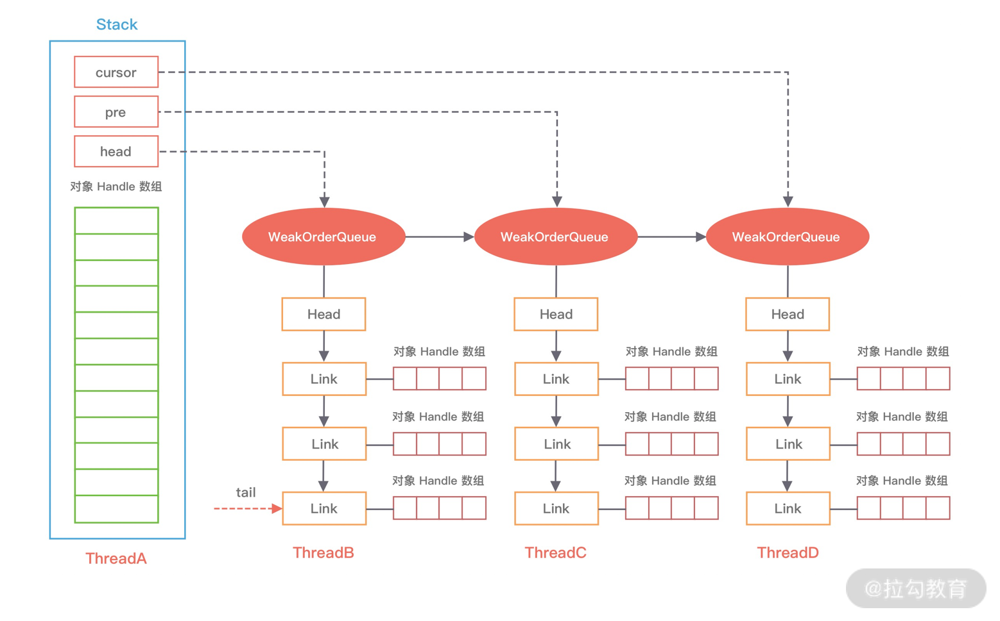
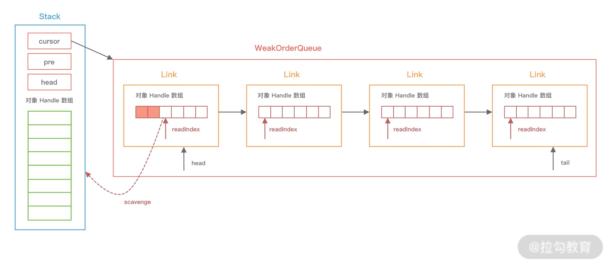

15 轻量级对象回收站：Recycler 对象池技术解析
============================

前面两节课，我们学习了 Netty 内存池的高性能设计原理，这节课会介绍 Netty 的另一种池化技术：Recycler 对象池。在刚接触到 Netty 对象池这个概念时，你是不是也会有类似的疑问：

* 对象池和内存池有什么区别？它们有什么联系吗？
* 实现对象池的方法有很多，Netty 也是自己实现的吗？是如何实现的？
* 对象池在实践中我们应该怎么使用？

带着这些问题，我们进入今天课程的学习吧。

### Recycler 快速上手

我们通过一个例子直观感受下 Recycler 如何使用，假设我们有一个 User 类，需要实现 User 对象的复用，具体实现代码如下：

```
public class UserCache {
    private static final Recycler<User> userRecycler = new Recycler<User>() {
        @Override
        protected User newObject(Handle<User> handle) {
            return new User(handle);
        }
    };
    static final class User {
        private String name;
        private Recycler.Handle<User> handle;
        public void setName(String name) {
            this.name = name;
        }
        public String getName() {
            return name;
        }
        public User(Recycler.Handle<User> handle) {
            this.handle = handle;
        }
        public void recycle() {
            handle.recycle(this);
        }
    }
    public static void main(String[] args) {
        User user1 = userRecycler.get(); // 1、从对象池获取 User 对象
        user1.setName("hello"); // 2、设置 User 对象的属性
        user1.recycle(); // 3、回收对象到对象池
        User user2 = userRecycler.get(); // 4、从对象池获取对象
        System.out.println(user2.getName());
        System.out.println(user1 == user2);
    }
}

```

控制台的输出结果如下：

```
hello
true

```

代码示例中定义了对象池实例 userRecycler，其中实现了 newObject() 方法，如果对象池没有可用的对象，会调用该方法新建对象。此外需要创建 Recycler.Handle 对象与 User 对象进行绑定，这样我们就可以通过 userRecycler.get() 从对象池中获取 User 对象，如果对象不再使用，通过调用 User 类实现的 recycle() 方法即可完成回收对象到对象池。

Recycler 的使用方式是不是特别简单，我们可以单独把它当作工具类在项目中使用。

### Recycler 的设计理念

对象池与内存池的都是为了提高 Netty 的并发处理能力，我们知道 Java 中频繁地创建和销毁对象的开销是很大的，所以很多人会将一些通用对象缓存起来，当需要某个对象时，优先从对象池中获取对象实例。通过重用对象，不仅避免频繁地创建和销毁所带来的性能损耗，而且对 JVM GC 是友好的，这就是对象池的作用。

Recycler 是 Netty 提供的自定义实现的轻量级对象回收站，借助 Recycler 可以完成对象的获取和回收。既然 Recycler 是 Netty 自己实现的对象池，那么它是如何设计的呢？首先看下 Recycler 的内部结构，如下图所示：


通过 Recycler 的 UML 图可以看出，一共包含四个核心组件： **Stack** 、**WeakOrderQueue **、** Link **、** DefaultHandle**，接下来我们逐一进行介绍。

首先我们先看下整个 Recycler 的内部结构中各个组件的关系，可以通过下面这幅图进行描述。



第一个核心组件是 Stack，Stack 是整个对象池的顶层数据结构，描述了整个对象池的构造，用于存储当前本线程回收的对象。在多线程的场景下，Netty 为了避免锁竞争问题，每个线程都会持有各自的对象池，内部通过 FastThreadLocal 来实现每个线程的私有化。FastThreadLocal 你可以理解为 Java 里的 ThreadLocal，后续会有专门的课程介绍它。

我们有必要先学习下 Stack 的数据结构，先看下 Stack 的源码定义：

```
static final class Stack<T> {
    final Recycler<T> parent; // 所属的 Recycler
    final WeakReference<Thread> threadRef; // 所属线程的弱引用

    final AtomicInteger availableSharedCapacity; // 异线程回收对象时，其他线程能保存的被回收对象的最大个数
    final int maxDelayedQueues; // WeakOrderQueue最大个数
    private final int maxCapacity; // 对象池的最大大小，默认最大为 4k
    private final int ratioMask; // 控制对象的回收比率，默认只回收 1/8 的对象
    private DefaultHandle<?>[] elements; // 存储缓存数据的数组
    private int size; // 缓存的 DefaultHandle 对象个数
    private int handleRecycleCount = -1; 

    // WeakOrderQueue 链表的三个重要节点
    private WeakOrderQueue cursor, prev;
    private volatile WeakOrderQueue head;

    // 省略其他代码
}

```

对应上面 Recycler 的内部结构图，Stack 包用于存储缓存数据的 DefaultHandle 数组，以及维护了 WeakOrderQueue 链表中的三个重要节点，关于 WeakOrderQueue 相关概念我们之后再详细介绍。除此之外，Stack 其他的重要属性我在源码中已经全部以注释的形式标出，大部分已经都非常清楚，其中 availableSharedCapacity 是比较难理解的，每个 Stack 会维护一个 WeakOrderQueue 的链表，每个 WeakOrderQueue 节点会保存非当前线程的其他线程所释放的对象，例如图中 ThreadA 表示当前线程，WeakOrderQueue 的链表存储着 ThreadB、ThreadC 等其他线程释放的对象。availableSharedCapacity 的初始化方式为 new AtomicInteger(max(maxCapacity / maxSharedCapacityFactor, LINK\_CAPACITY))，默认大小为 16K，其他线程在回收对象时，最多可以回收 ThreadA 创建的对象个数不能超过 availableSharedCapacity。还有一个疑问就是既然 Stack 是每个线程私有的，为什么 availableSharedCapacity 还需要用 AtomicInteger 呢？因为 ThreadB、ThreadC 等多个线程可能都会创建 ThreadA 的 WeakOrderQueue，存在同时操作 availableSharedCapacity 的情况。

第二个要介绍的组件是 WeakOrderQueue，WeakOrderQueue 用于存储其他线程回收到当前线程所分配的对象，并且在合适的时机，Stack 会从异线程的 WeakOrderQueue 中收割对象。如上图所示，ThreadB 回收到 ThreadA 所分配的内存时，就会被放到 ThreadA 的 WeakOrderQueue 当中。

第三个组件是 Link，每个 WeakOrderQueue 中都包含一个 Link 链表，回收对象都会被存在 Link 链表中的节点上，每个 Link 节点默认存储 16 个对象，当每个 Link 节点存储满了会创建新的 Link 节点放入链表尾部。

第四个组件是 DefaultHandle，DefaultHandle 实例中保存了实际回收的对象，Stack 和 WeakOrderQueue 都使用 DefaultHandle 存储回收的对象。在 Stack 中包含一个 elements 数组，该数组保存的是 DefaultHandle 实例。DefaultHandle 中每个 Link 节点所存储的 16 个对象也是使用 DefaultHandle 表示的。

到此为止，我们已经介绍完 Recycler 的内存结构，对 Recycler 有了初步的认识。Recycler 作为一个高性能的对象池，在多线程的场景下，Netty 是如何保证 Recycler 高效地分配和回收对象的呢？接下来我们一起看下 Recycler 对象获取和回收的原理。

### 从 Recycler 中获取对象

前面我们介绍了 Recycler 如何使用，从代码示例中可以看出，从对象池中获取对象的入口是在 Recycler#get() 方法，直接定位到源码：

```
public final T get() {
    if (maxCapacityPerThread == 0) {
        return newObject((Handle<T>) NOOP_HANDLE);
    }
    Stack<T> stack = threadLocal.get(); // 获取当前线程缓存的 Stack
    DefaultHandle<T> handle = stack.pop(); // 从 Stack 中弹出一个 DefaultHandle 对象
    if (handle == null) {
        handle = stack.newHandle();
        handle.value = newObject(handle); // 创建的对象并保存到 DefaultHandle
    }
    return (T) handle.value;
}

```

Recycler#get() 方法的逻辑非常清晰，首先通过 FastThreadLocal 获取当前线程的唯一栈缓存 Stack，然后尝试从栈顶弹出 DefaultHandle 对象实例，如果 Stack 中没有可用的 DefaultHandle 对象实例，那么会调用 newObject 生成一个新的对象，完成 handle 与用户对象和 Stack 的绑定。

那么 Stack 是如何从 elements 数组中弹出 DefaultHandle 对象实例的呢？只是从 elements 数组中取出一个实例吗？我们一起跟进下 stack.pop() 的源码：

```
DefaultHandle<T> pop() {
    int size = this.size;
    if (size == 0) {
        // 就尝试从其他线程回收的对象中转移一些到 elements 数组当中
        if (!scavenge()) {
            return null;
        }
        size = this.size;
    }
    size --;
    DefaultHandle ret = elements[size]; // 将实例从栈顶弹出
    elements[size] = null;
    if (ret.lastRecycledId != ret.recycleId) {
        throw new IllegalStateException("recycled multiple times");
    }
    ret.recycleId = 0;
    ret.lastRecycledId = 0;
    this.size = size;
    return ret;
}

```

如果 Stack 的 elements 数组中有可用的对象实例，直接将对象实例弹出；如果 elements 数组中没有可用的对象实例，会调用 scavenge 方法，scavenge 的作用是从其他线程回收的对象实例中转移一些到 elements 数组当中，也就是说，它会想办法从 WeakOrderQueue 链表中迁移部分对象实例。每个 Stack 会有一个 WeakOrderQueue 链表，每个 WeakOrderQueue 节点都维持了相应异线程回收的对象，那么以什么样的策略从 WeakOrderQueue 链表中迁移对象实例呢？继续跟进 scavenge 的源码：

```
boolean scavenge() {
    // 尝试从 WeakOrderQueue 中转移对象实例到 Stack 中
    if (scavengeSome()) {
        return true;
    }
    // 如果迁移失败，就会重置 cursor 指针到 head 节点
    prev = null;
    cursor = head;
    return false;
}
boolean scavengeSome() {
    WeakOrderQueue prev;
    WeakOrderQueue cursor = this.cursor; // cursor 指针指向当前 WeakorderQueueu 链表的读取位置
    // 如果 cursor 指针为 null, 则是第一次从 WeakorderQueueu 链表中获取对象
    if (cursor == null) {
        prev = null;
        cursor = head;
        if (cursor == null) {
            return false;
        }
    } else {
        prev = this.prev;
    }
    boolean success = false;
    // 不断循环从 WeakOrderQueue 链表中找到一个可用的对象实例
    do {
        // 尝试迁移 WeakOrderQueue 中部分对象实例到 Stack 中
        if (cursor.transfer(this)) {
            success = true;
            break;
        }
        WeakOrderQueue next = cursor.next;
        if (cursor.owner.get() == null) {
            // 如果已退出的线程还有数据
            if (cursor.hasFinalData()) {
                for (;;) {
                    if (cursor.transfer(this)) {
                        success = true;
                    } else {
                        break;
                    }
                }
            }
            // 将已退出的线程从 WeakOrderQueue 链表中移除
            if (prev != null) {
                prev.setNext(next);
            }
        } else {
            prev = cursor;
        }
        // 将 cursor 指针指向下一个 WeakOrderQueue
        cursor = next;
    } while (cursor != null && !success);
    this.prev = prev;
    this.cursor = cursor;
    return success;
}

```

scavenge 的源码中首先会从 cursor 指针指向的 WeakOrderQueue 节点回收部分对象到 Stack 的 elements 数组中，如果没有回收到数据就会将 cursor 指针移到下一个 WeakOrderQueue，重复执行以上过程直至回到到对象实例为止。具体的流程可以结合下图来理解。

 此外，每次移动 cursor 时，都会检查 WeakOrderQueue 对应的线程是否已经退出了，如果线程已经退出，那么线程中的对象实例都会被回收，然后将 WeakOrderQueue 节点从链表中移除。

还有一个问题，每次 Stack 从 WeakOrderQueue 链表会回收多少数据呢？我们依然结合上图讲解，每个 WeakOrderQueue 中都包含一个 Link 链表，Netty 每次会回收其中的一个 Link 节点所存储的对象。从图中可以看出，Link 内部会包含一个读指针 readIndex，每个 Link 节点默认存储 16 个对象，读指针到链表尾部就是可以用于回收的对象实例，每次回收对象时，readIndex 都会从上一次记录的位置开始回收。

在回收对象实例之前，Netty 会计算出可回收对象的数量，加上 Stack 中已有的对象数量后，如果超过 Stack 的当前容量且小于 Stack 的最大容量，会对 Stack 进行扩容。为了防止回收对象太多导致 Stack 的容量激增，在每次回收时 Netty 会调用 dropHandle 方法控制回收频率，具体源码如下：

```
boolean dropHandle(DefaultHandle<?> handle) {
    if (!handle.hasBeenRecycled) {
        if ((++handleRecycleCount & ratioMask) != 0) {
            // Drop the object.
            return true;
        }
        handle.hasBeenRecycled = true;
    }
    return false;
}

```

dropHandle 方法中主要靠 hasBeenRecycled 和 handleRecycleCount 两个变量控制回收的频率，会从每 8 个未被收回的对象中选取一个进行回收，其他的都被丢弃掉。

到此为止，从 Recycler 中获取对象的主流程已经讲完了，简单总结为两点：

* 当 Stack 中 elements 有数据时，直接从栈顶弹出。
* 当 Stack 中 elements 没有数据时，尝试从 WeakOrderQueue 中回收一个 Link 包含的对象实例到 Stack 中，然后从栈顶弹出。

### Recycler 对象回收原理

理解了如何从 Recycler 获取对象之后，再学习 Recycler 对象回收的原理就会清晰很多了，同样上文代码示例中定位到对象回收的源码入口 DefaultHandle#recycle()。

```
// DefaultHandle#recycle
public void recycle(Object object) {
    if (object != value) {
        throw new IllegalArgumentException("object does not belong to handle");
    }
    Stack<?> stack = this.stack;
    if (lastRecycledId != recycleId || stack == null) {
        throw new IllegalStateException("recycled already");
    }
    stack.push(this);
}
// Stack#push
void push(DefaultHandle<?> item) {
    Thread currentThread = Thread.currentThread();
    if (threadRef.get() == currentThread) {
        pushNow(item);
    } else {
        pushLater(item, currentThread);
    }
}

```

从源码中可以看出，在回收对象时，会向 Stack 中 push 对象，push 会分为同线程回收和异线程回收两种情况，分别对应 pushNow 和 pushLater 两个方法，我们逐一进行分析。

#### 同线程对象回收

如果是当前线程回收自己分配的对象时，会调用 pushNow 方法：

```
private void pushNow(DefaultHandle<?> item) {
    if ((item.recycleId | item.lastRecycledId) != 0) { // 防止被多次回收
        throw new IllegalStateException("recycled already");
    }
    item.recycleId = item.lastRecycledId = OWN_THREAD_ID;
    int size = this.size;
    // 1. 超出最大容量 2. 控制回收速率
    if (size >= maxCapacity || dropHandle(item)) {
        return;
    }
    if (size == elements.length) {
        elements = Arrays.copyOf(elements, min(size << 1, maxCapacity));
    }
    elements[size] = item;
    this.size = size + 1;
}

```

同线程回收对象的逻辑非常简单，就是直接向 Stack 的 elements 数组中添加数据，对象会被存放在栈顶指针指向的位置。如果超过了 Stack 的最大容量，那么对象会被直接丢弃，同样这里使用了 dropHandle 方法控制对象的回收速率，每 8 个对象会有一个被回收到 Stack 中。

#### 异线程对象回收

接下来我们分析异线程对象回收的场景，想必你已经猜到，异线程回收对象时，并不会添加到 Stack 中，而是会与 WeakOrderQueue 直接打交道，先看下 pushLater 的源码：

```
private void pushLater(DefaultHandle<?> item, Thread thread) {
    Map<Stack<?>, WeakOrderQueue> delayedRecycled = DELAYED_RECYCLED.get(); // 当前线程帮助其他线程回收对象的缓存
    WeakOrderQueue queue = delayedRecycled.get(this); // 取出对象绑定的 Stack 对应的 WeakOrderQueue
    if (queue == null) {
        // 最多帮助 2*CPU 核数的线程回收线程
        if (delayedRecycled.size() >= maxDelayedQueues) {
            delayedRecycled.put(this, WeakOrderQueue.DUMMY); // WeakOrderQueue.DUMMY 表示当前线程无法再帮助该 Stack 回收对象
            return;
        }
        // 新建 WeakOrderQueue
        if ((queue = WeakOrderQueue.allocate(this, thread)) == null) {
            // drop object
            return;
        }
        delayedRecycled.put(this, queue);
    } else if (queue == WeakOrderQueue.DUMMY) {
        // drop object
        return;
    }
    queue.add(item); // 添加对象到 WeakOrderQueue 的 Link 链表中
}

```

pushLater 的实现过程可以总结为两个步骤： **获取 WeakOrderQueue** ，**添加对象到 WeakOrderQueue 中**。

首先看下如何获取 WeakOrderQueue 对象。通过 FastThreadLocal 取出当前对象的 DELAYED\_RECYCLED 缓存，DELAYED\_RECYCLED 存放着当前线程帮助其他线程回收对象的映射关系。假如 item 是 ThreadA 分配的对象，当前线程是 ThreadB，此时 ThreadB 帮助 ThreadA 回收 item，那么 DELAYED\_RECYCLED 放入的 key 是 StackA。然后从 delayedRecycled 中取出 StackA 对应的 WeakOrderQueue，如果 WeakOrderQueue 不存在，那么为 StackA 新创建一个 WeakOrderQueue，并将其加入 DELAYED\_RECYCLED 缓存。WeakOrderQueue.allocate() 会检查帮助 StackA 回收的对象总数是否超过 2K 个，如果没有超过 2K，会将 StackA 的 head 指针指向新创建的 WeakOrderQueue，否则不再为 StackA 回收对象。

当然 ThreadB 不会只帮助 ThreadA 回收对象，它可以帮助其他多个线程回收，所以 DELAYED\_RECYCLED 使用的 Map 结构，为了防止 DELAYED\_RECYCLED 内存膨胀，Netty 也采取了保护措施，从 delayedRecycled.size() >= maxDelayedQueues 可以看出，每个线程最多帮助 2 倍 CPU 核数的线程回收线程，如果超过了该阈值，假设当前对象绑定的为 StackX，那么将在 Map 中为 StackX 放入一种特殊的 WeakOrderQueue.DUMMY，表示当前线程无法帮助 StackX 回收对象。

接下来我们继续分析对象是如何被添加到 WeakOrderQueue 的，直接跟进 queue.add(item) 的源码：

```
void add(DefaultHandle<?> handle) {
    handle.lastRecycledId = id;
    Link tail = this.tail;
    int writeIndex;
    // 如果链表尾部的 Link 已经写满，那么再新建一个 Link 追加到链表尾部
    if ((writeIndex = tail.get()) == LINK_CAPACITY) {
        // 检查是否超过对应 Stack 可以存放的其他线程帮助回收的最大对象数
        if (!head.reserveSpace(LINK_CAPACITY)) {
            // Drop it.
            return;
        }
        this.tail = tail = tail.next = new Link();
        writeIndex = tail.get();
    }
    tail.elements[writeIndex] = handle; // 添加对象到 Link 尾部
    handle.stack = null; // handle 的 stack 属性赋值为 null
    tail.lazySet(writeIndex + 1);
}

```

在向 WeakOrderQueue 写入对象之前，会先判断 Link 链表的 tail 节点是否还有空间存放对象。如果还有空间，直接向 tail Link 尾部写入数据，否则直接丢弃对象。如果 tail Link 已经没有空间，会新建一个 Link 之后再存放对象，新建 Link 之前会检查异线程帮助回收的对象总数超过了 Stack 设置的阈值，如果超过了阈值，那么对象也会被丢弃掉。

对象被添加到 Link 之后，handle 的 stack 属性被赋值为 null，而在取出对象的时候，handle 的 stack 属性又再次被赋值回来，为什么这么做呢，岂不是很麻烦？如果 Stack 不再使用，期望被 GC 回收，发现 handle 中还持有 Stack 的引用，那么就无法被 GC 回收，从而造成内存泄漏。

到此为止，Recycler 如何回收对象的实现原理就全部分析完了，在多线程的场景下，Netty 考虑的还是非常细致的，Recycler 回收对象时向 WeakOrderQueue 中存放对象，从 Recycler 获取对象时，WeakOrderQueue 中的对象会作为 Stack 的储备，而且有效地解决了跨线程回收的问题，是一个挺新颖别致的设计。

### Recycler 在 Netty 中的应用

Recycler 在 Netty 里面使用也是非常频繁的，我们直接看下 Netty 源码中 newObject 相关的引用，如下图所示。


其中比较常用的有 PooledHeapByteBuf 和 PooledDirectByteBuf，分别对应的堆内存和堆外内存的池化实现。例如我们在使用 PooledDirectByteBuf 的时候，并不是每次都去创建新的对象实例，而是从对象池中获取预先分配好的对象实例，不再使用 PooledDirectByteBuf 时，被回收归还到对象池中。

此外，可以看到内存池的 MemoryRegionCache 也有使用到对象池，MemoryRegionCache 中保存着一个队列，队列中每个 Entry 节点用于保存内存块，Entry 节点在 Netty 中就是以对象池的形式进行分配和释放，在这里我就不展开了，建议你翻阅下源码，学习下 Entry 节点是何时被分配和释放的，从而加深下对 Recycler 对象池的理解。

### 总结

最后，简单总结下对象池几个重要的知识点：

* 对象池有两个重要的组成部分：Stack 和 WeakOrderQueue。
* 从 Recycler 获取对象时，优先从 Stack 中查找，如果 Stack 没有可用对象，会尝试从 WeakOrderQueue 迁移部分对象到 Stack 中。
* Recycler 回收对象时，分为同线程对象回收和异线程对象回收两种情况，同线程回收直接向 Stack 中添加对象，异线程回收向 WeakOrderQueue 中的 Link 添加对象。
* 对象回收都会控制回收速率，每 8 个对象会回收一个，其他的全部丢弃。

学完内存池、对象池的设计之后，相信你已经有很大的收获，同时也感受到学好数据结构是多么重要。为了避免依赖，Netty 并没有借助第三方库实现对象池，而是采用了独特的思路自己实现了一个轻量级的对象池，其中优秀的设计思路在开发中是非常值得借鉴的。如果你已经理解了 Recycler，你可以直接在项目中当成工具类使用它，在一些高并发的场景下能够较好地提升应用的性能。
