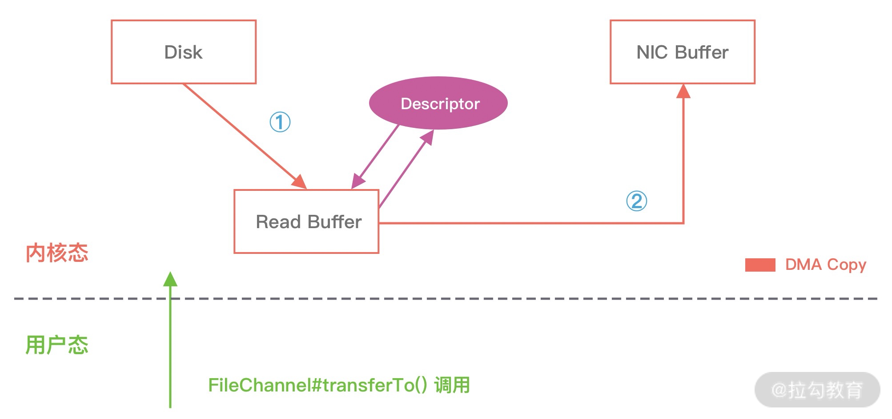
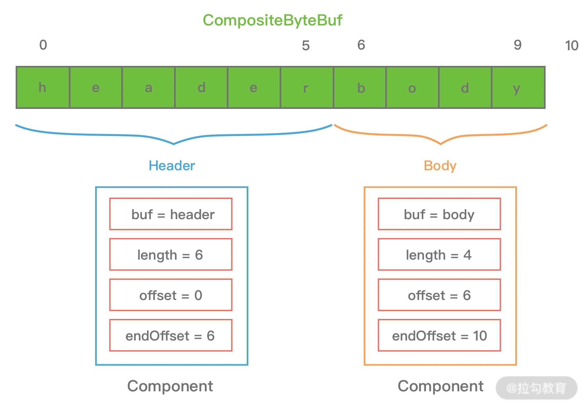
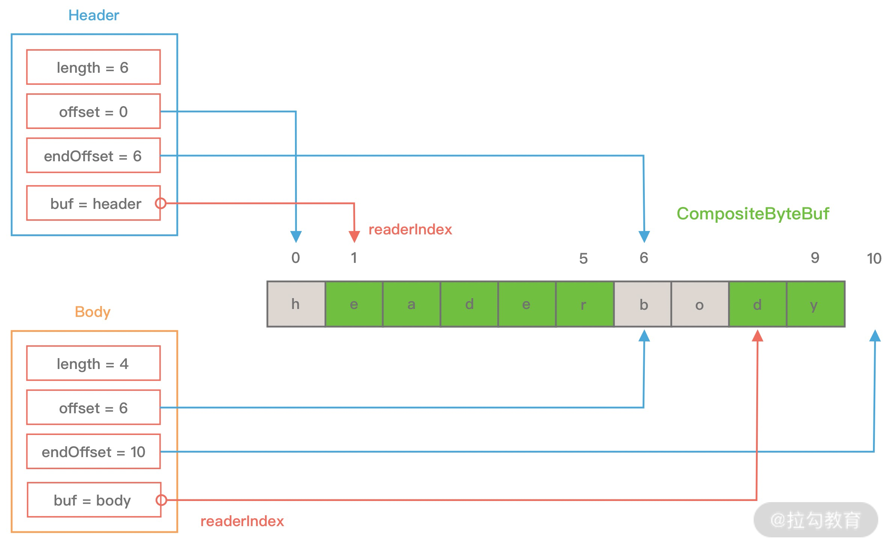
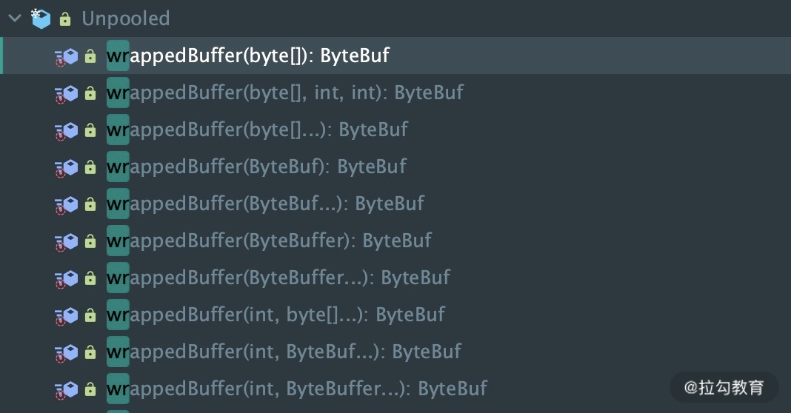

# 16 IO 加速：与众不同的 Netty 零拷贝技术

今天的课程我们继续讨论 Netty 实现高性能的另一个高阶特性——零拷贝。零拷贝是一个耳熟能详的词语，在 Linux、Kafka、RocketMQ 等知名的产品中都有使用，通常用于提升 I/O 性能。而且零拷贝也是面试过程中的高频问题，那么你知道零拷贝体现在哪些地方吗？Netty 的零拷贝技术又是如何实现的呢？接下来我们就针对 Netty 零拷贝特性进行详细地分析。

### 传统 Linux 中的零拷贝技术

在介绍 Netty 零拷贝特性之前，我们有必要学习下传统 Linux 中零拷贝的工作原理。所谓零拷贝，就是在数据操作时，不需要将数据从一个内存位置拷贝到另外一个内存位置，这样可以减少一次内存拷贝的损耗，从而节省了 CPU 时钟周期和内存带宽。

我们模拟一个场景，从文件中读取数据，然后将数据传输到网络上，那么传统的数据拷贝过程会分为哪几个阶段呢？具体如下图所示。


从上图中可以看出，从数据读取到发送一共经历了 **四次数据拷贝** ，具体流程如下：

1. 当用户进程发起 read() 调用后，上下文从用户态切换至内核态。DMA 引擎从文件中读取数据，并存储到内核态缓冲区，这里是 **第一次数据拷贝** 。
1. 请求的数据从内核态缓冲区拷贝到用户态缓冲区，然后返回给用户进程。第二次数据拷贝的过程同时，会导致上下文从内核态再次切换到用户态。
1. 用户进程调用 send() 方法期望将数据发送到网络中，此时会触发第三次线程切换，用户态会再次切换到内核态，请求的数据从用户态缓冲区被拷贝到 Socket 缓冲区。
1. 最终 send() 系统调用结束返回给用户进程，发生了第四次上下文切换。第四次拷贝会异步执行，从 Socket 缓冲区拷贝到协议引擎中。

> 说明：DMA（Direct Memory Access，直接内存存取）是现代大部分硬盘都支持的特性，DMA 接管了数据读写的工作，不需要 CPU 再参与 I/O 中断的处理，从而减轻了 CPU 的负担。

传统的数据拷贝过程为什么不是将数据直接传输到用户缓冲区呢？其实引入内核缓冲区可以充当缓存的作用，这样就可以实现文件数据的预读，提升 I/O 的性能。但是当请求数据量大于内核缓冲区大小时，在完成一次数据的读取到发送可能要经历数倍次数的数据拷贝，这就造成严重的性能损耗。

接下来我们介绍下使用零拷贝技术之后数据传输的流程。重新回顾一遍传统数据拷贝的过程，可以发现第二次和第三次拷贝是可以去除的，DMA 引擎从文件读取数据后放入到内核缓冲区，然后可以直接从内核缓冲区传输到 Socket 缓冲区，从而减少内存拷贝的次数。

在 Linux 中系统调用 sendfile() 可以实现将数据从一个文件描述符传输到另一个文件描述符，从而实现了零拷贝技术。在 Java 中也使用了零拷贝技术，它就是 NIO FileChannel 类中的 transferTo() 方法，transferTo() 底层就依赖了操作系统零拷贝的机制，它可以将数据从 FileChannel 直接传输到另外一个 Channel。transferTo() 方法的定义如下：

```plaintext
public abstract long transferTo(long position, long count, WritableByteChannel target) throws IOException;
```

FileChannel#transferTo() 的使用也非常简单，我们直接看如下的代码示例，通过 transferTo() 将 from.data 传输到 to.data()，等于实现了文件拷贝的功能。

```java
public void testTransferTo() throws IOException {
    RandomAccessFile fromFile = new RandomAccessFile("from.data", "rw");
    FileChannel fromChannel = fromFile.getChannel();
    RandomAccessFile toFile = new RandomAccessFile("to.data", "rw");
    FileChannel toChannel = toFile.getChannel();
    long position = 0;
    long count = fromChannel.size();
    fromChannel.transferTo(position, count, toChannel);
}
```

在使用了 FileChannel#transferTo() 传输数据之后，我们看下数据拷贝流程发生了哪些变化，如下图所示：


比较大的一个变化是，DMA 引擎从文件中读取数据拷贝到内核态缓冲区之后，由操作系统直接拷贝到 Socket 缓冲区，不再拷贝到用户态缓冲区，所以数据拷贝的次数从之前的 4 次减少到 3 次。

但是上述的优化离达到零拷贝的要求还是有差距的，能否继续减少内核中的数据拷贝次数呢？在 Linux 2.4 版本之后，开发者对 Socket Buffer 追加一些 Descriptor 信息来进一步减少内核数据的复制。如下图所示，DMA 引擎读取文件内容并拷贝到内核缓冲区，然后并没有再拷贝到 Socket 缓冲区，只是将数据的长度以及位置信息被追加到 Socket 缓冲区，然后 DMA 引擎根据这些描述信息，直接从内核缓冲区读取数据并传输到协议引擎中，从而消除最后一次 CPU 拷贝。



通过上述 Linux 零拷贝技术的介绍，你也许还会存在疑问，最终使用零拷贝之后，不是还存在着数据拷贝操作吗？其实从 Linux 操作系统的角度来说，零拷贝就是为了避免用户态和内存态之间的数据拷贝。无论是传统的数据拷贝还是使用零拷贝技术，其中有 2 次 DMA 的数据拷贝必不可少，只是这 2 次 DMA 拷贝都是依赖硬件来完成，不需要 CPU 参与。所以，在这里我们讨论的零拷贝是个广义的概念，只要能够减少不必要的 CPU 拷贝，都可以被称为零拷贝。

### Netty 的零拷贝技术

介绍完传统 Linux 的零拷贝技术之后，我们再来学习下 Netty 中的零拷贝如何实现。Netty 中的零拷贝和传统 Linux 的零拷贝不太一样。Netty 中的零拷贝技术除了操作系统级别的功能封装，更多的是面向用户态的数据操作优化，主要体现在以下 5 个方面：

- 堆外内存，避免 JVM 堆内存到堆外内存的数据拷贝。
- CompositeByteBuf 类，可以组合多个 Buffer 对象合并成一个逻辑上的对象，避免通过传统内存拷贝的方式将几个 Buffer 合并成一个大的 Buffer。
- 通过 Unpooled.wrappedBuffer 可以将 byte 数组包装成 ByteBuf 对象，包装过程中不会产生内存拷贝。
- ByteBuf.slice 操作与 Unpooled.wrappedBuffer 相反，slice 操作可以将一个 ByteBuf 对象切分成多个 ByteBuf 对象，切分过程中不会产生内存拷贝，底层共享一个 byte 数组的存储空间。
- Netty 使用 FileRegion 实现文件传输，FileRegion 底层封装了 FileChannel#transferTo() 方法，可以将文件缓冲区的数据直接传输到目标 Channel，避免内核缓冲区和用户态缓冲区之间的数据拷贝，这属于操作系统级别的零拷贝。

下面我们从以上 5 个方面逐一进行介绍。

#### 堆外内存

如果在 JVM 内部执行 I/O 操作时，必须将数据拷贝到堆外内存，才能执行系统调用。这是所有 VM 语言都会存在的问题。那么为什么操作系统不能直接使用 JVM 堆内存进行 I/O 的读写呢？主要有两点原因：第一，操作系统并不感知 JVM 的堆内存，而且 JVM 的内存布局与操作系统所分配的是不一样的，操作系统并不会按照 JVM 的行为来读写数据。第二，同一个对象的内存地址随着 JVM GC 的执行可能会随时发生变化，例如 JVM GC 的过程中会通过压缩来减少内存碎片，这就涉及对象移动的问题了。

Netty 在进行 I/O 操作时都是使用的堆外内存，可以避免数据从 JVM 堆内存到堆外内存的拷贝。

#### CompositeByteBuf

CompositeByteBuf 是 Netty 中实现零拷贝机制非常重要的一个数据结构，CompositeByteBuf 可以理解为一个虚拟的 Buffer 对象，它是由多个 ByteBuf 组合而成，但是在 CompositeByteBuf 内部保存着每个 ByteBuf 的引用关系，从逻辑上构成一个整体。比较常见的像 HTTP 协议数据可以分为 **头部信息 header** 和 **消息体数据 body** ，分别存在两个不同的 ByteBuf 中，通常我们需要将两个 ByteBuf 合并成一个完整的协议数据进行发送，可以使用如下方式完成：

```plaintext
ByteBuf httpBuf = Unpooled.buffer(header.readableBytes() + body.readableBytes());
httpBuf.writeBytes(header);
httpBuf.writeBytes(body);
```

可以看出，如果想实现 header 和 body 这两个 ByteBuf 的合并，需要先初始化一个新的 httpBuf，然后再将 header 和 body 分别拷贝到新的 httpBuf。合并过程中涉及两次 CPU 拷贝，这非常浪费性能。如果使用 CompositeByteBuf 如何实现类似的需求呢？如下所示：

```plaintext
CompositeByteBuf httpBuf = Unpooled.compositeBuffer();
httpBuf.addComponents(true, header, body);
```

CompositeByteBuf 通过调用 addComponents() 方法来添加多个 ByteBuf，但是底层的 byte 数组是复用的，不会发生内存拷贝。但对于用户来说，它可以当作一个整体进行操作。那么 CompositeByteBuf 内部是如何存放这些 ByteBuf，并且如何进行合并的呢？我们先通过一张图看下 CompositeByteBuf 的内部结构：


从图上可以看出，CompositeByteBuf 内部维护了一个 Components 数组。在每个 Component 中存放着不同的 ByteBuf，各个 ByteBuf 独立维护自己的读写索引，而 CompositeByteBuf 自身也会单独维护一个读写索引。由此可见，Component 是实现 CompositeByteBuf 的关键所在，下面看下 Component 结构定义：

```java
private static final class Component {
    final ByteBuf srcBuf; // 原始的 ByteBuf
    final ByteBuf buf; // srcBuf 去除包装之后的 ByteBuf
    int srcAdjustment; // CompositeByteBuf 的起始索引相对于 srcBuf 读索引的偏移
    int adjustment; // CompositeByteBuf 的起始索引相对于 buf 的读索引的偏移
    int offset; // Component 相对于 CompositeByteBuf 的起始索引位置
    int endOffset; // Component 相对于 CompositeByteBuf 的结束索引位置
    // 省略其他代码
}
```

为了方便理解上述 Component 中的属性含义，我同样以 HTTP 协议中 header 和 body 为示例，通过一张图来描述 CompositeByteBuf 组合后其中 Component 的布局情况，如下所示：



从图中可以看出，header 和 body 分别对应两个 ByteBuf，假设 ByteBuf 的内容分别为 "header" 和 "body"，那么 header ByteBuf 中 offset~endOffset 为 0~6，body ByteBuf 对应的 offset~endOffset 为 0~10。由此可见，Component 中的 offset 和 endOffset 可以表示当前 ByteBuf 可以读取的范围，通过 offset 和 endOffset 可以将每一个 Component 所对应的 ByteBuf 连接起来，形成一个逻辑整体。

此外 Component 中 srcAdjustment 和 adjustment 表示 CompositeByteBuf 起始索引相对于 ByteBuf 读索引的偏移。初始 adjustment = readIndex - offset，这样通过 CompositeByteBuf 的起始索引就可以直接定位到 Component 中 ByteBuf 的读索引位置。当 header ByteBuf 读取 1 个字节，body ByteBuf 读取 2 个字节，此时每个 Component 的属性又会发生什么变化呢？如下图所示。



至此，CompositeByteBuf 的基本原理我们已经介绍完了，关于具体 CompositeByteBuf 数据操作的细节在这里就不做展开了，有兴趣的同学可以自己深入研究 CompositeByteBuf 的源码。

#### Unpooled.wrappedBuffer 操作

介绍完 CompositeByteBuf 之后，再来理解 Unpooled.wrappedBuffer 操作就非常容易了，Unpooled.wrappedBuffer 同时也是创建 CompositeByteBuf 对象的另一种推荐做法。

Unpooled 提供了一系列用于包装数据源的 wrappedBuffer 方法，如下所示：



Unpooled.wrappedBuffer 方法可以将不同的数据源的一个或者多个数据包装成一个大的 ByteBuf 对象，其中数据源的类型包括 byte\[\]、ByteBuf、ByteBuffer。包装的过程中不会发生数据拷贝操作，包装后生成的 ByteBuf 对象和原始 ByteBuf 对象是共享底层的 byte 数组。

#### ByteBuf.slice 操作

ByteBuf.slice 和 Unpooled.wrappedBuffer 的逻辑正好相反，ByteBuf.slice 是将一个 ByteBuf 对象切分成多个共享同一个底层存储的 ByteBuf 对象。

ByteBuf 提供了两个 slice 切分方法:

```plaintext
public ByteBuf slice();
public ByteBuf slice(int index, int length);
```

假设我们已经有一份完整的 HTTP 数据，可以通过 slice 方法切分获得 header 和 body 两个 ByteBuf 对象，对应的内容分别为 "header" 和 "body"，实现方式如下：

```plaintext
ByteBuf httpBuf = ...
ByteBuf header = httpBuf.slice(0, 6);
ByteBuf body = httpBuf.slice(6, 4);
```

通过 slice 切分后都会返回一个新的 ByteBuf 对象，而且新的对象有自己独立的 readerIndex、writerIndex 索引，如下图所示。由于新的 ByteBuf 对象与原始的 ByteBuf 对象数据是共享的，所以通过新的 ByteBuf 对象进行数据操作也会对原始 ByteBuf 对象生效。


#### 文件传输 FileRegion

在 Netty 源码的 example 包中，提供了 FileRegion 的使用示例，以下代码片段摘自 FileServerHandler.java。

```java
@Override
public void channelRead0(ChannelHandlerContext ctx, String msg) throws Exception {
    RandomAccessFile raf = null;
    long length = -1;
    try {
        raf = new RandomAccessFile(msg, "r");
        length = raf.length();
    } catch (Exception e) {
        ctx.writeAndFlush("ERR: " + e.getClass().getSimpleName() + ": " + e.getMessage() + '\n');
        return;
    } finally {
        if (length < 0 && raf != null) {
            raf.close();
        }
    }
    ctx.write("OK: " + raf.length() + '\n');
    if (ctx.pipeline().get(SslHandler.class) == null) {
        // SSL not enabled - can use zero-copy file transfer.
        ctx.write(new DefaultFileRegion(raf.getChannel(), 0, length));
    } else {
        // SSL enabled - cannot use zero-copy file transfer.
        ctx.write(new ChunkedFile(raf));
    }
    ctx.writeAndFlush("\n");
}
```

从 FileRegion 的使用示例可以看出，Netty 使用 FileRegion 实现文件传输的零拷贝。FileRegion 的默认实现类是 DefaultFileRegion，通过 DefaultFileRegion 将文件内容写入到 NioSocketChannel。那么 FileRegion 是如何实现零拷贝的呢？我们通过源码看看 FileRegion 到底使用了什么黑科技。

```java
public class DefaultFileRegion extends AbstractReferenceCounted implements FileRegion {
    private final File f; // 传输的文件
    private final long position; // 文件的起始位置
    private final long count; // 传输的字节数
    private long transferred; // 已经写入的字节数
    private FileChannel file; // 文件对应的 FileChannel
    @Override
    public long transferTo(WritableByteChannel target, long position) throws IOException {
        long count = this.count - position;
        if (count < 0 || position < 0) {
            throw new IllegalArgumentException(
                    "position out of range: " + position +
                    " (expected: 0 - " + (this.count - 1) + ')');
        }
        if (count == 0) {
            return 0L;
        }
        if (refCnt() == 0) {
            throw new IllegalReferenceCountException(0);
        }
        open();
        long written = file.transferTo(this.position + position, count, target);
        if (written > 0) {
            transferred += written;
        } else if (written == 0) {
            validate(this, position);
        }
        return written;
    }
    // 省略其他代码
}
```

从源码可以看出，FileRegion 其实就是对 FileChannel 的包装，并没有什么特殊操作，底层使用的是 JDK NIO 中的 FileChannel#transferTo() 方法实现文件传输，所以 FileRegion 是操作系统级别的零拷贝，对于传输大文件会很有帮助。

到此为止，Netty 相关的零拷贝技术都已经介绍完了，可以看出 Netty 对于 ByteBuf 做了更多精进的设计和优化。

### 总结

零拷贝是网络编程中一种常用的技术，可以用于优化网络数据传输的性能。本文介绍了操作系统 Linux 和 Netty 中的零拷贝技术，Netty 除了支持操作系统级别的零拷贝，更多提供了面向用户态的零拷贝特性，主要体现在 5 个方面：堆外内存、CompositeByteBuf、Unpooled.wrappedBuffer、ByteBuf.slice 以及 FileRegion。以操作系统的角度来看，零拷贝是一个广义的概念，可以认为只要能够减少不必要的 CPU 拷贝，都可以理解为是零拷贝。

最后，留一个思考题，使用具备零拷贝特性的 transfer() 方法拷贝文件，一定会比传统 I/O 的方式更高效吗？
