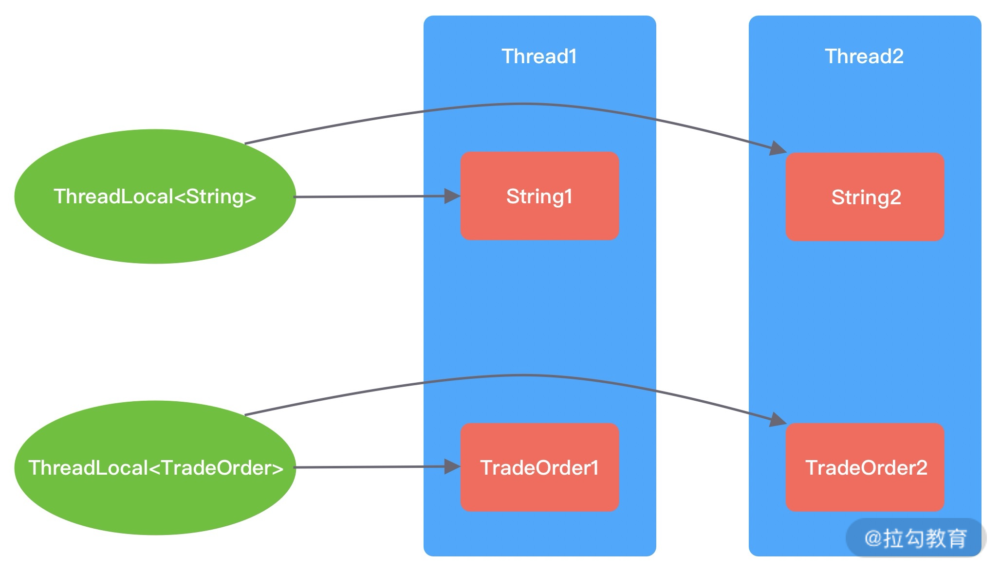
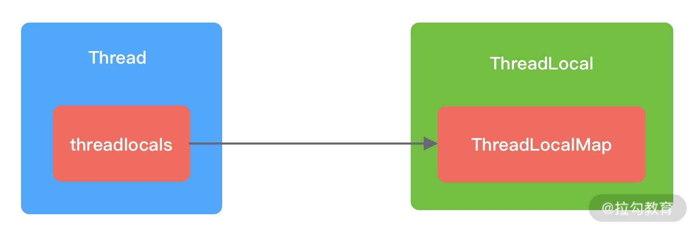
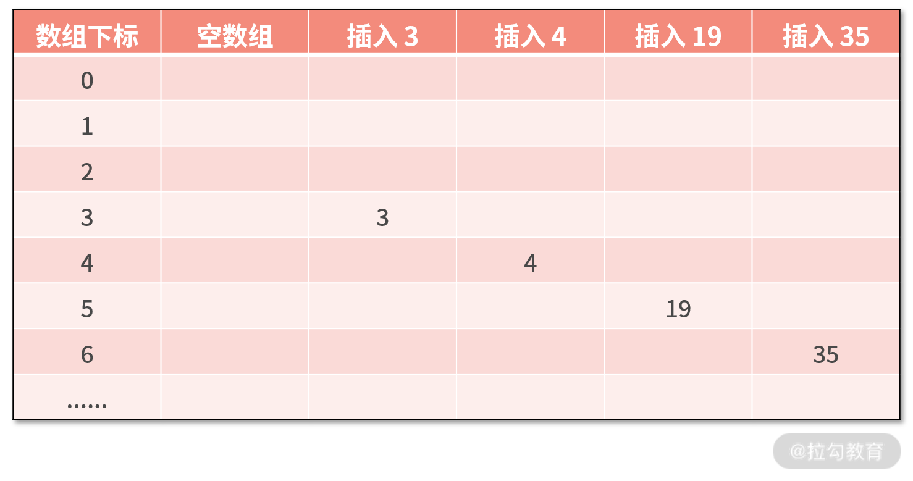
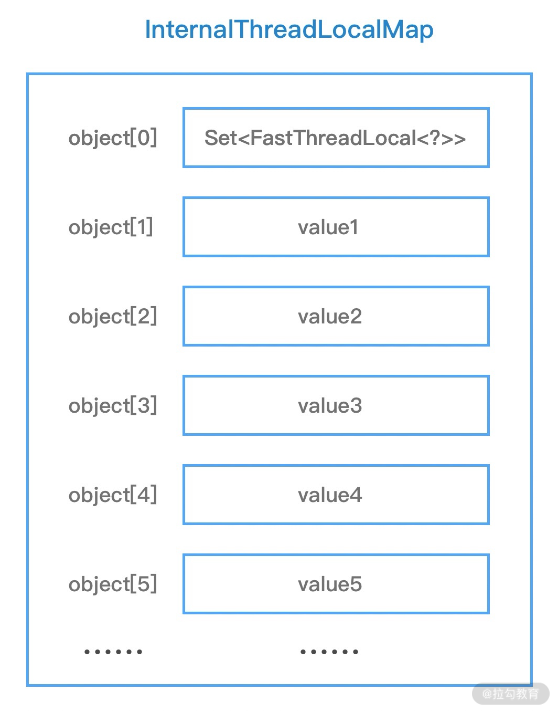
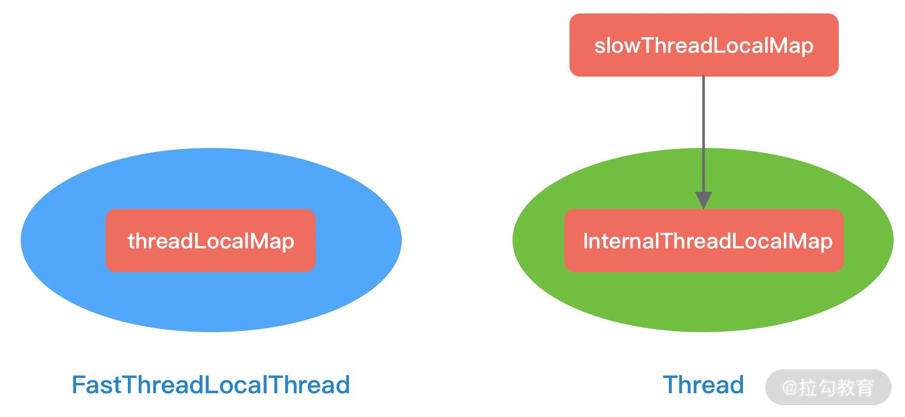

20 技巧篇：Netty 的 FastThreadLocal 究竟比 ThreadLocal 快在哪儿？
====================================================

在前面几篇源码解析的课程中，我们都有在源码中发现 FastThreadLocal 的身影。顾名思义，Netty 作为高性能的网络通信框架，FastThreadLocal 是比 JDK 自身的 ThreadLocal 性能更高的通信框架。FastThreadLocal 到底比 ThreadLocal 快在哪里呢？这节课我们就一起来探索 FastThreadLocal 高性能的奥秘。

> 说明：本文参考的 Netty 源码版本为 4.1.42.Final。

### JDK ThreadLocal 基本原理

JDK ThreadLocal 不仅是高频的面试知识点，而且在日常工作中也是常用一种工具，所以首先我们先学习下 Java 原生的 ThreadLocal 的实现原理，可以帮助我们更好地对比和理解 Netty 的 FastThreadLocal。

如果你需要变量在多线程之间隔离，或者在同线程内的类和方法中共享，那么 ThreadLocal 大显身手的时候就到了。ThreadLocal 可以理解为线程本地变量，它是 Java 并发编程中非常重要的一个类。ThreadLocal 为变量在每个线程中都创建了一个副本，该副本只能被当前线程访问，多线程之间是隔离的，变量不能在多线程之间共享。这样每个线程修改变量副本时，不会对其他线程产生影响。

接下来我们通过一个例子看下 ThreadLocal 如何使用：

```
public class ThreadLocalTest {
    private static final ThreadLocal<String> THREAD_NAME_LOCAL = ThreadLocal.withInitial(() -> Thread.currentThread().getName());
    private static final ThreadLocal<TradeOrder> TRADE_THREAD_LOCAL = new ThreadLocal<>();
    public static void main(String[] args) {
        for (int i = 0; i < 2; i++) {
            int tradeId = i;
            new Thread(() -> {
                TradeOrder tradeOrder = new TradeOrder(tradeId, tradeId % 2 == 0 ? "已支付" : "未支付");
                TRADE_THREAD_LOCAL.set(tradeOrder);
                System.out.println("threadName: " + THREAD_NAME_LOCAL.get());
                System.out.println("tradeOrder info：" + TRADE_THREAD_LOCAL.get());
            }, "thread-" + i).start();
        }
    }
    static class TradeOrder {
        long id;
        String status;
        public TradeOrder(int id, String status) {
            this.id = id;
            this.status = status;
        }
        @Override
        public String toString() {
            return "id=" + id + ", status=" + status;
        }
    }
}

```

在上述示例中，构造了 THREAD\_NAME\_LOCAL 和 TRADE\_THREAD\_LOCAL 两个 ThreadLocal 变量，分别用于记录当前线程名称和订单交易信息。ThreadLocal 是可以支持泛型的，THREAD\_NAME\_LOCAL 和 TRADE\_THREAD\_LOCAL 存放 String 类型和 TradeOrder 对象类型的数据，你可以通过 set()/get() 方法设置和读取 ThreadLocal 实例。一起看下示例代码的运行结果：

```
threadName: thread-0
threadName: thread-1
tradeOrder info：id=1, status=未支付
tradeOrder info：id=0, status=已支付

```

可以看出 thread-1 和 thread-2 虽然操作的是同一个 ThreadLocal 对象，但是它们取到了不同的线程名称和订单交易信息。那么一个线程内如何存在多个 ThreadLocal 对象，每个 ThreadLocal 对象是如何存储和检索的呢？

接下来我们看看 ThreadLocal 的实现原理。既然多线程访问 ThreadLocal 变量时都会有自己独立的实例副本，那么很容易想到的方案就是在 ThreadLocal 中维护一个 Map，记录线程与实例之间的映射关系。当新增线程和销毁线程时都需要更新 Map 中的映射关系，因为会存在多线程并发修改，所以需要保证 Map 是线程安全的。那么 JDK 的 ThreadLocal 是这么实现的吗？答案是 NO。因为在高并发的场景并发修改 Map 需要加锁，势必会降低性能。JDK 为了避免加锁，采用了相反的设计思路。以 Thread 入手，在 Thread 中维护一个 Map，记录 ThreadLocal 与实例之间的映射关系，这样在同一个线程内，Map 就不需要加锁了。示例代码中线程 Thread 和 ThreadLocal 的关系可以用以下这幅图表示。



那么在 Thread 内部，维护映射关系的 Map 是如何实现的呢？从源码中可以发现 Thread 使用的是 ThreadLocal 的内部类 ThreadLocalMap，所以 Thread、ThreadLocal 和 ThreadLocalMap 之间的关系可以用下图表示：



为了更加深入理解 ThreadLocal，了解 ThreadLocalMap 的内部实现是非常有必要的。ThreadLocalMap 其实与 HashMap 的数据结构类似，但是 ThreadLocalMap 不具备通用性，它是为 ThreadLocal 量身定制的。

ThreadLocalMap 是一种使用线性探测法实现的哈希表，底层采用数组存储数据。如下图所示，ThreadLocalMap 会初始化一个长度为 16 的 Entry 数组，每个 Entry 对象用于保存 key-value 键值对。与 HashMap 不同的是，Entry 的 key 就是 ThreadLocal 对象本身，value 就是用户具体需要存储的值。


当调用 ThreadLocal.set() 添加 Entry 对象时，是如何解决 Hash 冲突的呢？这就需要我们了解线性探测法的实现原理。每个 ThreadLocal 在初始化时都会有一个 Hash 值为 threadLocalHashCode，每增加一个 ThreadLocal， Hash 值就会固定增加一个魔术 HASH\_INCREMENT = 0x61c88647。为什么取 0x61c88647 这个魔数呢？实验证明，通过 0x61c88647 累加生成的 threadLocalHashCode 与 2 的幂取模，得到的结果可以较为均匀地分布在长度为 2 的幂大小的数组中。有了 threadLocalHashCode 的基础，下面我们通过下面的表格来具体讲解线性探测法是如何实现的。



为了便于理解，我们采用一组简单的数据模拟 ThreadLocal.set() 的过程是如何解决 Hash 冲突的。

1. threadLocalHashCode = 4，threadLocalHashCode & 15 = 4；此时数据应该放在数组下标为 4 的位置。下标 4 的位置正好没有数据，可以存放。
2. threadLocalHashCode = 19，threadLocalHashCode & 15 = 4；但是下标 4 的位置已经有数据了，如果当前需要添加的 Entry 与下标 4 位置已存在的 Entry 两者的 key 相同，那么该位置 Entry 的 value 将被覆盖为新的值。我们假设 key 都是不相同的，所以此时需要向后移动一位，下标 5 的位置没有冲突，可以存放。
3. threadLocalHashCode = 33，threadLocalHashCode & 15 = 3；下标 3 的位置已经有数据，向后移一位，下标 4 位置还是有数据，继续向后查找，发现下标 6 没有数据，可以存放。

ThreadLocal.get() 的过程也是类似的，也是根据 threadLocalHashCode 的值定位到数组下标，然后判断当前位置 Entry 对象与待查询 Entry 对象的 key 是否相同，如果不同，继续向下查找。由此可见，ThreadLocal.set()/get() 方法在数据密集时很容易出现 Hash 冲突，需要 O(n) 时间复杂度解决冲突问题，效率较低。

下面我们再聊聊 ThreadLocalMap 中 Entry 的设计原理。Entry 继承自弱引用类 WeakReference，Entry 的 key 是弱引用，value 是强引用。在 JVM 垃圾回收时，只要发现了弱引用的对象，不管内存是否充足，都会被回收。那么为什么 Entry 的 key 要设计成弱引用呢？我们试想下，如果 key 都是强引用，当 ThreadLocal 不再使用时，然而 ThreadLocalMap 中还是存在对 ThreadLocal 的强引用，那么 GC 是无法回收的，从而造成内存泄漏。

虽然 Entry 的 key 设计成了弱引用，但是当 ThreadLocal 不再使用被 GC 回收后，ThreadLocalMap 中可能出现 Entry 的 key 为 NULL，那么 Entry 的 value 一直会强引用数据而得不到释放，只能等待线程销毁。那么应该如何避免 ThreadLocalMap 内存泄漏呢？ThreadLocal 已经帮助我们做了一定的保护措施，在执行 ThreadLocal.set()/get() 方法时，ThreadLocal 会清除 ThreadLocalMap 中 key 为 NULL 的 Entry 对象，让它还能够被 GC 回收。除此之外，当线程中某个 ThreadLocal 对象不再使用时，立即调用 remove() 方法删除 Entry 对象。如果是在异常的场景中，记得在 finally 代码块中进行清理，保持良好的编码意识。

关于 JDK 的 ThreadLocal 的基本原理我们已经介绍完了，既然 ThreadLocal 已经非常成熟，而且在日常开发中也被广泛使用，Netty 为什么还要自己实现一个 FastThreadLocal 呢？性能真的比 ThreadLocal 高很多吗？我们接下来一起一探究竟。

### FastThreadLocal 为什么快

FastThreadLocal 的实现与 ThreadLocal 非常类似，Netty 为 FastThreadLocal 量身打造了 FastThreadLocalThread 和 InternalThreadLocalMap 两个重要的类。下面我们看下这两个类是如何实现的。

FastThreadLocalThread 是对 Thread 类的一层包装，每个线程对应一个 InternalThreadLocalMap 实例。只有 FastThreadLocal 和 FastThreadLocalThread 组合使用时，才能发挥 FastThreadLocal 的性能优势。首先看下 FastThreadLocalThread 的源码定义：

```
public class FastThreadLocalThread extends Thread {
    private InternalThreadLocalMap threadLocalMap;
    // 省略其他代码
}

```

可以看出 FastThreadLocalThread 主要扩展了 InternalThreadLocalMap 字段，我们可以猜测到 FastThreadLocalThread 主要使用 InternalThreadLocalMap 存储数据，而不再是使用 Thread 中的 ThreadLocalMap。所以想知道 FastThreadLocalThread 高性能的奥秘，必须要了解 InternalThreadLocalMap 的设计原理。

上文中我们讲到了 ThreadLocal 的一个重要缺点，就是 ThreadLocalMap 采用线性探测法解决 Hash 冲突性能较慢，那么 InternalThreadLocalMap 又是如何优化的呢？首先一起看下 InternalThreadLocalMap 的内部构造。

```
public final class InternalThreadLocalMap extends UnpaddedInternalThreadLocalMap {
    private static final int DEFAULT_ARRAY_LIST_INITIAL_CAPACITY = 8;
    private static final int STRING_BUILDER_INITIAL_SIZE;
    private static final int STRING_BUILDER_MAX_SIZE;
    public static final Object UNSET = new Object();
    private BitSet cleanerFlags;

    private InternalThreadLocalMap() {
        super(newIndexedVariableTable());
    }
    private static Object[] newIndexedVariableTable() {
        Object[] array = new Object[32];
        Arrays.fill(array, UNSET);
        return array;
    }

    public static int nextVariableIndex() {
        int index = nextIndex.getAndIncrement();
        if (index < 0) {
            nextIndex.decrementAndGet();
            throw new IllegalStateException("too many thread-local indexed variables");
        }
        return index;
    }
    // 省略其他代码
}
class UnpaddedInternalThreadLocalMap {
    static final ThreadLocal<InternalThreadLocalMap> slowThreadLocalMap = new ThreadLocal<InternalThreadLocalMap>();
    static final AtomicInteger nextIndex = new AtomicInteger();

    Object[] indexedVariables;
    UnpaddedInternalThreadLocalMap(Object[] indexedVariables) {
        this.indexedVariables = indexedVariables;
    }
    // 省略其他代码
}

```

从 InternalThreadLocalMap 内部实现来看，与 ThreadLocalMap 一样都是采用数组的存储方式。但是 InternalThreadLocalMap 并没有使用线性探测法来解决 Hash 冲突，而是在 FastThreadLocal 初始化的时候分配一个数组索引 index，index 的值采用原子类 AtomicInteger 保证顺序递增，通过调用 InternalThreadLocalMap.nextVariableIndex() 方法获得。然后在读写数据的时候通过数组下标 index 直接定位到 FastThreadLocal 的位置，时间复杂度为 O(1)。如果数组下标递增到非常大，那么数组也会比较大，所以 FastThreadLocal 是通过空间换时间的思想提升读写性能。下面通过一幅图描述 InternalThreadLocalMap、index 和 FastThreadLocal 之间的关系。



通过上面 FastThreadLocal 的内部结构图，我们对比下与 ThreadLocal 有哪些区别呢？FastThreadLocal 使用 Object 数组替代了 Entry 数组，Object\[0\] 存储的是一个Set<FastThreadLocal<?>> 集合，从数组下标 1 开始都是直接存储的 value 数据，不再采用 ThreadLocal 的键值对形式进行存储。

假设现在我们有一批数据需要添加到数组中，分别为 value1、value2、value3、value4，对应的 FastThreadLocal 在初始化的时候生成的数组索引分别为 1、2、3、4。如下图所示。


至此，我们已经对 FastThreadLocal 有了一个基本的认识，下面我们结合具体的源码分析 FastThreadLocal 的实现原理。

### FastThreadLocal 源码分析

在讲解源码之前，我们回过头看下上文中的 ThreadLocal 示例，如果把示例中 ThreadLocal 替换成 FastThread，应当如何使用呢？

```
public class FastThreadLocalTest {
    private static final FastThreadLocal<String> THREAD_NAME_LOCAL = new FastThreadLocal<>();
    private static final FastThreadLocal<TradeOrder> TRADE_THREAD_LOCAL = new FastThreadLocal<>();
    public static void main(String[] args) {
        for (int i = 0; i < 2; i++) {
            int tradeId = i;
            String threadName = "thread-" + i;
            new FastThreadLocalThread(() -> {
                THREAD_NAME_LOCAL.set(threadName);
                TradeOrder tradeOrder = new TradeOrder(tradeId, tradeId % 2 == 0 ? "已支付" : "未支付");
                TRADE_THREAD_LOCAL.set(tradeOrder);
                System.out.println("threadName: " + THREAD_NAME_LOCAL.get());
                System.out.println("tradeOrder info：" + TRADE_THREAD_LOCAL.get());
            }, threadName).start();
        }
    }
}

```

可以看出，FastThreadLocal 的使用方法几乎和 ThreadLocal 保持一致，只需要把代码中 Thread、ThreadLocal 替换为 FastThreadLocalThread 和 FastThreadLocal 即可，Netty 在易用性方面做得相当棒。下面我们重点对示例中用得到 FastThreadLocal.set()/get() 方法做深入分析。

首先看下 FastThreadLocal.set() 的源码：

```
public final void set(V value) {
    if (value != InternalThreadLocalMap.UNSET) { // 1. value 是否为缺省值
        InternalThreadLocalMap threadLocalMap = InternalThreadLocalMap.get(); // 2. 获取当前线程的 InternalThreadLocalMap
        setKnownNotUnset(threadLocalMap, value); // 3. 将 InternalThreadLocalMap 中数据替换为新的 value
    } else {
        remove();
    }
}

```

FastThreadLocal.set() 方法虽然入口只有几行代码，但是内部逻辑是相当复杂的。我们首先还是抓住代码主干，一步步进行拆解分析。set() 的过程主要分为三步：

1. 判断 value 是否为缺省值，如果等于缺省值，那么直接调用 remove() 方法。这里我们还不知道缺省值和 remove() 之间的联系是什么，我们暂且把 remove() 放在最后分析。
2. 如果 value 不等于缺省值，接下来会获取当前线程的 InternalThreadLocalMap。
3. 然后将 InternalThreadLocalMap 中对应数据替换为新的 value。

首先我们看下 InternalThreadLocalMap.get() 方法，源码如下：

```
public static InternalThreadLocalMap get() {
    Thread thread = Thread.currentThread();
    if (thread instanceof FastThreadLocalThread) { // 当前线程是否为 FastThreadLocalThread 类型
        return fastGet((FastThreadLocalThread) thread);
    } else {
        return slowGet();
    }
}
private static InternalThreadLocalMap fastGet(FastThreadLocalThread thread) {
    InternalThreadLocalMap threadLocalMap = thread.threadLocalMap(); // 获取 FastThreadLocalThread 的 threadLocalMap 属性
    if (threadLocalMap == null) {
        thread.setThreadLocalMap(threadLocalMap = new InternalThreadLocalMap());
    }
    return threadLocalMap;
}
private static InternalThreadLocalMap slowGet() {
    ThreadLocal<InternalThreadLocalMap> slowThreadLocalMap = UnpaddedInternalThreadLocalMap.slowThreadLocalMap; 
    InternalThreadLocalMap ret = slowThreadLocalMap.get(); // 从 JDK 原生 ThreadLocal 中获取 InternalThreadLocalMap
    if (ret == null) {
        ret = new InternalThreadLocalMap();
        slowThreadLocalMap.set(ret);
    }
    return ret;
}

```

InternalThreadLocalMap.get() 逻辑很简单，为了帮助你更好地理解，下面使用一幅图描述 InternalThreadLocalMap 的获取方式。



如果当前线程是 FastThreadLocalThread 类型，那么直接通过 fastGet() 方法获取 FastThreadLocalThread 的 threadLocalMap 属性即可。如果此时 InternalThreadLocalMap 不存在，直接创建一个返回。关于 InternalThreadLocalMap 的初始化在上文中已经介绍过，它会初始化一个长度为 32 的 Object 数组，数组中填充着 32 个缺省对象 UNSET 的引用。

那么 slowGet() 又是什么作用呢？从代码分支来看，slowGet() 是针对非 FastThreadLocalThread 类型的线程发起调用时的一种兜底方案。如果当前线程不是 FastThreadLocalThread，内部是没有 InternalThreadLocalMap 属性的，Netty 在 UnpaddedInternalThreadLocalMap 中保存了一个 JDK 原生的 ThreadLocal，ThreadLocal 中存放着 InternalThreadLocalMap，此时获取 InternalThreadLocalMap 就退化成 JDK 原生的 ThreadLocal 获取。

获取 InternalThreadLocalMap 的过程已经讲完了，下面看下 setKnownNotUnset() 如何将数据添加到 InternalThreadLocalMap 的。

```
private void setKnownNotUnset(InternalThreadLocalMap threadLocalMap, V value) {
    if (threadLocalMap.setIndexedVariable(index, value)) { // 1. 找到数组下标 index 位置，设置新的 value
        addToVariablesToRemove(threadLocalMap, this); // 2. 将 FastThreadLocal 对象保存到待清理的 Set 中
    }
}

```

setKnownNotUnset() 主要做了两件事：

1. 找到数组下标 index 位置，设置新的 value。
2. 将 FastThreadLocal 对象保存到待清理的 Set 中。

首先我们看下第一步 threadLocalMap.setIndexedVariable() 的源码实现：

```
public boolean setIndexedVariable(int index, Object value) {
    Object[] lookup = indexedVariables;
    if (index < lookup.length) {
        Object oldValue = lookup[index]; 
        lookup[index] = value; // 直接将数组 index 位置设置为 value，时间复杂度为 O(1)
        return oldValue == UNSET;
    } else {
        expandIndexedVariableTableAndSet(index, value); // 容量不够，先扩容再设置值
        return true;
    }
}

```

indexedVariables 就是 InternalThreadLocalMap 中用于存放数据的数组，如果数组容量大于 FastThreadLocal 的 index 索引，那么直接找到数组下标 index 位置将新 value 设置进去，事件复杂度为 O(1)。在设置新的 value 之前，会将之前 index 位置的元素取出，如果旧的元素还是 UNSET 缺省对象，那么返回成功。

如果数组容量不够了怎么办呢？InternalThreadLocalMap 会自动扩容，然后再设置 value。接下来看看 expandIndexedVariableTableAndSet() 的扩容逻辑：

```
private void expandIndexedVariableTableAndSet(int index, Object value) {
    Object[] oldArray = indexedVariables;
    final int oldCapacity = oldArray.length;
    int newCapacity = index;
    newCapacity |= newCapacity >>>  1;
    newCapacity |= newCapacity >>>  2;
    newCapacity |= newCapacity >>>  4;
    newCapacity |= newCapacity >>>  8;
    newCapacity |= newCapacity >>> 16;
    newCapacity ++;
    Object[] newArray = Arrays.copyOf(oldArray, newCapacity);
    Arrays.fill(newArray, oldCapacity, newArray.length, UNSET);
    newArray[index] = value;
    indexedVariables = newArray;
}

```

上述代码的位移操作是不是似曾相识？我们去翻阅下 JDK HashMap 中扩容的源码，其中有这么一段代码：

```
static final int tableSizeFor(int cap) {
    int n = cap - 1;
    n |= n >>> 1;
    n |= n >>> 2;
    n |= n >>> 4;
    n |= n >>> 8;
    n |= n >>> 16;
    return (n < 0) ? 1 : (n >= MAXIMUM_CAPACITY) ? MAXIMUM_CAPACITY : n + 1;
}

```

可以看出 InternalThreadLocalMap 实现数组扩容几乎和 HashMap 完全是一模一样的，所以多读源码还是可以给我们很多启发的。InternalThreadLocalMap 以 index 为基准进行扩容，将数组扩容后的容量向上取整为 2 的次幂。然后将原数组内容拷贝到新的数组中，空余部分填充缺省对象 UNSET，最终把新数组赋值给 indexedVariables。

为什么 InternalThreadLocalMap 以 index 为基准进行扩容，而不是原数组长度呢？假设现在初始化了 70 个 FastThreadLocal，但是这些 FastThreadLocal 从来没有调用过 set() 方法，此时数组还是默认长度 32。当第 index = 70 的 FastThreadLocal 调用 set() 方法时，如果按原数组容量 32 进行扩容 2 倍后，还是无法填充 index = 70 的数据。所以使用 index 为基准进行扩容可以解决这个问题，但是如果 FastThreadLocal 特别多，数组的长度也是非常大的。

回到 setKnownNotUnset() 的主流程，向 InternalThreadLocalMap 添加完数据之后，接下就是将 FastThreadLocal 对象保存到待清理的 Set 中。我们继续看下 addToVariablesToRemove() 是如何实现的。

```
private static void addToVariablesToRemove(InternalThreadLocalMap threadLocalMap, FastThreadLocal<?> variable) {
    Object v = threadLocalMap.indexedVariable(variablesToRemoveIndex); // 获取数组下标为 0 的元素
    Set<FastThreadLocal<?>> variablesToRemove;
    if (v == InternalThreadLocalMap.UNSET || v == null) {
        variablesToRemove = Collections.newSetFromMap(new IdentityHashMap<FastThreadLocal<?>, Boolean>()); // 创建 FastThreadLocal 类型的 Set 集合
        threadLocalMap.setIndexedVariable(variablesToRemoveIndex, variablesToRemove); // 将 Set 集合填充到数组下标 0 的位置
    } else {
        variablesToRemove = (Set<FastThreadLocal<?>>) v; // 如果不是 UNSET，Set 集合已存在，直接强转获得 Set 集合
    }
    variablesToRemove.add(variable); // 将 FastThreadLocal 添加到 Set 集合中
}

```

variablesToRemoveIndex 是采用 static final 修饰的变量，在 FastThreadLocal 初始化时 variablesToRemoveIndex 被赋值为 0。InternalThreadLocalMap 首先会找到数组下标为 0 的元素，如果该元素是缺省对象 UNSET 或者不存在，那么会创建一个 FastThreadLocal 类型的 Set 集合，然后把 Set 集合填充到数组下标 0 的位置。如果数组第一个元素不是缺省对象 UNSET，说明 Set 集合已经被填充，直接强转获得 Set 集合即可。这就解释了 InternalThreadLocalMap 的 value 数据为什么是从下标为 1 的位置开始存储了，因为 0 的位置已经被 Set 集合占用了。

为什么 InternalThreadLocalMap 要在数组下标为 0 的位置存放一个 FastThreadLocal 类型的 Set 集合呢？这时候我们回过头看下 remove() 方法。

```
public final void remove() {
    remove(InternalThreadLocalMap.getIfSet());
}
public static InternalThreadLocalMap getIfSet() {
    Thread thread = Thread.currentThread();
    if (thread instanceof FastThreadLocalThread) {
        return ((FastThreadLocalThread) thread).threadLocalMap();
    }
    return slowThreadLocalMap.get();
}
public final void remove(InternalThreadLocalMap threadLocalMap) {
    if (threadLocalMap == null) {
        return;
    }
    Object v = threadLocalMap.removeIndexedVariable(index); // 删除数组下标 index 位置对应的 value
    removeFromVariablesToRemove(threadLocalMap, this); // 从数组下标 0 的位置取出 Set 集合，并删除当前 FastThreadLocal
    if (v != InternalThreadLocalMap.UNSET) {
        try {
            onRemoval((V) v); // 空方法，用户可以继承实现
        } catch (Exception e) {
            PlatformDependent.throwException(e);
        }
    }
}

```

在执行 remove 操作之前，会调用 InternalThreadLocalMap.getIfSet() 获取当前 InternalThreadLocalMap。有了之前的基础，理解 getIfSet() 方法就非常简单了，如果是 FastThreadLocalThread 类型，直接取 FastThreadLocalThread 中 threadLocalMap 属性。如果是普通线程 Thread，从 ThreadLocal 类型的 slowThreadLocalMap 中获取。 找到 InternalThreadLocalMap 之后，InternalThreadLocalMap 会从数组中定位到下标 index 位置的元素，并将 index 位置的元素覆盖为缺省对象 UNSET。接下来就需要清理当前的 FastThreadLocal 对象，此时 Set 集合就派上了用场，InternalThreadLocalMap 会取出数组下标 0 位置的 Set 集合，然后删除当前 FastThreadLocal。最后 onRemoval() 方法起到什么作用呢？Netty 只是留了一处扩展，并没有实现，用户需要在删除的时候做一些后置操作，可以继承 FastThreadLocal 实现该方法。

至此，FastThreadLocal.set() 的完成过程已经讲完了，接下来我们继续 FastThreadLocal.get() 方法的实现就易如反掌拉。FastThreadLocal.get() 的源码实现如下：

```
public final V get() {
    InternalThreadLocalMap threadLocalMap = InternalThreadLocalMap.get();
    Object v = threadLocalMap.indexedVariable(index); // 从数组中取出 index 位置的元素
    if (v != InternalThreadLocalMap.UNSET) {
        return (V) v;
    }
    return initialize(threadLocalMap); // 如果获取到的数组元素是缺省对象，执行初始化操作
}
public Object indexedVariable(int index) {
    Object[] lookup = indexedVariables;
    return index < lookup.length? lookup[index] : UNSET;
}
private V initialize(InternalThreadLocalMap threadLocalMap) {
    V v = null;
    try {
        v = initialValue();
    } catch (Exception e) {
        PlatformDependent.throwException(e);
    }
    threadLocalMap.setIndexedVariable(index, v);
    addToVariablesToRemove(threadLocalMap, this);
    return v;
}

```

首先根据当前线程是否是 FastThreadLocalThread 类型找到 InternalThreadLocalMap，然后取出从数组下标 index 的元素，如果 index 位置的元素不是缺省对象 UNSET，说明该位置已经填充过数据，直接取出返回即可。如果 index 位置的元素是缺省对象 UNSET，那么需要执行初始化操作。可以看到，initialize() 方法会调用用户重写的 initialValue 方法构造需要存储的对象数据，如下所示。

```
private final FastThreadLocal<String> threadLocal = new FastThreadLocal<String>() {
    @Override
    protected String initialValue() {
        return "hello world";
    }
};

```

构造完用户对象数据之后，接下来就会将它填充到数组 index 的位置，然后再把当前 FastThreadLocal 对象保存到待清理的 Set 中。整个过程我们在分析 FastThreadLocal.set() 时都已经介绍过，就不再赘述了。

到此为止，FastThreadLocal 最核心的两个方法 set()/get() 我们已经分析完了。下面有两个问题我们再深入思考下。

1. FastThreadLocal 真的一定比 ThreadLocal 快吗？答案是不一定的，只有使用FastThreadLocalThread 类型的线程才会更快，如果是普通线程反而会更慢。
2. FastThreadLocal 会浪费很大的空间吗？虽然 FastThreadLocal 采用的空间换时间的思路，但是在 FastThreadLocal 设计之初就认为不会存在特别多的 FastThreadLocal 对象，而且在数据中没有使用的元素只是存放了同一个缺省对象的引用，并不会占用太多内存空间。

### 总结

本节课我们对比介绍了 ThreadLocal 和 FastThreadLocal，简单总结下 FastThreadLocal 的优势。

* **高效查找**。FastThreadLocal 在定位数据的时候可以直接根据数组下标 index 获取，时间复杂度 O(1)。而 JDK 原生的 ThreadLocal 在数据较多时哈希表很容易发生 Hash 冲突，线性探测法在解决 Hash 冲突时需要不停地向下寻找，效率较低。此外，FastThreadLocal 相比 ThreadLocal 数据扩容更加简单高效，FastThreadLocal 以 index 为基准向上取整到 2 的次幂作为扩容后容量，然后把原数据拷贝到新数组。而 ThreadLocal 由于采用的哈希表，所以在扩容后需要再做一轮 rehash。
* **安全性更高**。JDK 原生的 ThreadLocal 使用不当可能造成内存泄漏，只能等待线程销毁。在使用线程池的场景下，ThreadLocal 只能通过主动检测的方式防止内存泄漏，从而造成了一定的开销。然而 FastThreadLocal 不仅提供了 remove() 主动清除对象的方法，而且在线程池场景中 Netty 还封装了 FastThreadLocalRunnable，FastThreadLocalRunnable 最后会执行 FastThreadLocal.removeAll() 将 Set 集合中所有 FastThreadLocal 对象都清理掉，

FastThreadLocal 体现了 Netty 在高性能方面精益求精的设计精神，FastThreadLocal 仅仅是其中的冰山一角，下节课我们继续探索 Netty 中其他高效的数据结构技巧。
