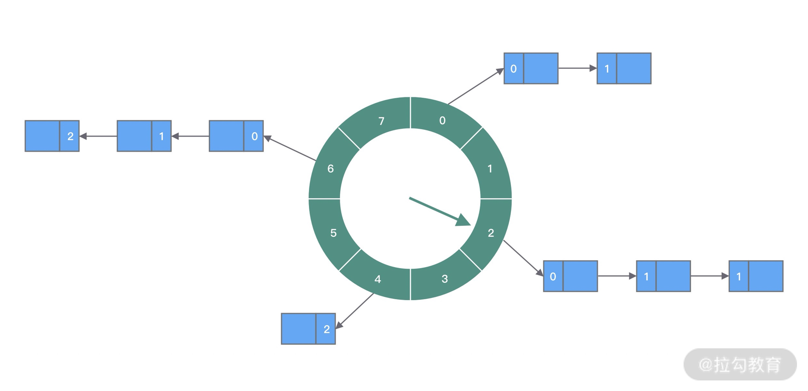
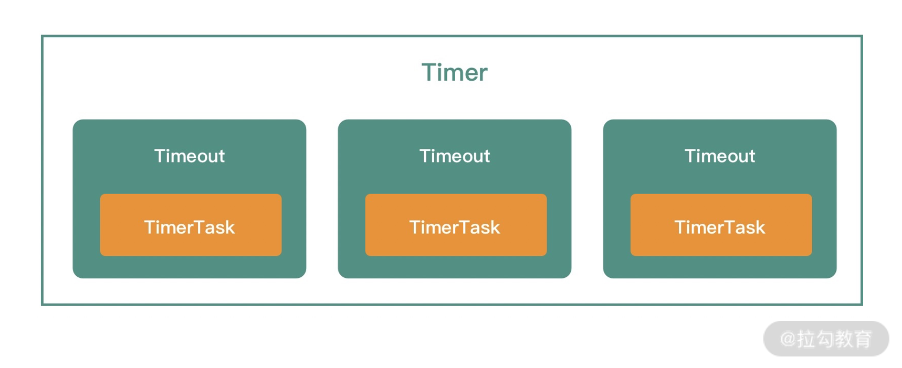
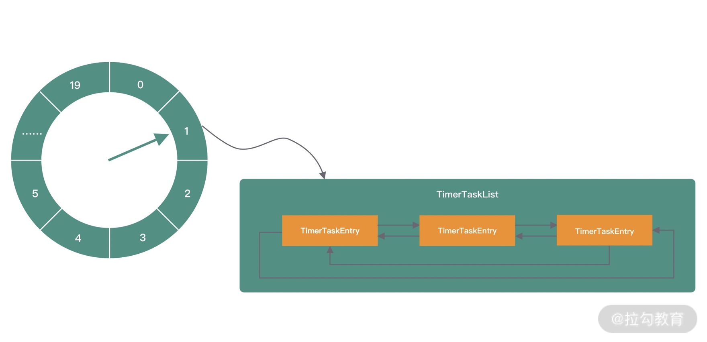
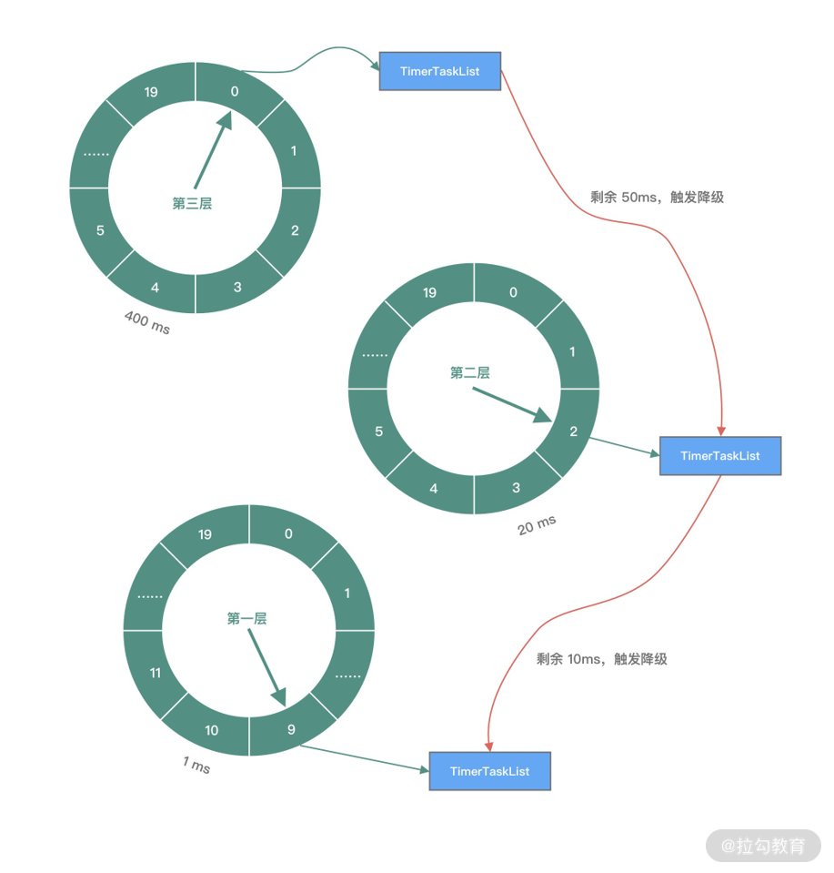

# 21 技巧篇：延迟任务处理神器之时间轮 HashedWheelTimer

Netty 中有很多场景依赖定时任务实现，比较典型的有客户端连接的超时控制、通信双方连接的心跳检测等场景。在学习 Netty Reactor 线程模型时，我们知道 NioEventLoop 不仅负责处理 I/O 事件，而且兼顾执行任务队列中的任务，其中就包括定时任务。为了实现高性能的定时任务调度，Netty 引入了时间轮算法驱动定时任务的执行。时间轮到底是什么呢？为什么 Netty 一定要用时间轮来处理定时任务呢？JDK 原生的实现方案不能满足要求吗？本节课我将一步步为你深入剖析时间轮的原理以及 Netty 中是如何实现时间轮算法的。

> 说明：本文参考的 Netty 源码版本为 4.1.42.Final。

### 定时任务的基础知识

首先，我们先了解下什么是定时任务？定时器有非常多的使用场景，大家在平时工作中应该经常遇到，例如生成月统计报表、财务对账、会员积分结算、邮件推送等，都是定时器的使用场景。定时器一般有三种表现形式：按固定周期定时执行、延迟一定时间后执行、指定某个时刻执行。

定时器的本质是设计一种数据结构，能够存储和调度任务集合，而且 deadline 越近的任务拥有更高的优先级。那么定时器如何知道一个任务是否到期了呢？定时器需要通过轮询的方式来实现，每隔一个时间片去检查任务是否到期。

所以定时器的内部结构一般需要一个任务队列和一个异步轮询线程，并且能够提供三种基本操作：

- Schedule 新增任务至任务集合；
- Cancel 取消某个任务；
- Run 执行到期的任务。

JDK 原生提供了三种常用的定时器实现方式，分别为 Timer、DelayedQueue 和 ScheduledThreadPoolExecutor。下面我们逐一对它们进行介绍。

#### Timer

Timer 属于 JDK 比较早期版本的实现，它可以实现固定周期的任务，以及延迟任务。Timer 会起动一个异步线程去执行到期的任务，任务可以只被调度执行一次，也可以周期性反复执行多次。我们先来看下 Timer 是如何使用的，示例代码如下。

```
Timer timer = new Timer();
timer.scheduleAtFixedRate(new TimerTask() {
    @Override
    public void run() {
        // do something
    }
}, 10000, 1000);  // 10s 后调度一个周期为 1s 的定时任务
```

可以看出，任务是由 TimerTask 类实现，TimerTask 是实现了 Runnable 接口的抽象类，Timer 负责调度和执行 TimerTask。接下来我们看下 Timer 的内部构造。

```
public class Timer {
    private final TaskQueue queue = new TaskQueue();
    private final TimerThread thread = new TimerThread(queue);
    public Timer(String name) {
        thread.setName(name);
        thread.start();
    }
}
```

TaskQueue 是由数组结构实现的小根堆，deadline 最近的任务位于堆顶端，queue\[1\] 始终是最优先被执行的任务。所以使用小根堆的数据结构，Run 操作时间复杂度 O(1)，新增 Schedule 和取消 Cancel 操作的时间复杂度都是 O(logn)。

Timer 内部启动了一个 TimerThread 异步线程，不论有多少任务被加入数组，始终都是由 TimerThread 负责处理。TimerThread 会定时轮询 TaskQueue 中的任务，如果堆顶的任务的 deadline 已到，那么执行任务；如果是周期性任务，执行完成后重新计算下一次任务的 deadline，并再次放入小根堆；如果是单次执行的任务，执行结束后会从 TaskQueue 中删除。

#### DelayedQueue

DelayedQueue 是 JDK 中一种可以延迟获取对象的阻塞队列，其内部是采用优先级队列 PriorityQueue 存储对象。DelayQueue 中的每个对象都必须实现 Delayed 接口，并重写 compareTo 和 getDelay 方法。DelayedQueue 的使用方法如下：

```
public class DelayQueueTest {
    public static void main(String[] args) throws Exception {
        BlockingQueue<SampleTask> delayQueue = new DelayQueue<>();
        long now = System.currentTimeMillis();
        delayQueue.put(new SampleTask(now + 1000));
        delayQueue.put(new SampleTask(now + 2000));
        delayQueue.put(new SampleTask(now + 3000));
        for (int i = 0; i < 3; i++) {
            System.out.println(new Date(delayQueue.take().getTime()));
        }
    }
    static class SampleTask implements Delayed {
        long time;
        public SampleTask(long time) {
            this.time = time;
        }
        public long getTime() {
            return time;
        }
        @Override
        public int compareTo(Delayed o) {
            return Long.compare(this.getDelay(TimeUnit.MILLISECONDS), o.getDelay(TimeUnit.MILLISECONDS));
        }
        @Override
        public long getDelay(TimeUnit unit) {
            return unit.convert(time - System.currentTimeMillis(), TimeUnit.MILLISECONDS);
        }
    }
}
```

DelayQueue 提供了 put() 和 take() 的阻塞方法，可以向队列中添加对象和取出对象。对象被添加到 DelayQueue 后，会根据 compareTo() 方法进行优先级排序。getDelay() 方法用于计算消息延迟的剩余时间，只有 getDelay \<=0 时，该对象才能从 DelayQueue 中取出。

DelayQueue 在日常开发中最常用的场景就是实现重试机制。例如，接口调用失败或者请求超时后，可以将当前请求对象放入 DelayQueue，通过一个异步线程 take() 取出对象然后继续进行重试。如果还是请求失败，继续放回 DelayQueue。为了限制重试的频率，可以设置重试的最大次数以及采用指数退避算法设置对象的 deadline，如 2s、4s、8s、16s ……以此类推。

相比于 Timer，DelayQueue 只实现了任务管理的功能，需要与异步线程配合使用。DelayQueue 使用优先级队列实现任务的优先级排序，新增 Schedule 和取消 Cancel 操作的时间复杂度也是 O(logn)。

#### ScheduledThreadPoolExecutor

上文中介绍的 Timer 其实目前并不推荐用户使用，它是存在不少设计缺陷的。

- Timer 是单线程模式。如果某个 TimerTask 执行时间很久，会影响其他任务的调度。
- Timer 的任务调度是基于系统绝对时间的，如果系统时间不正确，可能会出现问题。
- TimerTask 如果执行出现异常，Timer 并不会捕获，会导致线程终止，其他任务永远不会执行。

为了解决 Timer 的设计缺陷，JDK 提供了功能更加丰富的 ScheduledThreadPoolExecutor。ScheduledThreadPoolExecutor 提供了周期执行任务和延迟执行任务的特性，下面通过一个例子先看下 ScheduledThreadPoolExecutor 如何使用。

```
public class ScheduledExecutorServiceTest {
    public static void main(String[] args) {
        ScheduledExecutorService executor = Executors.newScheduledThreadPool(5);
        executor.scheduleAtFixedRate(() -> System.out.println("Hello World"), 1000, 2000, TimeUnit.MILLISECONDS); // 1s 延迟后开始执行任务，每 2s 重复执行一次
    }
}
```

ScheduledThreadPoolExecutor 继承于 ThreadPoolExecutor，因此它具备线程池异步处理任务的能力。线程池主要负责管理创建和管理线程，并从自身的阻塞队列中不断获取任务执行。线程池有两个重要的角色，分别是任务和阻塞队列。ScheduledThreadPoolExecutor 在 ThreadPoolExecutor 的基础上，重新设计了任务 ScheduledFutureTask 和阻塞队列 DelayedWorkQueue。ScheduledFutureTask 继承于 FutureTask，并重写了 run() 方法，使其具备周期执行任务的能力。DelayedWorkQueue 内部是优先级队列，deadline 最近的任务在队列头部。对于周期执行的任务，在执行完会重新设置时间，并再次放入队列中。ScheduledThreadPoolExecutor 的实现原理可以用下图表示。

 以上我们简单介绍了 JDK 三种实现定时器的方式。可以说它们的实现思路非常类似，都离不开 **任务** 、 **任务管理** 、 **任务调度** 三个角色。三种定时器新增和取消任务的时间复杂度都是 O(logn)，面对海量任务插入和删除的场景，这三种定时器都会遇到比较严重的性能瓶颈。因此，对于性能要求较高的场景，我们一般都会采用时间轮算法。那么时间轮又是如何解决海量任务插入和删除的呢？我们继续向下分析。

### 时间轮原理分析

技术有时就源于生活，例如排队买票可以想到队列，公司的组织关系可以理解为树等，而时间轮算法的设计思想就来源于钟表。如下图所示，时间轮可以理解为一种环形结构，像钟表一样被分为多个 slot 槽位。每个 slot 代表一个时间段，每个 slot 中可以存放多个任务，使用的是链表结构保存该时间段到期的所有任务。时间轮通过一个时针随着时间一个个 slot 转动，并执行 slot 中的所有到期任务。



任务是如何添加到时间轮当中的呢？可以根据任务的到期时间进行取模，然后将任务分布到不同的 slot 中。如上图所示，时间轮被划分为 8 个 slot，每个 slot 代表 1s，当前时针指向 2。假如现在需要调度一个 3s 后执行的任务，应该加入 2+3=5 的 slot 中；如果需要调度一个 12s 以后的任务，需要等待时针完整走完一圈 round 零 4 个 slot，需要放入第 (2+12)%8=6 个 slot。

那么当时针走到第 6 个 slot 时，怎么区分每个任务是否需要立即执行，还是需要等待下一圈 round，甚至更久时间之后执行呢？所以我们需要把 round 信息保存在任务中。例如图中第 6 个 slot 的链表中包含 3 个任务，第一个任务 round=0，需要立即执行；第二个任务 round=1，需要等待 1_8=8s 后执行；第三个任务 round=2，需要等待 2_8=8s 后执行。所以当时针转动到对应 slot 时，只执行 round=0 的任务，slot 中其余任务的 round 应当减 1，等待下一个 round 之后执行。

上面介绍了时间轮算法的基本理论，可以看出时间轮有点类似 HashMap，如果多个任务如果对应同一个 slot，处理冲突的方法采用的是拉链法。在任务数量比较多的场景下，适当增加时间轮的 slot 数量，可以减少时针转动时遍历的任务个数。

时间轮定时器最大的优势就是，任务的新增和取消都是 O(1) 时间复杂度，而且只需要一个线程就可以驱动时间轮进行工作。HashedWheelTimer 是 Netty 中时间轮算法的实现类，下面我就结合 HashedWheelTimer 的源码详细分析时间轮算法的实现原理。

### Netty HashedWheelTimer 源码解析

在开始学习 HashedWheelTimer 的源码之前，需要了解 HashedWheelTimer 接口定义以及相关组件，才能更好地使用 HashedWheelTimer。

#### 接口定义

HashedWheelTimer 实现了接口 io.netty.util.Timer，Timer 接口是我们研究 HashedWheelTimer 一个很好的切入口。一起看下 Timer 接口的定义：

```
public interface Timer {
    Timeout newTimeout(TimerTask task, long delay, TimeUnit unit);
    Set<Timeout> stop();
}
```

Timer 接口提供了两个方法，分别是创建任务 newTimeout() 和停止所有未执行任务 stop()。从方法的定义可以看出，Timer 可以认为是上层的时间轮调度器，通过 newTimeout() 方法可以提交一个任务 TimerTask，并返回一个 Timeout。TimerTask 和 Timeout 是两个接口类，它们有什么作用呢？我们分别看下 TimerTask 和 Timeout 的接口定义：

```
public interface TimerTask {
    void run(Timeout timeout) throws Exception;
}
public interface Timeout {
    Timer timer();
    TimerTask task();
    boolean isExpired();
    boolean isCancelled();
    boolean cancel();
}
```

Timeout 持有 Timer 和 TimerTask 的引用，而且通过 Timeout 接口可以执行取消任务的操作。Timer、Timeout 和 TimerTask 之间的关系如下图所示：

 清楚 HashedWheelTimer 的接口定义以及相关组件的概念之后，接下来我们就可以开始使用它了。

#### 快速上手

通过下面这个简单的例子，我们看下 HashedWheelTimer 是如何使用的。

```
public class HashedWheelTimerTest {
    public static void main(String[] args) {
        Timer timer = new HashedWheelTimer();
        Timeout timeout1 = timer.newTimeout(new TimerTask() {
            @Override
            public void run(Timeout timeout) {
                System.out.println("timeout1: " + new Date());
            }
        }, 10, TimeUnit.SECONDS);
        if (!timeout1.isExpired()) {
            timeout1.cancel();
        }
        timer.newTimeout(new TimerTask() {
            @Override
            public void run(Timeout timeout) throws InterruptedException {
                System.out.println("timeout2: " + new Date());
                Thread.sleep(5000);
            }
        }, 1, TimeUnit.SECONDS);
        timer.newTimeout(new TimerTask() {
            @Override
            public void run(Timeout timeout) {
                System.out.println("timeout3: " + new Date());
            }
        }, 3, TimeUnit.SECONDS);
    }
}
```

代码运行结果如下：

```
timeout2: Mon Nov 09 19:57:04 CST 2020
timeout3: Mon Nov 09 19:57:09 CST 2020
```

简单的几行代码，基本展示了 HashedWheelTimer 的大部分用法。示例中我们通过 newTimeout() 启动了三个 TimerTask，timeout1 由于被取消了，所以并没有执行。timeout2 和 timeout3 分别应该在 1s 和 3s 后执行。然而从结果输出看并不是，timeout2 和 timeout3 的打印时间相差了 5s，这是由于 timeout2 阻塞了 5s 造成的。由此可以看出，时间轮中的任务执行是 **串行** 的，当一个任务执行的时间过长，会影响后续任务的调度和执行，很可能产生任务堆积的情况。

至此，对 HashedWheelTimer 的基本使用方法已经有了初步了解，下面我们开始深入研究 HashedWheelTimer 的实现原理。

#### 内部结构

我们先从 HashedWheelTimer 的构造函数看起，结合上文中介绍的时间轮算法，一起梳理出 HashedWheelTimer 的内部实现结构。

```
public HashedWheelTimer(
        ThreadFactory threadFactory,
        long tickDuration, 
        TimeUnit unit, 
        int ticksPerWheel, 
        boolean leakDetection,
        long maxPendingTimeouts) {
    // 省略其他代码
    wheel = createWheel(ticksPerWheel); // 创建时间轮的环形数组结构
    mask = wheel.length - 1; // 用于快速取模的掩码
    long duration = unit.toNanos(tickDuration); // 转换成纳秒处理
    // 省略其他代码
    workerThread = threadFactory.newThread(worker); // 创建工作线程
    leak = leakDetection || !workerThread.isDaemon() ? leakDetector.track(this) : null; // 是否开启内存泄漏检测
    this.maxPendingTimeouts = maxPendingTimeouts; // 最大允许等待任务数，HashedWheelTimer 中任务超出该阈值时会抛出异常
    // 如果 HashedWheelTimer 的实例数超过 64，会打印错误日志
    if (INSTANCE_COUNTER.incrementAndGet() > INSTANCE_COUNT_LIMIT &&
        WARNED_TOO_MANY_INSTANCES.compareAndSet(false, true)) {
        reportTooManyInstances();
    }
}
```

HashedWheelTimer 的构造函数清晰地列举出了几个核心属性：

- **threadFactory** ，线程池，但是只创建了一个线程；
- **tickDuration** ，时针每次 tick 的时间，相当于时针间隔多久走到下一个 slot；
- **unit** ，表示 tickDuration 的时间单位；
- **ticksPerWheel** ，时间轮上一共有多少个 slot，默认 512 个。分配的 slot 越多，占用的内存空间就越大；
- **leakDetection** ，是否开启内存泄漏检测；
- **maxPendingTimeouts** ，最大允许等待任务数。

下面我们看下 HashedWheelTimer 是如何创建出来的，我们直接跟进 createWheel() 方法的源码：

```
private static HashedWheelBucket[] createWheel(int ticksPerWheel) {
    // 省略其他代码
    ticksPerWheel = normalizeTicksPerWheel(ticksPerWheel);
    HashedWheelBucket[] wheel = new HashedWheelBucket[ticksPerWheel];
    for (int i = 0; i < wheel.length; i ++) {
        wheel[i] = new HashedWheelBucket();
    }
    return wheel;
}
private static int normalizeTicksPerWheel(int ticksPerWheel) {
    int normalizedTicksPerWheel = 1;
    while (normalizedTicksPerWheel < ticksPerWheel) {
        normalizedTicksPerWheel <<= 1;
    }
    return normalizedTicksPerWheel;
}
private static final class HashedWheelBucket {
    private HashedWheelTimeout head;
    private HashedWheelTimeout tail;
    // 省略其他代码
}
```

时间轮的创建就是为了创建 HashedWheelBucket 数组，每个 HashedWheelBucket 表示时间轮中一个 slot。从 HashedWheelBucket 的结构定义可以看出，HashedWheelBucket 内部是一个双向链表结构，双向链表的每个节点持有一个 HashedWheelTimeout 对象，HashedWheelTimeout 代表一个定时任务。每个 HashedWheelBucket 都包含双向链表 head 和 tail 两个 HashedWheelTimeout 节点，这样就可以实现不同方向进行链表遍历。关于 HashedWheelBucket 和 HashedWheelTimeout 的具体功能下文再继续介绍。

因为时间轮需要使用 & 做取模运算，所以数组的长度需要是 2 的次幂。normalizeTicksPerWheel() 方法的作用就是找到不小于 ticksPerWheel 的最小 2 次幂，这个方法实现的并不好，可以参考 JDK HashMap 扩容 tableSizeFor 的实现进行性能优化，如下所示。当然 normalizeTicksPerWheel() 只是在初始化的时候使用，所以并无影响。

```
static final int MAXIMUM_CAPACITY = 1 << 30;
private static int normalizeTicksPerWheel(int ticksPerWheel) {
    int n = ticksPerWheel - 1;
    n |= n >>> 1;
    n |= n >>> 2;
    n |= n >>> 4;
    n |= n >>> 8;
    n |= n >>> 16;
    return (n < 0) ? 1 : (n >= MAXIMUM_CAPACITY) ? MAXIMUM_CAPACITY : n + 1;
}
```

HashedWheelTimer 初始化的主要工作我们已经介绍完了，其内部结构与上文中介绍的时间轮算法类似，如下图所示。


接下来我们围绕定时器的三种基本操作，分析下 HashedWheelTimer 是如何实现添加任务、执行任务和取消任务的。

#### 添加任务

HashedWheelTimer 初始化完成后，如何向 HashedWheelTimer 添加任务呢？我们自然想到 HashedWheelTimer 提供的 newTimeout() 方法。

```
public Timeout newTimeout(TimerTask task, long delay, TimeUnit unit) {
    // 省略其他代码
    long pendingTimeoutsCount = pendingTimeouts.incrementAndGet();
    if (maxPendingTimeouts > 0 && pendingTimeoutsCount > maxPendingTimeouts) {
        pendingTimeouts.decrementAndGet();
        throw new RejectedExecutionException("Number of pending timeouts ("
            + pendingTimeoutsCount + ") is greater than or equal to maximum allowed pending "
            + "timeouts (" + maxPendingTimeouts + ")");
    }
    start(); // 1. 如果 worker 线程没有启动，需要启动
    long deadline = System.nanoTime() + unit.toNanos(delay) - startTime; // 计算任务的 deadline
    if (delay > 0 && deadline < 0) {
        deadline = Long.MAX_VALUE;
    }
    HashedWheelTimeout timeout = new HashedWheelTimeout(this, task, deadline); //  2. 创建定时任务
    timeouts.add(timeout); // 3. 添加任务到 Mpsc Queue
    return timeout;
}
private final Queue<HashedWheelTimeout> timeouts = PlatformDependent.newMpscQueue();
```

newTimeout() 方法主要做了三件事，分别为启动工作线程，创建定时任务，并把任务添加到 Mpsc Queue。HashedWheelTimer 的工作线程采用了懒启动的方式，不需要用户显示调用。这样做的好处是在时间轮中没有任务时，可以避免工作线程空转而造成性能损耗。先看下启动工作线程 start() 的源码：

```
public void start() {
    switch (WORKER_STATE_UPDATER.get(this)) {
        case WORKER_STATE_INIT:
            if (WORKER_STATE_UPDATER.compareAndSet(this, WORKER_STATE_INIT, WORKER_STATE_STARTED)) {
                workerThread.start();
            }
            break;
        case WORKER_STATE_STARTED:
            break;
        case WORKER_STATE_SHUTDOWN:
            throw new IllegalStateException("cannot be started once stopped");
        default:
            throw new Error("Invalid WorkerState");
    }
    while (startTime == 0) {
        try {
            startTimeInitialized.await();
        } catch (InterruptedException ignore) {
        }
    }
}
```

工作线程的启动之前，会通过 CAS 操作获取工作线程的状态，如果已经启动，则直接跳过。如果没有启动，再次通过 CAS 操作更改工作线程状态，然后启动工作线程。启动的过程是直接调用的 Thread#start() 方法，我们暂且先不关注工作线程具体做了什么，下文再继续分析。

回到 newTimeout() 的主流程，接下来的逻辑就非常简单了。根据用户传入的任务延迟时间，可以计算出任务的 deadline，然后创建定时任务 HashedWheelTimeout 对象，最终把 HashedWheelTimeout 添加到 Mpsc Queue 中。看到这里，你会不会有个疑问，为什么不是将 HashedWheelTimeout 直接添加到时间轮中呢？而是先添加到 Mpsc Queue？Mpsc Queue 可以理解为多生产者单消费者的线程安全队列，下节课我们会对 Mpsc Queue 详细分析，在这里就不做展开了。可以猜到 HashedWheelTimer 是想借助 Mpsc Queue 保证多线程向时间轮添加任务的线程安全性。

那么什么时候任务才会被加入时间轮并执行呢？此时还没有太多信息，接下来我们只能工作线程 Worker 里寻找问题的答案。

#### 工作线程 Worker

工作线程 Worker 是时间轮的核心引擎，随着时针的转动，到期任务的处理都由 Worker 处理完成。下面我们定位到 Worker 的 run() 方法一探究竟。

```
private final class Worker implements Runnable {
    private final Set<Timeout> unprocessedTimeouts = new HashSet<Timeout>(); // 未处理任务列表
    private long tick;
    @Override
    public void run() {
        startTime = System.nanoTime();
        if (startTime == 0) {
            startTime = 1;
        }
        startTimeInitialized.countDown();
        do {
            final long deadline = waitForNextTick(); // 1. 计算下次 tick 的时间, 然后sleep 到下次 tick
            if (deadline > 0) { // 可能因为溢出或者线程中断，造成 deadline <= 0
                int idx = (int) (tick & mask); // 2. 获取当前 tick 在 HashedWheelBucket 数组中对应的下标
                processCancelledTasks(); // 3. 移除被取消的任务
                HashedWheelBucket bucket =
                        wheel[idx];
                transferTimeoutsToBuckets(); // 4. 从 Mpsc Queue 中取出任务加入对应的 slot 中
                bucket.expireTimeouts(deadline); // 5. 执行到期的任务
                tick++;
            }
        } while (WORKER_STATE_UPDATER.get(HashedWheelTimer.this) == WORKER_STATE_STARTED);
        // 时间轮退出后，取出 slot 中未执行且未被取消的任务，并加入未处理任务列表，以便 stop() 方法返回
        for (HashedWheelBucket bucket: wheel) {
            bucket.clearTimeouts(unprocessedTimeouts);
        }
        // 将还没来得及添加到 slot 中的任务取出，如果任务未取消则加入未处理任务列表，以便 stop() 方法返回
        for (;;) {
            HashedWheelTimeout timeout = timeouts.poll();
            if (timeout == null) {
                break;
            }
            if (!timeout.isCancelled()) {
                unprocessedTimeouts.add(timeout);
            }
        }
        processCancelledTasks();
    }
}
```

工作线程 Worker 的核心执行流程是代码中的 do-while 循环，只要 Worker 处于 STARTED 状态，就会执行 do-while 循环，我们把该过程拆分成为以下几个步骤，逐一分析。

- 通过 waitForNextTick() 方法计算出时针到下一次 tick 的时间间隔，然后 sleep 到下一次 tick。
- 通过位运算获取当前 tick 在 HashedWheelBucket 数组中对应的下标
- 移除被取消的任务。
- 从 Mpsc Queue 中取出任务加入对应的 HashedWheelBucket 中。
- 执行当前 HashedWheelBucket 中的到期任务。

首先看下 waitForNextTick() 方法是如何计算等待时间的，源码如下：

```
private long waitForNextTick() {
    long deadline = tickDuration * (tick + 1);
    for (;;) {
        final long currentTime = System.nanoTime() - startTime;
        long sleepTimeMs = (deadline - currentTime + 999999) / 1000000;
        if (sleepTimeMs <= 0) {
            if (currentTime == Long.MIN_VALUE) {
                return -Long.MAX_VALUE;
            } else {
                return currentTime;
            }
        }
        if (PlatformDependent.isWindows()) {
            sleepTimeMs = sleepTimeMs / 10 * 10;
        }
        try {
            Thread.sleep(sleepTimeMs);
        } catch (InterruptedException ignored) {
            if (WORKER_STATE_UPDATER.get(HashedWheelTimer.this) == WORKER_STATE_SHUTDOWN) {
                return Long.MIN_VALUE;
            }
        }
    }
}
```

根据 tickDuration 可以推算出下一次 tick 的 deadline，deadline 减去当前时间就可以得到需要 sleep 的等待时间。所以 tickDuration 的值越小，时间的精准度也就越高，同时 Worker 的繁忙程度越高。如果 tickDuration 设置过小，为了防止系统会频繁地 sleep 再唤醒，会保证 Worker 至少 sleep 的时间为 1ms 以上。

Worker 从 sleep 状态唤醒后，接下来会执行第二步流程，通过按位与的操作计算出当前 tick 在 HashedWheelBucket 数组中对应的下标。按位与比普通的取模运算效率要快很多，前提是时间轮中的数组长度是 2 的次幂，掩码 mask 为 2 的次幂减 1，这样才能达到与取模一样的效果。

接下来 Worker 会调用 processCancelledTasks() 方法处理被取消的任务，所有取消的任务都会加入 cancelledTimeouts 队列中，Worker 会从队列中取出任务，然后将其从对应的 HashedWheelBucket 中删除，删除操作为基本的链表操作。processCancelledTasks() 的源码比较简单，我们在此就不展开了。

之前我们还留了一个疑问，Mpsc Queue 中的任务什么时候加入时间轮的呢？答案就在 transferTimeoutsToBuckets() 方法中。

```
private void transferTimeoutsToBuckets() {
    // 每次时针 tick 最多只处理 100000 个任务，以防阻塞 Worker 线程
    for (int i = 0; i < 100000; i++) {
        HashedWheelTimeout timeout = timeouts.poll();
        if (timeout == null) {
            break;
        }
        if (timeout.state() == HashedWheelTimeout.ST_CANCELLED) {
            continue;
        }
        long calculated = timeout.deadline / tickDuration; // 计算任务需要经过多少个 tick
        timeout.remainingRounds = (calculated - tick) / wheel.length; // 计算任务需要在时间轮中经历的圈数 remainingRounds
        final long ticks = Math.max(calculated, tick); // 如果任务在 timeouts 队列里已经过了执行时间, 那么会加入当前 HashedWheelBucket 中
        int stopIndex = (int) (ticks & mask);
        HashedWheelBucket bucket = wheel[stopIndex];
        bucket.addTimeout(timeout);
    }
}
```

transferTimeoutsToBuckets() 的主要工作就是从 Mpsc Queue 中取出任务，然后添加到时间轮对应的 HashedWheelBucket 中。每次时针 tick 最多只处理 100000 个任务，一方面避免取任务的操作耗时过长，另一方面为了防止执行太多任务造成 Worker 线程阻塞。

根据用户设置的任务 deadline，可以计算出任务需要经过多少次 tick 才能开始执行以及需要在时间轮中转动圈数 remainingRounds，remainingRounds 会记录在 HashedWheelTimeout 中，在执行任务的时候 remainingRounds 会被使用到。因为时间轮中的任务并不能够保证及时执行，假如有一个任务执行的时间特别长，那么任务在 timeouts 队列里已经过了执行时间，也没有关系，Worker 会将这些任务直接加入当前HashedWheelBucket 中，所以过期的任务并不会被遗漏。

任务被添加到时间轮之后，重新再回到 Worker#run() 的主流程，接下来就是执行当前 HashedWheelBucket 中的到期任务，跟进 HashedWheelBucket#expireTimeouts() 方法的源码：

```
public void expireTimeouts(long deadline) {
    HashedWheelTimeout timeout = head;
    while (timeout != null) {
        HashedWheelTimeout next = timeout.next;
        if (timeout.remainingRounds <= 0) {
            next = remove(timeout);
            if (timeout.deadline <= deadline) {
                timeout.expire(); // 执行任务
            } else {
                throw new IllegalStateException(String.format(
                        "timeout.deadline (%d) > deadline (%d)", timeout.deadline, deadline));
            }
        } else if (timeout.isCancelled()) {
            next = remove(timeout);
        } else {
            timeout.remainingRounds --; // 未到执行时间，remainingRounds 减 1
        }
        timeout = next;
    }
}
```

执行任务的操作比较简单，就是从头开始遍历 HashedWheelBucket 中的双向链表。如果 remainingRounds \<=0，则调用 expire() 方法执行任务，timeout.expire() 内部就是调用了 TimerTask 的 run() 方法。如果任务已经被取消，直接从链表中移除。否则表示任务的执行时间还没到，remainingRounds 减 1，等待下一圈即可。

至此，工作线程 Worker 的核心逻辑 do-while 循环我们已经讲完了。当时间轮退出后，Worker 还会执行一些后置的收尾工作。Worker 会从每个 HashedWheelBucket 取出未执行且未取消的任务，以及还来得及添加到 HashedWheelBucket 中的任务，然后加入未处理任务列表，以便 stop() 方法统一处理。

#### 停止时间轮

回到 Timer 接口两个方法，newTimeout() 上文已经分析完了，接下来我们就以 stop() 方法为入口，看下时间轮停止都做了哪些工作。

```
@Override
public Set<Timeout> stop() {
    // Worker 线程无法停止时间轮
    if (Thread.currentThread() == workerThread) {
        throw new IllegalStateException(
                HashedWheelTimer.class.getSimpleName() +
                        ".stop() cannot be called from " +
                        TimerTask.class.getSimpleName());
    }
    // 尝试通过 CAS 操作将工作线程的状态更新为 SHUTDOWN 状态
    if (!WORKER_STATE_UPDATER.compareAndSet(this, WORKER_STATE_STARTED, WORKER_STATE_SHUTDOWN)) {
        if (WORKER_STATE_UPDATER.getAndSet(this, WORKER_STATE_SHUTDOWN) != WORKER_STATE_SHUTDOWN) {
            INSTANCE_COUNTER.decrementAndGet();
            if (leak != null) {
                boolean closed = leak.close(this);
                assert closed;
            }
            return Collections.emptySet();
    }
    try {
        boolean interrupted = false;
        while (workerThread.isAlive()) {
            workerThread.interrupt(); // 中断 Worker 线程
            try {
                workerThread.join(100);
            } catch (InterruptedException ignored) {
                interrupted = true;
            }
        }
        if (interrupted) {
            Thread.currentThread().interrupt();
        }
    } finally {
        INSTANCE_COUNTER.decrementAndGet();
        if (leak != null) {
            boolean closed = leak.close(this);
            assert closed;
        }
    }
    return worker.unprocessedTimeouts(); // 返回未处理任务的列表
}
```

如果当前线程是 Worker 线程，它是不能发起停止时间轮的操作的，是为了防止有定时任务发起停止时间轮的恶意操作。停止时间轮主要做了三件事，首先尝试通过 CAS 操作将工作线程的状态更新为 SHUTDOWN 状态，然后中断工作线程 Worker，最后将未处理的任务列表返回给上层。

到此为止，HashedWheelTimer 的实现原理我们已经分析完了。再来回顾一下 HashedWheelTimer 的几个核心成员。

- **HashedWheelTimeout** ，任务的封装类，包含任务的到期时间 deadline、需要经历的圈数 remainingRounds 等属性。
- **HashedWheelBucket** ，相当于时间轮的每个 slot，内部采用双向链表保存了当前需要执行的 HashedWheelTimeout 列表。
- **Worker** ，HashedWheelTimer 的核心工作引擎，负责处理定时任务。

### 时间轮进阶应用

Netty 中的时间轮是通过固定的时间间隔 tickDuration 进行推动的，如果长时间没有到期任务，那么会存在时间轮空推进的现象，从而造成一定的性能损耗。此外，如果任务的到期时间跨度很大，例如 A 任务 1s 后执行，B 任务 6 小时之后执行，也会造成空推进的问题。

那么上述问题有没有什么解决方案呢？在研究 Kafka 的时候，Kafka 也有时间轮的应用，它的实现思路与 Netty 是存在区别的。因为 Kafka 面对的应用场景是更加严苛的，可能会存在各种时间粒度的定时任务，那么 Kafka 是否有解决时间跨度问题呢？我们接下来就简单介绍下 Kafka 的优化思路。

Kafka 时间轮的内部结构与 Netty 类似，如下图所示。Kafka 的时间轮也是采用环形数组存储定时任务，数组中的每个 slot 代表一个 Bucket，每个 Bucket 保存了定时任务列表 TimerTaskList，TimerTaskList 同样采用双向链表的结构实现，链表的每个节点代表真正的定时任务 TimerTaskEntry。



为了解决空推进的问题，Kafka 借助 JDK 的 DelayQueue 来负责推进时间轮。DelayQueue 保存了时间轮中的每个 Bucket，并且根据 Bucket 的到期时间进行排序，最近的到期时间被放在 DelayQueue 的队头。Kafka 中会有一个线程来读取 DelayQueue 中的任务列表，如果时间没有到，那么 DelayQueue 会一直处于阻塞状态，从而解决空推荐的问题。这时候你可能会问，DelayQueue 插入和删除的性能不是并不好吗？其实 Kafka 采用的是一种权衡的策略，把 DelayQueue 用在了合适的地方。DelayQueue 只存放了 Bucket，Bucket 的数量并不多，相比空推进带来的影响是利大于弊的。

为了解决任务时间跨度很大的问题，Kafka 引入了层级时间轮，如下图所示。当任务的 deadline 超出当前所在层的时间轮表示范围时，就会尝试将任务添加到上一层时间轮中，跟钟表的时针、分针、秒针的转动规则是同一个道理。



从图中可以看出，第一层时间轮每个时间格为 1ms，整个时间轮的跨度为 20ms；第二层时间轮每个时间格为 20ms，整个时间轮跨度为 400ms；第三层时间轮每个时间格为 400ms，整个时间轮跨度为 8000ms。每一层时间轮都有自己的指针，每层时间轮走完一圈后，上层时间轮也会相应推进一格。

假设现在有一个任务到期时间是 450ms 之后，应该放在第三层时间轮的第一格。随着时间的流逝，当指针指向该时间格时，发现任务到期时间还有 50ms，这里就涉及时间轮降级的操作，它会将任务重新提交到时间轮中。此时发现第一层时间轮整体跨度不够，需要放在第二层时间轮中第三格。当时间再经历 40ms 之后，该任务又会触发一次降级操作，放入到第一层时间轮，最后等到 10ms 后执行任务。

由此可见，Kafka 的层级时间轮的时间粒度更好控制，可以应对更加复杂的定时任务处理场景，适用的范围更广。

### 总结

HashedWheelTimer 的源码通俗易懂，其设计思想值得我们借鉴。在平时开发中如果有类似的任务处理机制，你可以尝试套用 HashedWheelTimer 的工作模式。

HashedWheelTimer 并不是十全十美的，使用的时候需要清楚它存在的问题：

- 如果长时间没有到期任务，那么会存在时间轮空推进的现象。
- 只适用于处理耗时较短的任务，由于 Worker 是单线程的，如果一个任务执行的时间过长，会造成 Worker 线程阻塞。
- 相比传统定时器的实现方式，内存占用较大。
