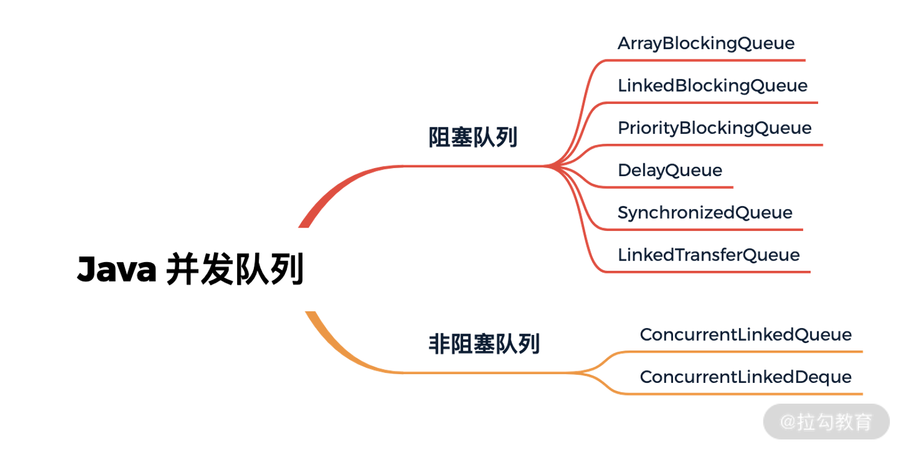
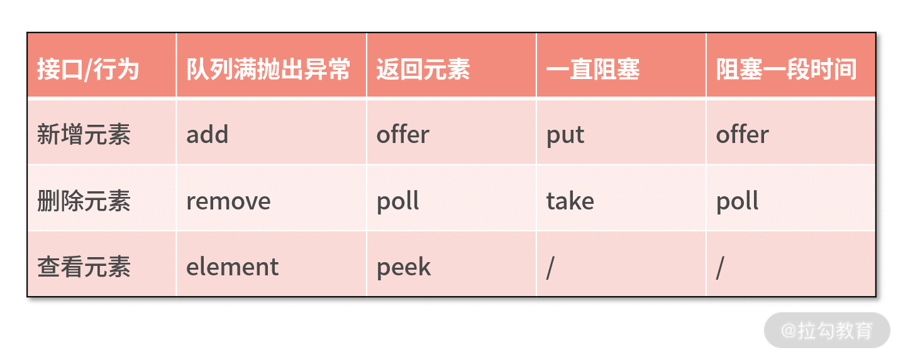
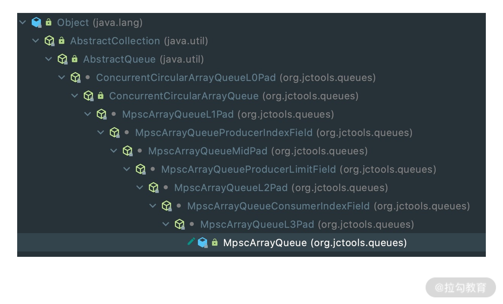
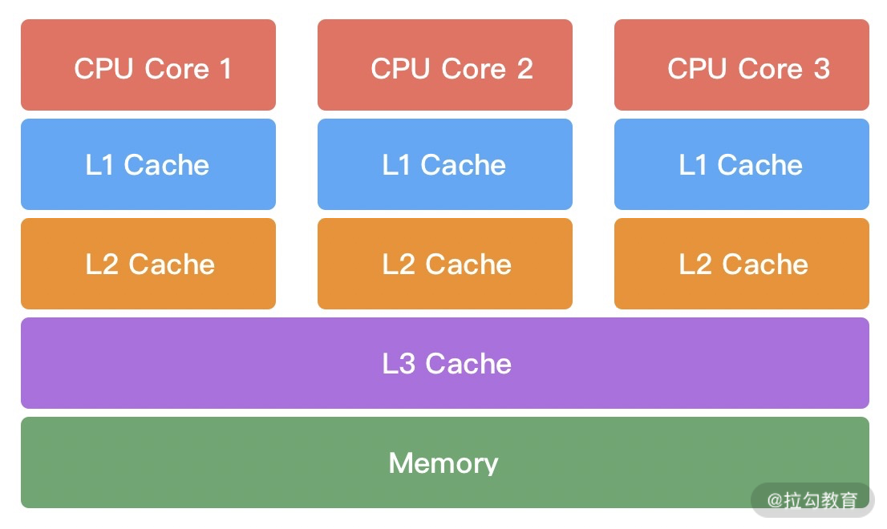
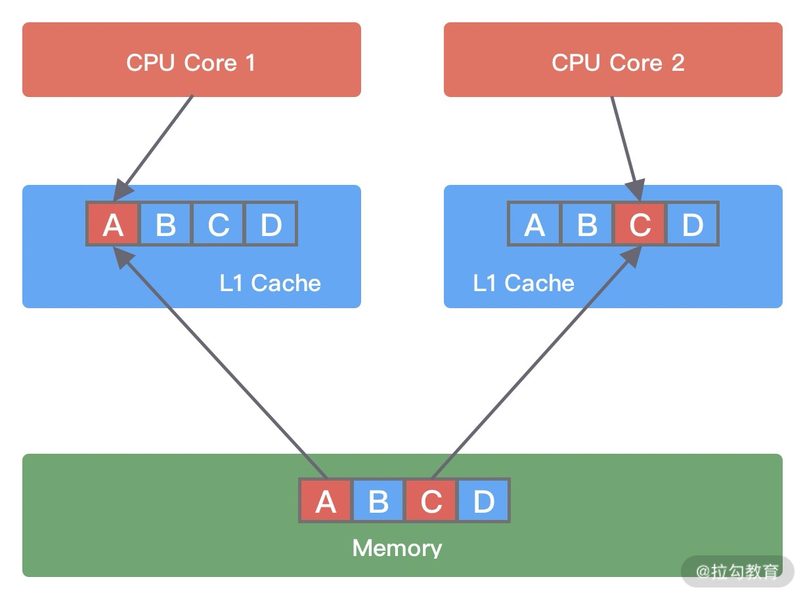
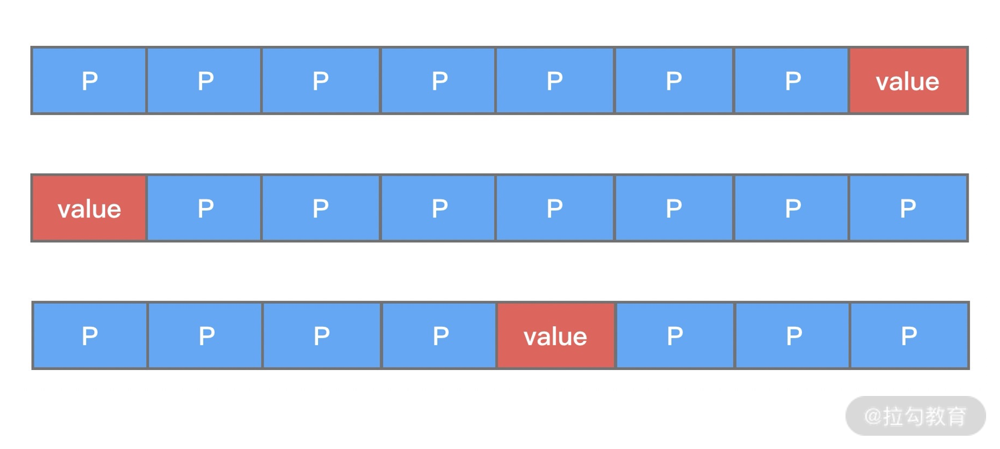
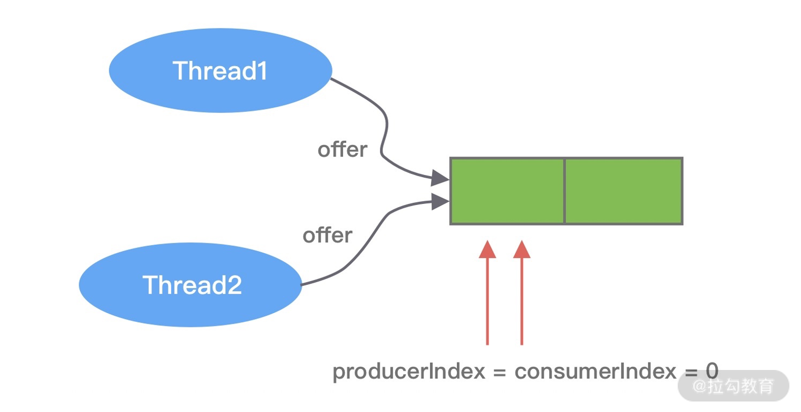

# 22 技巧篇：高性能无锁队列 Mpsc Queue

在前面的源码课程中，NioEventLoop 线程以及时间轮 HashedWheelTimer 的任务队列中都出现了 Mpsc Queue 的身影。这又是 Netty 使用的什么 “黑科技” 呢？为什么不使用 JDK 原生的队列呢？Mpsc Queue 应该在什么场景下使用呢？今天这节课就让我们一起再来长长知识吧！

### JDK 原生并发队列

在介绍 Mpsc Queue 之前，我们先回顾下 JDK 原生队列的工作原理。JDK 并发队列按照实现方式可以分为阻塞队列和非阻塞队列两种类型，阻塞队列是基于锁实现的，非阻塞队列是基于 CAS 操作实现的。JDK 中包含多种阻塞和非阻塞的队列实现，如下图所示。



队列是一种 FIFO（先进先出）的数据结构，JDK 中定义了 java.util.Queue 的队列接口，与 List、Set 接口类似，java.util.Queue 也继承于 Collection 集合接口。此外，JDK 还提供了一种双端队列接口 java.util.Deque，我们最常用的 LinkedList 就是实现了 Deque 接口。下面我们简单说说上图中的每个队列的特点，并给出一些对比和总结。

#### 阻塞队列

阻塞队列在队列为空或者队列满时，都会发生阻塞。阻塞队列自身是线程安全的，使用者无需关心线程安全问题，降低了多线程开发难度。阻塞队列主要分为以下几种：

- **ArrayBlockingQueue**：最基础且开发中最常用的阻塞队列，底层采用数组实现的有界队列，初始化需要指定队列的容量。ArrayBlockingQueue 是如何保证线程安全的呢？它内部是使用了一个重入锁 ReentrantLock，并搭配 notEmpty、notFull 两个条件变量 Condition 来控制并发访问。从队列读取数据时，如果队列为空，那么会阻塞等待，直到队列有数据了才会被唤醒。如果队列已经满了，也同样会进入阻塞状态，直到队列有空闲才会被唤醒。
- **LinkedBlockingQueue**：内部采用的数据结构是链表，队列的长度可以是有界或者无界的，初始化不需要指定队列长度，默认是 Integer.MAX_VALUE。LinkedBlockingQueue 内部使用了 takeLock、putLock两个重入锁 ReentrantLock，以及 notEmpty、notFull 两个条件变量 Condition 来控制并发访问。采用读锁和写锁的好处是可以避免读写时相互竞争锁的现象，所以相比于 ArrayBlockingQueue，LinkedBlockingQueue 的性能要更好。
- **PriorityBlockingQueue**：采用最小堆实现的优先级队列，队列中的元素按照优先级进行排列，每次出队都是返回优先级最高的元素。PriorityBlockingQueue 内部是使用了一个 ReentrantLock 以及一个条件变量 Condition notEmpty 来控制并发访问，不需要 notFull 是因为 PriorityBlockingQueue 是无界队列，所以每次 put 都不会发生阻塞。PriorityBlockingQueue 底层的最小堆是采用数组实现的，当元素个数大于等于最大容量时会触发扩容，在扩容时会先释放锁，保证其他元素可以正常出队，然后使用 CAS 操作确保只有一个线程可以执行扩容逻辑。
- **DelayQueue**，一种支持延迟获取元素的阻塞队列，常用于缓存、定时任务调度等场景。DelayQueue 内部是采用优先级队列 PriorityQueue 存储对象。DelayQueue 中的每个对象都必须实现 Delayed 接口，并重写 compareTo 和 getDelay 方法。向队列中存放元素的时候必须指定延迟时间，只有延迟时间已满的元素才能从队列中取出。
- **SynchronizedQueue**，又称无缓冲队列。比较特别的是 SynchronizedQueue 内部不会存储元素。与 ArrayBlockingQueue、LinkedBlockingQueue 不同，SynchronizedQueue 直接使用 CAS 操作控制线程的安全访问。其中 put 和 take 操作都是阻塞的，每一个 put 操作都必须阻塞等待一个 take 操作，反之亦然。所以 SynchronizedQueue 可以理解为生产者和消费者配对的场景，双方必须互相等待，直至配对成功。在 JDK 的线程池 Executors.newCachedThreadPool 中就存在 SynchronousQueue 的运用，对于新提交的任务，如果有空闲线程，将重复利用空闲线程处理任务，否则将新建线程进行处理。
- **LinkedTransferQueue**，一种特殊的无界阻塞队列，可以看作 LinkedBlockingQueues、SynchronousQueue（公平模式）、ConcurrentLinkedQueue 的合体。与 SynchronousQueue 不同的是，LinkedTransferQueue 内部可以存储实际的数据，当执行 put 操作时，如果有等待线程，那么直接将数据交给对方，否则放入队列中。与 LinkedBlockingQueues 相比，LinkedTransferQueue 使用 CAS 无锁操作进一步提升了性能。

#### 非阻塞队列

说完阻塞队列，我们再来看下非阻塞队列。非阻塞队列不需要通过加锁的方式对线程阻塞，并发性能更好。JDK 中常用的非阻塞队列有以下几种：

- **ConcurrentLinkedQueue**，它是一个采用双向链表实现的无界并发非阻塞队列，它属于 LinkedQueue 的安全版本。ConcurrentLinkedQueue 内部采用 CAS 操作保证线程安全，这是非阻塞队列实现的基础，相比 ArrayBlockingQueue、LinkedBlockingQueue 具备较高的性能。
- **ConcurrentLinkedDeque**，也是一种采用双向链表结构的无界并发非阻塞队列。与 ConcurrentLinkedQueue 不同的是，ConcurrentLinkedDeque 属于双端队列，它同时支持 FIFO 和 FILO 两种模式，可以从队列的头部插入和删除数据，也可以从队列尾部插入和删除数据，适用于多生产者和多消费者的场景。

至此，常见的队列类型我们已经介绍完了。我们在平时开发中使用频率最高的是 BlockingQueue。实现一个阻塞队列需要具备哪些基本功能呢？下面看 BlockingQueue 的接口，如下图所示。


我们可以通过下面一张表格，对上述 BlockingQueue 接口的具体行为进行归类。



JDK 提供的并发队列已经能够满足我们大部分的需求，但是在大规模流量的高并发系统中，如果你对性能要求严苛，JDK 的非阻塞并发队列可选择面较少且性能并不够出色。如果你还是需要一个数组 + CAS 操作实现的无锁安全队列，有没有成熟的解决方案呢？Java 强大的生态总能给我们带来惊喜，一些第三方框架提供的高性能无锁队列已经可以满足我们的需求，其中非常出名的有 Disruptor 和 JCTools。

Disruptor 是 LMAX 公司开发的一款高性能无锁队列，我们平时常称它为 RingBuffer，其设计初衷是为了解决内存队列的延迟问题。Disruptor 内部采用环形数组和 CAS 操作实现，性能非常优越。为什么 Disruptor 的性能会比 JDK 原生的无锁队列要好呢？环形数组可以复用内存，减少分配内存和释放内存带来的性能损耗。而且数组可以设置长度为 2 的次幂，直接通过位运算加快数组下标的定位速度。此外，Disruptor 还解决了伪共享问题，对 CPU Cache 更加友好。Disruptor 已经开源，详细可查阅 Github 地址 [https://github.com/LMAX-Exchange/disruptor](https://github.com/LMAX-Exchange/disruptor)。

JCTools 也是一个开源项目，Github 地址为 [https://github.com/JCTools/JCTools](https://github.com/JCTools/JCTools)。JCTools 是适用于 JVM 并发开发的工具，主要提供了一些 JDK 确实的并发数据结构，例如非阻塞 Map、非阻塞 Queue 等。其中非阻塞队列可以分为四种类型，可以根据不同的场景选择使用。

- Spsc 单生产者单消费者；
- Mpsc 多生产者单消费者；
- Spmc 单生产者多消费者；
- Mpmc 多生产者多消费者。

Netty 中直接引入了 JCTools 的 Mpsc Queue，相比于 JDK 原生的并发队列，Mpsc Queue 又有什么过人之处呢？接下来便开始我们今天要讨论的重点。

### Mpsc Queue 基础知识

Mpsc 的全称是 Multi Producer Single Consumer，多生产者单消费者。Mpsc Queue 可以保证多个生产者同时访问队列是线程安全的，而且同一时刻只允许一个消费者从队列中读取数据。Netty Reactor 线程中任务队列 taskQueue 必须满足多个生产者可以同时提交任务，所以 JCTools 提供的 Mpsc Queue 非常适合 Netty Reactor 线程模型。

Mpsc Queue 有多种的实现类，例如 MpscArrayQueue、MpscUnboundedArrayQueue、MpscChunkedArrayQueue 等。我们先抛开一些提供特性功能的队列，聚焦在最基础的 MpscArrayQueue，回过头再学习其他类型的队列会事半功倍。

首先我们看下 MpscArrayQueue 的继承关系，会发现相当复杂，如下图所示。



除了顶层 JDK 原生的 AbstractCollection、AbstractQueue，MpscArrayQueue 还继承了很多类似于 MpscXxxPad 以及 MpscXxxField 的类。我们可以发现一个很有意思的规律，每个有包含属性的类后面都会被 MpscXxxPad 类隔开。MpscXxxPad 到底起到什么作用呢？我们自顶向下，将所有类的字段合并在一起，看下 MpscArrayQueue 的整体结构。

```
// ConcurrentCircularArrayQueueL0Pad
long p01, p02, p03, p04, p05, p06, p07;
long p10, p11, p12, p13, p14, p15, p16, p17;
// ConcurrentCircularArrayQueue
protected final long mask;
protected final E[] buffer;
// MpmcArrayQueueL1Pad
long p00, p01, p02, p03, p04, p05, p06, p07;
long p10, p11, p12, p13, p14, p15, p16;
// MpmcArrayQueueProducerIndexField
private volatile long producerIndex;
// MpscArrayQueueMidPad
long p01, p02, p03, p04, p05, p06, p07;
long p10, p11, p12, p13, p14, p15, p16, p17;
// MpscArrayQueueProducerLimitField
private volatile long producerLimit;
// MpscArrayQueueL2Pad
long p00, p01, p02, p03, p04, p05, p06, p07;
long p10, p11, p12, p13, p14, p15, p16;
// MpscArrayQueueConsumerIndexField
protected long consumerIndex;
// MpscArrayQueueL3Pad
long p01, p02, p03, p04, p05, p06, p07;
long p10, p11, p12, p13, p14, p15, p16, p17;
```

可以看出，MpscXxxPad 类中使用了大量 long 类型的变量，其命名没有什么特殊的含义，只是起到填充的作用。如果你也读过 Disruptor 的源码，会发现 Disruptor 也使用了类似的填充方法。Mpsc Queue 和 Disruptor 之所以填充这些无意义的变量，是为了解决伪共享（false sharing）问题。

什么是伪共享呢？我们有必要补充这方面的基础知识。在计算机组成中，CPU 的运算速度比内存高出几个数量级，为了 CPU 能够更高效地与内存进行交互，在 CPU 和内存之间设计了多层缓存机制，如下图所示。



一般来说，CPU 会分为三级缓存，分别为 **L1 一级缓存** 、**L2 二级缓存 **和** L3 三级缓存**。越靠近 CPU 的缓存，速度越快，但是缓存的容量也越小。所以从性能上来说，L1 > L2 > L3，容量方面 L1 \< L2 \< L3。CPU 读取数据时，首先会从 L1 查找，如果未命中则继续查找 L2，如果还未能命中则继续查找 L3，最后还没命中的话只能从内存中查找，读取完成后再将数据逐级放入缓存中。此外，多线程之间共享一份数据的时候，需要其中一个线程将数据写回主存，其他线程访问主存数据。

由此可见，引入多级缓存是为了能够让 CPU 利用率最大化。如果你在做频繁的 CPU 运算时，需要尽可能将数据保持在缓存中。那么 CPU 从内存中加载数据的时候，是如何提高缓存的利用率的呢？这就涉及缓存行（Cache Line）的概念，Cache Line 是 CPU 缓存可操作的最小单位，CPU 缓存由若干个 Cache Line 组成。Cache Line 的大小与 CPU 架构有关，在目前主流的 64 位架构下，Cache Line 的大小通常为 64 Byte。Java 中一个 long 类型是 8 Byte，所以一个 Cache Line 可以存储 8 个 long 类型变量。CPU 在加载内存数据时，会将相邻的数据一同读取到 Cache Line 中，因为相邻的数据未来被访问的可能性最大，这样就可以避免 CPU 频繁与内存进行交互了。

伪共享问题是如何发生的呢？它又会造成什么影响呢？我们使用下面这幅图进行讲解。 

假设变量 A、B、C、D 被加载到同一个 Cache Line，它们会被高频地修改。当线程 1 在 CPU Core1 中中对变量 A 进行修改，修改完成后 CPU Core1 会通知其他 CPU Core 该缓存行已经失效。然后线程 2 在 CPU Core2 中对变量 C 进行修改时，发现 Cache line 已经失效，此时 CPU Core1 会将数据重新写回内存，CPU Core2 再从内存中读取数据加载到当前 Cache line 中。

由此可见，如果同一个 Cache line 被越多的线程修改，那么造成的写竞争就会越激烈，数据会频繁写入内存，导致性能浪费。题外话，多核处理器中，每个核的缓存行内容是如何保证一致的呢？有兴趣的同学可以深入学习下缓存一致性协议 MESI，具体可以参考 [https://zh.wikipedia.org/wiki/MESI%E5%8D%8F%E8%AE%AE](https://zh.wikipedia.org/wiki/MESI%E5%8D%8F%E8%AE%AE)。

对于伪共享问题，我们应该如何解决呢？Disruptor 和 Mpsc Queue 都采取了空间换时间的策略，让不同线程共享的对象加载到不同的缓存行即可。下面我们通过一个简单的例子进行说明。

```
public class FalseSharingPadding {
    protected long p1, p2, p3, p4, p5, p6, p7;
    protected volatile long value = 0L;
    protected long p9, p10, p11, p12, p13, p14, p15;
}
```

从上述代码中可以看出，变量 value 前后都填充了 7 个 long 类型的变量。这样不论在什么情况下，都可以保证在多线程访问 value 变量时，value 与其他不相关的变量处于不同的 Cache Line，如下图所示。



伪共享问题一般是非常隐蔽的，在实际开发的过程中，并不是项目中所有地方都需要花费大量的精力去优化伪共享问题。CPU Cache 的填充本身也是比较珍贵的，我们应该把精力聚焦在一些高性能的数据结构设计上，把资源用在刀刃上，使系统性能收益最大化。

至此，我们知道 Mpsc Queue 为了解决伪共享问题填充了大量的 long 类型变量，造成源码不易阅读。因为变量填充只是为了提升 Mpsc Queue 的性能，与 Mpsc Queue 的主体功能无关。接下来我们先忽略填充变量，开始分析 Mpsc Queue 的基本实现原理。

### Mpsc Queue 源码分析

在开始源码学习之前，我们同样先看看 MpscArrayQueue 如何使用，示例代码如下：

```
public class MpscArrayQueueTest {
    public static final MpscArrayQueue<String> MPSC_ARRAY_QUEUE = new MpscArrayQueue<>(2);
    public static void main(String[] args) {
        for (int i = 1; i <= 2; i++) {
            int index = i;
            new Thread(() -> MPSC_ARRAY_QUEUE.offer("data" + index), "thread" + index).start();
        }
        try {
            Thread.sleep(1000L);
            MPSC_ARRAY_QUEUE.add("data3"); // 入队操作，队列满则抛出异常
        } catch (Exception e) {
            e.printStackTrace();
        }
        System.out.println("队列大小：" + MPSC_ARRAY_QUEUE.size() + ", 队列容量：" + MPSC_ARRAY_QUEUE.capacity());
        System.out.println("出队：" + MPSC_ARRAY_QUEUE.remove()); // 出队操作，队列为空则抛出异常
        System.out.println("出队：" + MPSC_ARRAY_QUEUE.poll()); // 出队操作，队列为空则返回 NULL
    }
}
```

程序输出结果如下：

```
java.lang.IllegalStateException: Queue full
 at java.util.AbstractQueue.add(AbstractQueue.java:98)
 at MpscArrayQueueTest.main(MpscArrayQueueTest.java:17)
队列大小：2, 队列容量：2
出队：data1
出队：data2
Disconnected from the target VM, address: '127.0.0.1:58005', transport: 'socket'
```

说到底 MpscArrayQueue 终究还是是个队列，基本用法与 ArrayBlockingQueue 都是类似的，都离不开队列的基本操作：**入队 offer()和出队 poll()**。下面我们就入队 offer() 和出队 poll() 两个最重要的操作分别进行详细的讲解。

### 入队 offer

首先我们先回顾下 MpscArrayQueue 的重要属性：

```
// ConcurrentCircularArrayQueue
protected final long mask; // 计算数组下标的掩码
protected final E[] buffer; // 存放队列数据的数组
// MpmcArrayQueueProducerIndexField
private volatile long producerIndex; // 生产者的索引
// MpscArrayQueueProducerLimitField
private volatile long producerLimit; // 生产者索引的最大值
// MpscArrayQueueConsumerIndexField
protected long consumerIndex; // 消费者索引
```

看到 mask 变量，你现在是不是条件反射想到队列中数组的容量大小肯定是 2 的次幂。因为 Mpsc 是多生产者单消费者队列，所以 producerIndex、producerLimit 都是用 volatile 进行修饰的，其中一个生产者线程的修改需要对其他生产者线程可见。队列入队和出队时会如何操作上述这些属性呢？其中生产者和消费者的索引变量又有什么作用呢？带着这些问题我们开始阅读源码。

首先跟进 offer() 方法的源码：

```
public boolean offer(E e) {
    if (null == e) {
        throw new NullPointerException();
    } else {
        long mask = this.mask;
        long producerLimit = this.lvProducerLimit(); // 获取生产者索引最大限制
        long pIndex;
        long offset;
        do {
            pIndex = this.lvProducerIndex(); // 获取生产者索引
            if (pIndex >= producerLimit) {
                offset = this.lvConsumerIndex(); // 获取消费者索引
                producerLimit = offset + mask + 1L;
                if (pIndex >= producerLimit) {
                    return false; // 队列已满
                }
                this.soProducerLimit(producerLimit); // 更新 producerLimit
            }
        } while(!this.casProducerIndex(pIndex, pIndex + 1L)); // CAS 更新生产者索引，更新成功则退出，说明当前生产者已经占领索引值
        offset = calcElementOffset(pIndex, mask); // 计算生产者索引在数组中下标
        UnsafeRefArrayAccess.soElement(this.buffer, offset, e); // 向数组中放入数据
        return true;
    }
}
```

MpscArrayQueue 的 offer() 方法虽然比较简短，但是需要具备一些底层知识才能看得懂，先不用担心，我们一点点开始拆解。首先需要搞懂 producerIndex、producerLimit 以及 consumerIndex 之间的关系，这也是 MpscArrayQueue 中设计比较独特的地方。首先看下 lvProducerLimit() 方法的源码：

```
public MpscArrayQueueProducerLimitField(int capacity) {
    super(capacity);
    this.producerLimit = capacity;
}
protected final long lvProducerLimit() {
    return producerLimit;
}
```

在初始化状态，producerLimit 与队列的容量是相等的，对应到 MpscArrayQueueTest 代码示例中，producerLimit = capacity = 2，而 producerIndex = consumerIndex = 0。接下来 Thread1 和 Thread2 并发向 MpscArrayQueue 中存放数据，如下图所示。



两个线程此时拿到的 producerIndex 都是 0，是小于 producerLimit 的。此时两个线程都会尝试使用 CAS 操作更新 producerIndex，其中必然有一个是成功的，另外一个是失败的。假设 Thread1 执行 CAS 操作成功，那么 Thread2 失败后就会重新更新 producerIndex。Thread1 更新后 producerIndex 的值为 1，由于 producerIndex 是 volatile 修饰的，更新后立刻对 Thread2 可见。这里有一点需要注意的是，当前线程更新后的值是被其他线程使用，当 Thread1 和 Thread2 都通过 CAS 抢占成功后，它们拿到的 pIndex 分别是 0 和 1。接下来就是根据 pIndex 进行位运算计算得到数组对应的下标，然后通过 UNSAFE.putOrderedObject() 方法将数据写入到数组中，源码如下所示。

```
public static <E> void soElement(E[] buffer, long offset, E e) {
    UnsafeAccess.UNSAFE.putOrderedObject(buffer, offset, e);
}
```

putOrderedObject() 和 putObject() 都可以用于更新对象的值，但是 putOrderedObject() 并不会立刻将数据更新到内存中，并把其他 Cache Line 置为失效。putOrderedObject() 使用的是 LazySet 延迟更新机制，所以性能方面 putOrderedObject() 要比 putObject() 高很多。

Java 中有四种类型的内存屏障，分别为 LoadLoad、StoreStore、LoadStore 和 StoreLoad。putOrderedObject() 使用了 StoreStore Barrier，对于 Store1，StoreStore，Store2 这样的操作序列，在 Store2 进行写入之前，会保证 Store1 的写操作对其他处理器可见。

LazySet 机制是有代价的，就是写操作结果有纳秒级的延迟，不会立刻被其他线程以及自身线程可见。因为在 Mpsc Queue 的使用场景中，多个生产者只负责写入数据，并没有写入之后立刻读取的需求，所以使用 LazySet 机制是没有问题的，只要 StoreStore Barrier 保证多线程写入的顺序即可。

至此，offer() 的核心操作我们已经讲完了。现在我们继续把目光聚焦在 do-while 循环内的逻辑，为什么需要两次 if(pIndex >= producerLimit) 判断呢？说明当生产者索引大于 producerLimit 阈值时，可能存在两种情况：producerLimit 缓存值过期了或者队列已经满了。所以此时我们需要读取最新的消费者索引 consumerIndex，之前读取过的数据位置都可以被重复使用，重新做一次 producerLimit 计算，然后再做一次 if(pIndex >= producerLimit) 判断，如果生产者索引还是大于 producerLimit 阈值，说明队列的真的满了。

因为生产者有多个线程，所以 MpscArrayQueue 采用了 UNSAFE.getLongVolatile() 方法保证获取消费者索引 consumerIndex 的准确性。getLongVolatile() 使用了 StoreLoad Barrier，对于 Store1，StoreLoad，Load2 的操作序列，在 Load2 以及后续的读取操作之前，都会保证 Store1 的写入操作对其他处理器可见。StoreLoad 是四种内存屏障开销最大的，现在你是不是可以体会到引入 producerLimit 的好处了呢？假设我们的消费速度和生产速度比较均衡的情况下，差不多走完一圈数组才需要获取一次消费者索引 consumerIndex，从而大幅度减少了 getLongVolatile() 操作的执行次数，性能提升是显著的。

学习完 MpscArrayQueue 的入队 offer() 方法后，再来看出队 poll() 就会容易很多，我们继续向下看。

### 出队 poll

poll() 方法的作用是移除队列的首个元素并返回，如果队列为空则返回 NULL。我们看下 poll() 源码是如何实现的。

```
public E poll() {
    long cIndex = this.lpConsumerIndex(); // 直接返回消费者索引 consumerIndex
    long offset = this.calcElementOffset(cIndex); // 计算数组对应的偏移量
    E[] buffer = this.buffer;
    E e = UnsafeRefArrayAccess.lvElement(buffer, offset); // 取出数组中 offset 对应的元素
    if (null == e) {
        if (cIndex == this.lvProducerIndex()) { // 队列已满
            return null;
        }
        do {
            e = UnsafeRefArrayAccess.lvElement(buffer, offset); 
        } while(e == null); // 等待生产者填充元素
    }
    UnsafeRefArrayAccess.spElement(buffer, offset, (Object)null); // 消费成功后将当前位置置为 NULL
    this.soConsumerIndex(cIndex + 1L); // 更新 consumerIndex 到下一个位置
    return e;
}
```

因为只有一个消费者线程，所以整个 poll() 的过程没有 CAS 操作。poll() 方法核心思路是获取消费者索引 consumerIndex，然后根据 consumerIndex 计算得出数组对应的偏移量，然后将数组对应位置的元素取出并返回，最后将 consumerIndex 移动到环形数组下一个位置。

获取消费者索引以及计算数组对应的偏移量的逻辑与 offer() 类似，在这里就不赘述了。下面直接看下如何取出数组中 offset 对应的元素，跟进 lvElement() 方法的源码。

```
public static <E> E lvElement(E[] buffer, long offset) {
    return (E) UNSAFE.getObjectVolatile(buffer, offset);
}
```

获取数组元素的时候同样使用了 UNSAFE 系列方法，getObjectVolatile() 方法则使用的是 LoadLoad Barrier，对于 Load1，LoadLoad，Load2 操作序列，在 Load2 以及后续读取操作之前，会保证 Load1 的读取操作执行完毕，所以 getObjectVolatile() 方法可以保证每次读取数据都可以从内存中拿到最新值。

与 offer() 相反，poll() 比较关注队列为空的情况。当调用 lvElement() 方法获取到的元素为 NULL 时，有两种可能的情况：队列为空或者生产者填充的元素还没有对消费者可见。如果消费者索引 consumerIndex 等于生产者 producerIndex，说明队列为空。只要两者不相等，消费者需要等待生产者填充数据完毕。

当成功消费数组中的元素之后，需要把当前消费者索引 consumerIndex 的位置置为 NULL，然后把 consumerIndex 移动到数组下一个位置。逻辑比较简单，下面我们把 spElement() 和 soConsumerIndex() 方法放在一起看。

```
public static <E> void spElement(E[] buffer, long offset, E e) {
    UNSAFE.putObject(buffer, offset, e);
}
protected void soConsumerIndex(long newValue) {
    UNSAFE.putOrderedLong(this, C_INDEX_OFFSET, newValue);
}
```

最后的更新操作我们又看到了 UNSAFE put 系列方法的运用，其中 putObject() 不会使用任何内存屏障，它会直接更新对象对应偏移量的值。而 putOrderedLong 与 putOrderedObject() 是一样的，都使用了 StoreStore Barrier，也是延迟更新 LazySet 机制，我们就不再赘述了。

到此为止，MpscArrayQueue 入队和出队的核心源码已经分析完了。因为 JCTools 是服务于 JVM 的并发工具类，其中包含了很多黑科技的技巧，例如填充法解决伪共享问题、Unsafe 直接操作内存等，让我们对底层知识的掌握又更进一步。此外 JCTools 还提供了 MpscUnboundedArrayQueue、MpscChunkedArrayQueue 等其他具有特色功能的队列，有兴趣的话你可以课后自行研究，相信有了本节课的基础，再分析其他队列一定不会难倒你。

### 总结

MpscArrayQueue 还只是 Jctools 中的冰山一角，其中蕴藏着丰富的技术细节，我们对 MpscArrayQueue 的知识点做一个简单的总结。

- 通过大量填充 long 类型变量解决伪共享问题。
- 环形数组的容量设置为 2 的次幂，可以通过位运算快速定位到数组对应下标。
- 入队 offer() 操作中 producerLimit 的巧妙设计，大幅度减少了主动获取消费者索引 consumerIndex 的次数，性能提升显著。
- 入队和出队操作中都大量使用了 UNSAFE 系列方法，针对生产者和消费者的场景不同，使用的 UNSAFE 方法也是不一样的。Jctools 在底层操作的运用上也是有的放矢，把性能发挥到极致。

到此为止，我们源码解析的课程就告一段落了。Netty 还有很多黑科技等待我们去探索，希望通过前面 Netty 核心源码的学习，在今后深入研究 Netty 的道路上能够有所帮助。
