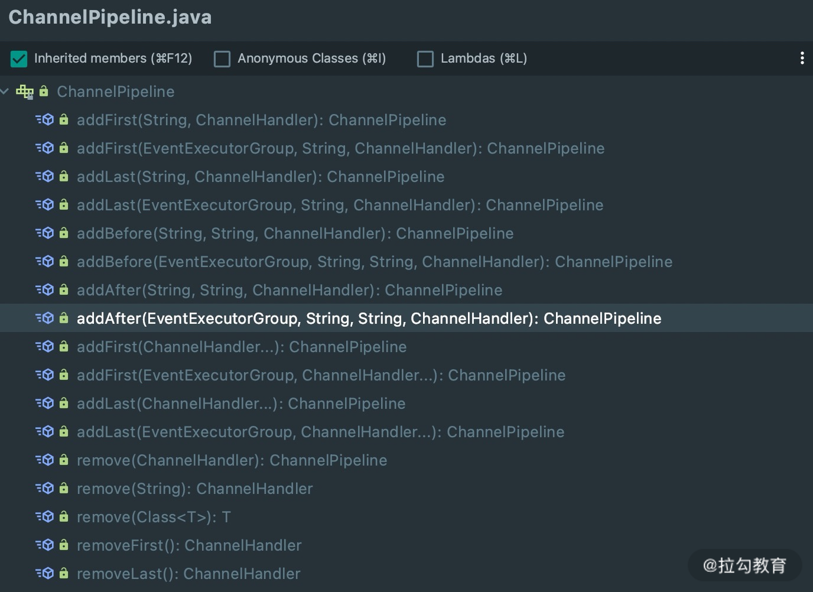
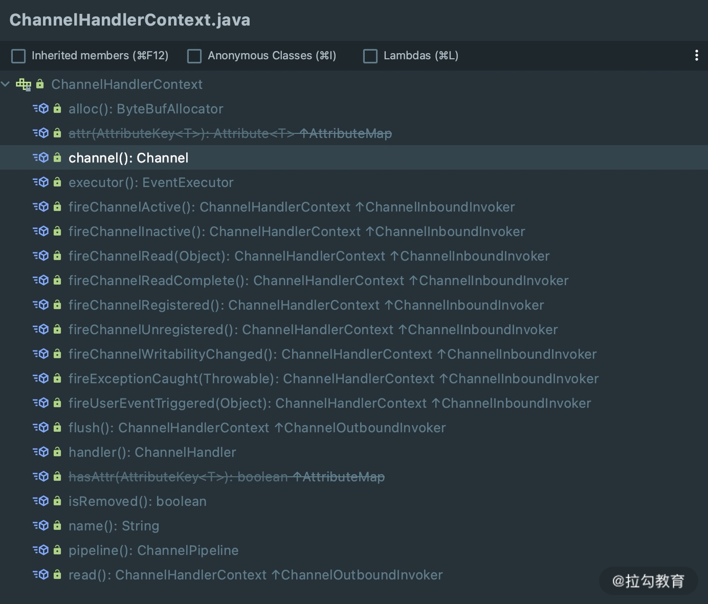

# 29 编程思想：Netty 中应用了哪些设计模式？

设计模式的运用是面试过程中常考的，学习设计模式切勿死记硬背，结合优秀项目的源码去理解设计模式的使用会事半功倍。Netty 源码中运用了大量的设计模式，常见的设计模式在 Netty 源码中都有所体现。本节课我们便一起梳理 Netty 源码中所包含的设计模式，希望能帮助你更深入地了解 Netty 的设计精髓，并可以结合 Netty 源码向面试官讲述你对设计模式的理解。

### 单例模式

单例模式是最常见的设计模式，它可以保证全局只有一个实例，避免线程安全问题。单例模式有很多种实现方法，其中我比较推荐三种最佳实践： **双重检验锁** 、**静态内部类方式 **、** 饿汉方式 **和** 枚举方式**，其中双重检验锁和静态内部类方式属于懒汉式单例，饿汉方式和枚举方式属于饿汉式单例。

#### 双重检验锁

在多线程环境下，为了提高实例初始化的性能，不是每次获取实例时在方法上加锁，而是当实例未创建时才会加锁，如下所示：

```
public class SingletonTest {
    private SingletonTest instance;
    public static SingletonTest getInstance() {
        if (instance == null) {
            synchronized (this) {
                if (instance == null) {
                    instance = new SingletonTest();
                }
            }
        }
        return instance;
    }
}

```

#### 静态内部类方式

静态内部类方式实现单例巧妙地利用了 Java 类加载机制，保证其在多线程环境下的线程安全性。当一个类被加载时，其静态内部类是不会被同时加载的，只有第一次被调用时才会初始化，而且我们不能通过反射的方式获取内部的属性。由此可见，静态内部类方式实现单例更加安全，可以防止被反射入侵。具体实现方式如下：

```
public class SingletonTest {
    private SingletonTest() {
    }
    public static Singleton getInstance() {
        return SingletonInstance.instance;
    }
    private static class SingletonInstance {
        private static final Singleton instance = new Singleton();
    }
}

```

#### 饿汉方式

饿汉式实现单例非常简单，类加载的时候就创建出实例。饿汉方式使用私有构造函数实现全局单个实例的初始化，并使用 public static final 加以修饰，实现延迟加载和保证线程安全性。实现方式如下所示：

```
public class SingletonTest {
    private static Singleton instance = new Singleton();
    private Singleton() {
    }
    public static Singleton getInstance() {
        return instance;
    }
}

```

#### 枚举方式

枚举方式是一种天然的单例实现，在项目开发中枚举方式是非常推荐使用的。它能够保证序列化和反序列化过程中实例的唯一性，而且不用担心线程安全问题。枚举方式实现单例如下所示：

```
public enum SingletonTest {
    SERVICE_A {
        @Override
        protected void hello() {
            System.out.println("hello, service A");
        }
    },
    SERVICE_B {
        @Override
        protected void hello() {
            System.out.println("hello, service B");
        }
    };
    protected abstract void hello();
}

```

在《源码篇：解密 Netty Reactor 的线程模型》课程中，我们介绍了 NioEventLoop 的核心原理。NioEventLoop 通过核心方法 select() 不断轮询注册的 I/O 事件，Netty 提供了选择策略 SelectStrategy 对象，它用于控制 select 循环行为，包含 CONTINUE、SELECT、BUSY_WAIT 三种策略。SelectStrategy 对象的默认实现就是使用的饿汉式单例，源码如下：

```
final class DefaultSelectStrategy implements SelectStrategy {
    static final SelectStrategy INSTANCE = new DefaultSelectStrategy();
    private DefaultSelectStrategy() { }
    @Override
    public int calculateStrategy(IntSupplier selectSupplier, boolean hasTasks) throws Exception {
        return hasTasks ? selectSupplier.get() : SelectStrategy.SELECT;
    }
}

```

此外 Netty 中还有不少饿汉方式实现单例的实践，例如 MqttEncoder、ReadTimeoutException 等。

### 工厂方法模式

工厂模式封装了对象创建的过程，使用者不需要关心对象创建的细节。在需要生成复杂对象的场景下，都可以使用工厂模式实现。工厂模式分为三种：**简单工厂模式 **、** 工厂方法模式 **和** 抽象工厂模式**。

- **简单工厂模式**。定义一个工厂类，根据参数类型返回不同类型的实例。适用于对象实例类型不多的场景，如果对象实例类型太多，每增加一种类型就要在工厂类中增加相应的创建逻辑，这是违背开放封闭原则的。
- **工厂方法模式**。简单工厂模式的升级版，不再是提供一个统一的工厂类来创建所有对象的实例，而是每种类型的对象实例都对应不同的工厂类，每个具体的工厂类只能创建一个类型的对象实例。
- **抽象工厂模式**。较少使用，适用于创建多个产品的场景。如果按照工厂方法模式的实现思路，需要在具体工厂类中实现多个工厂方法，是非常不友好的。抽象工厂模式就是把这些工厂方法单独剥离到抽象工厂类中，然后创建工厂对象并通过组合的方式来获取工厂方法。

Netty 中使用的就是工厂方法模式，这也是项目开发中最常用的一种工厂模式。工厂方法模式如何使用呢？我们先来看个简单的例子：

```
public class TSLAFactory implements CarFactory {
    @Override
    public Car createCar() {
        return new TSLA();
    }
}
public class BMWFactory implements CarFactory {
    @Override
    public Car createCar() {
        return new BMW();
    }
}

```

Netty 在创建 Channel 的时候使用的就是工厂方法模式，因为服务端和客户端的 Channel 是不一样的。Netty 将反射和工厂方法模式结合在一起，只使用一个工厂类，然后根据传入的 Class 参数来构建出对应的 Channel，不需要再为每一种 Channel 类型创建一个工厂类。具体源码实现如下：

```
public class ReflectiveChannelFactory<T extends Channel> implements ChannelFactory<T> {
    private final Constructor<? extends T> constructor;
    public ReflectiveChannelFactory(Class<? extends T> clazz) {
        ObjectUtil.checkNotNull(clazz, "clazz");
        try {
            this.constructor = clazz.getConstructor();
        } catch (NoSuchMethodException e) {
            throw new IllegalArgumentException("Class " + StringUtil.simpleClassName(clazz) +
                    " does not have a public non-arg constructor", e);
        }
    }
    @Override
    public T newChannel() {
        try {
            return constructor.newInstance();
        } catch (Throwable t) {
            throw new ChannelException("Unable to create Channel from class " + constructor.getDeclaringClass(), t);
        }
    }
    @Override
    public String toString() {
        return StringUtil.simpleClassName(ReflectiveChannelFactory.class) +
                '(' + StringUtil.simpleClassName(constructor.getDeclaringClass()) + ".class)";
    }
}

```

虽然通过反射技术可以有效地减少工厂类的数据量，但是反射相比直接创建工厂类有性能损失，所以对于性能敏感的场景，应当谨慎使用反射。

### 责任链模式

想必学完本专栏的前面课程后，责任链模式大家应该再熟悉不过了，自然而然联想到 ChannlPipeline 和 ChannelHandler。ChannlPipeline 内部是由一组 ChannelHandler 实例组成的，内部通过双向链表将不同的 ChannelHandler 链接在一起，如下图所示。


对于 Netty 中责任链模式的实现，也遵循了责任链模式的四个基本要素：

#### 责任处理器接口

ChannelHandler 对应的就是责任处理器接口，ChannelHandler 有两个重要的子接口：ChannelInboundHandler和ChannelOutboundHandler，分别拦截入站和出站的各种 I/O 事件。

#### 动态创建责任链，添加、删除责任处理器

ChannelPipeline 负责创建责任链，其内部采用双向链表实现，ChannelPipeline 的内部结构定义如下所示：

```
public class DefaultChannelPipeline implements ChannelPipeline {
    static final InternalLogger logger = InternalLoggerFactory.getInstance(DefaultChannelPipeline.class);
    private static final String HEAD_NAME = generateName0(HeadContext.class);
    private static final String TAIL_NAME = generateName0(TailContext.class);
    // 省略其他代码
    final AbstractChannelHandlerContext head; // 头结点
    final AbstractChannelHandlerContext tail; // 尾节点
    private final Channel channel;
    private final ChannelFuture succeededFuture;
    private final VoidChannelPromise voidPromise;
    private final boolean touch = ResourceLeakDetector.isEnabled();
    
    // 省略其他代码
}

```

ChannelPipeline 提供了一系列 add 和 remove 相关接口用于动态添加和删除 ChannelHandler 处理器，如下所示：



#### 上下文

从 ChannelPipeline 内部结构定义可以看出，ChannelHandlerContext 负责保存责任链节点上下文信息。ChannelHandlerContext 是对 ChannelHandler 的封装，每个 ChannelHandler 都对应一个 ChannelHandlerContext，实际上 ChannelPipeline 维护的是与 ChannelHandlerContext 的关系。

#### 责任传播和终止机制

ChannelHandlerContext 提供了 fire 系列的方法用于事件传播，如下所示：



以 ChannelInboundHandlerAdapter 的 channelRead 方法为例，ChannelHandlerContext 会默认调用 fireChannelRead 方法将事件默认传递到下一个处理器。如果我们重写了 ChannelInboundHandlerAdapter 的 channelRead 方法，并且没有调用 fireChannelRead 进行事件传播，那么表示此次事件传播已终止。

### 观察者模式

观察者模式有两个角色：观察者和被观察。被观察者发布消息，观察者订阅消息，没有订阅的观察者是收不到消息的。首先我们通过一个简单的例子看下观察者模式的是如何实现的。

```
// 被观察者
public interface Observable {
    void registerObserver(Observer observer);
    void removeObserver(Observer observer);
    void notifyObservers(String message);
}
// 观察者
public interface Observer {
    void notify(String message);
}
// 默认被观察者实现
public class DefaultObservable implements Observable {
    private final List<Observer> observers = new ArrayList<>();
    @Override
    public void registerObserver(Observer observer) {
        observers.add(observer);
    }
    @Override
    public void removeObserver(Observer observer) {
        observers.remove(observer);
    }
    @Override
    public void notifyObservers(String message) {
        for (Observer observer : observers) {
            observer.notify(message);
        }
    }
}

```

Netty 中观察者模式的运用非常多，但是并没有以上示例代码这么直观，我们平时经常使用的ChannelFuture#addListener 接口就是观察者模式的实现。我们先来看下 ChannelFuture 使用的示例：

```
ChannelFuture channelFuture = channel.writeAndFlush(object);
channelFuture.addListener(future -> {
    if (future.isSuccess()) {
        // do something
    } else {
        // do something
    }
});

```

addListener 方法会将添加监听器添加到 ChannelFuture 当中，并在 ChannelFuture 执行完毕的时候立刻通知已经注册的监听器。所以 ChannelFuture 是被观察者，addListener 方法用于添加观察者。

### 建造者模式

建造者模式非常简单，通过链式调用来设置对象的属性，在对象属性繁多的场景下非常有用。建造者模式的优势就是可以像搭积木一样自由选择需要的属性，并不是强绑定的。对于使用者来说，必须清楚需要设置哪些属性，在不同场景下可能需要的属性也是不一样的。

Netty 中 ServerBootStrap 和 Bootstrap 引导器是最经典的建造者模式实现，在构建过程中需要设置非常多的参数，例如配置线程池 EventLoopGroup、设置 Channel 类型、注册 ChannelHandler、设置 Channel 参数、端口绑定等。ServerBootStrap 引导器的具体使用可以参考《引导器作用：客户端和服务端启动都要做些什么？》课程，在此我就不多作赘述了。

### 策略模式

策略模式针对同一个问题提供多种策略的处理方式，这些策略之间可以相互替换，在一定程度上提高了系统的灵活性。策略模式非常符合开闭原则，使用者在不修改现有系统的情况下选择不同的策略，而且便于扩展增加新的策略。

Netty 在多处地方使用了策略模式，例如 EventExecutorChooser 提供了不同的策略选择 NioEventLoop，newChooser() 方法会根据线程池的大小是否是 2 的幂次，以此来动态的选择取模运算的方式，从而提高性能。EventExecutorChooser 源码实现如下所示：

```
public final class DefaultEventExecutorChooserFactory implements EventExecutorChooserFactory {
    public static final DefaultEventExecutorChooserFactory INSTANCE = new DefaultEventExecutorChooserFactory();
    private DefaultEventExecutorChooserFactory() { }
    @SuppressWarnings("unchecked")
    @Override
    public EventExecutorChooser newChooser(EventExecutor[] executors) {
        if (isPowerOfTwo(executors.length)) {
            return new PowerOfTwoEventExecutorChooser(executors);
        } else {
            return new GenericEventExecutorChooser(executors);
        }
    }
    
    // 省略其他代码
}

```

### 装饰者模式

装饰器模式是对被装饰类的功能增强，在不修改被装饰类的前提下，能够为被装饰类添加新的功能特性。当我们需要为一个类扩展功能时会使用装饰器模式，但是该模式的缺点是需要增加额外的代码。我们先通过一个简单的例子学习下装饰器模式应当如何使用，如下所示：

```
public interface Shape {
    void draw();
}
class Circle implements Shape {
    @Override
    public void draw() {
        System.out.print("draw a circle.");
    }
}
abstract class ShapeDecorator implements Shape {
    protected Shape shapeDecorated;
    public ShapeDecorator(Shape shapeDecorated) {
        this.shapeDecorated = shapeDecorated;
    }
    public void draw() {
        shapeDecorated.draw();
    }
}
class FillReadColorShapeDecorator extends ShapeDecorator {
    public FillReadColorShapeDecorator(Shape shapeDecorated) {
        super(shapeDecorated);
    }
    @Override
    public void draw() {
        shapeDecorated.draw();
        fillColor();
    }
    private void fillColor() {
        System.out.println("Fill Read Color.");
    }
}

```

我们创建了一个 Shape 接口的抽象装饰类 ShapeDecorator，并维护 Shape 原始对象，FillReadColorShapeDecorator 是用于装饰 ShapeDecorator 的实体类，它不对 draw() 方法做任何修改，而是直接调用 Shape 对象原有的 draw() 方法，然后再调用 fillColor() 方法进行颜色填充。

下面我们再来看一下 Netty 中 WrappedByteBuf 是如何装饰 ByteBuf 的，源码如下所示：

```
class WrappedByteBuf extends ByteBuf {
    protected final ByteBuf buf;
    protected WrappedByteBuf(ByteBuf buf) {
        if (buf == null) {
            throw new NullPointerException("buf");
        }
        this.buf = buf;
    }
    @Override
    public final boolean hasMemoryAddress() {
        return buf.hasMemoryAddress();
    }
    @Override
    public final long memoryAddress() {
        return buf.memoryAddress();
    }
    
    // 省略其他代码
}

```

WrappedByteBuf 是所有 ByteBuf 装饰器的基类，它并没有什么特别的，也是在构造函数里传入了原始的 ByteBuf 实例作为被装饰者。WrappedByteBuf 有两个子类 UnreleasableByteBuf 和 SimpleLeakAwareByteBuf，它们是真正实现对 ByteBuf 的功能增强，例如 UnreleasableByteBuf 类的 release() 方法是直接返回 false 表示不可被释放，源码实现如下所示。

```
final class UnreleasableByteBuf extends WrappedByteBuf {
    private SwappedByteBuf swappedBuf;
    UnreleasableByteBuf(ByteBuf buf) {
        super(buf instanceof UnreleasableByteBuf ? buf.unwrap() : buf);
    }
    @Override
    public boolean release() {
        return false;
    }
    // 省略其他代码
}

```

不知道你会不会有一个疑问，装饰器模式和代理模式都是实现目标类增强，他们有什么区别吗？装饰器模式和代理模式的实现确实是非常相似的，都需要维护原始的目标对象，装饰器模式侧重于为目标类增加新的功能，代理模式更侧重于在现有功能的基础上进行扩展。

### 总结

学习设计模式切勿死记硬背，不仅要吸收设计模式的思想，还要理解为什么使用该设计模式。锻炼代码设计能力比较好的办法就是读优秀框架的源码，Netty 就是一个非常丰富的学习资源。我们需要了解源码中设计模式的使用场景，不断吸收消化，并能够做到在项目开发中学以致用。

本节课所介绍的设计模式在 Netty 中并不能涵盖所有，还有很多等待我们去挖掘。留一个课后任务，学习以下设计模式在 Netty 中的运用。

- 模板方法模式：ServerBootStrap 和 Bootstrap 的 init 过程实现；
- 迭代器模式：CompositeByteBuf；
- 适配器模式：ScheduledFutureTask。
