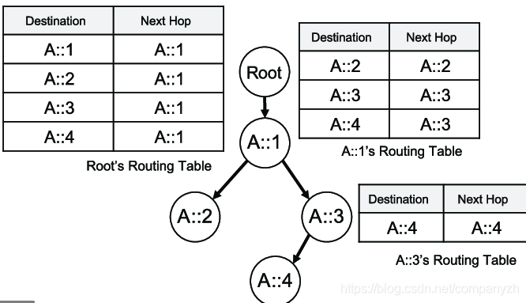

12 向左还是向右 - IP路由
================

我们上一小节了解了未来的这个钻石王老五IPV6，现在让我们回来继续了解当今还高高在上的IPV4。这就是理想很丰满，现实很骨感，IPV6固然好，但是现在还是IPV4的世界，所以我们还是要知己知彼。

### 子网的框架

我们先来看一下子网的框架。还是先看一个例子

```
IP：203.0.113.10

子网：255.255.255.0


复制

```

我们前面是不是已经讲过或者说介绍过了子网掩码的问题。为了进行子网划分，我们必须首先转换为二进制。也许还有别的方法，但是我始终觉得二进制是解决这类问题的杀手锏。所以，当我们使用这些地址时，请切记我们要先转换为二进制。

```
IP：11001011 00000000 01110001 00001010

子网：11111111 11111111 11111111 00000000


复制

```

我们现在来看的是一种新的表示方法。这个例子中255.255.255.0 你来算一下，实际上是前多少位作为网络地址。是前24位对不对，所以你可以写成/24。这样看上去是不是就简洁了很多，那写出来的样子就是203.0.113.10/24。这么酷炫的写法怎么会没有名字呢，它叫做无类域间路由。英文全称是Classless Inter-domain Routing，一般使用简写CIDR。

### 拆分子网到更小的网络

我们来看一个稍微复杂一点的实例。比如说你听了我的课之后，充满了信心，决定要自己开一个公司。而且还要开一个连锁企业，直接就在全国部署8个办公地点。北京，上海，重庆，天津，杭州，苏州，武汉以及云南（老师地理知识有限）。你去找ISP(互联网服务提供商)帮忙，他们分给了你一个IP的区段203.0.113.0/24。但是你需要8个网络地址，你怎么办呢？让我们来分析一下

```
203.0.113.0/24 这个是给你的

实际上的范围就是 203.0.113.0 - 203.0.113.255 写成二进制的话就是

11001011 00000000 01110001 00000000 我们之前讲过这个吧，这个是网络地址

11001011 00000000 01110001 11111111 这个是广播地址

所以我们可用的地址就是这个区间的地址吧。


复制

```

你需要的是8个网络对不对，你算一下2的几次方=8。结果是不是3，所以你需要3个bits就可以。说明什么问题，因为前24位是ISP给你的，你不可以变，所以你可以变得就是后8位，但是你又需要8个网络，所以你需要3个bits来帮助你划分，就是下面这样

```
11001011 00000000 01110001 000xxxxx

11001011 00000000 01110001 001xxxxx

11001011 00000000 01110001 010xxxxx

11001011 00000000 01110001 011xxxxx

11001011 00000000 01110001 100xxxxx

11001011 00000000 01110001 101xxxxx

11001011 00000000 01110001 110xxxxx

11001011 00000000 01110001 111xxxxx


复制

```

既然是又多了3bits是固定的，那你是不是要使用/27来作为子网掩码了。小考题，如果需要10个网路，你怎么分？ 好，我们继续来看，我们先看第一个网络11001011 00000000 01110001 000xxxxx

```
Network 1

11001011 00000000 01110001 000xxx

第一个地址是不是

11001011 00000000 01110001 00000000 这个写成十进制是什么样子呢？203.0.113.0

最后一个是不是

11001011 00000000 01110001 00011111 -> 203.0.113.31

写成CIDR的形式就是203.0.113.0/27


复制

```

我再来带着你看下一个

```
Network 2

11001011 00000000 01110001 001xxx

第一个地址是不是

11001011 00000000 01110001 00100000 这个写成十进制是什么样子呢？203.0.113.32

最后一个是不是

11001011 00000000 01110001 00111111 -> 203.0.113.63

写成CIDR的形式就是203.0.113.32/27


复制

```

所以以此类推，你的8个网络写出来是这个样子的。自己先练习一下

```
Network 1 -> 203.0.113.0/27

Network 2 -> 203.0.113.32/27

Network 3 -> 203.0.113.64/27

Network 4 -> 203.0.113.96/27

Network 5 -> 203.0.113.128/27

Network 6 -> 203.0.113.160/27

Network 7 -> 203.0.113.192/27

Network 8 -> 203.0.113.224/27


复制

```

那以上的网络怎么进行通信呢？通过路由器。

### 路由器的工作原理

什么是路由器呢？我从百度百科上copy了这个无聊的定义。（专业的事情交给专业的人来做）

#### 无聊的定义

路由器是连接两个或多个网络的硬件设备，在网络间起网关的作用，是读取每一个数据包中的地址然后决定如何传送的专用智能性的网络设备。它能够理解不同的协议，例如某个局域网使用的以太网协议，因特网使用的TCP/IP协议。这样，路由器可以分析各种不同类型网络传来的数据包的目的地址，把非TCP/IP网络的地址转换成TCP/IP地址，或者反之；再根据选定的路由算法把各数据包按最佳路线传送到指定位置。所以路由器可以把非TCP/ IP网络连接到因特网上。

相信你和我一样，看完定义和没看一样，还是一头雾水，好，那怎么办呢？小实例走起，让你可以理解的更加透彻。假设我们现在有一个小的网络地址10.0.0.0/24。我们只需要把它拆分成两个网络，怎么拆呢？经过了上面的8个，这两个小意思吧。

```
10.0.0.0/24

10.0.0.00000000

拆分成

10.0.0.00000000

10.0.0.10000000

所以写成的CIDR就是10.0.0.0/25 和10.0.0.128/25


复制

```

好，我现在有了两个网络，他们之间怎么通信呢？这个就是路由器登场的时候了，左边的网络是10.0.0.0/25 中间是路由器，右边是10.0.0.128/25。你要做的就是把这两个网络地址放到路由器的两端，路由器的作用就是在网络间传输数据的。说白了路由器就是在里面有一个路由表，里面写好了这个通信是从哪里来到哪里去。



比如上面这个图，左边的这个表就是存在于Root里面，里面会记录上，不管你想去A::1，A::2，A::3，A::4。你的下一站都是A::1。 再来看一下右上角的那个路由表，这个表示存在于A::1中的。当你想去A::2的时候，下一站就是A::2，当你想去A::3和A::4时，下一站都是A::3。 自己看一下右下角那个表应该明白了吧。

因为你毕竟不是网络工程师，所以不太需要知道更多关于路由器的细节。上面这个图我都可以不用讲，但是不说，总感觉缺点什么。看到这里就可以了。给自己一个鼓励。你已经完成了IP部分的学习，其实很是包含很多东西的，如果你只是简单的看看，估计什么也没有学会，IP的学习还是要坐下来，用心的去思考，去计算。毕竟好记性不如烂笔头吗。
