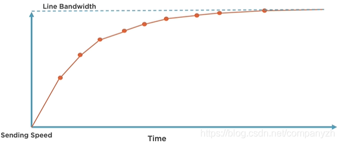
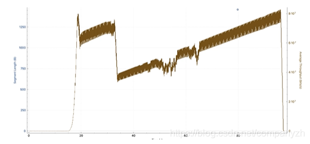
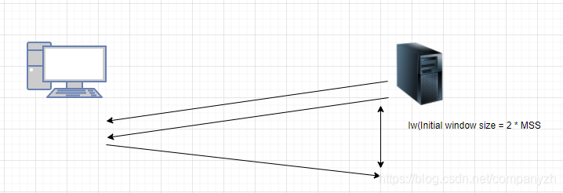
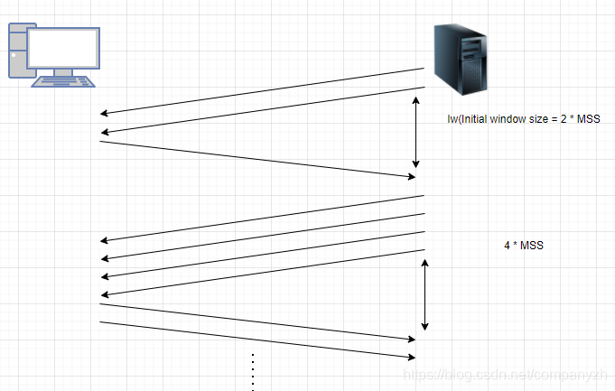
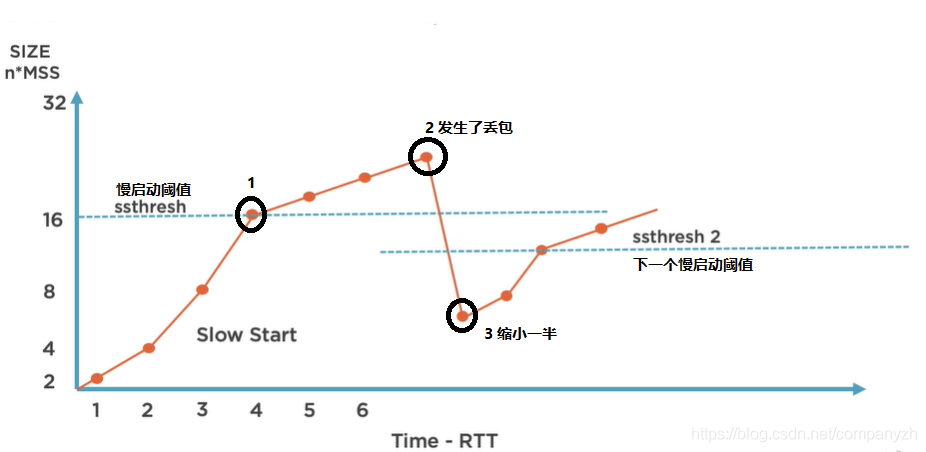
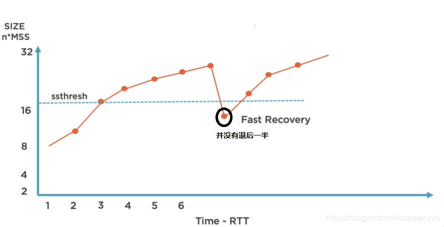

16 我为什么与众不同 - TCP高级篇（拥塞模型）
==========================

首先我们可以肯定的是TCP协议是可靠的。这就是我们前面讲的TCP知识。它是可靠地从网络上的一个端点到另一端点获取数据，但是它不希望使两者之间的网络不堪重负。TCP不想非常快的就开始发送数据，这样会导致拥塞和数据包丢失。同样，TCP也不想“欺负”其他的网络，把其他所有协议都淘汰掉，优先考虑自己的流量。因此，通过TCP拥塞控制，TCP能够确定网络上的拥塞并相应地调整其传输速率。

这可能与你想象的有一点不同。通常，我们开始传输该文件，并且我们想象的是，发送速度逐渐提高，并逐渐接近带宽。我们能够用吞吐量完全填满网络，并且该文件能够尽快通过链接传输。就像下图一样

但是理想很丰满，现实很骨感。下图是在Wireshark的吞吐量图。

从图上可以看到吞吐量的变化。最初会上升，然后略有下降。它会先恢复一段时间，然后再次下降，然后随着时间的推移缓慢重建。因此现实是，TCP不会完全填充网络，当我们将文件从一个端点传输到另一个端点时。会有很多事情来控制。造成这种情况的原因是，TCP被设计为在端点之间具有不可预测的网络的情况下非常智能，现实也确实如此。今天，我们正在处理无线，高延迟，高损耗，多路径，高拥塞的情况。因此，这两个端点需要确定它们之间网络中正在发生的事情，并尽其最大可能地填充它，并以最有效的方式将数据从A点移动到B点。而TCP正是通过拥塞机制来进行控制的。这也是为什么它很重要的原因。

### 拥塞窗口

让我们想象一下，在客户端，我们有一个大小限制为65535的TCP接收窗口。那么，无论中间的网络大小如何，发送方都只能一次将65535放到网络中传输。现在，如果我们不传输大量数据或处于非常低的延迟环境中（例如端点之间为1毫秒），则接收窗口可能是足够的。但是，如果我们试图通过高延迟的链接来传送大量数据，窗口接收的数据量也不会减少。但是无论哪种方式，发送者都受到接收窗口的限制。这是拥塞窗口起作用的地方。

让我们想象一下，客户端的接收窗口现在大大增加到1GB。那么使用的是1GB的接收窗口。客户端很自信的堆服务器说：“嘿，服务器，给我你所有的东西，我能处理。你最多可以发送1GB的未确认数据。但是在这里发件人需要做出决定，也就是思考一下。在引起拥塞问题之前，它将在网络上发送多少，是1GB吗还是512MB还是10Kb？该服务器知道还有其他TCP连接和使用。它知道并非所有链接都相同。因此，该服务器不知道中间是哪种网络。我们有穿越海洋的T1连接吗？这两个端点之间是否有卫星连接？还是说客户端只是一个交换机端口？所以最开始的时候，服务器不知道一次发送多少，并且它不希望引起流量问题并引起争用和拥塞，这将导致数据包丢失。因此，该服务器可以传输的数据量是拥塞窗口或接收窗口的最小值。哪个值较小，就使用哪个值。我们的这个例子，接收器有很大很大的接收窗口。除非我们之间有一个非常非常牢固的网络，否则我们不可能在拥塞窗口实现这一目标。这里变得有些意思了。TCP接收窗口的大小会在TCP的头中。还记得上一节讲的TCP Header中有一个Window Size吗？

因此，当工作站发送确认甚至数据包时，它总是会告诉你必须使用多少窗口大小。在上面照片中，可以看到实际的真实窗口大小值为262，但由于我们使用的是窗口缩放，所以实际上是一个更大的值。在这里我们可以看到对方可以一次发送33536。这个不是问题，因为我们在接收缓冲区中可以拥有的数据量。我们永远不会在包头中看到它。实际上，挖掘并找出实际值是什么，几乎是不可能的。原因之一是因为这个数字一直在变。TCP总是增加拥塞窗口或减少拥塞窗口，这取决于它从网络之间确定的结果。因此，我们能做的最好的就是查看该拥塞窗口，并确定这是吞吐量缓慢问题的根本原因吗？

### 拥塞算法

我们知道了拥塞控制机制是什么，让我们一起来看一些算法及其工作原理。TCP拥塞控制机制决定发送方如何使用网络上的带宽。还可以决定该设备遇到丢失或高延迟时将退后并恢复的速度。现在让我们来看一些拥塞控制算法的名字？也许你以前听说过其中一些。比如vegas，Reno，NewReno，CUBIC等等。有很多不同的算法。随着时间的流逝和网络的变化，我们发现它们已经经过调整和优化，可以在不同类型的网络上更好地运行。例如，当网络具有更高的带宽和更高的延迟（跨过海洋下面的40GB连接通道）时，我们开始意识到需要对TCP发送算法进行更改，可能需要使它们更具“攻击性”，而不必仅仅因为丢失一个数据包就减缓传输的速度。同样，一些常见的拥塞控制算法，取决于操作系统，使用的TCP版本，安装的补丁程序，这些都会对使用哪种算法产生影响。我们来更深入地了解一下这些算法为何不同。

聊这些算法之前，你自己先想一下都需要考虑什么？第一个想到的核心组成部分是不是初始窗口大小（这个是不是很重要，小了，会慢，大了，会丢失）。初始窗口就是发送方在传输文件时立即发出的完整MSS(Maximum segment size）数据包的大小。假设我们的服务器使用的是非常保守的拥塞控制机制，它一次只发送两个全尺寸数据包。在发送更多数据之前，它会等待这些数据包的确认返回，返回后，将可以继续发送更多内容。初始窗口大小的决定，网络上发出了多少个数据包，这些都取决于拥塞控制机制的使用。

比如在NewReno的某些实现中，开始的窗口大小是四个MSS大小的数据包，这是初始窗口设置。在许多CUBIC算法的实现中，使用10个MSS作为初始窗口。初始窗口是拥塞算法的核心，这表示的是最开始发送多少数据包。

拥塞机制的另一个核心组件是慢启动。什么意思呢？就是我们的服务器，它发送两个完整的MSS到客户端，然后从客户端收到确认，整个过程很顺畅。然后再测量一下在发送数据和接收确认之间的等待时间，服务器会认为整个流程没有问题。之后服务器会将下次发送的MSS数量翻倍，，它将在下一次发送四个MSS，然后等待这些确认返回。重复上面流程，如果还是很顺畅，会继续的将发出的数据包数量加倍。这是一种常见的机制，你会在Reno和NewReno等一些较旧的算法中看到这种机制。

##### 慢启动

我们来详细看一下慢启动的过程。

在我们的图表中，我们可以看到，时间是底部X轴表示往返时间，Y轴表示发送包的数量。发送站通过发送两个完整的MSS来启动。它等待第一次网络往返的确认返回，然后将拥塞窗口加倍，接下来将为第二次往返发送四个MSS。如果这些都出去了，那么认为没有任何问题，那么我们将再次加倍，第三次网络往返传输将获得8个MSS。如果所有这些都被成功接收，并且我们收到了很好的回覆，继续再次加倍。现在，在某个时候，根据算法以及该算法能够从网络中确定的延迟时间，该算法将设置一个慢启动阈值（图中的1），这意味着你可以将网络上现有的MSS数量加倍直到碰到这一点。在这种情况下，我们说该数量为16。在那之后，我们从慢启动机制更改为避免拥塞机制。这就是说，对于每个网络往返，我们将只添加一个，而不是将网络上的MSS数量加倍。因此，对于第五次网络往返，我们将有17个MSS（也就是16 + 1）。对于第6次网络往返，我们将有18个MSS（17 + 1），这将缓慢增加拥塞窗口，直到遇到丢包或拥塞为止（图中的2）。当我们遇到超时或发送数据包却没有收到响应时会发生什么？这时候，大多数拥塞控制算法所采用的是让步。（在较早的日子里，这个数字实际上会回到一半）。将拥堵窗口缩小一半（图3），然后从慢启动重新开始，直到再次达到慢启动阈值。但是，随着时间的流逝，网络连接的带宽不断提高，在某些情况下，延迟也有所增加，这种倍增的后退策略有点激进了。就像我们在这里看到的那样，仅由于遇到单个数据包丢失，我们就损失一半的吞吐量。

 因此，为了解决此问题，使用了另一个核心组件那就是-快速恢复。快速恢复可以帮助我们做的是，我们从拥挤窗口中的那个高点退回，但并不是一半的腰斩。而是退后一点然后再慢慢重建。

我们前面提到了，使用哪种拥塞控制算法取决了很多事情？初始窗口，最初发出了多少个MSS？是否使用慢启动机制，还是快速启动？慢启动阈值如何设置？什么时候开始避免拥堵？是否使用快速恢复？还是如果遇到一些损失，会重新回到慢速启动？我们是否只会在看到数据包丢失的情况下才后退，还是等待时间的变化会导致我们放慢速度？所有这些都取决于你所使用的TCP算法，并且它们都是不同的。让我们来看一些常见的拥塞算法及其独特之处。

* NewReno是你可能听说过的一种，在2000年代，它非常流行，许多不同的系统都在使用它。现在NewReno还在使用，但是在长肥网络（LFN，long fat network）上它的性能很差（比如海底隧道这种网络）。如果你通过跨海洋的10GB连接发送文件，但效果不佳，则可能需要进行调查是否使用了NewReno。
* CTCP - 这是Windows Server 2003和Windows 7上的默认拥塞控制机制。
* CUBIC - 是在Windows 10和MacBooks上默认使用的。原因之一是因为它在长肥网络中效果非常好。它可以快速建立其拥塞窗口，并且不会非常迅速地退后。如果看到丢失的数据包，它不会退缩到一半。
* Westwood - 你不是经常能看到这种机制，它是专为处理有损网络而设计的。
* 最后是BBR - 这是Google专门开发的；它可以在大多数服务器中使用，并且你还可以在Linux操作系统上进行实验。

#### 拥塞检测机制

TCP如何知道出现问题并相应的退出其拥塞窗口？决定拥塞算法退避的主要方法有两种

1. 第一种是丢包。因此，在这里我们可以看到服务器发送了两个数据包，并且得到了很好的确认。然后发出四个数据包，其中一个数据包丢失。这就是说，我试过发出四个，但是效果不好，既然这样我就坚持每次网络往返都使用2MSS。
2. 另一种拥塞检测机制是测量延时。服务器发送了几个数据包。就好像短跑比赛一样，这时候按下启动秒表。当看到这些数据包的确认返回时，便可以停止该秒表并测量延迟。该等待时间（延迟）不应该有显着变化。通常，仅当某处的链接出现拥塞时，它才会发生变化。让我们再想象一下，该服务器发送了几个数据包，但是这次要花费更多的时间才能从客户端取回确认。说明什么问题？是不是说明发生了拥堵。

拥塞机制可以算是TCP比较高级一点的知识，希望你能对TCP的知识有了一个更深层次的理解。
