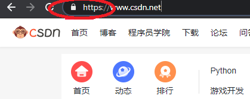
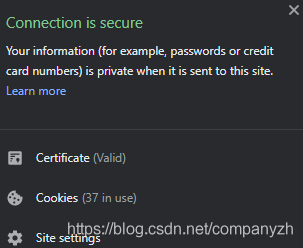
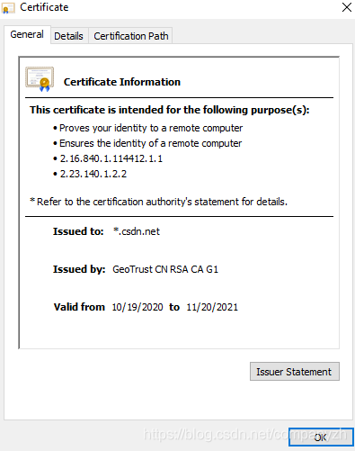
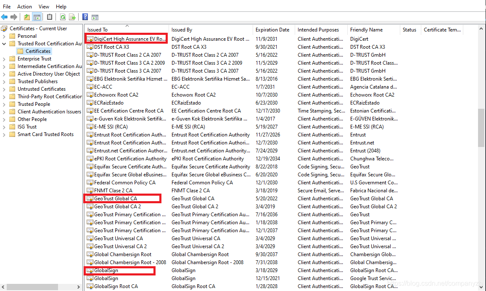
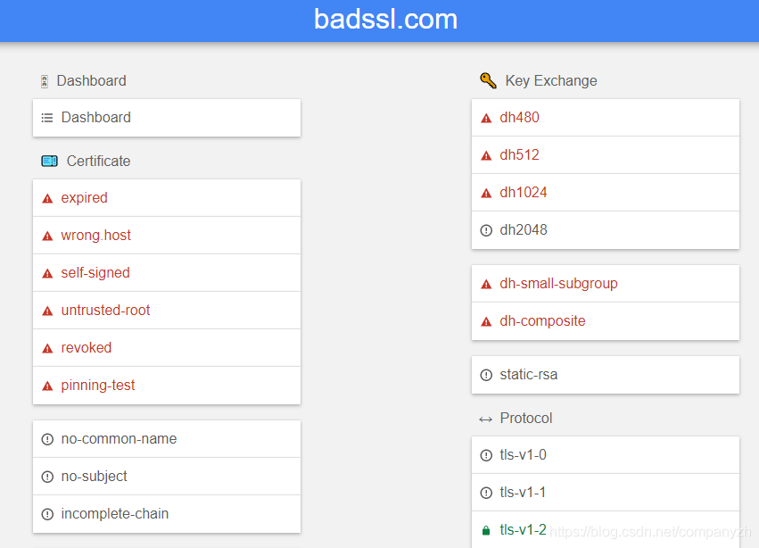
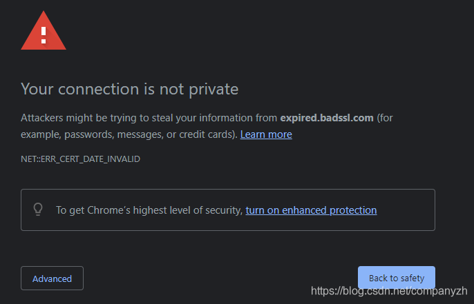
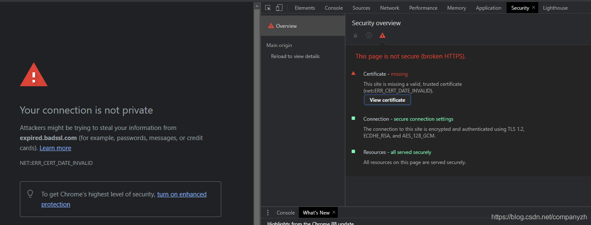
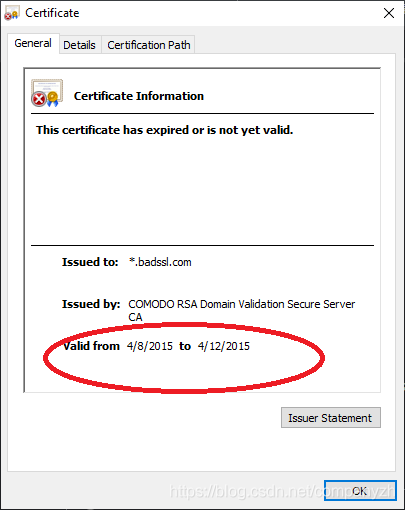

20 稳重的大外甥 - HTTPS
=================

我们前面在讲解HTTP1和HTTP2的时候，有意无意的提到过HTTPS。现在来认真的分析一下这位名正言顺的皇亲国戚。

### Certificate Authorities

Certificate Authorities - 证书颁发机构（CA）是HTTPS能够实现安全通信的必要的基本组成部分。这些颁发的证书要加载到网站中，以便客户可以安全地进行通信。每次你通过HTTPS的连接来浏览网站时，该网站的拥有者都会使用颁发机构给的证书来验证其对该域名的所有权（这么好的事，怎么会是免费的呢？这个是需要花钱买的，比如GlobalSign这个公司就是卖Certificate的）。

让我给你举个CA的例子。让我们一起来看一下csdn的网站，如你所见，它是通过HTTPS提供的链接。

有挂锁，点击挂锁会有绿色的安全。

一切看起来都不错。让我们继续点击Certificate，看看谁颁发了证书。

我们可以看到它是由GeoTrust颁发的证书。这是一种非常简单的方法，可以检查哪个CA向我颁发了安全通信的证书。就像刚刚的例子一样，很容易去检查谁颁发了证书。事实上CA很多，比如，GlobalSign，DigiCert，还有csdn使用的GeoTrust等等。那这种证书是怎么工作的呢？或者说怎么确保安全和不安全呢。

1. 首先，你的机器要信任这些CA。
2. CA签署证书。
3. 从网站返回到浏览器后，你的计算机就会通过参考本地受信任的授权机构列表来验证证书是否合法。

我们来一起看看如何找到这个认证。按Windows + R来运行命令，然后输入certmgr.msc来打开应用程序。你能看到本地证书管理器。我们感兴趣的受信任的根证书颁发机构。如图。

是不是可以看到我刚刚举例的几个CA都在其中。我们可以在这里看到很多其他名称，其中一些可能是熟悉的，还有许多其他名称是不熟悉的。Windows也可以信任根据需要下载的其他CA。因此，不仅限于我们在此处列出的证书颁发机构。

此CA列表由Windows使用，由Internet Explorer使用，由Chrome使用。但Firefox不使用它（就是这么傲娇，你能咋地）。 Firefox管理自己的CA列表。感兴趣的话，你可以通过菜单，选项，高级，然后在此处的“证书”选项卡上，查看证书。这里我就不多讲了。

有时删除CA会导致使用该CA的任何网站提供服务的证书无效。比如一个机构颁发的证书安全性严重下降，这使攻击者可以欺诈性地为不受控制的域颁发证书。Microsoft可以立即将它们 从Windows和Firefox的证书颁发机构列表中删除，那他颁发的证书也就无效了。还记得第一步是什么吗？是你的计算机要和CA信任。所以成为CA承担着巨大的责任，如果不十分谨慎地履行其职责，后果可能很严重。所以，要点钱就要点钱吧。

### SSL 和 TLS

探讨完了CA，我们来一起看一下SSL和TLS。它们在讨论HTTPS的时候，也是不可回避的话题。并且它们往往可以互换使用。例如，人们通常在说SSL时其实说的是TLS。让我们谈谈它们的实际含义以及背后的黑历史。

##### SSL

SSL的全称是Secure Sockets Layer也就是安全套接字层，它最初是由Netscape于90年代初期构建的。版本1. 0没有被外部使用，从版本2. 0开始也就是1995年开始问世。这确实是我们第一次开始在网络浏览器中大规模使用安全传输层。随后是第二年的版本3.0。这是SSL的最后一个主要版本。SSL确实存在了很长时间，直到2014年，当我们遭受POODLE攻击时，SSL才真正的寿终正寝（江湖上只流传着哥的传说）。

##### TLS

接下来让我们谈谈TLS。 TLS全称是Transport Layer Security（传输安全层）。1999年作为SSL3.0的升级版现身，它原本打算成为SSL的继任者，这也是关于这两个术语的第一个真正重要的观点。自本世纪初以来，TLS一直是网络上实现HTTPS的标准。 SSL停下了，TLS的时代开启了。版本1. 1于2006年问世，而版本1. 2则在此后2年问世也就是2008。2018年TLS 1.3上线了。随着这些新版本的发布，我们可以看到安全性和速度等方面的进步。它们继续使安全通信变得更强大，更快和更高效。

现在的挑战是，你在交流中总是会有两个参与者。对于HTTPS，通常会有一个浏览器和一个服务器。他们会协商使用哪种实现方式。例如，你可能有一台服务器，可以在任何地方实现TLS1.2。现在，如果客户端出现并说，我只能工作到TLS 1.1。则通信将回退到普遍支持的最高协议版本也就是1.1。

POODLE攻击后发生的重大变化之一是，开始完全取消对SSL支持。这是因为使POODLE如此有效的部分原因是，攻击者可以迫使通信从TLS降级为SSL，来完美的利用它的弱点。由于SSL至今已经深入我们的脑海，因此人们经常表示TLS时说SSL。这已经变得有点口语化了。例如，如果我要构建一个Web应用程序，并且我想强制应用程序使用安全连接，我设置了一个名为需要SSL的属性。现在，它根本不需要SSL，它需要HTTPS，并且使用TLS来实现。但是它仍然被称为SSL。

### TLS 握手 -- 怎么又握手呢？还有完吗

当客户端（例如浏览器）想要通过HTTPS连接到服务器时，它们会开始进行TLS握手。这是客户端和服务器需要相互协商并就如何安全通信达成一致的地方。此握手由客户端问候开始，并且在此请求中，客户端还会将例如它支持的最高级别的TLS和其他信息（比如受支持的密码套件）一起发送。然后，服务器将以服务器问候响应。并在响应中就协议版本和密码套件达成一致，并将其公钥提供回客户端。现在，客户可以根据其证书颁发机构列表来验证该公钥，在这里我们是为了验证我们是在和我们认为的这个服务器来交流。也就是她是我那个女神，不是什么抠脚大汉冒充的。（这里需要注意的一件事是，此初始通信尚未加密，这只是谈判阶段）。所以，中间的人可以看到客户端正在尝试与服务器通信，并且可以知道两者的身份。这段通讯还没有任何的内容；只是试图协商初始连接。客户端现在可以与服务器执行密钥交换，并且此响应使用服务器的公共加密密钥；服务器现在可以向其返回服务器完成的响应；这样便可以开始安全通信。当你基于HTTPS构建应用程序时，你要了解的一点是，这里存在一个协商，你可以看到哪个客户端和服务器正在互相交谈，并且一旦安全地建立了通信，那么请求和响应的内容就会被加密。举个例子，就好像看直播，美女问你要私聊吗，大家都知道是谁在和谁协商，一旦协商好，两人就去私密房了，至于干点啥就是保密的，你就不知道了。（我没有开车呀，不能是一起学网络协议吗?）。这就是TLS握手的过程。

### 返其道而行

赶紧拉上窗帘，我要在这里给大家介绍一个小网站，它就是badssl.com。

那这个神秘的网站是干什么的呢？它可以让您测试TLS的错误实现。因为这个网站说明了HTTPS可能出错的所有情况以及它在应用程序中的配置方式。比如，如果你向具有过期证书的网站发出HTTPS请求，该怎么办？

如图所示，Chrome会给一个非常明显的警告。这正是我们所期望的。你可以通过Inspect然后点击Security来查看这个证书。

下图就是这个证书

你可以看到这个证书是什么时候过期的，非常适合查看服务到期后客户端的行为。这也使我们有机会了解不同客户的行为方式。我就不一一列举了，感兴趣的你可以自己研究一下这个网站，看看对你有没有吸引力。
