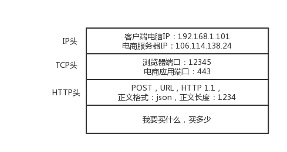
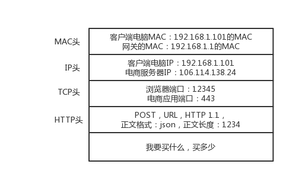
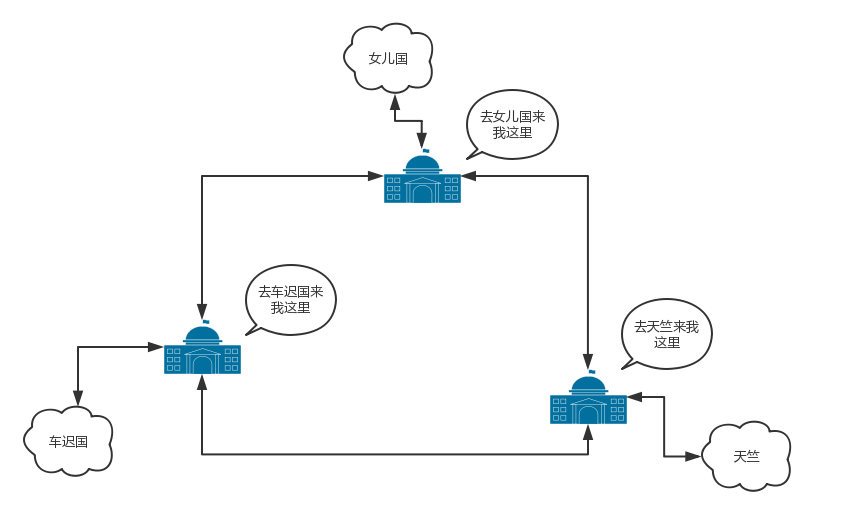

# 01 讲为什么要学习网络协议

《圣经》中有一个通天塔的故事，大致是说，上帝为了阻止人类联合起来，就让人类说不同的语言。人类没法儿沟通，达不成“协议”，通天塔的计划就失败了。

但是千年以后，有一种叫“程序猿”的物种，敲着一种这个群体通用的语言，连接着全世界所有的人，打造这互联网世界的通天塔。如今的世界，正是因为互联网，才连接在一起。

当"Hello World!"从显示器打印出来的时候，还记得你激动的心情吗？

```java
public class HelloWorld {
  public static void main(String[] args){
    System.out.println("Hello World!");
  }
}
```

如果你是程序员，一定看得懂上面这一段文字。这是每一个程序员向计算机世界说“你好，世界”的方式。但是，你不一定知道，这段文字也是一种协议，是人类和计算机沟通的协议，  **只有通过这种协议，计算机才知道我们想让它做什么。**

## 协议三要素

当然，这种协议还是更接近人类语言，机器不能直接读懂，需要进行翻译，翻译的工作教给编译器，也就是程序员常说的compile。这个过程比较复杂，其中的编译原理非常复杂，我在这里不进行详述。



但是可以看得出，计算机语言作为程序员控制一台计算机工作的协议，具备了协议的三要素。

- **语法** ，就是这一段内容要符合一定的规则和格式。例如，括号要成对，结束要使用分号等。
- **语义** ，就是这一段内容要代表某种意义。例如数字减去数字是有意义的，数字减去文本一般来说就没有意义。
- **顺序**，就是先干啥，后干啥。例如，可以先加上某个数值，然后再减去某个数值。

会了计算机语言，你就能够教给一台计算机完成你的工作了。恭喜你，入门了！

但是，要想打造互联网世界的通天塔，只教给一台机器做什么是不够的，你需要学会教给一大片机器做什么。这就需要网络协议。\*\*只有通过网络协议，才能使一大片机器互相协作、共同完成一件事。\*\*这个时候，你可能会问，网络协议长啥样，这么神奇，能干成啥事？我先拿一个简单的例子，让你尝尝鲜，然后再讲一个大事。

当你想要买一个商品，常规的做法就是打开浏览器，输入购物网站的地址。浏览器就会给你显示一个缤纷多彩的页面。

那你有没有深入思考过，浏览器是如何做到这件事情的？它之所以能够显示缤纷多彩的页面，是因为它收到了一段来自HTTP协议的“东西”。我拿网易考拉来举例，格式就像下面这样：

```bash
HTTP/1.1 200 OK
Date: Tue, 27 Mar 2018 16:50:26 GMT
Content-Type: text/html;charset=UTF-8
Content-Language: zh-CN

<!DOCTYPE html>
<html>
<head>
<base href="https://pages.kaola.com/" />
<meta charset="utf-8"/> <title>网易考拉3周年主会场</title>
```

这符合协议的三要素吗？我带你来看一下。

首先，符合语法，也就是说，只有按照上面那个格式来，浏览器才认。例如，上来是**状态 **，然后是** 首部 **，然后是** 内容**。

第二，符合语义，就是要按照约定的意思来。例如，状态200，表述的意思是网页成功返回。如果不成功，就是我们常见的“404”。

第三，符合顺序，你一点浏览器，就是发送出一个HTTP请求，然后才有上面那一串HTTP返回的东西。

浏览器显然按照协议商定好的做了，最后一个五彩缤纷的页面就出现在你面前了。

## 我们常用的网络协议有哪些？

接下来揭秘我要说的大事情，“双十一”。这和我们要讲的网络协议有什么关系呢？

在经济学领域，有个伦纳德·里德（Leonard E. Read）创作的《铅笔的故事》。这个故事通过一个铅笔的诞生过程，来讲述复杂的经济学理论。这里，我也用一个下单的过程，看看互联网世界的运行过程中，都使用了哪些网络协议。

你先在浏览器里面输入 [https://www.kaola.com](https://www.kaola.com/) ，这是一个**URL **。浏览器只知道名字是“www.kaola.com”，但是不知道具体的地点，所以不知道应该如何访问。于是，它打开地址簿去查找。可以使用一般的地址簿协议** DNS **去查找，还可以使用另一种更加精准的地址簿查找协议** HTTPDNS**。

无论用哪一种方法查找，最终都会得到这个地址：106.114.138.24。这个是**IP**地址，是互联网世界的“门牌号”。

知道了目标地址，浏览器就开始打包它的请求。对于普通的浏览请求，往往会使用**HTTP **协议；但是对于购物的请求，往往需要进行加密传输，因而会使用** HTTPS**协议。无论是什么协议，里面都会写明“你要买什么和买多少”。


DNS、HTTP、HTTPS所在的层我们称为**应用层 **。经过应用层封装后，浏览器会将应用层的包交给下一层去完成，通过socket编程来实现。下一层是** 传输层 **。传输层有两种协议，一种是无连接的协议** UDP **，一种是面向连接的协议** TCP**。对于支付来讲，往往使用TCP协议。所谓的面向连接就是，TCP会保证这个包能够到达目的地。如果不能到达，就会重新发送，直至到达。

TCP协议里面会有两个端口，一个是浏览器监听的端口，一个是电商的服务器监听的端口。操作系统往往通过端口来判断，它得到的包应该给哪个进程。


传输层封装完毕后，浏览器会将包交给操作系统的**网络层**。网络层的协议是IP协议。在IP协议里面会有源IP地址，即浏览器所在机器的IP地址和目标IP地址，也即电商网站所在服务器的IP地址。



操作系统既然知道了目标IP地址，就开始想如何根据这个门牌号找到目标机器。操作系统往往会判断，这个目标IP地址是本地人，还是外地人。如果是本地人，从门牌号就能看出来，但是显然电商网站不在本地，而在遥远的地方。

操作系统知道要离开本地去远方。虽然不知道远方在何处，但是可以这样类比一下：如果去国外要去海关，去外地就要去**网关**。而操作系统启动的时候，就会被DHCP协议配置IP地址，以及默认的网关的IP地址192.168.1.1。

操作系统如何将IP地址发给网关呢？在本地通信基本靠吼，于是操作系统大吼一声，谁是192.168.1.1啊？网关会回答它，我就是，我的本地地址在村东头。这个本地地址就是**MAC **地址，而大吼的那一声是** ARP**协议。



于是操作系统将IP包交给了下一层，也就是**MAC层**。网卡再将包发出去。由于这个包里面是有MAC地址的，因而它能够到达网关。

网关收到包之后，会根据自己的知识，判断下一步应该怎么走。网关往往是一个路由器，到某个IP地址应该怎么走，这个叫作路由表。

路由器有点像玄奘西行路过的一个个国家的一个个城关。每个城关都连着两个国家，每个国家相当于一个局域网，在每个国家内部，都可以使用本地的地址MAC进行通信。

一旦跨越城关，就需要拿出IP头来，里面写着贫僧来自东土大唐（就是源IP地址），欲往西天拜佛求经（指的是目标IP地址）。路过宝地，借宿一晚，明日启行，请问接下来该怎么走啊？


城关往往是知道这些“知识”的，因为城关和临近的城关也会经常沟通。到哪里应该怎么走，这种沟通的协议称为**路由协议 **，常用的有** OSPF **和** BGP**。



城关与城关之间是一个国家，当网络包知道了下一步去哪个城关，还是要使用国家内部的MAC地址，通过下一个城关的MAC地址，找到下一个城关，然后再问下一步的路怎么走，一直到走出最后一个城关。

最后一个城关知道这个网络包要去的地方。于是，对着这个国家吼一声，谁是目标IP啊？目标服务器就会回复一个MAC地址。网络包过关后，通过这个MAC地址就能找到目标服务器。

目标服务器发现MAC地址对上了，取下MAC头来，发送给操作系统的网络层。发现IP也对上了，就取下IP头。IP头里会写上一层封装的是TCP协议，然后将其交给传输层，即**TCP层**。

在这一层里，对于收到的每个包，都会有一个回复的包说明收到了。这个回复的包绝非这次下单请求的结果，例如购物是否成功，扣了多少钱等，而仅仅是TCP层的一个说明，即收到之后的回复。当然这个回复，会沿着刚才来的方向走回去，报个平安。

因为一旦出了国门，西行路上千难万险，如果在这个过程中，网络包走丢了，例如进了大沙漠，或者被强盗抢劫杀害怎么办呢？因而到了要报个平安。

如果过一段时间还是没到，发送端的TCP层会重新发送这个包，还是上面的过程，直到有一天收到平安到达的回复。**这个重试绝非你的浏览器重新将下单这个动作重新请求一次** 。对于浏览器来讲，就发送了一次下单请求，TCP层不断自己闷头重试。除非TCP这一层出了问题，例如连接断了，才轮到浏览器的应用层重新发送下单请求。

当网络包平安到达TCP层之后，TCP头中有目标端口号，通过这个端口号，可以找到电商网站的进程正在监听这个端口号，假设一个Tomcat，将这个包发给电商网站。


电商网站的进程得到HTTP请求的内容，知道了要买东西，买多少。往往一个电商网站最初接待请求的这个Tomcat只是个接待员，负责统筹处理这个请求，而不是所有的事情都自己做。例如，这个接待员要告诉专门管理订单的进程，登记要买某个商品，买多少，要告诉管理库存的进程，库存要减少多少，要告诉支付的进程，应该付多少钱，等等。

如何告诉相关的进程呢？往往通过RPC调用，即远程过程调用的方式来实现。远程过程调用就是当告诉管理订单进程的时候，接待员不用关心中间的网络互连问题，会由RPC框架统一处理。RPC框架有很多种，有基于HTTP协议放在HTTP的报文里面的，有直接封装在TCP报文里面的。

当接待员发现相应的部门都处理完毕，就回复一个HTTPS的包，告知下单成功。这个HTTPS的包，会像来的时候一样，经过千难万险到达你的个人电脑，最终进入浏览器，显示支付成功。

## 小结

看到了吧，一个简简单单的下单过程，中间牵扯到这么多的协议。而管理一大片机器，更是一件特别有技术含量的事情。除此之外，像最近比较火的云计算、容器、微服务等技术，也都需要借助各种协议，来达成大规模机器之间的合作。

我在这里列一下之后要讲的网络协议，之后我会按照从底层到上层的顺序来讲述。
