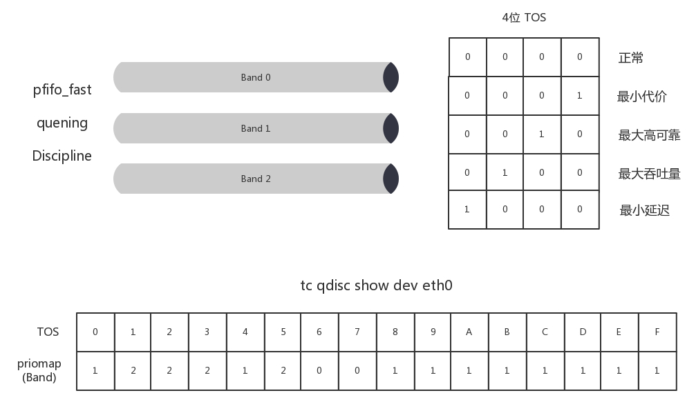
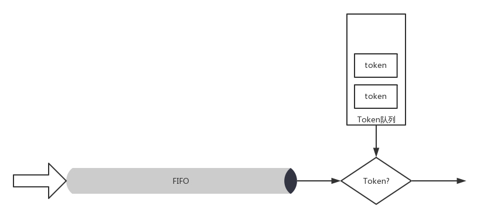

# 27 讲云中的网络QoS：邻居疯狂下电影，我该怎么办？

在小区里面，是不是经常有住户不自觉就霸占公共通道，如果你找他理论，他的话就像一个相声《楼道曲》说的一样：“公用公用，你用我用，大家都用，我为什么不能用？”。

除此之外，你租房子的时候，有没有碰到这样的情况：本来合租共享WIFI，一个人狂下小电影，从而你网都上不去，是不是很懊恼？

在云平台上，也有这种现象，好在有一种流量控制的技术，可以实现  **QoS**（Quality of Service），从而保障大多数用户的服务质量。

对于控制一台机器的网络的QoS，分两个方向，一个是入方向，一个是出方向。


其实我们能控制的只有出方向，通过Shaping，将出的流量控制成自己想要的模样。而进入的方向是无法控制的，只能通过Policy将包丢弃。

## 控制网络的QoS有哪些方式？

在Linux下，可以通过TC控制网络的QoS，主要就是通过队列的方式。

### 无类别排队规则

第一大类称为**无类别排队规则 **（Classless Queuing Disciplines）。还记得我们讲\[ip addr\]的时候讲过的** pfifo_fast**，这是一种不把网络包分类的技术。



pfifo_fast分为三个先入先出的队列，称为三个Band。根据网络包里面TOS，看这个包到底应该进入哪个队列。TOS总共四位，每一位表示的意思不同，总共十六种类型。

通过命令行tc qdisc show dev eth0，可以输出结果priomap，也是十六个数字。在0到2之间，和TOS的十六种类型对应起来，表示不同的TOS对应的不同的队列。其中Band 0优先级最高，发送完毕后才轮到Band 1发送，最后才是Band 2。

另外一种无类别队列规则叫作**随机公平队列**（Stochastic Fair Queuing）。


会建立很多的FIFO的队列，TCP Session会计算hash值，通过hash值分配到某个队列。在队列的另一端，网络包会通过轮询策略从各个队列中取出发送。这样不会有一个Session占据所有的流量。

当然如果两个Session的hash是一样的，会共享一个队列，也有可能互相影响。hash函数会经常改变，从而session不会总是相互影响。

还有一种无类别队列规则称为**令牌桶规则**（TBF，Token Bucket Filte）。



所有的网络包排成队列进行发送，但不是到了队头就能发送，而是需要拿到令牌才能发送。

令牌根据设定的速度生成，所以即便队列很长，也是按照一定的速度进行发送的。

当没有包在队列中的时候，令牌还是以既定的速度生成，但是不是无限累积的，而是放满了桶为止。设置桶的大小为了避免下面的情况：当长时间没有网络包发送的时候，积累了大量的令牌，突然来了大量的网络包，每个都能得到令牌，造成瞬间流量大增。

### 基于类别的队列规则

另外一大类是**基于类别的队列规则 **（Classful Queuing Disciplines），其中典型的为** 分层令牌桶规则 **（** HTB**， Hierarchical Token Bucket）。

HTB往往是一棵树，接下来我举个具体的例子，通过TC如何构建一棵HTB树来带你理解。


使用TC可以为某个网卡eth0创建一个HTB的队列规则，需要付给它一个句柄为（1:）。

这是整棵树的根节点，接下来会有分支。例如图中有三个分支，句柄分别为（:10）、（:11）、（:12）。最后的参数default 12，表示默认发送给1:12，也即发送给第三个分支。

```bash
tc qdisc add dev eth0 root handle 1: htb default 12
```

对于这个网卡，需要规定发送的速度。一般有两个速度可以配置，一个是**rate **，表示一般情况下的速度；一个是** ceil**，表示最高情况下的速度。对于根节点来讲，这两个速度是一样的，于是创建一个root class，速度为（rate=100kbps，ceil=100kbps）。

```bash
tc class add dev eth0 parent 1: classid 1:1 htb rate 100kbps ceil 100kbps
```

接下来要创建分支，也即创建几个子class。每个子class统一有两个速度。三个分支分别为（rate=30kbps，ceil=100kbps）、（rate=10kbps，ceil=100kbps）、（rate=60kbps，ceil=100kbps）。

```bash
tc class add dev eth0 parent 1:1 classid 1:10 htb rate 30kbps ceil 100kbps
tc class add dev eth0 parent 1:1 classid 1:11 htb rate 10kbps ceil 100kbps
tc class add dev eth0 parent 1:1 classid 1:12 htb rate 60kbps ceil 100kbps
```

你会发现三个rate加起来，是整个网卡允许的最大速度。

HTB有个很好的特性，同一个root class下的子类可以相互借流量，如果不直接在队列规则下面创建一个root class，而是直接创建三个class，它们之间是不能相互借流量的。借流量的策略，可以使得当前不使用这个分支的流量的时候，可以借给另一个分支，从而不浪费带宽，使带宽发挥最大的作用。

最后，创建叶子队列规则，分别为**fifo **和** sfq**    。

```bash
tc qdisc add dev eth0 parent 1:10 handle 20: pfifo limit 5
tc qdisc add dev eth0 parent 1:11 handle 30: pfifo limit 5
tc qdisc add dev eth0 parent 1:12 handle 40: sfq perturb 10
```

基于这个队列规则，我们还可以通过TC设定发送规则：从1.2.3.4来的，发送给port 80的包，从第一个分支1:10走；其他从1.2.3.4发送来的包从第二个分支1:11走；其他的走默认分支。

```bash
tc filter add dev eth0 protocol ip parent 1:0 prio 1 u32 match ip src 1.2.3.4 match ip dport 80 0xffff flowid 1:10
tc filter add dev eth0 protocol ip parent 1:0 prio 1 u32 match ip src 1.2.3.4 flowid 1:11
```

## 如何控制QoS？

我们讲过，使用OpenvSwitch将云中的网卡连通在一起，那如何控制QoS呢？

就像我们上面说的一样，OpenvSwitch支持两种：

- 对于进入的流量，可以设置策略Ingress policy；

```bash
ovs-vsctl set Interface tap0 ingress_policing_rate=100000
ovs-vsctl set Interface tap0 ingress_policing_burst=10000
```

- 对于发出的流量，可以设置QoS规则Egress shaping，支持HTB。

我们构建一个拓扑图，来看看OpenvSwitch的QoS是如何工作的。

首先，在port上可以创建QoS规则，一个QoS规则可以有多个队列Queue。


```bash
ovs-vsctl set port first_br [email protected] -- [email protected] create qos type=linux-htb other-config:max-rate=10000000 [email protected],[email protected],[email protected] -- [email protected] create queue other-config:min-rate=3000000 other-config:max-rate=10000000 -- [email protected] create queue other-config:min-rate=1000000 other-config:max-rate=10000000 -- [email protected] create queue other-config:min-rate=6000000 other-config:max-rate=10000000
```

上面的命令创建了一个QoS规则，对应三个Queue。min-rate就是上面的rate，max-rate就是上面的ceil。通过交换机的网络包，要通过流表规则，匹配后进入不同的队列。然后我们就可以添加流表规则Flow(first_br是br0上的port 5)。

```bash
ovs-ofctl add-flow br0 "in_port=6 nw_src=192.168.100.100 actions=enqueue:5:0"
ovs-ofctl add-flow br0 "in_port=7 nw_src=192.168.100.101 actions=enqueue:5:1"
ovs-ofctl add-flow br0 "in_port=8 nw_src=192.168.100.102 actions=enqueue:5:2"
```

接下来，我们单独测试从192.168.100.100，192.168.100.101，192.168.100.102到192.168.100.103的带宽的时候，每个都是能够打满带宽的。

如果三个一起测试，一起狂发网络包，会发现是按照3:1:6的比例进行的，正是根据配置的队列的带宽比例分配的。

如果192.168.100.100和192.168.100.101一起测试，发现带宽占用比例为3:1，但是占满了总的流量，也即没有发包的192.168.100.102有60%的带宽被借用了。

如果192.168.100.100和192.168.100.102一起测试，发现带宽占用比例为1:2。如果192.168.100.101和192.168.100.102一起测试，发现带宽占用比例为1:6。

## 小结

好了，这一节就讲到这里了，我们来总结一下。

- 云中的流量控制主要通过队列进行的，队列分为两大类：无类别队列规则和基于类别的队列规则。
- 在云中网络Openvswitch中，主要使用的是分层令牌桶规则（HTB），将总的带宽在一棵树上按照配置的比例进行分配，并且在一个分支不用的时候，可以借给另外的分支，从而增强带宽利用率。

最后，给你留两个思考题。

1. 这一节中提到，入口流量其实没有办法控制，出口流量是可以很好控制的，你能想出一个控制云中的虚拟机的入口流量的方式吗？
1. 安全性和流量控制大概解决了，但是不同用户在物理网络的隔离还是没有解决，你知道怎么解决吗？
