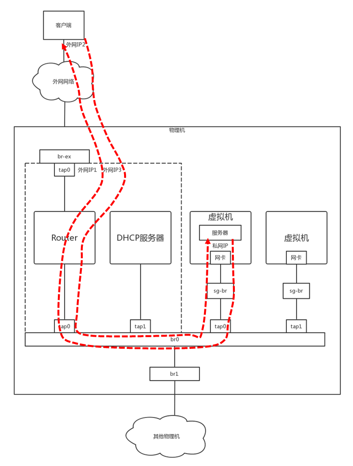

29 讲容器网络：来去自由的日子，不买公寓去合租
========================

如果说虚拟机是买公寓，容器则相当于合租，有一定的隔离，但是隔离性没有那么好。云计算解决了基础资源层的弹性伸缩，却没有解决PaaS层应用随基础资源层弹性伸缩而带来的批量、快速部署问题。于是，容器应运而生。

容器就是Container，而Container的另一个意思是集装箱。其实  **容器的思想就是要变成软件交付的集装箱**。集装箱的特点，一是打包，二是标准。


在没有集装箱的时代，假设要将货物从A运到B，中间要经过三个码头、换三次船。每次都要将货物卸下船来，弄的乱七八糟，然后还要再搬上船重新整齐摆好。因此在没有集装箱的时候，每次换船，船员们都要在岸上待几天才能干完活。

有了尺寸全部都一样的集装箱以后，可以把所有的货物都打包在一起，所以每次换船的时候，一个箱子整体搬过去就行了，小时级别就能完成，船员再也不用耗费很长时间了。这是集装箱的“打包”“标准”两大特点在生活中的应用。


那么容器如何对应用打包呢？

学习集装箱，首先要有个封闭的环境，将货物封装起来，让货物之间互不干扰，互相隔离，这样装货卸货才方便。

封闭的环境主要使用了两种技术，一种是**看起来是隔离的技术 **，称为** namespace **，也即每个 namespace中的应用看到的是不同的 IP地址、用户空间、程号等。另一种是** 用起来是隔离的技术 **，称为** cgroup**，也即明明整台机器有很多的 CPU、内存，而一个应用只能用其中的一部分。

有了这两项技术，就相当于我们焊好了集装箱。接下来的问题就是如何“将这个集装箱标准化”，并在哪艘船上都能运输。这里的标准首先就是**镜像** 。

所谓镜像，就是将你焊好集装箱的那一刻，将集装箱的状态保存下来，就像孙悟空说：“定！”，集装箱里的状态就被定在了那一刻，然后将这一刻的状态保存成一系列文件。无论从哪里运行这个镜像，都能完整地还原当时的情况。

接下来我们就具体来看看，这两种网络方面的打包技术。

命名空间（namespace）
---------------

我们首先来看网络namespace。

namespace翻译过来就是命名空间。其实很多面向对象的程序设计语言里面，都有命名空间这个东西。大家一起写代码，难免类会起相同的名词，编译就会冲突。而每个功能都有自己的命名空间，在不同的空间里面，类名相同，不会冲突。

在Linux下也是这样的，很多的资源都是全局的。比如进程有全局的进程ID，网络也有全局的路由表。但是，当一台Linux上跑多个进程的时候，如果我们觉得使用不同的路由策略，这些进程可能会冲突，那就需要将这个进程放在一个独立的namespace里面，这样就可以独立配置网络了。

网络的namespace由ip netns命令操作。它可以创建、删除、查询namespace。

我们再来看将你们宿舍放进一台物理机的那个图。你们宿舍长的电脑是一台路由器，你现在应该知道怎么实现这个路由器吧？可以创建一个Router虚拟机来做这件事情，但是还有一个更加简单的办法，就是我在图里画的这条虚线，这个就是通过namespace实现的。



我们创建一个routerns，于是一个独立的网络空间就产生了。你可以在里面尽情设置自己的规则。

```bash
ip netns add routerns
```

既然是路由器，肯定要能转发嘛，因而forward开关要打开。

```bash
ip netns exec routerns sysctl -w net.ipv4.ip_forward=1
```

exec的意思就是进入这个网络空间做点事情。初始化一下iptables，因为这里面要配置NAT规则。

```bash
ip netns exec routerns iptables-save -c 
ip netns exec routerns iptables-restore -c
```

路由器需要有一张网卡连到br0上，因而要创建一个网卡。

```bash
ovs-vsctl -- add-port br0 taprouter -- set Interface taprouter type=internal -- set Interface taprouter external-ids:iface-status=active -- set Interface taprouter external-ids:attached-mac=fa:16:3e:84:6e:cc
```

这个网络创建完了，但是是在namespace外面的，如何进去呢？可以通过这个命令：

```bash
ip link set taprouter netns routerns
```

要给这个网卡配置一个IP地址，当然应该是虚拟机网络的网关地址。例如虚拟机私网网段为192.168.1.0/24，网关的地址往往为192.168.1.1。

```bash
ip netns exec routerns ip -4 addr add 192.168.1.1/24 brd 192.168.1.255 scope global dev taprouter
```

为了访问外网，还需要另一个网卡连在外网网桥br-ex上，并且塞在namespace里面。

```bash
ovs-vsctl -- add-port br-ex taprouterex -- set Interface taprouterex type=internal -- set Interface taprouterex external-ids:iface-status=active -- set Interface taprouterex external-ids:attached-mac=fa:16:3e:68:12:c0
ip link set taprouterex netns routerns
```

我们还需要为这个网卡分配一个地址，这个地址应该和物理外网网络在一个网段。假设物理外网为16.158.1.0/24，可以分配一个外网地址16.158.1.100/24。

```bash
ip netns exec routerns ip -4 addr add 16.158.1.100/24 brd 16.158.1.255 scope global dev taprouterex
```

接下来，既然是路由器，就需要配置路由表，路由表是这样的：

```bash
ip netns exec routerns route -n
Kernel IP routing table
Destination   Gateway     Genmask     Flags Metric Ref  Use Iface
0.0.0.0     16.158.1.1  0.0.0.0     UG  0   0    0 taprouterex
192.168.1.0    0.0.0.0     255.255.255.0  U   0   0    0 taprouter
16.158.1.0  0.0.0.0     255.255.255.0  U   0   0    0 taprouterex
```

路由表中的默认路由是去物理外网的，去192.168.1.0/24也即虚拟机私网，走下面的网卡，去16.158.1.0/24也即物理外网，走上面的网卡。

我们在前面的章节讲过，如果要在虚拟机里面提供服务，提供给外网的客户端访问，客户端需要访问外网IP3，会在外网网口NAT称为虚拟机私网IP。这个NAT规则要在这个namespace里面配置。

```bash
ip netns exec routerns iptables -t nat -nvL
Chain PREROUTING
target  prot opt  in  out  source  destination
DNAT  all  --  *  *  0.0.0.0/0 16.158.1.103 to:192.168.1.3
Chain POSTROUTING
target  prot opt  in  out  source   destination
SNAT  all  --  *  *  192.168.1.3  0.0.0.0/0 to:16.158.1.103
```

这里面有两个规则，一个是SNAT，将虚拟机的私网IP 192.168.1.3 NAT成物理外网IP 16.158.1.103。一个是DNAT，将物理外网IP 16.158.1.103 NAT成虚拟机私网IP 192.168.1.3。

至此为止，基于网络namespace的路由器实现完毕。

机制网络（cgroup）
------------

我们再来看打包的另一个机制网络cgroup。

cgroup全称control groups，是Linux内核提供的一种可以限制、隔离进程使用的资源机制。

cgroup能控制哪些资源呢？它有很多子系统：

* CPU子系统使用调度程序为进程控制CPU的访问；
* cpuset，如果是多核心的CPU，这个子系统会为进程分配单独的CPU和内存；
* memory子系统，设置进程的内存限制以及产生内存资源报告；
* blkio子系统，设置限制每个块设备的输入输出控制；
* net\_cls，这个子系统使用等级识别符（classid）标记网络数据包，可允许Linux 流量控制程序（tc）识别从具体cgroup中生成的数据包。

我们这里最关心的是net\_cls，它可以和前面讲过的TC关联起来。

cgroup提供了一个虚拟文件系统，作为进行分组管理和各子系统设置的用户接口。要使用cgroup，必须挂载cgroup文件系统，一般情况下都是挂载到/sys/fs/cgroup目录下。

所以首先我们要挂载一个net\_cls的文件系统。

```bash
mkdir /sys/fs/cgroup/net_cls
mount -t cgroup -onet_cls net_cls /sys/fs/cgroup/net_cls
```

接下来我们要配置TC了。还记得咱们实验TC的时候那个树吗？


当时我们通过这个命令设定了规则：从1.2.3.4来的，发送给port 80的包，从1:10走；其他从1.2.3.4发送来的包从1:11走；其他的走默认。

```bash
tc filter add dev eth0 protocol ip parent 1:0 prio 1 u32 match ip src 1.2.3.4 match ip dport 80 0xffff flowid 1:10
tc filter add dev eth0 protocol ip parent 1:0 prio 1 u32 match ip src 1.2.3.4 flowid 1:11
```

这里是根据源IP来设定的，现在有了cgroup，我们按照cgroup再来设定规则。

```bash
tc filter add dev eth0 protocol ip parent 1:0 prio 1 handle 1: cgroup
```

假设我们有两个用户a和b，要对它们进行带宽限制。

首先，我们要创建两个net\_cls。

```bash
mkdir /sys/fs/cgroup/net_cls/a   
mkdir /sys/fs/cgroup/net_cls/b
```

假设用户a启动的进程ID为12345，把它放在net\_cls/a/tasks文件中。同样假设用户b启动的进程ID为12346，把它放在net\_cls/b/tasks文件中。

net\_cls/a目录下面，还有一个文件net\_cls.classid，我们放flowid 1:10。net\_cls/b目录下面，也创建一个文件net\_cls.classid，我们放flowid 1:11。

这个数字怎么放呢？要转换成一个0xAAAABBBB的值，AAAA对应class中冒号前面的数字，而BBBB对应后面的数字。

```bash
echo 0x00010010 > /sys/fs/cgroup/net_cls/a/net_cls.classid    
echo 0x00010011 > /sys/fs/cgroup/net_cls/b/net_cls.classid
```

这样用户a的进程发的包，会打上1:10这个标签；用户b的进程发的包，会打上1:11这个标签。然后TC根据这两个标签，让用户a的进程的包走左边的分支，用户b的进程的包走右边的分支。

容器网络中如何融入物理网络？
--------------

了解了容器背后的技术，接下来我们来看，容器网络究竟是如何融入物理网络的？

如果你使用docker run运行一个容器，你应该能看到这样一个拓扑结构。


是不是和虚拟机很像？容器里面有张网卡，容器外有张网卡，容器外的网卡连到docker0网桥，通过这个网桥，容器直接实现相互访问。

如果你用brctl查看docker0网桥，你会发现它上面连着一些网卡。其实这个网桥和\[24\]，咱们自己用brctl创建的网桥没什么两样。

那连接容器和网桥的那个网卡和虚拟机一样吗？在虚拟机场景下，有一个虚拟化软件，通过TUN/TAP设备虚拟一个网卡给虚拟机，但是容器场景下并没有虚拟化软件，这该怎么办呢？

在Linux下，可以创建一对veth pair的网卡，从一边发送包，另一边就能收到。

我们首先通过这个命令创建这么一对。

```bash
ip link add name veth1 mtu 1500 type veth peer name veth2 mtu 1500
```

其中一边可以打到docker0网桥上。

```bash
ip link set veth1 master testbr    
ip link set veth1 up
```

那另一端如何放到容器里呢？

一个容器的启动会对应一个namespace，我们要先找到这个namespace。对于docker来讲，pid就是namespace的名字，可以通过这个命令获取。

```bash
docker inspect '--format={{ .State.Pid }}' test
```

假设结果为12065，这个就是namespace名字。

默认Docker创建的网络namespace不在默认路径下 ，ip netns看不到，所以需要ln软链接一下。链接完毕以后，我们就可以通过ip netns命令操作了。

```bash
rm -f /var/run/netns/12065    
ln -s /proc/12065/ns/net /var/run/netns/12065
```

然后，我们就可以将另一端veth2塞到namespace里面。

```bash
ip link set veth2 netns 12065
```

然后，将容器内的网卡重命名。

```bash
ip netns exec 12065 ip link set veth2 name eth0
```

然后，给容器内网卡设置ip地址。

```bash
ip netns exec 12065 ip addr add 172.17.0.2/24 dev eth0    
ip netns exec 12065 ip link set eth0 up
```

一台机器内部容器的互相访问没有问题了，那如何访问外网呢？

你先想想看有没有思路？对，就是虚拟机里面的桥接模式和NAT模式。Docker默认使用NAT模式。NAT模式分为SNAT和DNAT，如果是容器内部访问外部，就需要通过SNAT。

从容器内部的客户端访问外部网络中的服务器，我画了一张图。在\[虚拟机\]那一节，也有一张类似的图。


在宿主机上，有这么一条iptables规则：

```bash
-A POSTROUTING -s 172.17.0.0/16 ! -o docker0 -j MASQUERADE
```

所有从容器内部发出来的包，都要做地址伪装，将源IP地址，转换为物理网卡的IP地址。如果有多个容器，所有的容器共享一个外网的IP地址，但是在conntrack表中，记录下这个出去的连接。

当服务器返回结果的时候，到达物理机，会根据conntrack表中的规则，取出原来的私网IP，通过DNAT将地址转换为私网IP地址，通过网桥docker0实现对内的访问。

如果在容器内部属于一个服务，例如部署一个网站，提供给外部进行访问，需要通过Docker的端口映射技术，将容器内部的端口映射到物理机上来。

例如容器内部监听80端口，可以通Docker run命令中的参数-p 10080:80，将物理机上的10080端口和容器的80端口映射起来， 当外部的客户端访问这个网站的时候，通过访问物理机的10080端口，就能访问到容器内的80端口了。


Docker有两种方式，一种是通过一个进程  **docker-proxy**的方式，监听10080，转换为80端口。

```bash
/usr/bin/docker-proxy -proto tcp -host-ip 0.0.0.0 -host-port 10080 -container-ip 172.17.0.2 -container-port 80
```

另外一种方式是通过**DNAT**    方式，在-A PREROUTING阶段加一个规则，将到端口10080的DNAT称为容器的私有网络。

```bash
-A DOCKER -p tcp -m tcp --dport 10080 -j DNAT --to-destination 172.17.0.2:80
```

如此就可以实现容器和物理网络之间的互通了。

小结
--

好了，这一节就到这里了，我们来总结一下。

* 容器是一种比虚拟机更加轻量级的隔离方式，主要通过namespace和cgroup技术进行资源的隔离，namespace用于负责看起来隔离，cgroup用于负责用起来隔离。
* 容器网络连接到物理网络的方式和虚拟机很像，通过桥接的方式实现一台物理机上的容器进行相互访问，如果要访问外网，最简单的方式还是通过NAT。

最后，给你留两个思考题：

1. 容器内的网络和物理机网络可以使用NAT的方式相互访问，如果这种方式用于部署应用，有什么问题呢？
2. 和虚拟机一样，不同物理机上的容器需要相互通信，你知道容器是怎么做到这一点吗？
