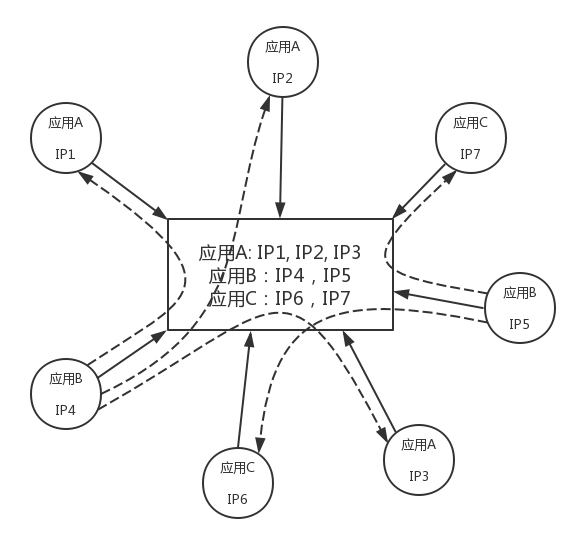
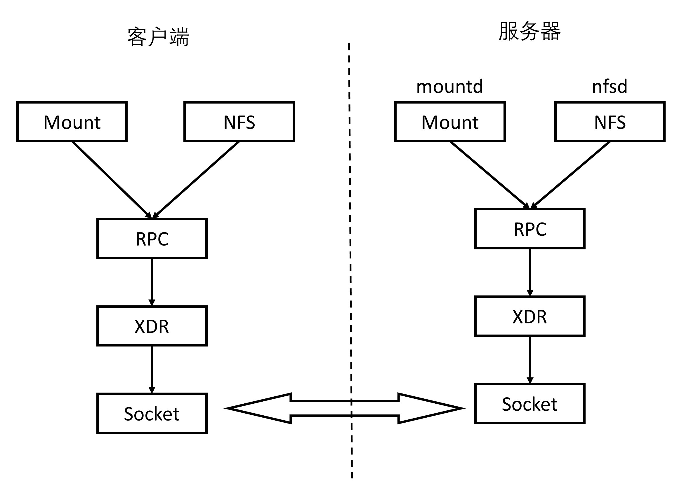
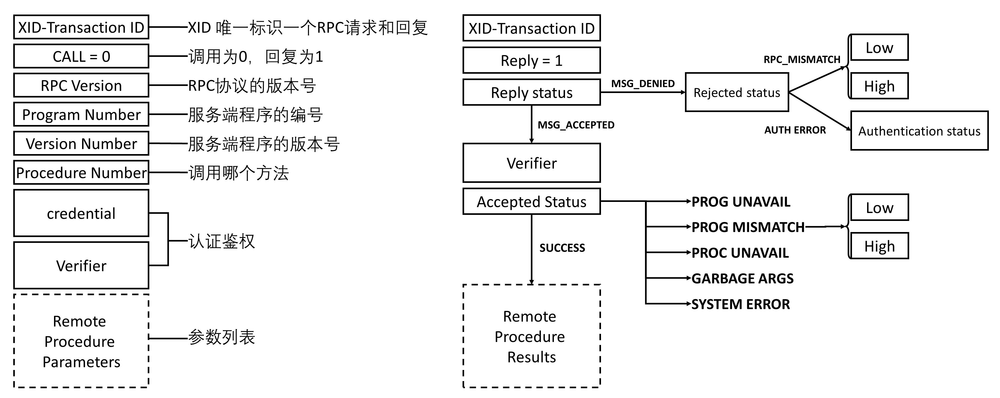
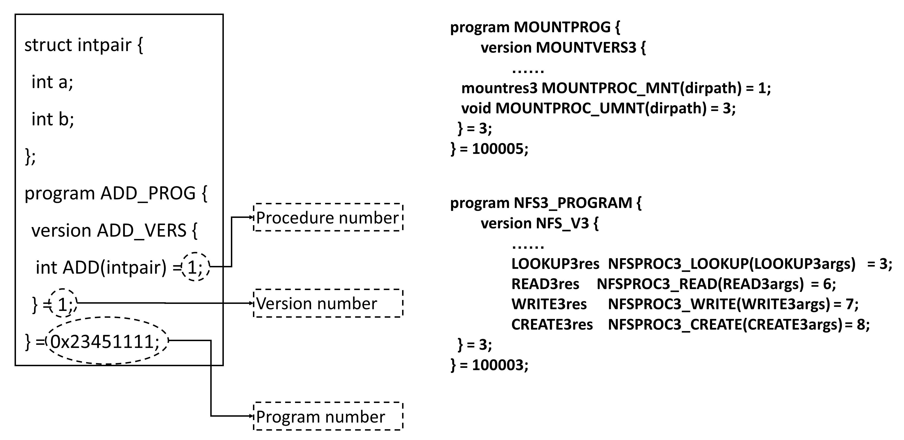
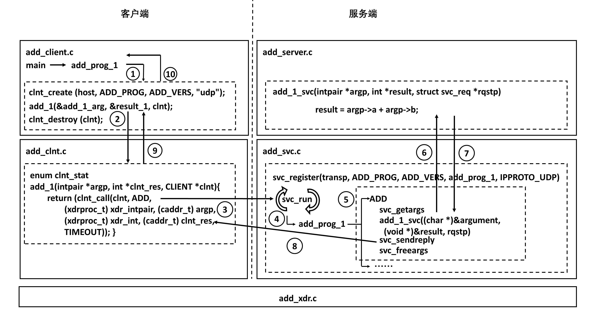
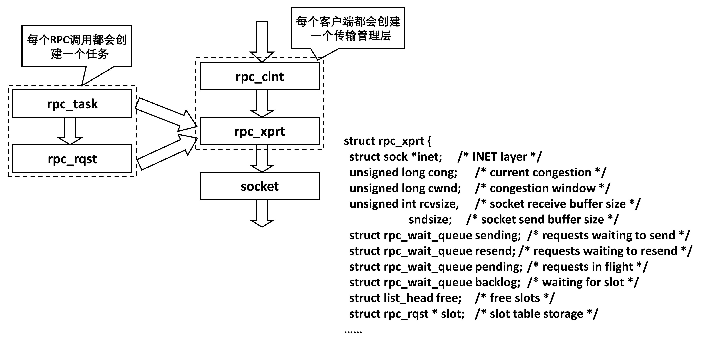

# 32 讲RPC协议综述：远在天边，近在眼前

前面我们讲了容器网络如何实现跨主机互通，以及微服务之间的相互调用。

网络是打通了，那服务之间的互相调用，该怎么实现呢？你可能说，咱不是学过Socket。服务之间分调用方和被调用方，我们就建立一个TCP或者UDP的连接，不就可以通信了？

你仔细想一下，这事儿没这么简单。我们就拿最简单的场景，客户端调用一个加法函数，将两个整数加起来，返回它们的和。

如果放在本地调用，那是简单的不能再简单了，只要稍微学过一种编程语言，三下五除二就搞定了。但是一旦变成了远程调用，门槛一下子就上去了。

首先你要会Socket编程，至少先要把咱们这门网络协议课学一下，然后再看N本砖头厚的Socket程序设计的书，学会咱们学过的几种Socket程序设计的模型。这就使得本来大学毕业就能干的一项工作，变成了一件五年工作经验都不一定干好的工作，而且，搞定了Socket程序设计，才是万里长征的第一步。后面还有很多问题呢！

## 如何解决这五个问题？

### 问题一：如何规定远程调用的语法？

客户端如何告诉服务端，我是一个加法，而另一个是乘法。我是用字符串“add”传给你，还是传给你一个整数，比如1表示加法，2表示乘法？服务端该如何告诉客户端，我的这个加法，目前只能加整数，不能加小数，不能加字符串；而另一个加法“add1”，它能实现小数和整数的混合加法。那返回值是什么？正确的时候返回什么，错误的时候又返回什么？

### 问题二：如果传递参数？

我是先传两个整数，后传一个操作符“add”，还是先传操作符，再传两个整数？是不是像咱们数据结构里一样，如果都是UDP，想要实现一个逆波兰表达式，放在一个报文里面还好，如果是TCP，是一个流，在这个流里面，如何将两次调用进行分界？什么时候是头，什么时候是尾？别这次的参数和上次的参数混了起来，TCP一端发送出去的数据，另外一端不一定能一下子全部读取出来。所以，怎么才算读完呢？

### 问题三：如何表示数据？

在这个简单的例子中，传递的就是一个固定长度的int值，这种情况还好，如果是变长的类型，是一个结构体，甚至是一个类，应该怎么办呢？如果是int，不同的平台上长度也不同，该怎么办呢？

在网络上传输超过一个Byte的类型，还有大端Big Endian和小端Little Endian的问题。

假设我们要在32位四个Byte的一个空间存放整数1，很显然只要一个Byte放1，其他三个Byte放0就可以了。那问题是，最后一个Byte放1呢，还是第一个Byte放1呢？或者说1作为最低位，应该是放在32位的最后一个位置呢，还是放在第一个位置呢？

最低位放在最后一个位置，叫作Little Endian，最低位放在第一个位置，叫作Big Endian。TCP/IP协议栈是按照Big Endian来设计的，而X86机器多按照Little Endian来设计的，因而发出去的时候需要做一个转换。

### 问题四：如何知道一个服务端都实现了哪些远程调用？从哪个端口可以访问这个远程调用？

假设服务端实现了多个远程调用，每个可能实现在不同的进程中，监听的端口也不一样，而且由于服务端都是自己实现的，不可能使用一个大家都公认的端口，而且有可能多个进程部署在一台机器上，大家需要抢占端口，为了防止冲突，往往使用随机端口，那客户端如何找到这些监听的端口呢？

### 问题五：发生了错误、重传、丢包、性能等问题怎么办？

本地调用没有这个问题，但是一旦到网络上，这些问题都需要处理，因为网络是不可靠的，虽然在同一个连接中，我们还可通过TCP协议保证丢包、重传的问题，但是如果服务器崩溃了又重启，当前连接断开了，TCP就保证不了了，需要应用自己进行重新调用，重新传输会不会同样的操作做两遍，远程调用性能会不会受影响呢？

## 协议约定问题

看到这么多问题，你是不是想起了我\[第一节\]讲过的这张图。

本地调用函数里有很多问题，比如词法分析、语法分析、语义分析等等，这些编译器本来都能帮你做了。但是在远程调用中，这些问题你都需要重新操心。

很多公司的解决方法是，弄一个核心通信组，里面都是Socket编程的大牛，实现一个统一的库，让其他业务组的人来调用，业务的人不需要知道中间传输的细节。通信双方的语法、语义、格式、端口、错误处理等，都需要调用方和被调用方开会商量，双方达成一致。一旦有一方改变，要及时通知对方，否则通信就会有问题。

可是不是每一个公司都有这种大牛团队，往往只有大公司才配得起，那有没有已经实现好的框架可以使用呢？

当然有。一个大牛Bruce Jay Nelson写了一篇论文[Implementing Remote Procedure Calls](https://www.cs.cmu.edu/~dga/15-712/F07/papers/birrell842.pdf)，定义了RPC的调用标准。后面所有RPC框架，都是按照这个标准模式来的。

当客户端的应用想发起一个远程调用时，它实际是通过本地调用本地调用方的Stub。它负责将调用的接口、方法和参数，通过约定的协议规范进行编码，并通过本地的RPCRuntime进行传输，将调用网络包发送到服务器。

服务器端的RPCRuntime收到请求后，交给提供方Stub进行解码，然后调用服务端的方法，服务端执行方法，返回结果，提供方Stub将返回结果编码后，发送给客户端，客户端的RPCRuntime收到结果，发给调用方Stub解码得到结果，返回给客户端。

这里面分了三个层次，对于用户层和服务端，都像是本地调用一样，专注于业务逻辑的处理就可以了。对于Stub层，处理双方约定好的语法、语义、封装、解封装。对于RPCRuntime，主要处理高性能的传输，以及网络的错误和异常。

最早的RPC的一种实现方式称为Sun RPC或ONC RPC。Sun公司是第一个提供商业化RPC库和 RPC编译器的公司。这个RPC框架是在NFS协议中使用的。

NFS（Network File System）就是网络文件系统。要使NFS成功运行，要启动两个服务端，一个是mountd，用来挂载文件路径；一个是nfsd，用来读写文件。NFS可以在本地mount一个远程的目录到本地的一个目录，从而本地的用户在这个目录里面写入、读出任何文件的时候，其实操作的是远程另一台机器上的文件。

操作远程和远程调用的思路是一样的，就像操作本地一样。所以NFS协议就是基于RPC实现的。当然无论是什么RPC，底层都是Socket编程。

XDR（External Data Representation，外部数据表示法）是一个标准的数据压缩格式，可以表示基本的数据类型，也可以表示结构体。

这里是几种基本的数据类型。

在RPC的调用过程中，所有的数据类型都要封装成类似的格式。而且RPC的调用和结果返回，也有严格的格式。

- XID唯一标识一对请求和回复。请求为0，回复为1。
- RPC有版本号，两端要匹配RPC协议的版本号。如果不匹配，就会返回Deny，原因就是RPC_MISMATCH。
- 程序有编号。如果服务端找不到这个程序，就会返回PROG_UNAVAIL。
- 程序有版本号。如果程序的版本号不匹配，就会返回PROG_MISMATCH。
- 一个程序可以有多个方法，方法也有编号，如果找不到方法，就会返回PROC_UNAVAIL。
- 调用需要认证鉴权，如果不通过，则Deny。
- 最后是参数列表，如果参数无法解析，则返回GABAGE_ARGS。

为了可以成功调用RPC，在客户端和服务端实现RPC的时候，首先要定义一个双方都认可的程序、版本、方法、参数等。

如果还是上面的加法，则双方约定为一个协议定义文件，同理如果是NFS、mount和读写，也会有类似的定义。

有了协议定义文件，ONC RPC会提供一个工具，根据这个文件生成客户端和服务器端的Stub程序。

最下层的是XDR文件，用于编码和解码参数。这个文件是客户端和服务端共享的，因为只有双方一致才能成功通信。

在客户端，会调用clnt_create创建一个连接，然后调用add_1，这是一个Stub函数，感觉是在调用本地一样。其实是这个函数发起了一个RPC调用，通过调用clnt_call来调用ONC RPC的类库，来真正发送请求。调用的过程非常复杂，一会儿我详细说这个。

当然服务端也有一个Stub程序，监听客户端的请求，当调用到达的时候，判断如果是add，则调用真正的服务端逻辑，也即将两个数加起来。

服务端将结果返回服务端的Stub，这个Stub程序发送结果给客户端，客户端的Stub程序正在等待结果，当结果到达客户端Stub，就将结果返回给客户端的应用程序，从而完成整个调用过程。

有了这个RPC的框架，前面五个问题中的前三个“如何规定远程调用的语法？”“如何传递参数？”以及“如何表示数据？”基本解决了，这三个问题我们统称为  **协议约定问题**。

## 传输问题

但是错误、重传、丢包、性能等问题还没有解决，这些问题我们统称为**传输问题** 。这个就不用Stub操心了，而是由ONC RPC的类库来实现。这是大牛们实现的，我们只要调用就可以了。

在这个类库中，为了解决传输问题，对于每一个客户端，都会创建一个传输管理层，而每一次RPC调用，都会是一个任务，在传输管理层，你可以看到熟悉的队列机制、拥塞窗口机制等。

由于在网络传输的时候，经常需要等待，因而同步的方式往往效率比较低，因而也就有Socket的异步模型。为了能够异步处理，对于远程调用的处理，往往是通过状态机来实现的。只有当满足某个状态的时候，才进行下一步，如果不满足状态，不是在那里等，而是将资源留出来，用来处理其他的RPC调用。

从这个图可以看出，这个状态转换图还是很复杂的。

首先，进入起始状态，查看RPC的传输层队列中有没有空闲的位置，可以处理新的RPC任务。如果没有，说明太忙了，或直接结束或重试。如果申请成功，就可以分配内存，获取服务的端口号，然后连接服务器。

连接的过程要有一段时间，因而要等待连接的结果，会有连接失败，或直接结束或重试。如果连接成功，则开始发送RPC请求，然后等待获取RPC结果，这个过程也需要一定的时间；如果发送出错，可以重新发送；如果连接断了，可以重新连接；如果超时，可以重新传输；如果获取到结果，就可以解码，正常结束。

这里处理了连接失败、重试、发送失败、超时、重试等场景。不是大牛真写不出来，因而实现一个RPC的框架，其实很有难度。

## 服务发现问题

传输问题解决了，我们还遗留一个问题，就是问题四“如何找到RPC服务端的那个随机端口”。这个问题我们称为服务发现问题。在ONC RPC中，服务发现是通过portmapper实现的。

portmapper会启动在一个众所周知的端口上，RPC程序由于是用户自己写的，会监听在一个随机端口上，但是RPC程序启动的时候，会向portmapper注册。客户端要访问RPC服务端这个程序的时候，首先查询portmapper，获取RPC服务端程序的随机端口，然后向这个随机端口建立连接，开始RPC调用。从图中可以看出，mount命令的RPC调用，就是这样实现的。

## 小结

好了，这一节就到这里，我们来总结一下。

- 远程调用看起来用Socket编程就可以了，其实是很复杂的，要解决协议约定问题、传输问题和服务发现问题。
- 大牛Bruce Jay Nelson的论文、早期ONC RPC框架，以及NFS的实现，给出了解决这三大问题的示范性实现，也即协议约定要公用协议描述文件，并通过这个文件生成Stub程序；RPC的传输一般需要一个状态机，需要另外一个进程专门做服务发现。

最后，给你留两个思考题。

1. 在这篇文章中，mount的过程是通过系统调用，最终调用到RPC层。一旦mount完毕之后，客户端就像写入本地文件一样写入NFS了，这个过程是如何触发RPC层的呢？
1. ONC RPC是早期的RPC框架，你觉得它有哪些问题呢？
