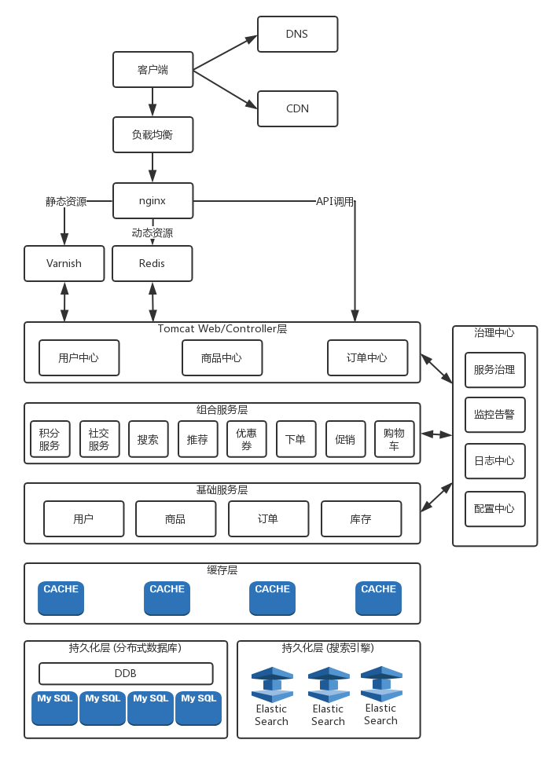

35 讲二进制类RPC协议：还是叫NBA吧，总说全称多费劲
=============================

前面我们讲了两个常用文本类的RPC协议，对于陌生人之间的沟通，用NBA、CBA这样的缩略语，会使得协议约定非常不方便。

在讲CDN和DNS的时候，我们讲过接入层的设计，对于静态资源或者动态资源静态化的部分都可以做缓存。但是对于下单、支付等交易场景，还是需要调用API。

对于微服务的架构，API需要一个API网关统一的管理。API网关有多种实现方式，用Nginx或者OpenResty结合Lua脚本是常用的方式。在上一节讲过的Spring Cloud体系中，有个组件Zuul也是干这个的。

数据中心内部是如何相互调用的？
---------------

API网关用来管理API，但是API的实现一般在一个叫作  **Controller层**    的地方。这一层对外提供API。由于是让陌生人访问的，我们能看到目前业界主流的，基本都是RESTful的API，是面向大规模互联网应用的。



在Controller之内，就是咱们互联网应用的业务逻辑实现。上节讲RESTful的时候，说过业务逻辑的实现最好是无状态的，从而可以横向扩展，但是资源的状态还需要服务端去维护。资源的状态不应该维护在业务逻辑层，而是在最底层的持久化层，一般会使用分布式数据库和ElasticSearch。

这些服务端的状态，例如订单、库存、商品等，都是重中之重，都需要持久化到硬盘上，数据不能丢，但是由于硬盘读写性能差，因而持久化层往往吞吐量不能达到互联网应用要求的吞吐量，因而前面要有一层缓存层，使用Redis或者memcached将请求拦截一道，不能让所有的请求都进入数据库“中军大营”。

缓存和持久化层之上一般是  **基础服务层** ，这里面提供一些原子化的接口。例如，对于用户、商品、订单、库存的增删查改，将缓存和数据库对再上层的业务逻辑屏蔽一道。有了这一层，上层业务逻辑看到的都是接口，而不会调用数据库和缓存。因而对于缓存层的扩容，数据库的分库分表，所有的改变，都截止到这一层，这样有利于将来对于缓存和数据库的运维。

再往上就是  **组合层** 。因为基础服务层只是提供简单的接口，实现简单的业务逻辑，而复杂的业务逻辑，比如下单，要扣优惠券，扣减库存等，就要在组合服务层实现。

这样，Controller层、组合服务层、基础服务层就会相互调用，这个调用是在数据中心内部的，量也会比较大，还是使用RPC的机制实现的。

由于服务比较多，需要一个单独的注册中心来做服务发现。服务提供方会将自己提供哪些服务注册到注册中心中去，同时服务消费方订阅这个服务，从而可以对这个服务进行调用。

调用的时候有一个问题，这里的RPC调用，应该用二进制还是文本类？其实文本的最大问题是，占用字节数目比较多。比如数字123，其实本来二进制8位就够了，但是如果变成文本，就成了字符串123。如果是UTF-8编码的话，就是三个字节；如果是UTF-16，就是六个字节。同样的信息，要多费好多的空间，传输起来也更加占带宽，时延也高。

因而对于数据中心内部的相互调用，很多公司选型的时候，还是希望采用更加省空间和带宽的二进制的方案。

这里一个著名的例子就是Dubbo服务化框架二进制的RPC方式。


Dubbo会在客户端的本地启动一个Proxy，其实就是客户端的Stub，对于远程的调用都通过这个Stub进行封装。

接下来，Dubbo会从注册中心获取服务端的列表，根据路由规则和负载均衡规则，在多个服务端中选择一个最合适的服务端进行调用。

调用服务端的时候，首先要进行编码和序列化，形成Dubbo头和序列化的方法和参数。将编码好的数据，交给网络客户端进行发送，网络服务端收到消息后，进行解码。然后将任务分发给某个线程进行处理，在线程中会调用服务端的代码逻辑，然后返回结果。

这个过程和经典的RPC模式何其相似啊！

如何解决协议约定问题？
-----------

接下来我们还是来看RPC的三大问题，其中注册发现问题已经通过注册中心解决了。我们下面就来看协议约定问题。

Dubbo中默认的RPC协议是Hessian2。为了保证传输的效率，Hessian2将远程调用序列化为二进制进行传输，并且可以进行一定的压缩。这个时候你可能会疑惑，同为二进制的序列化协议，Hessian2和前面的二进制的RPC有什么区别呢？这不绕了一圈又回来了吗？

Hessian2是解决了一些问题的。例如，原来要定义一个协议文件，然后通过这个文件生成客户端和服务端的Stub，才能进行相互调用，这样使得修改就会不方便。Hessian2不需要定义这个协议文件，而是自描述的。什么是自描述呢？

所谓自描述就是，关于调用哪个函数，参数是什么，另一方不需要拿到某个协议文件、拿到二进制，靠它本身根据Hessian2的规则，就能解析出来。

原来有协议文件的场景，有点儿像两个人事先约定好，0表示方法add，然后后面会传两个数。服务端把两个数加起来，这样一方发送012，另一方知道是将1和2加起来，但是不知道协议文件的，当它收到012的时候，完全不知道代表什么意思。

而自描述的场景，就像两个人说的每句话都带前因后果。例如，传递的是“函数：add，第一个参数1，第二个参数2”。这样无论谁拿到这个表述，都知道是什么意思。但是只不过都是以二进制的形式编码的。这其实相当于综合了XML和二进制共同优势的一个协议。

Hessian2是如何做到这一点的呢？这就需要去看Hessian2的序列化的[语法描述文件](http://hessian.caucho.com/doc/hessian-serialization.html)。


看起来很复杂，编译原理里面是有这样的语法规则的。

我们从Top看起，下一层是value，直到形成一棵树。这里面的有个思想，为了防止歧义，每一个类型的起始数字都设置成为独一无二的。这样，解析的时候，看到这个数字，就知道后面跟的是什么了。

这里还是以加法为例子，“add(2,3)”被序列化之后是什么样的呢？

```bash
H x02 x00     # Hessian 2.0
C          # RPC call
 x03 add     # method "add"
 x92        # two arguments
 x92        # 2 - argument 1
 x93        # 3 - argument 2
```

* H开头，表示使用的协议是Hession，H的二进制是0x48。
* C开头，表示这是一个RPC调用。
* 0x03，表示方法名是三个字符。
* 0x92，表示有两个参数。其实这里存的应该是2，之所以加上0x90，就是为了防止歧义，表示这里一定是一个int。
* 第一个参数是2，编码为0x92，第二个参数是3，编码为0x93。

这个就叫作  **自描述** 。

另外，Hessian2是面向对象的，可以传输一个对象。

```bash
class Car {
 String color;
 String model;
}
out.writeObject(new Car("red", "corvette"));
out.writeObject(new Car("green", "civic"));
---
C            # object definition (#0)
 x0b example.Car    # type is example.Car
 x92          # two fields
 x05 color       # color field name
 x05 model       # model field name

O            # object def (long form)
 x90          # object definition #0
 x03 red        # color field value
 x08 corvette      # model field value

x60           # object def #0 (short form)
 x05 green       # color field value
 x05 civic       # model field value
```

首先，定义这个类。对于类型的定义也传过去，因而也是自描述的。类名为example.Car，字符长11位，因而前面长度为0x0b。有两个成员变量，一个是color，一个是model，字符长5位，因而前面长度0x05,。

然后，传输的对象引用这个类。由于类定义在位置0，因而对象会指向这个位置0，编码为0x90。后面red和corvette是两个成员变量的值，字符长分别为3和8。

接着又传输一个属于相同类的对象。这时候就不保存对于类的引用了，只保存一个0x60，表示同上就可以了。

可以看出，Hessian2真的是能压缩尽量压缩，多一个Byte都不传。

如何解决RPC传输问题？
------------

接下来，我们再来看Dubbo的RPC传输问题。前面我们也说了，基于Socket实现一个高性能的服务端，是很复杂的一件事情，在Dubbo里面，使用了Netty的网络传输框架。

Netty是一个非阻塞的基于事件的网络传输框架，在服务端启动的时候，会监听一个端口，并注册以下的事件。

* **连接事件** ：当收到客户端的连接事件时，会调用void connected(Channel channel) 方法。
* 当  **可写事件**    触发时，会调用void sent(Channel channel, Object message)，服务端向客户端返回响应数据。
* 当  **可读事件**    触发时，会调用void received(Channel channel, Object message) ，服务端在收到客户端的请求数据。
* 当  **发生异常**    时，会调用void caught(Channel channel, Throwable exception)。

当事件触发之后，服务端在这些函数中的逻辑，可以选择直接在这个函数里面进行操作，还是将请求分发到线程池去处理。一般异步的数据读写都需要另外的线程池参与，在线程池中会调用真正的服务端业务代码逻辑，返回结果。

Hessian2是Dubbo默认的RPC序列化方式，当然还有其他选择。例如，Dubbox从Spark那里借鉴Kryo，实现高性能的序列化。

到这里，我们说了数据中心里面的相互调用。为了高性能，大家都愿意用二进制，但是为什么后期Spring Cloud又兴起了呢？这是因为，并发量越来越大，已经到了微服务的阶段。同原来的SOA不同，微服务粒度更细，模块之间的关系更加复杂。

在上面的架构中，如果使用二进制的方式进行序列化，虽然不用协议文件来生成Stub，但是对于接口的定义，以及传的对象DTO，还是需要共享JAR。因为只有客户端和服务端都有这个JAR，才能成功地序列化和反序列化。

但当关系复杂的时候，JAR的依赖也变得异常复杂，难以维护，而且如果在DTO里加一个字段，双方的JAR没有匹配好，也会导致序列化不成功，而且还有可能循环依赖。这个时候，一般有两种选择。

第一种，建立严格的项目管理流程。

* 不允许循环调用，不允许跨层调用，只准上层调用下层，不允许下层调用上层。
* 接口要保持兼容性，不兼容的接口新添加而非改原来的，当接口通过监控，发现不用的时候，再下掉。
* 升级的时候，先升级服务提供端，再升级服务消费端。

第二种，改用RESTful的方式。

* 使用Spring Cloud，消费端和提供端不用共享JAR，各声明各的，只要能变成JSON就行，而且JSON也是比较灵活的。
* 使用RESTful的方式，性能会降低，所以需要通过横向扩展来抵消单机的性能损耗。

这个时候，就看架构师的选择喽！

小结
--

好了，这节就到这里了，我们来总结一下。

* RESTful API对于接入层和Controller层之外的调用，已基本形成事实标准，但是随着内部服务之间的调用越来越多，性能也越来越重要，于是Dubbo的RPC框架有了用武之地。
* Dubbo通过注册中心解决服务发现问题，通过Hessian2序列化解决协议约定的问题，通过Netty解决网络传输的问题。
* 在更加复杂的微服务场景下，Spring Cloud的RESTful方式在内部调用也会被考虑，主要是JAR包的依赖和管理问题。

最后，给你留两个思考题。

1. 对于微服务模式下的RPC框架的选择，Dubbo和SpringCloud各有优缺点，你能做个详细的对比吗？
2. 到目前为止，我们讲过的RPC，还没有跨语言调用的场景，你知道如果跨语言应该怎么办吗？
