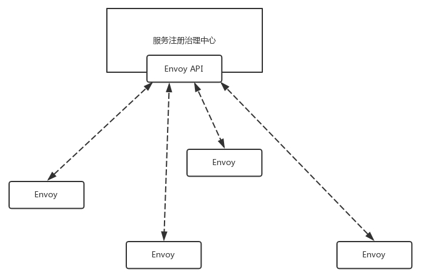
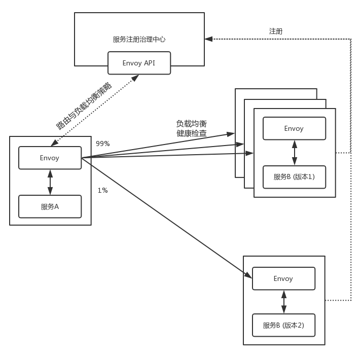

# 36 讲跨语言类RPC协议：交流之前，双方先来个专业术语表

到目前为止，咱们讲了四种RPC，分别是ONC RPC、基于XML的SOAP、基于JSON的RESTful和Hessian2。

通过学习，我们知道，二进制的传输性能好，文本类的传输性能差一些；二进制的难以跨语言，文本类的可以跨语言；要写协议文件的严谨一些，不写协议文件的灵活一些。虽然都有服务发现机制，有的可以进行服务治理，有的则没有。

我们也看到了RPC从最初的客户端服务器模式，最终演进到微服务。对于RPC框架的要求越来越多了，具体有哪些要求呢？

- 首先，传输性能很重要。因为服务之间的调用如此频繁了，还是二进制的越快越好。
- 其次，跨语言很重要。因为服务多了，什么语言写成的都有，而且不同的场景适宜用不同的语言，不能一个语言走到底。
- 最好既严谨又灵活，添加个字段不用重新编译和发布程序。
- 最好既有服务发现，也有服务治理，就像Dubbo和Spring Cloud一样。

## Protocol Buffers

这是要多快好省的建设社会主义啊。理想还是要有的嘛，这里我就来介绍一个向“理想”迈进的GRPC。

GRPC首先满足二进制和跨语言这两条，二进制说明压缩效率高，跨语言说明更灵活。但是又是二进制，又是跨语言，这就相当于两个人沟通，你不但说方言，还说缩略语，人家怎么听懂呢？所以，最好双方弄一个协议约定文件，里面规定好双方沟通的专业术语，这样沟通就顺畅多了。

对于GRPC来讲，二进制序列化协议是Protocol Buffers。首先，需要定义一个协议文件.proto。

我们还看买极客时间专栏的这个例子。

```bash
syntax = “proto3”;
package com.geektime.grpc
option java_package = “com.geektime.grpc”;
message Order {
  required string date = 1;
  required string classname = 2;
  required string author = 3;
  required int price = 4;
}
message OrderResponse {
  required string message = 1;
}
service PurchaseOrder {
  rpc Purchase (Order) returns (OrderResponse) {}
}
```

在这个协议文件中，我们首先指定使用proto3的语法，然后我们使用Protocol Buffers的语法，定义两个消息的类型，一个是发出去的参数，一个是返回的结果。里面的每一个字段，例如date、classname、author、price都有唯一的一个数字标识，这样在压缩的时候，就不用传输字段名称了，只传输这个数字标识就行了，能节省很多空间。

最后定义一个Service，里面会有一个RPC调用的声明。

无论使用什么语言，都有相应的工具生成客户端和服务端的Stub程序，这样客户端就可以像调用本地一样，调用远程的服务了。

## 协议约定问题

Protocol Buffers是一款压缩效率极高的序列化协议，有很多设计精巧的序列化方法。

对于int类型32位的，一般都需要4个Byte进行存储。在Protocol Buffers中，使用的是变长整数的形式。对于每一个Byte的8位，最高位都有特殊的含义。

如果该位为 1，表示这个数字没完，后续的Byte也属于这个数字；如果该位为 0，则这个数字到此结束。其他的7个Bit才是用来表示数字的内容。因此，小于128的数字都可以用一个Byte表示；大于128的数字，比如130，会用两个字节来表示。

对于每一个字段，使用的是TLV（Tag，Length，Value）的存储办法。

其中Tag = (field_num \<\< 3) | wire_type。field_num就是在proto文件中，给每个字段指定唯一的数字标识，而wire_type用于标识后面的数据类型。


例如，对于string author = 3，在这里field_num为3，string的wire_type为2，于是 (field_num \<\< 3) | wire_type = (11000) | 10 = 11010 = 26；接下来是Length，最后是Value为“liuchao”，如果使用UTF-8编码，长度为7个字符，因而Length为7。

可见，在序列化效率方面，Protocol Buffers简直做到了极致。

在灵活性方面，这种基于协议文件的二进制压缩协议往往存在更新不方便的问题。例如，客户端和服务器因为需求的改变需要添加或者删除字段。

这一点上，Protocol Buffers考虑了兼容性。在上面的协议文件中，每一个字段都有修饰符。比如：

- required：这个值不能为空，一定要有这么一个字段出现；
- optional：可选字段，可以设置，也可以不设置，如果不设置，则使用默认值；
- repeated：可以重复0到多次。

如果我们想修改协议文件，对于赋给某个标签的数字，例如string author=3，这个就不要改变了，改变了就不认了；也不要添加或者删除required字段，因为解析的时候，发现没有这个字段就会报错。对于optional和repeated字段，可以删除，也可以添加。这就给了客户端和服务端升级的可能性。

例如，我们在协议里面新增一个string recommended字段，表示这个课程是谁推荐的，就将这个字段设置为optional。我们可以先升级服务端，当客户端发过来消息的时候，是没有这个值的，将它设置为一个默认值。我们也可以先升级客户端，当客户端发过来消息的时候，是有这个值的，那它将被服务端忽略。

至此，我们解决了协议约定的问题。

## 网络传输问题

接下来，我们来看网络传输的问题。

如果是Java技术栈，GRPC的客户端和服务器之间通过Netty Channel作为数据通道，每个请求都被封装成HTTP 2.0的Stream。

Netty是一个高效的基于异步IO的网络传输框架，这个上一节我们已经介绍过了。HTTP 2.0在\[14\]，我们也介绍过。HTTP 2.0协议将一个TCP的连接，切分成多个流，每个流都有自己的ID，而且流是有优先级的。流可以是客户端发往服务端，也可以是服务端发往客户端。它其实只是一个虚拟的通道。

HTTP 2.0还将所有的传输信息分割为更小的消息和帧，并对它们采用二进制格式编码。

通过这两种机制，HTTP 2.0的客户端可以将多个请求分到不同的流中，然后将请求内容拆成帧，进行二进制传输。这些帧可以打散乱序发送， 然后根据每个帧首部的流标识符重新组装，并且可以根据优先级，决定优先处理哪个流的数据。


由于基于HTTP 2.0，GRPC和其他的RPC不同，可以定义四种服务方法。

第一种，也是最常用的方式是  **单向RPC**，即客户端发送一个请求给服务端，从服务端获取一个应答，就像一次普通的函数调用。

```bash
rpc SayHello(HelloRequest) returns (HelloResponse){}
```

第二种方式是**服务端流式RPC**，即服务端返回的不是一个结果，而是一批。客户端发送一个请求给服务端，可获取一个数据流用来读取一系列消息。客户端从返回的数据流里一直读取，直到没有更多消息为止。

```bash
rpc LotsOfReplies(HelloRequest) returns (stream HelloResponse){}
```

第三种方式为**客户端流式RPC**，也即客户端的请求不是一个，而是一批。客户端用提供的一个数据流写入并发送一系列消息给服务端。一旦客户端完成消息写入，就等待服务端读取这些消息并返回应答。

```bash
rpc LotsOfGreetings(stream HelloRequest) returns (HelloResponse) {}
```

第四种方式为**双向流式 RPC**，即两边都可以分别通过一个读写数据流来发送一系列消息。这两个数据流操作是相互独立的，所以客户端和服务端能按其希望的任意顺序读写，服务端可以在写应答前等待所有的客户端消息，或者它可以先读一个消息再写一个消息，或者读写相结合的其他方式。每个数据流里消息的顺序会被保持。

```bash
rpc BidiHello(stream HelloRequest) returns (stream HelloResponse){}
```

如果基于HTTP 2.0，客户端和服务器之间的交互方式要丰富得多，不仅可以单方向远程调用，还可以实现当服务端状态改变的时候，主动通知客户端。

至此，传输问题得到了解决。

## 服务发现与治理问题

最后是服务发现与服务治理的问题。

GRPC本身没有提供服务发现的机制，需要借助其他的组件，发现要访问的服务端，在多个服务端之间进行容错和负载均衡。

其实负载均衡本身比较简单，LVS、HAProxy、Nginx都可以做，关键问题是如何发现服务端，并根据服务端的变化，动态修改负载均衡器的配置。

在这里我们介绍一种对于GRPC支持比较好的负载均衡器Envoy。其实Envoy不仅仅是负载均衡器，它还是一个高性能的C++写的Proxy转发器，可以配置非常灵活的转发规则。

这些规则可以是静态的，放在配置文件中的，在启动的时候加载。要想重新加载，一般需要重新启动，但是Envoy支持热加载和热重启，这在一定程度上缓解了这个问题。

当然，最好的方式是将规则设置为动态的，放在统一的地方维护。这个统一的地方在Envoy眼中被称为服务发现（Discovery Service），过一段时间去这里拿一下配置，就修改了转发策略。

无论是静态的，还是动态的，在配置里面往往会配置四个东西。

第一个是listener。Envoy既然是Proxy，专门做转发，就得监听一个端口，接入请求，然后才能够根据策略转发，这个监听的端口就称为listener。

第二个是endpoint，是目标的IP地址和端口。这个是Proxy最终将请求转发到的地方。

第三个是cluster。一个cluster是具有完全相同行为的多个endpoint，也即如果有三个服务端在运行，就会有三个IP和端口，但是部署的是完全相同的三个服务，它们组成一个cluster，从cluster到endpoint的过程称为负载均衡，可以轮询。

第四个是route。有时候多个cluster具有类似的功能，但是是不同的版本号，可以通过route规则，选择将请求路由到某一个版本号，也即某一个cluster。

如果是静态的，则将后端的服务端的IP地址拿到，然后放在配置文件里面就可以了。

如果是动态的，就需要配置一个服务发现中心，这个服务发现中心要实现Envoy的API，Envoy可以主动去服务发现中心拉取转发策略。



看来，Envoy进程和服务发现中心之间要经常相互通信，互相推送数据，所以Envoy在控制面和服务发现中心沟通的时候，就可以使用GRPC，也就天然具备在用户面支撑GRPC的能力。

Envoy如果复杂的配置，都能干什么事呢？

一种常见的规则是**配置路由策略**。例如后端的服务有两个版本，可以通过配置Envoy的route，来设置两个版本之间，也即两个cluster之间的route规则，一个占99%的流量，一个占1%的流量。

另一种常见的规则就是**负载均衡策略**。对于一个cluster下的多个endpoint，可以配置负载均衡机制和健康检查机制，当服务端新增了一个，或者挂了一个，都能够及时配置Envoy，进行负载均衡。



所有这些节点的变化都会上传到注册中心，所有这些策略都可以通过注册中心进行下发，所以，更严格的意义上讲，注册中心可以称为**注册治理中心**。

Envoy这么牛，是不是能够将服务之间的相互调用全部由它代理？如果这样，服务也不用像Dubbo，或者Spring Cloud一样，自己感知到注册中心，自己注册，自己治理，对应用干预比较大。

如果我们的应用能够意识不到服务治理的存在，就是直接进行GRPC的调用就可以了。

这就是未来服务治理的趋势**Serivce Mesh** ，也即应用之间的相互调用全部由Envoy进行代理，服务之间的治理也被Envoy进行代理，完全将服务治理抽象出来，到平台层解决。


至此RPC框架中有治理功能的Dubbo、Spring Cloud、Service Mesh就聚齐了。

## 小结

好了，这一节就到这里了，我们来总结一下。

- GRPC是一种二进制，性能好，跨语言，还灵活，同时可以进行服务治理的多快好省的RPC框架，唯一不足就是还是要写协议文件。
- GRPC序列化使用Protocol Buffers，网络传输使用HTTP 2.0，服务治理可以使用基于Envoy的Service Mesh。
