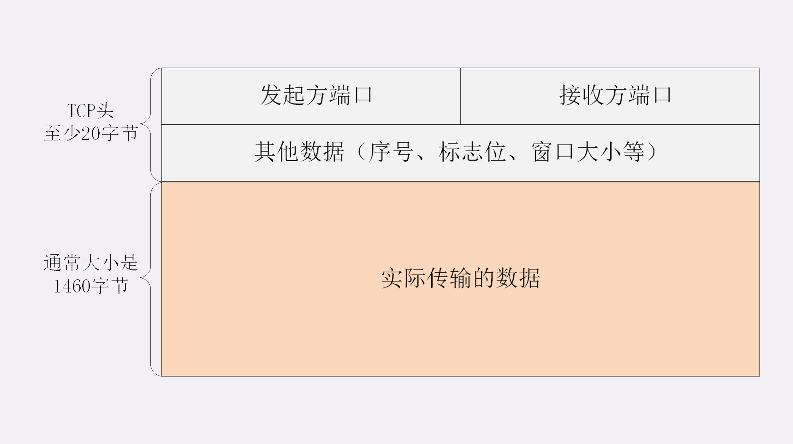
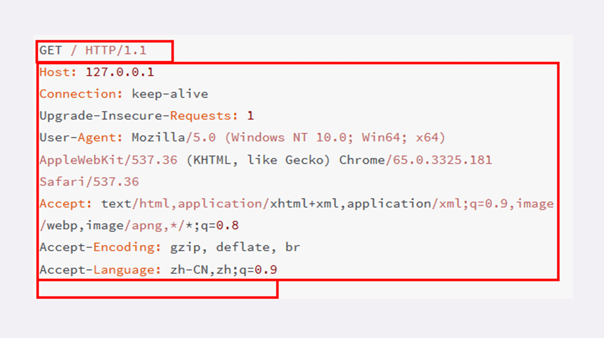
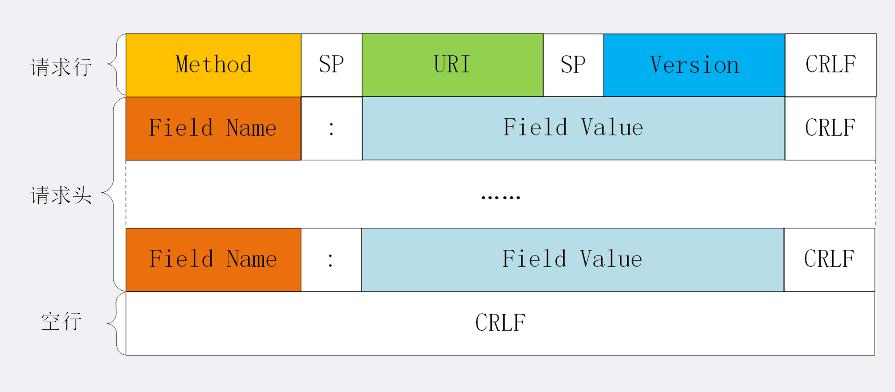
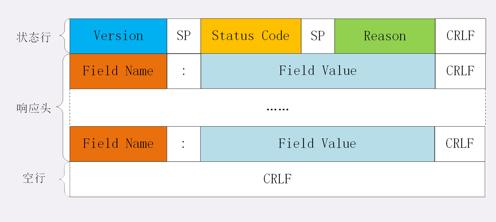
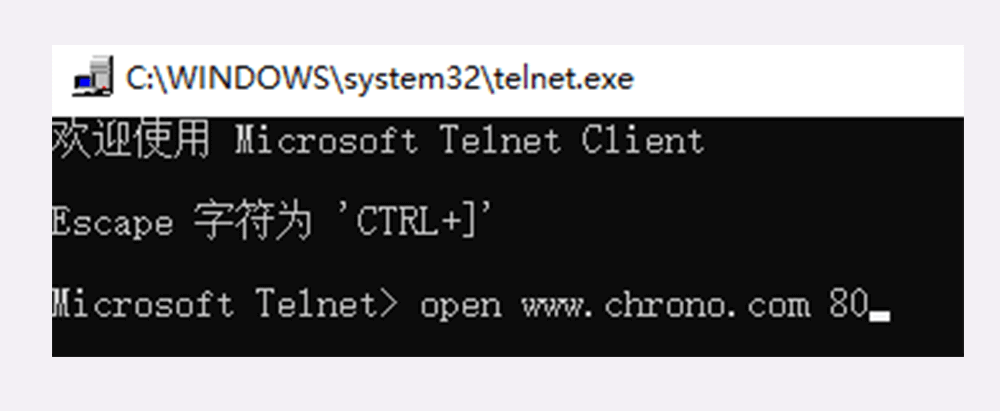
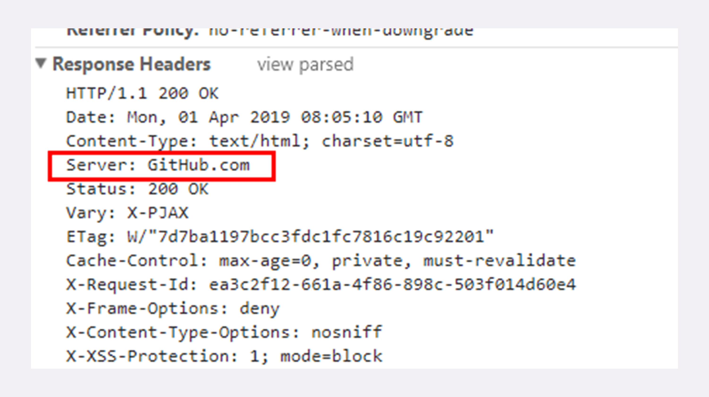
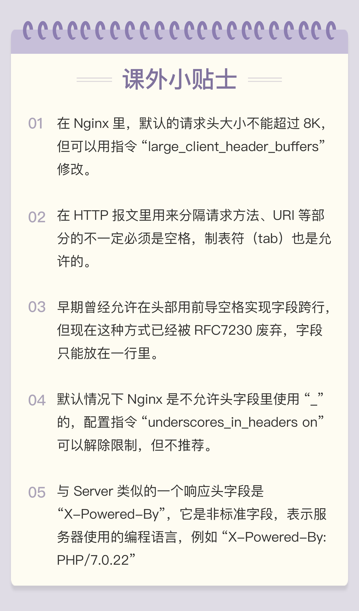

# 09 HTTP报文是什么样子的？

在上一讲里，我们在本机的最小化环境了做了两个 HTTP 协议的实验，使用 Wireshark 抓包，弄清楚了 HTTP 协议基本工作流程，也就是“请求 - 应答”“一发一收”的模式。

可以看到，HTTP 的工作模式是非常简单的，由于 TCP/IP 协议负责底层的具体传输工作，HTTP 协议基本上不用在这方面操心太多。单从这一点上来看，所谓的“超文本传输协议”其实并不怎么管“传输”的事情，有点“名不副实”。

那么 HTTP 协议的核心部分是什么呢？

答案就是它传输的报文内容。

HTTP 协议在规范文档里详细定义了报文的格式，规定了组成部分，解析规则，还有处理策略，所以可以在 TCP/IP 层之上实现更灵活丰富的功能，例如连接控制，缓存管理、数据编码、内容协商等等。

## 报文结构

你也许对 TCP/UDP 的报文格式有所了解，拿 TCP 报文来举例，它在实际要传输的数据之前附加了一个 20 字节的头部数据，存储 TCP 协议必须的额外信息，例如发送方的端口号、接收方的端口号、包序号、标志位等等。

有了这个附加的 TCP 头，数据包才能够正确传输，到了目的地后把头部去掉，就可以拿到真正的数据。



HTTP 协议也是与 TCP/UDP 类似，同样也需要在实际传输的数据前附加一些头数据，不过与 TCP/UDP 不同的是，它是一个“ **纯文本** ”的协议，所以头数据都是 ASCII 码的文本，可以很容易地用肉眼阅读，不用借助程序解析也能够看懂。

HTTP 协议的请求报文和响应报文的结构基本相同，由三大部分组成：

1. 起始行（start line）：描述请求或响应的基本信息；
1. 头部字段集合（header）：使用 key-value 形式更详细地说明报文；
1. 消息正文（entity）：实际传输的数据，它不一定是纯文本，可以是图片、视频等二进制数据。

这其中前两部分起始行和头部字段经常又合称为“ **请求头** ”或“ **响应头** ”，消息正文又称为“ **实体** ”，但与“ **header** ”对应，很多时候就直接称为“ **body** ”。

HTTP 协议规定报文必须有 header，但可以没有 body，而且在 header 之后必须要有一个“空行”，也就是“CRLF”，十六进制的“0D0A”。

所以，一个完整的 HTTP 报文就像是下图的这个样子，注意在 header 和 body 之间有一个“空行”。


说到这里，我不由得想起了一部老动画片《大头儿子和小头爸爸》，你看，HTTP 的报文结构像不像里面的“大头儿子”？

报文里的 header 就是“大头儿子”的“大头”，空行就是他的“脖子”，而后面的 body 部分就是他的身体了。

看一下我们之前用 Wireshark 抓的包吧。



在这个浏览器发出的请求报文里，第一行“GET / HTTP/1.1”就是请求行，而后面的“Host”“Connection”等等都属于 header，报文的最后是一个空白行结束，没有 body。

在很多时候，特别是浏览器发送 GET 请求的时候都是这样，HTTP 报文经常是只有 header 而没 body，相当于只发了一个超级“大头”过来，你可以想象的出来：每时每刻网络上都会有数不清的“大头儿子”在跑来跑去。

不过这个“大头”也不能太大，虽然 HTTP 协议对 header 的大小没有做限制，但各个 Web 服务器都不允许过大的请求头，因为头部太大可能会占用大量的服务器资源，影响运行效率。

## 请求行

了解了 HTTP 报文的基本结构后，我们来看看请求报文里的起始行也就是 **请求行** （request line），它简要地描述了 **客户端想要如何操作服务器端的资源** 。

请求行由三部分构成：

1. 请求方法：是一个动词，如 GET/POST，表示对资源的操作；
1. 请求目标：通常是一个 URI，标记了请求方法要操作的资源；
1. 版本号：表示报文使用的 HTTP 协议版本。

这三个部分通常使用空格（space）来分隔，最后要用 CRLF 换行表示结束。


还是用 Wireshark 抓包的数据来举例：

```
GET / HTTP/1.1

```

在这个请求行里，“GET”是请求方法，“/”是请求目标，“HTTP/1.1”是版本号，把这三部分连起来，意思就是“服务器你好，我想获取网站根目录下的默认文件，我用的协议版本号是 1.1，请不要用 1.0 或者 2.0 回复我。”

别看请求行就一行，貌似很简单，其实这里面的“讲究”是非常多的，尤其是前面的请求方法和请求目标，组合起来变化多端，后面我还会详细介绍。

## 状态行

看完了请求行，我们再看响应报文里的起始行，在这里它不叫“响应行”，而是叫“ **状态行** ”（status line），意思是 **服务器响应的状态** 。

比起请求行来说，状态行要简单一些，同样也是由三部分构成：

1. 版本号：表示报文使用的 HTTP 协议版本；
1. 状态码：一个三位数，用代码的形式表示处理的结果，比如 200 是成功，500 是服务器错误；
1. 原因：作为数字状态码补充，是更详细的解释文字，帮助人理解原因。


看一下上一讲里 Wireshark 抓包里的响应报文，状态行是：

```
HTTP/1.1 200 OK

```

意思就是：“浏览器你好，我已经处理完了你的请求，这个报文使用的协议版本号是 1.1，状态码是 200，一切 OK。”

而另一个“GET /favicon.ico HTTP/1.1”的响应报文状态行是：

```
HTTP/1.1 404 Not Found

```

翻译成人话就是：“抱歉啊浏览器，刚才你的请求收到了，但我没找到你要的资源，错误代码是 404，接下来的事情你就看着办吧。”

## 头部字段

请求行或状态行再加上头部字段集合就构成了 HTTP 报文里完整的请求头或响应头，我画了两个示意图，你可以看一下。





请求头和响应头的结构是基本一样的，唯一的区别是起始行，所以我把请求头和响应头里的字段放在一起介绍。

头部字段是 key-value 的形式，key 和 value 之间用“:”分隔，最后用 CRLF 换行表示字段结束。比如在“Host: 127.0.0.1”这一行里 key 就是“Host”，value 就是“127.0.0.1”。

HTTP 头字段非常灵活，不仅可以使用标准里的 Host、Connection 等已有头，也可以任意添加自定义头，这就给 HTTP 协议带来了无限的扩展可能。

不过使用头字段需要注意下面几点：

1. 字段名不区分大小写，例如“Host”也可以写成“host”，但首字母大写的可读性更好；
1. 字段名里不允许出现空格，可以使用连字符“-”，但不能使用下划线“\_”。例如，“test-name”是合法的字段名，而“test name”“test_name”是不正确的字段名；
1. 字段名后面必须紧接着“:”，不能有空格，而“:”后的字段值前可以有多个空格；
1. 字段的顺序是没有意义的，可以任意排列不影响语义；
1. 字段原则上不能重复，除非这个字段本身的语义允许，例如 Set-Cookie。

我在实验环境里用 Lua 编写了一个小服务程序，URI 是“/09-1”，效果是输出所有的请求头。

你可以在实验环境里用 Telnet 连接 OpenResty 服务器试一下，手动发送 HTTP 请求头，试验各种正确和错误的情况。

先启动 OpenResty 服务器，然后用组合键“Win+R”运行 telnet，输入命令“open \<www.chrono.com> 80”，就连上了 Web 服务器。



连接上之后按组合键“CTRL+\]”，然后按回车键，就进入了编辑模式。在这个界面里，你可以直接用鼠标右键粘贴文本，敲两下回车后就会发送数据，也就是模拟了一次 HTTP 请求。

下面是两个最简单的 HTTP 请求，第一个在“:”后有多个空格，第二个在“:”前有空格。

```
GET /09-1 HTTP/1.1

Host:   www.chrono.com

 

 

GET /09-1 HTTP/1.1

Host : www.chrono.com

```

第一个可以正确获取服务器的响应报文，而第二个得到的会是一个“400 Bad Request”，表示请求报文格式有误，服务器无法正确处理：

```
HTTP/1.1 400 Bad Request

Server: openresty/1.15.8.1

Connection: close

```

## 常用头字段

HTTP 协议规定了非常多的头部字段，实现各种各样的功能，但基本上可以分为四大类：

1. 通用字段：在请求头和响应头里都可以出现；
1. 请求字段：仅能出现在请求头里，进一步说明请求信息或者额外的附加条件；
1. 响应字段：仅能出现在响应头里，补充说明响应报文的信息；
1. 实体字段：它实际上属于通用字段，但专门描述 body 的额外信息。

对 HTTP 报文的解析和处理实际上主要就是对头字段的处理，理解了头字段也就理解了 HTTP 报文。

后续的课程中我将会以应用领域为切入点介绍连接管理、缓存控制等头字段，今天先讲几个最基本的头，看完了它们你就应该能够读懂大多数 HTTP 报文了。

首先要说的是 **Host** 字段，它属于请求字段，只能出现在请求头里，它同时也是唯一一个 HTTP/1.1 规范里要求 **必须出现** 的字段，也就是说，如果请求头里没有 Host，那这就是一个错误的报文。

Host 字段告诉服务器这个请求应该由哪个主机来处理，当一台计算机上托管了多个虚拟主机的时候，服务器端就需要用 Host 字段来选择，有点像是一个简单的“路由重定向”。

例如我们的试验环境，在 127.0.0.1 上有三个虚拟主机：“www.chrono.com”“www.metroid.net”和“origin.io”。那么当使用域名的方式访问时，就必须要用 Host 字段来区分这三个 IP 相同但域名不同的网站，否则服务器就会找不到合适的虚拟主机，无法处理。

**User-Agent**是请求字段，只出现在请求头里。它使用一个字符串来描述发起 HTTP 请求的客户端，服务器可以依据它来返回最合适此浏览器显示的页面。

但由于历史的原因，User-Agent 非常混乱，每个浏览器都自称是“Mozilla”“Chrome”“Safari”，企图使用这个字段来互相“伪装”，导致 User-Agent 变得越来越长，最终变得毫无意义。

不过有的比较“诚实”的爬虫会在 User-Agent 里用“spider”标明自己是爬虫，所以可以利用这个字段实现简单的反爬虫策略。**Date **字段是一个通用字段，但通常出现在响应头里，表示 HTTP 报文创建的时间，客户端可以使用这个时间再搭配其他字段决定缓存策略。** Server**字段是响应字段，只能出现在响应头里。它告诉客户端当前正在提供 Web 服务的软件名称和版本号，例如在我们的实验环境里它就是“Server: openresty/1.15.8.1”，即使用的是 OpenResty 1.15.8.1。

Server 字段也不是必须要出现的，因为这会把服务器的一部分信息暴露给外界，如果这个版本恰好存在 bug，那么黑客就有可能利用 bug 攻陷服务器。所以，有的网站响应头里要么没有这个字段，要么就给出一个完全无关的描述信息。

比如 GitHub，它的 Server 字段里就看不出是使用了 Apache 还是 Nginx，只是显示为“GitHub.com”。



实体字段里要说的一个是**Content-Length**，它表示报文里 body 的长度，也就是请求头或响应头空行后面数据的长度。服务器看到这个字段，就知道了后续有多少数据，可以直接接收。如果没有这个字段，那么 body 就是不定长的，需要使用 chunked 方式分段传输。

## 小结

今天我们学习了 HTTP 的报文结构，下面做一个简单小结。

1. HTTP 报文结构就像是“大头儿子”，由“起始行 + 头部 + 空行 + 实体”组成，简单地说就是“header+body”；
1. HTTP 报文可以没有 body，但必须要有 header，而且 header 后也必须要有空行，形象地说就是“大头”必须要带着“脖子”；
1. 请求头由“请求行 + 头部字段”构成，响应头由“状态行 + 头部字段”构成；
1. 请求行有三部分：请求方法，请求目标和版本号；
1. 状态行也有三部分：版本号，状态码和原因字符串；
1. 头部字段是 key-value 的形式，用“:”分隔，不区分大小写，顺序任意，除了规定的标准头，也可以任意添加自定义字段，实现功能扩展；
1. HTTP/1.1 里唯一要求必须提供的头字段是 Host，它必须出现在请求头里，标记虚拟主机名。

## 课下作业

1. 如果拼 HTTP 报文的时候，在头字段后多加了一个 CRLF，导致出现了一个空行，会发生什么？
1. 讲头字段时说“:”后的空格可以有多个，那为什么绝大多数情况下都只使用一个空格呢？

欢迎你把自己的答案写在留言区，与我和其他同学一起讨论。如果你觉得有所收获，也欢迎把文章分享给你的朋友。


