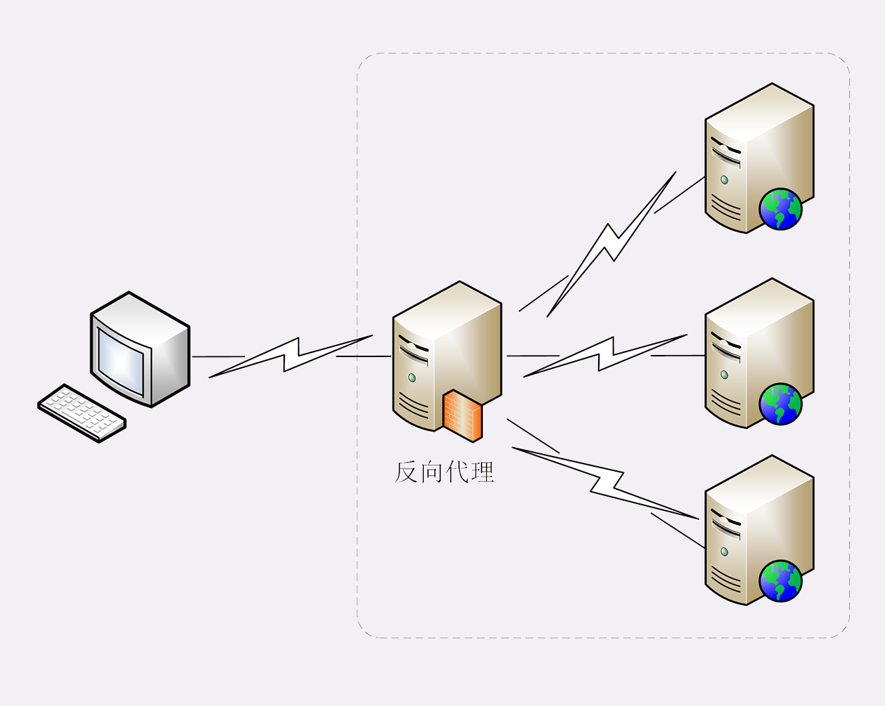
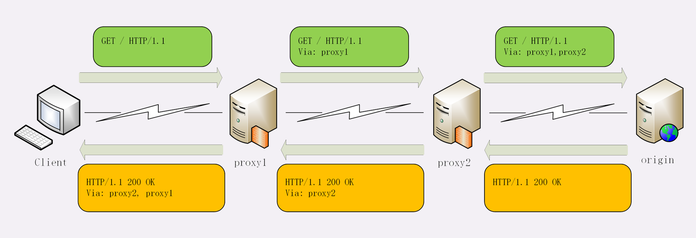
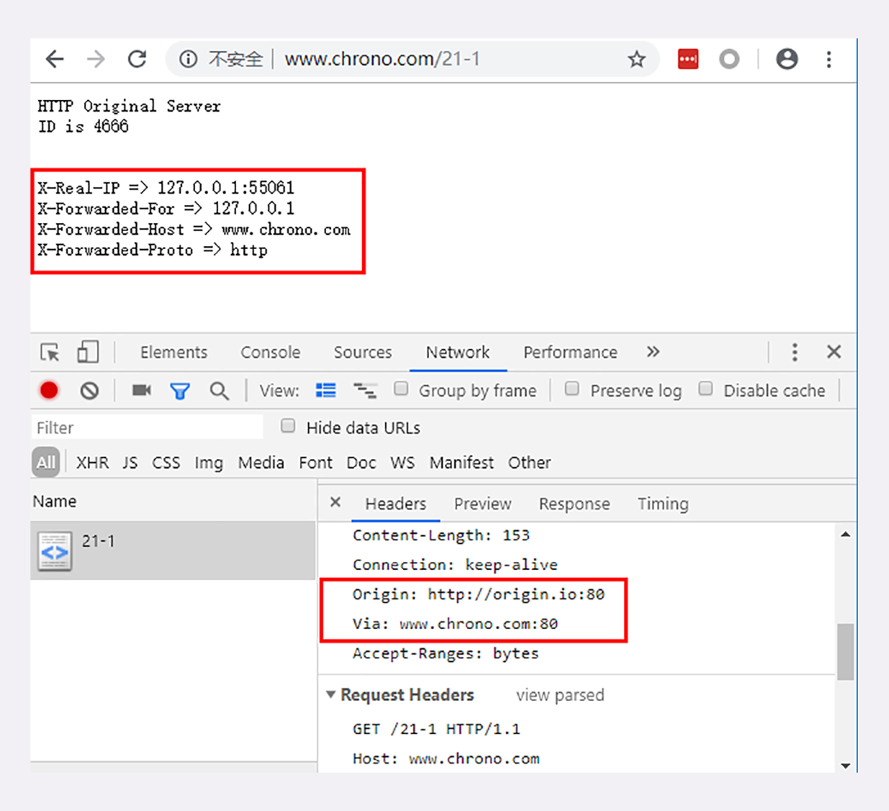
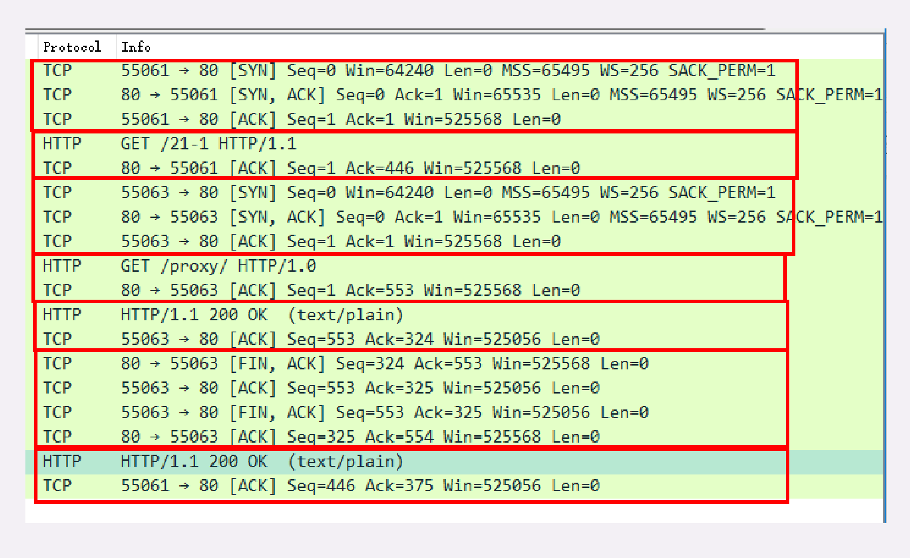
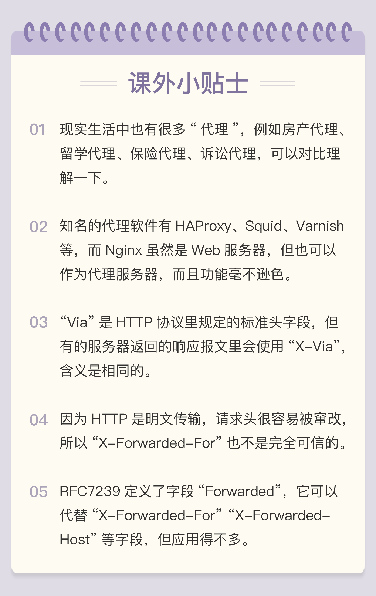

# 21 良心中间商：HTTP的代理服务

在前面讲 HTTP 协议的时候，我们严格遵循了 HTTP 的“请求 - 应答”模型，协议中只有两个互相通信的角色，分别是“请求方”浏览器（客户端）和“应答方”服务器。

今天，我们要在这个模型里引入一个新的角色，那就是HTTP 代理。

引入 HTTP 代理后，原来简单的双方通信就变复杂了一些，加入了一个或者多个中间人，但整体上来看，还是一个有顺序关系的链条，而且链条里相邻的两个角色仍然是简单的一对一通信，不会出现越级的情况。


链条的起点还是客户端（也就是浏览器），中间的角色被称为代理服务器（proxy server），链条的终点被称为源服务器（origin server），意思是数据的“源头”“起源”。

## 代理服务

“代理”这个词听起来好像很神秘，有点“高大上”的感觉。

但其实 HTTP 协议里对它并没有什么特别的描述，它就是在客户端和服务器原本的通信链路中插入的一个中间环节，也是一台服务器，但提供的是“代理服务”。

所谓的“代理服务”就是指服务本身不生产内容，而是处于中间位置转发上下游的请求和响应，具有双重身份：面向下游的用户时，表现为服务器，代表源服务器响应客户端的请求；而面向上游的源服务器时，又表现为客户端，代表客户端发送请求。

还是拿上一讲的“生鲜超市”来打个比方。

之前你都是从超市里买东西，现在楼底下新开了一家 24 小时便利店，由超市直接供货，于是你就可以在便利店里买到原本必须去超市才能买到的商品。

这样超市就不直接和你打交道了，成了“源服务器”，便利店就成了超市的“代理服务器”。

在\[第 4 讲\]中，我曾经说过，代理有很多的种类，例如匿名代理、透明代理、正向代理和反向代理。

今天我主要讲的是实际工作中最常见的反向代理，它在传输链路中更靠近源服务器，为源服务器提供代理服务。

## 代理的作用

为什么要有代理呢？换句话说，代理能干什么、带来什么好处呢？

你也许听过这样一句至理名言：“计算机科学领域里的任何问题，都可以通过引入一个中间层来解决”（在这句话后面还可以再加上一句“如果一个中间层解决不了问题，那就再加一个中间层”）。TCP/IP 协议栈是这样，而代理也是这样。

由于代理处在 HTTP 通信过程的中间位置，相应地就对上屏蔽了真实客户端，对下屏蔽了真实服务器，简单的说就是“ **欺上瞒下** ”。在这个中间层的“小天地”里就可以做很多的事情，为 HTTP 协议增加更多的灵活性，实现客户端和服务器的“双赢”。

代理最基本的一个功能是 **负载均衡** 。因为在面向客户端时屏蔽了源服务器，客户端看到的只是代理服务器，源服务器究竟有多少台、是哪些 IP 地址都不知道。于是代理服务器就可以掌握请求分发的“大权”，决定由后面的哪台服务器来响应请求。



代理中常用的负载均衡算法你应该也有所耳闻吧，比如轮询、一致性哈希等等，这些算法的目标都是尽量把外部的流量合理地分散到多台源服务器，提高系统的整体资源利用率和性能。

在负载均衡的同时，代理服务还可以执行更多的功能，比如：

- **健康检查** ：使用“心跳”等机制监控后端服务器，发现有故障就及时“踢出”集群，保证服务高可用；
- **安全防护** ：保护被代理的后端服务器，限制 IP 地址或流量，抵御网络攻击和过载；
- **加密卸载** ：对外网使用 SSL/TLS 加密通信认证，而在安全的内网不加密，消除加解密成本；
- **数据过滤** ：拦截上下行的数据，任意指定策略修改请求或者响应；
- **内容缓存** ：暂存、复用服务器响应，这个与\[第 20 讲\]密切相关，我们稍后再说。

接着拿刚才的便利店来举例说明。

因为便利店和超市之间是专车配送，所以有了便利店，以后你买东西就更省事了，打电话给便利店让它去帮你取货，不用关心超市是否停业休息、是否人满为患，而且总能买到最新鲜的。

便利店同时也方便了超市，不用额外加大店面就可以增加客源和销量，货物集中装卸也节省了物流成本，由于便利店直接面对客户，所以也可以把恶意骚扰电话挡在外面。

## 代理相关头字段

代理的好处很多，但因为它“欺上瞒下”的特点，隐藏了真实客户端和服务器，如果双方想要获得这些“丢失”的原始信息，该怎么办呢？

首先，代理服务器需要用字段“ **Via** ”标明代理的身份。

Via 是一个通用字段，请求头或响应头里都可以出现。每当报文经过一个代理节点，代理服务器就会把自身的信息追加到字段的末尾，就像是经手人盖了一个章。

如果通信链路中有很多中间代理，就会在 Via 里形成一个链表，这样就可以知道报文究竟走过了多少个环节才到达了目的地。

例如下图中有两个代理：proxy1 和 proxy2，客户端发送请求会经过这两个代理，依次添加就是“Via: proxy1, proxy2”，等到服务器返回响应报文的时候就要反过来走，头字段就是“Via: proxy2, proxy1”。



Via 字段只解决了客户端和源服务器判断是否存在代理的问题，还不能知道对方的真实信息。

但服务器的 IP 地址应该是保密的，关系到企业的内网安全，所以一般不会让客户端知道。不过反过来，通常服务器需要知道客户端的真实 IP 地址，方便做访问控制、用户画像、统计分析。

可惜的是 HTTP 标准里并没有为此定义头字段，但已经出现了很多“事实上的标准”，最常用的两个头字段是“ **X-Forwarded-For** ”和“ **X-Real-IP** ”。

“X-Forwarded-For”的字面意思是“为谁而转发”，形式上和“Via”差不多，也是每经过一个代理节点就会在字段里追加一个信息。但“Via”追加的是代理主机名（或者域名），而“X-Forwarded-For”追加的是请求方的 IP 地址。所以，在字段里最左边的 IP 地址就客户端的地址。

“X-Real-IP”是另一种获取客户端真实 IP 的手段，它的作用很简单，就是记录客户端 IP 地址，没有中间的代理信息，相当于是“X-Forwarded-For”的简化版。如果客户端和源服务器之间只有一个代理，那么这两个字段的值就是相同的。

我们的实验环境实现了一个反向代理，访问“[http://www.chrono.com/21-1](http://www.chrono.com/21-1)”，它会转而访问“[http://origin.io](http://origin.io/)”。这里的“origin.io”就是源站，它会在响应报文里输出“Via”“X-Forwarded-For”等代理头字段信息：



单从浏览器的页面上很难看出代理做了哪些工作，因为代理的转发都在后台不可见，所以我把这个过程用 Wireshark 抓了一个包：



从抓包里就可以清晰地看出代理与客户端、源服务器的通信过程：

1. 客户端 55061 先用三次握手连接到代理的 80 端口，然后发送 GET 请求；
1. 代理不直接生产内容，所以就代表客户端，用 55063 端口连接到源服务器，也是三次握手；
1. 代理成功连接源服务器后，发出了一个 HTTP/1.0 的 GET 请求；
1. 因为 HTTP/1.0 默认是短连接，所以源服务器发送响应报文后立即用四次挥手关闭连接；
1. 代理拿到响应报文后再发回给客户端，完成了一次代理服务。

在这个实验中，你可以看到除了“X-Forwarded-For”和“X-Real-IP”，还出现了两个字段：“X-Forwarded-Host”和“X-Forwarded-Proto”，它们的作用与“X-Real-IP”类似，只记录客户端的信息，分别是客户端请求的原始域名和原始协议名。

## 代理协议

有了“X-Forwarded-For”等头字段，源服务器就可以拿到准确的客户端信息了。但对于代理服务器来说它并不是一个最佳的解决方案。

因为通过“X-Forwarded-For”操作代理信息必须要解析 HTTP 报文头，这对于代理来说成本比较高，原本只需要简单地转发消息就好，而现在却必须要费力解析数据再修改数据，会降低代理的转发性能。

另一个问题是“X-Forwarded-For”等头必须要修改原始报文，而有些情况下是不允许甚至不可能的（比如使用 HTTPS 通信被加密）。

所以就出现了一个专门的“代理协议”（The PROXY protocol），它由知名的代理软件 HAProxy 所定义，也是一个“事实标准”，被广泛采用（注意并不是 RFC）。

“代理协议”有 v1 和 v2 两个版本，v1 和 HTTP 差不多，也是明文，而 v2 是二进制格式。今天只介绍比较好理解的 v1，它在 HTTP 报文前增加了一行 ASCII 码文本，相当于又多了一个头。

这一行文本其实非常简单，开头必须是“PROXY”五个大写字母，然后是“TCP4”或者“TCP6”，表示客户端的 IP 地址类型，再后面是请求方地址、应答方地址、请求方端口号、应答方端口号，最后用一个回车换行（\\r\\n）结束。

例如下面的这个例子，在 GET 请求行前多出了 PROXY 信息行，客户端的真实 IP 地址是“1.1.1.1”，端口号是 55555。

```
PROXY TCP4 1.1.1.1 2.2.2.2 55555 80\r\n
GET / HTTP/1.1\r\n
Host: www.xxx.com\r\n
\r\n
```

服务器看到这样的报文，只要解析第一行就可以拿到客户端地址，不需要再去理会后面的 HTTP 数据，省了很多事情。

不过代理协议并不支持“X-Forwarded-For”的链式地址形式，所以拿到客户端地址后再如何处理就需要代理服务器与后端自行约定。

## 小结

1. HTTP 代理就是客户端和服务器通信链路中的一个中间环节，为两端提供“代理服务”；
1. 代理处于中间层，为 HTTP 处理增加了更多的灵活性，可以实现负载均衡、安全防护、数据过滤等功能；
1. 代理服务器需要使用字段“Via”标记自己的身份，多个代理会形成一个列表；
1. 如果想要知道客户端的真实 IP 地址，可以使用字段“X-Forwarded-For”和“X-Real-IP”；
1. 专门的“代理协议”可以在不改动原始报文的情况下传递客户端的真实 IP。

## 课下作业

1. 你觉得代理有什么缺点？实际应用时如何避免？
1. 你知道多少反向代理中使用的负载均衡算法？它们有什么优缺点？

欢迎你把自己的学习体会写在留言区，与我和其他同学一起讨论。如果你觉得有所收获，也欢迎把文章分享给你的朋友。


