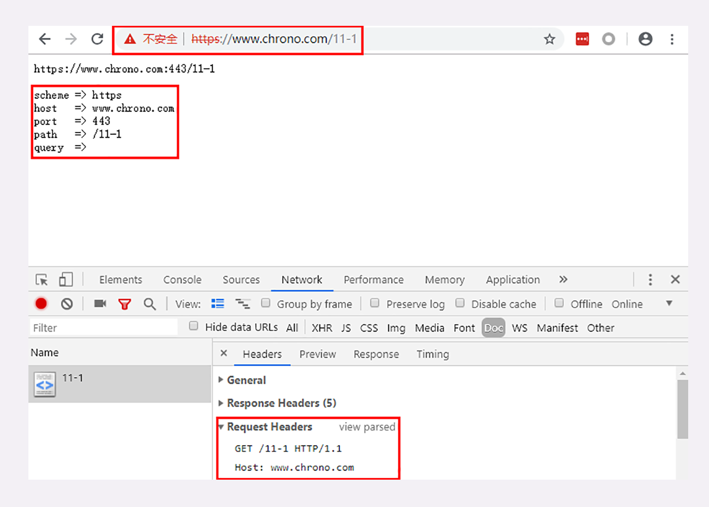
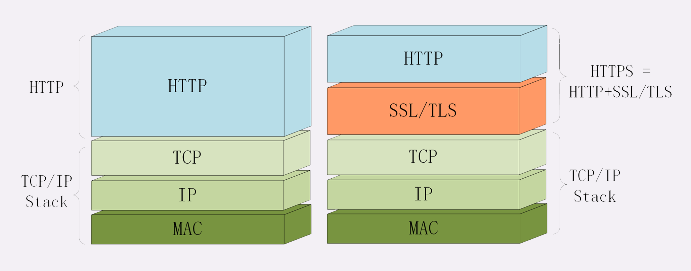
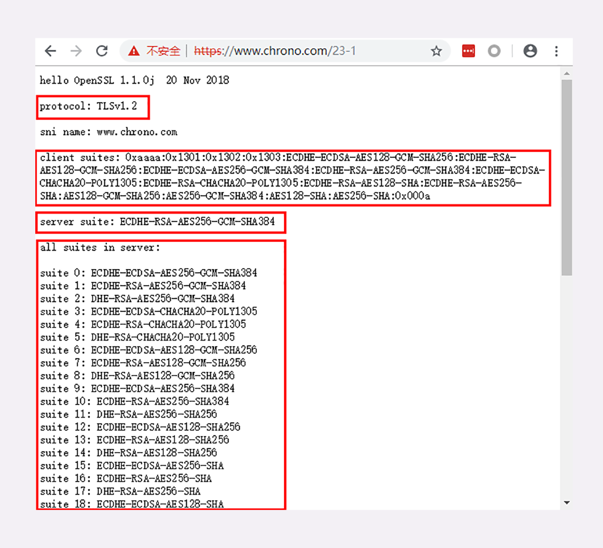
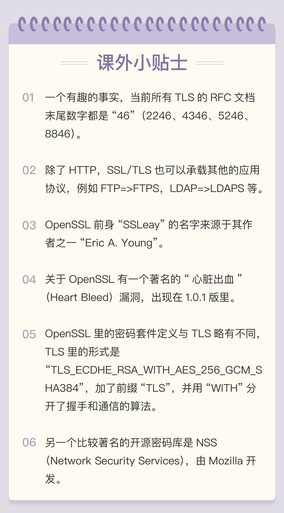

# 23 HTTPS是什么？SSLTLS又是什么？

从今天开始，我们开始进入全新的“安全篇”，聊聊与安全相关的 HTTPS、SSL、TLS。

在\[第 14 讲\]中，我曾经谈到过 HTTP 的一些缺点，其中的“无状态”在加入 Cookie 后得到了解决，而另两个缺点——“明文”和“不安全”仅凭 HTTP 自身是无力解决的，需要引入新的 HTTPS 协议。

## 为什么要有 HTTPS？

简单的回答是“ **因为 HTTP 不安全** ”。

由于 HTTP 天生“明文”的特点，整个传输过程完全透明，任何人都能够在链路中截获、修改或者伪造请求 / 响应报文，数据不具有可信性。

比如，前几讲中说过的“代理服务”。它作为 HTTP 通信的中间人，在数据上下行的时候可以添加或删除部分头字段，也可以使用黑白名单过滤 body 里的关键字，甚至直接发送虚假的请求、响应，而浏览器和源服务器都没有办法判断报文的真伪。

这对于网络购物、网上银行、证券交易等需要高度信任的应用场景来说是非常致命的。如果没有基本的安全保护，使用互联网进行各种电子商务、电子政务就根本无从谈起。

对于安全性要求不那么高的新闻、视频、搜索等网站来说，由于互联网上的恶意用户、恶意代理越来越多，也很容易遭到“流量劫持”的攻击，在页面里强行嵌入广告，或者分流用户，导致各种利益损失。

对于你我这样的普通网民来说，HTTP 不安全的隐患就更大了，上网的记录会被轻易截获，网站是否真实也无法验证，黑客可以伪装成银行网站，盗取真实姓名、密码、银行卡等敏感信息，威胁人身安全和财产安全。

总的来说，今天的互联网已经不再是早期的“田园牧歌”时代，而是进入了“黑暗森林”状态。上网的时候必须步步为营、处处小心，否则就会被不知道埋伏在哪里的黑客所“猎杀”。

## 什么是安全？

既然 HTTP“不安全”，那什么样的通信过程才是安全的呢？

通常认为，如果通信过程具备了四个特性，就可以认为是“安全”的，这四个特性是：机密性、完整性，身份认证和不可否认。

**机密性**（Secrecy/Confidentiality）是指对数据的“保密”，只能由可信的人访问，对其他人是不可见的“秘密”，简单来说就是不能让不相关的人看到不该看的东西。

比如小明和小红私下聊天，但“隔墙有耳”，被小强在旁边的房间里全偷听到了，这就是没有机密性。我们之前一直用的 Wireshark ，实际上也是利用了 HTTP 的这个特点，捕获了传输过程中的所有数据。**完整性**（Integrity，也叫一致性）是指数据在传输过程中没有被窜改，不多也不少，“完完整整”地保持着原状。

机密性虽然可以让数据成为“秘密”，但不能防止黑客对数据的修改，黑客可以替换数据，调整数据的顺序，或者增加、删除部分数据，破坏通信过程。

比如，小明给小红写了张纸条：“明天公园见”。小强把“公园”划掉，模仿小明的笔迹把这句话改成了“明天广场见”。小红收到后无法验证完整性，信以为真，第二天的约会就告吹了。**身份认证**（Authentication）是指确认对方的真实身份，也就是“证明你真的是你”，保证消息只能发送给可信的人。

如果通信时另一方是假冒的网站，那么数据再保密也没有用，黑客完全可以使用冒充的身份“套”出各种信息，加密和没加密一样。

比如，小明给小红写了封情书：“我喜欢你”，但不留心发给了小强。小强将错就错，假冒小红回复了一个“白日做梦”，小明不知道这其实是小强的话，误以为是小红的，后果可想而知。

第四个特性是**不可否认**（Non-repudiation/Undeniable），也叫不可抵赖，意思是不能否认已经发生过的行为，不能“说话不算数”“耍赖皮”。

使用前三个特性，可以解决安全通信的大部分问题，但如果缺了不可否认，那通信的事务真实性就得不到保证，有可能出现“老赖”。

比如，小明借了小红一千元，没写借条，第二天矢口否认，小红也确实拿不出借钱的证据，只能认倒霉。另一种情况是小明借钱后还了小红，但没写收条，小红于是不承认小明还钱的事，说根本没还，要小明再掏出一千元。

所以，只有同时具备了机密性、完整性、身份认证、不可否认这四个特性，通信双方的利益才能有保障，才能算得上是真正的安全。

## 什么是 HTTPS？

说到这里，终于轮到今天的主角 HTTPS 出场了，它为 HTTP 增加了刚才所说的四大安全特性。

HTTPS 其实是一个“非常简单”的协议，RFC 文档很小，只有短短的 7 页，里面规定了**新的协议名“https”，默认端口号 443**，至于其他的什么请求 - 应答模式、报文结构、请求方法、URI、头字段、连接管理等等都完全沿用 HTTP，没有任何新的东西。

也就是说，除了协议名“http”和端口号 80 这两点不同，HTTPS 协议在语法、语义上和 HTTP 完全一样，优缺点也“照单全收”（当然要除去“明文”和“不安全”）。

不信你可以用 URI“[https://www.chrono.com](https://www.chrono.com/)”访问之前 08 至 21 讲的所有示例，看看它的响应报文是否与 HTTP 一样。

```
https://www.chrono.com

https://www.chrono.com/11-1

https://www.chrono.com/15-1?name=a.json

https://www.chrono.com/16-1

```



你肯定已经注意到了，在用 HTTPS 访问实验环境时 Chrome 会有不安全提示，必须点击“高级 - 继续前往”才能顺利显示页面。而且如果用 Wireshark 抓包，也会发现与 HTTP 不一样，不再是简单可见的明文，多了“Client Hello”“Server Hello”等新的数据包。

这就是 HTTPS 与 HTTP 最大的区别，它能够鉴别危险的网站，并且尽最大可能保证你的上网安全，防御黑客对信息的窃听、窜改或者“钓鱼”、伪造。

你可能要问了，既然没有新东西，HTTPS 凭什么就能做到机密性、完整性这些安全特性呢？

秘密就在于 HTTPS 名字里的“S”，它把 HTTP 下层的传输协议由 TCP/IP 换成了 SSL/TLS，由“**HTTP over TCP/IP **”变成了“** HTTP over SSL/TLS**”，让 HTTP 运行在了安全的 SSL/TLS 协议上（可参考第 4 讲和第 5 讲），收发报文不再使用 Socket API，而是调用专门的安全接口。



所以说，HTTPS 本身并没有什么“惊世骇俗”的本事，全是靠着后面的 SSL/TLS“撑腰”。只要学会了 SSL/TLS，HTTPS 自然就“手到擒来”。

## SSL/TLS

现在我们就来看看 SSL/TLS，它到底是个什么来历。

SSL 即安全套接层（Secure Sockets Layer），在 OSI 模型中处于第 5 层（会话层），由网景公司于 1994 年发明，有 v2 和 v3 两个版本，而 v1 因为有严重的缺陷从未公开过。

SSL 发展到 v3 时已经证明了它自身是一个非常好的安全通信协议，于是互联网工程组 IETF 在 1999 年把它改名为 TLS（传输层安全，Transport Layer Security），正式标准化，版本号从 1.0 重新算起，所以 TLS1.0 实际上就是 SSLv3.1。

到今天 TLS 已经发展出了三个版本，分别是 2006 年的 1.1、2008 年的 1.2 和去年（2018）的 1.3，每个新版本都紧跟密码学的发展和互联网的现状，持续强化安全和性能，已经成为了信息安全领域中的权威标准。

目前应用的最广泛的 TLS 是 1.2，而之前的协议（TLS1.1/1.0、SSLv3/v2）都已经被认为是不安全的，各大浏览器即将在 2020 年左右停止支持，所以接下来的讲解都针对的是 TLS1.2。

TLS 由记录协议、握手协议、警告协议、变更密码规范协议、扩展协议等几个子协议组成，综合使用了对称加密、非对称加密、身份认证等许多密码学前沿技术。

浏览器和服务器在使用 TLS 建立连接时需要选择一组恰当的加密算法来实现安全通信，这些算法的组合被称为“密码套件”（cipher suite，也叫加密套件）。

你可以访问实验环境的 URI“/23-1”，对 TLS 和密码套件有个感性的认识。



你可以看到，实验环境使用的 TLS 是 1.2，客户端和服务器都支持非常多的密码套件，而最后协商选定的是“ECDHE-RSA-AES256-GCM-SHA384”。

这么长的名字看着有点晕吧，不用怕，其实 TLS 的密码套件命名非常规范，格式很固定。基本的形式是“密钥交换算法 + 签名算法 + 对称加密算法 + 摘要算法”，比如刚才的密码套件的意思就是：

“握手时使用 ECDHE 算法进行密钥交换，用 RSA 签名和身份认证，握手后的通信使用 AES 对称算法，密钥长度 256 位，分组模式是 GCM，摘要算法 SHA384 用于消息认证和产生随机数。”

## OpenSSL

说到 TLS，就不能不谈到 OpenSSL，它是一个著名的开源密码学程序库和工具包，几乎支持所有公开的加密算法和协议，已经成为了事实上的标准，许多应用软件都会使用它作为底层库来实现 TLS 功能，包括常用的 Web 服务器 Apache、Nginx 等。

OpenSSL 是从另一个开源库 SSLeay 发展出来的，曾经考虑命名为“OpenTLS”，但当时（1998 年）TLS 还未正式确立，而 SSL 早已广为人知，所以最终使用了“OpenSSL”的名字。

OpenSSL 目前有三个主要的分支，1.0.2 和 1.1.0 都将在今年（2019）年底不再维护，最新的长期支持版本是 1.1.1，我们的实验环境使用的 OpenSSL 是“1.1.0j”。

由于 OpenSSL 是开源的，所以它还有一些代码分支，比如 Google 的 BoringSSL、OpenBSD 的 LibreSSL，这些分支在 OpenSSL 的基础上删除了一些老旧代码，也增加了一些新特性，虽然背后有“大金主”，但离取代 OpenSSL 还差得很远。

## 小结

1. 因为 HTTP 是明文传输，所以不安全，容易被黑客窃听或窜改；
1. 通信安全必须同时具备机密性、完整性，身份认证和不可否认这四个特性；
1. HTTPS 的语法、语义仍然是 HTTP，但把下层的协议由 TCP/IP 换成了 SSL/TLS；
1. SSL/TLS 是信息安全领域中的权威标准，采用多种先进的加密技术保证通信安全；
1. OpenSSL 是著名的开源密码学工具包，是 SSL/TLS 的具体实现。

## 课下作业

1. 你能说出 HTTPS 与 HTTP 有哪些区别吗？
1. 你知道有哪些方法能够实现机密性、完整性等安全特性呢？

欢迎你把自己的学习体会写在留言区，与我和其他同学一起讨论。如果你觉得有所收获，也欢迎把文章分享给你的朋友。


