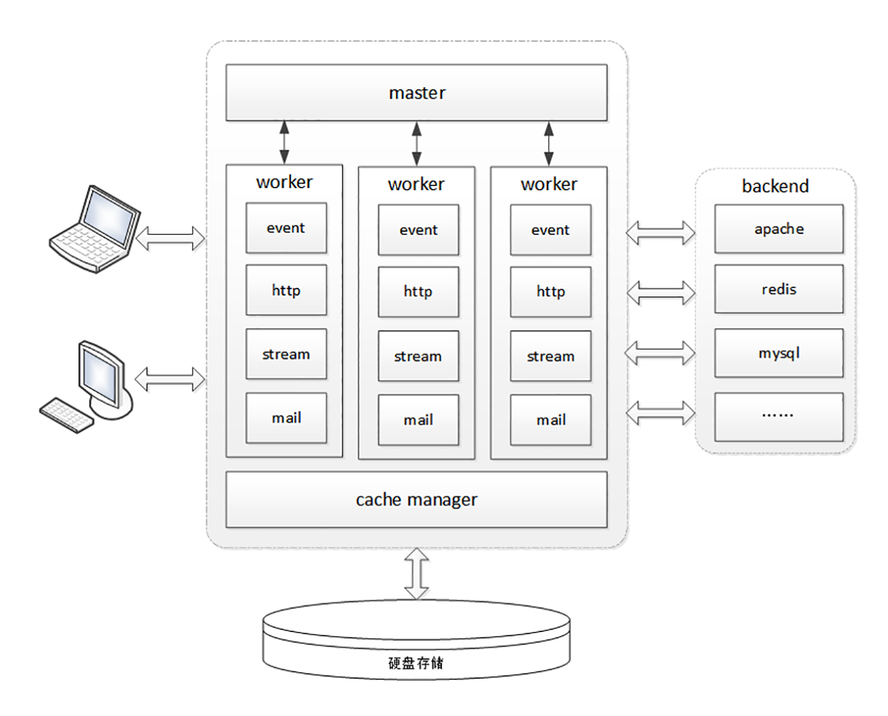
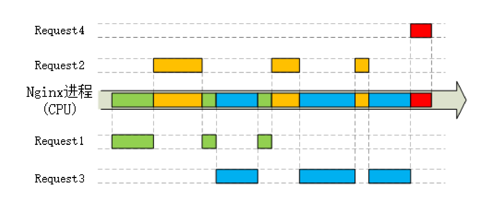
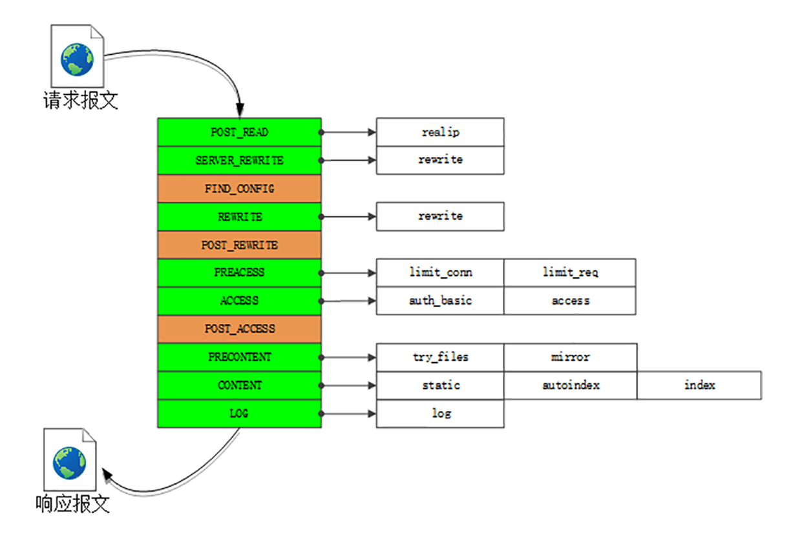
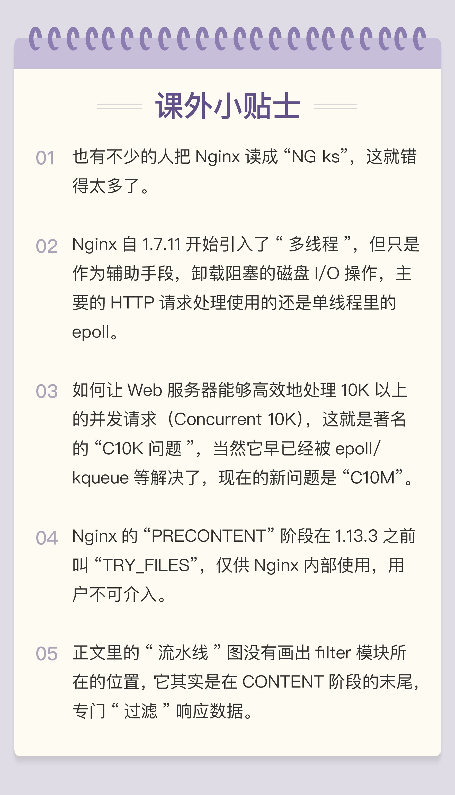

34 Nginx：高性能的Web服务器
===================

经过前面几大模块的学习，你已经完全掌握了 HTTP 的所有知识，那么接下来请收拾一下行囊，整理一下装备，跟我一起去探索 HTTP 之外的广阔天地。

现在的互联网非常发达，用户越来越多，网速越来越快，HTTPS 的安全加密、HTTP/2 的多路复用等特性都对 Web 服务器提出了非常高的要求。一个好的 Web 服务器必须要具备稳定、快速、易扩展、易维护等特性，才能够让网站“立于不败之地”。

那么，在搭建网站的时候，应该选择什么样的服务器软件呢？

在开头的几讲里我也提到过，Web 服务器就那么几款，目前市面上主流的只有两个：Apache 和 Nginx，两者合计占据了近 90% 的市场份额。

今天我要说的就是其中的 Nginx，它是 Web 服务器的“后起之秀”，虽然比 Apache 小了 10 岁，但增长速度十分迅猛，已经达到了与 Apache“平起平坐”的地位，而在“Top Million”网站中更是超过了 Apache，拥有超过 50% 的用户（[参考数据](https://w3techs.com/technologies/cross/web_server/ranking)）。

在这里必须要说一下 Nginx 的正确发音，它应该读成“Engine X”，但我个人感觉“X”念起来太“拗口”，还是比较倾向于读做“Engine ks”，这也与 UNIX、Linux 的发音一致。

作为一个 Web 服务器，Nginx 的功能非常完善，完美支持 HTTP/1、HTTPS 和 HTTP/2，而且还在不断进步。当前的主线版本已经发展到了 1.17，正在进行 HTTP/3 的研发，或许一年之后就能在 Nginx 上跑 HTTP/3 了。

Nginx 也是我个人的主要研究领域，我也写过相关的书，按理来说今天的课程应该是“手拿把攥”，但真正动笔的时候还是有些犹豫的：很多要点都已经在书里写过了，这次的专栏如果再重复相同的内容就不免有“骗稿费”的嫌疑，应该有些“不一样的东西”。

所以我决定抛开书本，换个角度，结合 HTTP 协议来讲 Nginx，带你窥视一下 HTTP 处理的内幕，看看 Web 服务器的工作原理。

进程池
---

你也许听说过，Nginx 是个“轻量级”的 Web 服务器，那么这个所谓的“轻量级”是什么意思呢？

“轻量级”是相对于“重量级”而言的。“重量级”就是指服务器进程很“重”，占用很多资源，当处理 HTTP 请求时会消耗大量的 CPU 和内存，受到这些资源的限制很难提高性能。

而 Nginx 作为“轻量级”的服务器，它的 CPU、内存占用都非常少，同样的资源配置下就能够为更多的用户提供服务，其奥秘在于它独特的工作模式。

在 Nginx 之前，Web 服务器的工作模式大多是“Per-Process”或者“Per-Thread”，对每一个请求使用单独的进程或者线程处理。这就存在创建进程或线程的成本，还会有进程、线程“上下文切换”的额外开销。如果请求数量很多，CPU 就会在多个进程、线程之间切换时“疲于奔命”，平白地浪费了计算时间。

Nginx 则完全不同，“一反惯例”地没有使用多线程，而是使用了“ **进程池 + 单线程** ”的工作模式。

Nginx 在启动的时候会预先创建好固定数量的 worker 进程，在之后的运行过程中不会再 fork 出新进程，这就是进程池，而且可以自动把进程“绑定”到独立的 CPU 上，这样就完全消除了进程创建和切换的成本，能够充分利用多核 CPU 的计算能力。

在进程池之上，还有一个“master”进程，专门用来管理进程池。它的作用有点像是 supervisor（一个用 Python 编写的进程管理工具），用来监控进程，自动恢复发生异常的 worker，保持进程池的稳定和服务能力。

不过 master 进程完全是 Nginx 自行用 C 语言实现的，这就摆脱了外部的依赖，简化了 Nginx 的部署和配置。

I/O 多路复用
--------

如果你用 Java、C 等语言写过程序，一定很熟悉“多线程”的概念，使用多线程能够很容易实现并发处理。

但多线程也有一些缺点，除了刚才说到的“上下文切换”成本，还有编程模型复杂、数据竞争、同步等问题，写出正确、快速的多线程程序并不是一件容易的事情。

所以 Nginx 就选择了单线程的方式，带来的好处就是开发简单，没有互斥锁的成本，减少系统消耗。

那么，疑问也就产生了：为什么单线程的 Nginx，处理能力却能够超越其他多线程的服务器呢？

这要归功于 Nginx 利用了 Linux 内核里的一件“神兵利器”， **I/O 多路复用接口** ，“大名鼎鼎”的 epoll。

“多路复用”这个词我们已经在之前的 HTTP/2、HTTP/3 里遇到过好几次，如果你理解了那里的“多路复用”，那么面对 Nginx 的 epoll“多路复用”也就好办了。

Web 服务器从根本上来说是“I/O 密集型”而不是“CPU 密集型”，处理能力的关键在于网络收发而不是 CPU 计算（这里暂时不考虑 HTTPS 的加解密），而网络 I/O 会因为各式各样的原因不得不等待，比如数据还没到达、对端没有响应、缓冲区满发不出去等等。

这种情形就有点像是 HTTP 里的“队头阻塞”。对于一般的单线程来说 CPU 就会“停下来”，造成浪费。而多线程的解决思路有点类似“并发连接”，虽然有的线程可能阻塞，但由于多个线程并行，总体上看阻塞的情况就不会太严重了。

Nginx 里使用的 epoll，就好像是 HTTP/2 里的“多路复用”技术，它把多个 HTTP 请求处理打散成碎片，都“复用”到一个单线程里，不按照先来后到的顺序处理，而是只当连接上真正可读、可写的时候才处理，如果可能发生阻塞就立刻切换出去，处理其他的请求。

通过这种方式，Nginx 就完全消除了 I/O 阻塞，把 CPU 利用得“满满当当”，又因为网络收发并不会消耗太多 CPU 计算能力，也不需要切换进程、线程，所以整体的 CPU 负载是相当低的。

这里我画了一张 Nginx“I/O 多路复用”的示意图，你可以看到，它的形式与 HTTP/2 的流非常相似，每个请求处理单独来看是分散、阻塞的，但因为都复用到了一个线程里，所以资源的利用率非常高。

epoll 还有一个特点，大量的连接管理工作都是在操作系统内核里做的，这就减轻了应用程序的负担，所以 Nginx 可以为每个连接只分配很小的内存维护状态，即使有几万、几十万的并发连接也只会消耗几百 M 内存，而其他的 Web 服务器这个时候早就“Memory not enough”了。

多阶段处理
-----

有了“进程池”和“I/O 多路复用”，Nginx 是如何处理 HTTP 请求的呢？

Nginx 在内部也采用的是“ **化整为零** ”的思路，把整个 Web 服务器分解成了多个“功能模块”，就好像是乐高积木，可以在配置文件里任意拼接搭建，从而实现了高度的灵活性和扩展性。

Nginx 的 HTTP 处理有四大类模块：

1. handler 模块：直接处理 HTTP 请求；
2. filter 模块：不直接处理请求，而是加工过滤响应报文；
3. upstream 模块：实现反向代理功能，转发请求到其他服务器；
4. balance 模块：实现反向代理时的负载均衡算法。

因为 upstream 模块和 balance 模块实现的是代理功能，Nginx 作为“中间人”，运行机制比较复杂，所以我今天只讲 handler 模块和 filter 模块。

不知道你有没有了解过“设计模式”这方面的知识，其中有一个非常有用的模式叫做“ **职责链** ”。它就好像是工厂里的流水线，原料从一头流入，线上有许多工人会进行各种加工处理，最后从另一头出来的就是完整的产品。

Nginx 里的 handler 模块和 filter 模块就是按照“职责链”模式设计和组织的，HTTP 请求报文就是“原材料”，各种模块就是工厂里的工人，走完模块构成的“流水线”，出来的就是处理完成的响应报文。

下面的这张图显示了 Nginx 的“流水线”，在 Nginx 里的术语叫“阶段式处理”（Phases），一共有 11 个阶段，每个阶段里又有许多各司其职的模块。

我简单列几个与我们的课程相关的模块吧：

* charset 模块实现了字符集编码转换；（\[第 15 讲\]）
* chunked 模块实现了响应数据的分块传输；（\[第 16 讲\]）
* range 模块实现了范围请求，只返回数据的一部分；（\[第 16 讲\]）
* rewrite 模块实现了重定向和跳转，还可以使用内置变量自定义跳转的 URI；（\[第 18 讲\]）
* not\_modified 模块检查头字段“if-Modified-Since”和“If-None-Match”，处理条件请求；（\[第 20 讲\]）
* realip 模块处理“X-Real-IP”“X-Forwarded-For”等字段，获取客户端的真实 IP 地址；（\[第 21 讲\]）
* ssl 模块实现了 SSL/TLS 协议支持，读取磁盘上的证书和私钥，实现 TLS 握手和 SNI、ALPN 等扩展功能；（\[安全篇\]）
* http\_v2 模块实现了完整的 HTTP/2 协议。（\[飞翔篇\]）

在这张图里，你还可以看到 limit\_conn、limit\_req、access、log 等其他模块，它们实现的是限流限速、访问控制、日志等功能，不在 HTTP 协议规定之内，但对于运行在现实世界的 Web 服务器却是必备的。

如果你有 C 语言基础，感兴趣的话可以下载 Nginx 的源码，在代码级别仔细看看 HTTP 的处理过程。

小结
--

1. Nginx 是一个高性能的 Web 服务器，它非常的轻量级，消耗的 CPU、内存很少；
2. Nginx 采用“master/workers”进程池架构，不使用多线程，消除了进程、线程切换的成本；
3. Nginx 基于 epoll 实现了“I/O 多路复用”，不会阻塞，所以性能很高；
4. Nginx 使用了“职责链”模式，多个模块分工合作，自由组合，以流水线的方式处理 HTTP 请求。

课下作业
----

1. 你是怎么理解进程、线程上下文切换时的成本的，为什么 Nginx 要尽量避免？
2. 试着自己描述一下 Nginx 用进程、epoll、模块流水线处理 HTTP 请求的过程。

欢迎你把自己的学习体会写在留言区，与我和其他同学一起讨论。如果你觉得有所收获，也欢迎把文章分享给你的朋友。

