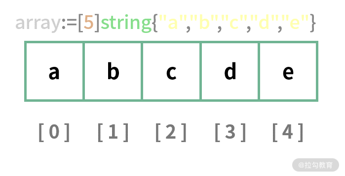
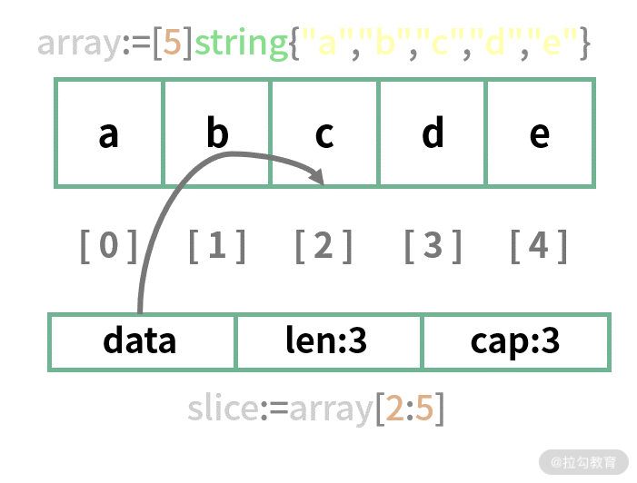

# 04 集合类型：如何正确使用 array、slice 和 map？

上节课的思考题是练习使用 for 循环中的 continue，通过上节课的学习，你已经了解 continue 是跳出本次循环的意思，现在我就以计算 100 以内的偶数之和为例，演示 continue 的用法：

```
sum := 0

for i:=1; i<100; i++{

   if i%2!=0 {

      continue

   }

   sum+=i

}

fmt.Println("the sum is",sum)
```

这个示例的关键在于：如果 i 不是偶数，就会用 continue 跳出本次循环，继续下个循环；如果是偶数，则继续执行 sum+=i，然后继续循环，这样就达到了只计算 100 以内偶数之和的目的。

下面我们开始本节课的学习，我将介绍 Go 语言的集合类型。

在实际需求中，我们会有很多同一类型的元素放在一起的场景，这就是集合，例如 100 个数字，10 个字符串等。在 Go 语言中，数组（array）、切片（slice）、映射（map）这些都是集合类型，用于存放同一类元素。虽然都是集合，但用处又不太一样，这节课我就为你详细地介绍。

### Array（数组）

数组存放的是固定长度、相同类型的数据，而且这些存放的元素是连续的。所存放的数据类型没有限制，可以是整型、字符串甚至自定义。

#### 数组声明

要声明一个数组非常简单，语法和第二课时介绍的声明基础类型是一样的。

在下面的代码示例中，我声明了一个字符串数组，长度是 5，所以其类型定义为 \[5\]string，其中大括号中的元素用于初始化数组。此外，在类型名前加 \[\] 中括号，并设置好长度，就可以通过它来推测数组的类型。

> 注意：\[5\]string 和 \[4\]string 不是同一种类型，也就是说长度也是数组类型的一部分。

_**ch04/main.go**_

```
array:=[5]string{"a","b","c","d","e"}
```

数组在内存中都是连续存放的，下面通过一幅图片形象地展示数组在内存中如何存放：



可以看到，数组的每个元素都是连续存放的，每一个元素都有一个下标（Index）。下标从 0 开始，比如第一个元素 a 对应的下标是 0，第二个元素 b 对应的下标是 1。以此类推，通过 array+\[下标\] 的方式，我们可以快速地定位元素。

如下面代码所示，运行它，可以看到输出打印的结果是 c，也就是数组 array 的第三个元素：

_**ch04/main.go**_

```
func main() {

    array:=[5]string{"a","b","c","d","e"}

    fmt.Println(array[2])

}
```

在定义数组的时候，数组的长度可以省略，这个时候 Go 语言会自动根据大括号 {} 中元素的个数推导出长度，所以以上示例也可以像下面这样声明：

```
array:=[...]string{"a","b","c","d","e"}
```

以上省略数组长度的声明只适用于所有元素都被初始化的数组，如果是只针对特定索引元素初始化的情况，就不适合了，如下示例：

```
array1:=[5]string{1:"b",3:"d"}
```

示例中的「1:"b",3:"d"」的意思表示初始化索引 1 的值为 b，初始化索引 3 的值为 d，整个数组的长度为 5。如果我省略长度 5，那么整个数组的长度只有 4，显然不符合我们定义数组的初衷。

此外，没有初始化的索引，其默认值都是数组类型的零值，也就是 string 类型的零值 "" 空字符串。

除了使用 \[\] 操作符根据索引快速定位数组的元素外，还可以通过 for 循环打印所有的数组元素，如下面的代码所示：

_**ch04/main.go**_

```
for i:=0;i<5;i++{

    fmt.Printf("数组索引:%d,对应值:%s\n", i, array[i])

}
```

#### 数组循环

使用传统的 for 循环遍历数组，输出对应的索引和对应的值，这种方式很烦琐，一般不使用，大部分情况下，我们使用的是 for range 这种 Go 语言的新型循环，如下面的代码所示：

```
for i,v:=range array{

    fmt.Printf("数组索引:%d,对应值:%s\n", i, v)

}
```

这种方式和传统 for 循环的结果是一样的。对于数组，range 表达式返回两个结果：

1. 第一个是数组的索引；
1. 第二个是数组的值。

在上面的示例中，把返回的两个结果分别赋值给 i 和 v 这两个变量，就可以使用它们了。

相比传统的 for 循环，for range 要更简洁，如果返回的值用不到，可以使用 _ 下划线丢弃，如下面的代码所示：

```
for _,v:=range array{

    fmt.Printf("对应值:%s\n", v)

}
```

数组的索引通过 _ 就被丢弃了，只使用数组的值 v 即可。

### Slice（切片）

切片和数组类似，可以把它理解为动态数组。切片是基于数组实现的，它的底层就是一个数组。对数组任意分隔，就可以得到一个切片。现在我们通过一个例子来更好地理解它，同样还是基于上述例子的 array。

#### 基于数组生成切片

下面代码中的 array\[2:5\] 就是获取一个切片的操作，它包含从数组 array 的索引 2 开始到索引 5 结束的元素：

```
array:=[5]string{"a","b","c","d","e"}

slice:=array[2:5]

fmt.Println(slice)
```

> 注意：这里是包含索引 2，但是不包含索引 5 的元素，即在 : 右边的数字不会被包含。

_**ch04/main.go**_

```
//基于数组生成切片，包含索引start，但是不包含索引end

slice:=array[start:end]
```

所以 array\[2:5\] 获取到的是 c、d、e 这三个元素，然后这三个元素作为一个切片赋值给变量 slice。

切片和数组一样，也可以通过索引定位元素。这里以新获取的 slice 切片为例，slice\[0\] 的值为 c，slice\[1\] 的值为 d。

有没有发现，在数组 array 中，元素 c 的索引其实是 2，但是对数组切片后，在新生成的切片 slice 中，它的索引是 0，这就是切片。虽然切片底层用的也是 array 数组， **但是经过切片后，切片的索引范围改变了** 。

通过下图可以看出，切片是一个具备三个字段的数据结构，分别是指向数组的指针 data，长度 len 和容量 cap：



这里有一些小技巧，切片表达式 array\[start:end\] 中的 start 和 end 索引都是可以省略的，如果省略 start，那么 start 的值默认为 0，如果省略 end，那么 end 的默认值为数组的长度。如下面的示例：

1. array\[:4\] 等价于 array\[0:4\]。
1. array\[1:\] 等价于 array\[1:5\]。
1. array\[:\] 等价于 array\[0:5\]。

#### 切片修改

切片的值也可以被修改，这里也同时可以证明切片的底层是数组。

对切片相应的索引元素赋值就是修改，在下面的代码中，把切片 slice 索引 1 的值修改为 f，然后打印输出数组 array：

```
slice:=array[2:5]

slice[1] ="f"

fmt.Println(array)
```

可以看到如下结果：

```
[a b c f e]
```

数组对应的值已经被修改为 f，所以这也证明了基于数组的切片，使用的底层数组还是原来的数组，一旦修改切片的元素值，那么底层数组对应的值也会被修改。

#### **切片声明**除了可以从一个数组得到切片外，还可以声明切片，比较简单的是使用 make 函数

下面的代码是声明了一个元素类型为 string 的切片，长度是 4，make 函数还可以传入一个容量参数：

```
slice1:=make([]string,4)
```

在下面的例子中，指定了新创建的切片 \[\]string 容量为 8：

```
slice1:=make([]string,4,8)
```

这里需要注意的是，切片的容量不能比切片的长度小。

切片的长度你已经知道了，就是切片内元素的个数。那么容量是什么呢？其实就是切片的空间。

上面的示例说明，Go 语言在内存上划分了一块容量为 8 的内容空间（容量为 8），但是只有 4 个内存空间才有元素（长度为 4），其他的内存空间处于空闲状态，当通过 append 函数往切片中追加元素的时候，会追加到空闲的内存上，当切片的长度要超过容量的时候，会进行扩容。

切片不仅可以通过 make 函数声明，也可以通过字面量的方式声明和初始化，如下所示：

```
slice1:=[]string{"a","b","c","d","e"}

fmt.Println(len(slice1),cap(slice1))
```

可以注意到，切片和数组的字面量初始化方式，差别就是中括号 \[\] 里的长度。此外，通过字面量初始化的切片，长度和容量相同。

#### Append

我们可以通过内置的 append 函数对一个切片追加元素，返回新切片，如下面的代码所示：

```
//追加一个元素

slice2:=append(slice1,"f")

//多加多个元素

slice2:=append(slice1,"f","g")

//追加另一个切片

slice2:=append(slice1,slice...)
```

append 函数可以有以上三种操作，你可以根据自己的实际需求进行选择，append 会自动处理切片容量不足需要扩容的问题。

> 小技巧：在创建新切片的时候，最好要让新切片的长度和容量一样，这样在追加操作的时候就会生成新的底层数组，从而和原有数组分离，就不会因为共用底层数组导致修改内容的时候影响多个切片。

#### 切片元素循环

切片的循环和数组一模一样，常用的也是 for range 方式，这里就不再进行举例，当作练习题留给你。

在 Go 语言开发中，切片是使用最多的，尤其是作为函数的参数时，相比数组，通常会优先选择切片，因为它高效，内存占用小。

### Map（映射）

在 Go 语言中，map 是一个无序的 K-V 键值对集合，结构为 map\[K\]V。其中 K 对应 Key，V 对应 Value。map 中所有的 Key 必须具有相同的类型，Value 也同样，但 Key 和 Value 的类型可以不同。此外，Key 的类型必须支持 == 比较运算符，这样才可以判断它是否存在，并保证 Key 的唯一。

#### Map 声明初始化

创建一个 map 可以通过内置的 make 函数，如下面的代码所示：

```
nameAgeMap:=make(map[string]int)
```

它的 Key 类型为 string，Value 类型为 int。有了创建好的 map 变量，就可以对它进行操作了。

在下面的示例中，我添加了一个键值对，Key 为飞雪无情，Value 为 20，如果 Key 已经存在，则更新 Key 对应的 Value：

```
nameAgeMap["飞雪无情"] = 20
```

除了可以通过 make 函数创建 map 外，还可以通过字面量的方式。同样是上面的示例，我们用字面量的方式做如下操作：

```
nameAgeMap:=map[string]int{"飞雪无情":20}
```

在创建 map 的同时添加键值对，如果不想添加键值对，使用空大括号 {} 即可，要注意的是，大括号一定不能省略。

#### Map 获取和删除

map 的操作和切片、数组差不多，都是通过 \[\] 操作符，只不过数组切片的 \[\] 中是索引，而 map 的 \[\] 中是 Key，如下面的代码所示：

```
//添加键值对或者更新对应 Key 的 Value

nameAgeMap["飞雪无情"] = 20

//获取指定 Key 对应的 Value

age:=nameAgeMap["飞雪无情"]
```

Go 语言的 map 可以获取不存在的 K-V 键值对，如果 Key 不存在，返回的 Value 是该类型的零值，比如 int 的零值就是 0。所以很多时候，我们需要先判断 map 中的 Key 是否存在。

map 的 \[\] 操作符可以返回两个值：

1. 第一个值是对应的 Value；
1. 第二个值标记该 Key 是否存在，如果存在，它的值为 true。

我们通过下面的代码进行演示：

_\*\* ch04/main.go \*\*_

```
nameAgeMap:=make(map[string]int)

nameAgeMap["飞雪无情"] = 20

age,ok:=nameAgeMap["飞雪无情1"]

if ok {

    fmt.Println(age)

}
```

在示例中，age 是返回的 Value，ok 用来标记该 Key 是否存在，如果存在则打印 age。

如果要删除 map 中的键值对，使用内置的 delete 函数即可，比如要删除 nameAgeMap 中 Key 为飞雪无情的键值对。我们用下面的代码进行演示：

```
delete(nameAgeMap,"飞雪无情")
```

delete 有两个参数：第一个参数是 map，第二个参数是要删除键值对的 Key。

#### 遍历 Map

map 是一个键值对集合，它同样可以被遍历，在 Go 语言中，map 的遍历使用 for range 循环。

对于 map，for range 返回两个值：

1. 第一个是 map 的 Key；
1. 第二个是 map 的 Value。

我们用下面的代码进行演示：

_\*\* ch04/main.go \*\*_

```
//测试 for range

nameAgeMap["飞雪无情"] = 20

nameAgeMap["飞雪无情1"] = 21

nameAgeMap["飞雪无情2"] = 22

for k,v:=range nameAgeMap{

    fmt.Println("Key is",k,",Value is",v)

}
```

需要注意的是 map 的遍历是无序的，也就是说你每次遍历，键值对的顺序可能会不一样。如果想按顺序遍历，可以先获取所有的 Key，并对 Key 排序，然后根据排序好的 Key 获取对应的 Value。这里我不再进行演示，你可以当作练习题。

> 小技巧：for range map 的时候，也可以使用一个值返回。使用一个返回值的时候，这个返回值默认是 map 的 Key。

#### Map 的大小

和数组切片不一样，map 是没有容量的，它只有长度，也就是 map 的大小（键值对的个数）。要获取 map 的大小，使用内置的 len 函数即可，如下代码所示：

```
fmt.Println(len(nameAgeMap))
```

### String 和 \[\]byte

字符串 string 也是一个不可变的字节序列，所以可以直接转为字节切片 \[\]byte，如下面的代码所示：

_\*\* ch04/main.go \*\*_

```
s:="Hello飞雪无情"

bs:=[]byte(s)
```

string 不止可以直接转为 \[\]byte，还可以使用 \[\] 操作符获取指定索引的字节值，如以下示例：

_\*\* ch04/main.go \*\*_

```
s:="Hello飞雪无情"

bs:=[]byte(s)

fmt.Println(bs)

fmt.Println(s[0],s[1],s[15])
```

你可能会有疑惑，在这个示例中，字符串 s 里的字母和中文加起来不是 9 个字符吗？怎么可以使用 s\[15\] 超过 9 的索引呢？其实恰恰就是因为字符串是字节序列，每一个索引对应的是一个字节，而在 UTF8 编码下，一个汉字对应三个字节，所以字符串 s 的长度其实是 17。

运行下面的代码，就可以看到打印的结果是 17。

```
fmt.Println(len(s))
```

如果你想把一个汉字当成一个长度计算，可以使用 utf8.RuneCountInString 函数。运行下面的代码，可以看到打印结果是 9，也就是 9 个 unicode（utf8）字符，和我们看到的字符的个数一致。

```
fmt.Println(utf8.RuneCountInString(s))
```

而使用 for range 对字符串进行循环时，也恰好是按照 unicode 字符进行循环的，所以对于字符串 s 来说，循环了 9 次。

在下面示例的代码中，i 是索引，r 是 unicode 字符对应的 unicode 码点，这也说明了 for range 循环在处理字符串的时候，会自动地隐式解码 unicode 字符串。

_\*\* ch04/main.go \*\*_

```
for i,r:=range s{

    fmt.Println(i,r)

}
```

### 总结

这节课到这里就要结束了，在这节课里我讲解了数组、切片和映射的声明和使用，有了这些集合类型，你就可以把你需要的某一类数据放到集合类型中了，比如获取用户列表、商品列表等。

数组、切片还可以分为二维和多维，比如二维字节切片就是 \[\]\[\]byte，三维就是 \[\]\[\]\[\]byte，因为不常用，所以本节课中没有详细介绍，你可以结合我讲的一维 \[\]byte 切片自己尝试练习，这也是本节课要给你留的**思考题**，创建一个二维数组并使用它。

此外，如果 map 的 Key 的类型是整型，并且集合中的元素比较少，应该尽量选择切片，因为效率更高。在实际的项目开发中，数组并不常用，尤其是在函数间作为参数传递的时候，用得最多的是切片，它更灵活，并且内存占用少。
