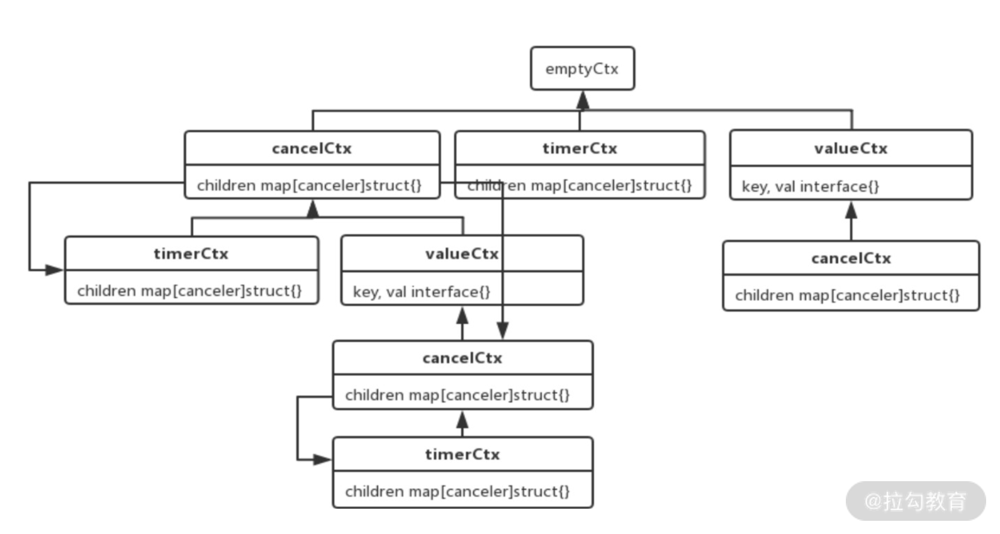

# 10 Context：你必须掌握的多线程并发控制神器

在上一节课中我留了一个作业，也就是让你自己练习使用 sync.Map，相信你已经做出来了。现在我为你讲解 sync.Map 的方法。

1. **Store **：存储一对 key-value 值。
   2.** Load **：根据 key 获取对应的 value 值，并且可以判断 key 是否存在。
   3.** LoadOrStore **：如果 key 对应的 value 存在，则返回该 value；如果不存在，存储相应的 value。
   4.** Delete **：删除一个 key-value 键值对。
   5.** Range**：循环迭代 sync.Map，效果与 for range 一样。

相信有了这些方法的介绍，你对 sync.Map 会有更深入的理解。下面开始今天的课程：如何通过 Context 更好地控制并发。

### 协程如何退出

一个协程启动后，大部分情况需要等待里面的代码执行完毕，然后协程会自行退出。但是如果有一种情景，需要让协程提前退出怎么办呢？在下面的代码中，我做了一个监控狗用来监控程序：

_\*\* ch10/main.go\*\*_

```
func main() {
   var wg sync.WaitGroup
   wg.Add(1)
   go func() {
      defer wg.Done()
      watchDog("【监控狗1】")
   }()
   wg.Wait()
}
func watchDog(name string){
   //开启for select循环，一直后台监控
   for{
      select {
      default:
         fmt.Println(name,"正在监控……")
      }
      time.Sleep(1*time.Second)
   }
}
```

我通过 watchDog 函数实现了一个监控狗，它会一直在后台运行，每隔一秒就会打印"监控狗正在监控……"的文字。

如果需要让监控狗停止监控、退出程序，一个办法是定义一个全局变量，其他地方可以通过修改这个变量发出停止监控狗的通知。然后在协程中先检查这个变量，如果发现被通知关闭就停止监控，退出当前协程。

但是这种方法需要通过加锁来保证多协程下并发的安全，基于这个思路，有个升级版的方案：用 select+channel 做检测，如下面的代码所示：

_**ch10/main.go**_

```
func main() {
   var wg sync.WaitGroup
   wg.Add(1)
   stopCh := make(chan bool) //用来停止监控狗
   go func() {
      defer wg.Done()
      watchDog(stopCh,"【监控狗1】")
   }()
   time.Sleep(5 * time.Second) //先让监控狗监控5秒
   stopCh <- true //发停止指令
   wg.Wait()
}
func watchDog(stopCh chan bool,name string){
   //开启for select循环，一直后台监控
   for{
      select {
      case <-stopCh:
         fmt.Println(name,"停止指令已收到，马上停止")
         return
      default:
         fmt.Println(name,"正在监控……")
      }
      time.Sleep(1*time.Second)
   }
}
```

这个示例是使用 select+channel 的方式改造的 watchDog 函数，实现了通过 channel 发送指令让监控狗停止，进而达到协程退出的目的。以上示例主要有两处修改，具体如下：

1. 为 watchDog 函数增加 stopCh 参数，用于接收停止指令；
1. 在 main 函数中，声明用于停止的 stopCh，传递给 watchDog 函数，然后通过 stopCh\<-true 发送停止指令让协程退出。

### 初识 Context

以上示例是 select+channel 比较经典的使用场景，这里也顺便复习了 select 的知识。

通过 select+channel 让协程退出的方式比较优雅，但是如果我们希望做到同时取消很多个协程呢？如果是定时取消协程又该怎么办？这时候 select+channel 的局限性就凸现出来了，即使定义了多个 channel 解决问题，代码逻辑也会非常复杂、难以维护。

要解决这种复杂的协程问题，必须有一种可以跟踪协程的方案，只有跟踪到每个协程，才能更好地控制它们，这种方案就是 Go 语言标准库为我们提供的 Context，也是这节课的主角。

现在我通过 Context 重写上面的示例，实现让监控狗停止的功能，如下所示：

_**ch10/main.go**_

```
func main() {
   var wg sync.WaitGroup
   wg.Add(1)
   ctx,stop:=context.WithCancel(context.Background())
   go func() {
      defer wg.Done()
      watchDog(ctx,"【监控狗1】")
   }()
   time.Sleep(5 * time.Second) //先让监控狗监控5秒
   stop() //发停止指令
   wg.Wait()
}
func watchDog(ctx context.Context,name string) {
   //开启for select循环，一直后台监控
   for {
      select {
      case <-ctx.Done():
         fmt.Println(name,"停止指令已收到，马上停止")
         return
      default:
         fmt.Println(name,"正在监控……")
      }
      time.Sleep(1 * time.Second)
   }
}
```

相比 select+channel 的方案，Context 方案主要有 4 个改动点。

1. watchDog 的 stopCh 参数换成了 ctx，类型为 context.Context。
1. 原来的 case \<-stopCh 改为 case \<-ctx.Done()，用于判断是否停止。
1. 使用 context.WithCancel(context.Background()) 函数生成一个可以取消的 Context，用于发送停止指令。这里的 context.Background() 用于生成一个空 Context，一般作为整个 Context 树的根节点。
1. 原来的 stopCh \<- true 停止指令，改为 context.WithCancel 函数返回的取消函数 stop()。

可以看到，这和修改前的整体代码结构一样，只不过从 channel 换成了 Context。以上示例只是 Context 的一种使用场景，它的能力不止于此，现在我来介绍什么是 Context。

## 什么是 Context

一个任务会有很多个协程协作完成，一次 HTTP 请求也会触发很多个协程的启动，而这些协程有可能会启动更多的子协程，并且无法预知有多少层协程、每一层有多少个协程。

如果因为某些原因导致任务终止了，HTTP 请求取消了，那么它们启动的协程怎么办？该如何取消呢？因为取消这些协程可以节约内存，提升性能，同时避免不可预料的 Bug。

Context 就是用来简化解决这些问题的，并且是并发安全的。Context 是一个接口，它具备手动、定时、超时发出取消信号、传值等功能，主要用于控制多个协程之间的协作，尤其是取消操作。一旦取消指令下达，那么被 Context 跟踪的这些协程都会收到取消信号，就可以做清理和退出操作。

Context 接口只有四个方法，下面进行详细介绍，在开发中你会经常使用它们，你可以结合下面的代码来看。

```
type Context interface {
   Deadline() (deadline time.Time, ok bool)
   Done() <-chan struct{}
   Err() error
   Value(key interface{}) interface{}
}
```

1. Deadline 方法可以获取设置的截止时间，第一个返回值 deadline 是截止时间，到了这个时间点，Context 会自动发起取消请求，第二个返回值 ok 代表是否设置了截止时间。
1. Done 方法返回一个只读的 channel，类型为 struct{}。在协程中，如果该方法返回的 chan 可以读取，则意味着 Context 已经发起了取消信号。通过 Done 方法收到这个信号后，就可以做清理操作，然后退出协程，释放资源。
1. Err 方法返回取消的错误原因，即因为什么原因 Context 被取消。
1. Value 方法获取该 Context 上绑定的值，是一个键值对，所以要通过一个 key 才可以获取对应的值。

Context 接口的四个方法中最常用的就是 Done 方法，它返回一个只读的 channel，用于接收取消信号。当 Context 取消的时候，会关闭这个只读 channel，也就等于发出了取消信号。

### Context 树

我们不需要自己实现 Context 接口，Go 语言提供了函数可以帮助我们生成不同的 Context，通过这些函数可以生成一颗 Context 树，这样 Context 才可以关联起来，父 Context 发出取消信号的时候，子 Context 也会发出，这样就可以控制不同层级的协程退出。

从使用功能上分，有四种实现好的 Context。

1. **空 Context **：不可取消，没有截止时间，主要用于 Context 树的根节点。
   2.** 可取消的 Context **：用于发出取消信号，当取消的时候，它的子 Context 也会取消。
   3.** 可定时取消的 Context **：多了一个定时的功能。
   4.** 值 Context**：用于存储一个 key-value 键值对。

从下图 Context 的衍生树可以看到，最顶部的是空 Context，它作为整棵 Context 树的根节点，在 Go 语言中，可以通过 context.Background() 获取一个根节点 Context。



（四种 Context 的衍生树）

有了根节点 Context 后，这颗 Context 树要怎么生成呢？需要使用 Go 语言提供的四个函数。

1.**WithCancel(parent Context)**：生成一个可取消的 Context。
2.**WithDeadline(parent Context, d time.Time)**：生成一个可定时取消的 Context，参数 d 为定时取消的具体时间。
3.\*\* WithTimeout(parent Context, timeout time.Duration)**：生成一个可超时取消的 Context，参数 timeout 用于设置多久后取消
4.** WithValue(parent Context, key, val interface{})\*\*：生成一个可携带 key-value 键值对的 Context。

以上四个生成 Context 的函数中，前三个都属于可取消的 Context，它们是一类函数，最后一个是值 Context，用于存储一个 key-value 键值对。

### 使用 Context 取消多个协程

取消多个协程也比较简单，把 Context 作为参数传递给协程即可，还是以监控狗为例，如下所示：

_\*\* ch10/main.go \*\*_

```
wg.Add(3)
go func() {
   defer wg.Done()
   watchDog(ctx,"【监控狗2】")
}()
go func() {
   defer wg.Done()
   watchDog(ctx,"【监控狗3】")
}()
```

示例中增加了两个监控狗，也就是增加了两个协程，这样一个 Context 就同时控制了三个协程，一旦 Context 发出取消信号，这三个协程都会取消退出。

以上示例中的 Context 没有子 Context，如果一个 Context 有子 Context，在该 Context 取消时会发生什么呢？下面通过一幅图说明：


（Context 取消）

可以看到，当节点 Ctx2 取消时，它的子节点 Ctx4、Ctx5 都会被取消，如果还有子节点的子节点，也会被取消。也就是说根节点为 Ctx2 的所有节点都会被取消，其他节点如 Ctx1、Ctx3 和 Ctx6 则不会。

### Context 传值

Context 不仅可以取消，还可以传值，通过这个能力，可以把 Context 存储的值供其他协程使用。我通过下面的代码来说明：

_\*\* ch10/main.go\*\*_

```
func main() {
   wg.Add(4) //记得这里要改为4，原来是3，因为要多启动一个协程
   
  //省略其他无关代码
   valCtx:=context.WithValue(ctx,"userId",2)
   go func() {
      defer wg.Done()
      getUser(valCtx)
   }()
   //省略其他无关代码
}
func getUser(ctx context.Context){
   for  {
      select {
      case <-ctx.Done():
         fmt.Println("【获取用户】","协程退出")
         return
      default:
         userId:=ctx.Value("userId")
         fmt.Println("【获取用户】","用户ID为：",userId)
         time.Sleep(1 * time.Second)
      }
   }
}
```

这个示例是和上面的示例放在一起运行的，所以我省略了上面实例的重复代码。其中，通过 context.WithValue 函数存储一个 userId 为 2 的键值对，就可以在 getUser 函数中通过 ctx.Value("userId") 方法把对应的值取出来，达到传值的目的。

### Context 使用原则

Context 是一种非常好的工具，使用它可以很方便地控制取消多个协程。在 Go 语言标准库中也使用了它们，比如 net/http 中使用 Context 取消网络的请求。

要更好地使用 Context，有一些使用原则需要尽可能地遵守。

1. Context 不要放在结构体中，要以参数的方式传递。
1. Context 作为函数的参数时，要放在第一位，也就是第一个参数。
1. 要使用 context.Background 函数生成根节点的 Context，也就是最顶层的 Context。
1. Context 传值要传递必须的值，而且要尽可能地少，不要什么都传。
1. Context 多协程安全，可以在多个协程中放心使用。

以上原则是规范类的，Go 语言的编译器并不会做这些检查，要靠自己遵守。

### 总结

Context 通过 With 系列函数生成 Context 树，把相关的 Context 关联起来，这样就可以统一进行控制。一声令下，关联的 Context 都会发出取消信号，使用这些 Context 的协程就可以收到取消信号，然后清理退出。你在定义函数的时候，如果想让外部给你的函数发取消信号，就可以为这个函数增加一个 Context 参数，让外部的调用者可以通过 Context 进行控制，比如下载一个文件超时退出的需求。
