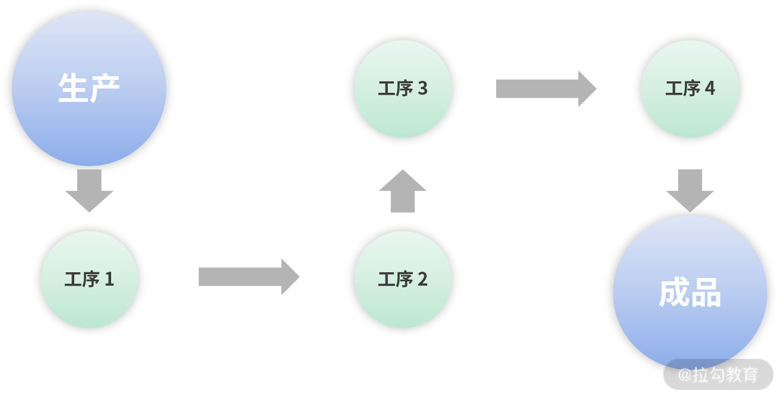
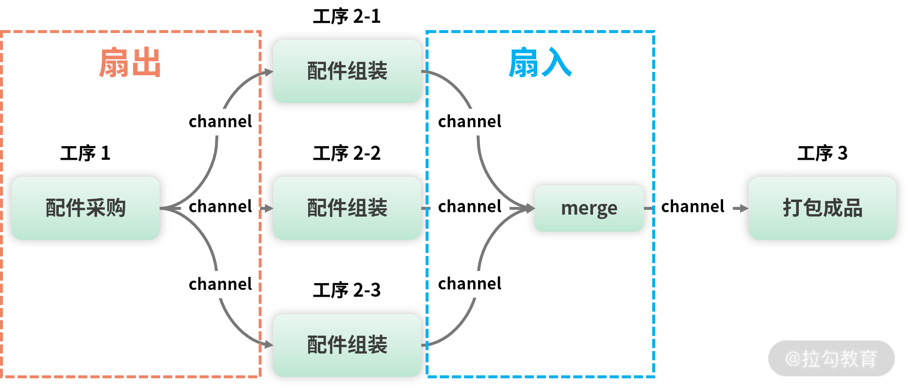

# 11 并发模式：Go 语言中即学即用的高效并发模式

上节课我为你讲解了如何通过 Context 更好地控制多个协程，课程最后的思考题是：如何通过 Context 实现日志跟踪？

要想跟踪一个用户的请求，必须有一个唯一的 ID 来标识这次请求调用了哪些函数、执行了哪些代码，然后通过这个唯一的 ID 把日志信息串联起来。这样就形成了一个日志轨迹，也就实现了用户的跟踪，于是思路就有了。

1. 在用户请求的入口点生成 TraceID。
1. 通过 context.WithValue 保存 TraceID。
1. 然后这个保存着 TraceID 的 Context 就可以作为参数在各个协程或者函数间传递。
1. 在需要记录日志的地方，通过 Context 的 Value 方法获取保存的 TraceID，然后把它和其他日志信息记录下来。
1. 这样具备同样 TraceID 的日志就可以被串联起来，达到日志跟踪的目的。

以上思路实现的核心是 Context 的传值功能。

目前我们已熟练掌握了 goroutine、channel、sync 包的同步原语，这些都是并发编程比较基础的元素。而这节课要介绍的是如何用这些基础元素组成并发模式，帮助我们更好地编写并发程序。

### for select 循环模式

for select 循环模式非常常见，在前面的课程中也使用过，它一般和 channel 组合完成任务，代码格式如下：

```
for { //for无限循环，或者for range循环

  select {

    //通过一个channel控制

  }

}
```

这是一种 for 循环 +select 多路复用的并发模式，哪个 case 满足就执行哪个，直到满足一定的条件退出 for 循环（比如发送退出信号）。

从具体实现上讲，for select 循环有两种模式，一种是上节课监控狗例子中的无限循环模式，只有收到终止指令才会退出，如下所示：

```
for  {

   select {

   case <-done:

      return

   default:

      //执行具体的任务

   }

 }
```

这种模式会一直执行 default 语句中的任务，直到 done 这个 channel 被关闭为止。

第二种模式是 for range select 有限循环，一般用于把可以迭代的内容发送到 channel 上，如下所示：

```
for _,s:=range []int{}{

   select {

   case <-done:

      return

   case resultCh <- s:

   }

}
```

这种模式也会有一个 done channel，用于退出当前的 for 循环，而另外一个 resultCh channel 用于接收 for range 循环的值，这些值通过 resultCh 可以传送给其他的调用者。

### select timeout 模式

假如需要访问服务器获取数据，因为网络的不同响应时间不一样，为保证程序的质量，不可能一直等待网络返回，所以需要设置一个超时时间，这时候就可以使用 select timeout 模式，如下所示：

_**ch11/main.go**_

```
func main() {

   result := make(chan string)

   go func() {

      //模拟网络访问

      time.Sleep(8 * time.Second)

      result <- "服务端结果"

   }()

   select {

   case v := <-result:

      fmt.Println(v)

   case <-time.After(5 * time.Second):

      fmt.Println("网络访问超时了")

   }

}
```

select timeout 模式的核心在于通过 time.After 函数设置一个超时时间，防止因为异常造成 select 语句的无限等待。

> 小提示：如果可以使用 Context 的 WithTimeout 函数超时取消，要优先使用。

### Pipeline 模式

Pipeline 模式也称为流水线模式，模拟的就是现实世界中的流水线生产。以手机组装为例，整条生产流水线可能有成百上千道工序，每道工序只负责自己的事情，最终经过一道道工序组装，就完成了一部手机的生产。

从技术上看，每一道工序的输出，就是下一道工序的输入，在工序之间传递的东西就是数据，这种模式称为流水线模式，而传递的数据称为数据流。



（流水线模式）

通过以上流水线模式示意图，可以看到从最开始的生产，经过工序 1、2、3、4 到最终成品，这就是一条比较形象的流水线，也就是 Pipeline。

现在我以组装手机为例，讲解流水线模式的使用。假设一条组装手机的流水线有 3 道工序，分别是 **配件采购** 、**配件组装 **、** 打包成品**，如图所示：


(手机组装流水线)

从以上示意图中可以看到，采购的配件通过 channel 传递给工序 2 进行组装，然后再通过 channel 传递给工序 3 打包成品。相对工序 2 来说，工序 1 是生产者，工序 3 是消费者。相对工序 1 来说，工序 2 是消费者。相对工序 3 来说，工序 2 是生产者。

我用下面的几组代码进行演示：

_\*\* ch11/main.go \*\*_

```
//工序1采购

func buy(n int) <-chan string {

   out := make(chan string)

   go func() {

      defer close(out)

      for i := 1; i <= n; i++ {

         out <- fmt.Sprint("配件", i)

      }

   }()

   return out

}
```

首先我们定义一个采购函数 buy，它有一个参数 n，可以设置要采购多少套配件。采购代码的实现逻辑是通过 for 循环产生配件，然后放到 channel 类型的变量 out 里，最后返回这个 out，调用者就可以从 out 中获得配件。

有了采购好的配件，就可以开始组装了，如下面的代码所示：

_\*\* ch11/main.go \*\*_

```
//工序2组装

func build(in <-chan string) <-chan string {

   out := make(chan string)

   go func() {

      defer close(out)

      for c := range in {

         out <- "组装(" + c + ")"

      }

   }()

   return out

}
```

组装函数 build 有一个 channel 类型的参数 in，用于接收配件进行组装，组装后的手机放到 channel 类型的变量 out 中返回。

有了组装好的手机，就可以放在精美的包装盒中售卖了，而包装的操作是工序 3 完成的，对应的函数是 pack，如下所示：

_\*\* ch11/main.go \*\*_

```
//工序3打包

func pack(in <-chan string) <-chan string {

   out := make(chan string)

   go func() {

      defer close(out)

      for c := range in {

         out <- "打包(" + c + ")"

      }

   }()

   return out

}
```

函数 pack 的代码实现和组装函数 build 基本相同，这里不再赘述。

流水线上的三道工序都完成后，就可以通过一个组织者把三道工序组织在一起，形成一条完整的手机组装流水线，这个组织者可以是我们常用的 main 函数，如下面的代码所示：

_\*\* ch11/main.go \*\*_

```
func main() {

   coms := buy(10)    //采购10套配件

   phones := build(coms) //组装10部手机

   packs := pack(phones) //打包它们以便售卖

   //输出测试，看看效果

   for p := range packs {

      fmt.Println(p)

   }

}
```

按照流水线工序进行调用，最终把手机打包以便售卖，过程如下所示：

```
打包(组装(配件1))

打包(组装(配件2))

打包(组装(配件3))

打包(组装(配件4))

打包(组装(配件5))

打包(组装(配件6))

打包(组装(配件7))

打包(组装(配件8))

打包(组装(配件9))

打包(组装(配件10))
```

从上述例子中，我们可以总结出一个流水线模式的构成：

1. 流水线由一道道工序构成，每道工序通过 channel 把数据传递到下一个工序；
1. 每道工序一般会对应一个函数，函数里有协程和 channel，协程一般用于处理数据并把它放入 channel 中，整个函数会返回这个 channel 以供下一道工序使用；
1. 最终要有一个组织者（示例中的 main 函数）把这些工序串起来，这样就形成了一个完整的流水线，对于数据来说就是数据流。

### 扇出和扇入模式

手机流水线经过一段时间的运转，组织者发现产能提不上去，经过调研分析，发现瓶颈在工序 2 配件组装。工序 2 过慢，导致上游工序 1 配件采购速度不得不降下来，下游工序 3 没太多事情做，不得不闲下来，这就是整条流水线产能低下的原因。

为了提升手机产能，组织者决定对工序 2 增加两班人手。人手增加后，整条流水线的示意图如下所示：



（改进后的流水线）

从改造后的流水线示意图可以看到，工序 2 共有工序 2-1、工序 2-2、工序 2-3 三班人手，工序 1 采购的配件会被工序 2 的三班人手同时组装，这三班人手组装好的手机会同时传给**merge 组件 **汇聚，然后再传给工序 3 打包成品。在这个流程中，会产生两种模式：** 扇出和扇入**。

- 示意图中红色的部分是 **扇出** ，对于工序 1 来说，它同时为工序 2 的三班人手传递数据（采购配件）。以工序 1 为中点，三条传递数据的线发散出去，就像一把打开的扇子一样，所以叫扇出。
- 示意图中蓝色的部分是 **扇入** ，对于 merge 组件来说，它同时接收工序 2 三班人手传递的数据（组装的手机）进行汇聚，然后传给工序 3。以 merge 组件为中点，三条传递数据的线汇聚到 merge 组件，也像一把打开的扇子一样，所以叫扇入。

> 小提示：扇出和扇入都像一把打开的扇子，因为数据传递的方向不同，所以叫法也不一样，扇出的数据流向是发散传递出去，是输出流；扇入的数据流向是汇聚进来，是输入流。

已经理解了扇出扇入的原理，就可以开始改造流水线了。这次改造中，三道工序的实现函数 buy、build、pack 都保持不变，只需要增加一个 merge 函数即可，如下面的代码所示：

_**ch11/main.go**_

```
//扇入函数（组件），把多个chanel中的数据发送到一个channel中

func merge(ins ...<-chan string) <-chan string {

   var wg sync.WaitGroup

   out := make(chan string)

   //把一个channel中的数据发送到out中

   p:=func(in <-chan string) {

      defer wg.Done()

      for c := range in {

         out <- c

      }

   }

   wg.Add(len(ins))

   //扇入，需要启动多个goroutine用于处于多个channel中的数据

   for _,cs:=range ins{

      go p(cs)

   }

   //等待所有输入的数据ins处理完，再关闭输出out

   go func() {

      wg.Wait()

      close(out)

   }()

   return out

}
```

新增的 merge 函数的核心逻辑就是对输入的每个 channel 使用单独的协程处理，并将每个协程处理的结果都发送到变量 out 中，达到扇入的目的。总结起来就是通过多个协程并发，把多个 channel 合成一个。

在整条手机组装流水线中，merge 函数非常小，而且和业务无关，不能当作一道工序，所以我把它叫作 **组件** 。该 merge 组件是可以复用的，流水线中的任何工序需要扇入的时候，都可以使用 merge 组件。

> 小提示：这次的改造新增了 merge 函数，其他函数保持不变，符合开闭原则。开闭原则规定“软件中的对象（类，模块，函数等等）应该对于扩展是开放的，但是对于修改是封闭的”。

有了可以复用的 merge 组件，现在来看流水线的组织者 main 函数是如何使用扇出和扇入并发模式的，如下所示：

_**ch11/main.go**_

```
func main() {

   coms := buy(100)    //采购100套配件

   //三班人同时组装100部手机

   phones1 := build(coms)

   phones2 := build(coms)

   phones3 := build(coms)

   //汇聚三个channel成一个

   phones := merge(phones1,phones2,phones3)

   packs := pack(phones) //打包它们以便售卖

   //输出测试，看看效果

   for p := range packs {

      fmt.Println(p)

   }

}
```

这个示例采购了 100 套配件，也就是开始增加产能了。于是同时调用三次 build 函数，也就是为工序 2 增加人手，这里是三班人手同时组装配件，然后通过 merge 函数这个可复用的组件将三个 channel 汇聚为一个，然后传给 pack 函数打包。

这样通过扇出和扇入模式，整条流水线就被扩充好了，大大提升了生产效率。因为已经有了通用的扇入组件 merge，所以整条流水中任何需要扇出、扇入提高性能的工序，都可以复用 merge 组件做扇入，并且不用做任何修改。

### Futures 模式

Pipeline 流水线模式中的工序是相互依赖的，上一道工序做完，下一道工序才能开始。但是在我们的实际需求中，也有大量的任务之间相互独立、没有依赖，所以为了提高性能，这些独立的任务就可以并发执行。

举个例子，比如我打算自己做顿火锅吃，那么就需要洗菜、烧水。洗菜、烧水这两个步骤相互之间没有依赖关系，是独立的，那么就可以同时做，但是最后做火锅这个步骤就需要洗好菜、烧好水之后才能进行。这个做火锅的场景就适用 Futures 模式。

Futures 模式可以理解为未来模式，主协程不用等待子协程返回的结果，可以先去做其他事情，等未来需要子协程结果的时候再来取，如果子协程还没有返回结果，就一直等待。我用下面的代码进行演示：

_**ch11/main.go**_

```
//洗菜

func washVegetables() <-chan string {

   vegetables := make(chan string)

   go func() {

      time.Sleep(5 * time.Second)

      vegetables <- "洗好的菜"

   }()

   return vegetables

}

//烧水

func boilWater() <-chan string {

   water := make(chan string)

   go func() {

      time.Sleep(5 * time.Second)

      water <- "烧开的水"

   }()

   return water

}
```

洗菜和烧水这两个相互独立的任务可以一起做，所以示例中通过开启协程的方式，实现同时做的功能。当任务完成后，结果会通过 channel 返回。

> 小提示：示例中的等待 5 秒用来描述洗菜和烧火的耗时。

在启动两个子协程同时去洗菜和烧水的时候，主协程就可以去干点其他事情（示例中是眯一会），等睡醒了，要做火锅的时候，就需要洗好的菜和烧好的水这两个结果了。我用下面的代码进行演示：

_**ch11/main.go**_

```
func main() {

   vegetablesCh := washVegetables() //洗菜

   waterCh := boilWater()           //烧水

   fmt.Println("已经安排洗菜和烧水了，我先眯一会")

   time.Sleep(2 * time.Second)

   fmt.Println("要做火锅了，看看菜和水好了吗")

   vegetables := <-vegetablesCh

   water := <-waterCh

   fmt.Println("准备好了，可以做火锅了:",vegetables,water)

}
```

Futures 模式下的协程和普通协程最大的区别是可以返回结果，而这个结果会在未来的某个时间点使用。所以在未来获取这个结果的操作必须是一个阻塞的操作，要一直等到获取结果为止。

如果你的大任务可以拆解为一个个独立并发执行的小任务，并且可以通过这些小任务的结果得出最终大任务的结果，就可以使用 Futures 模式。

### 总结

并发模式和设计模式很相似，都是对现实场景的抽象封装，以便提供一个统一的解决方案。但和设计模式不同的是，并发模式更专注于异步和并发。
