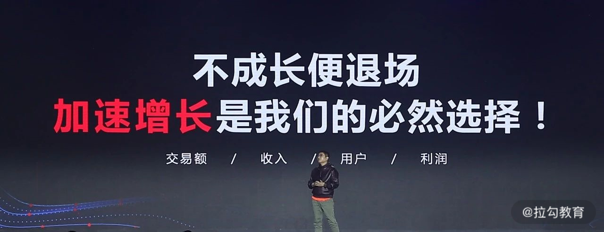
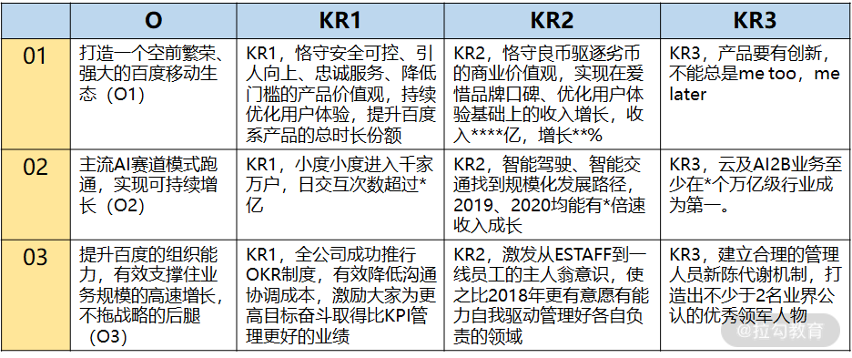

03 OKR 与战略：OKR 如何解决组织增长问题？
==========================

你好，我是留留老师。

如上一节所说，OKR 之所以火，互联网公司为什么如此热衷 OKR，是因为 OKR 可以帮助我们在 VUCA 环境下取得更好的经营效果，并能激活组织中的个体。

那么，组织中需要管理的目标到底跟什么相关？OKR 又是如何解决组织增长问题的呢？这两个问题如果不思考清楚，再好的目标管理方法和实践，可能只是在形式上做文章，而不能真正解决组织长期发展的根因问题。

### 组织的目标是如何确定的？

组织经营者在从事一项事业时都应该有自己的经营理论，这个经营理论首先需要解决三个基本问题：

* 一是组织的愿景是什么？
* 二是组织的特殊使命是什么？
* 三是完成组织使命所需的核心能力是什么？

> **愿景：组织最终想要去往的目的地，走向的远方 **，在大环境中想要的角色和定位，就是组织的愿景。** 使命：是一个组织因为什么而存在 **，是一个组织存在的价值理由，是支撑愿景实现的价值取向。** 核心能力 **：一个组织会面临具体的行业领域的细分，** 细分领域所拥有的知识和技术沉淀**，就是一个组织的核心能力，正是因为拥有了核心能力，组织履行使命才能有保障。

给你举个京东案例。

* 京东的愿景：成为全球最值得信赖的企业。
* 京东的使命：技术为本，致力于更高效和可持续的世界。
* 京东的核心能力：以供应链为基础的技术和服务公司。

京东的愿景，就是京东想要在整个行业和环境中的定位，是京东的终极奋斗目标。而想要成为全球最值得信赖的企业，就需要京东对这个世界有价值，这也是京东的使命：致力于更高效和可持续的世界。

使命是京东实现愿景的价值基石，不能让世界变得高效和可持续，京东便没有存在的意义，从而也就失去了实现愿景的机会。

最后，供应链是京东的核心能力，正是因为供应链的核心能力，才能让京东履行使命有保障，供应链是京东业务选择所依赖的能力基础，用来指导未来业务的扩展和创新方向。

所以，我们可以发现，组织长期目标对应的就是组织的愿景，而阶段性支撑愿景实现的目标就是基于组织核心能力的选择，我们常把这个选择称作战略。那么，基于组织核心能力选择的战略方向，对于组织的意义又是怎样的呢？

### 战略就是解决组织增长的问题

2020 开年，京东零售 CEO 徐雷进行了演讲，其确定了京东零售的主基调就是“有质量的加速增长”，并表示：“不成长便退场，加速增长是我们的必然选择。2020年，京东零售将在交易额、收入、用户、利润这四大核心指标上均实现加速增长。”而围绕增长主基调，京东所选择的三大必赢之战分别是：全渠道、下沉新兴市场和平台生态。在京东，战略选择的方向，内部被称为“必赢之战”。

从京东零售 CEO 徐雷的分享中，我们可以得到三个非常重要的对应关系：

> 1. 战略确定了组织目标方向，对应了上述的三大必赢之战；
> 2. 所选择的业务方向需要解决增长的问题，这就是上述提到的主基调；
> 3. 增长体现在指标上，对应了上述“四大核心指标”。

我们把这三个对应关系串成一句话：**由战略确定的组织目标，需要帮助组织解决增长的问题，并把增长反映在多维度的指标上。**换成京东的这个案例就是：由战略确定的“全渠道、下沉新兴市场和平台生态”这三个组织目标，需要帮助京东解决“有质量的加速增长”这个问题，并把增长指标反映在“交易额、收入、用户、利润这四大核心指标上”。这就是战略对于组织的意义，无论战略如何选择，最终都要增长。

在这里，我想提醒你：作为一个商业组织去实现战略目标（增长），还要匹配相应的能力。这个能力包括业务能力和人员的能力，以及组织文化、效率等方面的考虑。所以战略所选的方向以及带来的增长仅围绕交易额、收入、用户、利润这四大核心指标是不够的。所以，徐雷在 2020 京东零售开年大会上还表示：为了达成有质量的增长，京东还将在组织优化、文化建设、人才管理等方面进行全面优化、创新发展。

也就是说，我们不仅需要关注财务的指标，也要关注非财务的指标，不仅要关注业务上的，也要关注组织上的。有了以上的探讨作为基础，我们来看 OKR 到底是如何解决和支撑组织增长问题的呢？

### OKR 与组织战略的关系

首先，我们把目标管理 OKR 方法进行结构化展开：

> OKR = Objective + Key Results

Objective 就是目标，Key Results 就是多个关键结果。结合本课时上两个小节的分析，OKR 中的 O 对应的其实是战略确定的组织目标，KR 则对应的是所选战略方向的增长指标，即：

> OKR = 战略方向（O） + 多个增长指标（KRs）

接下来，我给你举一个百度李彦宏的 OKR 案例，看看 OKR 是如何与百度战略目标相匹配，又是如何支撑组织目标增长的。

2019 年春节前夕，百度元老崔珊珊在百度内部掀起了一场 OKR 变革风暴，这场风暴席卷了从最高决策层到最基层的几乎所有百度员工。作为百度的掌舵人，李彦宏也在第一时间为自己制定了 OKR：

通过李彦宏的 OKR，我帮你做以下三点分析：

1. 作为百度创始人兼 CEO，李彦宏的目标（O）就是百度的战略方向，一共包括了三个战略：打造移动生态、跑通 AI 商业模式以及提升组织能力。
2. 李彦宏的三个目标（O）中，**不仅仅包括了移动生态和 AI 赛道的业务目标，也包括了提升组织能力维度的非业务目标。** 换句话说，组织战略方向的选择不能仅仅局限于业务方向，也需要综合考虑组织能力的方向。
3. 李彦宏的每个目标（O），都有对应的 3 个 KR，3 个 KR 就是 3 个维度的增长量化结果。也就是说，每个战略方向，都需要制定多维度的增长指标。

这就是 OKR 与组织战略目标的关系，O 是选择的战略方向，KR 是所选方向的增长量化结果。每个组织会有多个战略方向（O），每个战略方向会有多个增长指标（KR）。

### 总结

这一课时，我主要帮你解答了三个核心问题。

* 通过什么方式来确定组织长短期目标？

组织长期目标对应的就是组织的愿景，而阶段性支撑愿景实现的目标，就是基于组织核心能力的选择，而这个选择就是组织的战略。

* 战略解决了组织什么核心问题？

战略要帮助组织解决增长的问题，并把增长反映在多维度的指标上。但要注意：战略的选择以及带来的增长我们不仅仅需要关注财务的指标，也要关注非财务的指标，不仅仅要关注业务上的，也要关注组织上的，这样才是关于组织目标如何选择以及组织如何增长的系统思考。

* OKR 与组织战略的关系是什么？

O 是选择的战略方向，KR 是所选方向的增长量化结果。每个组织会有多个战略方向（O），每个战略方向会有多个增长指标（KR）。

那么，你所在公司的使命愿景是什么？阶段性战略又是什么？战略如果继续拆成 OKR，你们会拆解成几个 O，几个 KR 呢？
