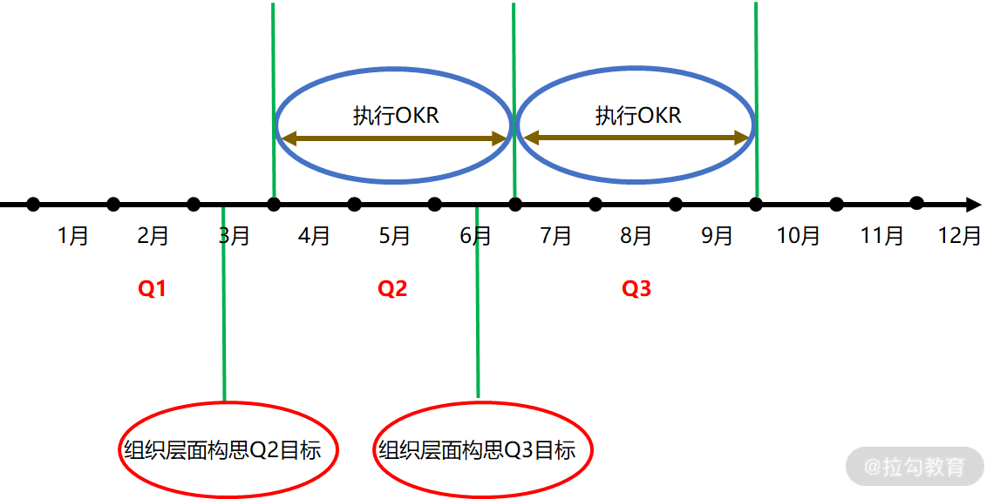
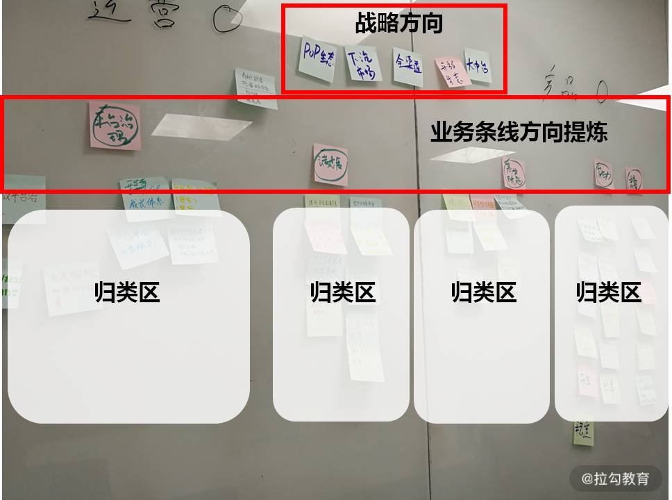
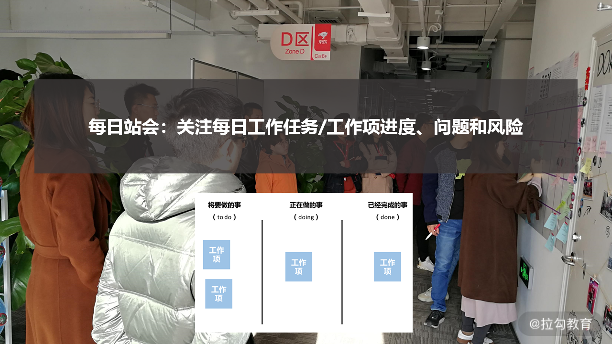
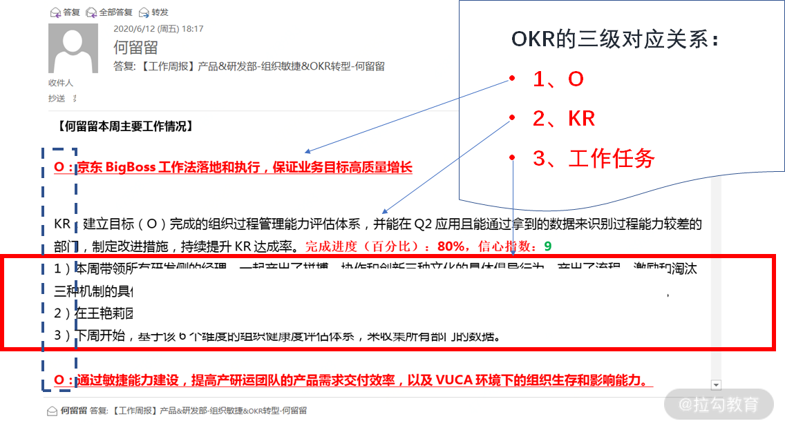
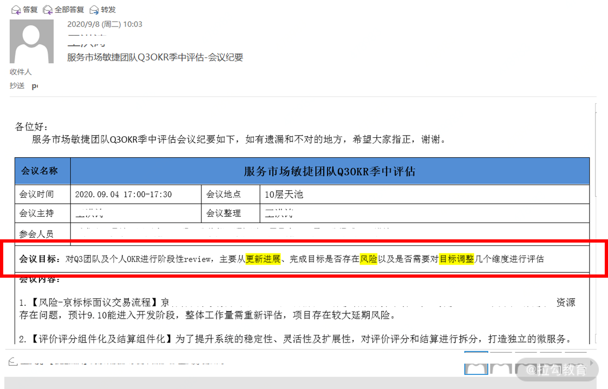
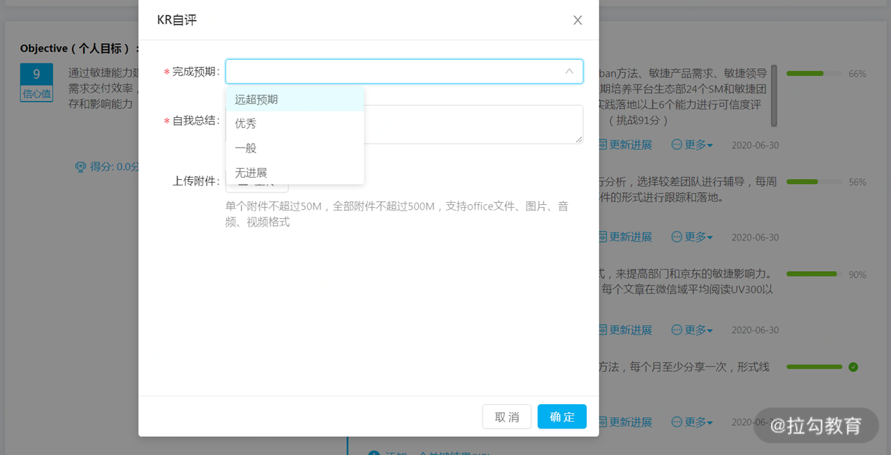

# 08 流程：你应该这样制定、管理 OKR

你好，我是留留。

在和你介绍完 O 和 KR 的实操后，相信你对如何写 OKR 已经胸有成竹。那在组织中，我们一般是在什么时候来写 OKR 呢？另外，我们经常会听到有人说“OKR 根本就落不了地”，出现这样的问题，我们到底该怎么解决呢？

其实，大部分组织 OKR 转型，落不了地的最重要原因是组织中缺少建立应用 OKR 的流程机制。流程的意义就是要解决 **“人”与“事”是否匹配的问题**。

在这里，“事”就是应用 OKR 的基本步骤。团队或组织打造一个基于应用 OKR 的工作流程，并按照这个流程跑起来，这时 OKR 就能嵌入日常工作当中，从而才能为 OKR 落地提供基本保障。那么，这个 OKR 流程要怎么做呢？

### OKR 的整体执行节奏

结合国内大部分组织的绩效管理节奏，我们可以按照季度来整体运营 OKR。

如上图所示，Q2 的整体 OKR 制定和管理节奏就是从 4 月初开始，然后 6 月底结束。如果要能跑顺这个节奏，就需要组织在 3 月中下旬就开始构思校准战略方向，然后 Q2 初，各个部门和团队就可以顺利地进行 Q2 的 OKR 制定和执行。

> 其他季度我们可以以此类推。如果没有提前对下个季度方向进行探讨和确认，那么整个 OKR 的制定节奏会有拖沓，从而组织绩效的获得就会有延迟且效率低下。

在以季度运营 OKR 的节奏中，每个季度，我们都需要让个人、团队和部门都能基于 OKR 的工作流程来展开工作。这个工作流程包含了三个阶段：

1.**季度初的 OKR 制定； **2.** 季度过程中的 OKR 检视和调整； **3.** 季度末的 OKR 闭环管理。**

我们先来看季度初如何来制定 OKR。

#### 1. 季度初的 OKR 制定

在 2019 年年底，我带领京东某个业务条线的团队（包括产、研、运各个职能角色）共创了多次 OKR 制定工作坊，来确定和共识该团队 2020 年 Q1 的工作方向和内容，整个工作坊的核心流程就是我们要掌握的季度初制定 OKR 的关键流程。

- 要有部门战略方向和部门负责人期望的输入，这样就确保团队的 OKR 制定方向对齐了组织战略方向。
- 团队各自先静默写出自认为的业务方向 O，然后让团队所有成员各自澄清所写的 O，并进行讨论和归类。
- 归类后，对不同类别的 O 精炼描述，共识出团队的多个业务方向 O。
- 针对每个 O，团队继续共创产出要达成的 KR。

为了方便你理解，我贴出了当时我们现场的一张照片。可以看到，在工作坊时，我们把京东零售的战略意图明确写出并贴在了看板上，对应着就是图中我标识的“ **战略方向** ”，这就是对于方向 O 制定层面上的输入。在集团战略方向的指引下，让团队成员先自己产出对业务条线未来想要做的方向 O，这样就保证了团队中产出 O 的方向是聚焦的，是能支撑战略的。

在团队成员各自产出了 O 后，我们会对每个 O 进行澄清，把属于表达同一个意思的 O 放在一起，也就是我图中的“ **归类区** ”。在这个案例中，我们当时一共归类了四个团队业务方向。有了四个业务方向的归类后， **继续在每个方向上进行概念化的提炼** ，提炼的过程就是对团队未来业务方向 O 共识的过程。

有了对于 O 的共识后，接下来就是产出每个 O 的 KR，在 KR 这个部分，需要不断地沟通和确认。这个团队后续在对于 KR 的共识上开了近 3 次的正式沟通会，非正式的沟通次数则更多， **直到团队和上下级都对最终 OKR 共识了为止** 。

在帮助该业务条线团队制定 OKR 的过程中，我们积累了很多宝贵的经验教训，在这也一同分享给你，期望你在制定 OKR 时能少踩坑，避免这些问题。

- **经验教训 1**：KR 需要有负责人，没有负责人的 KR，就没有落地的可能性；另外，KR 的负责人不清会导致在团队中分工边界不清，边界不清就会带来互相推诿的问题，从而让 KR 的完成也就没有了能具体明确的承接和推动人。
- **经验教训 2**：针对每个制定了的 KR，如果有的 KR 涉及外部依赖，就需要及时和依赖方、配合方确认可行性，KR 的负责人要主动找人沟通，不然自己一个人产出的 KR 会有很多缺陷。
- **经验教训 3**：作为团队或者部门 Leader 需要能及早参与，如果不能及时加入团队 OKR 的制定过程，就会导致信息不同步，带来很多重复思考和返工成本。
- **经验教训 4**：KR 的讨论不是一次性的，需要多次讨论梳理完善，所以我们不要期望 KR 像 O一样，能很快地共识出来。

那么，在制定完 OKR 后，接下来我们就进入执行 OKR 环节。在执行 OKR 的过程中，我们需要建立哪些机制，来跟进 OKR 的完成和变化情况呢？

#### 2. OKR 的过程检视&调整机制

我们通常是**建立以日、周、季中三个维度来针对目标完成过程的检视和调整机制 **，从而把控问题和风险，应对目标变化。** 日：每日站会**每日站会的意义在于跟进从 KR 拆解出来的工作项的进度、问题和风险。

在京东内部，团队会把工作项任务写在便签纸上并贴在物理看板透明出来，物理看板上会有三个命名为**to do | doing | done**纵向泳道（下图），然后站会时团队会围绕着该物理看板，并针对每个工作任务基于以下提问展开每日站会。

> 1、昨天的进度是怎样的？ 2、今天计划做什么？ 3、我遇到的阻碍/问题是什么？需要谁的协助？

每日站会时，团队成员需要在看板上及时更新工作项的状态。比如处于 doing 列的工作项如果做完了，就会移动到 done 列，然后会把 to do 列的高优先级的工作项再移至 doing 列。

此外，我们更需要关注暴露的问题，并针对每个问题圈定负责人，跟进问题的解决情况。这样，每天一个闭环，不仅有序地推进了 OKR 完成的进度，也能及时同步和解决问题。**周：周会/周报**

周会/周报的意义在于跟进既定 O 和 KR 的进度和风险，并管理目标的变化情况，看目标是否需要调整，是否有新出现的目标。

我以自己在京东 OKR 的周报为例（周会讨论的内容和周报类似），跟你分享相关的实践。我在周报中，会重点体现这三个维度的内容。

- **关注每个 O 下面的 KR 进度和风险。** 我在周报里会以完成进度的百分比作为进度量化的体现，在这个案例中就是标红部分的 80%；然后再以信心指数（1～10）作为该 KR 所面临问题或者风险的量化体现，也就是说，信心指数越低则说明完成 KR 有风险，需要重点跟进推动问题解决，自信指数越高则无风险，在这个案例中就是标绿部分的 9。
- **说明每个 KR 以周为单位，具体拆分出来的工作任务项完成情况。** 这里就对应了上述"每日站会"的内容，可以包括本周完成的工作项，如我周报里的 1）和 2），以及下周待做的工作任务，如我这里的 3），每天的工作紧紧围绕完成 KR 展开，就有力确保了 KR 的实现落地。
- **跟进变化和新增的 OKR。**在周报里，我还会呈现不在原有计划 OKR 中的工作内容，一旦出现这样的情况，就需要跟团队、该方向的依赖方以及上下级去沟通达成共识。共识后，就更新调整现有的 OKR 内容或是新增 OKR，然后就把这些 OKR 再次作为既定的 OKR 来进行管理和跟进。

我们可以看出，基于 OKR 的工作周报呈现三级对应关系，即多个工作任务支撑某个 KR 的实现，多个 KR 支撑某个 O 的实现，这三个层级组成了我们每周的具体工作内容。其中，KR 的完成进度百分比和信心指数是两个非常好用的实践，相当于是进度和风险的量化。最后，在周报中关注 OKR 的变化情况，就是对经营环境变化的及时响应。这样，每周一个闭环，有序推进了所有 OKR 完成进度，并体现了在日常工作中对变化的管理。**季中：整体 OKR 盘点 **季中 OKR 盘点的意义就是对个人、团队和部门的 OKR 进行回顾并把控整体进度和风险。在季中这个节点，** 需要组织中的管理者能与团队再次确认和共识目标**，这样对于最终季末产出的实际绩效结果，才更有保障。

在京东内部，由于组织结构和部门管理幅度很大的原因，我带领部门进行 OKR 季中盘点时，分为了两个层级，一个是部门管理者与经理层维度，一个是经理层与一线团队维度。

针对部门管理者与经理层季中的 OKR 盘点，我归类了盘点时需要注意的关键点。

- 讨论既定 OKR 的完成进度，以及存在的变化、问题和风险。
- 共识新出现的 OKR 推进情况，以及在季末的阶段性 KR。
- 对识别出的重大问题和风险，共识后续专题讨论的时间。

在经理层和一线团队季中的 OKR 盘点上，我们讨论和盘点内容类似，就像上图我贴出的某团队季中 OKR 评估的会议纪要邮件一样。

“会议目标”关心的是“ **对 Q3 团队及个人 OKR 进行阶段性 review，主要从更新进展、完成目标是否存在风险以及是否需要对目标调整这几个维度** ”。

在组织管理中，最怕的就是有人做的事情跟组织目标不相关，我们常把这个问题称为 **“人浮于事”**。当我们用 OKR 来管理组织目标，然后建立起每天、每周的工作过程都基于 OKR 来展开的机制，这样就能保证组织中所有人都是围绕组织目标在进行工作，不仅确保了战略能高效落地，也能提升组织管理效率。

此外，在有些组织绩效定完后，下级在一个季度内正式和上级都碰不了几次面，而基于 OKR 展开的日会和周会，则创造出了上下级不断对于目标完成进展和问题反馈的正式沟通条件，有利于建立起上下级良好的工作关系，这对于组织中领导力的提升起到了明显的促进作用。

而在季度中建立的 OKR 盘点机制，拉动了组织中的管理者和下级建立起了更加友好的针对绩效完成情况的反馈节点，这实则起到了提升管理者对绩效负责的管理能力。所以说，在组织里，建立起基于 OKR 的，以日、周、季中三个维度针对目标完成过程的检视和调整机制就显得格外重要。那么，当我们执行了这些过程机制后，到了季度末，我们又该怎么做？

#### 3. 季度末的 OKR 闭环管理

在季度末，我们需要基于 OKR 进行目标阶段性完成情况的闭环管理，这个闭环机制的建立，可以依托对 KR 的评价来完成。

在京东内部，季末我们会对每个 KR 进行评分，评分维度分为了“远超预期：1分”“优秀：0.7分”“一般：0.3分”“无进展：0分”4 种（如下图）。

具体评分时，包括了自评和他人评价两个部分。

- 自评的方式，就是自己给自己依托 4 个评分维度对每个 KR 进行完成结果的选择。
- 他人评价的方式，就是让完成该 OKR 的相关方从 4 个评分维度进行评价。

比如一个研发同学的 KR 评分，就会叫上产品经理、测试同学还有业务方来进行打分，这是因为研发的 KR 完成，依赖于业务方所提的需求，也依赖于产品经理的原型设计和需求沟通，还依赖于测试的质量保证。

在个人、上下级、横向完成目标依赖的各方对 KR 评分完毕后，每个 KR 就会得到一个分数总和，此时个人的每个 O 也会得到一个分值。这个分值是每个 KR 评分总和的加权平均得来。

> 比如某个 O 包含 3 个 KR，KR1、KR2 和 KR3 的优先级权重分别是 5、3、2，共有 5 个人进行了所有 KR 的评分，那么 O 得分的数值计算公式为：（0.5_K1 的评价分数总和+0.3_KR2 的得分总和+0.2\*KR3 的得分总和）/5，而每个 O 的最终得分范围就在 0~1 分之间。

还有一点需要注意，**在实际的 OKR 评分过程中，我们不能仅按照完成进度来打分高低。**

> 比如某个人的 OKR 内容毫无挑战性但是最终完成进度是 100%，那么我们在评价的时候可能给予是 0.3 分，也就是做得一般；而某个员工写的 OKR 很有挑战，完成率 70%，那么评价的分数反而是 0.7 分，因为在挑战的情况下能做到 70% 的进度已经很优秀了。如果这个员工的 OKR 很有挑战，完成率又是 100%，那么就可以评 1 分，远超预期。

所以 OKR 的打分，是结合完成进度和 KR 的挑战难度综合的评分。

从 OKR 评分的 4 个维度上，我们可以看出，OKR 倡导挑战和突破目标的设立和完成，最高分 1 分对应的是“远超预期”，而你做得相对“优秀”其实拿到的是 0.7 分，所以，OKR 不管从制定，还是在结果的评价上，都在鼓励个人去挑战更多可能性，每个人都去挑战去突破，那么一个组织的绩效结果就会突破。

OKR 季度闭环管理的目的就是在管理组织阶段性所获得的绩效结果，这个时候就会和激励相关，那么如何保证激励的公平性就显得很重要。OKR 的评分机制的设计，和我们360 度绩效评价的机理相同，从多个角色来把控个人的绩效完成情况，避免了因个人情感和考评偏差带来的组织腐败和不公平，更加客观。而且，基于 OKR 以绩效结果导向来进行激励，而非基于关系好、人品好等非绩效因素的激励，才真正确保了激励的有效性。

### 小结

每个组织的目标管理周期并不相同，比如字节跳动就是每两个月制定一次 OKR，我这里介绍的是按照自然季度来执行的样本，你在实际运用中可以针对自己组织的业务特点，找到适合自己团队和组织的 OKR 制定和流程管理节奏，然后参考我季度制定流程中的相关实践把 OKR 落下去。

那么，在学习了本课时后，你觉得哪些 OKR 流程实践非常好用？你的组织中是否还有一些创新的玩法呢？你在落地 OKR 流程时还面临了哪些困难？欢迎你在留言区分享你的经验和问题，我会帮你答疑解惑。

有了能确保 OKR 落地的流程，我们随之需要改变的就是组织中的管理方式。基于 KPI 的管理模式带来了越来越僵化的组织状态，那么基于 OKR 的管理方式有何不同呢？

在下一课时，我将介绍“OKR 和 KPI 的联系和区别”。
